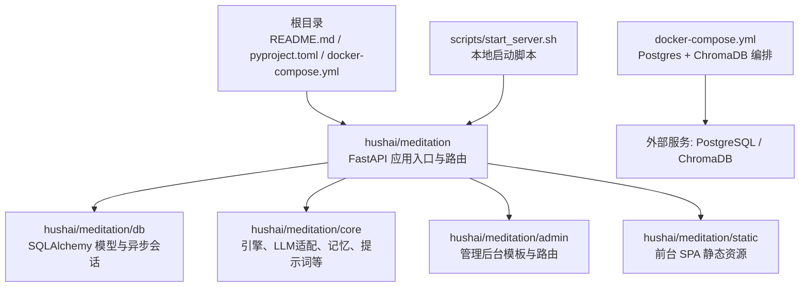
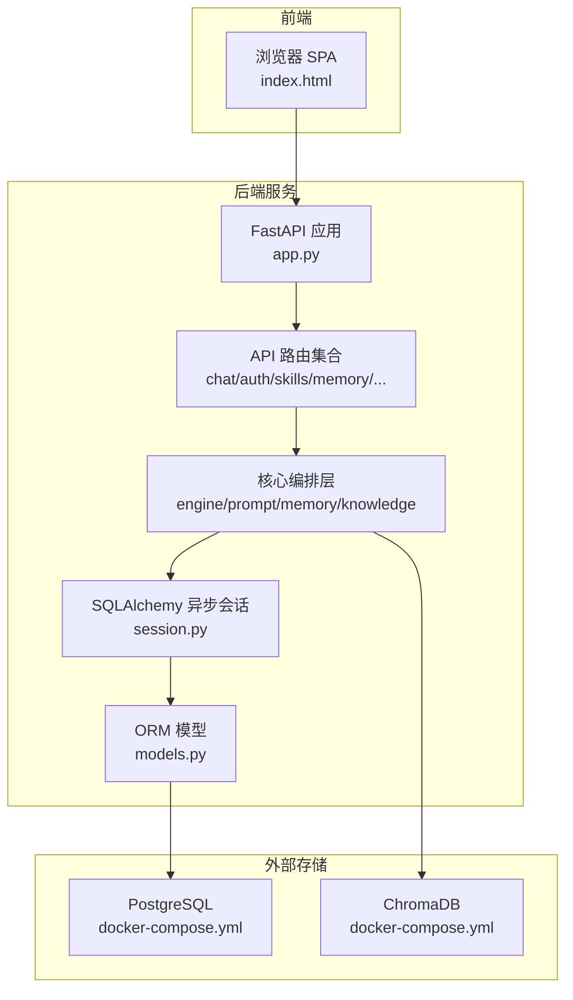
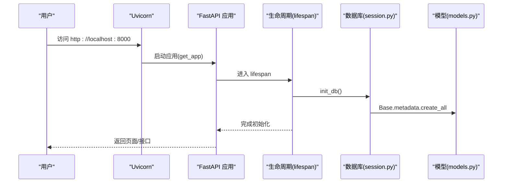
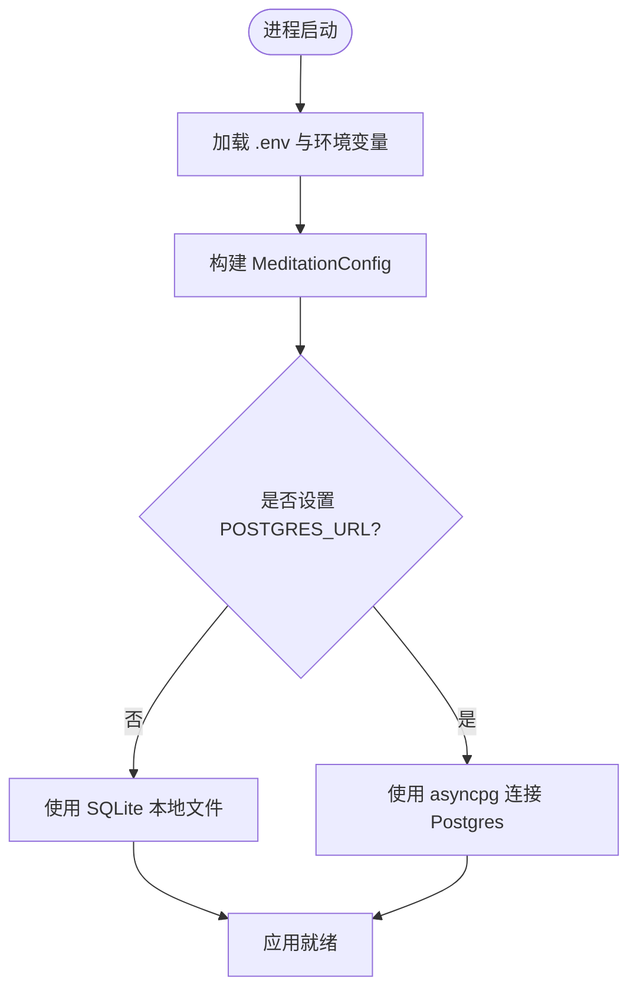
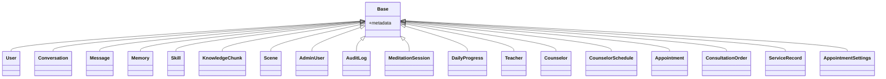
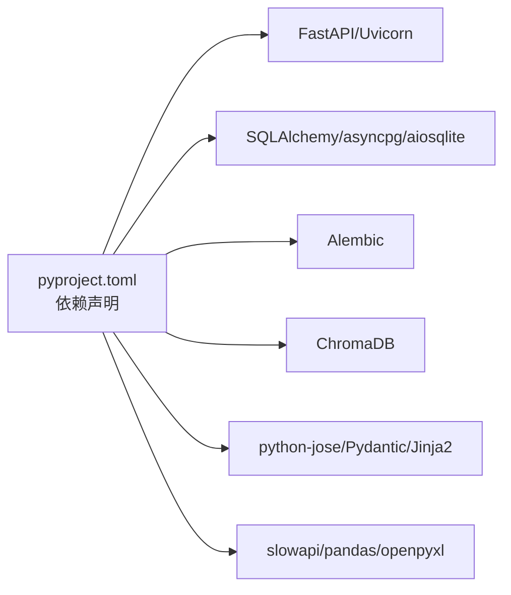

# 快速开始

<cite>
**本文引用的文件列表**
- [README.md](file://README.md)
- [pyproject.toml](file://pyproject.toml)
- [docker-compose.yml](file://docker-compose.yml)
- [hushai/meditation/app.py](file://hushai/meditation/app.py)
- [hushai/meditation/config.py](file://hushai/meditation/config.py)
- [scripts/start_server.sh](file://scripts/start_server.sh)
- [hushai/meditation/db/session.py](file://hushai/meditation/db/session.py)
- [hushai/meditation/db/models.py](file://hushai/meditation/db/models.py)
- [hushai/meditation/db/migrations/env.py](file://hushai/meditation/db/migrations/env.py)
</cite>

## 目录
1. [简介](#简介)
2. [项目结构](#项目结构)
3. [核心组件](#核心组件)
4. [架构总览](#架构总览)
5. [详细组件分析](#详细组件分析)
6. [依赖关系分析](#依赖关系分析)
7. [性能与扩展建议](#性能与扩展建议)
8. [故障排除指南](#故障排除指南)
9. [结论](#结论)
10. [附录：环境变量与端口清单](#附录环境变量与端口清单)

## 简介
本指南面向首次接触 hush.ai 的用户，目标是帮助你在最短时间内完成本地开发环境搭建、容器化部署，并顺利体验冥想对话、记忆与知识增强等核心功能。你将了解：
- 运行环境要求（Python 3.9+、PostgreSQL、ChromaDB）
- 本地开发环境的完整步骤（依赖安装、环境变量配置、数据库初始化）
- Docker Compose 一键拉起服务的方法
- 生产环境部署要点与最佳实践
- 常见问题排查思路

## 项目结构
仓库采用“应用包 + 模块”的组织方式，冥想 Web 服务位于 hushai/meditation 下，包含 API 路由、核心业务逻辑、数据库模型与迁移、管理后台与静态资源等。根目录提供构建与运行所需的项目元数据、Docker Compose 编排与启动脚本。

图表来源
- [README.md](file://README.md)
- [pyproject.toml](file://pyproject.toml)
- [docker-compose.yml](file://docker-compose.yml)
- [hushai/meditation/app.py](file://hushai/meditation/app.py)

章节来源
- [README.md](file://README.md)
- [pyproject.toml](file://pyproject.toml)

## 核心组件
- FastAPI 应用与生命周期
  - 应用创建、中间件注册、路由挂载、静态资源挂载、健康检查端点均在应用入口中完成。
  - 启动时执行数据库初始化、默认管理员与导师数据初始化。
- 配置系统
  - 通过 .env 与环境变量加载 MeditationConfig，支持 Postgres/SQLite、ChromaDB、JWT、多 LLM 提供商、嵌入向量、CORS、调试开关等。
- 数据库层
  - 使用 SQLAlchemy 异步引擎与 Session，自动选择 SQLite 或 asyncpg；启动时根据模型创建表。
  - 提供 Alembic 迁移框架的异步执行入口。
- 外部服务
  - PostgreSQL：持久化用户、会话、记忆、技能、场景、预约等业务数据。
  - ChromaDB：向量检索，支撑知识库与记忆向量化。

章节来源
- [hushai/meditation/app.py](file://hushai/meditation/app.py)
- [hushai/meditation/config.py](file://hushai/meditation/config.py)
- [hushai/meditation/db/session.py](file://hushai/meditation/db/session.py)
- [hushai/meditation/db/models.py](file://hushai/meditation/db/models.py)
- [hushai/meditation/db/migrations/env.py](file://hushai/meditation/db/migrations/env.py)

## 架构总览
下图展示了从浏览器到后端服务再到数据存储的整体交互路径，包括认证、对话、记忆与知识检索等关键流程。

图表来源
- [hushai/meditation/app.py](file://hushai/meditation/app.py)
- [hushai/meditation/db/session.py](file://hushai/meditation/db/session.py)
- [hushai/meditation/db/models.py](file://hushai/meditation/db/models.py)
- [docker-compose.yml](file://docker-compose.yml)

## 详细组件分析

### 应用入口与生命周期
- 应用创建
  - 设置 OpenAPI 文档地址、注册限流中间件、CORS 中间件、挂载静态资源与健康检查端点。
- 生命周期钩子
  - 启动阶段：读取配置、初始化日志、初始化数据库、创建默认管理员与导师、创建全局预约配置。
  - 关闭阶段：释放数据库连接。

图表来源
- [hushai/meditation/app.py](file://hushai/meditation/app.py)
- [hushai/meditation/db/session.py](file://hushai/meditation/db/session.py)
- [hushai/meditation/db/models.py](file://hushai/meditation/db/models.py)

章节来源
- [hushai/meditation/app.py](file://hushai/meditation/app.py)

### 配置与环境变量
- 配置文件加载
  - 优先从项目根目录 .env 加载，再合并环境变量。
- 关键配置项
  - 数据库：MEDITATION_POSTGRES_URL（留空则使用 SQLite）
  - 向量库：MEDITATION_CHROMA_DIR（本地持久化目录）
  - JWT：MEDITATION_JWT_SECRET、算法与过期时间
  - LLM：默认提供商与模型、各厂商 Key/BaseURL/Model
  - 检索与上下文：memory_top_k、knowledge_top_k、conversation_max_turns
  - 嵌入：embedding_provider/model/key/base_url
  - 服务：host/port/debug/cors_origins
  - 支付与加密：微信支付相关字段、encryption_key

图表来源
- [hushai/meditation/config.py](file://hushai/meditation/config.py)
- [hushai/meditation/db/session.py](file://hushai/meditation/db/session.py)

章节来源
- [hushai/meditation/config.py](file://hushai/meditation/config.py)
- [hushai/meditation/db/session.py](file://hushai/meditation/db/session.py)

### 数据库与迁移
- 会话与引擎
  - 根据配置自动选择 SQLite 或 asyncpg，创建异步引擎与会话工厂。
- 初始化
  - 启动时调用 create_all 基于模型生成表结构。
- 迁移
  - 提供 Alembic 异步执行入口，便于后续版本演进。

图表来源
- [hushai/meditation/db/models.py](file://hushai/meditation/db/models.py)

章节来源
- [hushai/meditation/db/session.py](file://hushai/meditation/db/session.py)
- [hushai/meditation/db/models.py](file://hushai/meditation/db/models.py)
- [hushai/meditation/db/migrations/env.py](file://hushai/meditation/db/migrations/env.py)

### 本地开发环境搭建（从零到运行）
- 前置要求
  - Python 3.9+
  - 可选：PostgreSQL（推荐用于生产）、ChromaDB（可选，用于向量检索）
- 步骤
  1) 克隆仓库并进入目录
  2) 创建虚拟环境并激活
  3) 安装带 meditation 可选依赖的安装包
  4) 准备环境变量（至少配置 JWT 密钥与必要的 LLM Key）
  5) 启动服务（脚本会自动设置调试模式与默认 JWT 密钥）
  6) 访问前台与管理后台、查看 API 文档

说明
- 若未设置 MEDITATION_POSTGRES_URL，将自动使用 SQLite 本地文件，适合快速体验。
- 如需使用 PostgreSQL，请确保数据库已创建并可连接，并在环境变量中设置对应 URL。
- 如需使用 ChromaDB，可在本地运行或通过 Docker Compose 启动，并将 MEDITATION_CHROMA_DIR 指向本地目录或使用远程服务。

章节来源
- [README.md](file://README.md)
- [pyproject.toml](file://pyproject.toml)
- [scripts/start_server.sh](file://scripts/start_server.sh)
- [hushai/meditation/config.py](file://hushai/meditation/config.py)
- [hushai/meditation/db/session.py](file://hushai/meditation/db/session.py)

### Docker 容器化部署（Compose）
- 使用 docker compose 一键拉起 PostgreSQL 与 ChromaDB
- 在宿主机设置必要的环境变量后，启动服务即可

步骤
1) 准备环境变量（见附录清单），至少包含数据库与 JWT 相关项
2) 启动依赖服务：docker compose up -d
3) 启动应用服务（可参考 README 中的生产示例）
4) 验证健康检查与页面访问

注意
- 默认镜像为 postgres:16-alpine 与 chromadb/chroma:latest
- 数据通过命名卷持久化，避免重启丢失

章节来源
- [docker-compose.yml](file://docker-compose.yml)
- [README.md](file://README.md)

### 生产环境部署要点
- 安全
  - 必须设置强随机 MEDITATION_JWT_SECRET，禁止使用默认值
  - 严格限制 CORS 来源，仅在 debug=True 时放宽
  - 仅暴露必要端口，使用反向代理与 HTTPS
- 稳定性
  - 使用 PostgreSQL 替代 SQLite
  - 合理设置连接池大小与超时
  - 启用限流与错误上报
- 可观测性
  - 集中日志、指标采集、健康检查端点接入监控
- 数据备份
  - 定期备份 PostgreSQL 与 ChromaDB 数据卷

章节来源
- [hushai/meditation/app.py](file://hushai/meditation/app.py)
- [hushai/meditation/config.py](file://hushai/meditation/config.py)
- [docker-compose.yml](file://docker-compose.yml)

## 依赖关系分析
- 运行时依赖
  - FastAPI、Uvicorn、SQLAlchemy(async)、asyncpg、aiosqlite、Alembic、ChromaDB、python-jose、Pydantic、Jinja2、slowapi、pandas/openpyxl 等
- 可选依赖分组
  - dev：测试、格式化、类型检查、安全扫描
  - meditation：Web 服务与冥想功能所需的全部依赖

图表来源
- [pyproject.toml](file://pyproject.toml)

章节来源
- [pyproject.toml](file://pyproject.toml)

## 性能与扩展建议
- 数据库
  - 生产环境使用 PostgreSQL，开启索引与连接池优化
  - 对高频查询字段建立合适索引（如用户 ID、日期范围）
- 向量检索
  - 合理设置 knowledge_top_k 与 memory_top_k，平衡召回与延迟
  - 对大语料进行分块与去重，减少冗余
- 限流与降级
  - 保持 slowapi 限流策略，防止滥用
  - 对 LLM 调用增加重试与降级策略
- 缓存
  - 对热点配置与字典数据做内存缓存
- 水平扩展
  - 无状态服务横向扩容，共享外部数据库与向量库

[本节为通用建议，不直接分析具体文件]

## 故障排除指南
- 无法连接数据库
  - 检查 MEDITATION_POSTGRES_URL 是否正确，确认网络可达与账号权限
  - 若使用 SQLite，确认工作目录有写权限
- 启动失败或端口占用
  - 检查 MEDITATION_PORT 是否与已有服务冲突
  - 查看应用日志定位异常堆栈
- 跨域问题
  - 生产环境需显式配置 cors_origins，避免使用通配符
- 向量库不可用
  - 确认 ChromaDB 服务可用且 MEDITATION_CHROMA_DIR 路径有效
- 鉴权失败
  - 确认 MEDITATION_JWT_SECRET 一致且未泄露
- 限流触发
  - 调整限流阈值或客户端请求频率

章节来源
- [hushai/meditation/config.py](file://hushai/meditation/config.py)
- [hushai/meditation/app.py](file://hushai/meditation/app.py)
- [hushai/meditation/db/session.py](file://hushai/meditation/db/session.py)

## 结论
通过以上步骤，你可以在本地快速运行 hush.ai，体验冥想对话、记忆与知识增强等功能；在生产环境中，结合 PostgreSQL、ChromaDB 与合理的配置与安全策略，可获得稳定可靠的部署效果。建议在上线前完善日志、监控与备份方案，并根据实际负载调优参数。

[本节为总结性内容，不直接分析具体文件]

## 附录：环境变量与端口清单
- 关键环境变量
  - MEDITATION_POSTGRES_URL：数据库连接 URL（留空则使用 SQLite）
  - MEDITATION_CHROMA_DIR：ChromaDB 本地持久化目录
  - MEDITATION_JWT_SECRET：JWT 签名密钥
  - MEDITATION_DEFAULT_LLM_PROVIDER：默认 LLM 提供商
  - MEDITATION_OPENAI_API_KEY：OpenAI API Key
  - MEDITATION_KNOWLEDGE_TOP_K：知识库检索数量
  - MEDITATION_CONVERSATION_MAX_TURNS：上下文最大轮数
  - MEDITATION_HOST/MEDITATION_PORT：服务监听地址与端口
  - MEDITATION_DEBUG：调试开关
  - 其他：各类 LLM 与嵌入模型的 Key/BaseURL/Model、CORS 来源、支付与加密配置等
- 常用端口
  - 8000：应用服务（可通过 MEDITATION_PORT 修改）
  - 5432：PostgreSQL（Docker Compose 默认映射）
  - 8001：ChromaDB（Docker Compose 默认映射）

章节来源
- [README.md](file://README.md)
- [hushai/meditation/config.py](file://hushai/meditation/config.py)
- [docker-compose.yml](file://docker-compose.yml)