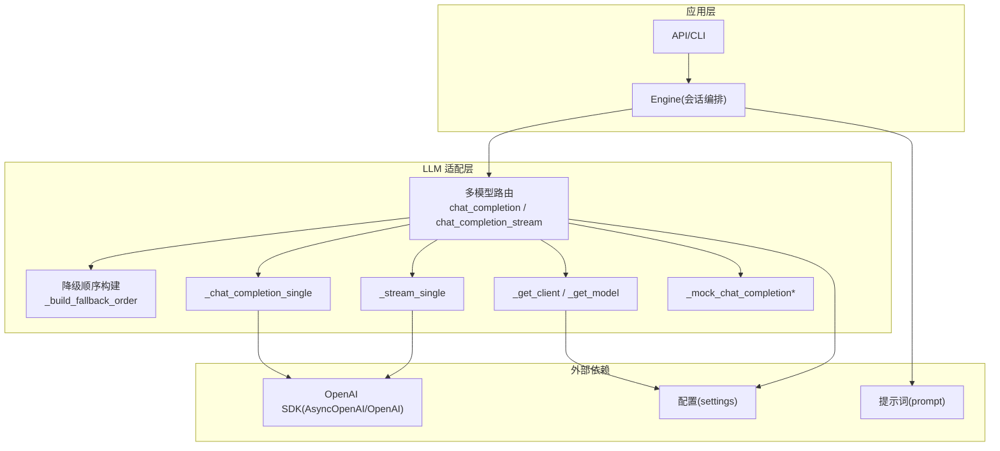
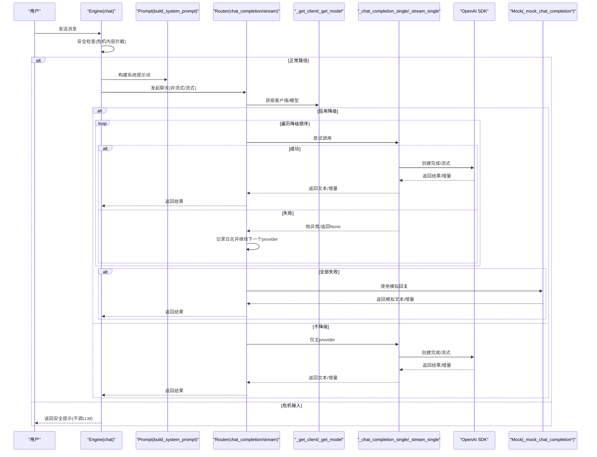
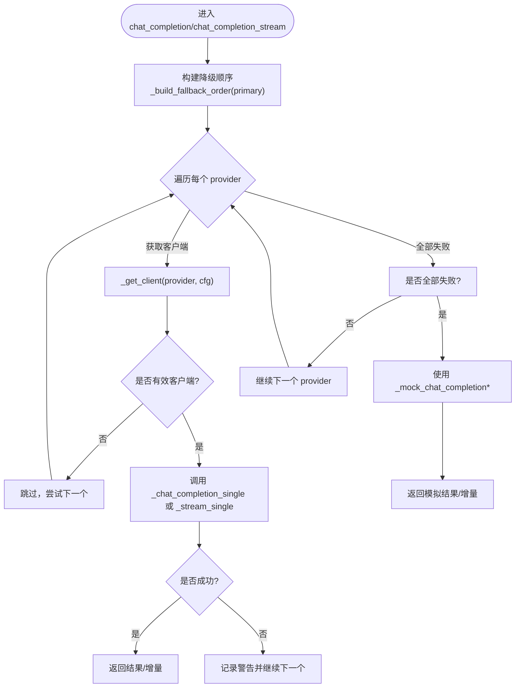
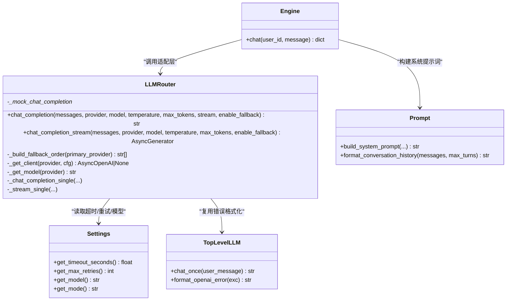

# LLM 调用优化

<cite>
**本文引用的文件**   
- [hushai/meditation/core/llm.py](file://hushai/meditation/core/llm.py)
- [hushai/llm.py](file://hushai/llm.py)
- [hushai/settings.py](file://hushai/settings.py)
- [hushai/meditation/core/prompt.py](file://hushai/meditation/core/prompt.py)
- [hushai/meditation/core/engine.py](file://hushai/meditation/core/engine.py)
- [tests/meditation/test_llm_core.py](file://tests/meditation/test_llm_core.py)
- [tests/meditation/test_engine_safety.py](file://tests/meditation/test_engine_safety.py)
</cite>

## 目录
1. [引言](#引言)
2. [项目结构](#项目结构)
3. [核心组件](#核心组件)
4. [架构总览](#架构总览)
5. [详细组件分析](#详细组件分析)
6. [依赖分析](#依赖分析)
7. [性能考量](#性能考量)
8. [故障排查指南](#故障排查指南)
9. [结论](#结论)
10. [附录](#附录)

## 引言
本技术文档围绕 hush.ai 的 LLM 调用链路，系统性梳理多模型适配层、智能路由与降级、请求与网络优化、提示词工程、以及可靠性保障机制。目标是为开发者提供可落地的性能调优指南与最佳实践，帮助在复杂供应商生态下实现高可用、低延迟、可控成本的对话服务。

## 项目结构
与 LLM 调用优化直接相关的代码主要分布在以下模块：
- 多模型适配与自动降级：hushai/meditation/core/llm.py
- 顶层 OpenAI 兼容调用与错误格式化：hushai/llm.py
- 配置解析（超时、重试、模型、模式等）：hushai/settings.py
- 提示词构建与上下文组装：hushai/meditation/core/prompt.py
- 引擎编排与安全拦截：hushai/meditation/core/engine.py
- 相关测试用例：tests/meditation/test_llm_core.py、tests/meditation/test_engine_safety.py

图表来源
- [hushai/meditation/core/llm.py:1-258](file://hushai/meditation/core/llm.py#L1-L258)
- [hushai/llm.py:1-142](file://hushai/llm.py#L1-L142)
- [hushai/settings.py:1-226](file://hushai/settings.py#L1-L226)
- [hushai/meditation/core/prompt.py:1-130](file://hushai/meditation/core/prompt.py#L1-L130)
- [hushai/meditation/core/engine.py:255-288](file://hushai/meditation/core/engine.py#L255-L288)

章节来源
- [hushai/meditation/core/llm.py:1-258](file://hushai/meditation/core/llm.py#L1-L258)
- [hushai/llm.py:1-142](file://hushai/llm.py#L1-L142)
- [hushai/settings.py:1-226](file://hushai/settings.py#L1-L226)
- [hushai/meditation/core/prompt.py:1-130](file://hushai/meditation/core/prompt.py#L1-L130)
- [hushai/meditation/core/engine.py:255-288](file://hushai/meditation/core/engine.py#L255-L288)

## 核心组件
- 多模型路由与自动降级
  - 统一入口：chat_completion（非流式）、chat_completion_stream（流式）
  - 降级顺序：_build_fallback_order 保证主提供商优先，其余按默认顺序补齐并去重
  - 客户端获取：_get_client 负责从配置构造 AsyncOpenAI；debug 且无 key 时返回 None，走 mock 分支
  - 单次调用封装：_chat_completion_single 捕获异常返回 None 以驱动降级
  - 流式封装：_stream_single 抛出异常由上层捕获并触发降级
  - 模拟回复：_mock_chat_completion / _mock_chat_completion_stream 用于调试或全量失败兜底

- 顶层 OpenAI 兼容调用
  - chat_once：基于 OpenAI SDK 的一次性调用，支持 extra_body 透传（如 kimi-k2 的 thinking 开关）
  - format_openai_error：将 OpenAIError 子类转换为可读中文错误信息

- 配置与运行时参数
  - get_timeout_seconds / get_max_retries：从环境变量或配置文件读取超时与重试次数
  - get_model / get_mode：模型与对话模式选择，影响系统提示词拼接

- 提示词工程
  - build_system_prompt：根据 teacher_description、场景、技能、记忆、历史等动态拼装
  - format_conversation_history：控制历史长度，避免过长上下文

- 引擎编排与安全拦截
  - engine.chat：在调用 LLM 前进行安全检查，危机输入直接返回安全提示，不调用外部模型

章节来源
- [hushai/meditation/core/llm.py:53-258](file://hushai/meditation/core/llm.py#L53-L258)
- [hushai/llm.py:73-142](file://hushai/llm.py#L73-L142)
- [hushai/settings.py:174-218](file://hushai/settings.py#L174-L218)
- [hushai/meditation/core/prompt.py:77-130](file://hushai/meditation/core/prompt.py#L77-L130)
- [hushai/meditation/core/engine.py:255-288](file://hushai/meditation/core/engine.py#L255-L288)

## 架构总览
下图展示一次典型对话从引擎到多模型适配层的完整流程，包括安全拦截、提示词构建、路由与降级、以及流式输出。

图表来源
- [hushai/meditation/core/engine.py:255-288](file://hushai/meditation/core/engine.py#L255-L288)
- [hushai/meditation/core/prompt.py:77-130](file://hushai/meditation/core/prompt.py#L77-L130)
- [hushai/meditation/core/llm.py:136-258](file://hushai/meditation/core/llm.py#L136-L258)

## 详细组件分析

### 多模型适配层与自动降级
- 设计要点
  - 主提供商优先：通过 _build_fallback_order 确保 primary_provider 始终排在首位
  - 去重与补齐：DEFAULT_PROVIDER_ORDER 作为候选池，结合 seen 集合避免重复
  - 失败处理：非流式返回 None 驱动循环；流式捕获 OpenAIError 继续下一个 provider
  - 调试友好：debug 且无 key 时 _get_client 返回 None，走 mock 分支，便于本地联调
  - 日志与可观测性：fallback 发生时记录 info/warning，便于定位问题

图表来源
- [hushai/meditation/core/llm.py:82-178](file://hushai/meditation/core/llm.py#L82-L178)
- [hushai/meditation/core/llm.py:208-258](file://hushai/meditation/core/llm.py#L208-L258)

章节来源
- [hushai/meditation/core/llm.py:82-178](file://hushai/meditation/core/llm.py#L82-L178)
- [hushai/meditation/core/llm.py:208-258](file://hushai/meditation/core/llm.py#L208-L258)
- [tests/meditation/test_llm_core.py:41-111](file://tests/meditation/test_llm_core.py#L41-L111)

### 顶层 OpenAI 兼容调用与错误处理
- chat_once
  - 依据 settings 中的超时与重试参数构造 OpenAI 客户端
  - 针对特定模型（如 kimi-k2）透传 extra_body 参数
  - 统一错误转换：format_openai_error 将各类 OpenAIError 转为中文说明
- 适用场景
  - CLI 或简单脚本快速调用
  - 需要精确控制 model、timeout、retries 的场景

章节来源
- [hushai/llm.py:100-142](file://hushai/llm.py#L100-L142)
- [hushai/llm.py:81-98](file://hushai/llm.py#L81-L98)
- [hushai/settings.py:189-218](file://hushai/settings.py#L189-L218)

### 配置与运行时参数
- 关键参数
  - 超时：LLM_TIMEOUT / llm_timeout，默认 60s
  - 重试：LLM_MAX_RETRIES / llm_max_retries，默认 2
  - 模型：LLM_MODEL / llm_model，默认 gpt-4o-mini
  - 模式：HUSH_MODE / hush_mode，支持 calm/focus/hype/plain/pua
- 行为差异
  - debug 模式下 _get_client 使用更长超时（120s），并在无 key 时返回 None 走 mock
  - 顶层 chat_once 使用 settings 的 timeout/retries 构造客户端

章节来源
- [hushai/settings.py:174-218](file://hushai/settings.py#L174-L218)
- [hushai/meditation/core/llm.py:59-71](file://hushai/meditation/core/llm.py#L59-L71)
- [hushai/llm.py:113-118](file://hushai/llm.py#L113-L118)

### 提示词优化与上下文管理
- 动态拼装
  - build_system_prompt 组合角色设定、场景、技能、知识、记忆、历史、安全边界等
  - format_conversation_history 限制最近轮次，避免上下文过长导致 token 浪费
- 优化建议
  - 合理设置 max_turns，平衡上下文完整性与成本
  - 按需注入 knowledge/memory/skills 片段，减少无关信息
  - 对长对话采用摘要或分段策略，降低整体 token 消耗

章节来源
- [hushai/meditation/core/prompt.py:77-130](file://hushai/meditation/core/prompt.py#L77-L130)

### 引擎编排与安全拦截
- 安全前置
  - engine.chat 在调用 LLM 之前执行安全检查，若检测到危机内容，直接返回安全提示，不调用外部模型
- 持久化与审计
  - 即使拦截，仍会持久化用户消息与助手回复，便于审计与追踪

章节来源
- [hushai/meditation/core/engine.py:255-288](file://hushai/meditation/core/engine.py#L255-L288)
- [tests/meditation/test_engine_safety.py:57-114](file://tests/meditation/test_engine_safety.py#L57-L114)

## 依赖分析
- 组件耦合
  - 适配层依赖配置（settings）与 OpenAI SDK，并通过 format_openai_error 复用顶层错误处理
  - 引擎依赖适配层与提示词模块，形成“编排-适配-提示”三层解耦
- 外部依赖
  - OpenAI SDK：统一接口抽象，屏蔽不同供应商差异
  - httpx：其他外部服务调用（如远程知识库、支付）使用独立超时策略

图表来源
- [hushai/meditation/core/llm.py:53-258](file://hushai/meditation/core/llm.py#L53-L258)
- [hushai/llm.py:73-142](file://hushai/llm.py#L73-L142)
- [hushai/settings.py:174-218](file://hushai/settings.py#L174-L218)
- [hushai/meditation/core/prompt.py:77-130](file://hushai/meditation/core/prompt.py#L77-L130)
- [hushai/meditation/core/engine.py:255-288](file://hushai/meditation/core/engine.py#L255-L288)

章节来源
- [hushai/meditation/core/llm.py:53-258](file://hushai/meditation/core/llm.py#L53-L258)
- [hushai/llm.py:73-142](file://hushai/llm.py#L73-L142)
- [hushai/settings.py:174-218](file://hushai/settings.py#L174-L218)
- [hushai/meditation/core/prompt.py:77-130](file://hushai/meditation/core/prompt.py#L77-L130)
- [hushai/meditation/core/engine.py:255-288](file://hushai/meditation/core/engine.py#L255-L288)

## 性能考量
- 路由与降级
  - 主提供商优先，失败后快速切换，减少端到端延迟抖动
  - 去重与有序降级避免无效重试
- 超时与重试
  - 通过 settings 集中管理超时与重试，适配不同网络环境与供应商 SLA
  - debug 模式延长超时，提升本地联调稳定性
- 流式输出
  - 首字节时间显著降低，提升用户体验
  - 流式失败时立即降级，避免长时间阻塞
- 上下文压缩
  - 限制历史轮次，按需注入知识与记忆，控制 token 用量
- 并发与连接池
  - 使用 AsyncOpenAI 异步客户端，配合事件循环提高吞吐
  - 注意各供应商并发限制，必要时在上层增加限流

[本节为通用性能指导，无需具体文件引用]

## 故障排查指南
- 常见错误与定位
  - 未配置 API Key：_get_client 在 debug 外会抛出 RuntimeError；debug 模式返回 None 走 mock
  - 网络/认证/权限/速率限制：format_openai_error 提供中文提示，便于快速定位
  - 全部 provider 失败：回退至 mock 回复，检查 last_exc 是否为 None 以区分“无 key”与“全部失败”
- 日志与观测
  - fallback 与失败均记录日志，关注 “LLM fallback/stream fallback/provider failed” 关键字
- 测试验证
  - 单元测试覆盖降级顺序、流式生成器语义、失败传播与 mock 分支

章节来源
- [hushai/meditation/core/llm.py:59-71](file://hushai/meditation/core/llm.py#L59-L71)
- [hushai/llm.py:81-98](file://hushai/llm.py#L81-L98)
- [hushai/meditation/core/llm.py:131-133](file://hushai/meditation/core/llm.py#L131-L133)
- [hushai/meditation/core/llm.py:236-245](file://hushai/meditation/core/llm.py#L236-L245)
- [tests/meditation/test_llm_core.py:61-111](file://tests/meditation/test_llm_core.py#L61-L111)

## 结论
hush.ai 的 LLM 调用优化以“多模型适配+自动降级+流式输出+提示词工程+安全前置”为核心，形成高可用、低延迟、可观测的对话服务。通过统一的配置管理与错误格式化，系统在复杂供应商环境下具备良好弹性与可维护性。建议在生产环境持续完善监控指标（响应时间、错误率、降级比例、token 用量），并结合业务特征动态调整上下文长度与降级顺序，以实现更优的性能与成本平衡。

[本节为总结性内容，无需具体文件引用]

## 附录
- 最佳实践清单
  - 明确主提供商与降级顺序，结合供应商 SLA 与成本策略
  - 合理设置超时与重试，区分 debug 与生产环境
  - 使用流式输出改善首字延迟
  - 控制上下文长度，按需注入知识与记忆
  - 在调用前进行安全检查，避免敏感内容外发
  - 完善日志与告警，覆盖 fallback、失败与 mock 分支
  - 通过单元测试覆盖关键路径与异常分支

[本节为通用指导，无需具体文件引用]