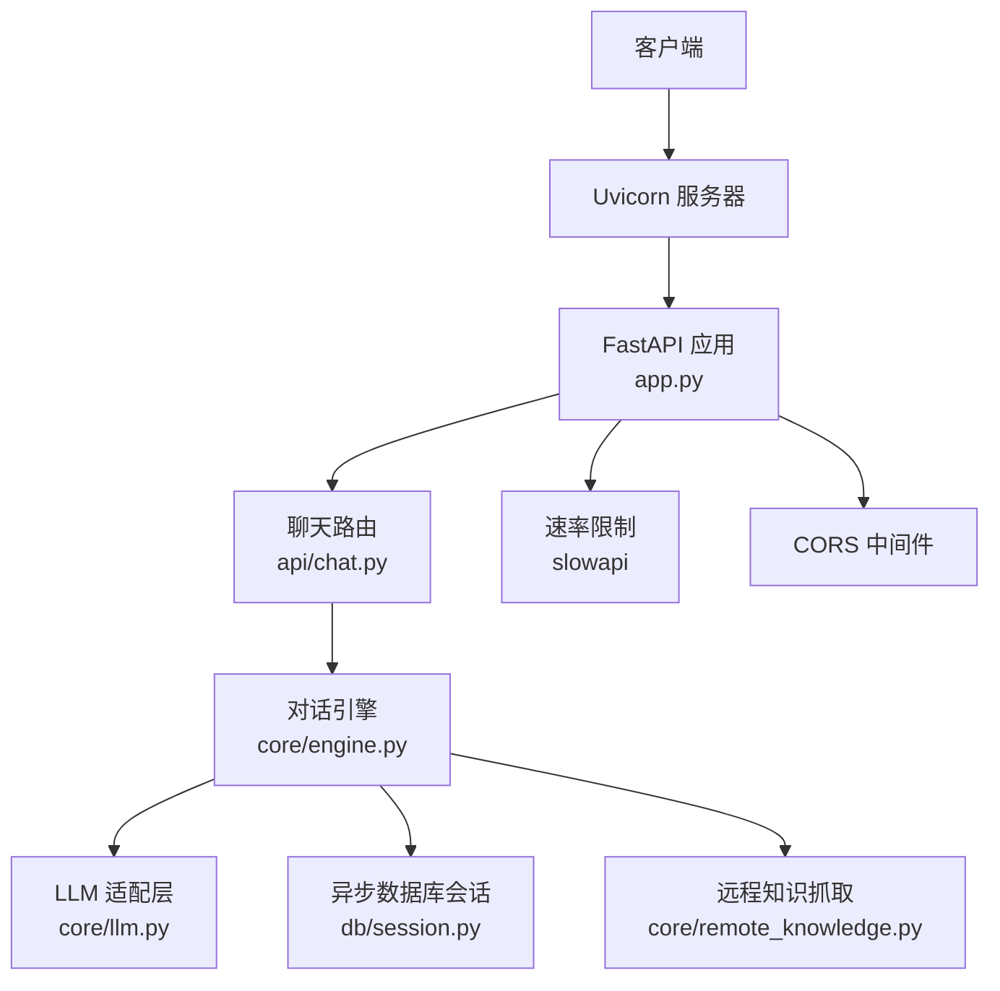
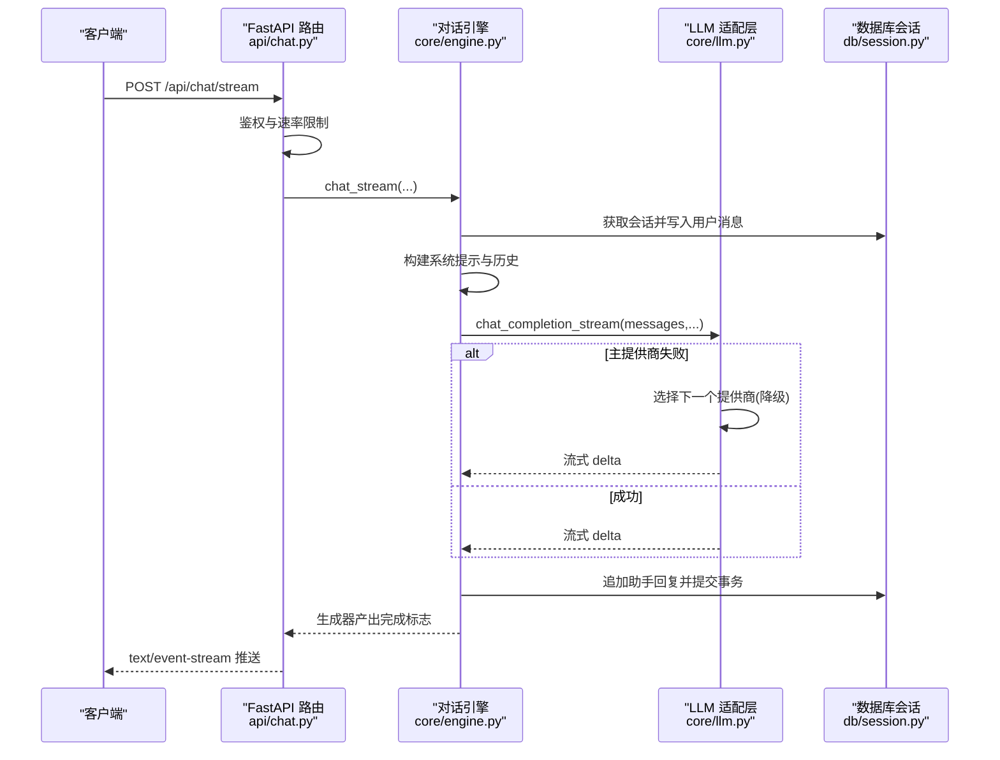
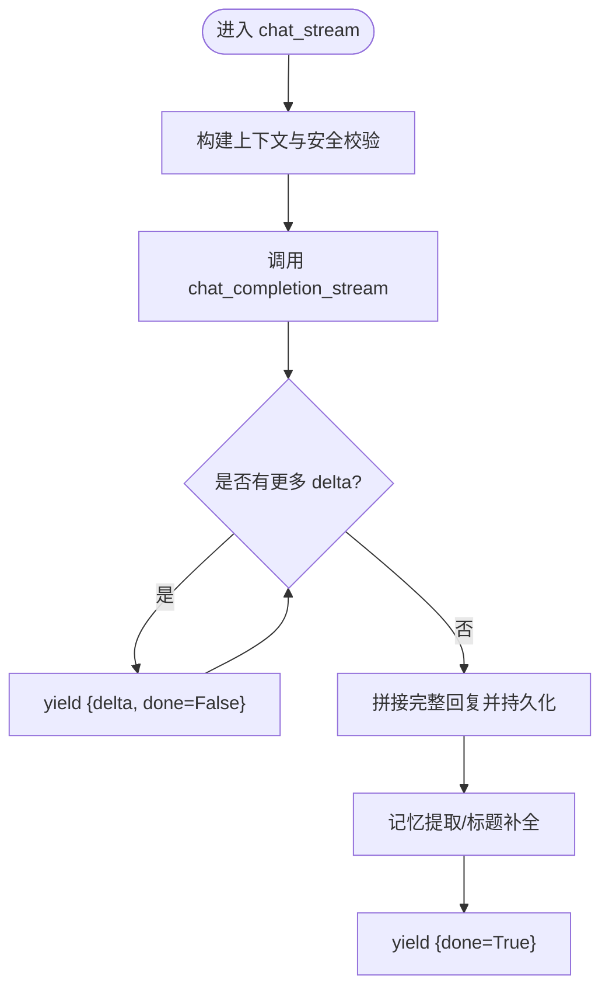
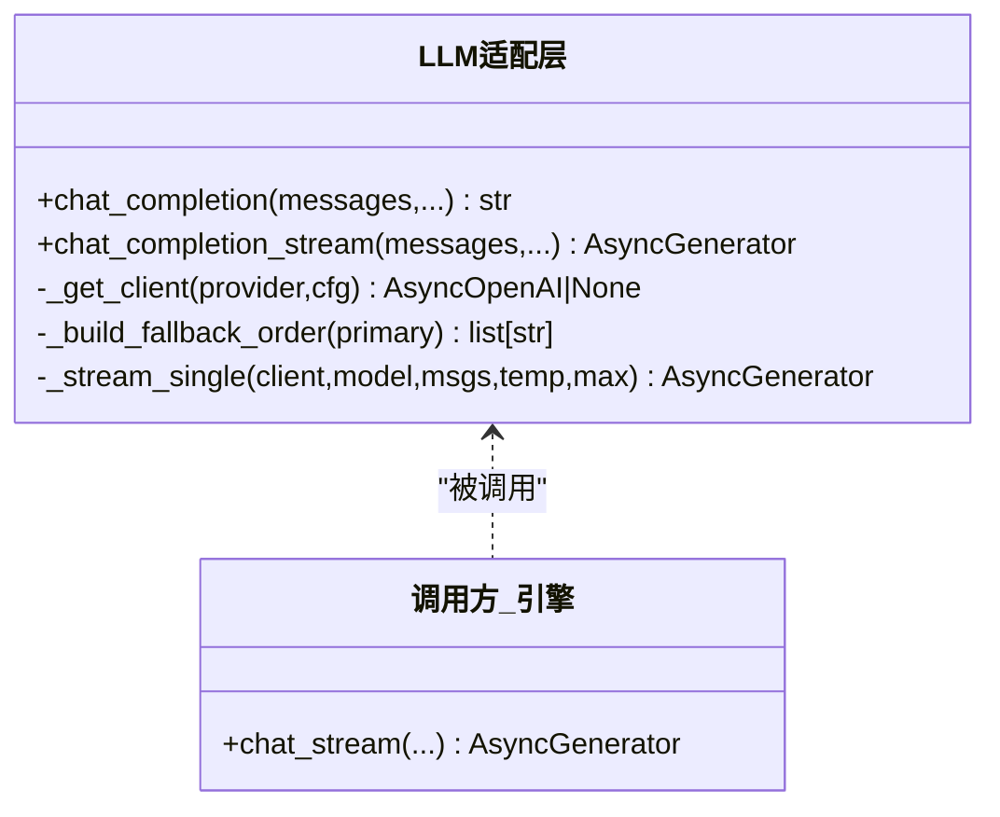
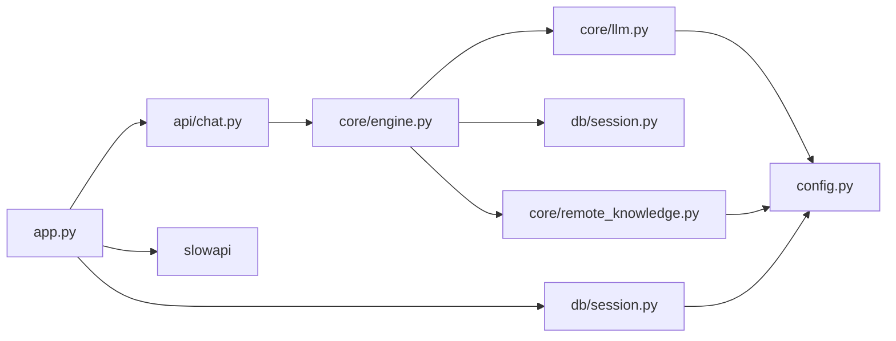

# 并发处理

<cite>
**本文引用的文件**   
- [hushai/meditation/app.py](file://hushai/meditation/app.py)
- [hushai/meditation/api/chat.py](file://hushai/meditation/api/chat.py)
- [hushai/meditation/core/engine.py](file://hushai/meditation/core/engine.py)
- [hushai/meditation/core/llm.py](file://hushai/meditation/core/llm.py)
- [hushai/meditation/db/session.py](file://hushai/meditation/db/session.py)
- [hushai/meditation/config.py](file://hushai/meditation/config.py)
- [hushai/meditation/core/remote_knowledge.py](file://hushai/meditation/core/remote_knowledge.py)
- [pyproject.toml](file://pyproject.toml)
</cite>

## 目录
1. [简介](#简介)
2. [项目结构](#项目结构)
3. [核心组件](#核心组件)
4. [架构总览](#架构总览)
5. [详细组件分析](#详细组件分析)
6. [依赖关系分析](#依赖关系分析)
7. [性能考虑](#性能考虑)
8. [故障排查指南](#故障排查指南)
9. [结论](#结论)
10. [附录](#附录)

## 简介
本文件聚焦 hush.ai 的并发处理机制，围绕 FastAPI 异步模型、事件循环与协程调度、线程池与资源限制、LLM 调用并发优化（降级与流式）、内存管理与垃圾回收策略，以及并发性能调优实践进行系统化说明。文档以代码级事实为依据，结合可视化图示帮助读者理解从请求进入、上下文构建、外部 I/O 到响应返回的完整异步链路。

## 项目结构
本项目采用“应用入口 + 路由层 + 业务编排 + 基础设施”的分层组织方式：
- 应用入口与中间件：FastAPI 应用创建、生命周期管理、CORS、速率限制注册
- API 路由层：聊天接口、流式接口、鉴权等
- 业务编排层：对话引擎、记忆/知识/技能/场景上下文组装、安全校验
- LLM 适配层：多提供商客户端、自动降级、非流式与流式调用
- 数据库会话层：异步引擎与会话工厂、连接池配置
- 远程知识抓取：基于信号量的并发抓取与导入

图表来源
- [hushai/meditation/app.py:136-207](file://hushai/meditation/app.py#L136-L207)
- [hushai/meditation/api/chat.py:58-104](file://hushai/meditation/api/chat.py#L58-L104)
- [hushai/meditation/core/engine.py:166-313](file://hushai/meditation/core/engine.py#L166-L313)
- [hushai/meditation/core/llm.py:136-257](file://hushai/meditation/core/llm.py#L136-L257)
- [hushai/meditation/db/session.py:34-54](file://hushai/meditation/db/session.py#L34-L54)
- [hushai/meditation/core/remote_knowledge.py:294-360](file://hushai/meditation/core/remote_knowledge.py#L294-L360)

章节来源
- [hushai/meditation/app.py:136-207](file://hushai/meditation/app.py#L136-L207)
- [pyproject.toml:51-69](file://pyproject.toml#L51-L69)

## 核心组件
- 应用启动与生命周期：在 lifespan 中初始化日志、数据库、默认数据；关闭时释放资源
- 路由与限流：为聊天接口添加基于 IP 的速率限制，统一异常处理
- 对话引擎：负责上下文拼装、安全检查、持久化、流式输出与事务回滚
- LLM 适配：多提供商客户端、自动降级、非流式与流式两种模式
- 数据库会话：异步引擎与 sessionmaker，连接池大小按后端类型区分
- 远程知识抓取：使用 asyncio.Semaphore 控制并发度，httpx.AsyncClient 做网络 I/O

章节来源
- [hushai/meditation/app.py:24-133](file://hushai/meditation/app.py#L24-L133)
- [hushai/meditation/api/chat.py:58-104](file://hushai/meditation/api/chat.py#L58-L104)
- [hushai/meditation/core/engine.py:166-313](file://hushai/meditation/core/engine.py#L166-L313)
- [hushai/meditation/core/llm.py:136-257](file://hushai/meditation/core/llm.py#L136-L257)
- [hushai/meditation/db/session.py:34-54](file://hushai/meditation/db/session.py#L34-L54)
- [hushai/meditation/core/remote_knowledge.py:294-360](file://hushai/meditation/core/remote_knowledge.py#L294-L360)

## 架构总览
下图展示一次聊天请求的端到端流程，包括鉴权、上下文构建、LLM 调用（含降级与流式）、结果持久化与 SSE 推送。

图表来源
- [hushai/meditation/api/chat.py:80-104](file://hushai/meditation/api/chat.py#L80-L104)
- [hushai/meditation/core/engine.py:238-313](file://hushai/meditation/core/engine.py#L238-L313)
- [hushai/meditation/core/llm.py:208-257](file://hushai/meditation/core/llm.py#L208-L257)
- [hushai/meditation/db/session.py:57-60](file://hushai/meditation/db/session.py#L57-L60)

## 详细组件分析

### FastAPI 异步编程模型与事件循环
- 应用通过 uvicorn 运行，内部使用事件循环驱动协程。所有 async def 路由与依赖注入函数由事件循环调度执行。
- lifespan 中使用 async context manager 管理全局资源（日志、数据库、默认数据），确保进程启动与关闭时的正确顺序。
- 中间件（CORS、速率限制）在请求进入路由前执行，支持异步处理。

章节来源
- [hushai/meditation/app.py:136-207](file://hushai/meditation/app.py#L136-L207)
- [hushai/meditation/app.py:24-133](file://hushai/meditation/app.py#L24-L133)
- [pyproject.toml:51-69](file://pyproject.toml#L51-L69)

### 协程调度与流式响应
- 聊天流式接口将 LLM 的异步生成器转换为 Server-Sent Events，逐块推送给客户端。
- 引擎侧对每个 delta 进行累积，并在完成后一次性持久化完整回复，同时触发记忆提取与标题补全。

图表来源
- [hushai/meditation/core/engine.py:238-313](file://hushai/meditation/core/engine.py#L238-L313)
- [hushai/meditation/api/chat.py:80-104](file://hushai/meditation/api/chat.py#L80-L104)

章节来源
- [hushai/meditation/core/engine.py:238-313](file://hushai/meditation/core/engine.py#L238-L313)
- [hushai/meditation/api/chat.py:80-104](file://hushai/meditation/api/chat.py#L80-L104)

### 线程池管理与资源限制
- 数据库连接池：根据后端类型设置不同 pool_size（SQLite 较小，PostgreSQL 较大），避免连接耗尽或争用。
- 速率限制：基于 slowapi 的 Limiter，按远端地址限制聊天接口频率，防止滥用与费用激增。
- 远程抓取并发：使用 asyncio.Semaphore 控制最大并发抓取数，避免过多并发导致下游服务限流或崩溃。

章节来源
- [hushai/meditation/db/session.py:34-47](file://hushai/meditation/db/session.py#L34-L47)
- [hushai/meditation/app.py:146-147](file://hushai/meditation/app.py#L146-L147)
- [hushai/meditation/api/chat.py:58-59](file://hushai/meditation/api/chat.py#L58-L59)
- [hushai/meditation/core/remote_knowledge.py:20-21](file://hushai/meditation/core/remote_knowledge.py#L20-L21)
- [hushai/meditation/core/remote_knowledge.py:305-352](file://hushai/meditation/core/remote_knowledge.py#L305-L352)

### LLM 调用的并发优化
- 自动降级：当主提供商失败或无 key 时，按预设顺序尝试其他提供商，保证可用性。
- 流式拉取：_stream_single 作为纯生成器，仅负责拉取 delta；失败抛出异常由上层捕获并驱动降级。
- 调试模式：无 key 时走 mock 分支，不影响整体流程。

图表来源
- [hushai/meditation/core/llm.py:136-257](file://hushai/meditation/core/llm.py#L136-L257)
- [hushai/meditation/core/engine.py:238-313](file://hushai/meditation/core/engine.py#L238-L313)

章节来源
- [hushai/meditation/core/llm.py:136-257](file://hushai/meditation/core/llm.py#L136-L257)

### 内存管理与垃圾回收策略
- 会话对象生命周期：使用 async with factory() 包裹会话，确保请求结束后及时释放；commit/rollback 后不再持有未提交状态。
- 长连接与流式：流式过程中仅累积必要片段，完成后一次性持久化，减少长时间占用大对象的风险。
- 资源清理：应用关闭时 dispose 引擎并重置工厂，避免僵尸连接。

章节来源
- [hushai/meditation/db/session.py:57-60](file://hushai/meditation/db/session.py#L57-L60)
- [hushai/meditation/db/session.py:71-76](file://hushai/meditation/db/session.py#L71-L76)
- [hushai/meditation/core/engine.py:238-313](file://hushai/meditation/core/engine.py#L238-L313)

### 并发性能调优指南
- 并发度配置
  - 数据库连接池：根据后端类型调整 pool_size（SQLite 小、PostgreSQL 大），避免连接争用。
  - 远程抓取并发：通过 Semaphore 上限控制，平衡吞吐与稳定性。
- 负载均衡策略
  - LLM 提供商降级顺序可动态调整，优先高可用、低延迟提供商。
- 性能瓶颈分析
  - 关注慢查询与长会话历史加载，必要时在 SQL 层 LIMIT 以减少 IO。
  - 监控 LLM 超时与错误率，合理设置 timeout 与重试/降级策略。

章节来源
- [hushai/meditation/db/session.py:34-47](file://hushai/meditation/db/session.py#L34-L47)
- [hushai/meditation/core/remote_knowledge.py:20-21](file://hushai/meditation/core/remote_knowledge.py#L20-L21)
- [hushai/meditation/core/llm.py:136-257](file://hushai/meditation/core/llm.py#L136-L257)

## 依赖关系分析
- 运行时依赖：fastapi、uvicorn、sqlalchemy[asyncio]、asyncpg/aiosqlite、httpx、slowapi 等
- 模块耦合：
  - app.py 聚合路由与中间件，依赖 config、session、limiter
  - api/chat.py 依赖 engine、auth、schemas
  - core/engine.py 依赖 llm、memory、knowledge、prompt、safety、scenes、skills、db.session
  - core/llm.py 依赖 openai.AsyncOpenAI、config
  - db/session.py 依赖 config、sqlalchemy.ext.asyncio
  - core/remote_knowledge.py 依赖 httpx、config、knowledge.import_text

图表来源
- [hushai/meditation/app.py:136-207](file://hushai/meditation/app.py#L136-L207)
- [hushai/meditation/api/chat.py:58-104](file://hushai/meditation/api/chat.py#L58-L104)
- [hushai/meditation/core/engine.py:166-313](file://hushai/meditation/core/engine.py#L166-L313)
- [hushai/meditation/core/llm.py:136-257](file://hushai/meditation/core/llm.py#L136-L257)
- [hushai/meditation/db/session.py:34-54](file://hushai/meditation/db/session.py#L34-L54)
- [hushai/meditation/core/remote_knowledge.py:294-360](file://hushai/meditation/core/remote_knowledge.py#L294-L360)
- [hushai/meditation/config.py:118-125](file://hushai/meditation/config.py#L118-L125)

章节来源
- [pyproject.toml:51-69](file://pyproject.toml#L51-L69)

## 性能考虑
- 事件循环友好：所有 I/O 操作均为异步（数据库、HTTP、LLM），避免阻塞事件循环。
- 流式传输：SSE 降低首字节延迟，提升用户体验。
- 资源隔离：会话与客户端作用域清晰，避免跨请求共享可变状态。
- 限流保护：接口级速率限制保障系统稳定。

## 故障排查指南
- 速率限制触发：检查 slowapi 配置与端点装饰器，确认阈值是否过低。
- LLM 调用失败：查看降级日志与异常信息，确认各提供商 key 与 base_url 配置。
- 数据库连接问题：核对 pool_size 与后端类型，确认连接字符串协议后缀是否正确。
- 流式中断：检查 finally 回滚逻辑与 committed 标志，确保异常路径下不残留未提交事务。

章节来源
- [hushai/meditation/app.py:146-147](file://hushai/meditation/app.py#L146-L147)
- [hushai/meditation/api/chat.py:58-59](file://hushai/meditation/api/chat.py#L58-L59)
- [hushai/meditation/core/llm.py:136-257](file://hushai/meditation/core/llm.py#L136-L257)
- [hushai/meditation/db/session.py:34-47](file://hushai/meditation/db/session.py#L34-L47)
- [hushai/meditation/core/engine.py:238-313](file://hushai/meditation/core/engine.py#L238-L313)

## 结论
hush.ai 的并发处理以 FastAPI 异步模型为核心，结合事件循环与协程调度实现高吞吐与低延迟。通过连接池、速率限制与信号量等手段进行资源控制；LLM 层提供自动降级与流式拉取，增强鲁棒性与体验。配合清晰的会话生命周期与资源清理策略，系统在可扩展性与稳定性方面具备良好基础。后续可在 SQL 层优化长会话加载、细化 LLM 超时与重试策略，进一步提升整体性能。

## 附录
- 关键配置项（节选）
  - 数据库 URL 与连接池大小：见数据库会话模块
  - CORS 与调试开关：见配置模块与应用入口
  - LLM 提供商与模型：见配置模块与 LLM 适配层
  - 远程知识源并发上限：见远程知识抓取模块

章节来源
- [hushai/meditation/config.py:18-52](file://hushai/meditation/config.py#L18-L52)
- [hushai/meditation/db/session.py:34-47](file://hushai/meditation/db/session.py#L34-L47)
- [hushai/meditation/core/remote_knowledge.py:20-21](file://hushai/meditation/core/remote_knowledge.py#L20-L21)