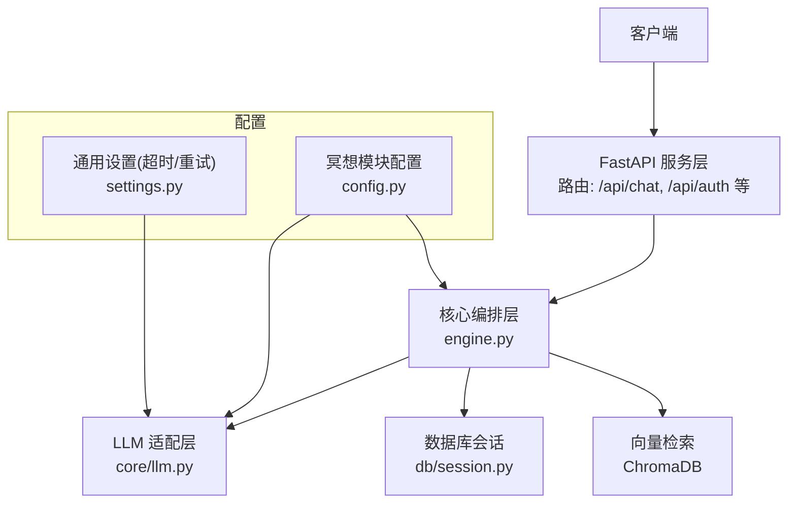
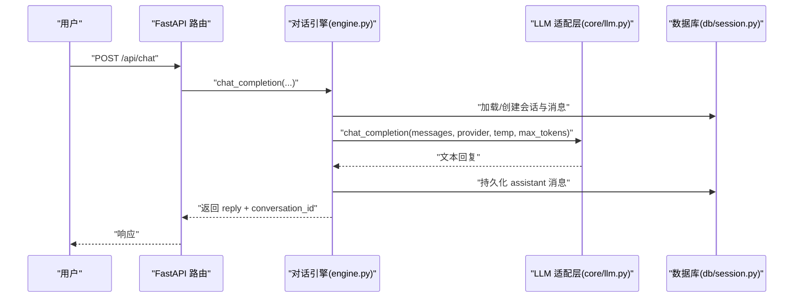
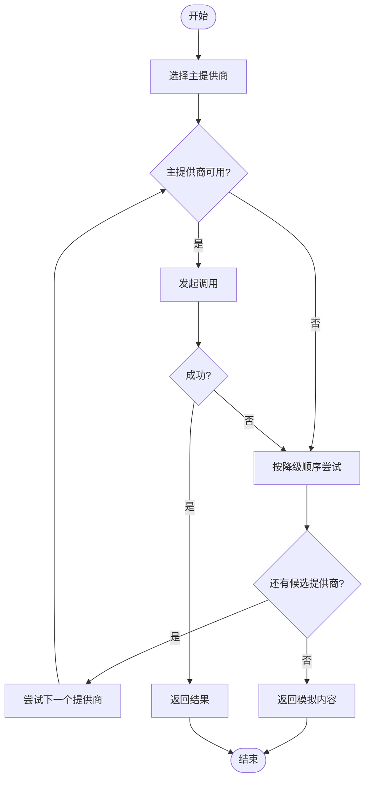
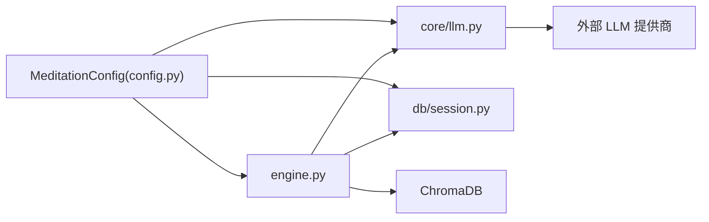

# 性能优化

<cite>
**本文引用的文件**
- [README.md](file://README.md)
- [hushai/meditation/config.py](file://hushai/meditation/config.py)
- [hushai/meditation/db/session.py](file://hushai/meditation/db/session.py)
- [hushai/meditation/core/llm.py](file://hushai/meditation/core/llm.py)
- [hushai/meditation/core/engine.py](file://hushai/meditation/core/engine.py)
- [hushai/meditation/api/auth.py](file://hushai/meditation/api/auth.py)
- [tests/meditation/test_auth.py](file://tests/meditation/test_auth.py)
- [hushai/settings.py](file://hushai/settings.py)
- [docs/configuration.md](file://docs/configuration.md)
- [.comate/specs/fix-all-quality-issues/doc.md](file://.comate/specs/fix-all-quality-issues/doc.md)
</cite>

## 目录
1. [引言](#引言)
2. [项目结构](#项目结构)
3. [核心组件](#核心组件)
4. [架构总览](#架构总览)
5. [详细组件分析](#详细组件分析)
6. [依赖关系分析](#依赖关系分析)
7. [性能考量与调优建议](#性能考量与调优建议)
8. [故障排查指南](#故障排查指南)
9. [结论](#结论)
10. [附录](#附录)

## 引言
本文件面向系统架构师与运维工程师，聚焦 hush.ai 的性能优化实践。围绕缓存策略、数据库查询优化、并发处理机制、LLM 调用优化、监控与基准测试等维度，结合仓库现有实现进行系统化梳理，并提供可落地的优化建议与排障指引。

## 项目结构
从整体架构看，服务层基于 FastAPI，核心编排层负责提示词构建、知识检索、记忆提取、技能挂载、导师选择与安全过滤；LLM 适配层支持多提供商并具备自动降级能力；持久化层使用 PostgreSQL（或 SQLite）与 ChromaDB 向量库。

图表来源
- [README.md:100-132](file://README.md#L100-L132)
- [hushai/meditation/core/engine.py:198-253](file://hushai/meditation/core/engine.py#L198-L253)
- [hushai/meditation/core/llm.py:1-258](file://hushai/meditation/core/llm.py#L1-L258)
- [hushai/meditation/db/session.py:1-83](file://hushai/meditation/db/session.py#L1-L83)
- [hushai/meditation/config.py:1-136](file://hushai/meditation/config.py#L1-L136)
- [hushai/settings.py:185-225](file://hushai/settings.py#L185-L225)

章节来源
- [README.md:100-178](file://README.md#L100-L178)

## 核心组件
- 配置中心：集中管理 LLM 提供商、模型、嵌入、JWT、CORS、调试开关等参数，支持环境变量覆盖。
- 数据库会话：异步引擎与连接池初始化、URL 解析、工厂模式提供会话。
- LLM 适配层：统一封装 OpenAI 兼容接口，支持多提供商、自动降级、流式与非流式调用。
- 对话引擎：组装上下文、调用 LLM、持久化消息、触发记忆提取与标题生成。
- 认证模块：refresh token 的 O(1) 查找与 bcrypt 校验，防止全表扫描与 DoS。

章节来源
- [hushai/meditation/config.py:1-136](file://hushai/meditation/config.py#L1-L136)
- [hushai/meditation/db/session.py:1-83](file://hushai/meditation/db/session.py#L1-L83)
- [hushai/meditation/core/llm.py:1-258](file://hushai/meditation/core/llm.py#L1-L258)
- [hushai/meditation/core/engine.py:198-253](file://hushai/meditation/core/engine.py#L198-L253)
- [hushai/meditation/api/auth.py:1-42](file://hushai/meditation/api/auth.py#L1-L42)

## 架构总览
下图展示一次普通对话请求的关键路径：API 路由进入引擎，引擎准备上下文后调用 LLM 适配层，返回结果后写入数据库并可选触发记忆提取。

图表来源
- [hushai/meditation/core/engine.py:198-253](file://hushai/meditation/core/engine.py#L198-L253)
- [hushai/meditation/core/llm.py:136-179](file://hushai/meditation/core/llm.py#L136-L179)
- [hushai/meditation/db/session.py:34-54](file://hushai/meditation/db/session.py#L34-L54)

## 详细组件分析

### 缓存策略设计与实施
现状与机会点
- 当前代码未引入 Redis 或分布式缓存，也未在热点数据路径中实现应用级缓存。
- 可在以下位置引入缓存以提升吞吐与降低延迟：
  - 知识库检索结果缓存（按 query 指纹 + top_k 参数）
  - 热门模板/场景/导师信息缓存
  - 鉴权相关只读数据（如角色权限映射）
  - 统计类指标（如本周进度、情绪均值）

建议方案
- 本地进程内缓存：对极热点且一致性要求不高的数据（如静态配置、字典表）采用内存缓存（TTL 短）。
- 分布式缓存（Redis）：用于跨实例共享的热点数据（知识库片段、热门问答、会话元数据），注意键空间隔离与过期策略。
- 缓存穿透/雪崩防护：布隆过滤器、随机 TTL、限流与熔断配合。
- 缓存更新策略：写扩散（更新时主动失效）、懒加载（读时回填）、版本号控制。

章节来源
- [hushai/meditation/core/knowledge.py](file://hushai/meditation/core/knowledge.py)
- [hushai/meditation/core/memory.py](file://hushai/meditation/core/memory.py)
- [hushai/meditation/core/scenes.py](file://hushai/meditation/core/scenes.py)
- [hushai/meditation/core/skills.py](file://hushai/meditation/core/skills.py)

### 数据库查询优化技术
现状
- 使用 SQLAlchemy 异步引擎与 asyncpg/sqlite+aiosqlite 驱动，默认连接池大小根据后端类型区分（SQLite 较小，PostgreSQL 较大）。
- 迁移脚本使用 NullPool 以适配 Alembic 在线迁移。

优化要点
- 索引优化：为高频查询字段建立合适索引（如用户标识、会话 ID、时间戳、token selector 等）。
- 查询重写：避免 N+1 查询，使用 JOIN 或 selectinload；分页与 LIMIT 下推至 SQL 层。
- 连接池配置：依据 QPS 与平均延迟调整 pool_size、max_overflow、pool_recycle；长事务需评估锁竞争。
- 读写分离与分库分表：当单库成为瓶颈时考虑扩展。

章节来源
- [hushai/meditation/db/session.py:34-54](file://hushai/meditation/db/session.py#L34-L54)
- [hushai/meditation/db/migrations/env.py:33-41](file://hushai/meditation/db/migrations/env.py#L33-L41)
- [hushai/meditation/db/models.py](file://hushai/meditation/db/models.py)

### 并发处理机制
现状
- 服务基于异步框架，数据库访问通过异步会话工厂获取 AsyncSession。
- 认证模块使用 SHA-256 选择器定位 refresh token，再执行 bcrypt 校验，避免全表扫描。

优化建议
- 线程池管理：将 CPU 密集任务（如嵌入计算、图片/音频处理）放入线程池，避免阻塞事件循环。
- 资源限制：对外部 I/O（LLM、向量库、支付网关）增加超时、重试与熔断；对关键端点做速率限制。
- 背压与队列：对突发流量采用队列削峰，保障核心链路稳定。

章节来源
- [hushai/meditation/db/session.py:50-61](file://hushai/meditation/db/session.py#L50-L61)
- [hushai/meditation/api/auth.py:28-42](file://hushai/meditation/api/auth.py#L28-L42)
- [tests/meditation/test_auth.py:1-46](file://tests/meditation/test_auth.py#L1-46)

### LLM 调用的性能优化
现状
- 多提供商路由与自动降级：优先主提供商，失败则按预设顺序尝试其他提供商；无可用 key 时回退到 mock。
- 非流式与流式两种调用方式；调试模式下可跳过真实调用。
- 全局超时与最大重试次数可通过配置读取。

优化建议
- 请求合并：对短时窗口内的相似请求进行去重与合并，减少重复调用。
- 结果缓存：对相同 prompt 指纹的结果进行短期缓存，注意温度与上下文差异。
- 降级策略：在提供商全部不可用时快速返回降级内容或错误码，避免长时间等待。
- 流式输出：前端边接收边渲染，提升首字时延体验。

图表来源
- [hushai/meditation/core/llm.py:82-91](file://hushai/meditation/core/llm.py#L82-L91)
- [hushai/meditation/core/llm.py:136-179](file://hushai/meditation/core/llm.py#L136-L179)
- [hushai/meditation/core/llm.py:208-258](file://hushai/meditation/core/llm.py#L208-L258)
- [hushai/settings.py:185-225](file://hushai/settings.py#L185-L225)

章节来源
- [hushai/meditation/core/llm.py:1-258](file://hushai/meditation/core/llm.py#L1-L258)
- [hushai/settings.py:185-225](file://hushai/settings.py#L185-L225)

### 认证与鉴权性能优化
现状
- refresh token 使用 SHA-256 hex 作为选择器，先 O(1) 定位用户，再进行 bcrypt 校验，避免全表暴力比对。
- Access token 强制 type 校验，防止未来引入 refresh JWT 时的类型混淆。

优化建议
- 确保选择器字段有唯一索引，加速定位。
- 对刷新令牌接口增加速率限制与防重放机制。
- 定期轮换与审计，缩短泄露窗口。

章节来源
- [hushai/meditation/api/auth.py:28-42](file://hushai/meditation/api/auth.py#L28-L42)
- [tests/meditation/test_auth.py:85-141](file://tests/meditation/test_auth.py#L85-L141)

## 依赖关系分析
- 配置依赖：MeditationConfig 由环境变量注入，被 engine、llm、session 等多处消费。
- 运行时依赖：SQLAlchemy 异步引擎与 async_sessionmaker 提供会话；OpenAI 兼容 SDK 用于 LLM 调用。
- 外部依赖：PostgreSQL/SQLite、ChromaDB、微信 OAuth、微信支付等。

图表来源
- [hushai/meditation/config.py:1-136](file://hushai/meditation/config.py#L1-L136)
- [hushai/meditation/core/engine.py:198-253](file://hushai/meditation/core/engine.py#L198-L253)
- [hushai/meditation/core/llm.py:1-258](file://hushai/meditation/core/llm.py#L1-L258)
- [hushai/meditation/db/session.py:1-83](file://hushai/meditation/db/session.py#L1-L83)

章节来源
- [hushai/meditation/config.py:1-136](file://hushai/meditation/config.py#L1-L136)
- [hushai/meditation/core/engine.py:198-253](file://hushai/meditation/core/engine.py#L198-L253)
- [hushai/meditation/core/llm.py:1-258](file://hushai/meditation/core/llm.py#L1-L258)
- [hushai/meditation/db/session.py:1-83](file://hushai/meditation/db/session.py#L1-L83)

## 性能考量与调优建议
- 连接池与超时
  - 根据负载调整 pool_size、max_overflow、pool_recycle；长事务谨慎使用。
  - 合理设置 LLM 超时与重试次数，避免雪崩。
- 热点数据缓存
  - 引入 Redis 缓存知识库片段、热门问答、静态字典；设计合理的键空间与过期策略。
- 查询优化
  - 为高频条件列加索引；分页与 LIMIT 下推到 SQL；避免 N+1。
- 并发与限流
  - 对聊天接口增加速率限制；CPU 密集型任务放入线程池；对外部 I/O 增加熔断与降级。
- 容量规划
  - 基于 QPS、P95/P99 延迟、错误率与资源利用率制定扩容阈值；关注向量库与数据库的 IO 与连接数。

章节来源
- [hushai/meditation/db/session.py:34-54](file://hushai/meditation/db/session.py#L34-L54)
- [hushai/settings.py:185-225](file://hushai/settings.py#L185-L225)
- [.comate/specs/fix-all-quality-issues/doc.md:32-62](file://.comate/specs/fix-all-quality-issues/doc.md#L32-L62)

## 故障排查指南
- LLM 调用失败
  - 检查各提供商 API Key 是否配置；确认超时与重试参数；观察降级日志。
- 认证异常
  - 验证 refresh token 选择器与哈希匹配；确认 access token 类型校验通过。
- 数据库连接问题
  - 核对 URL 解析与驱动后缀；检查连接池耗尽与慢查询；确认迁移脚本运行环境。
- CORS 与调试模式
  - 生产环境应关闭宽松 CORS；仅在 debug 开启时放宽来源。

章节来源
- [hushai/meditation/core/llm.py:136-179](file://hushai/meditation/core/llm.py#L136-L179)
- [hushai/meditation/api/auth.py:28-42](file://hushai/meditation/api/auth.py#L28-L42)
- [hushai/meditation/db/session.py:15-31](file://hushai/meditation/db/session.py#L15-L31)
- [hushai/meditation/config.py:48-52](file://hushai/meditation/config.py#L48-L52)

## 结论
当前系统在 LLM 多提供商降级、异步数据库会话与认证安全方面已具备良好基础。下一步重点在于引入分布式缓存、完善连接池与索引策略、强化并发与限流治理，并建立完善的监控与基准测试体系，以实现高可用与高性能的生产目标。

## 附录
- 配置优先级与环境变量说明参见文档。
- 常见问题修复清单包含 CORS 默认值与速率限制建议。

章节来源
- [docs/configuration.md:1-102](file://docs/configuration.md#L1-L102)
- [.comate/specs/fix-all-quality-issues/doc.md:32-62](file://.comate/specs/fix-all-quality-issues/doc.md#L32-L62)