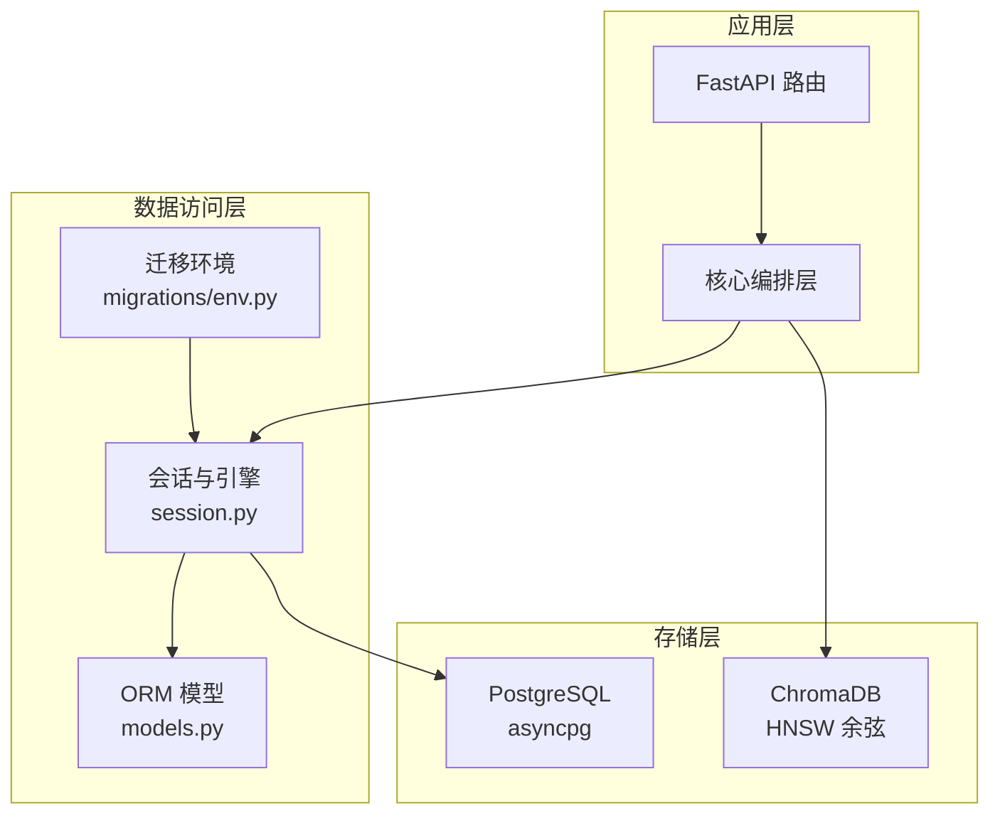
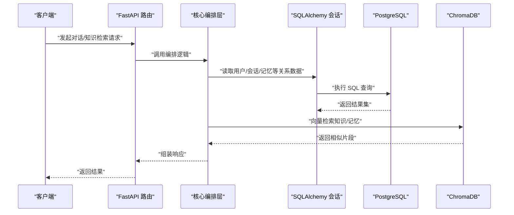
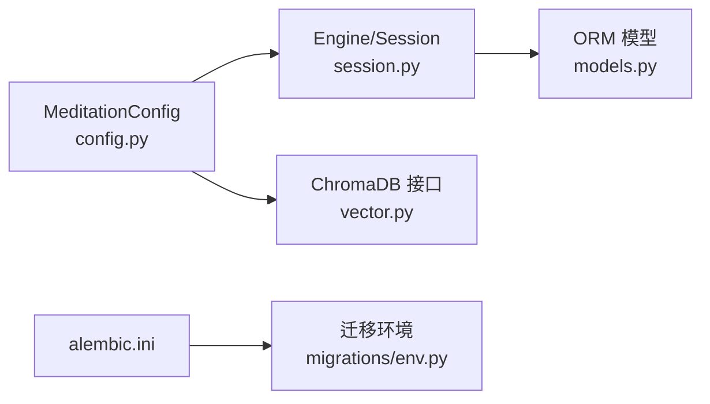

# 数据库优化

<cite>
**本文引用的文件**
- [hushai/meditation/db/session.py](file://hushai/meditation/db/session.py)
- [hushai/meditation/config.py](file://hushai/meditation/config.py)
- [alembic.ini](file://alembic.ini)
- [hushai/meditation/db/migrations/env.py](file://hushai/meditation/db/migrations/env.py)
- [hushai/meditation/db/models.py](file://hushai/meditation/db/models.py)
- [hushai/meditation/db/vector.py](file://hushai/meditation/db/vector.py)
- [tests/conftest.py](file://tests/conftest.py)
- [docs/evaluation-report-frontend-backend.md](file://docs/evaluation-report-frontend-backend.md)
</cite>

## 目录
1. [引言](#引言)
2. [项目结构](#项目结构)
3. [核心组件](#核心组件)
4. [架构总览](#架构总览)
5. [详细组件分析](#详细组件分析)
6. [依赖分析](#依赖分析)
7. [性能考虑](#性能考虑)
8. [故障排查指南](#故障排查指南)
9. [结论](#结论)
10. [附录](#附录)

## 引言
本技术文档面向 hush.ai 的数据库与向量检索子系统，聚焦以下目标：
- PostgreSQL 连接池配置与连接管理策略（连接数、超时、复用）
- 索引优化技术（复合索引、部分索引、维护策略）
- 查询优化技术（复杂查询重写、EXPLAIN 分析、慢查询监控）
- ChromaDB 向量数据库优化（分片策略、索引算法、批量操作）
- 数据库监控与维护最佳实践（指标监控、备份恢复、容量规划）

## 项目结构
本项目在“冥想”模块中实现了关系型数据与向量数据的统一接入：
- 关系型数据：通过 SQLAlchemy Async + asyncpg 驱动访问 PostgreSQL（或 SQLite 本地模式）
- 迁移工具：Alembic 异步迁移
- 模型定义：集中式 ORM 模型，包含多表及索引声明
- 向量检索：ChromaDB 持久化客户端，支持 HNSW 余弦相似度检索

图表来源
- [hushai/meditation/db/session.py:1-83](file://hushai/meditation/db/session.py#L1-L83)
- [hushai/meditation/db/models.py:1-434](file://hushai/meditation/db/models.py#L1-L434)
- [hushai/meditation/db/migrations/env.py:1-52](file://hushai/meditation/db/migrations/env.py#L1-L52)
- [docs/evaluation-report-frontend-backend.md:6-39](file://docs/evaluation-report-frontend-backend.md#L6-L39)

章节来源
- [hushai/meditation/db/session.py:1-83](file://hushai/meditation/db/session.py#L1-L83)
- [hushai/meditation/db/models.py:1-434](file://hushai/meditation/db/models.py#L1-L434)
- [hushai/meditation/db/migrations/env.py:1-52](file://hushai/meditation/db/migrations/env.py#L1-L52)
- [docs/evaluation-report-frontend-backend.md:6-39](file://docs/evaluation-report-frontend-backend.md#L6-L39)

## 核心组件
- 数据库会话与引擎：负责解析 URL、创建异步引擎、构建会话工厂、生命周期管理
- ORM 模型与索引：定义业务实体、外键关系、单列与复合索引
- 迁移系统：基于 Alembic 的异步迁移执行
- 向量检索：ChromaDB 客户端与集合管理，嵌入函数注入，批量 upsert 与过滤查询

章节来源
- [hushai/meditation/db/session.py:1-83](file://hushai/meditation/db/session.py#L1-L83)
- [hushai/meditation/db/models.py:1-434](file://hushai/meditation/db/models.py#L1-L434)
- [hushai/meditation/db/migrations/env.py:1-52](file://hushai/meditation/db/migrations/env.py#L1-L52)
- [hushai/meditation/db/vector.py:1-179](file://hushai/meditation/db/vector.py#L1-L179)

## 架构总览
下图展示了从请求到数据存储的整体路径，包括关系型与向量两条链路。

图表来源
- [docs/evaluation-report-frontend-backend.md:6-39](file://docs/evaluation-report-frontend-backend.md#L6-L39)
- [hushai/meditation/db/session.py:1-83](file://hushai/meditation/db/session.py#L1-L83)
- [hushai/meditation/db/vector.py:1-179](file://hushai/meditation/db/vector.py#L1-L179)

## 详细组件分析

### PostgreSQL 连接池与连接管理
- 连接 URL 解析：根据配置选择 SQLite 或 PostgreSQL；对 PostgreSQL 自动切换为 asyncpg 驱动
- 引擎参数：
  - pool_size：SQLite 默认 5，PostgreSQL 默认 10
  - echo：由 debug 开关控制是否打印 SQL
  - connect_args：SQLite 开启跨线程访问
- 会话工厂：使用 expire_on_commit=False 避免提交后对象失效导致的额外查询
- 生命周期：提供 init_db/close_db/reset_session_for_tests 以支持启动初始化与测试隔离

优化建议（结合现有实现）：
- 连接数限制：当前 pool_size=10（PostgreSQL），可按并发与实例规格调整
- 超时设置：可在 create_async_engine 的 connect_args 中传入连接建立与查询超时参数（如 connect_timeout、statement_timeout），并在应用侧增加重试与熔断
- 连接复用：保持全局 Engine 与 SessionFactory 单例，确保连接池复用；避免频繁创建/销毁引擎
- 事务边界：在 FastAPI 依赖注入中使用 get_session 上下文管理器，保证每个请求独立事务

章节来源
- [hushai/meditation/db/session.py:15-47](file://hushai/meditation/db/session.py#L15-L47)
- [hushai/meditation/db/session.py:50-83](file://hushai/meditation/db/session.py#L50-L83)
- [hushai/meditation/config.py:18-52](file://hushai/meditation/config.py#L18-L52)
- [tests/conftest.py:39](file://tests/conftest.py#L39)

### 索引优化技术
当前模型已定义多处单列与复合索引，覆盖高频查询场景：
- 单列索引：users.wx_openid、users.refresh_token_hash、users.refresh_token_selector、conversations.user_id、messages.conversation_id、memories.user_id、memories.category、daily_progress.user_id、admin_users.username、audit_logs.admin_username、audit_logs.action、meditation_sessions.user_id、teachers.slug、counselors.user_id、counselors.status、counselor_schedules.counselor_id、counselor_schedules.schedule_date、appointments.counselor_id、appointments.user_id、appointments.appointment_date、appointments.status、consultation_orders.appointment_id、consultation_orders.counselor_id、consultation_orders.user_id、consultation_orders.status、service_records.order_id、service_records.appointment_id、service_records.counselor_id、service_records.user_id、appointment_settings.counselor_id
- 复合索引：
  - memories: (user_id, category)
  - daily_progress: (user_id, date)
  - counselor_schedules: (counselor_id, schedule_date, start_time) 唯一约束

优化建议：
- 复合索引设计：按查询谓词顺序放置选择性高的列；例如按 user_id 前缀过滤时优先放 user_id
- 部分索引：针对活跃记录（如 is_active=True、status='active'）可考虑部分索引以减少索引体积
- 索引维护：定期 ANALYZE/VACUUM，关注 pg_stat_user_indexes 命中率与扫描成本

章节来源
- [hushai/meditation/db/models.py:37-118](file://hushai/meditation/db/models.py#L37-L118)
- [hushai/meditation/db/models.py:224-244](file://hushai/meditation/db/models.py#L224-L244)
- [hushai/meditation/db/models.py:305-325](file://hushai/meditation/db/models.py#L305-L325)

### 查询优化技术
- 复杂查询重写：将大查询拆分为多次小查询，利用已有索引减少回表；避免 SELECT *，仅取必要字段
- EXPLAIN 分析：在生产环境开启低级别日志或使用 EXPLAIN ANALYZE 定位全表扫描、嵌套循环等低效计划
- 慢查询监控：启用 PostgreSQL 慢查询日志（log_min_duration_statement），并结合 pg_stat_statements 统计热点语句

结合项目的落地建议：
- 在消息、会话、记忆等高频读路径上，确保 WHERE 条件命中索引列
- 分页查询采用游标或范围扫描替代 OFFSET 深翻页
- 聚合类报表查询尽量物化或定时预计算

章节来源
- [hushai/meditation/db/models.py:85-96](file://hushai/meditation/db/models.py#L85-L96)
- [hushai/meditation/db/models.py:98-118](file://hushai/meditation/db/models.py#L98-L118)

### ChromaDB 向量检索优化
- 客户端与集合：
  - 支持持久化目录（PersistentClient）与内存模式（Client）
  - 集合元数据指定 HNSW 空间为 cosine（余弦相似度）
- 嵌入函数：
  - 支持 OpenAI 兼容嵌入模型，可通过配置切换 provider/model/base_url/api_key
- 批量写入：
  - add_knowledge_chunks 使用 upsert 批量插入，附带标题、标签、来源、父节点等元数据
- 检索：
  - knowledge_collection/memory_collection 分别用于知识与记忆检索
  - search_memories 支持 where 过滤（如 user_id），提升召回精准度

优化建议：
- 分片策略：当集合规模增长时，按主题/领域拆分多个集合，降低单次查询开销
- 索引算法：保持 HNSW 余弦；如需权衡精度与速度，可调整 HNSW 参数（M、efConstruction、efSearch）
- 批量操作：合并写入批次，减少网络往返；更新时使用 upsert 幂等写入
- 元数据过滤：在 where 中限定 user_id 等维度，缩小搜索空间

章节来源
- [hushai/meditation/db/vector.py:15-28](file://hushai/meditation/db/vector.py#L15-L28)
- [hushai/meditation/db/vector.py:43-58](file://hushai/meditation/db/vector.py#L43-L58)
- [hushai/meditation/db/vector.py:61-78](file://hushai/meditation/db/vector.py#L61-L78)
- [hushai/meditation/db/vector.py:81-101](file://hushai/meditation/db/vector.py#L81-L101)
- [hushai/meditation/db/vector.py:104-127](file://hushai/meditation/db/vector.py#L104-L127)
- [hushai/meditation/db/vector.py:130-179](file://hushai/meditation/db/vector.py#L130-L179)

### 迁移与环境配置
- Alembic 配置：sqlalchemy.url 指向 PostgreSQL+asyncpg
- 迁移环境：异步模式下使用 NullPool，避免迁移期间占用连接池

优化建议：
- 生产迁移建议在低峰期执行，并配合只读副本验证
- 迁移脚本应幂等且可回滚，避免长事务锁表

章节来源
- [alembic.ini:1-36](file://alembic.ini#L1-L36)
- [hushai/meditation/db/migrations/env.py:33-41](file://hushai/meditation/db/migrations/env.py#L33-L41)

## 依赖分析
- 配置来源：MeditationConfig 从环境变量加载，决定数据库 URL、Chroma 持久化目录、嵌入模型等
- 运行时依赖：
  - session.py 依赖 config.py 获取 postgres_url/debug
  - vector.py 依赖 config.py 获取 embedding_provider/model/key/base_url/chroma_persist_dir
  - migrations/env.py 依赖 alembic.ini 中的 sqlalchemy.url

图表来源
- [hushai/meditation/config.py:18-52](file://hushai/meditation/config.py#L18-L52)
- [hushai/meditation/db/session.py:15-47](file://hushai/meditation/db/session.py#L15-L47)
- [hushai/meditation/db/vector.py:43-58](file://hushai/meditation/db/vector.py#L43-L58)
- [alembic.ini:1-36](file://alembic.ini#L1-L36)
- [hushai/meditation/db/migrations/env.py:33-41](file://hushai/meditation/db/migrations/env.py#L33-L41)
- [hushai/meditation/db/models.py:1-434](file://hushai/meditation/db/models.py#L1-L434)

章节来源
- [hushai/meditation/config.py:18-52](file://hushai/meditation/config.py#L18-L52)
- [hushai/meditation/db/session.py:15-47](file://hushai/meditation/db/session.py#L15-L47)
- [hushai/meditation/db/vector.py:43-58](file://hushai/meditation/db/vector.py#L43-L58)
- [alembic.ini:1-36](file://alembic.ini#L1-L36)
- [hushai/meditation/db/migrations/env.py:33-41](file://hushai/meditation/db/migrations/env.py#L33-L41)
- [hushai/meditation/db/models.py:1-434](file://hushai/meditation/db/models.py#L1-L434)

## 性能考虑
- 连接池容量：根据 QPS 与平均延迟估算所需连接数，避免连接耗尽导致排队
- 超时与重试：为连接建立与查询设置合理超时；对瞬时失败进行指数退避重试
- 索引命中：确保高频查询命中单列/复合索引，避免排序与全表扫描
- 批量写入：合并 upsert 批次，减少网络往返与 WAL 压力
- 向量检索：按用户/类别过滤缩小搜索空间；必要时拆分集合以降低索引体积
- 资源隔离：迁移与在线服务分离，避免迁移影响线上吞吐

[本节为通用指导，不直接分析具体文件]

## 故障排查指南
- 连接池耗尽：检查 pool_size 与并发量，确认是否存在未释放的连接或长事务
- 慢查询：使用 EXPLAIN ANALYZE 查看执行计划，关注全表扫描与高代价算子
- 迁移失败：核对 alembic.ini 的 sqlalchemy.url 与权限，确认迁移脚本幂等
- 向量检索异常：检查嵌入函数配置（provider/model/key/base_url）、集合是否存在、where 过滤是否正确

章节来源
- [hushai/meditation/db/session.py:34-47](file://hushai/meditation/db/session.py#L34-L47)
- [alembic.ini:1-36](file://alembic.ini#L1-L36)
- [hushai/meditation/db/vector.py:43-58](file://hushai/meditation/db/vector.py#L43-L58)
- [hushai/meditation/db/vector.py:144-173](file://hushai/meditation/db/vector.py#L144-L173)

## 结论
本项目在关系型与向量数据方面均具备清晰的抽象与可扩展点。通过合理配置连接池、完善索引与查询策略、优化向量检索流程，并结合监控与运维规范，可在保障稳定性的同时持续提升性能与可观测性。

[本节为总结，不直接分析具体文件]

## 附录

### 关键配置项速查
- 数据库 URL：MEDITATION_POSTGRES_URL（为空则回退至 SQLite）
- 调试开关：MEDITATION_DEBUG（控制 SQL 输出）
- 向量嵌入：MEDITATION_EMBEDDING_PROVIDER/MODEL/API_KEY/BASE_URL
- Chroma 持久化：MEDITATION_CHROMA_DIR
- Alembic 连接：alembic.ini 中 sqlalchemy.url

章节来源
- [hushai/meditation/config.py:64-115](file://hushai/meditation/config.py#L64-L115)
- [alembic.ini:1-36](file://alembic.ini#L1-L36)