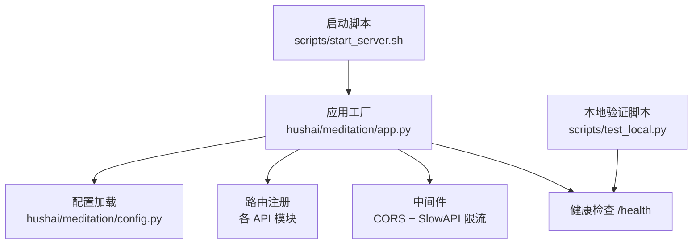
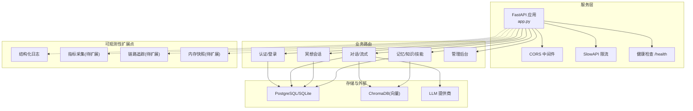
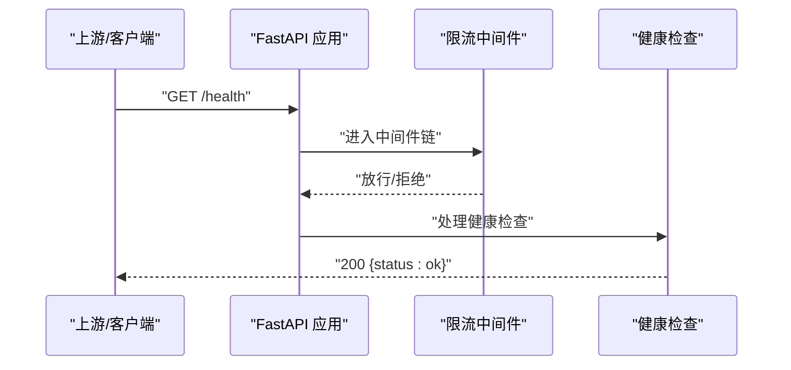
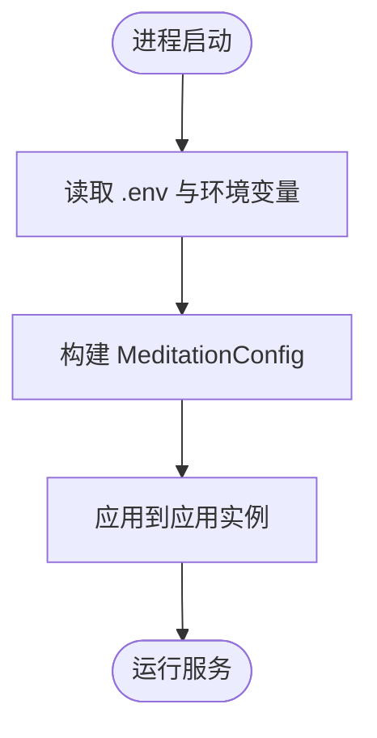
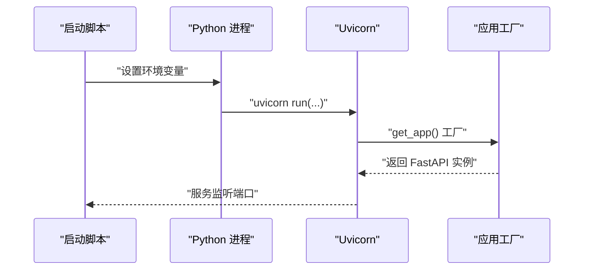
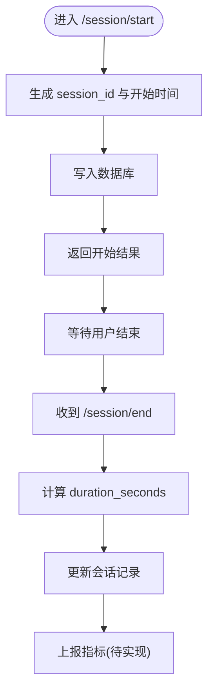
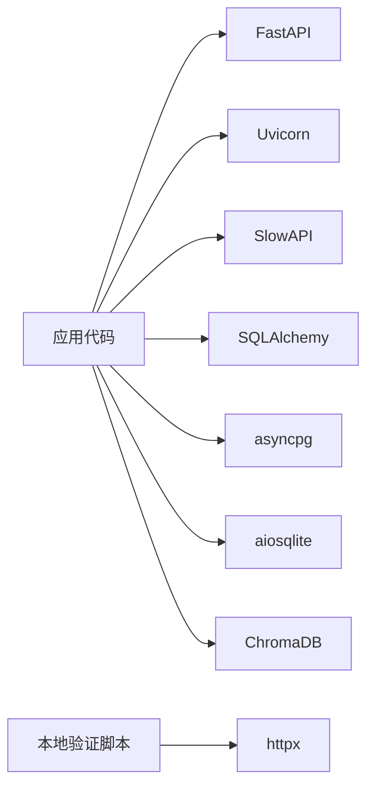

# 监控与基准测试

<cite>
**本文引用的文件**   
- [README.md](file://README.md)
- [app.py](file://hushai/meditation/app.py)
- [config.py](file://hushai/meditation/config.py)
- [start_server.sh](file://scripts/start_server.sh)
- [test_local.py](file://scripts/test_local.py)
- [pyproject.toml](file://pyproject.toml)
- [conftest.py](file://tests/conftest.py)
- [meditation.py](file://hushai/meditation/api/meditation.py)
</cite>

## 目录
1. [简介](#简介)
2. [项目结构](#项目结构)
3. [核心组件](#核心组件)
4. [架构总览](#架构总览)
5. [详细组件分析](#详细组件分析)
6. [依赖分析](#依赖分析)
7. [性能考虑](#性能考虑)
8. [故障排查指南](#故障排查指南)
9. [结论](#结论)
10. [附录](#附录)

## 简介
本文件面向运维工程师与开发团队，系统化阐述 hush.ai 的性能监控与基准测试方案。内容覆盖：
- 关键性能指标（KPI）体系：响应时间、吞吐量、错误率、资源利用率等指标的采集与分析方法
- 基准测试框架：压力测试脚本编写、负载模拟策略、测试结果分析方法论
- 瓶颈定位技术：链路追踪、热点分析、内存快照等诊断工具的使用建议
- 容量规划与弹性伸缩：基线建立、扩容阈值设定、自动扩缩容配置思路
- 优化效果评估：A/B 测试设计、性能回归检测、持续性能监控的质量保证措施

说明：当前仓库未内置专用 APM 或压测模块，但已具备健康检查、限流中间件、启动脚本与本地快速验证脚本等基础设施，可作为扩展监控与压测的起点。

## 项目结构
围绕性能与可观测性相关的关键位置如下：
- 服务入口与中间件：FastAPI 应用创建、CORS、限流、静态资源挂载、健康检查端点
- 配置中心：环境变量到运行时配置的映射，含端口、调试模式、CORS 等
- 启动脚本：Uvicorn 进程启动、默认环境变量注入、数据库选择提示
- 本地验证脚本：启动服务并轮询健康检查，用于快速冒烟验证
- 依赖声明：包含 Uvicorn、SlowAPI 限流、HTTP 客户端等
- 测试夹具：为需要真实 DB 的单元测试提供内存 SQLite 会话

图示来源
- [start_server.sh:1-31](file://scripts/start_server.sh#L1-L31)
- [app.py:136-207](file://hushai/meditation/app.py#L136-L207)
- [config.py:18-52](file://hushai/meditation/config.py#L18-L52)
- [test_local.py:48-63](file://scripts/test_local.py#L48-L63)

章节来源
- [README.md:100-178](file://README.md#L100-L178)
- [app.py:136-207](file://hushai/meditation/app.py#L136-L207)
- [config.py:18-52](file://hushai/meditation/config.py#L18-L52)
- [start_server.sh:1-31](file://scripts/start_server.sh#L1-L31)
- [test_local.py:48-63](file://scripts/test_local.py#L48-L63)

## 核心组件
- 应用生命周期与初始化
  - 在应用启动时完成日志级别设置、数据库初始化、默认管理员与导师数据初始化；关闭时释放资源
  - 通过 lifespan 钩子集中管理资源，便于后续接入可观测性探针
- 中间件与网关能力
  - CORS 中间件按环境区分放行策略
  - SlowAPI 限流器基于远端地址进行请求速率限制，并提供统一异常处理
- 健康检查端点
  - 暴露 /health 返回简单状态，适合容器编排与健康探测
- 配置系统
  - 从 .env 与环境变量加载运行时参数，包括 LLM、向量库、JWT、网络监听等
- 启动与运行
  - 通过脚本调用 Uvicorn 以工厂方式加载应用，支持 PostgreSQL 或 SQLite 切换
- 本地冒烟验证
  - 启动服务后轮询 /health，确认服务就绪后再执行后续流程

章节来源
- [app.py:24-133](file://hushai/meditation/app.py#L24-L133)
- [app.py:136-207](file://hushai/meditation/app.py#L136-L207)
- [config.py:63-115](file://hushai/meditation/config.py#L63-L115)
- [start_server.sh:1-31](file://scripts/start_server.sh#L1-L31)
- [test_local.py:26-63](file://scripts/test_local.py#L26-L63)

## 架构总览
下图展示服务层、中间件、外部依赖与可观测性扩展点的关系。

图示来源
- [app.py:136-207](file://hushai/meditation/app.py#L136-L207)
- [config.py:18-52](file://hushai/meditation/config.py#L18-L52)

## 详细组件分析

### 组件一：应用与中间件的可观测性扩展点
- 现状
  - 应用使用 lifespan 管理生命周期，适合在此处注册指标收集器、Tracer 初始化、采样开关等
  - 限流中间件已集成，可结合其事件输出统计被限流的请求比例
  - 健康检查端点可用于存活/就绪探针
- 建议扩展
  - 在 lifespan 中初始化 Prometheus 指标导出器或 OpenTelemetry Tracer
  - 在路由层增加请求耗时、错误码分布、下游调用耗时等指标埋点
  - 将日志格式化为结构化 JSON，便于日志平台聚合分析

图示来源
- [app.py:136-207](file://hushai/meditation/app.py#L136-L207)

章节来源
- [app.py:24-133](file://hushai/meditation/app.py#L24-L133)
- [app.py:136-207](file://hushai/meditation/app.py#L136-L207)

### 组件二：配置系统与运行参数
- 现状
  - 通过 dataclass 与 from_env 将环境变量映射为运行时配置，涵盖 LLM、向量库、JWT、监听地址与端口、调试模式、CORS 等
- 建议扩展
  - 新增性能相关配置项，如指标采样率、限流阈值、超时、并发度等
  - 在 debug 模式下开启更详细的日志与指标，生产环境降低开销

图示来源
- [config.py:63-115](file://hushai/meditation/config.py#L63-L115)
- [config.py:18-52](file://hushai/meditation/config.py#L18-L52)

章节来源
- [config.py:63-115](file://hushai/meditation/config.py#L63-L115)

### 组件三：启动脚本与本地验证
- 现状
  - 启动脚本负责注入默认环境变量、选择数据库后端、调用 Uvicorn 以工厂方式加载应用
  - 本地验证脚本启动服务并轮询 /health，作为冒烟测试入口
- 建议扩展
  - 在启动脚本中增加可观测性参数（如 OTEL 端点、Prometheus 端口）
  - 将本地验证脚本扩展为轻量压测入口，循环调用关键接口并记录耗时

图示来源
- [start_server.sh:1-31](file://scripts/start_server.sh#L1-L31)
- [app.py:217-228](file://hushai/meditation/app.py#L217-L228)
- [test_local.py:26-63](file://scripts/test_local.py#L26-L63)

章节来源
- [start_server.sh:1-31](file://scripts/start_server.sh#L1-L31)
- [test_local.py:26-63](file://scripts/test_local.py#L26-L63)

### 组件四：冥想会话计时与指标埋点机会
- 现状
  - 会话开始/结束接口维护活跃会话字典，计算持续时间并落库
- 建议扩展
  - 在会话开始/结束时记录指标：会话时长分位数、失败率、并发会话数
  - 对情绪签到、进度统计等接口增加延迟与错误码统计

图示来源
- [meditation.py:112-147](file://hushai/meditation/api/meditation.py#L112-L147)

章节来源
- [meditation.py:112-147](file://hushai/meditation/api/meditation.py#L112-L147)

## 依赖分析
- 关键依赖
  - FastAPI、Uvicorn：Web 服务与 ASGI 服务器
  - SlowAPI：请求限流
  - SQLAlchemy、asyncpg、aiosqlite：异步 ORM 与驱动
  - ChromaDB：向量检索
  - httpx：HTTP 客户端（本地验证脚本使用）
- 可观测性相关
  - 当前未引入 APM/指标/追踪库，建议在依赖中按需加入 Prometheus、OpenTelemetry 等

图示来源
- [pyproject.toml:51-69](file://pyproject.toml#L51-L69)
- [test_local.py:1-24](file://scripts/test_local.py#L1-L24)

章节来源
- [pyproject.toml:51-69](file://pyproject.toml#L51-L69)

## 性能考虑
- 指标体系建议
  - 响应时间：P50/P95/P99 延迟，按端点维度拆分
  - 吞吐量：QPS、并发连接数、队列长度
  - 错误率：HTTP 状态码分布、下游 LLM/向量库错误率
  - 资源利用率：CPU、内存、GC、磁盘 IO、网络 IO
  - 业务指标：活跃会话数、平均会话时长、情绪签到成功率
- 采集与可视化
  - 指标：Prometheus + Grafana
  - 日志：结构化 JSON 输出至 ELK/Loki
  - 追踪：OpenTelemetry 接入，串联前端→FastAPI→LLM/DB
- 限流与降级
  - 基于 SlowAPI 的 IP 级限流，结合业务 QPS 目标设定阈值
  - 对 LLM 调用增加超时与重试退避，必要时启用模型降级
- 容量规划
  - 以健康检查与指标为输入，建立性能基线
  - 根据 CPU/内存/IO 饱和度与延迟 SLA 设定扩容阈值
  - 结合容器编排实现水平扩缩容

[本节为通用指导，不直接分析具体文件]

## 故障排查指南
- 服务不可用
  - 使用 /health 进行存活探测；若失败，检查 Uvicorn 进程与端口占用
  - 查看启动脚本输出的数据库类型与端口信息
- 限流触发
  - 观察 SlowAPI 限流异常处理是否生效，核对 key_func 与阈值
- 配置问题
  - 确认 .env 与启动脚本的环境变量是否正确注入
  - 调试模式下 CORS 放行策略较宽松，生产需收敛
- 本地验证失败
  - 本地验证脚本会轮询 /health，若长时间失败，检查服务是否成功启动与端口可达

章节来源
- [app.py:203-206](file://hushai/meditation/app.py#L203-L206)
- [start_server.sh:1-31](file://scripts/start_server.sh#L1-L31)
- [config.py:18-52](file://hushai/meditation/config.py#L18-L52)
- [test_local.py:48-63](file://scripts/test_local.py#L48-L63)

## 结论
当前仓库已具备服务化基础与最小可观测性扩展点（健康检查、限流、结构化日志）。建议优先补齐指标采集、链路追踪与压测能力，形成“基线—压测—上线—监控—回归”的闭环，持续提升稳定性与用户体验。

[本节为总结，不直接分析具体文件]

## 附录

### A. 关键 KPI 定义与采集建议
- 响应时间：按端点维度统计 P50/P95/P99
- 吞吐量：QPS、并发会话数
- 错误率：HTTP 5xx、下游 LLM/向量库错误
- 资源利用率：CPU、内存、GC、磁盘 IO、网络 IO
- 业务指标：会话时长、情绪签到成功率、本周进度查询成功率

[本节为概念性说明，不直接分析具体文件]

### B. 基准测试方法论
- 场景设计
  - 冒烟：/health、登录、一次普通对话
  - 功能：会话开始/结束、知识库问答、记忆读写
  - 性能：并发对话、流式输出、批量操作
- 工具建议
  - 轻量：基于 httpx/curl 的脚本化压测
  - 标准：Locust/JMeter/K6
- 指标输出
  - 延迟分布、吞吐、错误率、资源占用
  - 报告对比：版本间回归检测

[本节为概念性说明，不直接分析具体文件]

### C. 容量规划与弹性伸缩
- 基线建立：在典型负载下采集指标，确定 SLI/SLO
- 扩容阈值：CPU/内存/IO 饱和度与延迟阈值组合
- 自动扩缩容：基于 Pod 指标或自定义指标触发

[本节为概念性说明，不直接分析具体文件]

### D. 优化效果评估
- A/B 测试：灰度发布，对比新旧版本关键指标
- 回归检测：CI 中加入性能用例，阈值告警
- 持续监控：Grafana 看板 + 告警规则

[本节为概念性说明，不直接分析具体文件]