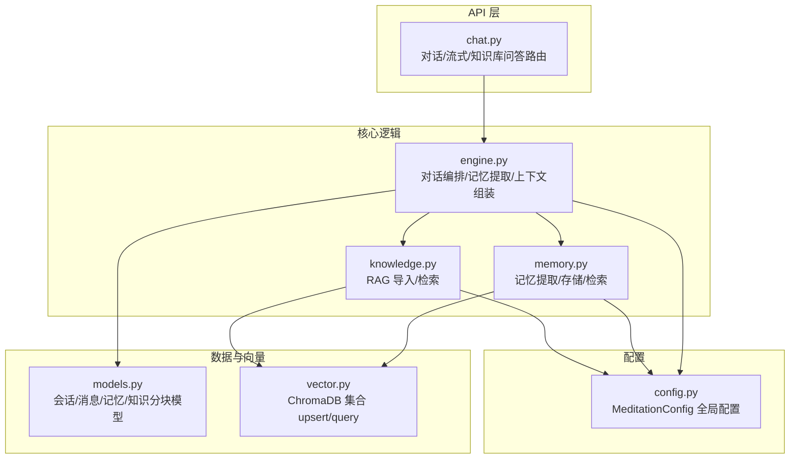
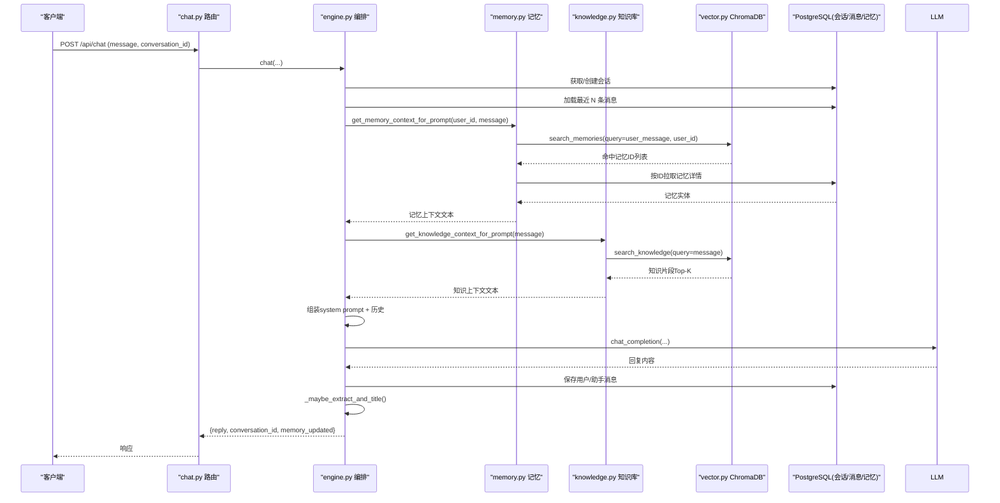
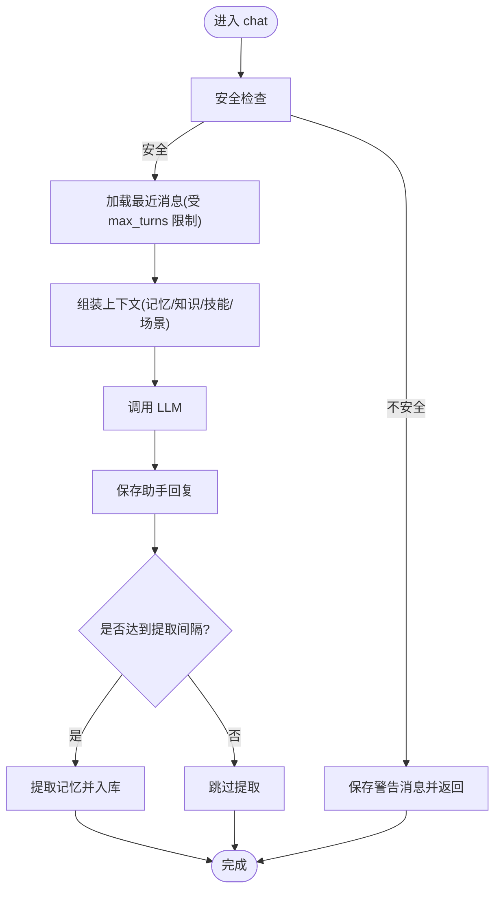
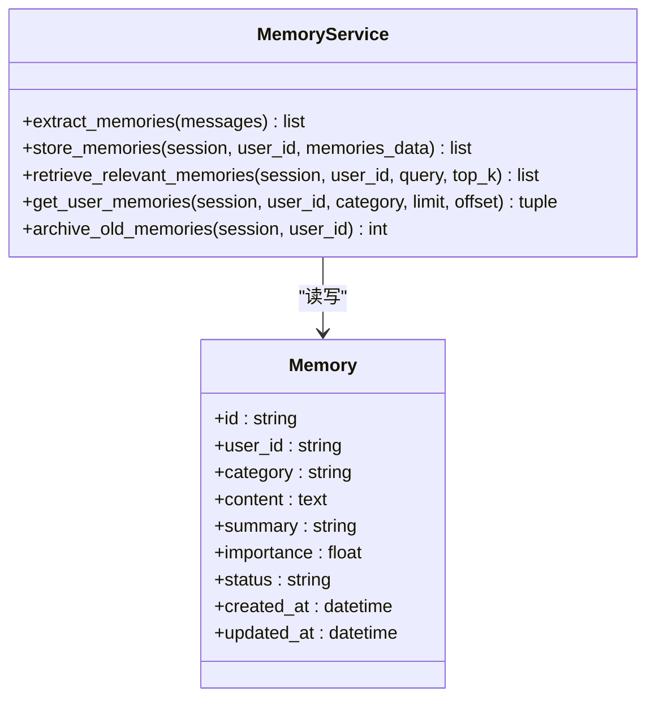
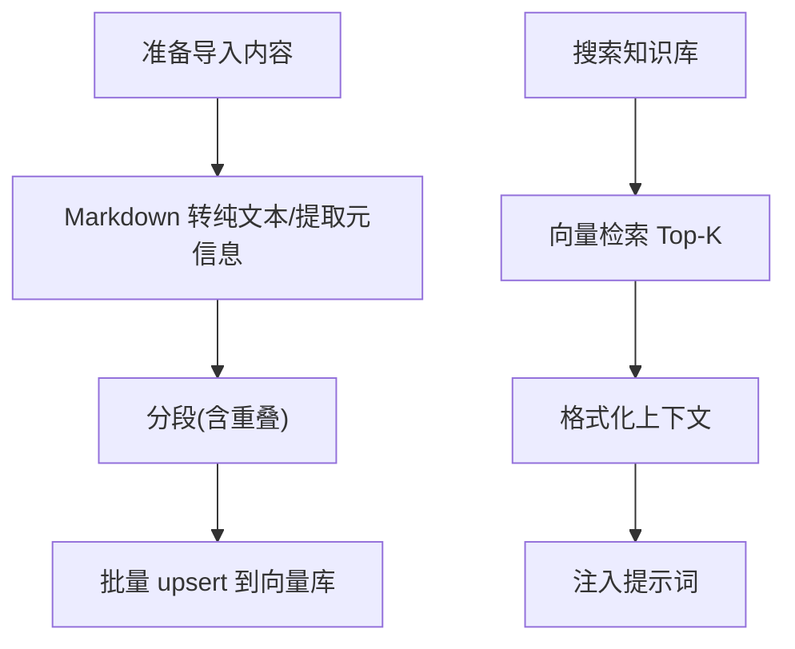
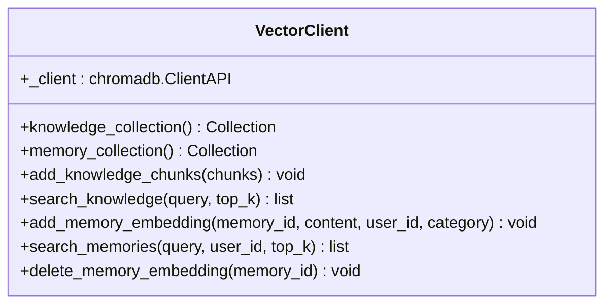
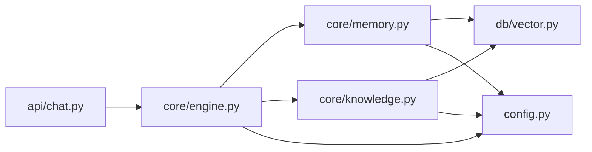

# 缓存策略

<cite>
**本文引用的文件**
- [hushai/meditation/core/engine.py](file://hushai/meditation/core/engine.py)
- [hushai/meditation/core/knowledge.py](file://hushai/meditation/core/knowledge.py)
- [hushai/meditation/core/memory.py](file://hushai/meditation/core/memory.py)
- [hushai/meditation/db/vector.py](file://hushai/meditation/db/vector.py)
- [hushai/meditation/api/chat.py](file://hushai/meditation/api/chat.py)
- [hushai/meditation/config.py](file://hushai/meditation/config.py)
- [hushai/meditation/db/models.py](file://hushai/meditation/db/models.py)
</cite>

## 目录
1. [简介](#简介)
2. [项目结构](#项目结构)
3. [核心组件](#核心组件)
4. [架构总览](#架构总览)
5. [详细组件分析](#详细组件分析)
6. [依赖关系分析](#依赖关系分析)
7. [性能考虑](#性能考虑)
8. [故障排查指南](#故障排查指南)
9. [结论](#结论)
10. [附录：开发者集成示例](#附录开发者集成示例)

## 简介
本文件面向 hush.ai 的“缓存策略”技术文档，聚焦于系统当前实现的多级数据访问与“类缓存”机制，包括：
- 内存层：进程内对象与配置缓存（如 LLM 客户端、向量客户端单例）
- 分布式/外部存储层：ChromaDB 向量库作为检索结果与嵌入的持久化载体
- 数据库层：PostgreSQL 作为对话历史、用户记忆、知识库分块的权威源

需要特别说明的是：仓库中未发现 Redis 或显式 TTL 的缓存中间件。因此，本文以现有代码为依据，说明实际的“多级访问路径”和“热点数据识别与加速方案”，并给出可落地的优化建议（含未来引入 Redis 的方向）。

## 项目结构
围绕“缓存/检索”的关键模块分布如下：
- 引擎编排：负责组装上下文、触发记忆提取、调用知识检索与 LLM
- 记忆管理：从对话中提取长期记忆、按语义检索相关记忆
- 知识库 RAG：文本清洗、分块、入库与相似度检索
- 向量接口：封装 ChromaDB 集合操作（upsert/query/delete）
- API 路由：对外暴露对话、流式对话、知识库问答等接口
- 配置中心：集中加载环境变量，提供 top_k、最大轮次等可调参数

图示来源
- [hushai/meditation/api/chat.py:1-245](file://hushai/meditation/api/chat.py#L1-L245)
- [hushai/meditation/core/engine.py:1-387](file://hushai/meditation/core/engine.py#L1-L387)
- [hushai/meditation/core/memory.py:1-205](file://hushai/meditation/core/memory.py#L1-L205)
- [hushai/meditation/core/knowledge.py:1-225](file://hushai/meditation/core/knowledge.py#L1-L225)
- [hushai/meditation/db/vector.py:1-179](file://hushai/meditation/db/vector.py#L1-L179)
- [hushai/meditation/db/models.py:85-113](file://hushai/meditation/db/models.py#L85-L113)
- [hushai/meditation/config.py:1-136](file://hushai/meditation/config.py#L1-L136)

章节来源
- [hushai/meditation/api/chat.py:1-245](file://hushai/meditation/api/chat.py#L1-L245)
- [hushai/meditation/core/engine.py:1-387](file://hushai/meditation/core/engine.py#L1-L387)
- [hushai/meditation/core/memory.py:1-205](file://hushai/meditation/core/memory.py#L1-L205)
- [hushai/meditation/core/knowledge.py:1-225](file://hushai/meditation/core/knowledge.py#L1-L225)
- [hushai/meditation/db/vector.py:1-179](file://hushai/meditation/db/vector.py#L1-L179)
- [hushai/meditation/db/models.py:85-113](file://hushai/meditation/db/models.py#L85-L113)
- [hushai/meditation/config.py:1-136](file://hushai/meditation/config.py#L1-L136)

## 核心组件
- 引擎编排（engine.py）
  - 负责会话创建/加载、安全校验、上下文组装（历史+记忆+知识+技能+场景）、调用 LLM、异步流式输出、周期性记忆提取与会话标题补全。
- 记忆管理（memory.py）
  - 基于 LLM 从对话中提取结构化记忆，写入数据库与向量库；支持按用户维度语义检索相关记忆，用于提示词增强。
- 知识库 RAG（knowledge.py）
  - 将 Markdown/文本清洗、分块后入库；查询时返回 Top-K 片段，拼接为提示词上下文。
- 向量接口（vector.py）
  - 封装 ChromaDB 集合操作：创建/获取集合、批量 upsert、按 query 检索、按 user_id 过滤检索、删除条目。
- API 路由（api/chat.py）
  - 提供非流式/流式对话、知识库问答、场景列表、对话列表与消息历史等接口，统一鉴权与限流。
- 配置（config.py）
  - 集中加载环境变量，提供 memory_top_k、knowledge_top_k、conversation_max_turns、embedding_provider/model 等关键开关。

章节来源
- [hushai/meditation/core/engine.py:1-387](file://hushai/meditation/core/engine.py#L1-L387)
- [hushai/meditation/core/memory.py:1-205](file://hushai/meditation/core/memory.py#L1-L205)
- [hushai/meditation/core/knowledge.py:1-225](file://hushai/meditation/core/knowledge.py#L1-L225)
- [hushai/meditation/db/vector.py:1-179](file://hushai/meditation/db/vector.py#L1-L179)
- [hushai/meditation/api/chat.py:1-245](file://hushai/meditation/api/chat.py#L1-L245)
- [hushai/meditation/config.py:1-136](file://hushai/meditation/config.py#L1-L136)

## 架构总览
下图展示一次“对话问答”的端到端流程，体现“多级访问路径”与“热点数据”的利用方式：

图示来源
- [hushai/meditation/api/chat.py:58-127](file://hushai/meditation/api/chat.py#L58-L127)
- [hushai/meditation/core/engine.py:166-236](file://hushai/meditation/core/engine.py#L166-L236)
- [hushai/meditation/core/memory.py:161-173](file://hushai/meditation/core/memory.py#L161-L173)
- [hushai/meditation/core/knowledge.py:216-225](file://hushai/meditation/core/knowledge.py#L216-L225)
- [hushai/meditation/db/vector.py:144-173](file://hushai/meditation/db/vector.py#L144-L173)
- [hushai/meditation/db/models.py:85-113](file://hushai/meditation/db/models.py#L85-L113)

## 详细组件分析

### 引擎编排（engine.py）
- 职责
  - 会话生命周期管理、消息加载限制（conversation_max_turns）、安全前置检查、上下文拼装（记忆/知识/技能/场景）、LLM 调用、异步流式输出、周期性记忆提取与标题补全。
- 热点识别
  - 通过“每 N 条用户消息触发一次记忆提取”的策略，将高频对话中的关键信息沉淀为长期记忆，从而在后续对话中提升个性化质量。
- 一致性保障
  - 异常时回滚事务；对 LLM 失败进行降级与日志记录；记忆提取失败仅告警不阻断主流程。

图示来源
- [hushai/meditation/core/engine.py:166-236](file://hushai/meditation/core/engine.py#L166-L236)
- [hushai/meditation/core/engine.py:130-154](file://hushai/meditation/core/engine.py#L130-L154)
- [hushai/meditation/core/engine.py:59-76](file://hushai/meditation/core/engine.py#L59-L76)

章节来源
- [hushai/meditation/core/engine.py:1-387](file://hushai/meditation/core/engine.py#L1-L387)

### 记忆管理（memory.py）
- 设计要点
  - 使用 LLM 从对话中提取结构化记忆（类别、摘要、重要度），持久化到数据库，并在向量库建立索引。
  - 检索时先通过向量库按用户维度筛选，再回表拉取详情，保证结果有序且去重。
- 热点策略
  - 通过重要性评分与时间衰减归档（低重要度且长时间未更新的记忆归档），保持活跃记忆集的精简与高相关性。
- 一致性
  - 向量写入失败仅告警，不影响主流程；归档操作基于更新时间与阈值条件执行。

图示来源
- [hushai/meditation/db/models.py:98-113](file://hushai/meditation/db/models.py#L98-L113)
- [hushai/meditation/core/memory.py:79-112](file://hushai/meditation/core/memory.py#L79-L112)
- [hushai/meditation/core/memory.py:115-138](file://hushai/meditation/core/memory.py#L115-L138)
- [hushai/meditation/core/memory.py:141-158](file://hushai/meditation/core/memory.py#L141-L158)
- [hushai/meditation/core/memory.py:189-205](file://hushai/meditation/core/memory.py#L189-L205)

章节来源
- [hushai/meditation/core/memory.py:1-205](file://hushai/meditation/core/memory.py#L1-L205)
- [hushai/meditation/db/models.py:98-113](file://hushai/meditation/db/models.py#L98-L113)

### 知识库 RAG（knowledge.py）
- 设计要点
  - 清洗 Markdown/文本、自动提取标题与标签、段落切分与重叠合并，批量写入向量库。
  - 检索时返回 Top-K 片段，拼接为提示词上下文，便于 LLM 回答。
- 热点策略
  - 通过 knowledge_top_k 控制召回数量；对热门主题可通过前端/后台引导更多导入，提高命中率。
- 一致性
  - 入库采用 upsert，避免重复；检索空集合直接返回空上下文。

图示来源
- [hushai/meditation/core/knowledge.py:76-104](file://hushai/meditation/core/knowledge.py#L76-L104)
- [hushai/meditation/core/knowledge.py:106-134](file://hushai/meditation/core/knowledge.py#L106-L134)
- [hushai/meditation/core/knowledge.py:137-171](file://hushai/meditation/core/knowledge.py#L137-L171)
- [hushai/meditation/core/knowledge.py:207-225](file://hushai/meditation/core/knowledge.py#L207-L225)

章节来源
- [hushai/meditation/core/knowledge.py:1-225](file://hushai/meditation/core/knowledge.py#L1-L225)

### 向量接口（vector.py）
- 设计要点
  - 进程内单例 Client（PersistentClient 或内存 Client），集合按需创建，支持 OpenAI 或其他默认嵌入函数。
  - 提供 add/search/delete 等基础能力，支持按 user_id 过滤检索记忆。
- 热点策略
  - 集合计数为空时快速返回，避免无效计算；top_k 由上层传入，结合业务调优。
- 一致性
  - upsert 幂等；delete 用于清理失效条目（例如记忆归档或删除）。

图示来源
- [hushai/meditation/db/vector.py:1-179](file://hushai/meditation/db/vector.py#L1-L179)

章节来源
- [hushai/meditation/db/vector.py:1-179](file://hushai/meditation/db/vector.py#L1-L179)

### API 路由（api/chat.py）
- 设计要点
  - 统一鉴权、限流（每分钟 30 次），封装请求/响应模型，支持流式 SSE。
  - 将业务编排委托给 engine，保持路由薄而稳定。
- 热点策略
  - 通过限流保护后端；前端可复用 conversation_id 减少重建成本。
- 一致性
  - 异常转换为 HTTP 错误码，便于前端处理。

章节来源
- [hushai/meditation/api/chat.py:1-245](file://hushai/meditation/api/chat.py#L1-L245)

### 配置（config.py）
- 关键参数
  - memory_top_k、knowledge_top_k、conversation_max_turns、embedding_provider/model、jwt_expire_minutes 等。
- 热点策略
  - 通过调整 top_k 与 max_turns 平衡延迟与效果；embedding 提供商可切换。
- 一致性
  - 全局单例配置，测试环境可重置。

章节来源
- [hushai/meditation/config.py:1-136](file://hushai/meditation/config.py#L1-L136)

## 依赖关系分析
- 耦合与内聚
  - engine 高度聚合，协调 memory/knowledge/vector，内聚性强；vector 独立封装外部向量库，内聚性良好。
- 外部依赖
  - ChromaDB（本地持久化或内存）、OpenAI SDK（LLM 与可选嵌入）、SQLAlchemy（异步会话）。
- 潜在循环
  - 当前未见循环依赖；engine 依赖 core 子模块，core 子模块不反向依赖 engine。

图示来源
- [hushai/meditation/api/chat.py:1-245](file://hushai/meditation/api/chat.py#L1-L245)
- [hushai/meditation/core/engine.py:1-387](file://hushai/meditation/core/engine.py#L1-L387)
- [hushai/meditation/core/memory.py:1-205](file://hushai/meditation/core/memory.py#L1-L205)
- [hushai/meditation/core/knowledge.py:1-225](file://hushai/meditation/core/knowledge.py#L1-L225)
- [hushai/meditation/db/vector.py:1-179](file://hushai/meditation/db/vector.py#L1-L179)
- [hushai/meditation/config.py:1-136](file://hushai/meditation/config.py#L1-L136)

章节来源
- [hushai/meditation/api/chat.py:1-245](file://hushai/meditation/api/chat.py#L1-L245)
- [hushai/meditation/core/engine.py:1-387](file://hushai/meditation/core/engine.py#L1-L387)
- [hushai/meditation/core/memory.py:1-205](file://hushai/meditation/core/memory.py#L1-L205)
- [hushai/meditation/core/knowledge.py:1-225](file://hushai/meditation/core/knowledge.py#L1-L225)
- [hushai/meditation/db/vector.py:1-179](file://hushai/meditation/db/vector.py#L1-L179)
- [hushai/meditation/config.py:1-136](file://hushai/meditation/config.py#L1-L136)

## 性能考虑
- 当前“缓存”现状
  - 无显式 Redis/TTL 缓存；主要加速手段为：
    - 向量检索（ChromaDB）替代全表扫描
    - 会话消息加载上限（conversation_max_turns）
    - 进程内单例（ChromaDB Client、LLM 客户端）
- 热点数据识别
  - 记忆：按重要性排序与时间归档，保持活跃集精简
  - 知识：Top-K 召回，结合标签/来源元数据提升精准度
  - 对话：固定窗口加载历史，避免过长上下文
- 可优化点（建议）
  - 引入 Redis 做热点键缓存（如用户记忆摘要、热门知识片段、会话统计）
  - 为向量检索结果增加短期缓存（带 TTL），降低重复查询开销
  - 对频繁读取的配置/字典型数据使用内存缓存（注意并发与更新策略）
  - 监控指标：向量检索耗时、命中率、LLM 调用成功率与延迟、数据库慢查询

[本节为通用指导，无需列出具体文件来源]

## 故障排查指南
- 常见问题定位
  - 向量库为空：search_* 会直接返回空结果，需确认导入流程是否成功
  - 记忆提取失败：仅告警，不影响主流程；检查 LLM 调用与解析逻辑
  - 会话消息过多：检查 conversation_max_turns 配置
  - 限流触发：API 层有每分钟 30 次的限制，必要时扩容或优化前端重试
- 建议的观测点
  - 向量集合大小与查询耗时
  - 记忆归档任务执行频率与影响行数
  - LLM 降级日志与失败原因

章节来源
- [hushai/meditation/db/vector.py:104-127](file://hushai/meditation/db/vector.py#L104-L127)
- [hushai/meditation/core/memory.py:189-205](file://hushai/meditation/core/memory.py#L189-L205)
- [hushai/meditation/core/engine.py:130-154](file://hushai/meditation/core/engine.py#L130-L154)
- [hushai/meditation/api/chat.py:58-127](file://hushai/meditation/api/chat.py#L58-L127)

## 结论
- 当前系统通过“向量检索 + 会话窗口 + 进程内单例”实现了有效的多级访问优化，具备较好的可扩展性与稳定性。
- 尚未发现 Redis 或显式 TTL 缓存实现；若需更强的热点缓存与一致性控制，建议在现有架构之上引入 Redis 层，并对关键读路径增加短期缓存与失效策略。

[本节为总结，无需列出具体文件来源]

## 附录：开发者集成示例
- 在对话中启用记忆增强
  - 调用 engine.chat 或 engine.chat_stream，内部会自动组装记忆上下文与知识库上下文。
  - 参考路径：[engine.py 编排入口:166-236](file://hushai/meditation/core/engine.py#L166-L236)
- 自定义记忆/知识检索规模
  - 通过配置项 memory_top_k、knowledge_top_k 调整召回数量。
  - 参考路径：[config.py 配置映射:63-115](file://hushai/meditation/config.py#L63-L115)
- 知识库导入与检索
  - 使用 import_text/import_structured 入库，search_knowledge_base/get_knowledge_context_for_prompt 检索。
  - 参考路径：[knowledge.py 导入/检索:137-171](file://hushai/meditation/core/knowledge.py#L137-L171), [knowledge.py 检索:207-225](file://hushai/meditation/core/knowledge.py#L207-L225)
- 向量库操作
  - 使用 vector.add_knowledge_chunks/add_memory_embedding/search_knowledge/search_memories/delete_memory_embedding。
  - 参考路径：[vector.py 接口:81-179](file://hushai/meditation/db/vector.py#L81-L179)
- API 调用示例（概念性）
  - 非流式对话：POST /api/chat
  - 流式对话：POST /api/chat/stream
  - 知识库问答：POST /api/chat/knowledge
  - 参考路径：[api/chat.py 路由定义:58-127](file://hushai/meditation/api/chat.py#L58-L127)

章节来源
- [hushai/meditation/core/engine.py:166-236](file://hushai/meditation/core/engine.py#L166-L236)
- [hushai/meditation/config.py:63-115](file://hushai/meditation/config.py#L63-L115)
- [hushai/meditation/core/knowledge.py:137-171](file://hushai/meditation/core/knowledge.py#L137-L171)
- [hushai/meditation/core/knowledge.py:207-225](file://hushai/meditation/core/knowledge.py#L207-L225)
- [hushai/meditation/db/vector.py:81-179](file://hushai/meditation/db/vector.py#L81-L179)
- [hushai/meditation/api/chat.py:58-127](file://hushai/meditation/api/chat.py#L58-L127)