# 技能分类体系

<cite>
**本文引用的文件**
- [INDEX.md](file://knowledge/open-cognition/INDEX.md)
- [TAGS.md](file://knowledge/open-cognition/TAGS.md)
- [index.json](file://knowledge/open-cognition/index.json)
- [SKILL.md（苏格拉底式提问）](file://knowledge/open-cognition/skills/philosophy-frameworks/socratic-questioning/SKILL.md)
- [SKILL.md（CBT 认知扭曲识别）](file://knowledge/open-cognition/skills/psychology-frameworks/cbt-cognitive-distortion/SKILL.md)
- [SKILL.md（审美判断分析）](file://knowledge/open-cognition/skills/aesthetics-frameworks/aesthetic-judgment-analysis/SKILL.md)
- [SKILL.md（四圣谛框架分析）](file://knowledge/open-cognition/skills/religion-frameworks/four-noble-truths-framework/SKILL.md)
- [SKILL.md（布迪厄场域分析）](file://knowledge/open-cognition/skills/sociology-frameworks/bourdieu-field-analysis/SKILL.md)
- [SKILL.md（认知工作分析）](file://knowledge/open-cognition/skills/cognitive-systems-frameworks/cognitive-work-analysis/SKILL.md)
- [SKILL.md（无知之幕分析）](file://knowledge/open-cognition/skills/ethics-politics-frameworks/veil-of-ignorance-analysis/SKILL.md)
- [SKILL.md（人性洞察分析）](file://knowledge/open-cognition/skills/literature-frameworks/human-nature-analysis/SKILL.md)
- [SKILL.md（艺术与科学统一分析）](file://knowledge/open-cognition/skills/arts-frameworks/art-science-unity-analysis/SKILL.md)
- [SKILL.md（慧能无住心法）](file://knowledge/open-cognition/wisdom-masters/skills/hui-neng-no-dwelling/SKILL.md)
- [CONTRIBUTING.md](file://knowledge/open-cognition/CONTRIBUTING.md)
- [skills.py（API）](file://hushai/meditation/api/skills.py)
- [skill_form.html（管理界面表单）](file://hushai/meditation/admin/templates/skill_form.html)
- [skills_import.html（导入说明页）](file://hushai/meditation/admin/templates/skills_import.html)
</cite>

## 目录
1. [引言](#引言)
2. [项目结构](#项目结构)
3. [核心组件](#核心组件)
4. [架构总览](#架构总览)
5. [详细组件分析](#详细组件分析)
6. [依赖关系分析](#依赖关系分析)
7. [性能与可用性考量](#性能与可用性考量)
8. [故障排查指南](#故障排查指南)
9. [结论](#结论)
10. [附录：技能索引与导航](#附录技能索引与导航)

## 引言
本文件为 hush.ai 技能插件的分类体系组织文档，聚焦知识仓库 knowledge/open-cognition 中的“领域—流派—概念—技能”四层结构，以及智慧导师分支。目标包括：
- 全面梳理美学、心理学、哲学、宗教、社会学等主类及其子域
- 明确每个分类的特点、适用场景与使用模式
- 提供可检索的技能索引与跨学科导航
- 阐述技能间的关联关系与组合使用方式
- 以代表性技能为例进行对比分析与选择建议

## 项目结构
open-cognition 采用“双索引 + 标签词典 + 技能模板”的治理方式：
- 按领域纵向索引：domains/* 下分哲学、宗教、社会学、心理学、伦理学与政治哲学、美学与艺术哲学、文学、认知系统工程等
- 按主题横向索引：INDEX.md 中提供跨学科主题聚合
- 标签词典 TAGS.md：定义四维标签（领域、流派、时代、主题），规范条目 frontmatter 的 tags 字段
- 技能集合 skills/*：每个 SKILL.md 包含 frontmatter（name、description、domain、linked_thinker/concepts、tags）、何时使用/不使用、操作流程、示例与反例、关联条目
- 智慧导师 wisdom-masters/*：禅宗、藏传、日本曹洞、入世佛教等实践型技能
- 元数据 index.json：统计与条目清单，便于程序化检索与可视化

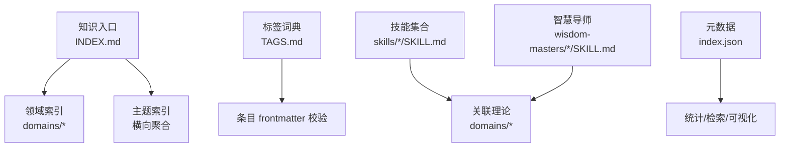

图表来源
- [INDEX.md:1-404](file://knowledge/open-cognition/INDEX.md#L1-L404)
- [TAGS.md:1-72](file://knowledge/open-cognition/TAGS.md#L1-L72)
- [index.json:1-800](file://knowledge/open-cognition/index.json#L1-L800)

章节来源
- [INDEX.md:1-404](file://knowledge/open-cognition/INDEX.md#L1-L404)
- [TAGS.md:1-72](file://knowledge/open-cognition/TAGS.md#L1-L72)
- [index.json:1-800](file://knowledge/open-cognition/index.json#L1-L800)

## 核心组件
- 领域与流派：以 domains/* 为中心，覆盖哲学、宗教、社会学、心理学、伦理学与政治哲学、美学与艺术哲学、文学、认知系统工程八大领域；各域下设 schools/* 与 concepts/*
- 标签体系：TAGS.md 规定领域、流派、时代、主题四类标签，确保一致性与可检索性
- 技能模板：CONTRIBUTING.md 要求每个 SKILL.md 具备 frontmatter、何时使用/不使用、完整示例与反例、理论链接
- 元数据与索引：index.json 汇总条目、类型、领域分布，支撑检索与可视化

章节来源
- [CONTRIBUTING.md:42-58](file://knowledge/open-cognition/CONTRIBUTING.md#L42-L58)
- [TAGS.md:1-72](file://knowledge/open-cognition/TAGS.md#L1-L72)
- [index.json:1-800](file://knowledge/open-cognition/index.json#L1-L800)

## 架构总览
从“知识—技能—平台”三层看：
- 知识层：domains/* 提供理论与概念基础
- 技能层：skills/* 与 wisdom-masters/* 将理论转化为可执行流程
- 平台层：API 与管理界面负责技能的发布、导入与展示

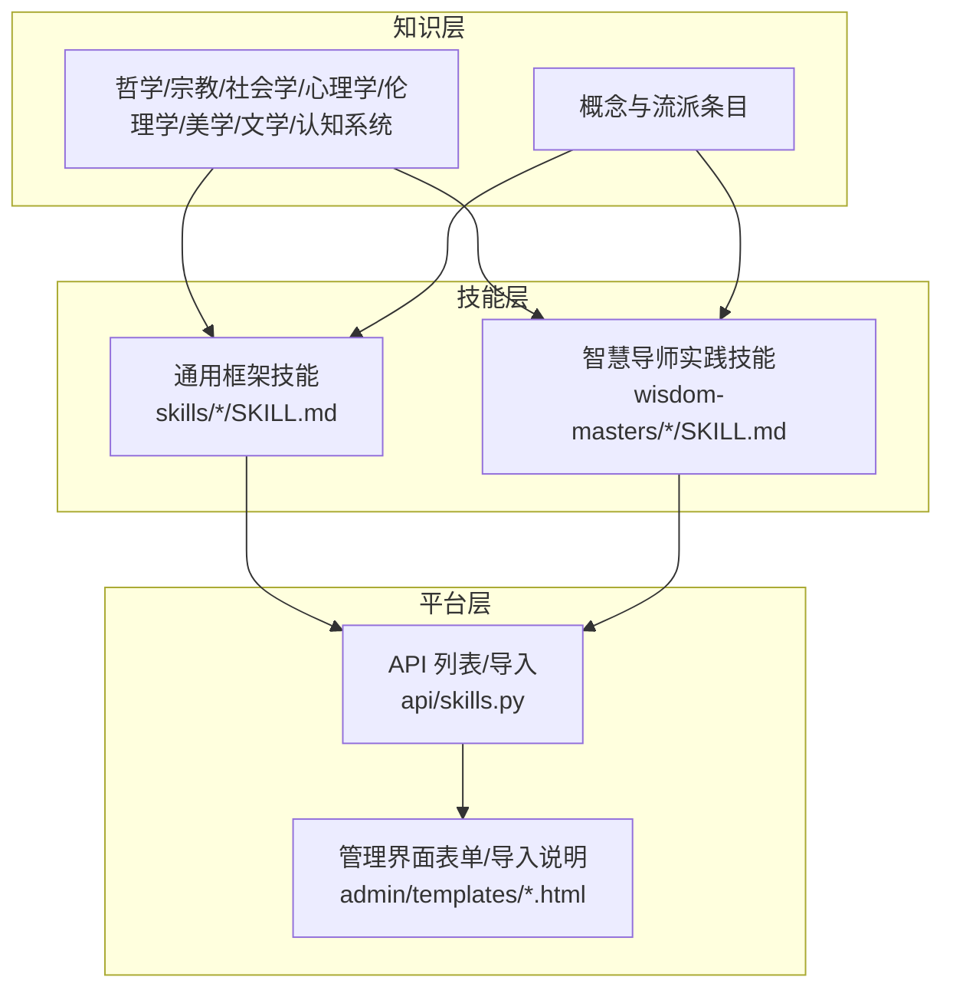

图表来源
- [skills.py:47-90](file://hushai/meditation/api/skills.py#L47-L90)
- [skill_form.html:26-81](file://hushai/meditation/admin/templates/skill_form.html#L26-L81)
- [skills_import.html:1-27](file://hushai/meditation/admin/templates/skills_import.html#L1-L27)

## 详细组件分析

### 哲学框架 Philosophy Frameworks
- 特点：强调概念澄清、论证检验与反思性对话，常用方法包括追问、还原、语言游戏、辩证法等
- 适用场景：抽象概念辨析、假设暴露、批判性思维训练、教学咨询
- 使用模式：以结构化提问引导自我发现，避免直接给答案
- 代表技能：苏格拉底式提问、辩证分析、现象学还原、语言游戏分析、反向思维、齐物论分析、无用之用悖论思考、绝对命令检验、洞穴寓言分析、中庸之道分析、权力意志分析、此在分析、存在主义分析、东西方伦理对比、方法论怀疑、因果问题分析、社会契约分析、实用主义分析、仁礼分析

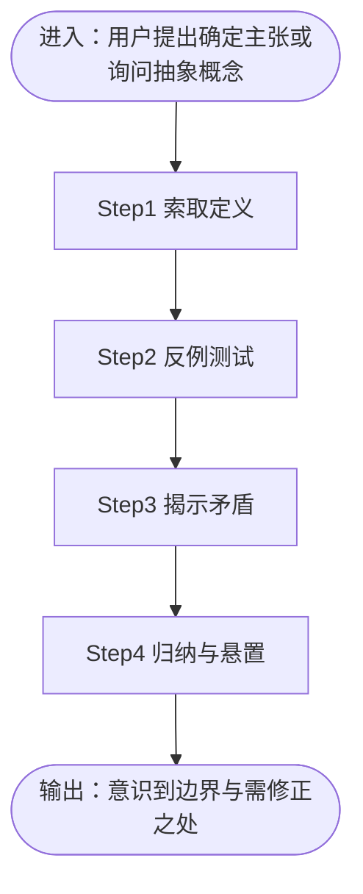

图表来源
- [SKILL.md（苏格拉底式提问）:1-102](file://knowledge/open-cognition/skills/philosophy-frameworks/socratic-questioning/SKILL.md#L1-L102)

章节来源
- [SKILL.md（苏格拉底式提问）:1-102](file://knowledge/open-cognition/skills/philosophy-frameworks/socratic-questioning/SKILL.md#L1-L102)

### 心理学框架 Psychology Frameworks
- 特点：聚焦自动思维、情绪—行为循环、发展阶段与动机机制，强调证据与可验证实验
- 适用场景：重复负面情绪、灾难化预测、自我评价过低、教练与写作辅导中的思维卡点
- 使用模式：捕捉情境—情绪—思维 → 标定扭曲 → 证据法重构 → 行为实验
- 代表技能：荣格原型识别、CBT 认知扭曲识别、马斯洛需求诊断、心流条件评估、双系统思维分析、认知发展阶段评估、行为强化分析、来访者中心对话、潜意识分析、个体化引导、自卑与超越分析、依恋分析、自我效能分析、意义疗法、最近发展区分析、躯体标记分析

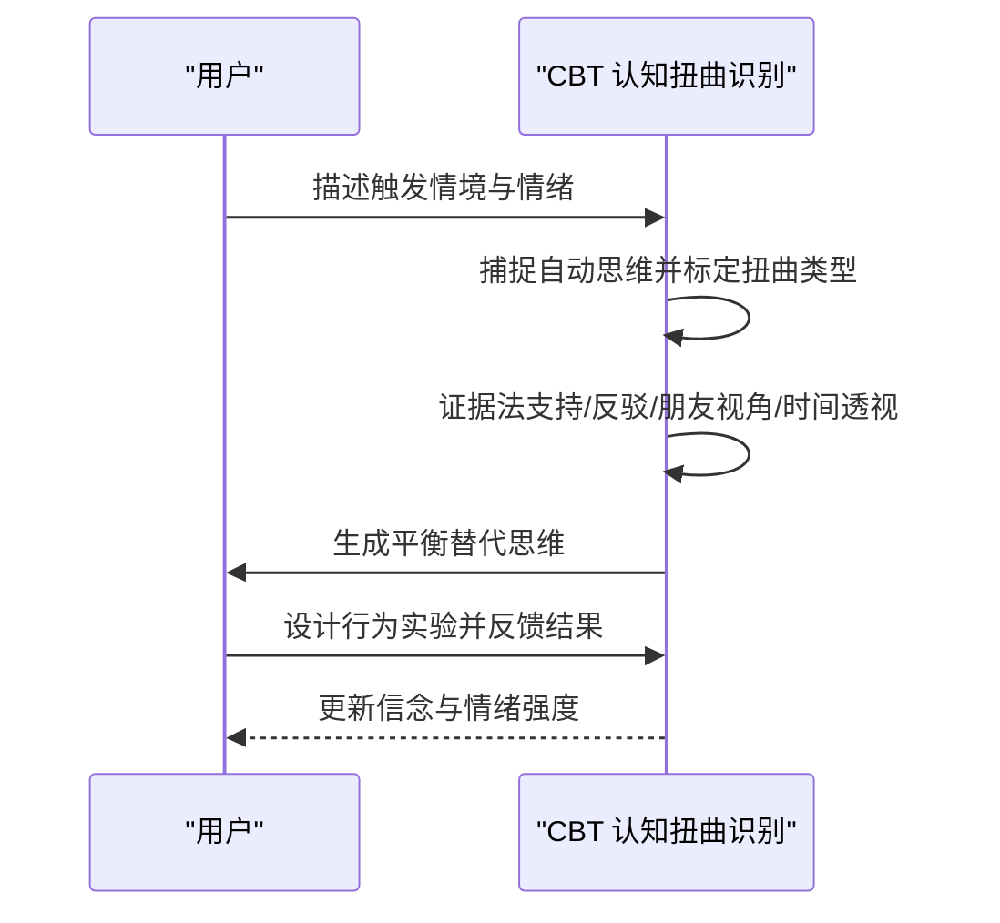

图表来源
- [SKILL.md（CBT 认知扭曲识别）:1-106](file://knowledge/open-cognition/skills/psychology-frameworks/cbt-cognitive-distortion/SKILL.md#L1-L106)

章节来源
- [SKILL.md（CBT 认知扭曲识别）:1-106](file://knowledge/open-cognition/skills/psychology-frameworks/cbt-cognitive-distortion/SKILL.md#L1-L106)

### 美学框架 Aesthetics Frameworks
- 特点：区分审美判断与功利/道德/认知判断，强调形式、普遍同意与必然性
- 适用场景：艺术评论、设计评价、美育训练
- 使用模式：康德四契机（质、量、关系、模态）逐项检验
- 代表技能：审美判断分析、悲剧精神评估、艺术批评框架

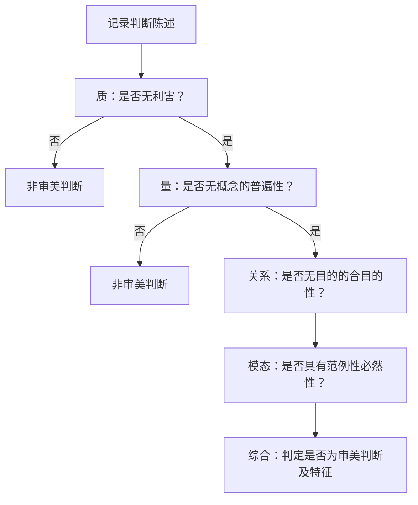

图表来源
- [SKILL.md（审美判断分析）:1-91](file://knowledge/open-cognition/skills/aesthetics-frameworks/aesthetic-judgment-analysis/SKILL.md#L1-L91)

章节来源
- [SKILL.md（审美判断分析）:1-91](file://knowledge/open-cognition/skills/aesthetics-frameworks/aesthetic-judgment-analysis/SKILL.md#L1-L91)

### 宗教框架 Religion Frameworks
- 特点：以医学模型拆解痛苦结构，强调路径落地与传统文本诠释
- 适用场景：反复陷入同一类困扰、需要把灵性诉求落到可操作路径
- 使用模式：四圣谛（苦、集、灭、道）四步；或神圣—世俗分析、无为而治、逍遥游引导等
- 代表技能：四圣谛诊断、圣典诠释学、神圣—世俗分析、无为而治、柔弱胜刚强、逍遥游引导、菩提道次第修行阶段指导、菩提道灯引导、森林禅修引导、缘起法分析、大圆满引导、壁观禅修引导、平常心引导、佛教-道教对话

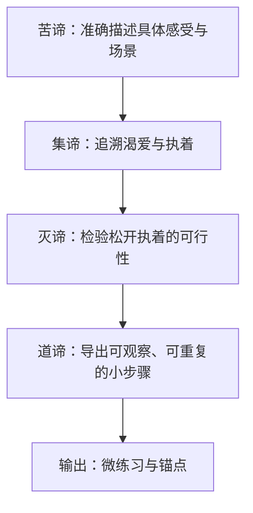

图表来源
- [SKILL.md（四圣谛框架分析）:1-104](file://knowledge/open-cognition/skills/religion-frameworks/four-noble-truths-framework/SKILL.md#L1-L104)

章节来源
- [SKILL.md（四圣谛框架分析）:1-104](file://knowledge/open-cognition/skills/religion-frameworks/four-noble-truths-framework/SKILL.md#L1-L104)

### 社会学框架 Sociology Frameworks
- 特点：将群体行为置于场域、资本、惯习与再生产结构中理解，避免道德化评判
- 适用场景：行业入场门槛、文化品味差异、新场域规则摸底
- 使用模式：布迪厄六步（场域识别—资本类型—位置结构—赌注—惯习—再生产）
- 代表技能：布迪厄场域分析、福柯权力分析、戈夫曼拟剧分析、韦伯理想类型、阶级分析、社会事实分析、交往行为分析、液态现代性分析、理性化分析、规训分析、社会形式分析、网络社会分析、性别操演分析、风险社会分析、文明进程分析

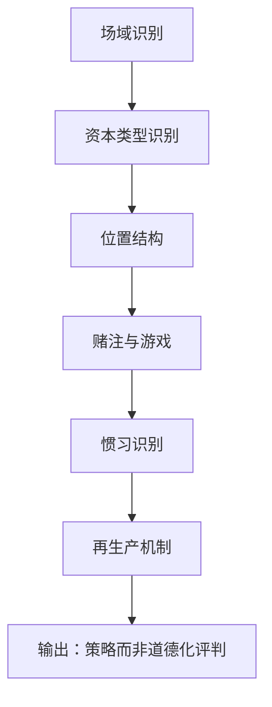

图表来源
- [SKILL.md（布迪厄场域分析）:1-121](file://knowledge/open-cognition/skills/sociology-frameworks/bourdieu-field-analysis/SKILL.md#L1-L121)

章节来源
- [SKILL.md（布迪厄场域分析）:1-121](file://knowledge/open-cognition/skills/sociology-frameworks/bourdieu-field-analysis/SKILL.md#L1-L121)

### 伦理学与政治哲学框架 Ethics & Political Philosophy Frameworks
- 特点：以思想实验与原则检验制度公正性，关注最不利者与基本善
- 适用场景：政策公正性评估、分配机制设计、正当性论证
- 使用模式：无知之幕屏蔽个人信息 → 最大最小原则检验 → 通过/不通过
- 代表技能：苦乐计算、无知之幕分析、亚里士多德德性检验、正义原则检验、自由主义论证分析、自然状态分析、自然权利分析、非暴力抵抗、德性分析、能力方法分析

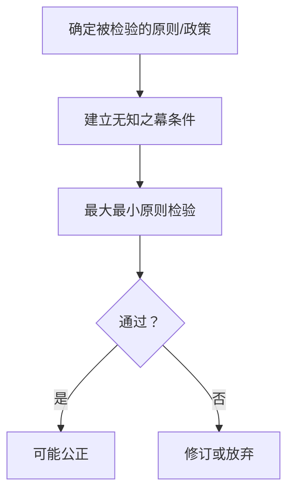

图表来源
- [SKILL.md（无知之幕分析）:1-109](file://knowledge/open-cognition/skills/ethics-politics-frameworks/veil-of-ignorance-analysis/SKILL.md#L1-L109)

章节来源
- [SKILL.md（无知之幕分析）:1-109](file://knowledge/open-cognition/skills/ethics-politics-frameworks/veil-of-ignorance-analysis/SKILL.md#L1-L109)

### 文学框架 Literature Frameworks
- 特点：以经典作家的人性洞察与戏剧冲突理解复杂动机
- 适用场景：人物分析、文学批评、自我认知提升
- 使用模式：识别人性主题 → 分析动机 → 理解复杂性 → 应用到现实
- 代表技能：人性洞察分析、浮士德精神分析、苦难救赎分析、荒诞分析、国民性批判分析

章节来源
- [SKILL.md（人性洞察分析）:1-104](file://knowledge/open-cognition/skills/literature-frameworks/human-nature-analysis/SKILL.md#L1-L104)

### 艺术框架 Arts Frameworks
- 特点：融合观察与想象，强调跨学科整合与创新
- 适用场景：创新思维、产品设计、教育理念
- 使用模式：识别问题 → 跨学科思考 → 观察与想象 → 创造解决方案
- 代表技能：艺术与科学统一分析、苦难与艺术分析、色彩与情感分析

章节来源
- [SKILL.md（艺术与科学统一分析）:1-104](file://knowledge/open-cognition/skills/arts-frameworks/art-science-unity-analysis/SKILL.md#L1-L104)

### 认知系统工程框架 Cognitive Systems Frameworks
- 特点：面向复杂工作领域的认知需求与系统设计，强调约束、策略与社会组织
- 适用场景：人机界面设计、异常/紧急情况下的认知行为分析、安全分析
- 使用模式：五层分析（工作领域—控制任务—策略—社会—组织—工作者能力）
- 代表技能：认知工作分析、认知负荷评估、态势感知诊断、自然决策分析、意义建构引导、人为错误分析、韧性评估、活动系统分析、认知系统设计、可供性分析、认知任务分析、STPA 事故分析、自动化级别评估、人 AI 协作设计、安全学习分析、人因可靠性分析

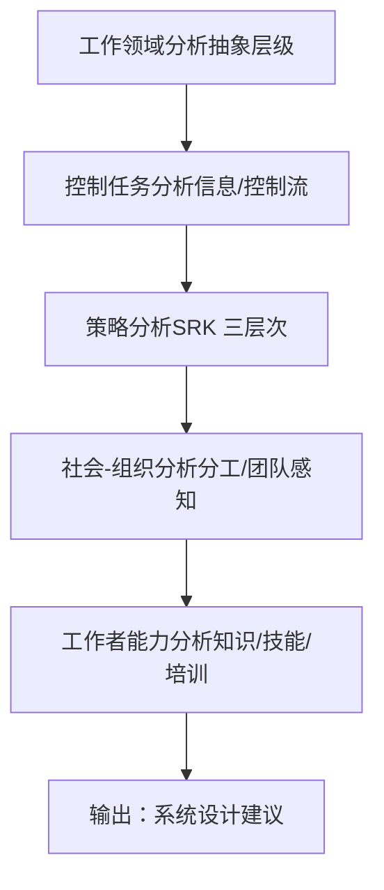

图表来源
- [SKILL.md（认知工作分析）:1-125](file://knowledge/open-cognition/skills/cognitive-systems-frameworks/cognitive-work-analysis/SKILL.md#L1-L125)

章节来源
- [SKILL.md（认知工作分析）:1-125](file://knowledge/open-cognition/skills/cognitive-systems-frameworks/cognitive-work-analysis/SKILL.md#L1-L125)

### 智慧导师框架 Wisdom Masters Frameworks
- 特点：实践导向的心法与当下觉知，强调放下执念、回归平常
- 适用场景：反复纠结、无法放下、需要区分执著与承担
- 使用模式：辨认“住相” → 追溯“能住之心” → 无住检验 → 平常心导引
- 代表技能：慧能无住心法、慧能顿悟检验、慧能平常心引导、临济无事贵人、临济棒喝当下、米拉日巴裸见觉性、米拉日巴苦行炼金、道元只管打坐、道元当下圆满、一行正念呼吸、一行慈悲拥抱

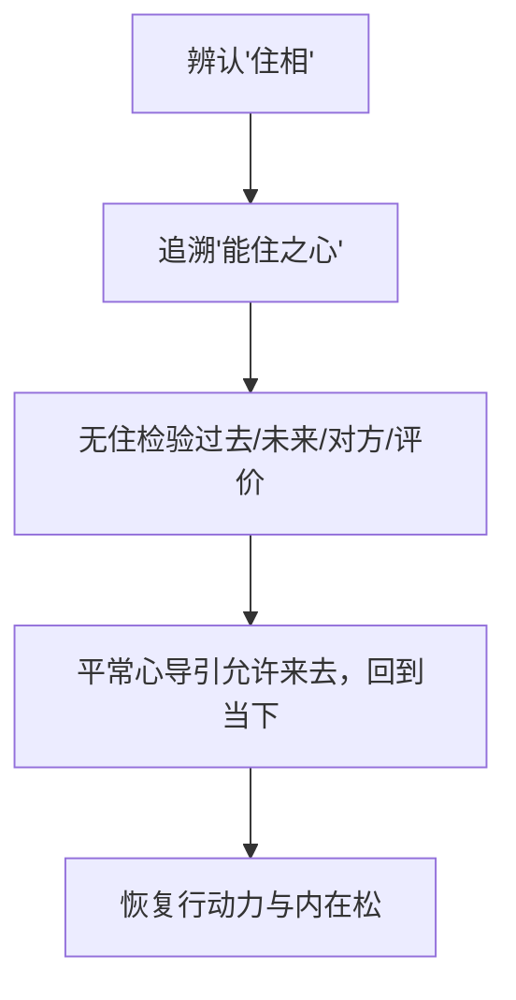

图表来源
- [SKILL.md（慧能无住心法）:1-145](file://knowledge/open-cognition/wisdom-masters/skills/hui-neng-no-dwelling/SKILL.md#L1-L145)

章节来源
- [SKILL.md（慧能无住心法）:1-145](file://knowledge/open-cognition/wisdom-masters/skills/hui-neng-no-dwelling/SKILL.md#L1-L145)

## 依赖关系分析
- 技能对理论的依赖：每个 SKILL.md 通过 linked_thinker/linked_concepts 指向 domains/* 的理论条目，形成“技能—理论”双向引用
- 标签与索引：TAGS.md 的四维标签用于 frontmatter 校验与跨主题检索；INDEX.md 提供纵向与横向索引；index.json 提供机器可读清单
- 平台集成：API 与管理界面负责技能的发布、导入与展示，前台仅展示已启用技能并按排序显示

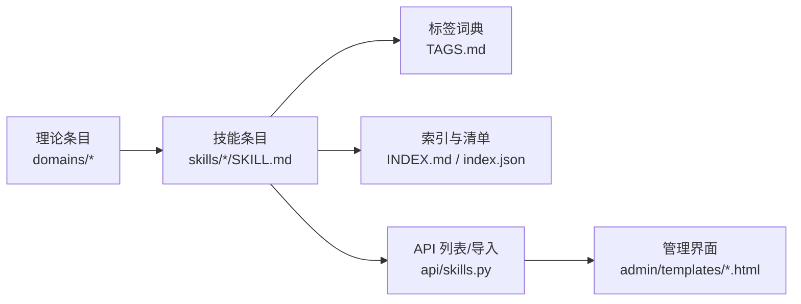

图表来源
- [TAGS.md:1-72](file://knowledge/open-cognition/TAGS.md#L1-L72)
- [index.json:1-800](file://knowledge/open-cognition/index.json#L1-L800)
- [skills.py:47-90](file://hushai/meditation/api/skills.py#L47-L90)
- [skill_form.html:26-81](file://hushai/meditation/admin/templates/skill_form.html#L26-L81)
- [skills_import.html:1-27](file://hushai/meditation/admin/templates/skills_import.html#L1-L27)

章节来源
- [TAGS.md:1-72](file://knowledge/open-cognition/TAGS.md#L1-L72)
- [index.json:1-800](file://knowledge/open-cognition/index.json#L1-L800)
- [skills.py:47-90](file://hushai/meditation/api/skills.py#L47-L90)
- [skill_form.html:26-81](file://hushai/meditation/admin/templates/skill_form.html#L26-L81)
- [skills_import.html:1-27](file://hushai/meditation/admin/templates/skills_import.html#L1-L27)

## 性能与可用性考量
- 检索效率：利用 TAGS.md 的统一标签与 index.json 的结构化清单，可实现快速过滤与聚合
- 内容一致性：CONTRIBUTING.md 的审核标准保障事实准确性、引用可靠性与互链有效性
- 前端展示：API 仅返回已启用技能，按 sort_order 与 name 排序，保证列表稳定与可预期

[本节为通用指导，无需特定文件来源]

## 故障排查指南
- 导入失败或字段缺失：检查 JSON 根结构是否支持顶层数组或 {"skills": [...]}；确认必填字段 name、content 存在
- 描述过长：description 超过 512 字符会被截断，注意精简
- 未显示技能：确认 is_active 为 true；sort_order 合理；名称与正文不为空
- 审核不通过：对照 CONTRIBUTING.md 的审核标准，重点检查标签合规性与互链有效性

章节来源
- [skills.py:61-90](file://hushai/meditation/api/skills.py#L61-L90)
- [skills_import.html:1-27](file://hushai/meditation/admin/templates/skills_import.html#L1-L27)
- [CONTRIBUTING.md:42-58](file://knowledge/open-cognition/CONTRIBUTING.md#L42-L58)

## 结论
本分类体系以“领域—流派—概念—技能”为主线，辅以“主题”横向索引与“标签”统一治理，既满足学术严谨性，又兼顾可操作性与平台集成。通过代表性技能的流程化设计与关联条目，用户可按场景快速定位并组合使用，实现从理论到实践的闭环。

[本节为总结，无需特定文件来源]

## 附录：技能索引与导航
- 哲学框架：苏格拉底式提问、辩证分析、现象学还原、语言游戏分析、反向思维、齐物论分析、无用之用悖论思考、绝对命令检验、洞穴寓言分析、中庸之道分析、权力意志分析、此在分析、存在主义分析、东西方伦理对比、方法论怀疑、因果问题分析、社会契约分析、实用主义分析、仁礼分析
- 宗教框架：四圣谛诊断、圣典诠释学、神圣—世俗分析、无为而治、柔弱胜刚强、逍遥游引导、菩提道次第修行阶段指导、菩提道灯引导、森林禅修引导、缘起法分析、大圆满引导、壁观禅修引导、平常心引导、佛教-道教对话
- 社会学框架：布迪厄场域分析、福柯权力分析、戈夫曼拟剧分析、韦伯理想类型、阶级分析、社会事实分析、交往行为分析、液态现代性分析、理性化分析、规训分析、社会形式分析、网络社会分析、性别操演分析、风险社会分析、文明进程分析
- 心理学框架：荣格原型识别、CBT 认知扭曲识别、马斯洛需求诊断、心流条件评估、双系统思维分析、认知发展阶段评估、行为强化分析、来访者中心对话、潜意识分析、个体化引导、自卑与超越分析、依恋分析、自我效能分析、意义疗法、最近发展区分析、躯体标记分析
- 伦理学与政治哲学框架：苦乐计算、无知之幕分析、亚里士多德德性检验、正义原则检验、自由主义论证分析、自然状态分析、自然权利分析、非暴力抵抗、德性分析、能力方法分析
- 美学框架：审美判断分析、悲剧精神评估、艺术批评框架
- 文学框架：人性洞察分析、浮士德精神分析、苦难救赎分析、荒诞分析、国民性批判分析
- 艺术框架：艺术与科学统一分析、苦难与艺术分析、色彩与情感分析
- 认知系统工程框架：认知工作分析、认知负荷评估、态势感知诊断、自然决策分析、意义建构引导、人为错误分析、韧性评估、活动系统分析、认知系统设计、可供性分析、认知任务分析、STPA 事故分析、自动化级别评估、人 AI 协作设计、安全学习分析、人因可靠性分析
- 智慧导师框架：慧能无住心法、慧能顿悟检验、慧能平常心引导、临济无事贵人、临济棒喝当下、米拉日巴裸见觉性、米拉日巴苦行炼金、道元只管打坐、道元当下圆满、一行正念呼吸、一行慈悲拥抱

章节来源
- [INDEX.md:267-404](file://knowledge/open-cognition/INDEX.md#L267-L404)