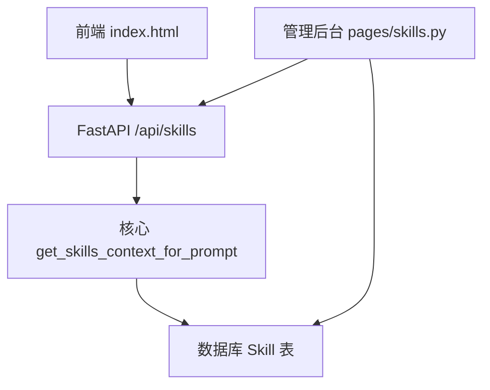
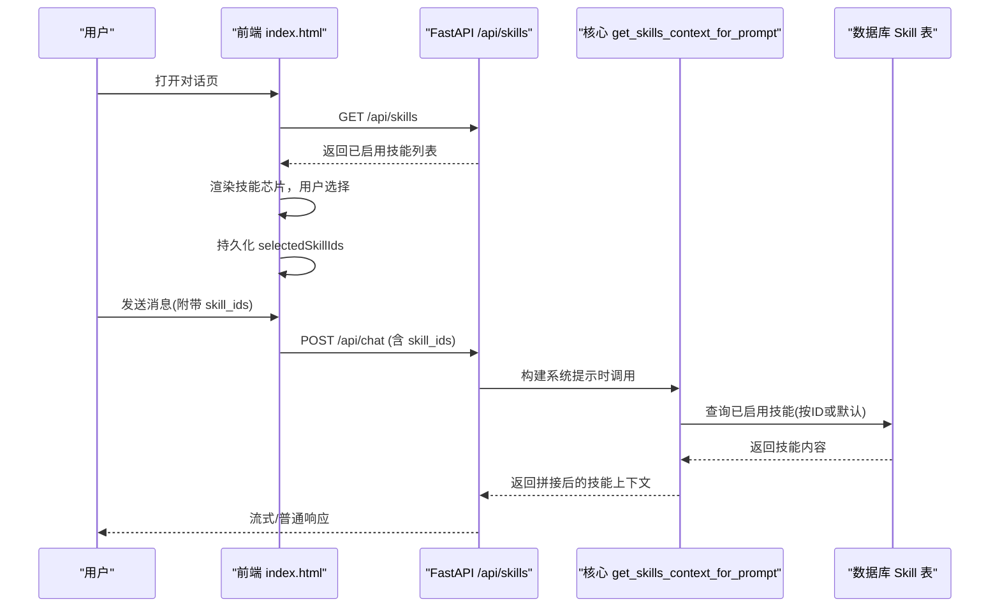
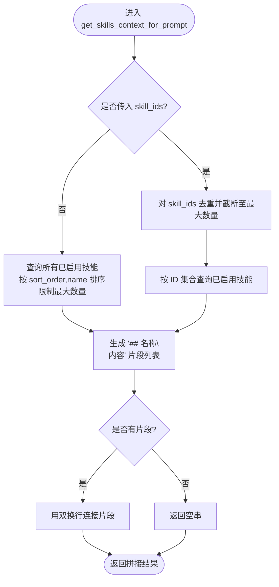
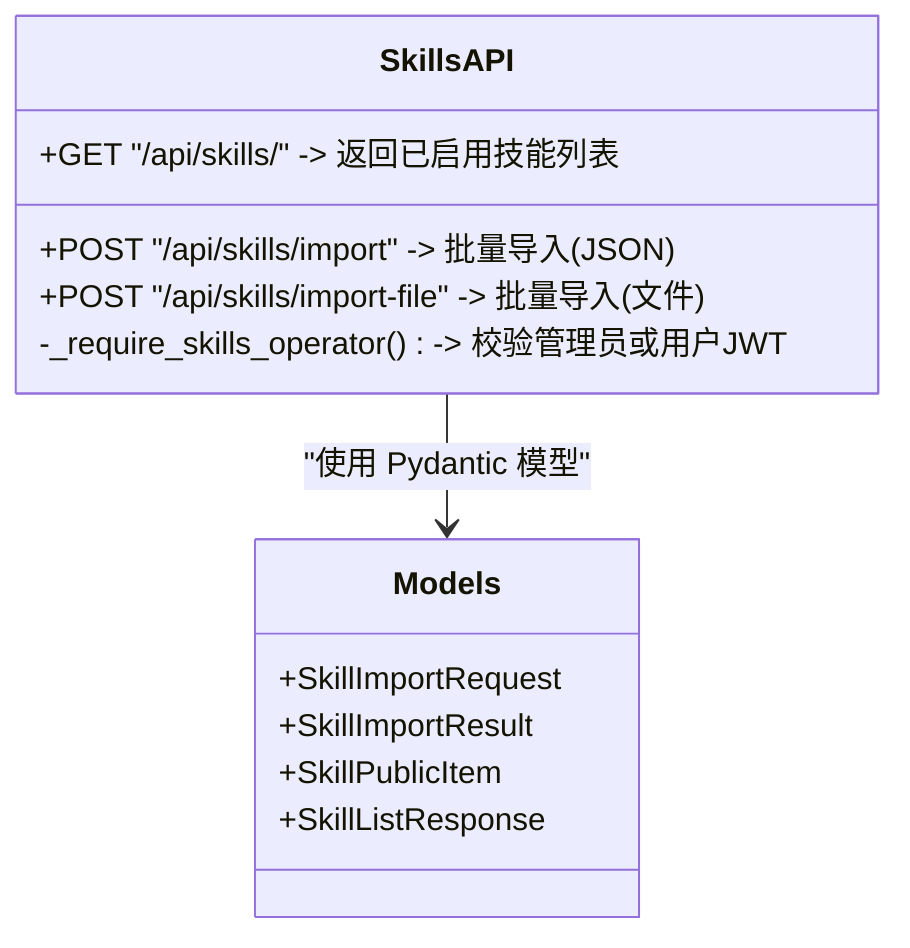
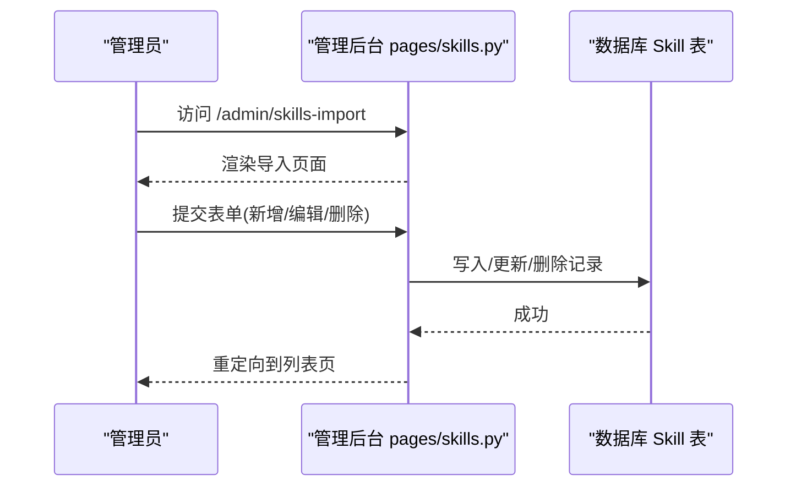
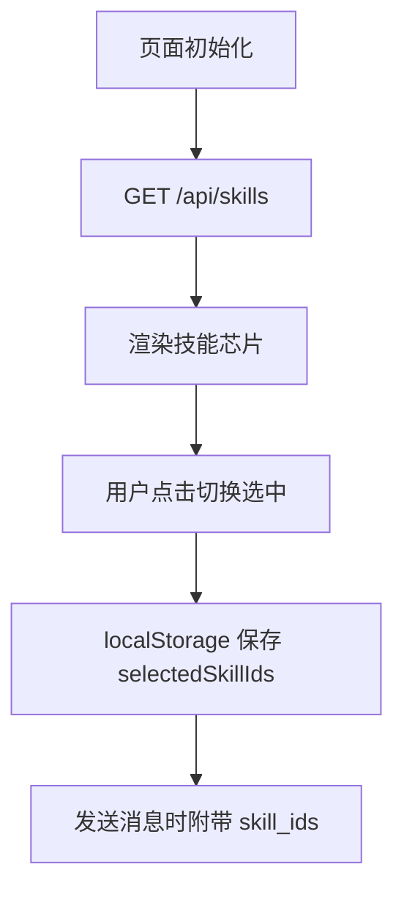
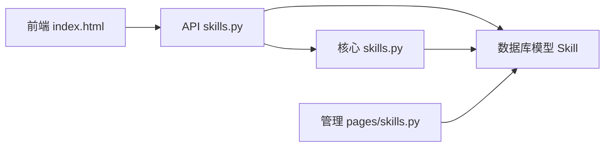

# 技能插件系统

<cite>
**本文引用的文件**
- [README.md](file://README.md)
- [skills.py（核心）](file://hushai/meditation/core/skills.py)
- [skills.py（API）](file://hushai/meditation/api/skills.py)
- [skills.py（管理页面）](file://hushai/meditation/admin/pages/skills.py)
- [index.html（前端）](file://hushai/meditation/static/index.html)
- [skill-template.md（模板）](file://knowledge/open-cognition/templates/skill-template.md)
- [quality-criteria.md（质量标准）](file://knowledge/open-cognition/meta/quality-criteria.md)
- [test_core.py（测试）](file://tests/meditation/test_core.py)
</cite>

## 目录
1. [简介](#简介)
2. [项目结构](#项目结构)
3. [核心组件](#核心组件)
4. [架构总览](#架构总览)
5. [详细组件分析](#详细组件分析)
6. [依赖关系分析](#依赖关系分析)
7. [性能与容量特性](#性能与容量特性)
8. [故障排查指南](#故障排查指南)
9. [结论](#结论)
10. [附录：开发流程与示例](#附录开发流程与示例)

## 简介
本文件面向 hush.ai 的“技能插件系统”，系统性阐述其设计理念、数据模型、生命周期与动态加载机制，并提供从 SKILL.md 规范到批量导入、效果评估与使用示例的完整开发指南。该系统将“技能”作为可插拔的知识与行为提示片段，在对话引擎中按需挂载，从而增强 AI 回复的专业性与一致性。

## 项目结构
围绕技能插件的关键代码分布在以下位置：
- 核心逻辑：按 ID 或自动策略加载已启用技能文本并拼入系统提示
- API 层：提供公开的技能列表与受保护的批量导入接口
- 管理后台：提供技能的增删改查与批量导入页面
- 前端：展示可选技能清单，支持用户选择并持久化
- 知识库模板与质量标准：定义 SKILL.md 结构与审核标准
- 测试：覆盖技能上下文构建与系统提示组装

图表来源
- [index.html（前端）:1326-1366](file://hushai/meditation/static/index.html#L1326-L1366)
- [skills.py（API）:47-113](file://hushai/meditation/api/skills.py#L47-L113)
- [skills.py（核心）:14-59](file://hushai/meditation/core/skills.py#L14-L59)
- [skills.py（管理页面）:17-218](file://hushai/meditation/admin/pages/skills.py#L17-L218)

章节来源
- [README.md:74-79](file://README.md#L74-L79)
- [skills.py（核心）:1-59](file://hushai/meditation/core/skills.py#L1-L59)
- [skills.py（API）:1-113](file://hushai/meditation/api/skills.py#L1-L113)
- [skills.py（管理页面）:1-218](file://hushai/meditation/admin/pages/skills.py#L1-L218)
- [index.html（前端）:1326-1366](file://hushai/meditation/static/index.html#L1326-L1366)

## 核心组件
- 技能上下文装配器：根据传入的 skill_ids 或默认策略，查询已启用的技能并按排序拼接为系统提示的一部分
- 技能 API：列出可用技能；支持 JSON 与文件上传两种批量导入方式，并进行权限校验
- 管理后台：提供技能的新建、编辑、删除与分页搜索；提供批量导入页面
- 前端交互：拉取技能列表，渲染可选项，限制最大选择数量，持久化到本地存储
- 模板与质量：SKILL.md 模板与质量标准指导内容生产与审核

章节来源
- [skills.py（核心）:10-59](file://hushai/meditation/core/skills.py#L10-L59)
- [skills.py（API）:28-113](file://hushai/meditation/api/skills.py#L28-L113)
- [skills.py（管理页面）:17-218](file://hushai/meditation/admin/pages/skills.py#L17-L218)
- [index.html（前端）:1326-1366](file://hushai/meditation/static/index.html#L1326-L1366)
- [skill-template.md（模板）:1-76](file://knowledge/open-cognition/templates/skill-template.md#L1-L76)
- [quality-criteria.md（质量标准）:32-55](file://knowledge/open-cognition/meta/quality-criteria.md#L32-L55)

## 架构总览
技能插件系统在对话链路中的角色如下：
- 前端通过 /api/skills 获取可用技能，用户选择后随请求携带 skill_ids
- 后端在构建系统提示时调用核心函数，按规则加载并拼接技能内容
- 管理员通过后台或 API 进行批量导入，维护技能库

图表来源
- [index.html（前端）:1326-1366](file://hushai/meditation/static/index.html#L1326-L1366)
- [skills.py（API）:47-58](file://hushai/meditation/api/skills.py#L47-L58)
- [skills.py（核心）:14-59](file://hushai/meditation/core/skills.py#L14-L59)

## 详细组件分析

### 核心：技能上下文装配器
职责
- 接收会话级 skill_ids（可为空）
- 若为空则默认加载所有已启用技能（带上限）
- 若不为空则去重并按指定顺序加载（带上限）
- 将技能标题与正文拼接为系统提示片段

关键约束
- 每条消息最多挂载 N 个技能（常量控制）
- 仅加载 is_active=True 的记录
- 按 sort_order 与 name 排序保证稳定性

复杂度
- 时间：O(k + m)，k 为去重后的 skill_ids 长度，m 为查询结果行数
- 空间：O(m)，用于缓存行对象与拼接字符串

图表来源
- [skills.py（核心）:14-59](file://hushai/meditation/core/skills.py#L14-L59)

章节来源
- [skills.py（核心）:10-59](file://hushai/meditation/core/skills.py#L10-L59)

### API：技能列表与批量导入
能力
- 列出已启用技能（公开）
- 批量导入（JSON 或文件上传），需管理员或用户 JWT
- 字段裁剪与长度限制，避免超长内容影响提示词

权限
- 导入接口要求 Authorization 头，支持管理员令牌或用户令牌
- 失败时返回 401/400 等错误码

图表来源
- [skills.py（API）:28-113](file://hushai/meditation/api/skills.py#L28-L113)

章节来源
- [skills.py（API）:1-113](file://hushai/meditation/api/skills.py#L1-L113)

### 管理后台：技能 CRUD 与批量导入页面
能力
- 技能列表分页与模糊搜索
- 新建/编辑表单，包含名称、描述、正文、排序、启用状态
- 删除技能
- 批量导入页面入口

图表来源
- [skills.py（管理页面）:17-218](file://hushai/meditation/admin/pages/skills.py#L17-L218)

章节来源
- [skills.py（管理页面）:1-218](file://hushai/meditation/admin/pages/skills.py#L1-L218)

### 前端：技能选择与持久化
能力
- 拉取 /api/skills 列表
- 渲染技能芯片，限制最大选择数
- 将选中 IDs 持久化到 localStorage，供后续对话携带

图表来源
- [index.html（前端）:1326-1366](file://hushai/meditation/static/index.html#L1326-L1366)

章节来源
- [index.html（前端）:1326-1366](file://hushai/meditation/static/index.html#L1326-L1366)

### 模板与质量标准：SKILL.md 规范
要点
- YAML frontmatter 包含 name、description、domain、linked_thinker、linked_concepts、tags 等
- 必须包含“何时使用/何时不使用”
- 至少一个完整示例与一个反例
- 链接到 domains 下的理论条目
- 审核遵循质量标准（事实性、完整性、辨析性、互链规范、风格等）

章节来源
- [skill-template.md（模板）:1-76](file://knowledge/open-cognition/templates/skill-template.md#L1-L76)
- [quality-criteria.md（质量标准）:32-55](file://knowledge/open-cognition/meta/quality-criteria.md#L32-L55)

### 测试：技能上下文与系统提示
覆盖点
- skill_ids=None 时自动挂载
- skill_ids=[] 时不挂载
- 系统提示各段落组合正确

章节来源
- [test_core.py（测试）:71-107](file://tests/meditation/test_core.py#L71-L107)

## 依赖关系分析
- 前端依赖 /api/skills 获取技能元信息
- API 依赖数据库模型 Skill 与 Pydantic 模型
- 核心模块依赖数据库会话与 Skill 模型
- 管理后台依赖认证与会话，直接操作数据库

图表来源
- [index.html（前端）:1326-1366](file://hushai/meditation/static/index.html#L1326-L1366)
- [skills.py（API）:47-113](file://hushai/meditation/api/skills.py#L47-L113)
- [skills.py（核心）:14-59](file://hushai/meditation/core/skills.py#L14-L59)
- [skills.py（管理页面）:17-218](file://hushai/meditation/admin/pages/skills.py#L17-L218)

## 性能与容量特性
- 单条消息最大挂载技能数：由常量控制，避免提示词过长
- 批量导入上限：单次导入条目数有上限，防止过大事务
- 排序与去重：在内存中进行，减少数据库压力
- 建议
  - 合理设置每个技能的 content 长度，聚焦关键步骤与范式
  - 对高频使用的技能优先设置较小 sort_order，提升命中率
  - 批量导入分批次执行，避免超时

[本节为通用指导，无需源码引用]

## 故障排查指南
常见问题与定位
- 401 未授权：检查 Authorization 头是否正确，确认管理员或用户令牌有效
- 400 格式错误：批量导入 JSON 解析失败或字段不符合模型定义
- 无技能显示：确认 is_active=True 且存在记录；检查前端是否成功拉取列表
- 未生效：确认请求携带了 skill_ids，且核心函数被调用

定位路径
- 权限校验与导入逻辑：[skills.py（API）:28-113](file://hushai/meditation/api/skills.py#L28-L113)
- 上下文装配：[skills.py（核心）:14-59](file://hushai/meditation/core/skills.py#L14-L59)
- 前端拉取与选择：[index.html（前端）:1326-1366](file://hushai/meditation/static/index.html#L1326-L1366)
- 管理后台操作：[skills.py（管理页面）:17-218](file://hushai/meditation/admin/pages/skills.py#L17-L218)

章节来源
- [skills.py（API）:28-113](file://hushai/meditation/api/skills.py#L28-L113)
- [skills.py（核心）:14-59](file://hushai/meditation/core/skills.py#L14-L59)
- [index.html（前端）:1326-1366](file://hushai/meditation/static/index.html#L1326-L1366)
- [skills.py（管理页面）:17-218](file://hushai/meditation/admin/pages/skills.py#L17-L218)

## 结论
技能插件系统以“轻量提示片段 + 动态装配”为核心，结合前后端与管理后台形成闭环：内容生产遵循 SKILL.md 规范与质量标准，运行时按策略注入系统提示，既保证了可控性又具备扩展性。通过批量导入与前端选择，开发者与运营者可高效维护领域知识，并在对话中精准增强 AI 表现。

[本节为总结，无需源码引用]

## 附录：开发流程与示例

### 从零开发一个自定义技能
- 编写 SKILL.md
  - 使用模板，填写 frontmatter 与必要章节
  - 明确触发场景、操作步骤、示例与反例
  - 关联 domains 下相关概念与思想家
- 入库与启用
  - 通过管理后台新建或 API 批量导入
  - 设置 is_active=True 与合适的 sort_order
- 前端验证
  - 刷新页面查看技能芯片是否出现并可勾选
- 运行验证
  - 发送消息并携带 skill_ids，观察系统提示是否包含该技能内容
- 回归与测试
  - 参考现有测试用例思路，覆盖自动挂载与空列表场景

章节来源
- [skill-template.md（模板）:1-76](file://knowledge/open-cognition/templates/skill-template.md#L1-L76)
- [quality-criteria.md（质量标准）:32-55](file://knowledge/open-cognition/meta/quality-criteria.md#L32-L55)
- [skills.py（管理页面）:79-129](file://hushai/meditation/admin/pages/skills.py#L79-L129)
- [skills.py（API）:61-113](file://hushai/meditation/api/skills.py#L61-L113)
- [index.html（前端）:1326-1366](file://hushai/meditation/static/index.html#L1326-L1366)
- [test_core.py（测试）:71-107](file://tests/meditation/test_core.py#L71-L107)

### 批量导入与文件上传
- JSON 批量导入
  - 构造符合模型的数组，包含 name、description、content、sort_order、is_active
  - 调用 /api/skills/import，携带 Authorization
- 文件上传导入
  - 上传 JSON 文件至 /api/skills/import-file
  - 服务端解析并复用同一导入逻辑
- 注意事项
  - description 会被裁剪至固定长度
  - 单次导入条目数有上限

章节来源
- [skills.py（API）:61-113](file://hushai/meditation/api/skills.py#L61-L113)

### 技能分类体系与管理方式
- 领域划分
  - 美学框架、心理学框架、哲学框架、认知系统、伦理政治、文学、宗教、社会学等
- 组织方式
  - 通过 SKILL.md 的 domain 与 tags 标注领域与主题
  - 通过 linked_thinker 与 linked_concepts 建立跨条目互链
- 管理与调用
  - 管理后台统一维护启用状态与排序
  - 前端按用户选择或默认策略调用

章节来源
- [README.md:74-79](file://README.md#L74-L79)
- [skill-template.md（模板）:1-76](file://knowledge/open-cognition/templates/skill-template.md#L1-L76)

### 效果评估机制
- 过程指标
  - 技能命中率（被选中的比例）、平均挂载数量、导入成功率
- 结果指标
  - 对话质量评分（人工抽检）、任务完成率、用户满意度
- 评估方法
  - 基于 A/B 对比不同技能组合的效果
  - 结合知识库检索命中与记忆维度变化进行归因

[本节为通用指导，无需源码引用]