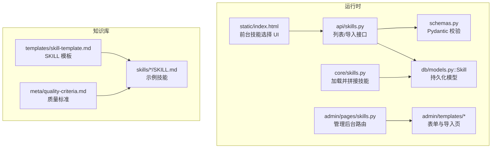
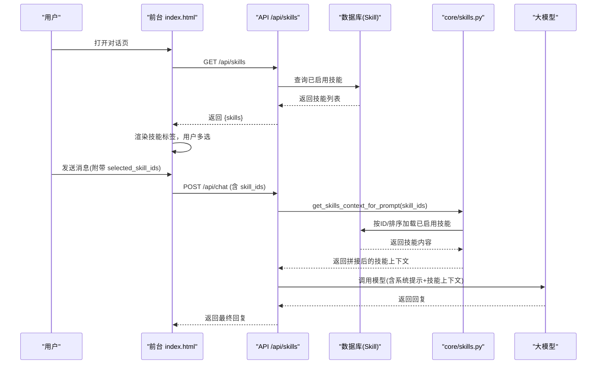
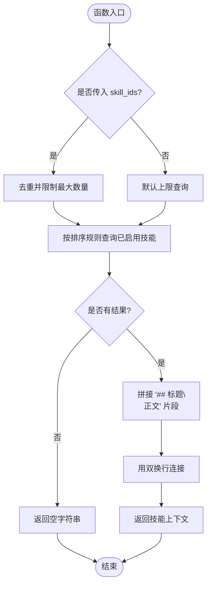
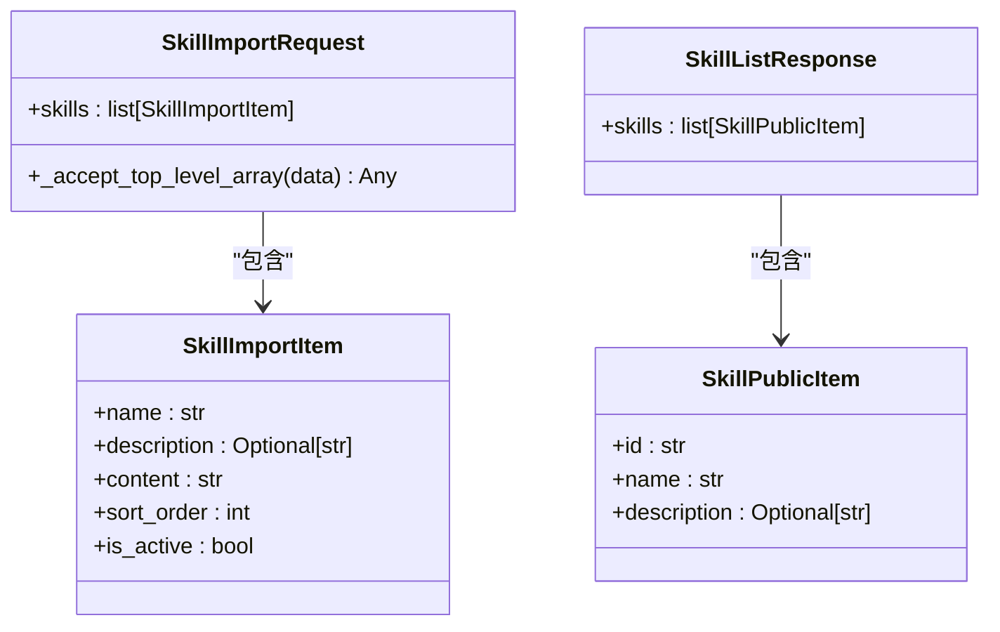
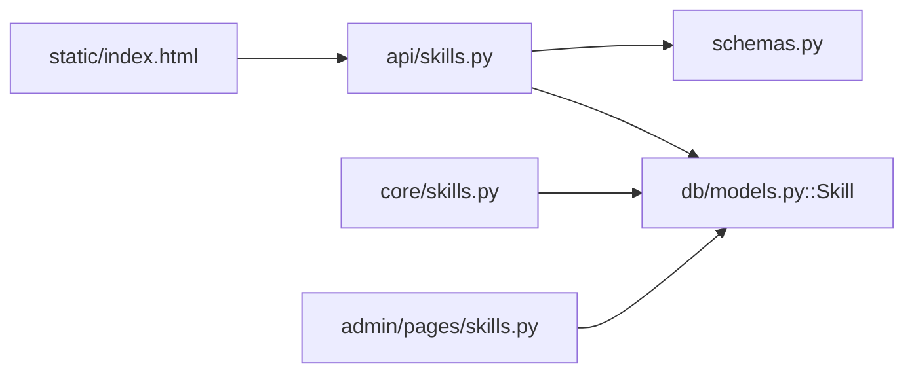

# 插件开发指南

<cite>
**本文引用的文件**
- [README.md](file://README.md)
- [CONTRIBUTING.md](file://CONTRIBUTING.md)
- [hushai/meditation/core/skills.py](file://hushai/meditation/core/skills.py)
- [hushai/meditation/api/skills.py](file://hushai/meditation/api/skills.py)
- [hushai/meditation/db/models.py](file://hushai/meditation/db/models.py)
- [hushai/meditation/schemas.py](file://hushai/meditation/schemas.py)
- [hushai/meditation/admin/pages/skills.py](file://hushai/meditation/admin/pages/skills.py)
- [hushai/meditation/admin/templates/skill_form.html](file://hushai/meditation/admin/templates/skill_form.html)
- [hushai/meditation/admin/templates/skills_import.html](file://hushai/meditation/admin/templates/skills_import.html)
- [hushai/meditation/static/index.html](file://hushai/meditation/static/index.html)
- [knowledge/open-cognition/templates/skill-template.md](file://knowledge/open-cognition/templates/skill-template.md)
- [knowledge/open-cognition/meta/quality-criteria.md](file://knowledge/open-cognition/meta/quality-criteria.md)
- [knowledge/open-cognition/skills/philosophy-frameworks/dialectical-analysis/SKILL.md](file://knowledge/open-cognition/skills/philosophy-frameworks/dialectical-analysis/SKILL.md)
- [knowledge/open-cognition/skills/psychology-frameworks/cbt-cognitive-distortion/SKILL.md](file://knowledge/open-cognition/skills/psychology-frameworks/cbt-cognitive-distortion/SKILL.md)
- [knowledge/open-cognition/skills/cognitive-systems-frameworks/human-ai-teaming/SKILL.md](file://knowledge/open-cognition/skills/cognitive-systems-frameworks/human-ai-teaming/SKILL.md)
- [tests/meditation/test_schemas.py](file://tests/meditation/test_schemas.py)
</cite>

## 目录
1. [引言](#引言)
2. [项目结构](#项目结构)
3. [核心组件](#核心组件)
4. [架构总览](#架构总览)
5. [详细组件分析](#详细组件分析)
6. [依赖关系分析](#依赖关系分析)
7. [性能与容量规划](#性能与容量规划)
8. [调试与排障](#调试与排障)
9. [结论](#结论)
10. [附录：模板与最佳实践](#附录模板与最佳实践)

## 引言
本指南面向希望在 hush.ai 中从零开始开发“技能插件”的开发者。技能插件以 Markdown 文档形式定义，通过管理后台或批量导入进入系统，并在对话时按用户选择注入到模型提示词中，从而增强回复质量与一致性。本指南覆盖环境准备、项目结构搭建、SKILL.md 编写规范、完整开发生命周期（需求—实现—测试—上线）、多类型示例（分析框架类、指导对话类、工具辅助类）、调试技巧、常见问题排查与性能优化建议，并提供代码级参考路径与最佳实践总结。

## 项目结构
围绕“技能插件”的关键目录与职责如下：
- 运行时加载与注入
  - 核心逻辑：按 ID 加载已启用技能并拼接为系统提示上下文
  - API：列出可用技能、批量导入
  - 数据模型：持久化存储技能元信息与正文
  - 前端交互：前台展示可选技能清单，用户勾选后随请求发送
  - 管理后台：创建、编辑、删除、批量导入技能
- 知识仓库中的 SKILL 模板与范例
  - 模板：YAML frontmatter + 结构化章节
  - 质量标准：事实性、完整性、辨析性、互链规范、Skill 专项要求
  - 示例：哲学辩证法分析、CBT 认知扭曲识别、人-AI 协作设计

图表来源
- [hushai/meditation/core/skills.py:1-59](file://hushai/meditation/core/skills.py#L1-L59)
- [hushai/meditation/api/skills.py:47-90](file://hushai/meditation/api/skills.py#L47-L90)
- [hushai/meditation/db/models.py:120-135](file://hushai/meditation/db/models.py#L120-L135)
- [hushai/meditation/schemas.py:162-218](file://hushai/meditation/schemas.py#L162-L218)
- [hushai/meditation/static/index.html:1326-1366](file://hushai/meditation/static/index.html#L1326-L1366)
- [hushai/meditation/admin/pages/skills.py:46-187](file://hushai/meditation/admin/pages/skills.py#L46-L187)
- [hushai/meditation/admin/templates/skill_form.html:26-46](file://hushai/meditation/admin/templates/skill_form.html#L26-L46)
- [hushai/meditation/admin/templates/skills_import.html:1-27](file://hushai/meditation/admin/templates/skills_import.html#L1-L27)
- [knowledge/open-cognition/templates/skill-template.md:1-76](file://knowledge/open-cognition/templates/skill-template.md#L1-L76)
- [knowledge/open-cognition/meta/quality-criteria.md:1-55](file://knowledge/open-cognition/meta/quality-criteria.md#L1-L55)

章节来源
- [README.md:136-178](file://README.md#L136-L178)
- [CONTRIBUTING.md:9-21](file://CONTRIBUTING.md#L9-L21)

## 核心组件
- 技能加载器
  - 根据传入的 skill_ids 去重并按排序规则查询已启用的技能，拼接为系统提示上下文；若未指定则返回默认上限数量的已启用技能。
- 技能 API
  - 列出所有已启用技能（供前台渲染）；支持批量导入（JSON），包含字段校验与长度限制。
- 数据模型
  - Skill 表包含名称、描述、正文、是否启用、排序等字段，以及时间戳。
- 请求/响应模型
  - Pydantic 模型对输入进行严格校验，包括去重、最大数量、必填项、文本裁剪等。
- 管理后台
  - 提供新建、编辑、删除、分页搜索与批量导入页面，含权限校验与错误回显。
- 前台交互
  - 拉取可用技能并以“标签”形式展示，用户可多选，本地缓存选择结果，随聊天请求一并发送。

章节来源
- [hushai/meditation/core/skills.py:1-59](file://hushai/meditation/core/skills.py#L1-L59)
- [hushai/meditation/api/skills.py:47-90](file://hushai/meditation/api/skills.py#L47-L90)
- [hushai/meditation/db/models.py:120-135](file://hushai/meditation/db/models.py#L120-L135)
- [hushai/meditation/schemas.py:162-218](file://hushai/meditation/schemas.py#L162-L218)
- [hushai/meditation/admin/pages/skills.py:46-187](file://hushai/meditation/admin/pages/skills.py#L46-L187)
- [hushai/meditation/static/index.html:1326-1366](file://hushai/meditation/static/index.html#L1326-L1366)

## 架构总览
下图展示了从用户在前台选择技能，到后端加载并注入系统提示的端到端流程。

图表来源
- [hushai/meditation/static/index.html:1326-1366](file://hushai/meditation/static/index.html#L1326-L1366)
- [hushai/meditation/api/skills.py:47-90](file://hushai/meditation/api/skills.py#L47-L90)
- [hushai/meditation/core/skills.py:14-59](file://hushai/meditation/core/skills.py#L14-L59)
- [hushai/meditation/db/models.py:120-135](file://hushai/meditation/db/models.py#L120-L135)

## 详细组件分析

### 组件A：技能加载与注入（core/skills.py）
- 功能要点
  - 当传入 skill_ids 时，先做去重与上限控制，再按 sort_order 与 name 排序查询；否则直接返回默认上限的已启用技能。
  - 将每个技能的 name 与 content 拼接为“## 标题 + 正文”的段落，用双换行连接，作为系统提示的一部分。
- 复杂度与边界
  - 去重使用集合，时间复杂度 O(n)，n 为传入的 skill_ids 数量。
  - 数据库查询使用 IN 子句与 ORDER BY，注意索引与 LIMIT 控制。
  - 空输入与无匹配记录时返回空字符串，避免污染系统提示。
- 扩展点
  - 可按需增加过滤条件（如 domain/tags）。
  - 可增加缓存层以减少重复查询。

图表来源
- [hushai/meditation/core/skills.py:14-59](file://hushai/meditation/core/skills.py#L14-L59)

章节来源
- [hushai/meditation/core/skills.py:1-59](file://hushai/meditation/core/skills.py#L1-L59)

### 组件B：技能 API（api/skills.py）
- 能力
  - 列出已启用技能（仅公开 id/name/description）。
  - 批量导入：接受 JSON，支持顶层数组或 {"skills": [...]} 两种根结构；对 description 与 name 做长度裁剪；写入数据库。
- 安全与校验
  - 导入接口需要管理员权限（依赖中间件）。
  - 使用 Pydantic 模型进行强校验与默认值处理。
- 典型错误
  - 空列表导入会触发校验异常。
  - 超长字段会被截断，不会报错但可能丢失信息。

图表来源
- [hushai/meditation/schemas.py:162-218](file://hushai/meditation/schemas.py#L162-L218)
- [hushai/meditation/api/skills.py:47-90](file://hushai/meditation/api/skills.py#L47-L90)

章节来源
- [hushai/meditation/api/skills.py:47-90](file://hushai/meditation/api/skills.py#L47-L90)
- [hushai/meditation/schemas.py:162-218](file://hushai/meditation/schemas.py#L162-L218)
- [tests/meditation/test_schemas.py:121-161](file://tests/meditation/test_schemas.py#L121-L161)

### 组件C：数据模型（db/models.py::Skill）
- 字段说明
  - id：UUID 主键
  - name：最多 128 字符
  - description：最多 512 字符（用于前台展示）
  - content：技能正文（注入模型）
  - is_active：是否启用
  - sort_order：排序权重（越小越靠前）
  - created_at/updated_at：时间戳
- 索引与约束
  - 主键唯一；其他字段无额外索引，查询主要依赖应用层排序与过滤。

章节来源
- [hushai/meditation/db/models.py:120-135](file://hushai/meditation/db/models.py#L120-L135)

### 组件D：管理后台（pages/skills.py 与 templates）
- 功能
  - 列表页：分页、搜索（名称/描述模糊匹配）、排序。
  - 新建/编辑：表单校验（名称与正文必填）、错误回显。
  - 批量导入：说明与 JSON 格式指引，支持两种根结构，单次上限 100 条。
- 权限
  - 所有操作均检查管理员登录态，未登录跳转登录页。

章节来源
- [hushai/meditation/admin/pages/skills.py:46-187](file://hushai/meditation/admin/pages/skills.py#L46-L187)
- [hushai/meditation/admin/templates/skill_form.html:26-46](file://hushai/meditation/admin/templates/skill_form.html#L26-L46)
- [hushai/meditation/admin/templates/skills_import.html:1-27](file://hushai/meditation/admin/templates/skills_import.html#L1-L27)

### 组件E：前台交互（static/index.html）
- 行为
  - 拉取 /api/skills 列表，渲染为可点击的“技能标签”。
  - 用户多选，最多选择固定数量（常量控制），选择结果持久化到 localStorage。
  - 发送聊天请求时将 selected_skill_ids 一并提交。
- 健壮性
  - 网络失败时静默处理，不影响基础对话。

章节来源
- [hushai/meditation/static/index.html:1326-1366](file://hushai/meditation/static/index.html#L1326-L1366)

### 组件F：SKILL.md 编写规范与示例
- 模板结构
  - YAML frontmatter：name、description、domain、linked_thinker、linked_concepts、tags 等。
  - 正文章节：一句话功能、何时使用、何时不使用、理论基础、操作流程、完整示例、反例、关联条目。
- 质量标准
  - 事实性、完整性、辨析性、互链规范、Skill 专项要求（frontmatter 完整、明确触发场景、至少一个正例与反例、链接理论条目）。
- 示例技能
  - 哲学框架：辩证法分析（dialectical-analysis）
  - 心理框架：CBT 认知扭曲识别（cbt-cognitive-distortion）
  - 认知系统：人-AI 协作设计（human-ai-teaming）

章节来源
- [knowledge/open-cognition/templates/skill-template.md:1-76](file://knowledge/open-cognition/templates/skill-template.md#L1-L76)
- [knowledge/open-cognition/meta/quality-criteria.md:1-55](file://knowledge/open-cognition/meta/quality-criteria.md#L1-L55)
- [knowledge/open-cognition/skills/philosophy-frameworks/dialectical-analysis/SKILL.md:1-98](file://knowledge/open-cognition/skills/philosophy-frameworks/dialectical-analysis/SKILL.md#L1-L98)
- [knowledge/open-cognition/skills/psychology-frameworks/cbt-cognitive-distortion/SKILL.md:1-106](file://knowledge/open-cognition/skills/psychology-frameworks/cbt-cognitive-distortion/SKILL.md#L1-L106)
- [knowledge/open-cognition/skills/cognitive-systems-frameworks/human-ai-teaming/SKILL.md:1-153](file://knowledge/open-cognition/skills/cognitive-systems-frameworks/human-ai-teaming/SKILL.md#L1-L153)

## 依赖关系分析
- 模块耦合
  - core/skills.py 依赖 db/models.py::Skill 进行查询。
  - api/skills.py 依赖 schemas.py 的 Pydantic 模型进行校验，并依赖 db/models.py 进行持久化。
  - static/index.html 依赖 /api/skills 获取列表。
  - admin/pages/skills.py 依赖 db/models.py 与模板渲染。
- 外部依赖
  - FastAPI、SQLAlchemy、Jinja2 模板引擎、浏览器 localStorage。
- 潜在循环
  - 当前未见循环依赖；API 与 Core 之间单向依赖清晰。

图表来源
- [hushai/meditation/static/index.html:1326-1366](file://hushai/meditation/static/index.html#L1326-L1366)
- [hushai/meditation/api/skills.py:47-90](file://hushai/meditation/api/skills.py#L47-L90)
- [hushai/meditation/schemas.py:162-218](file://hushai/meditation/schemas.py#L162-L218)
- [hushai/meditation/db/models.py:120-135](file://hushai/meditation/db/models.py#L120-L135)
- [hushai/meditation/core/skills.py:1-59](file://hushai/meditation/core/skills.py#L1-L59)
- [hushai/meditation/admin/pages/skills.py:46-187](file://hushai/meditation/admin/pages/skills.py#L46-L187)

## 性能与容量规划
- 每次对话注入的技能数量上限
  - 单条消息最多注入 N 个技能（常量控制），避免过长系统提示导致延迟与成本上升。
- 批量导入上限
  - 单次导入最多 M 条，防止长事务与内存压力。
- 数据库查询
  - 使用排序与 LIMIT 控制返回规模；如需频繁检索，可为常用过滤字段建立索引。
- 前端体验
  - 技能列表缓存于本地，减少重复请求；选择状态持久化提升用户体验。

章节来源
- [hushai/meditation/core/skills.py:10-11](file://hushai/meditation/core/skills.py#L10-L11)
- [hushai/meditation/schemas.py:197-208](file://hushai/meditation/schemas.py#L197-L208)
- [hushai/meditation/admin/templates/skills_import.html:20-27](file://hushai/meditation/admin/templates/skills_import.html#L20-L27)

## 调试与排障
- 常见问题
  - 前台看不到技能：确认 /api/skills 返回非空且 is_active=True。
  - 注入无效：检查请求是否携带 skill_ids，且数量未超过上限；核对数据库中对应记录的 content 是否为空。
  - 导入失败：检查 JSON 结构是否符合两种根结构之一；确保必填字段存在且未超出长度限制。
  - 管理后台无法保存：确认管理员已登录；名称与正文不能为空。
- 定位方法
  - 查看浏览器 Network 面板，确认 /api/skills 与聊天请求参数。
  - 在导入页查看错误提示与日志。
  - 使用单元测试验证 Pydantic 模型的边界行为。

章节来源
- [hushai/meditation/static/index.html:1326-1366](file://hushai/meditation/static/index.html#L1326-L1366)
- [hushai/meditation/api/skills.py:47-90](file://hushai/meditation/api/skills.py#L47-L90)
- [hushai/meditation/admin/pages/skills.py:155-187](file://hushai/meditation/admin/pages/skills.py#L155-L187)
- [tests/meditation/test_schemas.py:121-161](file://tests/meditation/test_schemas.py#L121-L161)

## 结论
hush.ai 的技能插件体系以“Markdown 即策略”的方式，将领域知识与方法论沉淀为可复用的提示工程资产。通过清晰的 API、严格的校验与友好的前后端交互，开发者可以快速构建高质量的分析框架、指导对话与工具辅助类技能，并通过管理后台与批量导入高效运营。遵循模板与质量标准，结合调试与性能优化建议，能够显著提升系统的稳定性与可维护性。

## 附录：模板与最佳实践

### 从零到一：开发流程
- 需求分析
  - 明确目标场景、适用人群、预期输出风格与步骤。
- 撰写 SKILL.md
  - 使用模板，完善 frontmatter 与正文各章节；给出正例与反例；链接相关理论与概念。
- 导入与发布
  - 管理后台新建或批量导入；设置排序与启用状态；前台验证效果。
- 测试验证
  - 构造典型用例，观察注入效果与模型输出；必要时调整正文结构与措辞。
- 上线与迭代
  - 收集反馈，持续优化；关注性能指标与用户满意度。

章节来源
- [knowledge/open-cognition/templates/skill-template.md:1-76](file://knowledge/open-cognition/templates/skill-template.md#L1-L76)
- [knowledge/open-cognition/meta/quality-criteria.md:1-55](file://knowledge/open-cognition/meta/quality-criteria.md#L1-L55)

### 不同类型技能的开发模式
- 分析框架类
  - 特点：结构化步骤、明确的输入输出、强调证据与推理。
  - 示例：辩证法分析、自动化级别评估。
- 指导对话类
  - 特点：引导式提问、循序渐进、注重情绪与动机。
  - 示例：CBT 认知扭曲识别、个体化指导。
- 工具辅助类
  - 特点：标准化流程、可复用模板、便于批量执行。
  - 示例：人-AI 协作设计、任务拆解与交接协议。

章节来源
- [knowledge/open-cognition/skills/philosophy-frameworks/dialectical-analysis/SKILL.md:1-98](file://knowledge/open-cognition/skills/philosophy-frameworks/dialectical-analysis/SKILL.md#L1-L98)
- [knowledge/open-cognition/skills/psychology-frameworks/cbt-cognitive-distortion/SKILL.md:1-106](file://knowledge/open-cognition/skills/psychology-frameworks/cbt-cognitive-distortion/SKILL.md#L1-L106)
- [knowledge/open-cognition/skills/cognitive-systems-frameworks/human-ai-teaming/SKILL.md:1-153](file://knowledge/open-cognition/skills/cognitive-systems-frameworks/human-ai-teaming/SKILL.md#L1-L153)

### 代码级参考路径
- 加载与注入
  - [hushai/meditation/core/skills.py:14-59](file://hushai/meditation/core/skills.py#L14-L59)
- API 与校验
  - [hushai/meditation/api/skills.py:47-90](file://hushai/meditation/api/skills.py#L47-L90)
  - [hushai/meditation/schemas.py:162-218](file://hushai/meditation/schemas.py#L162-L218)
- 数据模型
  - [hushai/meditation/db/models.py:120-135](file://hushai/meditation/db/models.py#L120-L135)
- 管理后台
  - [hushai/meditation/admin/pages/skills.py:46-187](file://hushai/meditation/admin/pages/skills.py#L46-L187)
  - [hushai/meditation/admin/templates/skill_form.html:26-46](file://hushai/meditation/admin/templates/skill_form.html#L26-L46)
  - [hushai/meditation/admin/templates/skills_import.html:1-27](file://hushai/meditation/admin/templates/skills_import.html#L1-L27)
- 前台交互
  - [hushai/meditation/static/index.html:1326-1366](file://hushai/meditation/static/index.html#L1326-L1366)
- 模板与标准
  - [knowledge/open-cognition/templates/skill-template.md:1-76](file://knowledge/open-cognition/templates/skill-template.md#L1-L76)
  - [knowledge/open-cognition/meta/quality-criteria.md:1-55](file://knowledge/open-cognition/meta/quality-criteria.md#L1-L55)

### 最佳实践总结
- 明确触发条件与边界，避免误用。
- 分步流程清晰，配合提问范式与示例。
- 保持语言中立、客观，避免主观评价。
- 合理拆分技能粒度，避免单个技能过大。
- 重视互链与引用，保证可追溯性与学术严谨性。
- 控制注入体量，兼顾性能与成本。