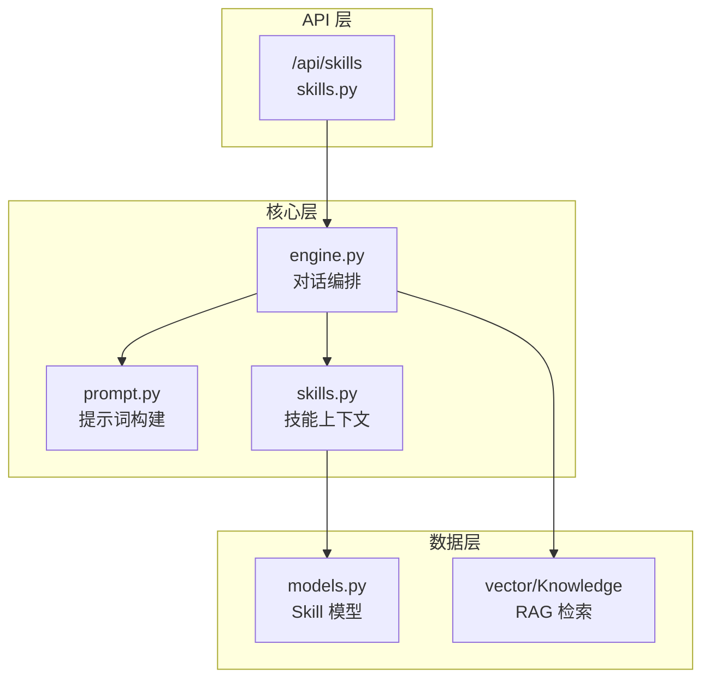
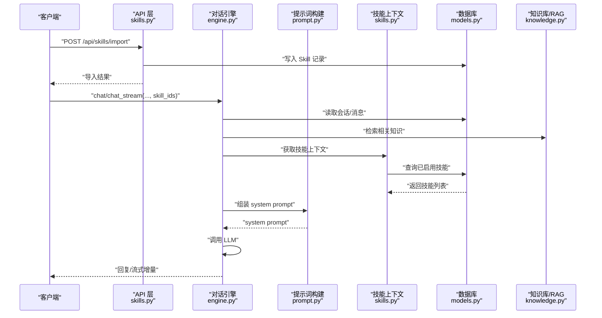
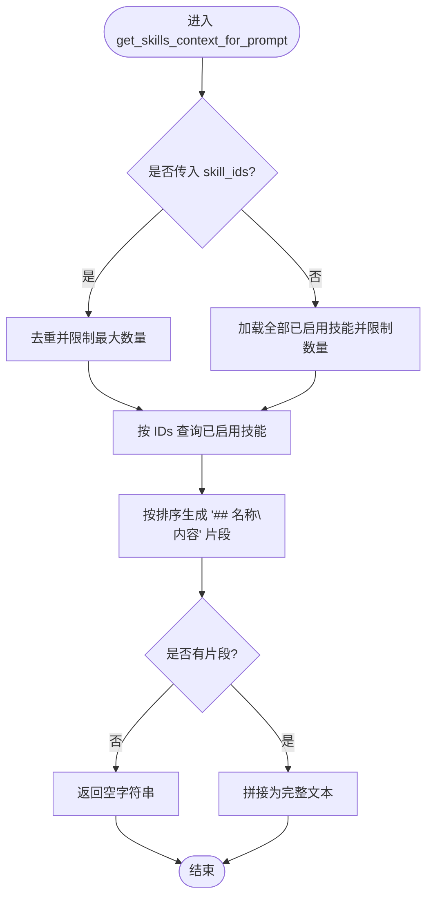
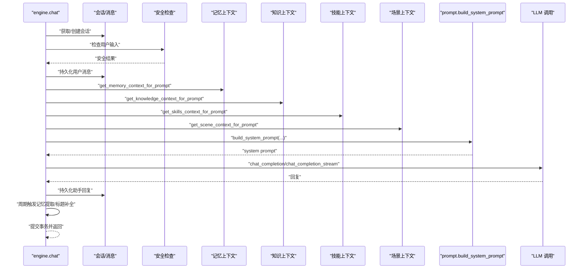
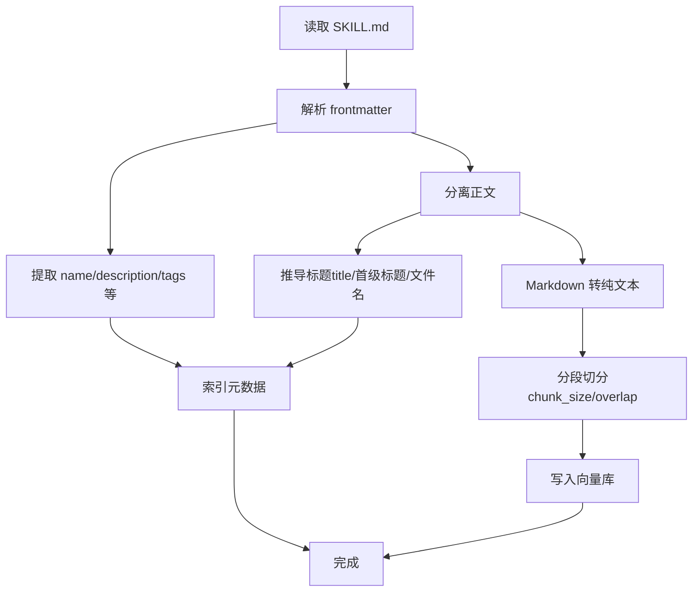
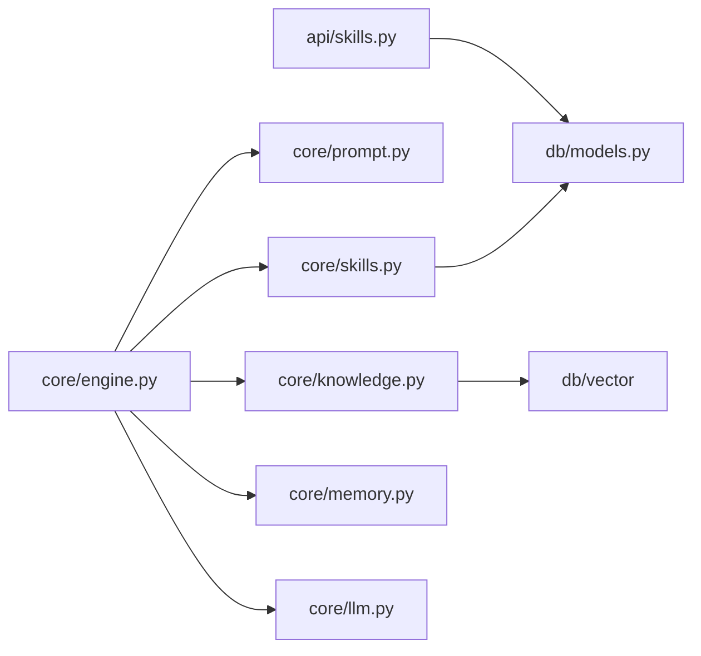

# 插件架构设计

<cite>
**本文引用的文件**   
- [hushai/meditation/core/skills.py](file://hushai/meditation/core/skills.py)
- [hushai/meditation/core/engine.py](file://hushai/meditation/core/engine.py)
- [hushai/meditation/core/prompt.py](file://hushai/meditation/core/prompt.py)
- [hushai/meditation/api/skills.py](file://hushai/meditation/api/skills.py)
- [hushai/meditation/db/models.py](file://hushai/meditation/db/models.py)
- [hushai/meditation/core/knowledge.py](file://hushai/meditation/core/knowledge.py)
- [knowledge/open-cognition/skills/aesthetics-frameworks/art-criticism-framework/SKILL.md](file://knowledge/open-cognition/skills/aesthetics-frameworks/art-criticism-framework/SKILL.md)
</cite>

## 目录
1. [引言](#引言)
2. [项目结构](#项目结构)
3. [核心组件](#核心组件)
4. [架构总览](#架构总览)
5. [详细组件分析](#详细组件分析)
6. [依赖关系分析](#依赖关系分析)
7. [性能考虑](#性能考虑)
8. [故障排查指南](#故障排查指南)
9. [结论](#结论)
10. [附录](#附录)

## 引言
本文件面向 hush.ai 的“技能插件系统”（Skills）进行深度技术文档化，聚焦以下目标：
- 整体设计理念与动态加载机制
- 插件生命周期管理（导入、启用、排序、注入）
- 技能上下文构建与提示词注入流程
- SKILL.md 规范定义与解析流程（元数据提取、内容验证、依赖关系处理）
- 插件与对话引擎的集成方式（选择策略、安全边界、性能优化）
- 架构图与数据流图，帮助开发者理解扩展点与二次开发路径

## 项目结构
围绕技能插件系统的代码主要分布在以下模块：
- 运行时注入层：core/skills.py 负责按 ID 或全量加载已启用的技能文本，拼接为系统提示的一部分
- 对话编排层：core/engine.py 在每轮对话中组装上下文（记忆、知识、场景、技能），并调用 LLM
- 提示词构建层：core/prompt.py 提供模板与组合逻辑，将各来源上下文拼装成最终 system prompt
- 数据模型层：db/models.py 定义 Skill 表结构与字段约束
- API 层：api/skills.py 提供技能列表与批量导入接口（支持管理员与普通用户认证）
- 知识库与 SKILL.md 解析：core/knowledge.py 提供 frontmatter 解析与 Markdown 转纯文本能力；示例 SKILL.md 展示规范写法

图表来源
- [hushai/meditation/api/skills.py:1-113](file://hushai/meditation/api/skills.py#L1-L113)
- [hushai/meditation/core/engine.py:1-387](file://hushai/meditation/core/engine.py#L1-L387)
- [hushai/meditation/core/prompt.py:1-130](file://hushai/meditation/core/prompt.py#L1-L130)
- [hushai/meditation/core/skills.py:1-59](file://hushai/meditation/core/skills.py#L1-L59)
- [hushai/meditation/db/models.py:120-135](file://hushai/meditation/db/models.py#L120-L135)
- [hushai/meditation/core/knowledge.py:1-225](file://hushai/meditation/core/knowledge.py#L1-L225)

章节来源
- [hushai/meditation/core/skills.py:1-59](file://hushai/meditation/core/skills.py#L1-L59)
- [hushai/meditation/core/engine.py:1-387](file://hushai/meditation/core/engine.py#L1-L387)
- [hushai/meditation/core/prompt.py:1-130](file://hushai/meditation/core/prompt.py#L1-L130)
- [hushai/meditation/api/skills.py:1-113](file://hushai/meditation/api/skills.py#L1-L113)
- [hushai/meditation/db/models.py:120-135](file://hushai/meditation/db/models.py#L120-L135)
- [hushai/meditation/core/knowledge.py:1-225](file://hushai/meditation/core/knowledge.py#L1-L225)

## 核心组件
- 技能上下文构建器（skills.py）
  - 根据传入 skill_ids 去重并按 sort_order/name 排序，限制单条消息最大技能数
  - 若未指定 skill_ids，则返回所有已启用技能的前 N 条
  - 输出格式为“标题+内容”的分节文本，供提示词拼接使用
- 对话引擎（engine.py）
  - 统一编排：会话持久化、安全检查、记忆/知识/场景/技能上下文装配、LLM 调用、结果回写
  - 支持同步与流式两种模式
- 提示词构建器（prompt.py）
  - 提供角色设定、安全边界、个性化风格等模板
  - 将 memory/knowledge/skills/scenes/history 等片段按固定顺序拼接为 system prompt
- 数据模型（models.py）
  - Skill 表包含 id/name/description/content/is_active/sort_order 等字段，用于存储与管理技能
- API 接口（api/skills.py）
  - GET /api/skills：列出已启用技能（仅公开元信息）
  - POST /api/skills/import 与 /import-file：批量导入技能（需管理员或用户 JWT）
- 知识库与 SKILL.md 解析（knowledge.py + 示例 SKILL.md）
  - 提供 frontmatter 解析、Markdown 转纯文本、分块入库与检索
  - 示例 SKILL.md 展示了规范的元数据与正文组织方式

章节来源
- [hushai/meditation/core/skills.py:1-59](file://hushai/meditation/core/skills.py#L1-L59)
- [hushai/meditation/core/engine.py:1-387](file://hushai/meditation/core/engine.py#L1-L387)
- [hushai/meditation/core/prompt.py:1-130](file://hushai/meditation/core/prompt.py#L1-L130)
- [hushai/meditation/db/models.py:120-135](file://hushai/meditation/db/models.py#L120-L135)
- [hushai/meditation/api/skills.py:1-113](file://hushai/meditation/api/skills.py#L1-L113)
- [hushai/meditation/core/knowledge.py:1-225](file://hushai/meditation/core/knowledge.py#L1-L225)
- [knowledge/open-cognition/skills/aesthetics-frameworks/art-criticism-framework/SKILL.md:1-102](file://knowledge/open-cognition/skills/aesthetics-frameworks/art-criticism-framework/SKILL.md#L1-L102)

## 架构总览
下图展示了从 API 到引擎再到数据库与向量库的整体交互。

图表来源
- [hushai/meditation/api/skills.py:1-113](file://hushai/meditation/api/skills.py#L1-L113)
- [hushai/meditation/core/engine.py:1-387](file://hushai/meditation/core/engine.py#L1-L387)
- [hushai/meditation/core/prompt.py:1-130](file://hushai/meditation/core/prompt.py#L1-L130)
- [hushai/meditation/core/skills.py:1-59](file://hushai/meditation/core/skills.py#L1-L59)
- [hushai/meditation/db/models.py:120-135](file://hushai/meditation/db/models.py#L120-L135)
- [hushai/meditation/core/knowledge.py:1-225](file://hushai/meditation/core/knowledge.py#L1-L225)

## 详细组件分析

### 技能上下文构建器（skills.py）
- 功能要点
  - 输入：数据库会话、可选的 skill_ids 列表
  - 去重与上限：对传入 IDs 去重，且每条消息最多注入 N 个技能
  - 排序规则：优先按 sort_order 升序，其次按 name 升序
  - 输出：以“## 名称\n内容”形式拼接的多段文本
- 复杂度分析
  - 时间复杂度：O(N log N) 排序 + O(N) 去重与拼接（N 为技能数量）
  - 空间复杂度：O(N) 存储有序 IDs 与结果片段
- 错误处理
  - 当 ordered_ids 为空时直接返回空字符串，避免无效查询
- 扩展点
  - 可引入缓存（如按 skill_ids 哈希缓存结果）
  - 可按用户/场景维度过滤技能集合

图表来源
- [hushai/meditation/core/skills.py:1-59](file://hushai/meditation/core/skills.py#L1-L59)

章节来源
- [hushai/meditation/core/skills.py:1-59](file://hushai/meditation/core/skills.py#L1-L59)

### 对话引擎（engine.py）
- 职责
  - 会话创建/加载、消息持久化
  - 安全检查（危机内容拦截）
  - 上下文装配：记忆、知识、场景、技能、历史
  - 调用 LLM（同步/流式）
  - 记忆提取与标题补全
- 关键流程
  - _prepare_turn_context：并行/串行拉取多源上下文，交由 prompt 构建器合成 system prompt
  - chat/chat_stream：封装事务、异常回滚、提交与返回结构
- 性能与安全
  - 在 LLM 调用前执行安全检查，避免敏感内容外发
  - 通过 limit 控制历史消息长度，减少上下文体积
  - 记忆提取周期性触发，降低每次请求开销

图表来源
- [hushai/meditation/core/engine.py:1-387](file://hushai/meditation/core/engine.py#L1-L387)
- [hushai/meditation/core/prompt.py:1-130](file://hushai/meditation/core/prompt.py#L1-L130)
- [hushai/meditation/core/skills.py:1-59](file://hushai/meditation/core/skills.py#L1-L59)
- [hushai/meditation/core/knowledge.py:1-225](file://hushai/meditation/core/knowledge.py#L1-L225)

章节来源
- [hushai/meditation/core/engine.py:1-387](file://hushai/meditation/core/engine.py#L1-L387)

### 提示词构建器（prompt.py）
- 组成
  - 角色设定、行为准则、安全边界
  - 个性化风格、场景指引、技能指引、知识参考、记忆摘要、对话历史
- 组合策略
  - 按固定顺序拼接各段落，缺失则跳过对应段落
  - 支持 teacher_description 覆盖基础角色描述
- 可扩展性
  - 新增上下文来源时，可在 build_system_prompt 中增加新段落与占位符

章节来源
- [hushai/meditation/core/prompt.py:1-130](file://hushai/meditation/core/prompt.py#L1-L130)

### 数据模型（models.py）
- Skill 实体
  - 关键字段：id、name、description、content、is_active、sort_order、时间戳
  - 用途：存储与管理可注入系统提示的技能片段
- 其他相关实体
  - Conversation、Message、Memory、Scene、Teacher 等，共同支撑对话与上下文

章节来源
- [hushai/meditation/db/models.py:120-135](file://hushai/meditation/db/models.py#L120-L135)

### API 接口（api/skills.py）
- 路由
  - GET /api/skills：列出已启用技能的元信息（id、name、description）
  - POST /api/skills/import：批量导入技能（JSON body）
  - POST /api/skills/import-file：上传 JSON 文件批量导入
- 鉴权
  - 支持管理员 JWT 或普通用户 JWT（Header Authorization）
- 校验
  - 字段长度限制（name、description）
  - JSON 解析与 Pydantic 模型校验

章节来源
- [hushai/meditation/api/skills.py:1-113](file://hushai/meditation/api/skills.py#L1-L113)

### SKILL.md 规范与解析流程
- 规范要点（基于示例文件）
  - Frontmatter 元数据：name、description、domain、linked_thinker、linked_concepts、tags
  - 正文结构：概述、何时使用/不用、理论基础、操作流程、示例、链接条目
- 解析流程（knowledge.py）
  - 解析 frontmatter：提取键值对，分离正文
  - 标题推导：优先使用 title，否则取首个一级标题，再退化为文件名
  - 标签处理：从 tags 字段拆分并追加额外标签（如 markdown）
  - 文本清洗：Markdown 转纯文本，保留代码块内部文本，去除装饰符号
  - 分块入库：按段落切分，设置 chunk_size 与 overlap，写入向量库
- 依赖关系处理
  - linked_thinker/linked_concepts 作为引用标记，便于后续构建知识图谱或导航
  - 当前实现未自动解析外部链接文件，但可通过上层工具链聚合

图表来源
- [hushai/meditation/core/knowledge.py:1-225](file://hushai/meditation/core/knowledge.py#L1-L225)
- [knowledge/open-cognition/skills/aesthetics-frameworks/art-criticism-framework/SKILL.md:1-102](file://knowledge/open-cognition/skills/aesthetics-frameworks/art-criticism-framework/SKILL.md#L1-L102)

章节来源
- [hushai/meditation/core/knowledge.py:1-225](file://hushai/meditation/core/knowledge.py#L1-L225)
- [knowledge/open-cognition/skills/aesthetics-frameworks/art-criticism-framework/SKILL.md:1-102](file://knowledge/open-cognition/skills/aesthetics-frameworks/art-criticism-framework/SKILL.md#L1-L102)

## 依赖关系分析
- 组件耦合
  - engine.py 强依赖 prompt.py、skills.py、knowledge.py、memory.py、llm.py、db.models
  - api/skills.py 依赖 db.models 与鉴权模块
  - skills.py 依赖 db.models.Skill
- 外部依赖
  - 向量库（Chroma）：通过 knowledge.py 与 memory.py 的 vector 模块访问
  - LLM 服务：通过 llm.py 提供的 chat_completion/chat_completion_stream
- 潜在循环依赖
  - 当前未见明显循环依赖；建议保持 core 层不反向依赖 api 层

图表来源
- [hushai/meditation/api/skills.py:1-113](file://hushai/meditation/api/skills.py#L1-L113)
- [hushai/meditation/core/engine.py:1-387](file://hushai/meditation/core/engine.py#L1-L387)
- [hushai/meditation/core/prompt.py:1-130](file://hushai/meditation/core/prompt.py#L1-L130)
- [hushai/meditation/core/skills.py:1-59](file://hushai/meditation/core/skills.py#L1-L59)
- [hushai/meditation/core/knowledge.py:1-225](file://hushai/meditation/core/knowledge.py#L1-L225)
- [hushai/meditation/db/models.py:120-135](file://hushai/meditation/db/models.py#L120-L135)

章节来源
- [hushai/meditation/api/skills.py:1-113](file://hushai/meditation/api/skills.py#L1-L113)
- [hushai/meditation/core/engine.py:1-387](file://hushai/meditation/core/engine.py#L1-L387)
- [hushai/meditation/core/prompt.py:1-130](file://hushai/meditation/core/prompt.py#L1-L130)
- [hushai/meditation/core/skills.py:1-59](file://hushai/meditation/core/skills.py#L1-L59)
- [hushai/meditation/core/knowledge.py:1-225](file://hushai/meditation/core/knowledge.py#L1-L225)
- [hushai/meditation/db/models.py:120-135](file://hushai/meditation/db/models.py#L120-L135)

## 性能考虑
- 技能上下文
  - 单条消息最大技能数限制，避免提示词过长
  - 排序与去重在内存中进行，适合中小规模技能集
- 对话上下文
  - 历史消息限制（conversation_max_turns）控制上下文大小
  - 记忆提取周期性触发，降低每次请求的 LLM 调用成本
- 知识库检索
  - top_k 可调，结合 chunk_size/overlap 平衡召回与延迟
- 建议优化
  - 对技能上下文引入缓存（按 skill_ids 哈希）
  - 对热门技能做预加载与热点排序
  - 对 LLM 调用参数（temperature、max_tokens）按场景调优

[本节为通用指导，无需特定文件来源]

## 故障排查指南
- 导入失败
  - 检查 Authorization 头是否正确携带
  - 确认 JSON 结构与字段长度限制
- 技能未生效
  - 确认 is_active 为 True
  - 检查 sort_order 与 name 排序是否符合预期
  - 核对传入 skill_ids 是否存在且未被去重剔除
- 提示词过长
  - 调整 MAX_SKILLS_PER_MESSAGE 或 conversation_max_turns
- 记忆/知识检索无结果
  - 检查向量库写入是否成功
  - 调整 top_k 与 chunk 参数

章节来源
- [hushai/meditation/api/skills.py:1-113](file://hushai/meditation/api/skills.py#L1-L113)
- [hushai/meditation/core/skills.py:1-59](file://hushai/meditation/core/skills.py#L1-L59)
- [hushai/meditation/core/engine.py:1-387](file://hushai/meditation/core/engine.py#L1-L387)
- [hushai/meditation/core/knowledge.py:1-225](file://hushai/meditation/core/knowledge.py#L1-L225)

## 结论
hush.ai 的技能插件系统以“数据驱动 + 提示词注入”为核心，通过清晰的职责分层与可控的上下文装配流程，实现了灵活、可扩展的技能增强能力。SKILL.md 规范与解析流程为知识内容的结构化与检索提供了良好基础。建议在后续迭代中引入缓存、更细粒度的权限控制与更完善的依赖解析，以提升性能与可维护性。

[本节为总结，无需特定文件来源]

## 附录
- 术语
  - 技能（Skill）：可注入系统提示的知识片段
  - 上下文（Context）：记忆、知识、场景、技能、历史等来源的组合
  - 提示词（Prompt）：发送给 LLM 的系统指令与上下文
- 扩展建议
  - 增加技能版本管理与灰度发布
  - 引入技能评分与效果评估指标
  - 完善 SKILL.md 依赖图的可视化与冲突检测

[本节为补充说明，无需特定文件来源]