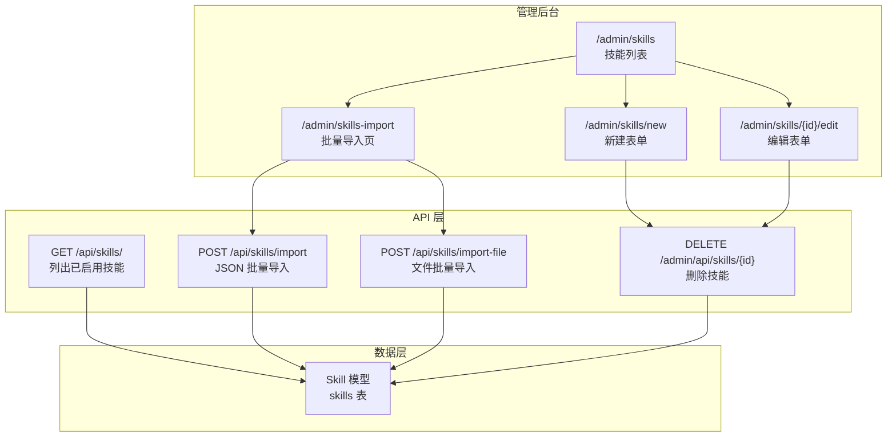
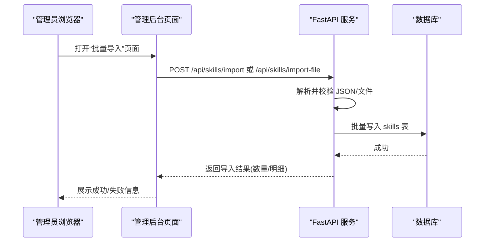
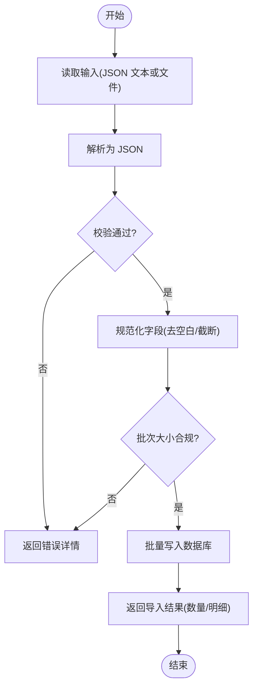
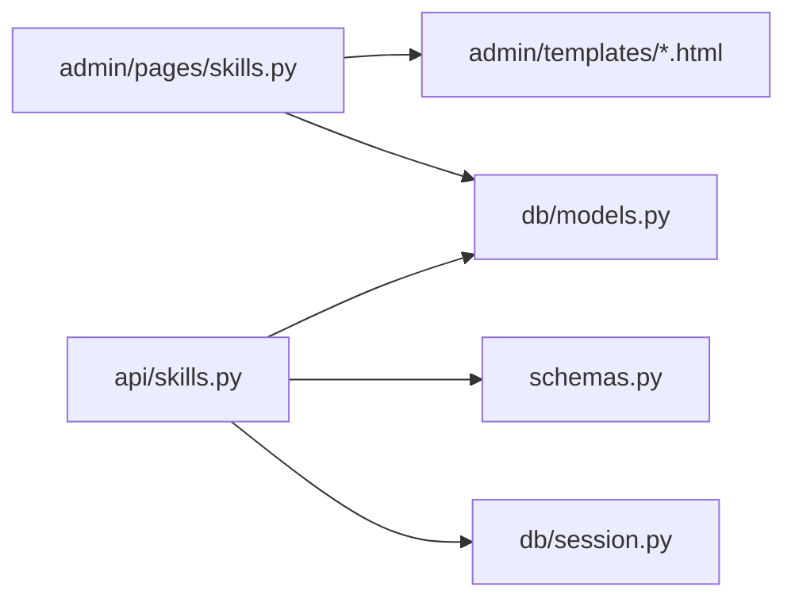

# 管理与运维工具

<cite>
**本文引用的文件**   
- [README.md](file://README.md)
- [hushai/meditation/admin/pages/skills.py](file://hushai/meditation/admin/pages/skills.py)
- [hushai/meditation/api/skills.py](file://hushai/meditation/api/skills.py)
- [hushai/meditation/db/models.py](file://hushai/meditation/db/models.py)
- [hushai/meditation/schemas.py](file://hushai/meditation/schemas.py)
- [hushai/meditation/admin/templates/skills_import.html](file://hushai/meditation/admin/templates/skills_import.html)
- [hushai/meditation/admin/templates/skill_form.html](file://hushai/meditation/admin/templates/skill_form.html)
- [hushai/meditation/admin/templates/skills.html](file://hushai/meditation/admin/templates/skills.html)
</cite>

## 目录
1. [简介](#简介)
2. [项目结构](#项目结构)
3. [核心组件](#核心组件)
4. [架构总览](#架构总览)
5. [详细组件分析](#详细组件分析)
6. [依赖关系分析](#依赖关系分析)
7. [性能与容量规划](#性能与容量规划)
8. [故障排查指南](#故障排查指南)
9. [自动化与配置管理最佳实践](#自动化与配置管理最佳实践)
10. [结论](#结论)

## 简介
本文件面向 hush.ai 技能插件的管理与运维，聚焦以下目标：
- 批量导入功能的使用方法、文件格式要求、导入流程、错误处理与批量操作技巧
- 管理后台中的技能管理界面（启用/禁用、排序调整、内容编辑）
- 技能效果评估机制与监控指标建议
- 故障排查指南与性能调优建议
- 自动化运维脚本与配置管理的最佳实践

## 项目结构
围绕“技能”相关能力，关键代码分布如下：
- 管理后台页面路由与模板：admin/pages/skills.py、admin/templates/*
- 对外 API（列表与批量导入）：api/skills.py
- 数据模型与约束：db/models.py、schemas.py



图表来源
- [hushai/meditation/admin/pages/skills.py:17-218](file://hushai/meditation/admin/pages/skills.py#L17-L218)
- [hushai/meditation/api/skills.py:25-113](file://hushai/meditation/api/skills.py#L25-L113)
- [hushai/meditation/db/models.py:120-135](file://hushai/meditation/db/models.py#L120-L135)

章节来源
- [README.md:288-297](file://README.md#L288-L297)
- [hushai/meditation/admin/pages/skills.py:17-218](file://hushai/meditation/admin/pages/skills.py#L17-L218)
- [hushai/meditation/api/skills.py:25-113](file://hushai/meditation/api/skills.py#L25-L113)
- [hushai/meditation/db/models.py:120-135](file://hushai/meditation/db/models.py#L120-L135)

## 核心组件
- 技能数据模型 Skill：包含名称、描述、正文、是否启用、排序等字段，用于注入系统提示。
- 管理后台技能页面：提供列表、搜索、分页、新建、编辑、删除与批量导入入口。
- 批量导入 API：支持 JSON Body 与 multipart 文件上传两种形式，统一走同一入库逻辑。
- 请求/响应模型：使用 Pydantic 进行严格校验与长度限制，保障导入质量。

章节来源
- [hushai/meditation/db/models.py:120-135](file://hushai/meditation/db/models.py#L120-L135)
- [hushai/meditation/admin/pages/skills.py:33-218](file://hushai/meditation/admin/pages/skills.py#L33-L218)
- [hushai/meditation/api/skills.py:47-113](file://hushai/meditation/api/skills.py#L47-L113)
- [hushai/meditation/schemas.py:162-218](file://hushai/meditation/schemas.py#L162-L218)

## 架构总览
从管理员视角的端到端流程如下：



图表来源
- [hushai/meditation/admin/templates/skills_import.html:168-224](file://hushai/meditation/admin/templates/skills_import.html#L168-L224)
- [hushai/meditation/api/skills.py:61-113](file://hushai/meditation/api/skills.py#L61-L113)
- [hushai/meditation/db/models.py:120-135](file://hushai/meditation/db/models.py#L120-L135)

## 详细组件分析

### 批量导入功能
- 入口
  - 管理后台页面：/admin/skills-import
  - API 端点：
    - POST /api/skills/import（application/json）
    - POST /api/skills/import-file（multipart/form-data，字段 file）
- 认证
  - 需要 Authorization: Bearer Token，支持管理员令牌或用户令牌
- 文件格式与约束
  - 根结构支持两种：{"skills": [...]} 或顶层数组 [...]
  - 每条记录必填 name、content；可选 description、sort_order、is_active
  - 单次最多导入条数受常量限制
  - 字段长度限制：name ≤ 128，description ≤ 512
- 导入流程
  - 前端读取 JSON 或文件 → 调用对应 API → 后端校验 → 批量入库 → 返回导入结果
- 错误处理
  - JSON 解析失败、数据格式无效、未携带授权、单条字段不合法等均有明确错误码与消息
- 批量操作技巧
  - 先准备小批量（如 20-50 条）验证结构与字段
  - 对长摘要截断到 512 字符以内
  - 合理设置 sort_order 控制前台排序
  - is_active 默认 true，可按需关闭



图表来源
- [hushai/meditation/api/skills.py:61-113](file://hushai/meditation/api/skills.py#L61-L113)
- [hushai/meditation/schemas.py:197-218](file://hushai/meditation/schemas.py#L197-L218)

章节来源
- [hushai/meditation/admin/templates/skills_import.html:1-227](file://hushai/meditation/admin/templates/skills_import.html#L1-L227)
- [hushai/meditation/api/skills.py:25-113](file://hushai/meditation/api/skills.py#L25-L113)
- [hushai/meditation/schemas.py:162-218](file://hushai/meditation/schemas.py#L162-L218)

### 管理后台技能管理界面
- 技能列表
  - 支持按名称/摘要模糊搜索、分页浏览
  - 显示排序值、启用状态、创建时间
- 新建/编辑
  - 表单字段：名称、短摘要、技能正文、排序、是否启用
  - 提交后重定向回列表页
- 删除
  - 通过 DELETE /admin/api/skills/{id} 删除
- 启用/禁用与排序
  - 在编辑表单中直接修改 is_active 与 sort_order 保存生效
  - 前台仅展示已启用的技能，并按 sort_order 升序排列

```mermaid
classDiagram
class Skill {
+string id
+string name
+string description
+string content
+bool is_active
+int sort_order
+datetime created_at
+datetime updated_at
}
class SkillsRouter {
+GET "/admin/skills"
+GET "/admin/skills/new"
+POST "/admin/skills/new"
+GET "/admin/skills/{id}/edit"
+POST "/admin/skills/{id}/edit"
+DELETE "/admin/api/skills/{id}"
}
class SkillsAPI {
+GET "/api/skills/"
+POST "/api/skills/import"
+POST "/api/skills/import-file"
}
SkillsRouter --> Skill : "CRUD"
SkillsAPI --> Skill : "读/写"
```

图表来源
- [hushai/meditation/db/models.py:120-135](file://hushai/meditation/db/models.py#L120-L135)
- [hushai/meditation/admin/pages/skills.py:33-218](file://hushai/meditation/admin/pages/skills.py#L33-L218)
- [hushai/meditation/api/skills.py:47-113](file://hushai/meditation/api/skills.py#L47-L113)

章节来源
- [hushai/meditation/admin/pages/skills.py:33-218](file://hushai/meditation/admin/pages/skills.py#L33-L218)
- [hushai/meditation/admin/templates/skills.html:1-136](file://hushai/meditation/admin/templates/skills.html#L1-L136)
- [hushai/meditation/admin/templates/skill_form.html:1-82](file://hushai/meditation/admin/templates/skill_form.html#L1-L82)

### 前台技能列表接口
- GET /api/skills/
- 行为：仅返回 is_active=True 的技能，按 sort_order 升序、name 升序
- 用途：前台渲染可勾选的“加持”技能清单

章节来源
- [hushai/meditation/api/skills.py:47-58](file://hushai/meditation/api/skills.py#L47-L58)
- [hushai/meditation/db/models.py:120-135](file://hushai/meditation/db/models.py#L120-L135)

## 依赖关系分析
- 模块耦合
  - 管理后台路由依赖认证与模板渲染
  - API 路由依赖会话、认证与 Pydantic 模型
  - 数据模型集中定义，前后端共享字段语义
- 外部依赖
  - FastAPI 路由与依赖注入
  - SQLAlchemy 异步会话
  - Pydantic 数据校验
- 潜在风险
  - 大文件上传时的内存占用
  - 大批次导入的事务与锁竞争
  - 未做幂等处理的重复导入



图表来源
- [hushai/meditation/admin/pages/skills.py:1-218](file://hushai/meditation/admin/pages/skills.py#L1-L218)
- [hushai/meditation/api/skills.py:1-113](file://hushai/meditation/api/skills.py#L1-L113)
- [hushai/meditation/db/models.py:120-135](file://hushai/meditation/db/models.py#L120-L135)
- [hushai/meditation/schemas.py:162-218](file://hushai/meditation/schemas.py#L162-L218)

章节来源
- [hushai/meditation/admin/pages/skills.py:1-218](file://hushai/meditation/admin/pages/skills.py#L1-L218)
- [hushai/meditation/api/skills.py:1-113](file://hushai/meditation/api/skills.py#L1-L113)
- [hushai/meditation/schemas.py:162-218](file://hushai/meditation/schemas.py#L162-L218)
- [hushai/meditation/db/models.py:120-135](file://hushai/meditation/db/models.py#L120-L135)

## 性能与容量规划
- 批量导入
  - 单次最大条数由常量限制，避免一次性过大导致超时或内存压力
  - 建议在导入前将大文件切分为多个小批次（例如每批 20-50 条）
- 查询优化
  - 列表页采用分页与模糊匹配，注意在大表下索引策略
  - 前台只查已启用项，减少不必要的数据传输
- 并发与事务
  - 批量写入使用 flush+commit，确保一致性；在高并发场景下关注锁等待
- 存储与检索
  - 若后续引入向量检索或全文检索，应提前规划索引与分片策略

[本节为通用指导，无需特定文件引用]

## 故障排查指南
- 常见错误与定位
  - 401 缺少授权：检查请求头 Authorization: Bearer Token 是否正确
  - 400 JSON 解析失败：确认 JSON 语法正确且符合根结构约定
  - 400 数据格式无效：检查必填字段、长度限制与类型
  - 404 资源不存在：确认 skill_id 有效
- 快速自检步骤
  - 使用管理后台“API 文档”链接验证端点可用性
  - 先用少量数据测试导入，再逐步扩大批次
  - 查看浏览器控制台与网络面板的错误响应体 detail 字段
- 日志与审计
  - 结合审计日志与管理员登录态，追踪导入操作来源与时间

章节来源
- [hushai/meditation/api/skills.py:61-113](file://hushai/meditation/api/skills.py#L61-L113)
- [hushai/meditation/admin/pages/skills.py:198-218](file://hushai/meditation/admin/pages/skills.py#L198-L218)
- [hushai/meditation/admin/templates/skills_import.html:168-224](file://hushai/meditation/admin/templates/skills_import.html#L168-L224)

## 自动化与配置管理最佳实践
- 批量导入自动化
  - 使用脚本循环分批调用 /api/skills/import，配合重试与退避
  - 对导入结果进行断言：imported 数量与预期一致
- 幂等与去重
  - 在业务侧维护 name 唯一键或导入前查询去重，避免重复入库
- 配置管理
  - 将导入批次大小、超时时间、重试次数等参数化，便于不同环境切换
- 安全与权限
  - 生产环境建议使用管理员令牌访问导入接口，最小权限原则
- 监控与告警
  - 统计导入成功率、失败原因分布、平均耗时
  - 对连续失败或错误率突增触发告警

[本节为通用指导，无需特定文件引用]

## 结论
本指南围绕 hush.ai 技能插件的管理与运维，给出了批量导入的完整使用方法、管理后台操作流程、错误处理要点以及性能与自动化建议。遵循上述规范，可显著提升技能内容的上线效率与稳定性，并为后续的效果评估与监控打下基础。