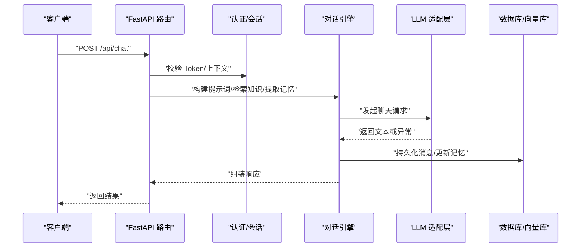
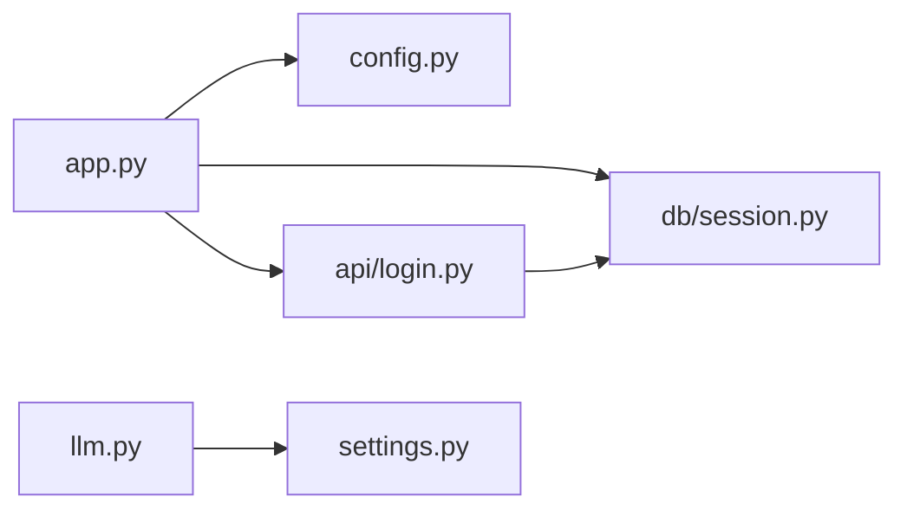

# 故障排除与FAQ

<cite>
**本文引用的文件**   
- [README.md](file://README.md)
- [hushai/meditation/app.py](file://hushai/meditation/app.py)
- [hushai/meditation/config.py](file://hushai/meditation/config.py)
- [hushai/meditation/db/session.py](file://hushai/meditation/db/session.py)
- [scripts/start_server.sh](file://scripts/start_server.sh)
- [hushai/cli.py](file://hushai/cli.py)
- [hushai/settings.py](file://hushai/settings.py)
- [hushai/llm.py](file://hushai/llm.py)
- [tests/test_llm_errors.py](file://tests/test_llm_errors.py)
- [tests/test_settings.py](file://tests/test_settings.py)
- [tests/meditation/test_auth.py](file://tests/meditation/test_auth.py)
- [hushai/meditation/api/login.py](file://hushai/meditation/api/login.py)
</cite>

## 目录
1. [简介](#简介)
2. [项目结构](#项目结构)
3. [核心组件](#核心组件)
4. [架构总览](#架构总览)
5. [详细组件分析](#详细组件分析)
6. [依赖关系分析](#依赖关系分析)
7. [性能与稳定性建议](#性能与稳定性建议)
8. [故障排查指南](#故障排查指南)
9. [结论](#结论)
10. [附录：错误码与诊断清单](#附录错误码与诊断清单)

## 简介
本指南面向 hush.ai 的使用者与运维人员，聚焦于环境配置、启动失败、API 调用异常、数据库连接问题等常见故障的诊断与修复；提供错误信息解读、调试技巧（日志、限流、健康检查）、以及社区反馈渠道。文档内容基于仓库源码与测试用例整理，确保可追溯与可验证。

## 项目结构
hush.ai 包含 CLI 工具与冥想服务两个主要入口：
- CLI：用于一次性提问或交互式对话，读取配置并调用 LLM。
- 冥想服务：基于 FastAPI 的 Web 服务，提供认证、对话、记忆、知识库、冥想追踪等功能，默认挂载 /debug 与 /redoc 文档页。

```mermaid
graph TB
subgraph "CLI"
CLI["命令行入口<br/>hushai/cli.py"]
Settings["配置解析<br/>hushai/settings.py"]
LLM["LLM 调用封装<br/>hushai/llm.py"]
end
subgraph "Web 服务"
App["FastAPI 应用<br/>hushai/meditation/app.py"]
SrvCfg["服务配置<br/>hushai/meditation/config.py"]
DB["数据库会话管理<br/>hushai/meditation/db/session.py"]
Login["登录/刷新接口<br/>hushai/meditation/api/login.py"]
end
subgraph "外部依赖"
OpenAI["OpenAI SDK"]
PG["PostgreSQL/SQLite"]
Chroma["ChromaDB(向量)"]
end
CLI --> Settings
CLI --> LLM
LLM --> OpenAI
App --> SrvCfg
App --> DB
App --> Login
DB --> PG
App --> Chroma
```

图表来源
- [hushai/meditation/app.py:136-207](file://hushai/meditation/app.py#L136-L207)
- [hushai/meditation/config.py:18-115](file://hushai/meditation/config.py#L18-L115)
- [hushai/meditation/db/session.py:15-47](file://hushai/meditation/db/session.py#L15-L47)
- [hushai/cli.py:81-147](file://hushai/cli.py#L81-L147)
- [hushai/settings.py:98-171](file://hushai/settings.py#L98-L171)
- [hushai/llm.py:100-141](file://hushai/llm.py#L100-L141)

章节来源
- [README.md:136-178](file://README.md#L136-L178)

## 核心组件
- 配置系统
  - CLI 侧：JSON 配置文件与环境变量合并，支持模式别名与旧版开关兼容。
  - 服务侧：从 .env 与服务环境变量加载 MeditationConfig，覆盖 host/port/debug/cors 等运行参数。
- 启动与健康检查
  - 服务启动时初始化日志、数据库、默认管理员与导师数据，暴露 /health 健康端点。
- 数据库层
  - 自动选择 SQLite 或 PostgreSQL，异步引擎与连接池参数按后端类型调整。
- LLM 调用
  - 统一封装 OpenAI 客户端，超时、重试、模型、Base URL 均受配置控制；异常映射为中文提示。
- 认证与令牌
  - 登录与刷新接口将业务异常转换为 HTTP 状态码返回；测试覆盖了 token 类型校验与 selector 查找。

章节来源
- [hushai/settings.py:98-171](file://hushai/settings.py#L98-L171)
- [hushai/meditation/config.py:18-115](file://hushai/meditation/config.py#L18-L115)
- [hushai/meditation/app.py:24-133](file://hushai/meditation/app.py#L24-L133)
- [hushai/meditation/db/session.py:15-47](file://hushai/meditation/db/session.py#L15-L47)
- [hushai/llm.py:100-141](file://hushai/llm.py#L100-L141)
- [hushai/meditation/api/login.py:21-52](file://hushai/meditation/api/login.py#L21-L52)

## 架构总览
下图展示一次“普通对话”请求在 Web 服务中的关键路径：前端 → FastAPI 路由 → 会话/鉴权 → 引擎/LLM → 数据库/向量库。



图表来源
- [hushai/meditation/app.py:136-207](file://hushai/meditation/app.py#L136-L207)
- [hushai/meditation/db/session.py:57-68](file://hushai/meditation/db/session.py#L57-L68)
- [hushai/llm.py:100-141](file://hushai/llm.py#L100-L141)

## 详细组件分析

### 配置与环境
- CLI 配置优先级：命令行 > 环境变量 > JSON 配置文件；无效 JSON 或非法模式会抛出运行时错误。
- 服务配置：通过 .env 与服务环境变量注入，未设置时回退到默认值（如 SQLite）。
- 常见问题
  - 配置文件路径不存在或 JSON 格式错误：会在 configure() 阶段抛出明确错误。
  - 模式不合法：例如 HUSH_MODE 设置为不支持的值会直接报错。
  - 密钥缺失：CLI 调用 LLM 前会检查 LLM_APPKEY，缺失则给出指引。

章节来源
- [hushai/settings.py:85-112](file://hushai/settings.py#L85-L112)
- [hushai/settings.py:145-171](file://hushai/settings.py#L145-L171)
- [hushai/meditation/config.py:63-115](file://hushai/meditation/config.py#L63-L115)
- [hushai/llm.py:104-110](file://hushai/llm.py#L104-L110)
- [tests/test_settings.py:21-96](file://tests/test_settings.py#L21-L96)

### 启动与生命周期
- 启动流程：初始化日志级别、创建数据库表、初始化默认管理员与导师、注册路由与静态资源。
- 健康检查：/health 返回 {"status": "ok"}，可用于探针与负载均衡。
- 常见问题
  - 端口占用：修改 MEDITATION_PORT 或使用 --port 参数。
  - CORS 跨域：开发模式允许所有来源，生产需显式配置 cors_origins。
  - 静态资源 404：确认 /static 与 /admin/static 挂载路径正确。

章节来源
- [hushai/meditation/app.py:24-133](file://hushai/meditation/app.py#L24-L133)
- [hushai/meditation/app.py:136-207](file://hushai/meditation/app.py#L136-L207)
- [scripts/start_server.sh:1-31](file://scripts/start_server.sh#L1-L31)

### 数据库连接与会话
- 自动选择后端：未设置 MEDITATION_POSTGRES_URL 时使用 SQLite；PostgreSQL 会自动替换驱动为 asyncpg。
- 连接池：SQLite 使用较小池大小，PostgreSQL 使用较大池大小；debug 模式开启 SQL 日志。
- 常见问题
  - 无法连接数据库：检查 URL 协议与驱动后缀是否正确。
  - 权限不足：确认数据库用户具备读写权限。
  - 并发写入异常：SQLite 需确保 check_same_thread=False（已内置处理）。

章节来源
- [hushai/meditation/db/session.py:15-47](file://hushai/meditation/db/session.py#L15-L47)
- [hushai/meditation/db/session.py:57-68](file://hushai/meditation/db/session.py#L57-L68)

### LLM 调用与错误映射
- 配置项：LLM_APPKEY、OPENAI_BASE_URL、LLM_MODEL、LLM_TIMEOUT、LLM_MAX_RETRIES。
- 异常映射：将 OpenAI SDK 的超时、连接、鉴权、限流、权限、服务端错误等转换为中文可读提示。
- 常见问题
  - 401 鉴权失败：检查 LLM_APPKEY 是否有效且未被禁用。
  - 429 限流：降低频率或提高 LLM_MAX_RETRIES/LLM_TIMEOUT。
  - 5xx 服务端错误：查看上游服务状态与网络连通性。

章节来源
- [hushai/llm.py:81-97](file://hushai/llm.py#L81-L97)
- [hushai/llm.py:100-141](file://hushai/llm.py#L100-L141)
- [tests/test_llm_errors.py:26-58](file://tests/test_llm_errors.py#L26-L58)

### 认证与令牌刷新
- 登录与刷新：wx-login 与 refresh 接口将业务异常转为 400/401 响应。
- 安全校验：verify_token 强制 type=access；refresh 使用 selector O(1) 定位用户，再 bcrypt 校验。
- 常见问题
  - 401 未授权：Token 过期或被篡改；使用 refresh 获取新令牌。
  - 400 参数错误：缺少必要字段或格式不正确。

章节来源
- [hushai/meditation/api/login.py:21-52](file://hushai/meditation/api/login.py#L21-L52)
- [tests/meditation/test_auth.py:49-78](file://tests/meditation/test_auth.py#L49-L78)
- [tests/meditation/test_auth.py:82-136](file://tests/meditation/test_auth.py#L82-L136)

## 依赖关系分析
- 模块耦合
  - app.py 依赖 config.py 与 db/session.py，并在 lifespan 中完成初始化。
  - llm.py 依赖 settings.py 提供的运行时配置。
  - login.py 依赖 auth 逻辑与数据库会话。
- 外部依赖
  - OpenAI SDK：负责 LLM 通信。
  - SQLAlchemy Async：数据库访问。
  - Uvicorn：ASGI 服务器。



图表来源
- [hushai/meditation/app.py:136-207](file://hushai/meditation/app.py#L136-L207)
- [hushai/meditation/config.py:18-115](file://hushai/meditation/config.py#L18-L115)
- [hushai/meditation/db/session.py:15-47](file://hushai/meditation/db/session.py#L15-L47)
- [hushai/meditation/api/login.py:21-52](file://hushai/meditation/api/login.py#L21-L52)
- [hushai/llm.py:100-141](file://hushai/llm.py#L100-L141)
- [hushai/settings.py:98-171](file://hushai/settings.py#L98-L171)

## 性能与稳定性建议
- 日志与调试
  - 启用 debug 模式可获得更详细的 SQL 日志与更宽松的 CORS。
  - 使用 /debug 与 /redoc 快速验证接口定义与示例。
- 限流与健壮性
  - 集成 slowapi 限流，避免突发流量打满上游 LLM。
  - 合理设置 LLM_TIMEOUT 与 LLM_MAX_RETRIES，平衡成功率与延迟。
- 数据库
  - 生产建议使用 PostgreSQL，并监控连接池使用率与慢查询。
  - SQLite 仅适合本地或低并发场景。

[本节为通用建议，无需特定文件引用]

## 故障排查指南

### 环境与安装
- 症状：启动脚本找不到虚拟环境 Python。
  - 排查：确认 .venv 存在并已激活；参考脚本中的路径与提示。
- 症状：端口被占用。
  - 排查：修改 MEDITATION_PORT 或停止占用进程。

章节来源
- [scripts/start_server.sh:24-30](file://scripts/start_server.sh#L24-L30)

### 启动失败
- 症状：服务启动后 /health 不可达。
  - 排查：检查 host/port 配置；确认防火墙与安全组放行。
- 症状：静态资源 404。
  - 排查：确认 /static 与 /admin/static 挂载路径正确。

章节来源
- [hushai/meditation/app.py:182-207](file://hushai/meditation/app.py#L182-L207)

### 数据库连接异常
- 症状：PostgreSQL 连接失败。
  - 排查：检查 MEDITATION_POSTGRES_URL 协议与驱动后缀；确认账号密码与网络可达。
- 症状：SQLite 并发写入报错。
  - 排查：确认已使用 aiosqlite 驱动与线程安全参数（已内置处理）。

章节来源
- [hushai/meditation/db/session.py:15-47](file://hushai/meditation/db/session.py#L15-L47)

### API 调用错误
- 症状：401 未授权。
  - 排查：检查 JWT 是否过期或被篡改；使用 /api/auth/refresh 刷新。
- 症状：400 参数错误。
  - 排查：核对请求体必填字段与格式。
- 症状：LLM 返回错误或超时。
  - 排查：检查 LLM_APPKEY、OPENAI_BASE_URL、LLM_TIMEOUT、LLM_MAX_RETRIES；查看上游服务状态。

章节来源
- [hushai/meditation/api/login.py:21-52](file://hushai/meditation/api/login.py#L21-L52)
- [hushai/llm.py:81-97](file://hushai/llm.py#L81-L97)
- [hushai/llm.py:100-141](file://hushai/llm.py#L100-L141)

### 调试技巧
- 日志分析
  - 服务启动时会输出“启动中/初始化完成/关闭”等关键节点日志；结合 debug 模式查看 SQL 语句。
- 健康检查
  - 使用 GET /health 进行存活探测。
- 限流与速率
  - 观察限流触发后的响应；适当调大阈值或优化上游。

章节来源
- [hushai/meditation/app.py:24-40](file://hushai/meditation/app.py#L24-L40)
- [hushai/meditation/app.py:203-206](file://hushai/meditation/app.py#L203-L206)

### 高级诊断
- 性能分析
  - 开启数据库 echo 与慢查询日志；对热点接口添加耗时埋点。
- 内存泄漏检测
  - 使用常规 Python 工具（如 tracemalloc）在服务长驻场景下采样；关注会话与缓存对象生命周期。
- 压力测试
  - 针对 /api/chat 与 /api/auth/refresh 进行并发压测，评估限流与降级策略。

[本节为通用建议，无需特定文件引用]

### 问题反馈与支持
- 提交 Issue 前请附上：
  - 版本信息（可通过 CLI --version 获取）
  - 相关日志片段（含启动、错误堆栈）
  - 最小复现步骤与配置摘要（脱敏）
- 贡献规范与测试要求请参考 README 与 CONTRIBUTING。

章节来源
- [README.md:345-353](file://README.md#L345-L353)

## 结论
通过合理的配置管理、健壮的异常映射与完善的启动/健康检查机制，hush.ai 可在多种环境下稳定运行。遇到故障时，优先从日志与健康检查入手，逐步缩小范围至配置、网络、数据库与上游服务。持续完善测试与监控，有助于快速定位与恢复问题。

[本节为总结性内容，无需特定文件引用]

## 附录：错误码与诊断清单

### CLI 错误
- 配置 JSON 无效：configure() 抛出运行时错误，提示具体位置。
- 无效模式：HUSH_MODE 不在允许集合内，抛出运行时错误。
- 未配置密钥：调用 LLM 前检查 LLM_APPKEY，缺失则给出指引。
- 请求失败：捕获非业务异常并以“请求失败: ...”形式输出。

章节来源
- [hushai/settings.py:85-112](file://hushai/settings.py#L85-L112)
- [hushai/settings.py:145-171](file://hushai/settings.py#L145-L171)
- [hushai/llm.py:104-110](file://hushai/llm.py#L104-L110)
- [hushai/cli.py:57-77](file://hushai/cli.py#L57-L77)

### Web API 错误
- 400 参数错误：登录/刷新接口将业务异常转为 400。
- 401 未授权：刷新失败或 Token 类型不符。
- 429 限流：slowapi 触发限流。
- 5xx 服务端错误：上游服务异常或内部错误。

章节来源
- [hushai/meditation/api/login.py:21-52](file://hushai/meditation/api/login.py#L21-L52)
- [hushai/meditation/app.py:146-147](file://hushai/meditation/app.py#L146-L147)

### LLM 异常映射
- 超时：提示检查网络或增大 LLM_TIMEOUT。
- 连接失败：提示检查网络与 OPENAI_BASE_URL。
- 鉴权失败：提示检查 LLM_APPKEY。
- 权限不足：提示检查账户权限或模型访问策略。
- 服务端错误：提示 HTTP 状态码。

章节来源
- [hushai/llm.py:81-97](file://hushai/llm.py#L81-L97)
- [tests/test_llm_errors.py:26-58](file://tests/test_llm_errors.py#L26-L58)