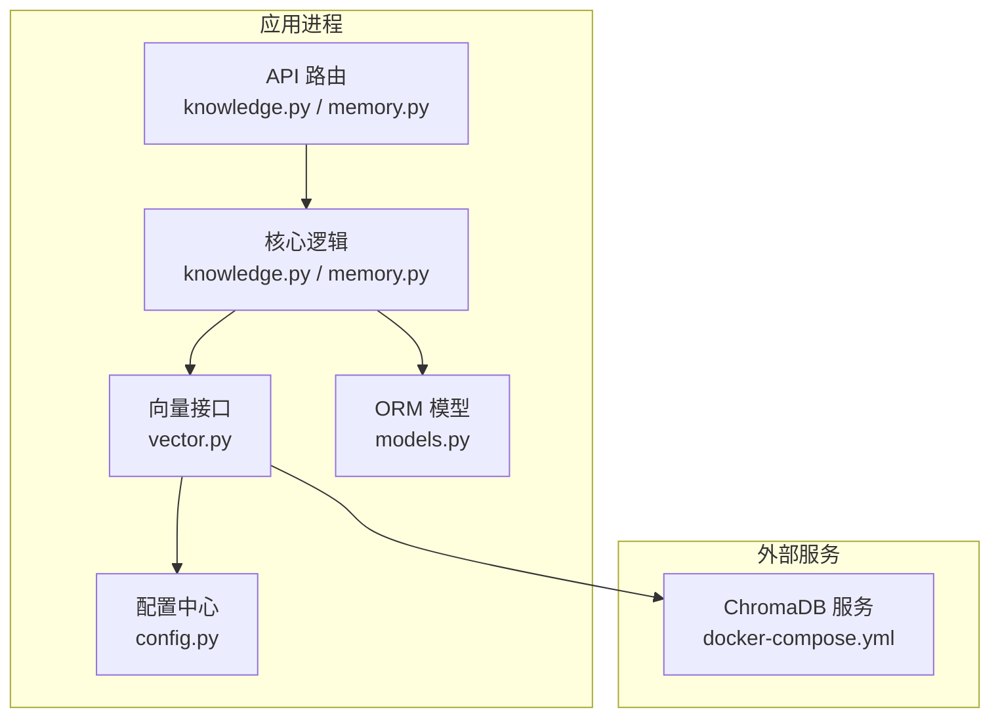
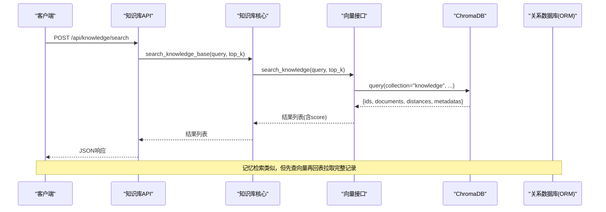
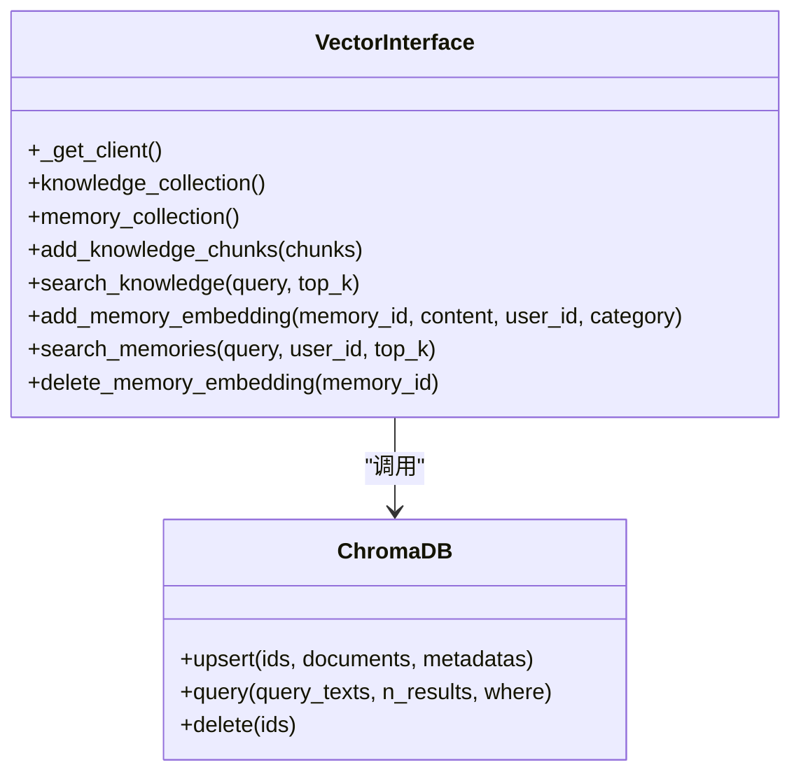
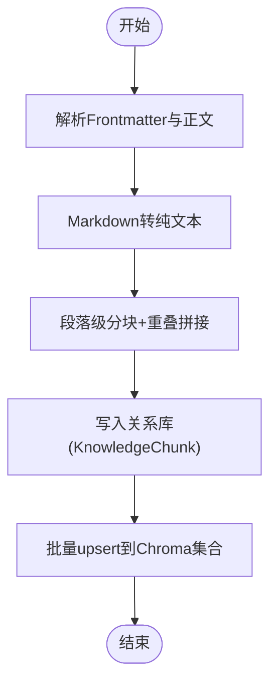
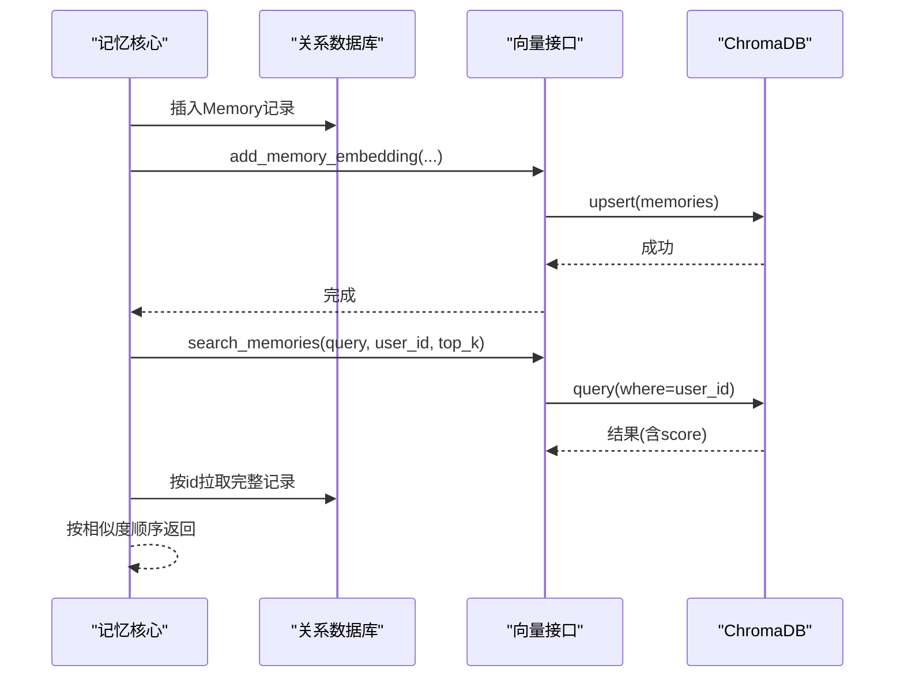
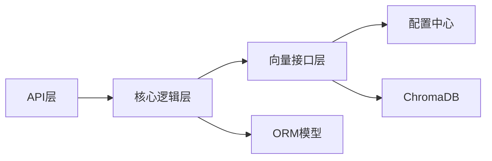

# 向量存储设计

<cite>
**本文引用的文件**   
- [hushai/meditation/db/vector.py](file://hushai/meditation/db/vector.py)
- [hushai/meditation/core/knowledge.py](file://hushai/meditation/core/knowledge.py)
- [hushai/meditation/core/memory.py](file://hushai/meditation/core/memory.py)
- [hushai/meditation/api/knowledge.py](file://hushai/meditation/api/knowledge.py)
- [hushai/meditation/api/memory.py](file://hushai/meditation/api/memory.py)
- [hushai/meditation/config.py](file://hushai/meditation/config.py)
- [hushai/meditation/db/models.py](file://hushai/meditation/db/models.py)
- [docker-compose.yml](file://docker-compose.yml)
- [tests/meditation/test_vector.py](file://tests/meditation/test_vector.py)
</cite>

## 目录
1. [引言](#引言)
2. [项目结构](#项目结构)
3. [核心组件](#核心组件)
4. [架构总览](#架构总览)
5. [详细组件分析](#详细组件分析)
6. [依赖关系分析](#依赖关系分析)
7. [性能与容量规划](#性能与容量规划)
8. [故障排查指南](#故障排查指南)
9. [结论](#结论)
10. [附录：配置项与API参考](#附录配置项与api参考)

## 引言
本设计文档面向 hush.ai 的向量存储子系统，围绕 ChromaDB 集成、文本向量化流程、记忆系统与知识库的向量策略、检索查询示例、生命周期管理以及性能调优进行系统化说明。目标是帮助开发者快速理解并正确扩展向量能力，确保在知识检索与个性化记忆中提供稳定、高效、可维护的语义搜索体验。

## 项目结构
与向量存储相关的代码主要分布在以下模块：
- 向量数据库接口层：封装 ChromaDB Client、集合管理与嵌入函数选择
- 业务逻辑层：知识库导入/分块/检索；长期记忆提取/入库/检索
- API 层：对外暴露导入、批量导入、远程同步、检索等接口
- 配置层：Chroma 持久化路径、嵌入模型与提供商、Top-K 等参数
- 数据模型层：SQLAlchemy ORM 定义（用于持久化元数据）
- 运行环境：Docker Compose 启动本地 ChromaDB 服务

图表来源
- [hushai/meditation/api/knowledge.py:1-310](file://hushai/meditation/api/knowledge.py#L1-L310)
- [hushai/meditation/api/memory.py:1-61](file://hushai/meditation/api/memory.py#L1-L61)
- [hushai/meditation/core/knowledge.py:1-225](file://hushai/meditation/core/knowledge.py#L1-L225)
- [hushai/meditation/core/memory.py:1-206](file://hushai/meditation/core/memory.py#L1-L206)
- [hushai/meditation/db/vector.py:1-179](file://hushai/meditation/db/vector.py#L1-L179)
- [hushai/meditation/config.py:1-136](file://hushai/meditation/config.py#L1-L136)
- [hushai/meditation/db/models.py:1-434](file://hushai/meditation/db/models.py#L1-L434)
- [docker-compose.yml:1-30](file://docker-compose.yml#L1-L30)

章节来源
- [hushai/meditation/db/vector.py:1-179](file://hushai/meditation/db/vector.py#L1-L179)
- [hushai/meditation/core/knowledge.py:1-225](file://hushai/meditation/core/knowledge.py#L1-L225)
- [hushai/meditation/core/memory.py:1-206](file://hushai/meditation/core/memory.py#L1-L206)
- [hushai/meditation/api/knowledge.py:1-310](file://hushai/meditation/api/knowledge.py#L1-L310)
- [hushai/meditation/api/memory.py:1-61](file://hushai/meditation/api/memory.py#L1-L61)
- [hushai/meditation/config.py:1-136](file://hushai/meditation/config.py#L1-L136)
- [hushai/meditation/db/models.py:1-434](file://hushai/meditation/db/models.py#L1-L434)
- [docker-compose.yml:1-30](file://docker-compose.yml#L1-L30)

## 核心组件
- 向量接口层（ChromaDB）
  - 单例 Client 管理：根据配置选择 PersistentClient 或内存 Client
  - 集合管理：为“知识库”和“记忆”分别创建集合，默认使用余弦相似度空间
  - 嵌入函数：支持 OpenAI 嵌入模型（可通过配置切换 base_url 与 model），未配置时回退到默认本地嵌入
  - 写入与检索：提供 upsert、query、delete 等基础操作封装
- 知识库核心
  - 文本清洗与分块：Markdown 转纯文本、段落级分块与重叠拼接
  - 结构化导入：支持嵌套 children 递归导入
  - 检索：基于向量相似度返回片段及评分
- 记忆系统核心
  - 记忆提取：通过 LLM 从对话中提取结构化记忆条目
  - 记忆入库：持久化至关系库，同时写入向量索引
  - 记忆检索：按用户维度过滤，结合向量相似度排序后拉取完整记录
- API 层
  - 知识库：文本/文件/批量/结构化/URL 抓取导入，统一检索接口
  - 记忆：分页列出用户记忆（由关系库负责）
- 配置与环境
  - 嵌入模型、提供商、Top-K、Chroma 持久化目录等
  - Docker Compose 提供本地 ChromaDB 服务

章节来源
- [hushai/meditation/db/vector.py:1-179](file://hushai/meditation/db/vector.py#L1-L179)
- [hushai/meditation/core/knowledge.py:1-225](file://hushai/meditation/core/knowledge.py#L1-L225)
- [hushai/meditation/core/memory.py:1-206](file://hushai/meditation/core/memory.py#L1-L206)
- [hushai/meditation/api/knowledge.py:1-310](file://hushai/meditation/api/knowledge.py#L1-L310)
- [hushai/meditation/api/memory.py:1-61](file://hushai/meditation/api/memory.py#L1-L61)
- [hushai/meditation/config.py:1-136](file://hushai/meditation/config.py#L1-L136)
- [docker-compose.yml:1-30](file://docker-compose.yml#L1-L30)

## 架构总览
下图展示了从 API 到向量检索的端到端调用链，包括知识库与记忆两条主线。

图表来源
- [hushai/meditation/api/knowledge.py:213-234](file://hushai/meditation/api/knowledge.py#L213-L234)
- [hushai/meditation/core/knowledge.py:207-214](file://hushai/meditation/core/knowledge.py#L207-L214)
- [hushai/meditation/db/vector.py:104-127](file://hushai/meditation/db/vector.py#L104-L127)

## 详细组件分析

### 向量接口层（ChromaDB）
- 客户端初始化
  - 若配置了持久化目录，则使用持久化客户端；否则使用内存客户端
  - 关闭匿名遥测设置
- 集合管理
  - 知识库集合：名称 knowledge，HNSW 空间 cosine
  - 记忆集合：名称 memories，HNSW 空间 cosine
- 嵌入函数
  - 当 embedding_provider=“openai” 且提供 api_key 时，使用 OpenAIEmbeddingFunction，支持自定义 base_url 与 model_name
  - 未提供 key 时回退到默认本地嵌入
- 写入与检索
  - add_knowledge_chunks：批量 upsert，将 id、content、title、tags、source、parent_id 映射为 metadata
  - search_knowledge：按 query 检索，返回包含 score=1-dist 的结果
  - add_memory_embedding / search_memories / delete_memory_embedding：对记忆集合执行增删改查，search 支持 user_id 过滤

图表来源
- [hushai/meditation/db/vector.py:15-179](file://hushai/meditation/db/vector.py#L15-L179)

章节来源
- [hushai/meditation/db/vector.py:1-179](file://hushai/meditation/db/vector.py#L1-L179)

### 知识库核心（RAG 导入与检索）
- 文本预处理
  - Markdown 清理：去除格式符号、保留代码块内容、标题转行内文本
  - Frontmatter 解析：提取 title、tags 等元信息
- 分块策略
  - 按段落切分，超过 chunk_size 时强制截断；合并时采用 overlap 尾部拼接，保证上下文连贯
- 导入流程
  - import_text：逐段生成 KnowledgeChunk 记录，写入关系库，同时构造向量数据并批量 upsert
  - import_structured：递归处理 children，建立父子层级关系
- 检索流程
  - search_knowledge_base：委托向量接口检索，返回带 score 的片段列表
  - get_knowledge_context_for_prompt：将检索结果组装为提示词上下文

图表来源
- [hushai/meditation/core/knowledge.py:46-134](file://hushai/meditation/core/knowledge.py#L46-L134)
- [hushai/meditation/core/knowledge.py:137-171](file://hushai/meditation/core/knowledge.py#L137-L171)

章节来源
- [hushai/meditation/core/knowledge.py:1-225](file://hushai/meditation/core/knowledge.py#L1-L225)

### 记忆系统核心（长期记忆）
- 记忆提取
  - 使用 LLM 从对话中抽取结构化记忆（类别、内容、摘要、重要度）
- 记忆入库
  - 写入 Memory 记录，随后异步写入向量索引（失败不影响主流程）
- 记忆检索
  - 先通过向量接口按 query 与 user_id 过滤检索，再回表拉取完整记录并按相似度顺序排列
- 归档策略
  - 低重要度且长时间未更新的记忆标记为归档状态

图表来源
- [hushai/meditation/core/memory.py:79-112](file://hushai/meditation/core/memory.py#L79-L112)
- [hushai/meditation/core/memory.py:115-138](file://hushai/meditation/core/memory.py#L115-L138)
- [hushai/meditation/db/vector.py:130-173](file://hushai/meditation/db/vector.py#L130-L173)

章节来源
- [hushai/meditation/core/memory.py:1-206](file://hushai/meditation/core/memory.py#L1-L206)
- [hushai/meditation/db/vector.py:130-173](file://hushai/meditation/db/vector.py#L130-L173)

### API 层（导入与检索）
- 知识库
  - 文本导入：/api/knowledge/import
  - 文件导入：/api/knowledge/import-file
  - 批量导入：/api/knowledge/import-batch
  - 结构化导入：/api/knowledge/import-structured
  - URL 抓取导入：/api/knowledge/import-url
  - 远程源导入：/api/knowledge/import-remote
  - 一键同步所有远程源：/api/knowledge/sync-remote
  - 检索：/api/knowledge/search
- 记忆
  - 分页列出用户记忆：/api/memory/

章节来源
- [hushai/meditation/api/knowledge.py:1-310](file://hushai/meditation/api/knowledge.py#L1-L310)
- [hushai/meditation/api/memory.py:1-61](file://hushai/meditation/api/memory.py#L1-L61)

## 依赖关系分析
- 组件耦合
  - API 层仅依赖核心逻辑，不直接访问向量接口
  - 核心逻辑依赖向量接口与 ORM 模型
  - 向量接口依赖配置中心与 ChromaDB
- 外部依赖
  - ChromaDB：通过 docker-compose 提供本地服务
  - OpenAI 嵌入：可选，需配置 api_key/base_url/model
- 潜在循环
  - 当前无循环依赖；各层职责清晰

图表来源
- [hushai/meditation/api/knowledge.py:1-310](file://hushai/meditation/api/knowledge.py#L1-L310)
- [hushai/meditation/core/knowledge.py:1-225](file://hushai/meditation/core/knowledge.py#L1-L225)
- [hushai/meditation/core/memory.py:1-206](file://hushai/meditation/core/memory.py#L1-L206)
- [hushai/meditation/db/vector.py:1-179](file://hushai/meditation/db/vector.py#L1-L179)
- [hushai/meditation/config.py:1-136](file://hushai/meditation/config.py#L1-L136)
- [hushai/meditation/db/models.py:1-434](file://hushai/meditation/db/models.py#L1-L434)

章节来源
- [hushai/meditation/db/vector.py:1-179](file://hushai/meditation/db/vector.py#L1-L179)
- [hushai/meditation/core/knowledge.py:1-225](file://hushai/meditation/core/knowledge.py#L1-L225)
- [hushai/meditation/core/memory.py:1-206](file://hushai/meditation/core/memory.py#L1-L206)
- [hushai/meditation/config.py:1-136](file://hushai/meditation/config.py#L1-L136)
- [hushai/meditation/db/models.py:1-434](file://hushai/meditation/db/models.py#L1-L434)

## 性能与容量规划
- 批量操作
  - 知识库导入使用批量 upsert，减少网络往返与索引重建开销
  - 建议控制单次批量大小，避免过大导致内存峰值
- 连接池与并发
  - 远程抓取使用信号量限制并发数，避免压垮远端服务
  - 生产部署建议使用独立 ChromaDB 实例，并通过环境变量挂载持久卷
- 缓存策略
  - 可在 API 层引入轻量缓存（如 Redis）缓存高频检索结果，注意失效策略
- 索引优化
  - 当前集合使用 HNSW 与余弦空间，适合语义相似度
  - 可根据数据规模调整 HNSW 参数（如 M、efConstruction、efSearch），以提升召回率或延迟
- 维度与模型
  - 使用 OpenAI text-embedding-3-small 时，向量维度较小，利于存储与检索
  - 如需更高精度，可切换更大模型，但需评估延迟与成本

[本节为通用指导，无需具体文件引用]

## 故障排查指南
- 常见问题
  - 未配置嵌入密钥：将回退到默认本地嵌入，可能导致检索质量下降
  - ChromaDB 不可用：检查 docker-compose 是否启动，端口映射是否正确
  - 导入内容为空：确认 Markdown 解析与分块逻辑是否产生有效文本
  - 记忆检索为空：确认 user_id 过滤条件与向量集合中是否存在对应记录
- 定位方法
  - 查看日志中的警告与错误信息（例如记忆向量写入失败的告警）
  - 使用测试用例验证向量接口行为（空集合、空 ids、元数据处理）
- 恢复步骤
  - 重置向量客户端以清理异常状态（测试场景）
  - 重新触发导入或同步任务，观察结果与错误列表

章节来源
- [hushai/meditation/core/memory.py:109-111](file://hushai/meditation/core/memory.py#L109-L111)
- [tests/meditation/test_vector.py:1-193](file://tests/meditation/test_vector.py#L1-L193)
- [docker-compose.yml:19-27](file://docker-compose.yml#L19-L27)

## 结论
本设计通过清晰的层次划分与最小必要抽象，实现了知识库与记忆的向量化存储与检索。ChromaDB 作为向量后端，配合灵活的嵌入函数与集合配置，满足多场景语义搜索需求。建议在后续迭代中完善 HNSW 参数调优、引入缓存层与更完善的监控指标，进一步提升检索质量与系统稳定性。

[本节为总结性内容，无需具体文件引用]

## 附录：配置项与API参考

### 关键配置项（部分）
- 嵌入相关
  - embedding_provider：嵌入提供商（如 openai）
  - embedding_model：嵌入模型名（如 text-embedding-3-small）
  - embedding_api_key / embedding_base_url：OpenAI 兼容接入点
  - openai_api_key / openai_base_url：备用键与地址
- 检索相关
  - memory_top_k：记忆检索 Top-K
  - knowledge_top_k：知识库检索 Top-K
- 存储相关
  - chroma_persist_dir：Chroma 持久化目录（启用本地持久化）

章节来源
- [hushai/meditation/config.py:44-47](file://hushai/meditation/config.py#L44-L47)
- [hushai/meditation/config.py:40-41](file://hushai/meditation/config.py#L40-L41)
- [hushai/meditation/config.py:21](file://hushai/meditation/config.py#L21)

### 向量检索查询示例（概念性）
- 语义搜索
  - 输入：自然语言查询
  - 过程：调用向量接口 query，返回前 K 条最相似片段
  - 输出：包含 id、content、score、title、tags 的结构化结果
- 混合检索（概念）
  - 思路：向量相似度 + 关键词匹配（BM25）+ 元数据过滤（如 tags、source）
  - 实现：在现有向量检索基础上增加关键词打分与重排
- 结果排序算法（概念）
  - 融合策略：线性加权或学习排序（LR）
  - 元数据权重：对高重要性或近期更新的内容提升排名

[本节为概念性说明，无需具体文件引用]

### 生命周期管理（概念性）
- 增量更新
  - 基于 id 去重 upsert，避免重复索引
- 批量导入
  - 支持文件与批量上传，内部聚合为批量 upsert
- 清理策略
  - 记忆归档：低重要度且长时间未更新标记为 archived
  - 知识库清理：可按 source 或 parent_id 批量删除（需在向量接口层扩展）

[本节为概念性说明，无需具体文件引用]