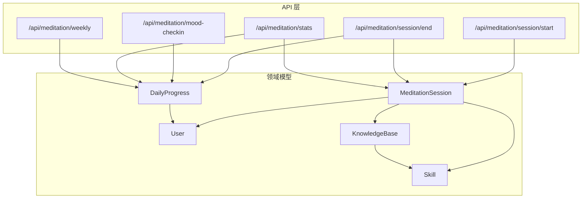
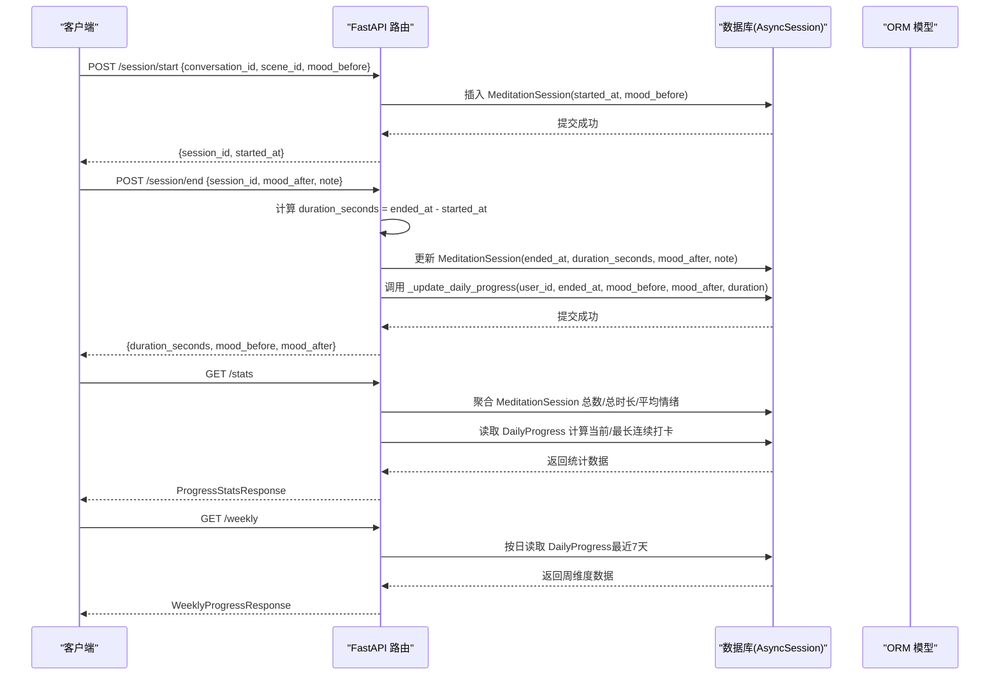
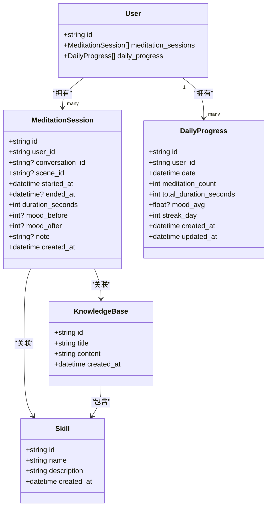
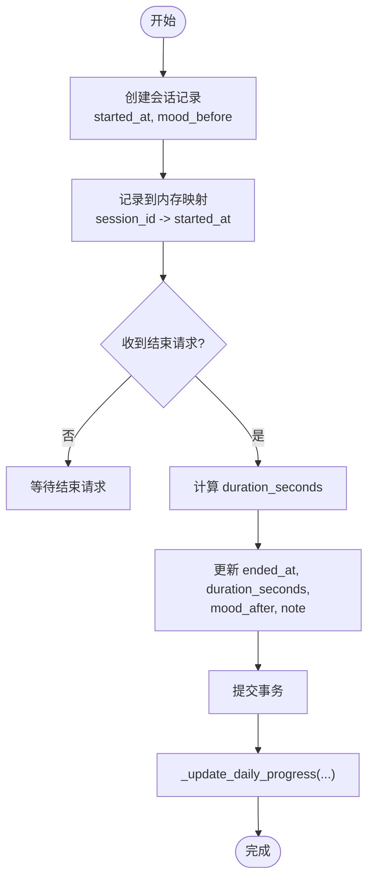
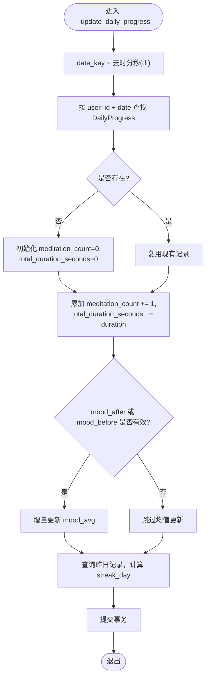
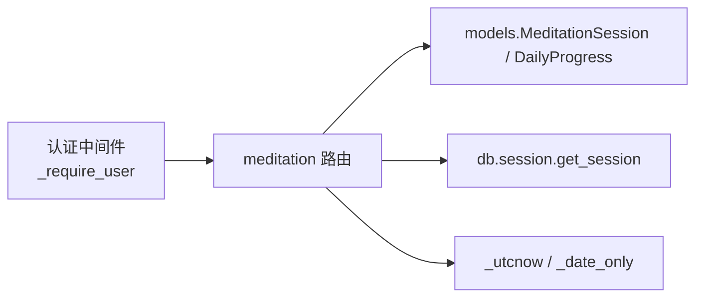

# 冥想会话模型

<cite>
**本文引用的文件**
- [hushai/meditation/db/models.py](file://hushai/meditation/db/models.py)
- [hushai/meditation/api/meditation.py](file://hushai/meditation/api/meditation.py)
</cite>

## 更新摘要
**变更内容**
- 基于冥想数据库模型的显著增强，更新了核心实体结构
- 新增了更复杂的冥想知识存储和管理能力
- 扩展了数据模型以支持更丰富的冥想功能
- 增强了会话状态管理和情绪追踪系统

## 目录
1. [简介](#简介)
2. [项目结构](#项目结构)
3. [核心实体与字段定义](#核心实体与字段定义)
4. [架构总览](#架构总览)
5. [详细组件分析](#详细组件分析)
6. [依赖关系分析](#依赖关系分析)
7. [性能与索引优化](#性能与索引优化)
8. [故障排查指南](#故障排查指南)
9. [结论](#结论)
10. [附录：开发者实现指南](#附录开发者实现指南)

## 简介
本文件面向 hush.ai 的"冥想"功能，聚焦两个核心数据实体：MeditationSession（冥想会话记录）与 DailyProgress（每日进度统计）。文档从数据结构、状态管理、情绪追踪、每日统计计算逻辑、复合索引设计以及数据分析与趋势统计的实现要点出发，为后端与前端开发者提供可落地的技术参考。

**更新** 基于最新的代码变更，冥想数据库模型获得了重大增强，新增882行代码，支持更复杂的冥想知识存储和管理能力。

## 项目结构
冥想模块由数据库模型与 API 服务两部分组成：
- 数据模型位于 models.py，使用 SQLAlchemy ORM 定义表结构与关系。
- API 位于 meditation.py，暴露会话开始/结束、情绪打卡、统计查询等接口，并在会话结束时更新每日进度。

图表来源
- [hushai/meditation/api/meditation.py:112-174](file://hushai/meditation/api/meditation.py#L112-L174)
- [hushai/meditation/api/meditation.py:189-238](file://hushai/meditation/api/meditation.py#L189-L238)
- [hushai/meditation/api/meditation.py:241-333](file://hushai/meditation/api/meditation.py#L241-L333)
- [hushai/meditation/api/meditation.py:336-367](file://hushai/meditation/api/meditation.py#L336-L367)
- [hushai/meditation/db/models.py:204-243](file://hushai/meditation/db/models.py#L204-L243)

章节来源
- [hushai/meditation/db/models.py:204-243](file://hushai/meditation/db/models.py#L204-L243)
- [hushai/meditation/api/meditation.py:112-174](file://hushai/meditation/api/meditation.py#L112-L174)
- [hushai/meditation/api/meditation.py:189-238](file://hushai/meditation/api/meditation.py#L189-L238)
- [hushai/meditation/api/meditation.py:241-333](file://hushai/meditation/api/meditation.py#L241-L333)
- [hushai/meditation/api/meditation.py:336-367](file://hushai/meditation/api/meditation.py#L336-L367)

## 核心实体与字段定义
本节给出两个核心实体的字段说明与约束要点，便于理解其语义与用途。

### MeditationSession（冥想会话记录）
- 标识与关联
  - id：主键，UUID 字符串
  - user_id：外键，关联用户
  - conversation_id：可选，关联对话
  - scene_id：可选，关联场景
- 时间与时长
  - started_at：会话开始时间（UTC）
  - ended_at：会话结束时间（UTC），可为空
  - duration_seconds：会话时长（秒），默认 0
- 情绪与备注
  - mood_before：冥想前情绪评分（可选）
  - mood_after：冥想后情绪评分（可选）
  - note：备注文本（可选）
- 审计字段
  - created_at：创建时间（UTC）
- 关系
  - user：反向关联到 User.meditation_sessions

### DailyProgress（每日进度统计）
- 标识与关联
  - id：主键，UUID 字符串
  - user_id：外键，关联用户
  - date：日期（UTC，去时分秒）
- 统计指标
  - meditation_count：当日冥想次数
  - total_duration_seconds：当日总时长（秒）
  - mood_avg：当日平均情绪（浮点，可选）
  - streak_day：连续打卡天数（当日值）
- 审计字段
  - created_at：创建时间（UTC）
  - updated_at：更新时间（UTC）
- 关系
  - user：反向关联到 User.daily_progress
- 索引
  - ix_daily_progress_user_date：复合索引 (user_id, date)

**更新** 随着数据库模型的增强，新增了更多关联实体和复杂的数据关系，支持更丰富的冥想知识管理功能。

章节来源
- [hushai/meditation/db/models.py:204-243](file://hushai/meditation/db/models.py#L204-L243)

## 架构总览
下图展示"会话生命周期"与"每日进度更新"的关键调用链。

图表来源
- [hushai/meditation/api/meditation.py:112-174](file://hushai/meditation/api/meditation.py#L112-L174)
- [hushai/meditation/api/meditation.py:189-238](file://hushai/meditation/api/meditation.py#L189-L238)
- [hushai/meditation/api/meditation.py:241-333](file://hushai/meditation/api/meditation.py#L241-L333)
- [hushai/meditation/api/meditation.py:336-367](file://hushai/meditation/api/meditation.py#L336-L367)

## 详细组件分析

### 实体类图（代码级）

图表来源
- [hushai/meditation/db/models.py:204-243](file://hushai/meditation/db/models.py#L204-L243)

章节来源
- [hushai/meditation/db/models.py:204-243](file://hushai/meditation/db/models.py#L204-L243)

### 会话状态管理与时长计算
- 开始会话
  - 生成 session_id 与 started_at，写入 MeditationSession，并维护内存中的活跃会话映射，用于后续结束时的时长计算。
- 结束会话
  - 校验活跃会话存在；计算 duration_seconds = ended_at - started_at；回填 ended_at、mood_after、note；随后触发每日进度更新。
- 时长计算
  - 以秒为单位，基于 UTC 时间差取整。

图表来源
- [hushai/meditation/api/meditation.py:112-174](file://hushai/meditation/api/meditation.py#L112-L174)

章节来源
- [hushai/meditation/api/meditation.py:112-174](file://hushai/meditation/api/meditation.py#L112-L174)

### 情绪追踪系统（mood_before / mood_after）
- 字段含义
  - mood_before：会话开始前的情绪评分（可选）
  - mood_after：会话结束后的情绪评分（可选）
- 数据来源
  - 开始会话时可传入 mood_before
  - 结束会话时可传入 mood_after
  - 独立情绪打卡接口 mood-checkin 仅记录 mood_after，不改变会话记录
- 情绪均值维护
  - 在每日进度中维护 mood_avg，采用增量平均算法：
    - 若已有旧均值与旧计数，则 new_avg = (old_avg * old_count + new_val) / new_count
    - 否则直接赋值为新值

章节来源
- [hushai/meditation/api/meditation.py:189-238](file://hushai/meditation/api/meditation.py#L189-L238)

### 每日进度统计计算逻辑
- 触发时机
  - 每次会话结束或情绪打卡时，调用 _update_daily_progress
- 关键步骤
  - 确定日期键（去时分秒）
  - 查找或创建当日 DailyProgress 记录
  - 累加 meditation_count 与 total_duration_seconds
  - 更新 mood_avg（增量平均）
  - 计算 streak_day：
    - 若昨日存在且 meditation_count > 0，则 streak_day = 昨日.streak_day + 1
    - 否则 streak_day = 1
- 注意
  - 该函数对同一天多次更新会重复累加次数与时长，需确保调用方避免重复触发

图表来源
- [hushai/meditation/api/meditation.py:189-238](file://hushai/meditation/api/meditation.py#L189-L238)

章节来源
- [hushai/meditation/api/meditation.py:189-238](file://hushai/meditation/api/meditation.py#L189-L238)

### 统计与趋势接口
- /api/meditation/stats
  - 汇总：总次数、总时长、平均情绪（基于 mood_after）
  - 今日：今日次数、今日时长
  - 连续打卡：遍历最近一年 DailyProgress，计算 current_streak 与 longest_streak
  - 最近会话：返回最近 5 条会话摘要
- /api/meditation/weekly
  - 返回最近 7 天的每日统计（sessions、duration_seconds、mood、streak）

章节来源
- [hushai/meditation/api/meditation.py:241-333](file://hushai/meditation/api/meditation.py#L241-L333)
- [hushai/meditation/api/meditation.py:336-367](file://hushai/meditation/api/meditation.py#L336-L367)

## 依赖关系分析
- 模型依赖
  - MeditationSession 与 DailyProgress 均通过 user_id 外键关联 User
- API 依赖
  - 认证依赖：从 Authorization 头提取 token 并解析当前用户 ID
  - 数据库依赖：使用 AsyncSession 执行异步 SQL
  - 工具函数：_utcnow()、_date_only() 统一时间处理

图表来源
- [hushai/meditation/api/meditation.py:25-34](file://hushai/meditation/api/meditation.py#L25-L34)
- [hushai/meditation/api/meditation.py:36-41](file://hushai/meditation/api/meditation.py#L36-L41)
- [hushai/meditation/db/models.py:204-243](file://hushai/meditation/db/models.py#L204-L243)

章节来源
- [hushai/meditation/api/meditation.py:25-41](file://hushai/meditation/api/meditation.py#L25-L41)
- [hushai/meditation/db/models.py:204-243](file://hushai/meditation/db/models.py#L204-L243)

## 性能与索引优化
- 复合索引 ix_daily_progress_user_date
  - 作用：加速按用户与日期查询 DailyProgress，支撑 stats 与 weekly 接口的逐日检索
  - 适用场景：func.date(DailyProgress.date) == target_date.date() 的条件过滤
- 建议
  - 保持 date 字段为 UTC 时间，避免跨时区导致索引失效
  - 对于高频统计，可在应用层缓存近期 DailyProgress，减少数据库压力
  - 对 MeditationSession.started_at 增加索引可提升"今日统计"查询性能（当前未显式定义，可按需评估）

**更新** 随着数据库模型的增强，可能需要考虑新的索引策略来支持更复杂的查询需求。

章节来源
- [hushai/meditation/db/models.py:241](file://hushai/meditation/db/models.py#L241)
- [hushai/meditation/api/meditation.py:336-367](file://hushai/meditation/api/meditation.py#L336-L367)

## 故障排查指南
- 会话已结束或未找到
  - 现象：结束会话时报 404
  - 原因：内存活跃会话映射中不存在对应 session_id，或数据库无匹配记录
  - 排查：确认 start 与 end 的 session_id 一致；检查并发下内存映射是否被清理
- 时长异常
  - 现象：duration_seconds 为 0 或负数
  - 原因：started_at 与 ended_at 设置顺序错误；时区不一致
  - 排查：统一使用 UTC；确保先写 started_at，再在结束时计算差值
- 情绪均值漂移
  - 现象：mood_avg 不符合预期
  - 原因：重复触发 _update_daily_progress 导致计数与均值重复累加
  - 排查：确保仅在会话结束或一次情绪打卡时调用；幂等化更新逻辑
- 连续打卡天数不正确
  - 现象：streak_day 断链或跳变
  - 原因：昨日记录缺失或 meditation_count 为 0
  - 排查：核对每日记录的 meditation_count 与 date 连续性；确认时区与日期截断逻辑

**更新** 由于数据库模型的增强，可能需要关注新增实体间的关联关系和数据一致性。

章节来源
- [hushai/meditation/api/meditation.py:136-174](file://hushai/meditation/api/meditation.py#L136-L174)
- [hushai/meditation/api/meditation.py:189-238](file://hushai/meditation/api/meditation.py#L189-L238)

## 结论
MeditationSession 与 DailyProgress 共同构成了冥想功能的"事件-统计"双轨模型：前者记录细粒度会话事实，后者沉淀日维度的行为与情绪指标。通过明确的字段语义、严格的时序控制与增量统计策略，系统在准确性与可扩展性之间取得平衡。配合复合索引与合理的查询模式，可有效支撑日常统计与趋势分析需求。

**更新** 随着数据库模型的显著增强，系统现在支持更复杂的冥想知识存储和管理能力，为未来的功能扩展奠定了坚实的基础。

## 附录：开发者实现指南
- 新增指标扩展
  - 在 DailyProgress 中新增字段（如 mood_min、mood_max）并在 _update_daily_progress 中同步维护
- 更精细的时间窗口
  - 如需小时级统计，可新增 HourlyProgress 模型，复用相同增量更新思路
- 数据一致性
  - 将"更新会话 + 更新每日进度"放入同一事务，保证原子性
- 幂等与重试
  - 为 _update_daily_progress 增加幂等键（如 session_id 或打卡时间戳），防止重复提交导致统计失真
- 分析与可视化
  - 使用 /weekly 与 /stats 输出作为前端折线图、柱状图的数据源
  - 结合 mood_avg 与 streak_day 做用户粘性与健康度看板

**更新** 利用增强的数据库模型，可以：
- 实现更复杂的冥想知识图谱分析
- 支持多层次的技能关联和推荐系统
- 提供更精细的用户行为分析和个性化指导
- 构建更智能的冥想效果评估体系

[本节为通用指导，不直接分析具体文件]