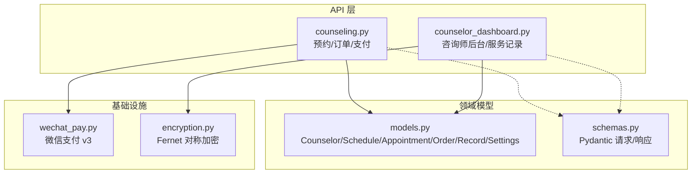
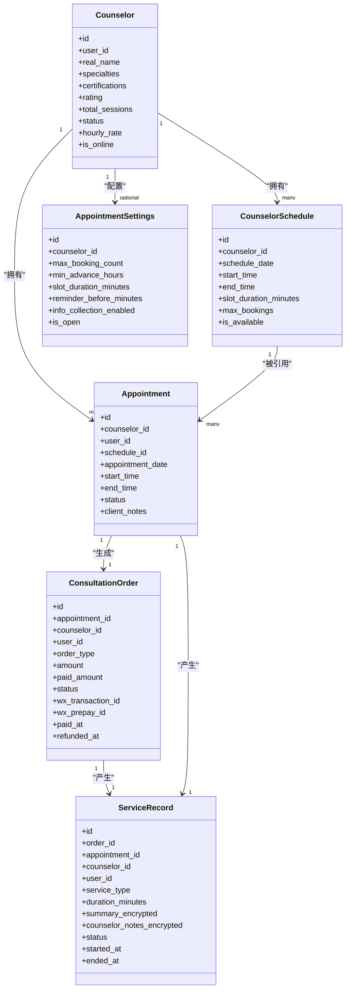
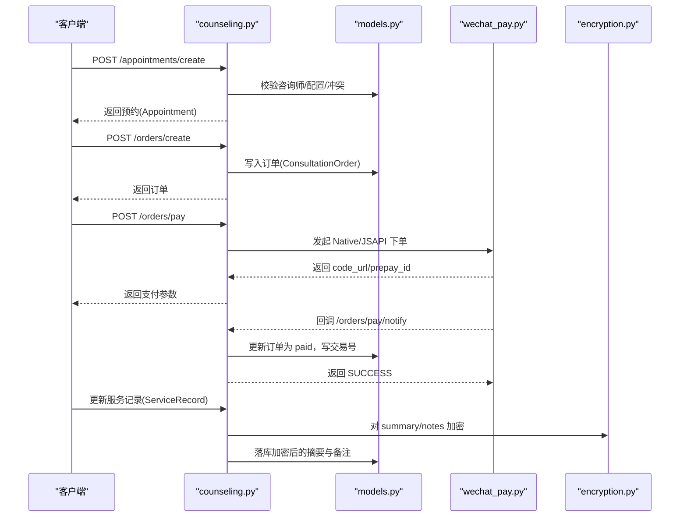
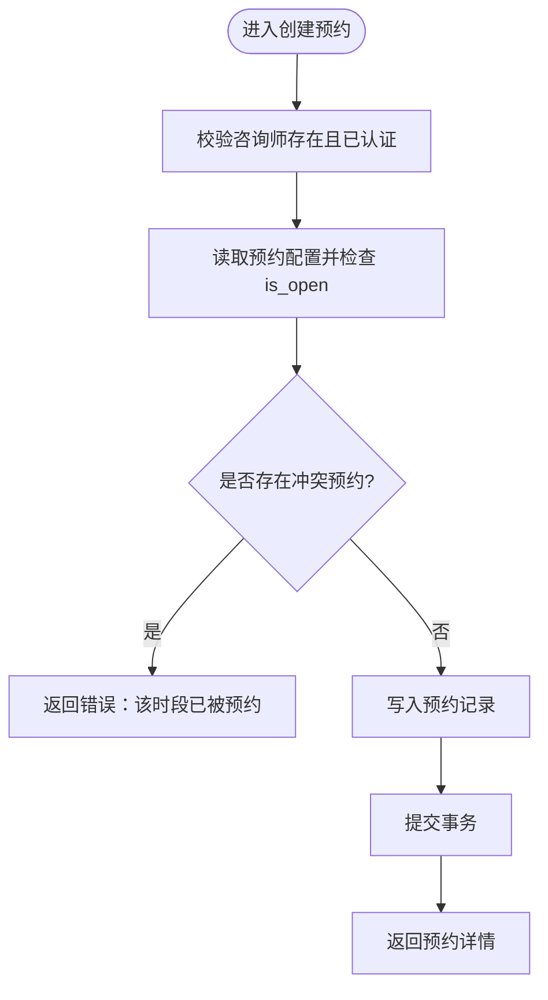
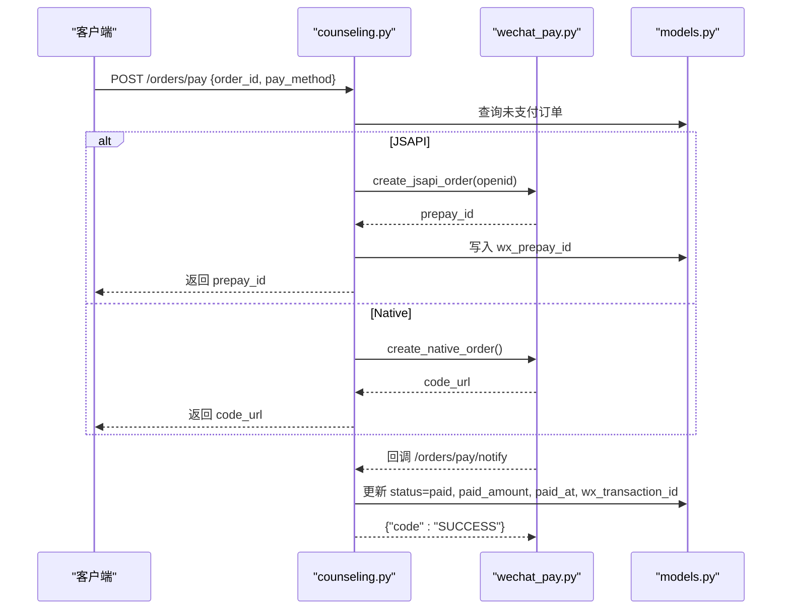
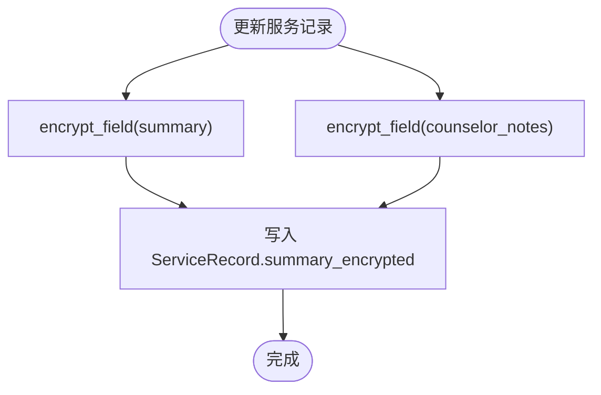
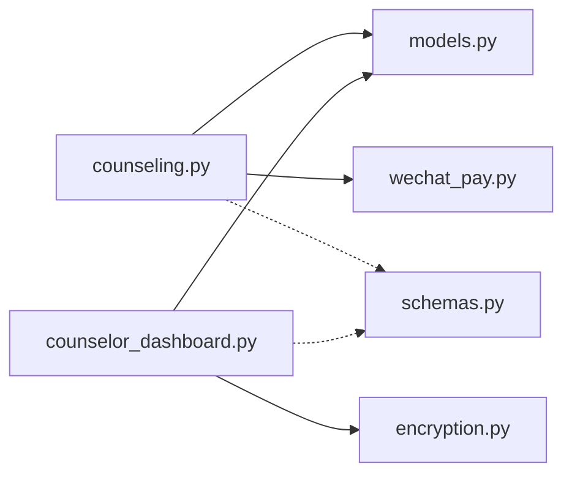

# 咨询师预约模型

<cite>
**本文引用的文件**   
- [models.py](file://hushai/meditation/db/models.py)
- [schemas.py](file://hushai/meditation/schemas.py)
- [counseling.py](file://hushai/meditation/api/counseling.py)
- [counselor_dashboard.py](file://hushai/meditation/api/counselor_dashboard.py)
- [wechat_pay.py](file://hushai/meditation/core/wechat_pay.py)
- [encryption.py](file://hushai/meditation/core/encryption.py)
</cite>

## 目录
1. [简介](#简介)
2. [项目结构](#项目结构)
3. [核心实体与关系](#核心实体与关系)
4. [架构总览](#架构总览)
5. [详细组件分析](#详细组件分析)
6. [依赖关系分析](#依赖关系分析)
7. [性能与一致性建议](#性能与一致性建议)
8. [故障排查指南](#故障排查指南)
9. [结论](#结论)
10. [附录：字段与状态定义](#附录字段与状态定义)

## 简介
本文件面向 hush.ai 的心理咨询服务，系统化梳理并说明以下实体的设计与数据流：Counselor（咨询师）、CounselorSchedule（排班时段）、Appointment（预约）、ConsultationOrder（咨询订单）、ServiceRecord（服务记录）、AppointmentSettings（预约配置）。文档覆盖：
- 咨询师资质管理：专业领域、资质证书、评级体系
- 排班时段管理：灵活时间段配置与可用性控制
- 预约流程完整生命周期：从创建预约到下单支付再到服务记录的端到端数据流
- 敏感数据加密存储：summary_encrypted、counselor_notes_encrypted 的设计与使用
- 订单状态管理与微信支付集成字段
- 开发者实现指南：预约冲突检测、订单状态同步

## 项目结构
围绕咨询服务相关代码主要分布在以下模块：
- 数据模型：hushai/meditation/db/models.py
- API 接口与业务编排：hushai/meditation/api/counseling.py、hushai/meditation/api/counselor_dashboard.py
- 请求/响应模式：hushai/meditation/schemas.py
- 微信支付集成：hushai/meditation/core/wechat_pay.py
- 敏感数据加密工具：hushai/meditation/core/encryption.py

图表来源
- [counseling.py:180-245](file://hushai/meditation/api/counseling.py#L180-L245)
- [counseling.py:437-519](file://hushai/meditation/api/counseling.py#L437-L519)
- [counselor_dashboard.py:390-405](file://hushai/meditation/api/counselor_dashboard.py#L390-L405)
- [models.py:273-433](file://hushai/meditation/db/models.py#L273-L433)
- [schemas.py:266-520](file://hushai/meditation/schemas.py#L266-L520)
- [wechat_pay.py:59-109](file://hushai/meditation/core/wechat_pay.py#L59-L109)
- [encryption.py:18-36](file://hushai/meditation/core/encryption.py#L18-L36)

章节来源
- [models.py:273-433](file://hushai/meditation/db/models.py#L273-L433)
- [schemas.py:266-520](file://hushai/meditation/schemas.py#L266-L520)
- [counseling.py:180-245](file://hushai/meditation/api/counseling.py#L180-L245)
- [counseling.py:437-519](file://hushai/meditation/api/counseling.py#L437-L519)
- [counselor_dashboard.py:390-405](file://hushai/meditation/api/counselor_dashboard.py#L390-L405)
- [wechat_pay.py:59-109](file://hushai/meditation/core/wechat_pay.py#L59-L109)
- [encryption.py:18-36](file://hushai/meditation/core/encryption.py#L18-L36)

## 核心实体与关系
本节聚焦六大核心实体及其关键属性、关系与约束。

- Counselor（咨询师）
  - 关键字段：real_name、specialties(JSON)、certifications(JSON)、rating、total_sessions、status、hourly_rate、is_online
  - 关系：一对多关联 schedules、appointments；一对一关联 User
  - 用途：承载咨询师基本信息、资质与评分，支撑筛选与排序

- CounselorSchedule（排班时段）
  - 关键字段：schedule_date、start_time、end_time、slot_duration_minutes、max_bookings、is_available
  - 唯一索引：(counselor_id, schedule_date, start_time)
  - 用途：精细化控制可预约的时间段与容量

- Appointment（预约）
  - 关键字段：appointment_date、start_time、end_time、status、client_notes
  - 关系：属于一个 Counselor、一个 User、可选绑定 Schedule；与 Order、ServiceRecord 双向可选关联
  - 用途：用户侧预约主记录，贯穿后续订单与服务记录

- ConsultationOrder（咨询订单）
  - 关键字段：order_type、amount、paid_amount、status、wx_transaction_id、wx_prepay_id、paid_at、refunded_at
  - 关系：关联 Appointment、Counselor、User、ServiceRecord
  - 用途：支付与结算主记录，承载微信支付流水号等

- ServiceRecord（服务记录）
  - 关键字段：service_type、duration_minutes、summary_encrypted、counselor_notes_encrypted、status、started_at、ended_at
  - 关系：可选关联 Order、Appointment、Counselor、User
  - 用途：保存咨询过程摘要与咨询师备注，敏感字段以密文存储

- AppointmentSettings（预约配置）
  - 关键字段：max_booking_count、min_advance_hours、slot_duration_minutes、reminder_before_minutes、info_collection_enabled、is_open
  - 关系：可选按 counselor_id 设置，支持全局默认
  - 用途：统一或个性化控制预约规则

图表来源
- [models.py:273-433](file://hushai/meditation/db/models.py#L273-L433)

章节来源
- [models.py:273-433](file://hushai/meditation/db/models.py#L273-L433)

## 架构总览
下图展示“预约-订单-支付-服务记录”的关键调用链与数据落库点。

图表来源
- [counseling.py:180-245](file://hushai/meditation/api/counseling.py#L180-L245)
- [counseling.py:437-519](file://hushai/meditation/api/counseling.py#L437-L519)
- [counselor_dashboard.py:390-405](file://hushai/meditation/api/counselor_dashboard.py#L390-L405)
- [models.py:355-411](file://hushai/meditation/db/models.py#L355-L411)
- [wechat_pay.py:59-109](file://hushai/meditation/core/wechat_pay.py#L59-L109)
- [encryption.py:18-36](file://hushai/meditation/core/encryption.py#L18-L36)

## 详细组件分析

### 咨询师资质管理系统（Counselor）
- 专业领域 specialties：JSON 数组，用于前端展示与后端过滤（如按 specialty 查询）
- 资质证书 certifications：JSON 数组，用于详情展示与审核流程
- 评级 rating：浮点数，默认排序权重之一；配合 sort_order 控制列表顺序
- 会话量 total_sessions：统计指标，可用于推荐与信任度展示
- 状态 status：pending/approved/rejected/disabled，影响是否可被预约

实现要点
- 列表接口按 sort_order 升序、rating 降序排序
- 详情接口返回 specialties、certifications、status 等完整信息

章节来源
- [models.py:273-298](file://hushai/meditation/db/models.py#L273-L298)
- [counseling.py:80-134](file://hushai/meditation/api/counseling.py#L80-L134)
- [schemas.py:296-348](file://hushai/meditation/schemas.py#L296-L348)

### 排班时段管理（CounselorSchedule）
- 通过 date+time 精确描述可用时段
- slot_duration_minutes 控制单条时长，max_bookings 控制该时段最大预约数
- is_available 开关控制是否对外可见
- 唯一索引 (counselor_id, schedule_date, start_time) 避免重复录入

章节来源
- [models.py:305-324](file://hushai/meditation/db/models.py#L305-L324)
- [schemas.py:353-373](file://hushai/meditation/schemas.py#L353-L373)
- [counseling.py:140-174](file://hushai/meditation/api/counseling.py#L140-L174)

### 预约流程与冲突检测（Appointment）
- 创建前校验：
  - 咨询师存在且已认证
  - 预约配置未关闭
  - 同一咨询师在同一日期与开始时间不存在 pending/confirmed 的预约（冲突检测）
- 成功后持久化 Appointment，并返回给客户端

图表来源
- [counseling.py:180-245](file://hushai/meditation/api/counseling.py#L180-L245)

章节来源
- [counseling.py:180-245](file://hushai/meditation/api/counseling.py#L180-L245)
- [models.py:327-353](file://hushai/meditation/db/models.py#L327-L353)

### 订单与微信支付集成（ConsultationOrder）
- 订单状态：unpaid/paid/refunded
- 支付字段：
  - wx_prepay_id：JSAPI 下单返回的预支付标识
  - wx_transaction_id：微信支付成功回调中的交易号
- 支付流程：
  - 客户端调用 /orders/pay，选择 native 或 jsapi
  - 后端调用 wechat_pay.create_native_order 或 create_jsapi_order
  - 回调 /orders/pay/notify 验签后更新订单状态与流水号

图表来源
- [counseling.py:437-519](file://hushai/meditation/api/counseling.py#L437-L519)
- [wechat_pay.py:59-109](file://hushai/meditation/core/wechat_pay.py#L59-L109)
- [models.py:355-384](file://hushai/meditation/db/models.py#L355-L384)

章节来源
- [counseling.py:437-519](file://hushai/meditation/api/counseling.py#L437-L519)
- [schemas.py:419-473](file://hushai/meditation/schemas.py#L419-L473)
- [models.py:355-384](file://hushai/meditation/db/models.py#L355-L384)
- [wechat_pay.py:59-109](file://hushai/meditation/core/wechat_pay.py#L59-L109)

### 服务记录与敏感数据加密（ServiceRecord）
- 敏感字段：
  - summary_encrypted：对应数据库列 summary
  - counselor_notes_encrypted：对应数据库列 counselor_notes
- 加密方式：使用 Fernet 对称加密，密钥从环境变量加载
- 更新路径：在咨询师后台接口中，将明文经 encrypt_field 后再写入数据库

图表来源
- [counselor_dashboard.py:390-405](file://hushai/meditation/api/counselor_dashboard.py#L390-L405)
- [encryption.py:18-36](file://hushai/meditation/core/encryption.py#L18-L36)
- [models.py:386-411](file://hushai/meditation/db/models.py#L386-L411)

章节来源
- [counselor_dashboard.py:390-405](file://hushai/meditation/api/counselor_dashboard.py#L390-L405)
- [encryption.py:18-36](file://hushai/meditation/core/encryption.py#L18-L36)
- [models.py:386-411](file://hushai/meditation/db/models.py#L386-L411)

### 预约配置（AppointmentSettings）
- 支持全局与按咨询师维度配置
- 关键规则：
  - max_booking_count：最大并发预约数
  - min_advance_hours：最小提前预约小时数
  - slot_duration_minutes：默认时段长度
  - reminder_before_minutes：提醒提前分钟数
  - info_collection_enabled：是否收集用户信息
  - is_open：是否开放预约

章节来源
- [models.py:413-433](file://hushai/meditation/db/models.py#L413-L433)
- [schemas.py:508-520](file://hushai/meditation/schemas.py#L508-L520)
- [counseling.py:196-204](file://hushai/meditation/api/counseling.py#L196-L204)

## 依赖关系分析
- API 层依赖领域模型进行读写
- 支付能力由 wechat_pay 提供，API 层负责编排与落库
- 敏感数据写入前经由 encryption 工具处理
- Pydantic schemas 作为 API 输入输出契约

图表来源
- [counseling.py:180-245](file://hushai/meditation/api/counseling.py#L180-L245)
- [counseling.py:437-519](file://hushai/meditation/api/counseling.py#L437-L519)
- [counselor_dashboard.py:390-405](file://hushai/meditation/api/counselor_dashboard.py#L390-L405)
- [models.py:273-433](file://hushai/meditation/db/models.py#L273-L433)
- [schemas.py:266-520](file://hushai/meditation/schemas.py#L266-L520)
- [wechat_pay.py:59-109](file://hushai/meditation/core/wechat_pay.py#L59-L109)
- [encryption.py:18-36](file://hushai/meditation/core/encryption.py#L18-L36)

章节来源
- [counseling.py:180-245](file://hushai/meditation/api/counseling.py#L180-L245)
- [counseling.py:437-519](file://hushai/meditation/api/counseling.py#L437-L519)
- [counselor_dashboard.py:390-405](file://hushai/meditation/api/counselor_dashboard.py#L390-L405)
- [models.py:273-433](file://hushai/meditation/db/models.py#L273-L433)
- [schemas.py:266-520](file://hushai/meditation/schemas.py#L266-L520)
- [wechat_pay.py:59-109](file://hushai/meditation/core/wechat_pay.py#L59-L109)
- [encryption.py:18-36](file://hushai/meditation/core/encryption.py#L18-L36)

## 性能与一致性建议
- 冲突检测
  - 当前基于 (counselor_id, appointment_date, start_time) 的查询判断冲突，建议在数据库层面增加唯一约束或应用层加锁，防止高并发下竞态
- 排班容量
  - 若需按 max_bookings 限制，应在创建预约时统计同一段内有效预约数量并进行校验
- 支付幂等
  - 回调处理应保证幂等：根据 out_trade_no 去重更新，避免重复标记为 paid
- 加密性能
  - Fernet 加解密开销较小，但批量写入时应注意 I/O 合并与连接池复用
- 排序与分页
  - 咨询师列表使用 sort_order 与 rating 组合排序，确保索引覆盖以提升查询性能

[本节为通用建议，不直接分析具体文件]

## 故障排查指南
- 预约冲突
  - 现象：创建预约失败，提示“该时段已被预约”
  - 排查：确认是否存在 pending/confirmed 的同日同时段预约
  - 参考：[counseling.py:206-217](file://hushai/meditation/api/counseling.py#L206-L217)
- 支付失败
  - 现象：下单接口返回错误
  - 排查：检查微信签名、证书、商户号与 notify_url 配置；查看日志
  - 参考：[wechat_pay.py:76-81](file://hushai/meditation/core/wechat_pay.py#L76-L81)
- 回调未生效
  - 现象：订单未变为 paid
  - 排查：确认回调签名验证通过、out_trade_no 映射正确、数据库事务提交
  - 参考：[counseling.py:494-519](file://hushai/meditation/api/counseling.py#L494-L519)
- 敏感字段为空
  - 现象：服务记录摘要或备注为空
  - 排查：确认加密函数传入非空字符串；检查环境变量密钥是否配置
  - 参考：[encryption.py:18-36](file://hushai/meditation/core/encryption.py#L18-L36)

章节来源
- [counseling.py:206-217](file://hushai/meditation/api/counseling.py#L206-L217)
- [counseling.py:494-519](file://hushai/meditation/api/counseling.py#L494-L519)
- [wechat_pay.py:76-81](file://hushai/meditation/core/wechat_pay.py#L76-L81)
- [encryption.py:18-36](file://hushai/meditation/core/encryption.py#L18-L36)

## 结论
本模型围绕咨询师资质、排班、预约、订单、服务记录与配置形成闭环，结合微信支付与敏感数据加密，满足心理咨询服务的合规性与用户体验需求。建议在后续迭代中完善排班容量控制、支付幂等与数据库级唯一约束，进一步提升系统健壮性。

[本节为总结性内容，不直接分析具体文件]

## 附录：字段与状态定义
- 咨询师状态：pending/approved/rejected/disabled
- 预约状态：pending/confirmed/completed/cancelled/rejected
- 订单状态：unpaid/paid/refunded
- 服务记录状态：in_progress/completed/archived
- 支付方式：native/jsapi
- 敏感字段：summary_encrypted、counselor_notes_encrypted（数据库列名为 summary、counselor_notes）

章节来源
- [schemas.py:266-292](file://hushai/meditation/schemas.py#L266-L292)
- [models.py:339-341](file://hushai/meditation/db/models.py#L339-L341)
- [models.py:368-370](file://hushai/meditation/db/models.py#L368-L370)
- [models.py:400-402](file://hushai/meditation/db/models.py#L400-L402)
- [schemas.py:463-473](file://hushai/meditation/schemas.py#L463-L473)
- [models.py:398-399](file://hushai/meditation/db/models.py#L398-L399)