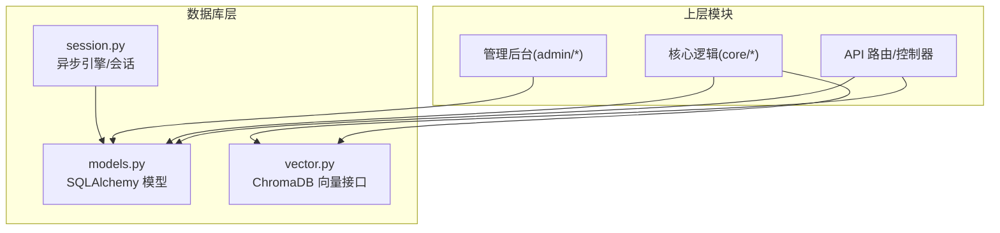
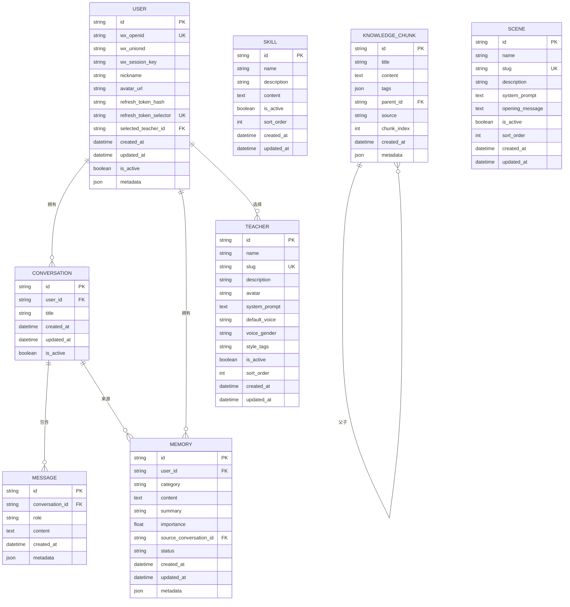
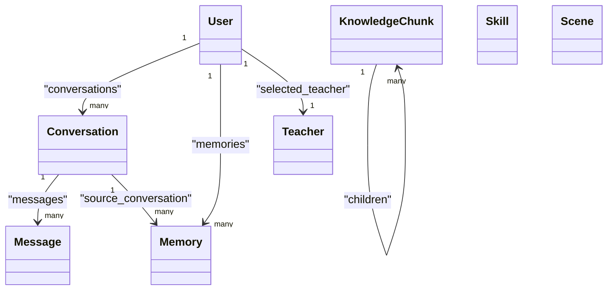

# 实体模型设计

<cite>
**本文引用的文件**   
- [models.py](file://hushai/meditation/db/models.py)
- [session.py](file://hushai/meditation/db/session.py)
- [vector.py](file://hushai/meditation/db/vector.py)
</cite>

## 目录
1. [引言](#引言)
2. [项目结构](#项目结构)
3. [核心组件](#核心组件)
4. [架构总览](#架构总览)
5. [详细组件分析](#详细组件分析)
6. [依赖关系分析](#依赖关系分析)
7. [性能考量](#性能考量)
8. [故障排查指南](#故障排查指南)
9. [结论](#结论)
10. [附录](#附录)

## 引言
本文件为 hush.ai 的 SQLAlchemy ORM 实体模型设计文档，聚焦于用户、对话、消息、记忆、导师、场景、知识片段、技能等核心实体的字段定义、数据类型与约束条件；阐述实体间的一对一、一对多、多对一等关系映射（含外键与关联配置）；说明 UUID 主键策略、时间戳自动管理、JSON 字段使用场景；并提供每个模型的完整字段说明、业务含义与数据验证规则。同时给出 Base 类设计与继承模式的使用建议，帮助开发者快速理解数据库表结构与 ORM 使用方式。

## 项目结构
与实体模型相关的代码主要位于 meditation 子模块的 db 包中：
- models.py：集中定义所有 SQLAlchemy 模型与关系
- session.py：异步引擎与会话工厂、初始化与关闭
- vector.py：ChromaDB 向量检索接口（与 Memory/KnowledgeChunk 配合使用）

图表来源
- [models.py:1-434](file://hushai/meditation/db/models.py#L1-L434)
- [session.py:1-83](file://hushai/meditation/db/session.py#L1-L83)
- [vector.py:1-179](file://hushai/meditation/db/vector.py#L1-L179)

章节来源
- [models.py:1-434](file://hushai/meditation/db/models.py#L1-L434)
- [session.py:1-83](file://hushai/meditation/db/session.py#L1-L83)
- [vector.py:1-179](file://hushai/meditation/db/vector.py#L1-L179)

## 核心组件
本节概述各核心模型的设计要点与关系概览。

- 统一基类与通用约定
  - Base：DeclarativeBase 子类，作为所有模型的基类
  - 主键：全部采用 String(36) 存储 UUID v4，默认值由 _uuid() 生成
  - 时间戳：created_at/updated_at 使用 DateTime(timezone=True)，默认 UTC；onupdate 自动更新
  - JSON 字段：metadata_ 列映射到 metadata，用于灵活扩展；部分模型使用 tags/specialties/certifications 等 JSON 列
  - 索引：常用查询字段添加 Index 或 unique/index 约束，提升检索性能

- 核心实体与关系
  - User：平台用户，拥有多个 Conversation/Memory/MeditationSession/DailyProgress，可选选择 Teacher
  - Conversation：属于 User，包含多条 Message
  - Message：属于 Conversation，记录角色与内容
  - Memory：属于 User，支持按 user_id+category 复合索引，可溯源至某条 Conversation
  - Skill：系统提示注入的技能片段，无外键
  - KnowledgeChunk：知识片段，支持父子层级（parent_id 自引用），并同步至向量库
  - Scene：冥想场景，提供系统提示与开场白
  - Teacher：导师角色，被 User.selected_teacher_id 引用

- 咨询模块（可选扩展）
  - Counselor/CounselorSchedule/Appointment/ConsultationOrder/ServiceRecord/AppointmentSettings 构成预约、订单与服务记录闭环

章节来源
- [models.py:25-66](file://hushai/meditation/db/models.py#L25-L66)
- [models.py:68-96](file://hushai/meditation/db/models.py#L68-L96)
- [models.py:98-118](file://hushai/meditation/db/models.py#L98-L118)
- [models.py:120-135](file://hushai/meditation/db/models.py#L120-L135)
- [models.py:137-151](file://hushai/meditation/db/models.py#L137-L151)
- [models.py:153-170](file://hushai/meditation/db/models.py#L153-L170)
- [models.py:246-266](file://hushai/meditation/db/models.py#L246-L266)
- [models.py:273-434](file://hushai/meditation/db/models.py#L273-L434)

## 架构总览
下图展示核心实体间的关系图（仅包含与目标密切相关的实体）。

图表来源
- [models.py:37-66](file://hushai/meditation/db/models.py#L37-L66)
- [models.py:68-96](file://hushai/meditation/db/models.py#L68-L96)
- [models.py:98-118](file://hushai/meditation/db/models.py#L98-L118)
- [models.py:120-135](file://hushai/meditation/db/models.py#L120-L135)
- [models.py:137-151](file://hushai/meditation/db/models.py#L137-L151)
- [models.py:153-170](file://hushai/meditation/db/models.py#L153-L170)
- [models.py:246-266](file://hushai/meditation/db/models.py#L246-L266)

## 详细组件分析

### Base 与通用约定
- Base：DeclarativeBase 子类，作为所有模型基类
- UUID 主键：String(36) + default=_uuid()，保证全局唯一且便于跨服务传播
- 时间戳：
  - created_at：默认当前 UTC 时间
  - updated_at：插入时默认当前 UTC 时间，更新时自动 onupdate
- JSON 字段：
  - metadata_ 映射为 metadata，用于非结构化扩展
  - 其他 JSON 字段如 tags、specialties、certifications 等
- 索引策略：
  - 常用过滤/排序字段建立 index
  - 复合索引用于高频组合查询（如 memories.user_category、daily_progress.user_date）

章节来源
- [models.py:25-35](file://hushai/meditation/db/models.py#L25-L35)
- [models.py:37-66](file://hushai/meditation/db/models.py#L37-L66)
- [models.py:98-118](file://hushai/meditation/db/models.py#L98-L118)
- [models.py:223-244](file://hushai/meditation/db/models.py#L223-L244)

### User 模型
- 字段与约束
  - id：UUID 主键
  - wx_openid：微信 OpenID，唯一且索引
  - wx_unionid：微信 UnionID
  - wx_session_key：会话密钥
  - nickname/avatar_url：用户资料
  - refresh_token_hash：刷新令牌哈希，索引，用于 O(1) 定位用户
  - refresh_token_selector：刷新令牌选择器，唯一且索引
  - selected_teacher_id：外键指向 teachers.id，表示用户选择的导师
  - created_at/updated_at：UTC 时间戳
  - is_active：是否激活
  - metadata：JSON 扩展
- 关系
  - conversations：一对多（User -> Conversation）
  - memories：一对多（User -> Memory）
  - meditation_sessions：一对多（User -> MeditationSession）
  - daily_progress：一对多（User -> DailyProgress）
  - selected_teacher：多对一（User -> Teacher）

章节来源
- [models.py:37-66](file://hushai/meditation/db/models.py#L37-L66)

### Conversation 模型
- 字段与约束
  - id：UUID 主键
  - user_id：外键 users.id，索引
  - title：对话标题
  - created_at/updated_at：UTC 时间戳
  - is_active：是否激活
- 关系
  - user：多对一（Conversation -> User）
  - messages：一对多（Conversation -> Message）

章节来源
- [models.py:68-83](file://hushai/meditation/db/models.py#L68-L83)

### Message 模型
- 字段与约束
  - id：UUID 主键
  - conversation_id：外键 conversations.id，索引
  - role：消息角色（如 user/assistant）
  - content：消息正文
  - created_at：UTC 时间戳
  - metadata：JSON 扩展
- 关系
  - conversation：多对一（Message -> Conversation）

章节来源
- [models.py:84-96](file://hushai/meditation/db/models.py#L84-L96)

### Memory 模型
- 字段与约束
  - id：UUID 主键
  - user_id：外键 users.id，索引
  - category：分类，索引
  - content：记忆正文
  - summary：摘要
  - importance：重要性评分（浮点）
  - source_conversation_id：外键 conversations.id，溯源对话
  - status：状态（默认 active）
  - created_at/updated_at：UTC 时间戳
  - metadata：JSON 扩展
  - 复合索引：user_id + category
- 关系
  - user：多对一（Memory -> User）

章节来源
- [models.py:98-118](file://hushai/meditation/db/models.py#L98-L118)

### Skill 模型
- 字段与约束
  - id：UUID 主键
  - name：技能名称
  - description：描述
  - content：系统提示内容
  - is_active：是否启用
  - sort_order：排序权重
  - created_at/updated_at：UTC 时间戳
- 关系
  - 无直接外键关系（通过应用层注入到系统提示）

章节来源
- [models.py:120-135](file://hushai/meditation/db/models.py#L120-L135)

### KnowledgeChunk 模型
- 字段与约束
  - id：UUID 主键
  - title：标题
  - content：正文
  - tags：标签列表（JSON）
  - parent_id：自引用外键 knowledge_chunks.id，实现树形结构
  - source：来源
  - chunk_index：分片序号
  - created_at：UTC 时间戳
  - metadata：JSON 扩展
- 关系
  - children：自引用一对多（KnowledgeChunk -> KnowledgeChunk）

章节来源
- [models.py:137-151](file://hushai/meditation/db/models.py#L137-L151)

### Scene 模型
- 字段与约束
  - id：UUID 主键
  - name：场景名
  - slug：唯一标识，索引
  - description：描述
  - system_prompt：系统提示
  - opening_message：开场白
  - is_active：是否启用
  - sort_order：排序权重
  - created_at/updated_at：UTC 时间戳

章节来源
- [models.py:153-170](file://hushai/meditation/db/models.py#L153-L170)

### Teacher 模型
- 字段与约束
  - id：UUID 主键
  - name：导师名
  - slug：唯一标识，索引
  - description：描述
  - avatar：头像 URL
  - system_prompt：系统提示
  - default_voice：默认音色
  - voice_gender：性别
  - style_tags：风格标签
  - is_active：是否启用
  - sort_order：排序权重
  - created_at/updated_at：UTC 时间戳

章节来源
- [models.py:246-266](file://hushai/meditation/db/models.py#L246-L266)

### 咨询模块相关模型（Counselor / Schedule / Appointment / Order / ServiceRecord / Settings）
- Counselor：咨询师信息，JSON 存储 specialties/certifications，状态枚举（pending/approved/rejected/disabled）
- CounselorSchedule：排班时段，唯一索引（counselor_id, schedule_date, start_time）
- Appointment：预约，状态枚举（pending/confirmed/completed/cancelled/rejected）
- ConsultationOrder：订单，支付相关字段与状态（unpaid/paid/refunded）
- ServiceRecord：服务记录，敏感字段以加密形式存储（summary/counselor_notes）
- AppointmentSettings：预约配置，支持全局或咨询师级别

章节来源
- [models.py:273-434](file://hushai/meditation/db/models.py#L273-L434)

## 依赖关系分析
- 模型间耦合
  - 强耦合：User <-> Conversation <-> Message；User <-> Memory；User <-> MeditationSession/DailyProgress
  - 弱耦合：Skill、Scene、Teacher 通过应用层参与提示构建
  - 自引用：KnowledgeChunk.parent_id 形成树形结构
- 外部依赖
  - ChromaDB：KnowledgeChunk 与 Memory 的向量检索在 vector.py 中实现，与 ORM 解耦
- 索引与约束
  - 大量使用 index/unique 提升查询性能
  - 复合索引用于高频组合查询

图表来源
- [models.py:37-66](file://hushai/meditation/db/models.py#L37-L66)
- [models.py:68-96](file://hushai/meditation/db/models.py#L68-L96)
- [models.py:98-118](file://hushai/meditation/db/models.py#L98-L118)
- [models.py:137-151](file://hushai/meditation/db/models.py#L137-L151)

章节来源
- [models.py:37-66](file://hushai/meditation/db/models.py#L37-L66)
- [models.py:68-96](file://hushai/meditation/db/models.py#L68-L96)
- [models.py:98-118](file://hushai/meditation/db/models.py#L98-L118)
- [models.py:137-151](file://hushai/meditation/db/models.py#L137-L151)

## 性能考量
- 索引优化
  - 单列索引：users.wx_openid、users.refresh_token_hash、users.refresh_token_selector、conversations.user_id、messages.conversation_id、memories.user_id、memories.category、knowledge_chunks.parent_id、scenes.slug、teachers.slug 等
  - 复合索引：memories(user_id, category)、daily_progress(user_id, date)、counselor_schedules(counselor_id, schedule_date, start_time)
- 时间戳与时区
  - 全量使用带时区的 DateTime，避免跨时区歧义
- JSON 字段
  - 适合存储半结构化扩展数据，但应避免过度使用导致查询复杂化
- 向量检索
  - ChromaDB 集合按 cosine 相似度计算，结合 where 过滤（如 user_id）提升召回质量

章节来源
- [models.py:98-118](file://hushai/meditation/db/models.py#L98-L118)
- [models.py:223-244](file://hushai/meditation/db/models.py#L223-L244)
- [models.py:304-325](file://hushai/meditation/db/models.py#L304-L325)
- [vector.py:61-78](file://hushai/meditation/db/vector.py#L61-L78)
- [vector.py:144-173](file://hushai/meditation/db/vector.py#L144-L173)

## 故障排查指南
- 数据库连接与初始化
  - 检查 get_engine 返回的 URL 是否正确（sqlite/postgresql）
  - 确认 init_db 已调用以创建表结构
- 会话生命周期
  - 确保使用 async_sessionmaker 获取 AsyncSession，并在请求结束后释放
- 测试环境重置
  - reset_session_for_tests 会清空引擎与会话工厂，避免测试污染
- 向量库问题
  - 若 embedding_provider 未配置，将回退到默认嵌入函数
  - 集合不存在时会创建，注意持久化路径配置

章节来源
- [session.py:15-47](file://hushai/meditation/db/session.py#L15-L47)
- [session.py:63-76](file://hushai/meditation/db/session.py#L63-L76)
- [session.py:79-83](file://hushai/meditation/db/session.py#L79-L83)
- [vector.py:15-28](file://hushai/meditation/db/vector.py#L15-L28)
- [vector.py:43-58](file://hushai/meditation/db/vector.py#L43-L58)

## 结论
本设计以统一的 Base 与通用约定为基础，采用 UUID 主键、UTC 时间戳与 JSON 扩展，兼顾可扩展性与查询性能。核心实体围绕用户、对话、消息、记忆展开，辅以导师、场景、知识与技能支撑个性化引导与知识增强。咨询模块提供完整的预约与订单闭环。通过合理的索引与向量检索集成，系统在功能与性能之间取得平衡。

## 附录

### 字段与约束速查表（核心实体）
- User
  - 主键：id (UUID)
  - 唯一/索引：wx_openid, refresh_token_hash, refresh_token_selector
  - 外键：selected_teacher_id -> teachers.id
  - 时间戳：created_at, updated_at
  - JSON：metadata
- Conversation
  - 主键：id (UUID)
  - 外键：user_id -> users.id
  - 时间戳：created_at, updated_at
- Message
  - 主键：id (UUID)
  - 外键：conversation_id -> conversations.id
  - JSON：metadata
- Memory
  - 主键：id (UUID)
  - 外键：user_id -> users.id, source_conversation_id -> conversations.id
  - 复合索引：(user_id, category)
  - 时间戳：created_at, updated_at
  - JSON：metadata
- Skill
  - 主键：id (UUID)
  - 时间戳：created_at, updated_at
- KnowledgeChunk
  - 主键：id (UUID)
  - 自引用外键：parent_id -> knowledge_chunks.id
  - JSON：tags, metadata
- Scene
  - 主键：id (UUID)
  - 唯一/索引：slug
  - 时间戳：created_at, updated_at
- Teacher
  - 主键：id (UUID)
  - 唯一/索引：slug
  - 时间戳：created_at, updated_at

章节来源
- [models.py:37-66](file://hushai/meditation/db/models.py#L37-L66)
- [models.py:68-96](file://hushai/meditation/db/models.py#L68-L96)
- [models.py:98-118](file://hushai/meditation/db/models.py#L98-L118)
- [models.py:120-135](file://hushai/meditation/db/models.py#L120-L135)
- [models.py:137-151](file://hushai/meditation/db/models.py#L137-L151)
- [models.py:153-170](file://hushai/meditation/db/models.py#L153-L170)
- [models.py:246-266](file://hushai/meditation/db/models.py#L246-L266)

### ORM 使用指南
- 创建表结构
  - 调用 init_db 以基于 Base.metadata 创建所有表
- 获取会话
  - 使用 get_session 上下文管理器获取 AsyncSession
- 事务与提交
  - 在会话内执行增删改后提交；expire_on_commit=False 可减少重复加载开销
- 关系访问
  - 通过 relationship 双向导航，注意 back_populates 与 foreign_keys 的配置一致性
- 向量检索
  - KnowledgeChunk 与 Memory 的向量操作通过 vector.py 提供的接口进行，与 ORM 解耦

章节来源
- [session.py:63-76](file://hushai/meditation/db/session.py#L63-L76)
- [session.py:50-61](file://hushai/meditation/db/session.py#L50-L61)
- [vector.py:81-127](file://hushai/meditation/db/vector.py#L81-L127)
- [vector.py:130-173](file://hushai/meditation/db/vector.py#L130-L173)