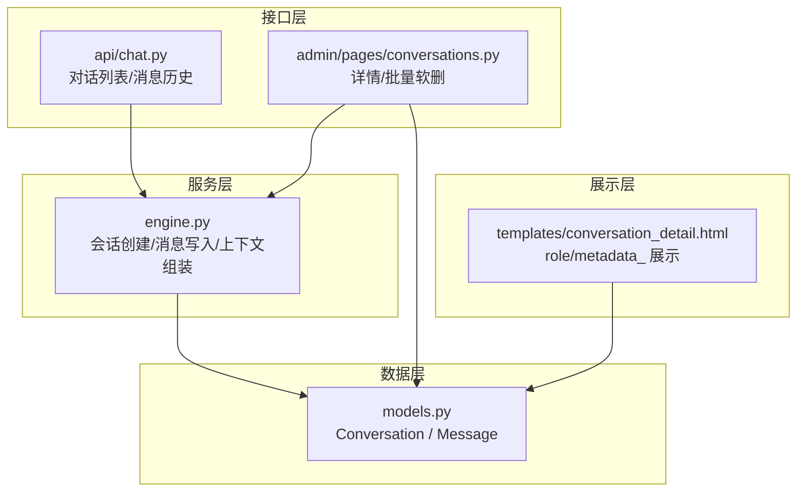
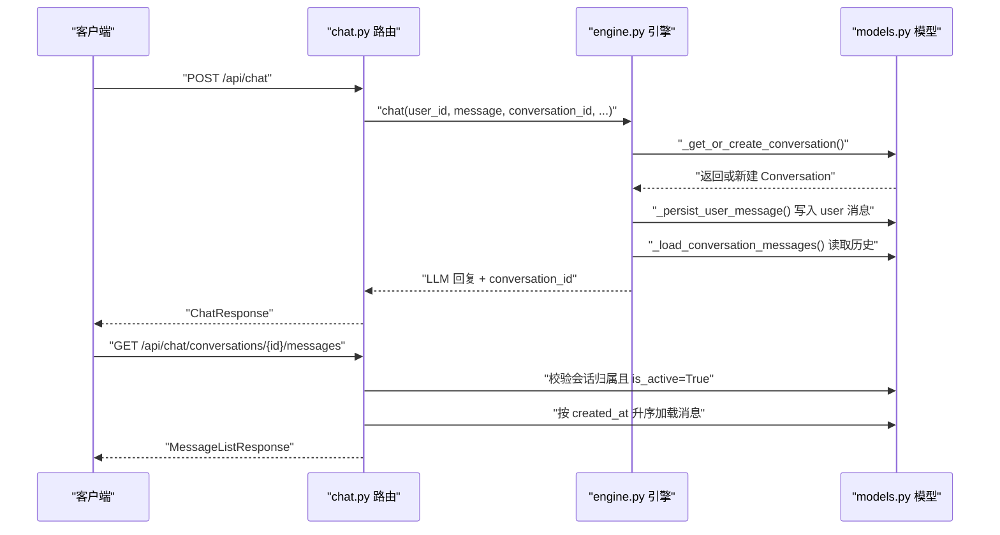
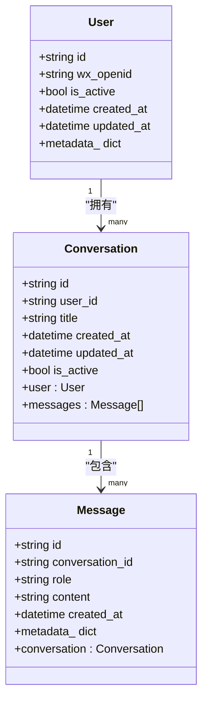
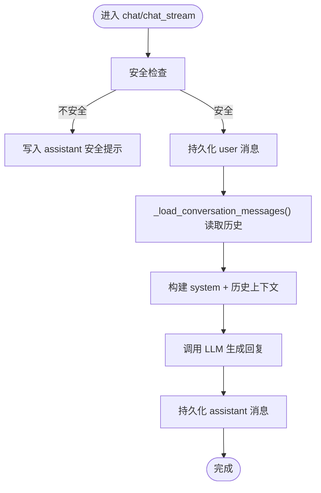
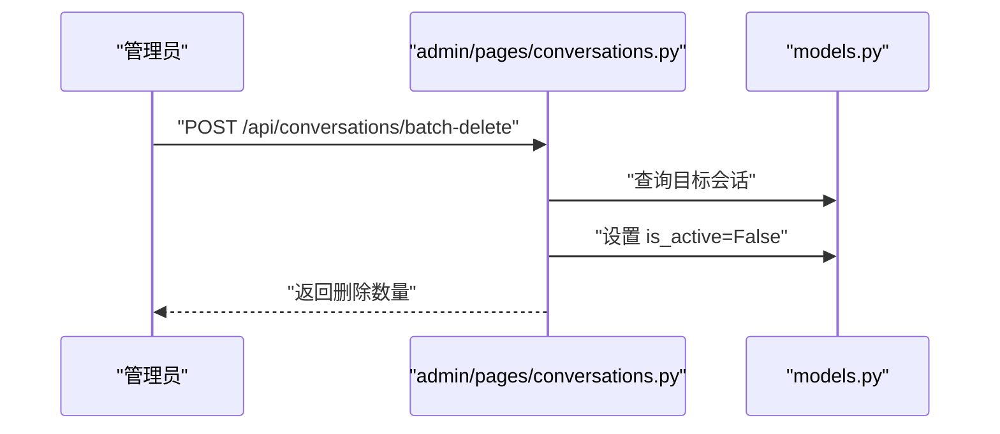
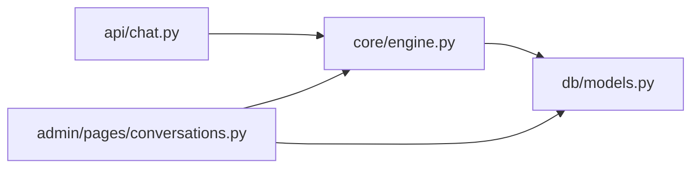

# 对话消息模型

<cite>
**本文引用的文件**
- [hushai/meditation/db/models.py](file://hushai/meditation/db/models.py)
- [hushai/meditation/api/chat.py](file://hushai/meditation/api/chat.py)
- [hushai/meditation/core/engine.py](file://hushai/meditation/core/engine.py)
- [hushai/meditation/admin/pages/conversations.py](file://hushai/meditation/admin/pages/conversations.py)
- [hushai/meditation/admin/templates/conversation_detail.html](file://hushai/meditation/admin/templates/conversation_detail.html)
</cite>

## 目录
1. [简介](#简介)
2. [项目结构](#项目结构)
3. [核心实体与关系](#核心实体与关系)
4. [架构总览](#架构总览)
5. [详细组件分析](#详细组件分析)
6. [依赖关系分析](#依赖关系分析)
7. [性能与查询优化](#性能与查询优化)
8. [故障排查指南](#故障排查指南)
9. [结论](#结论)

## 简介
本文件面向 hush.ai 的对话系统，聚焦于 Conversation（对话会话）与 Message（消息）两个核心实体的数据模型设计、关系映射、角色体系、元数据扩展、时间戳与软删除机制，并结合现有 API 与引擎实现，给出对话历史查询与分页加载的最佳实践建议。

## 项目结构
与对话消息模型直接相关的代码主要分布在以下位置：
- 数据模型定义：hushai/meditation/db/models.py
- 对外 API 路由：hushai/meditation/api/chat.py
- 对话引擎编排：hushai/meditation/core/engine.py
- 管理后台对话详情与批量软删：hushai/meditation/admin/pages/conversations.py
- 管理后台模板渲染（展示 role 与 metadata_）：hushai/meditation/admin/templates/conversation_detail.html

图表来源
- [hushai/meditation/db/models.py:69-95](file://hushai/meditation/db/models.py#L69-L95)
- [hushai/meditation/api/chat.py:155-244](file://hushai/meditation/api/chat.py#L155-L244)
- [hushai/meditation/core/engine.py:38-75](file://hushai/meditation/core/engine.py#L38-L75)
- [hushai/meditation/admin/pages/conversations.py:73-138](file://hushai/meditation/admin/pages/conversations.py#L73-L138)
- [hushai/meditation/admin/templates/conversation_detail.html:41-81](file://hushai/meditation/admin/templates/conversation_detail.html#L41-L81)

章节来源
- [hushai/meditation/db/models.py:69-95](file://hushai/meditation/db/models.py#L69-L95)
- [hushai/meditation/api/chat.py:155-244](file://hushai/meditation/api/chat.py#L155-L244)
- [hushai/meditation/core/engine.py:38-75](file://hushai/meditation/core/engine.py#L38-L75)
- [hushai/meditation/admin/pages/conversations.py:73-138](file://hushai/meditation/admin/pages/conversations.py#L73-L138)
- [hushai/meditation/admin/templates/conversation_detail.html:41-81](file://hushai/meditation/admin/templates/conversation_detail.html#L41-L81)

## 核心实体与关系
- Conversation（对话会话）
  - 主键 id：字符串 UUID
  - user_id：外键指向 users.id，建立“用户-会话”的一对多关系
  - title：可选标题
  - created_at / updated_at：带时区的时间戳
  - is_active：软删除标记（True 表示有效）
  - 关系：user（反向），messages（一对多）

- Message（消息）
  - 主键 id：字符串 UUID
  - conversation_id：外键指向 conversations.id，建立“会话-消息”的一对多关系
  - role：消息角色（如 user、assistant、system 等）
  - content：消息正文
  - created_at：带时区的时间戳
  - metadata_：JSON 字段，用于存储扩展信息（如消息类型、情感分析结果等）
  - 关系：conversation（反向）

一对一与多对一关系说明
- User 与 Conversation：一对多（一个用户拥有多个会话）
- Conversation 与 Message：一对多（一个会话包含多条消息）
- 外键约束
  - Conversation.user_id → users.id
  - Message.conversation_id → conversations.id

角色系统（role 字段）
- 常见取值：user（用户）、assistant（AI 助手）、system（系统提示）
- 在引擎中，system 用于注入系统提示；user/assistant 用于对话轮次
- 管理后台模板根据 role 区分显示头像与标签

时间戳与软删除
- 所有时间字段均带时区，默认使用 UTC 当前时间
- Conversation.is_active 作为软删除标志，API 与管理后台在查询/操作时遵循该标志

JSON metadata 字段
- Message.metadata_ 为 JSON 类型，可用于记录消息类型、情感分析结果、来源渠道、安全策略命中信息等扩展数据
- 管理后台模板支持展开查看 metadata_

章节来源
- [hushai/meditation/db/models.py:69-95](file://hushai/meditation/db/models.py#L69-L95)
- [hushai/meditation/admin/templates/conversation_detail.html:41-81](file://hushai/meditation/admin/templates/conversation_detail.html#L41-L81)

## 架构总览
下图展示了从 API 到数据库的调用链路与关键交互点，包括会话创建、消息写入、历史加载与软删除控制。

图表来源
- [hushai/meditation/api/chat.py:58-77](file://hushai/meditation/api/chat.py#L58-L77)
- [hushai/meditation/core/engine.py:38-75](file://hushai/meditation/core/engine.py#L38-L75)
- [hushai/meditation/core/engine.py:156-163](file://hushai/meditation/core/engine.py#L156-L163)
- [hushai/meditation/api/chat.py:205-244](file://hushai/meditation/api/chat.py#L205-L244)

## 详细组件分析

### 实体类图（Conversation / Message）

图表来源
- [hushai/meditation/db/models.py:37-82](file://hushai/meditation/db/models.py#L37-L82)
- [hushai/meditation/db/models.py:85-95](file://hushai/meditation/db/models.py#L85-L95)

章节来源
- [hushai/meditation/db/models.py:37-95](file://hushai/meditation/db/models.py#L37-L95)

### 角色系统与消息写入流程
- 角色约定
  - system：系统提示，由引擎构造并注入 LLM 上下文
  - user：用户输入
  - assistant：AI 助手回复
- 写入时机
  - 用户消息：在调用 LLM 前持久化
  - 助手消息：在 LLM 返回后持久化
  - 安全检查失败时，仅写入 assistant 的安全提示消息
- 历史加载
  - 按 created_at 升序加载，必要时限制最大轮次

图表来源
- [hushai/meditation/core/engine.py:166-235](file://hushai/meditation/core/engine.py#L166-L235)
- [hushai/meditation/core/engine.py:238-313](file://hushai/meditation/core/engine.py#L238-L313)
- [hushai/meditation/core/engine.py:59-75](file://hushai/meditation/core/engine.py#L59-L75)
- [hushai/meditation/core/engine.py:156-163](file://hushai/meditation/core/engine.py#L156-L163)

章节来源
- [hushai/meditation/core/engine.py:166-235](file://hushai/meditation/core/engine.py#L166-L235)
- [hushai/meditation/core/engine.py:238-313](file://hushai/meditation/core/engine.py#L238-L313)
- [hushai/meditation/core/engine.py:59-75](file://hushai/meditation/core/engine.py#L59-L75)
- [hushai/meditation/core/engine.py:156-163](file://hushai/meditation/core/engine.py#L156-L163)

### 软删除与权限控制
- 软删除
  - 通过 Conversation.is_active 控制会话有效性
  - 管理后台提供批量软删除接口，将 is_active 置为 False
- 权限控制
  - 获取消息历史时需校验会话归属（user_id）且 is_active=True
  - 未找到或已软删除则返回 404

图表来源
- [hushai/meditation/admin/pages/conversations.py:117-138](file://hushai/meditation/admin/pages/conversations.py#L117-L138)

章节来源
- [hushai/meditation/admin/pages/conversations.py:117-138](file://hushai/meditation/admin/pages/conversations.py#L117-L138)
- [hushai/meditation/api/chat.py:205-244](file://hushai/meditation/api/chat.py#L205-L244)

### 元数据字段 metadata_ 的使用场景
- 用途示例
  - 消息类型：如富文本、图片、卡片等
  - 情感分析结果：正/负/中性及置信度
  - 来源渠道：Web、小程序、第三方集成
  - 安全策略命中：触发规则 ID、处置动作
- 展示方式
  - 管理后台模板支持以折叠面板形式展示 metadata_

章节来源
- [hushai/meditation/db/models.py:85-95](file://hushai/meditation/db/models.py#L85-L95)
- [hushai/meditation/admin/templates/conversation_detail.html:41-81](file://hushai/meditation/admin/templates/conversation_detail.html#L41-L81)

## 依赖关系分析
- 模块耦合
  - api/chat.py 依赖 engine.py 提供的对话能力
  - engine.py 依赖 models.py 进行数据存取
  - admin/pages/conversations.py 直接操作 models.py 进行详情查询与批量软删
- 外部依赖
  - SQLAlchemy ORM 与异步会话工厂
  - FastAPI 路由与响应模型

图表来源
- [hushai/meditation/api/chat.py:1-27](file://hushai/meditation/api/chat.py#L1-L27)
- [hushai/meditation/core/engine.py:1-31](file://hushai/meditation/core/engine.py#L1-L31)
- [hushai/meditation/admin/pages/conversations.py:73-114](file://hushai/meditation/admin/pages/conversations.py#L73-L114)

章节来源
- [hushai/meditation/api/chat.py:1-27](file://hushai/meditation/api/chat.py#L1-L27)
- [hushai/meditation/core/engine.py:1-31](file://hushai/meditation/core/engine.py#L1-L31)
- [hushai/meditation/admin/pages/conversations.py:73-114](file://hushai/meditation/admin/pages/conversations.py#L73-L114)

## 性能与查询优化
- 索引与排序
  - Message.conversation_id 已建索引，利于按会话快速检索
  - 消息历史按 created_at 升序加载，建议在数据库层确保该列有合适索引
- 历史加载上限
  - 引擎侧可按配置限制最大轮次（conversation_max_turns），避免长对话导致上下文过大
- 分页与增量加载
  - 对话列表接口已支持 limit/offset 分页
  - 消息历史接口当前返回全部消息，建议前端基于 created_at 做游标分页（例如 last_created_at + limit），以减少一次性传输量
- 软删除过滤
  - 会话列表与详情均需过滤 is_active=True，避免无效数据参与计算与展示
- 元数据查询
  - 若需按 metadata_ 中的特定键值筛选，可在应用层先拉取再过滤，或在数据库层增加表达式索引（视具体需求评估）

章节来源
- [hushai/meditation/core/engine.py:59-75](file://hushai/meditation/core/engine.py#L59-L75)
- [hushai/meditation/api/chat.py:155-190](file://hushai/meditation/api/chat.py#L155-L190)
- [hushai/meditation/api/chat.py:205-244](file://hushai/meditation/api/chat.py#L205-L244)

## 故障排查指南
- 404 错误（对话不存在）
  - 可能原因：会话不存在、非当前用户、会话已被软删除
  - 定位方法：检查 API 中对 Conversation.user_id 与 is_active 的过滤条件
- 消息缺失或顺序异常
  - 可能原因：未按 created_at 排序、并发写入导致时序问题
  - 定位方法：核对 _load_conversation_messages 的排序与限流逻辑
- 元数据显示为空
  - 可能原因：写入时未填充 metadata_
  - 定位方法：确认业务逻辑在保存消息时是否设置 metadata_

章节来源
- [hushai/meditation/api/chat.py:205-244](file://hushai/meditation/api/chat.py#L205-L244)
- [hushai/meditation/core/engine.py:59-75](file://hushai/meditation/core/engine.py#L59-L75)

## 结论
Conversation 与 Message 模型采用清晰的一对多关系与外键约束，结合 is_active 软删除与带时区时间戳，满足对话会话管理与消息历史记录的核心需求。role 字段支撑用户、AI 助手与系统提示的角色体系，metadata_ 提供灵活的扩展空间。结合现有 API 与引擎实现，建议在消息历史加载上引入游标分页，并在数据库层完善相关索引，以提升大规模对话场景下的查询性能与用户体验。