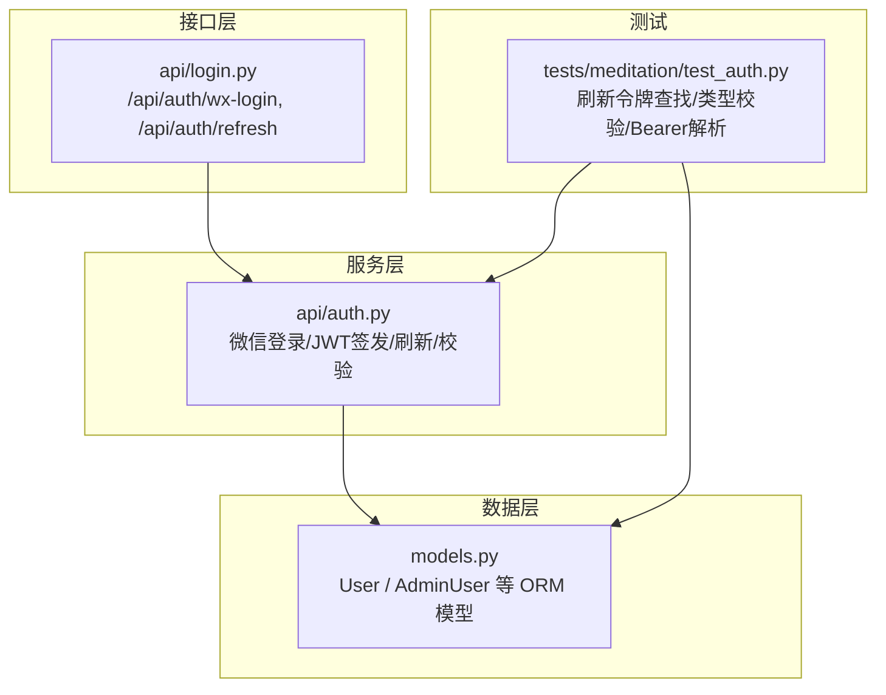
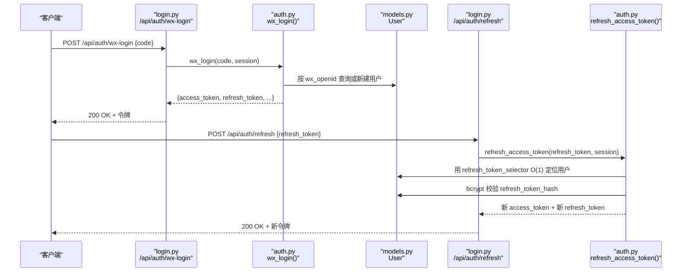
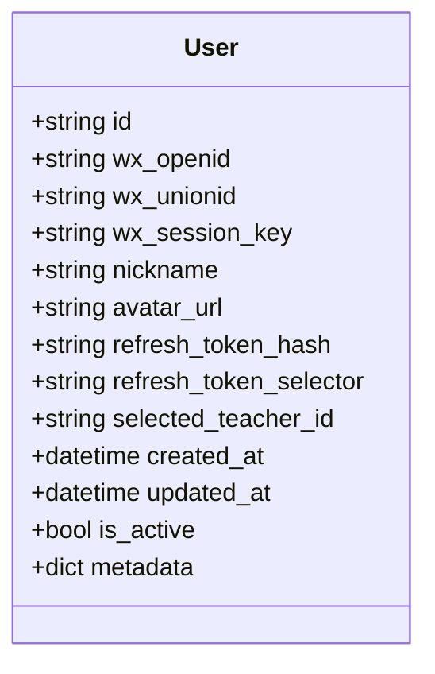
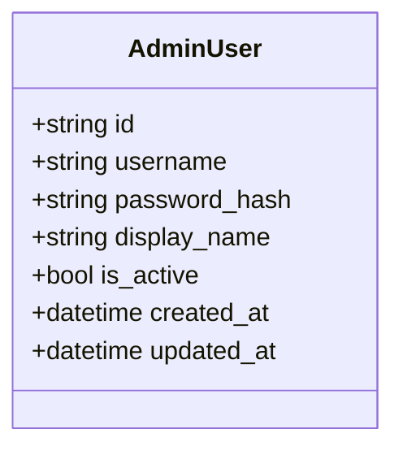
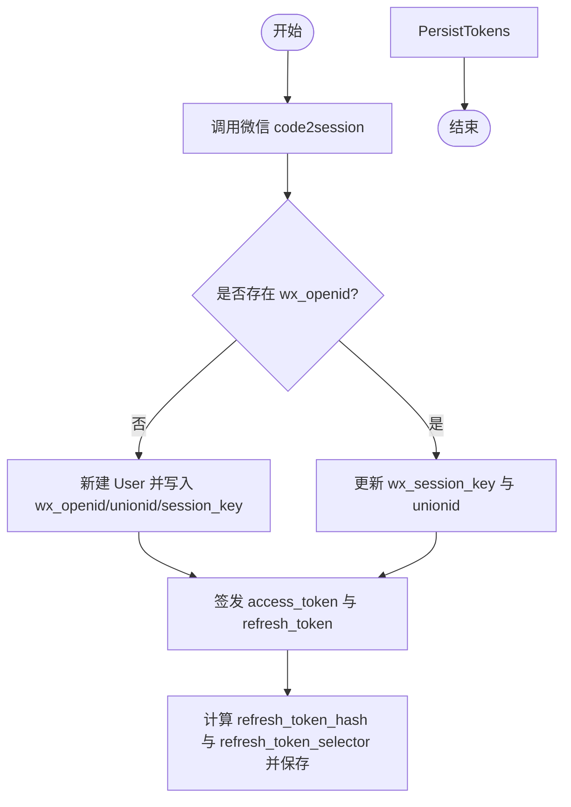
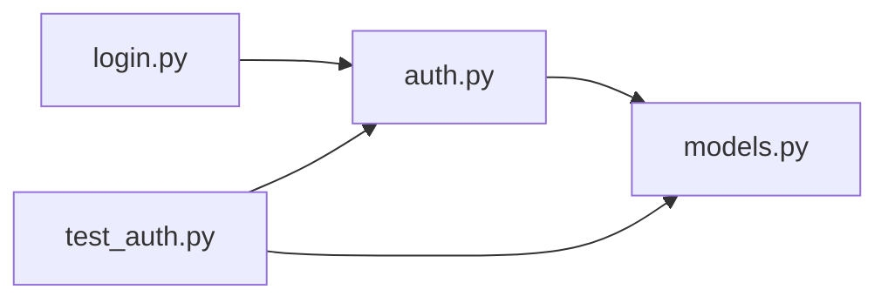

# 用户认证模型

<cite>
**本文引用的文件**   
- [hushai/meditation/db/models.py](file://hushai/meditation/db/models.py)
- [hushai/meditation/api/auth.py](file://hushai/meditation/api/auth.py)
- [hushai/meditation/api/login.py](file://hushai/meditation/api/login.py)
- [tests/meditation/test_auth.py](file://tests/meditation/test_auth.py)
</cite>

## 目录
1. [简介](#简介)
2. [项目结构](#项目结构)
3. [核心组件](#核心组件)
4. [架构总览](#架构总览)
5. [详细组件分析](#详细组件分析)
6. [依赖关系分析](#依赖关系分析)
7. [性能与安全考量](#性能与安全考量)
8. [故障排查指南](#故障排查指南)
9. [结论](#结论)
10. [附录：字段定义与约束](#附录字段定义与约束)

## 简介
本文件面向 hush.ai 的用户认证系统，聚焦于两个核心实体 User 与 AdminUser 的模型设计、微信登录相关字段、JWT Token 管理（含 refresh_token_hash 与 refresh_token_selector）的安全策略、角色权限差异、UUID 主键与时间戳自动管理机制，以及 is_active 状态与 metadata 元数据的设计考虑。文档同时提供数据访问模式与最佳实践建议，帮助开发者在实现认证与鉴权时遵循一致规范。

## 项目结构
与认证模型直接相关的代码主要位于以下位置：
- 数据模型定义：hushai/meditation/db/models.py
- 认证逻辑与 JWT 签发/刷新：hushai/meditation/api/auth.py
- 登录路由入口（微信登录、刷新令牌）：hushai/meditation/api/login.py
- 认证行为测试用例：tests/meditation/test_auth.py

图表来源
- [hushai/meditation/db/models.py:37-66](file://hushai/meditation/db/models.py#L37-L66)
- [hushai/meditation/api/auth.py:63-106](file://hushai/meditation/api/auth.py#L63-L106)
- [hushai/meditation/api/login.py:21-52](file://hushai/meditation/api/login.py#L21-L52)
- [tests/meditation/test_auth.py:82-118](file://tests/meditation/test_auth.py#L82-L118)

章节来源
- [hushai/meditation/db/models.py:37-66](file://hushai/meditation/db/models.py#L37-L66)
- [hushai/meditation/api/auth.py:63-106](file://hushai/meditation/api/auth.py#L63-L106)
- [hushai/meditation/api/login.py:21-52](file://hushai/meditation/api/login.py#L21-L52)
- [tests/meditation/test_auth.py:82-118](file://tests/meditation/test_auth.py#L82-L118)

## 核心组件
- User：普通用户实体，承载微信标识、头像昵称、选择导师、活跃状态、元数据及认证相关字段（refresh_token_hash、refresh_token_selector）。
- AdminUser：管理后台管理员实体，独立于普通用户体系，用于后台登录与审计。

章节来源
- [hushai/meditation/db/models.py:37-66](file://hushai/meditation/db/models.py#L37-L66)
- [hushai/meditation/db/models.py:172-185](file://hushai/meditation/db/models.py#L172-L185)

## 架构总览
下图展示了从微信登录到返回 JWT，再到刷新 access token 的整体流程，以及与数据库模型的交互。

图表来源
- [hushai/meditation/api/login.py:21-52](file://hushai/meditation/api/login.py#L21-L52)
- [hushai/meditation/api/auth.py:63-106](file://hushai/meditation/api/auth.py#L63-L106)
- [hushai/meditation/api/auth.py:134-164](file://hushai/meditation/api/auth.py#L134-L164)
- [hushai/meditation/db/models.py:37-66](file://hushai/meditation/db/models.py#L37-L66)

## 详细组件分析

### User 实体设计
- 主键与唯一性
  - id：字符串型 UUID（长度 36），默认由 _uuid() 生成，作为全局唯一主键。
  - wx_openid：可选，唯一且带索引，用于微信账号识别与快速检索。
- 微信登录相关字段
  - wx_unionid：可选，跨应用统一标识，便于多端合并用户。
  - wx_session_key：可选，会话密钥，按需更新。
- 认证与令牌安全
  - refresh_token_hash：存储 refresh token 的 bcrypt 哈希，仅用于最终校验，避免明文泄露。
  - refresh_token_selector：存储 refresh token 的 SHA-256 hex，唯一且带索引，用于 O(1) 定位持有该 token 的用户，再结合 bcrypt 做最终校验，防止全表扫描导致的 DoS 风险。
- 业务属性
  - nickname、avatar_url：用户展示信息。
  - selected_teacher_id：外键关联导师，支持个性化引导。
- 状态与元数据
  - is_active：布尔型，默认启用；在获取当前用户与刷新令牌时均会检查是否启用。
  - metadata_（映射为 JSON 列 metadata）：灵活扩展字段，适合存放非结构化偏好、配置等。
- 时间戳
  - created_at：创建时间，UTC 时区，默认当前时间。
  - updated_at：更新时间，UTC 时区，默认当前时间并在更新时自动刷新。

图表来源
- [hushai/meditation/db/models.py:37-66](file://hushai/meditation/db/models.py#L37-L66)

章节来源
- [hushai/meditation/db/models.py:37-66](file://hushai/meditation/db/models.py#L37-L66)

### AdminUser 实体设计
- 主键与唯一性
  - id：字符串型 UUID（长度 36），默认由 _uuid() 生成。
  - username：唯一且带索引，用于后台登录名。
- 密码与状态
  - password_hash：存储管理员密码哈希。
  - is_active：布尔型，默认启用；后台登录与统计中会检查是否启用。
- 时间戳
  - created_at、updated_at：UTC 时区，默认当前时间，更新时自动刷新。

图表来源
- [hushai/meditation/db/models.py:172-185](file://hushai/meditation/db/models.py#L172-L185)

章节来源
- [hushai/meditation/db/models.py:172-185](file://hushai/meditation/db/models.py#L172-L185)

### 微信登录流程与数据写入
- 通过 code 调用微信接口换取 openid、session_key、unionid。
- 若不存在对应 wx_openid 则新建用户并写入微信标识；若存在则更新 session_key 与 unionid。
- 签发 access_token 与 refresh_token，并将 refresh_token 的哈希与 selector 持久化至 User。

图表来源
- [hushai/meditation/api/auth.py:63-106](file://hushai/meditation/api/auth.py#L63-L106)
- [hushai/meditation/db/models.py:37-66](file://hushai/meditation/db/models.py#L37-L66)

章节来源
- [hushai/meditation/api/auth.py:63-106](file://hushai/meditation/api/auth.py#L63-L106)

### JWT Token 管理与安全策略
- Access Token
  - 载荷包含 sub（用户 ID）、exp、iat、type（固定为 access）。
  - verify_token 强制校验 type 必须为 access，防止未来引入 refresh JWT 时的类型混淆。
- Refresh Token
  - 使用高熵随机值生成，服务端不缓存，仅存储其哈希与 selector。
  - 刷新流程：
    - 先以 refresh_token_selector 进行 O(1) 定位用户（unique+index）。
    - 再用 bcrypt 校验原 refresh_token 与 stored hash 是否匹配。
    - 成功后签发新的 access_token 与新的 refresh_token，并覆盖旧哈希与 selector。
- Bearer 提取
  - extract_bearer_token 兼容 Authorization 头中包含或不包含 "Bearer " 前缀的情况。

```mermaid
sequenceDiagram
participant C as "客户端"
participant R as "refresh_access_token()"
participant DB as "User"
C->>R : 提交 refresh_token
R->>R : 计算 selector = SHA-256(refresh_token)
R->>DB : SELECT by refresh_token_selector (O(1))
DB-->>R : 命中用户可能为空
alt 未命中或无哈希
R-->>C : 无效或已过期
else 命中
R->>R : bcrypt.checkpw(refresh_token, refresh_token_hash)
alt 校验失败
R-->>C : 无效或已过期
else 校验成功
R->>DB : 生成新 refresh_token 并更新哈希与 selector
R-->>C : 返回新 access_token 与新 refresh_token
end
end
```

图表来源
- [hushai/meditation/api/auth.py:134-164](file://hushai/meditation/api/auth.py#L134-L164)
- [hushai/meditation/db/models.py:46-51](file://hushai/meditation/db/models.py#L46-L51)

章节来源
- [hushai/meditation/api/auth.py:109-164](file://hushai/meditation/api/auth.py#L109-L164)
- [tests/meditation/test_auth.py:82-118](file://tests/meditation/test_auth.py#L82-L118)

### 用户角色与权限差异
- 普通用户（User）
  - 通过微信登录获得 access_token 与 refresh_token。
  - 受 is_active 控制是否可用；get_current_user_id 在验证 access_token 后还会检查 is_active。
- 管理员（AdminUser）
  - 独立的后台账户体系，使用 username/password_hash 登录。
  - 同样受 is_active 控制；后台页面与统计中广泛使用该字段过滤有效管理员。

章节来源
- [hushai/meditation/api/auth.py:121-131](file://hushai/meditation/api/auth.py#L121-L131)
- [hushai/meditation/db/models.py:172-185](file://hushai/meditation/db/models.py#L172-L185)

### UUID 主键设计与时间戳自动管理
- UUID 主键
  - 所有实体的 id 均为 String(36)，默认由 _uuid() 生成，保证分布式环境下的唯一性与不可预测性。
- 时间戳
  - created_at：默认 UTC 当前时间。
  - updated_at：默认 UTC 当前时间，并在记录更新时自动刷新。
  - 这些机制减少应用层手动维护时间戳的负担，并确保一致性。

章节来源
- [hushai/meditation/db/models.py:29-35](file://hushai/meditation/db/models.py#L29-L35)
- [hushai/meditation/db/models.py:55-58](file://hushai/meditation/db/models.py#L55-L58)

### 用户状态管理（is_active）与元数据存储（metadata）
- is_active
  - 在获取当前用户与刷新令牌时均会检查 is_active=True，确保禁用用户无法继续访问。
- metadata（JSON）
  - 提供灵活的扩展点，可存储用户偏好、功能开关、第三方绑定信息等非结构化数据。
  - 注意对敏感信息进行加密后再存入 JSON，避免明文暴露。

章节来源
- [hushai/meditation/api/auth.py:121-131](file://hushai/meditation/api/auth.py#L121-L131)
- [hushai/meditation/db/models.py:59-60](file://hushai/meditation/db/models.py#L59-L60)

## 依赖关系分析
- API 层依赖认证服务：login.py 中的路由调用 auth.py 的 wx_login 与 refresh_access_token。
- 认证服务依赖数据模型：auth.py 通过 SQLAlchemy 查询 User 模型，读写微信标识与令牌安全字段。
- 测试驱动验证：test_auth.py 覆盖了刷新令牌的 O(1) 查找、类型校验与 Bearer 解析等行为。

图表来源
- [hushai/meditation/api/login.py:21-52](file://hushai/meditation/api/login.py#L21-L52)
- [hushai/meditation/api/auth.py:63-106](file://hushai/meditation/api/auth.py#L63-L106)
- [hushai/meditation/db/models.py:37-66](file://hushai/meditation/db/models.py#L37-L66)
- [tests/meditation/test_auth.py:82-118](file://tests/meditation/test_auth.py#L82-L118)

章节来源
- [hushai/meditation/api/login.py:21-52](file://hushai/meditation/api/login.py#L21-L52)
- [hushai/meditation/api/auth.py:63-106](file://hushai/meditation/api/auth.py#L63-L106)
- [hushai/meditation/db/models.py:37-66](file://hushai/meditation/db/models.py#L37-L66)
- [tests/meditation/test_auth.py:82-118](file://tests/meditation/test_auth.py#L82-L118)

## 性能与安全考量
- 性能
  - refresh_token_selector 使用 unique+index 实现 O(1) 定位用户，避免全表扫描。
  - bcrypt 校验仅在命中行执行，降低 CPU 开销与 DoS 风险。
- 安全
  - refresh_token 仅存储 bcrypt 哈希，不存储明文。
  - refresh_token_selector 仅为 SHA-256 hex，非密钥，不能反推原始 token。
  - Access Token 强制 type=access，防止类型混淆攻击。
  - is_active 双重保护：Access Token 校验后仍需用户处于启用状态。
  - 时间戳使用 UTC，避免时区不一致导致的问题。

[本节为通用指导，无需列出具体文件来源]

## 故障排查指南
- 微信登录失败
  - 现象：返回错误码或提示未获取到 openid。
  - 排查：确认 appid/secret 配置正确、网络可达微信接口、code 未被重复使用。
- Refresh Token 无效或已过期
  - 现象：刷新接口返回“无效或已过期”。
  - 排查：确认 selector 能命中用户、bcrypt 校验通过、用户 is_active=True。
- Token 类型错误
  - 现象：verify_token 抛出类型错误。
  - 排查：确保 access token 载荷包含 type=access。
- Bearer 解析异常
  - 现象：Authorization 头格式不正确。
  - 排查：确认携带 "Bearer <token>" 或直接传入 token 字符串（extract_bearer_token 兼容两种形式）。

章节来源
- [hushai/meditation/api/auth.py:63-106](file://hushai/meditation/api/auth.py#L63-L106)
- [hushai/meditation/api/auth.py:109-164](file://hushai/meditation/api/auth.py#L109-L164)
- [tests/meditation/test_auth.py:49-78](file://tests/meditation/test_auth.py#L49-L78)
- [tests/meditation/test_auth.py:139-141](file://tests/meditation/test_auth.py#L139-L141)

## 结论
User 与 AdminUser 两个实体分别支撑了前台用户与后台管理员的认证需求。User 的微信登录字段与 JWT 管理策略在保证安全性的同时兼顾性能：通过 refresh_token_selector 实现 O(1) 定位，再通过 bcrypt 完成最终校验；Access Token 强制类型校验避免混淆。UUID 主键与 UTC 时间戳自动管理提升了可扩展性与一致性。is_active 与 metadata 提供了灵活的状态控制与扩展能力。建议在实际开发中严格遵循上述数据访问模式与安全实践，确保认证系统的稳健与可维护性。

[本节为总结性内容，无需列出具体文件来源]

## 附录：字段定义与约束
以下为关键字段的类型、约束与业务规则摘要（基于源码定义与注释）：

- User.id
  - 类型：String(36)
  - 约束：主键，默认 _uuid()
  - 说明：分布式唯一标识
- User.wx_openid
  - 类型：String(128)
  - 约束：唯一、索引
  - 说明：微信唯一标识，用于登录与检索
- User.wx_unionid
  - 类型：String(128)
  - 约束：可选
  - 说明：跨应用统一标识
- User.wx_session_key
  - 类型：String(256)
  - 约束：可选
  - 说明：会话密钥，按需更新
- User.refresh_token_hash
  - 类型：String(256)
  - 约束：索引
  - 说明：bcrypt 哈希，用于最终校验
- User.refresh_token_selector
  - 类型：String(64)
  - 约束：唯一、索引
  - 说明：SHA-256 hex，用于 O(1) 定位用户
- User.nickname/avatar_url
  - 类型：String(128)/String(512)
  - 约束：可选
  - 说明：用户展示信息
- User.selected_teacher_id
  - 类型：String(36)
  - 约束：外键指向 teachers.id
  - 说明：选择的导师
- User.created_at/updated_at
  - 类型：DateTime(timezone=True)
  - 约束：默认 UTC 当前时间，updated_at 更新时自动刷新
- User.is_active
  - 类型：Boolean
  - 约束：默认 True
  - 说明：用户启用状态
- User.metadata（JSON）
  - 类型：JSON
  - 约束：可选
  - 说明：灵活扩展字段

- AdminUser.id
  - 类型：String(36)
  - 约束：主键，默认 _uuid()
- AdminUser.username
  - 类型：String(64)
  - 约束：唯一、索引
  - 说明：后台登录名
- AdminUser.password_hash
  - 类型：String(256)
  - 约束：必填
  - 说明：管理员密码哈希
- AdminUser.display_name
  - 类型：String(128)
  - 约束：可选
  - 说明：显示名称
- AdminUser.is_active
  - 类型：Boolean
  - 约束：默认 True
  - 说明：管理员启用状态
- AdminUser.created_at/updated_at
  - 类型：DateTime(timezone=True)
  - 约束：默认 UTC 当前时间，updated_at 更新时自动刷新

章节来源
- [hushai/meditation/db/models.py:37-66](file://hushai/meditation/db/models.py#L37-L66)
- [hushai/meditation/db/models.py:172-185](file://hushai/meditation/db/models.py#L172-L185)