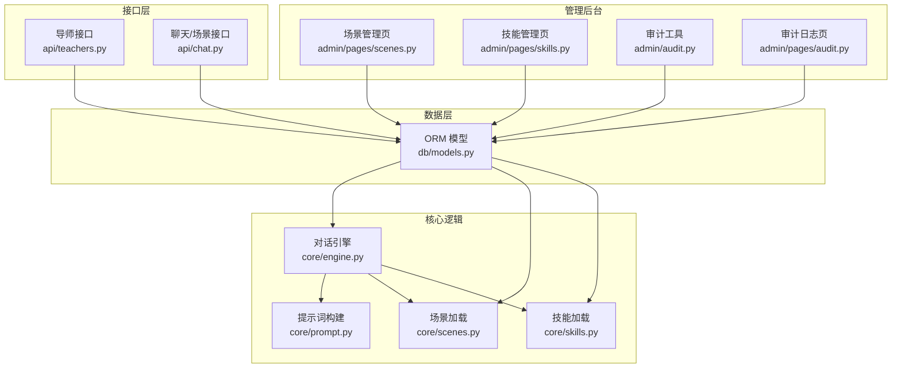
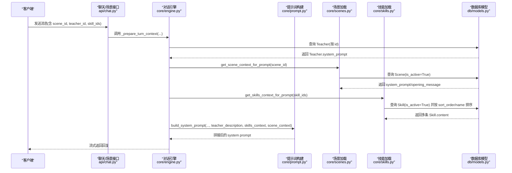
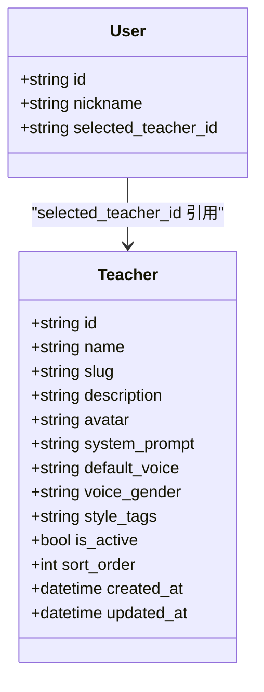
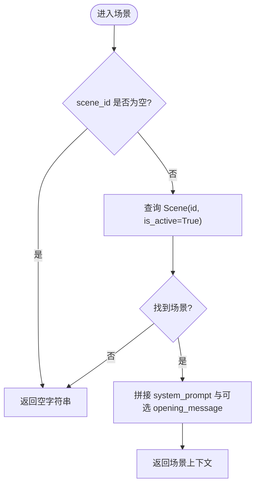
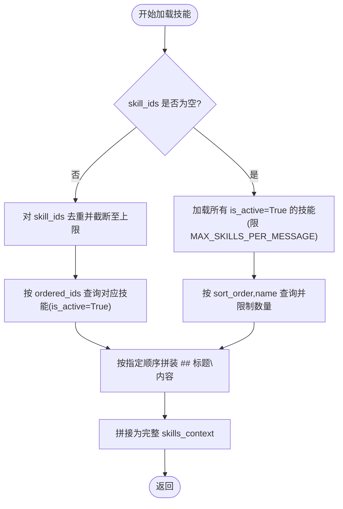
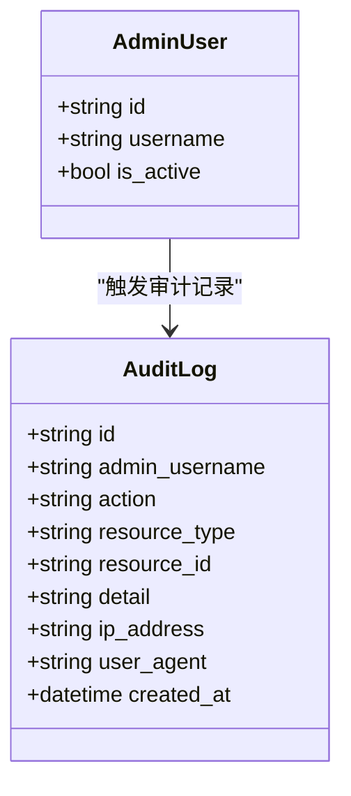
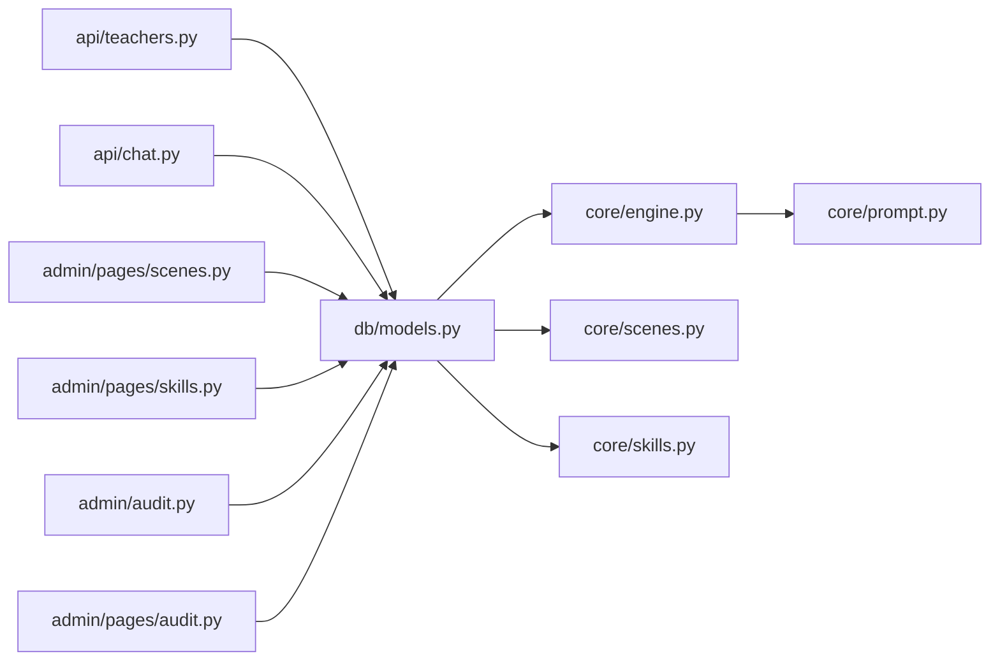

# 系统配置模型

<cite>
**本文引用的文件列表**
- [hushai/meditation/db/models.py](file://hushai/meditation/db/models.py)
- [hushai/meditation/schemas.py](file://hushai/meditation/schemas.py)
- [hushai/meditation/core/engine.py](file://hushai/meditation/core/engine.py)
- [hushai/meditation/core/prompt.py](file://hushai/meditation/core/prompt.py)
- [hushai/meditation/core/scenes.py](file://hushai/meditation/core/scenes.py)
- [hushai/meditation/core/skills.py](file://hushai/meditation/core/skills.py)
- [hushai/meditation/api/teachers.py](file://hushai/meditation/api/teachers.py)
- [hushai/meditation/api/chat.py](file://hushai/meditation/api/chat.py)
- [hushai/meditation/admin/pages/scenes.py](file://hushai/meditation/admin/pages/scenes.py)
- [hushai/meditation/admin/pages/skills.py](file://hushai/meditation/admin/pages/skills.py)
- [hushai/meditation/admin/audit.py](file://hushai/meditation/admin/audit.py)
- [hushai/meditation/admin/pages/audit.py](file://hushai/meditation/admin/pages/audit.py)
</cite>

## 目录
1. [引言](#引言)
2. [项目结构](#项目结构)
3. [核心组件](#核心组件)
4. [架构总览](#架构总览)
5. [详细组件分析](#详细组件分析)
6. [依赖关系分析](#依赖关系分析)
7. [性能与排序机制](#性能与排序机制)
8. [故障排查指南](#故障排查指南)
9. [结论](#结论)
10. [附录：开发者最佳实践](#附录开发者最佳实践)

## 引言
本文件围绕 hush.ai 的系统配置与功能模块，聚焦以下实体与机制：
- Teacher（导师）：多导师风格化配置，支持 system_prompt、voice 等个性化参数。
- Scene（场景）：冥想场景管理，支持不同应用场景的提示词与开场白。
- Skill（技能）：可插拔的技能片段，动态注入系统提示，实现能力扩展。
- AuditLog（审计日志）：管理员操作审计记录，用于安全审计与追溯。
并解释 sort_order 与 is_active 的管理模式，以及系统配置管理与功能开关控制的技术实现与最佳实践。

## 项目结构
与系统配置相关的代码主要分布在如下位置：
- ORM 模型定义：hushai/meditation/db/models.py
- 请求/响应 Schema：hushai/meditation/schemas.py
- 运行时上下文组装：hushai/meditation/core/engine.py、prompt.py、scenes.py、skills.py
- 对外 API：hushai/meditation/api/teachers.py、api/chat.py
- 后台管理页面与工具：admin/pages/*.py、admin/audit.py

图表来源
- [hushai/meditation/db/models.py:120-201](file://hushai/meditation/db/models.py#L120-L201)
- [hushai/meditation/core/engine.py:78-127](file://hushai/meditation/core/engine.py#L78-L127)
- [hushai/meditation/core/prompt.py:77-103](file://hushai/meditation/core/prompt.py#L77-L103)
- [hushai/meditation/core/scenes.py:11-29](file://hushai/meditation/core/scenes.py#L11-L29)
- [hushai/meditation/core/skills.py:14-58](file://hushai/meditation/core/skills.py#L14-L58)
- [hushai/meditation/api/teachers.py:58-138](file://hushai/meditation/api/teachers.py#L58-L138)
- [hushai/meditation/api/chat.py:130-152](file://hushai/meditation/api/chat.py#L130-L152)
- [hushai/meditation/admin/pages/scenes.py:76-132](file://hushai/meditation/admin/pages/scenes.py#L76-L132)
- [hushai/meditation/admin/pages/skills.py:198-217](file://hushai/meditation/admin/pages/skills.py#L198-L217)
- [hushai/meditation/admin/audit.py:10-31](file://hushai/meditation/admin/audit.py#L10-L31)
- [hushai/meditation/admin/pages/audit.py:16-71](file://hushai/meditation/admin/pages/audit.py#L16-L71)

章节来源
- [hushai/meditation/db/models.py:120-201](file://hushai/meditation/db/models.py#L120-L201)
- [hushai/meditation/core/engine.py:78-127](file://hushai/meditation/core/engine.py#L78-L127)
- [hushai/meditation/core/prompt.py:77-103](file://hushai/meditation/core/prompt.py#L77-L103)
- [hushai/meditation/core/scenes.py:11-29](file://hushai/meditation/core/scenes.py#L11-L29)
- [hushai/meditation/core/skills.py:14-58](file://hushai/meditation/core/skills.py#L14-L58)
- [hushai/meditation/api/teachers.py:58-138](file://hushai/meditation/api/teachers.py#L58-L138)
- [hushai/meditation/api/chat.py:130-152](file://hushai/meditation/api/chat.py#L130-L152)
- [hushai/meditation/admin/pages/scenes.py:76-132](file://hushai/meditation/admin/pages/scenes.py#L76-L132)
- [hushai/meditation/admin/pages/skills.py:198-217](file://hushai/meditation/admin/pages/skills.py#L198-L217)
- [hushai/meditation/admin/audit.py:10-31](file://hushai/meditation/admin/audit.py#L10-L31)
- [hushai/meditation/admin/pages/audit.py:16-71](file://hushai/meditation/admin/pages/audit.py#L16-L71)

## 核心组件
本节概述四大核心配置实体及其职责：
- Teacher：定义 AI 导师的风格与声音偏好，包含 system_prompt、default_voice、voice_gender、style_tags 等字段，并通过 is_active 和 sort_order 控制可见性与排序。
- Scene：定义冥想场景的引导策略与开场白，包含 system_prompt、opening_message，并以 is_active 与 sort_order 控制启用与展示顺序。
- Skill：定义可插拔的能力片段，content 作为系统提示的一部分被动态注入；通过 is_active 与 sort_order 控制是否参与及排序。
- AuditLog：记录管理员关键操作的审计信息，包括操作人、动作类型、资源标识、详情、IP 与 UA 等。

章节来源
- [hushai/meditation/db/models.py:120-134](file://hushai/meditation/db/models.py#L120-L134)
- [hushai/meditation/db/models.py:153-169](file://hushai/meditation/db/models.py#L153-L169)
- [hushai/meditation/db/models.py:188-201](file://hushai/meditation/db/models.py#L188-L201)
- [hushai/meditation/db/models.py:246-265](file://hushai/meditation/db/models.py#L246-L265)

## 架构总览
下图展示了从用户选择到最终生成系统提示的关键流程，体现 Teacher、Scene、Skill 如何组合为最终的 system prompt。

图表来源
- [hushai/meditation/api/chat.py:130-152](file://hushai/meditation/api/chat.py#L130-L152)
- [hushai/meditation/core/engine.py:78-127](file://hushai/meditation/core/engine.py#L78-L127)
- [hushai/meditation/core/prompt.py:77-103](file://hushai/meditation/core/prompt.py#L77-L103)
- [hushai/meditation/core/scenes.py:11-29](file://hushai/meditation/core/scenes.py#L11-L29)
- [hushai/meditation/core/skills.py:14-58](file://hushai/meditation/core/skills.py#L14-L58)
- [hushai/meditation/db/models.py:120-134](file://hushai/meditation/db/models.py#L120-L134)
- [hushai/meditation/db/models.py:153-169](file://hushai/meditation/db/models.py#L153-L169)
- [hushai/meditation/db/models.py:246-265](file://hushai/meditation/db/models.py#L246-L265)

## 详细组件分析

### Teacher（导师）实体与多导师系统
- 设计要点
  - 每个导师拥有独立的 system_prompt，决定其引导风格与人格。
  - voice 相关字段 default_voice、voice_gender 支持语音合成时的默认音色与性别偏好。
  - style_tags 用于前端展示与筛选。
  - is_active 控制是否对外暴露；sort_order 控制列表排序。
- 使用方式
  - 用户侧接口列出已启用的导师，并按 sort_order 升序排列。
  - 用户可选择某位导师，持久化到用户的 selected_teacher_id。
  - 在对话时，若传入 teacher_id，则优先使用该导师的 system_prompt；否则回退到传入的描述文本。
- 典型流程
  - 获取导师列表：过滤 is_active=True，按 sort_order 排序。
  - 解析导师提示：根据 teacher_id 查库得到 system_prompt，或沿用外部描述。
  - 构建系统提示：将 resolved_teacher 注入到整体 system prompt 中。

图表来源
- [hushai/meditation/db/models.py:246-265](file://hushai/meditation/db/models.py#L246-L265)
- [hushai/meditation/db/models.py:37-66](file://hushai/meditation/db/models.py#L37-L66)

章节来源
- [hushai/meditation/db/models.py:246-265](file://hushai/meditation/db/models.py#L246-L265)
- [hushai/meditation/api/teachers.py:58-138](file://hushai/meditation/api/teachers.py#L58-L138)
- [hushai/meditation/core/engine.py:78-127](file://hushai/meditation/core/engine.py#L78-L127)

### Scene（场景）实体与冥想场景管理
- 设计要点
  - system_prompt：场景专属的系统提示，影响对话策略与语气。
  - opening_message：可选的开场白，用于切换场景后自动插入首条助手消息。
  - is_active：控制是否可用；sort_order：控制前台展示顺序。
- 使用方式
  - 前台接口列出所有启用的场景，供用户选择。
  - 会话准备阶段，根据 scene_id 加载场景上下文，合并到 system prompt。
  - 当选中场景且存在 opening_message 时，前端会自动追加该开场白。
- 管理后台
  - 提供创建、编辑、删除场景的页面与 API，校验名称、slug 唯一性，限制长度。

图表来源
- [hushai/meditation/core/scenes.py:11-29](file://hushai/meditation/core/scenes.py#L11-L29)
- [hushai/meditation/api/chat.py:130-152](file://hushai/meditation/api/chat.py#L130-L152)
- [hushai/meditation/admin/pages/scenes.py:76-132](file://hushai/meditation/admin/pages/scenes.py#L76-L132)

章节来源
- [hushai/meditation/db/models.py:153-169](file://hushai/meditation/db/models.py#L153-L169)
- [hushai/meditation/core/scenes.py:11-29](file://hushai/meditation/core/scenes.py#L11-L29)
- [hushai/meditation/api/chat.py:130-152](file://hushai/meditation/api/chat.py#L130-L152)
- [hushai/meditation/admin/pages/scenes.py:76-132](file://hushai/meditation/admin/pages/scenes.py#L76-L132)

### Skill（技能）实体与插件系统
- 设计要点
  - content：技能的核心内容，作为系统提示的可插拔片段。
  - is_active：控制是否参与注入；sort_order：控制注入顺序。
  - 支持批量导入与文件导入，具备去重与上限控制。
- 使用方式
  - 当 skill_ids 为 None 时，自动挂载所有已启用的技能（有数量上限）。
  - 当传入 skill_ids 时，按指定顺序与去重规则加载对应技能。
  - 最终将各技能的 name 与 content 以结构化段落形式拼接到系统提示。
- 管理后台
  - 提供增删改查与批量导入能力，并对字段长度进行约束。

图表来源
- [hushai/meditation/core/skills.py:14-58](file://hushai/meditation/core/skills.py#L14-L58)
- [hushai/meditation/api/skills.py:47-90](file://hushai/meditation/api/skills.py#L47-L90)
- [hushai/meditation/admin/pages/skills.py:198-217](file://hushai/meditation/admin/pages/skills.py#L198-L217)

章节来源
- [hushai/meditation/db/models.py:120-134](file://hushai/meditation/db/models.py#L120-L134)
- [hushai/meditation/core/skills.py:14-58](file://hushai/meditation/core/skills.py#L14-L58)
- [hushai/meditation/api/skills.py:47-90](file://hushai/meditation/api/skills.py#L47-L90)
- [hushai/meditation/admin/pages/skills.py:198-217](file://hushai/meditation/admin/pages/skills.py#L198-L217)

### AuditLog（审计日志）实体与管理
- 设计要点
  - 记录管理员用户名、动作类型、资源类型与 ID、详情、IP 地址、UA 与时间戳。
  - 提供便捷工具函数 log_admin_action 快速写入日志。
- 使用方式
  - 管理后台关键操作（如创建/更新/删除场景、技能等）应调用审计工具记录。
  - 提供审计日志分页浏览与导出功能，便于安全审计与问题回溯。

图表来源
- [hushai/meditation/db/models.py:188-201](file://hushai/meditation/db/models.py#L188-L201)
- [hushai/meditation/admin/audit.py:10-31](file://hushai/meditation/admin/audit.py#L10-L31)
- [hushai/meditation/admin/pages/audit.py:16-71](file://hushai/meditation/admin/pages/audit.py#L16-L71)

章节来源
- [hushai/meditation/db/models.py:188-201](file://hushai/meditation/db/models.py#L188-L201)
- [hushai/meditation/admin/audit.py:10-31](file://hushai/meditation/admin/audit.py#L10-L31)
- [hushai/meditation/admin/pages/audit.py:16-71](file://hushai/meditation/admin/pages/audit.py#L16-L71)

## 依赖关系分析
- 模型依赖
  - Teacher、Scene、Skill、AuditLog 均基于统一的 Base 与通用字段（id、created_at、updated_at、is_active、sort_order）。
  - User.selected_teacher_id 外键引用 Teacher.id，形成“用户-导师”绑定关系。
- 运行时依赖
  - engine.py 负责协调 Teacher、Scene、Skill 的上下文加载与提示词组装。
  - prompt.py 提供模板常量与拼接逻辑，确保各部分有序组合。
  - scenes.py 与 skills.py 分别封装了场景与技能的加载策略与排序规则。
- 接口与管理
  - api/teachers.py 与 api/chat.py 暴露对外能力，读取 models 中的配置。
  - admin/pages/* 提供后台管理能力，配合 audit.py 完成审计记录。

图表来源
- [hushai/meditation/db/models.py:120-201](file://hushai/meditation/db/models.py#L120-L201)
- [hushai/meditation/core/engine.py:78-127](file://hushai/meditation/core/engine.py#L78-L127)
- [hushai/meditation/core/prompt.py:77-103](file://hushai/meditation/core/prompt.py#L77-L103)
- [hushai/meditation/core/scenes.py:11-29](file://hushai/meditation/core/scenes.py#L11-L29)
- [hushai/meditation/core/skills.py:14-58](file://hushai/meditation/core/skills.py#L14-L58)
- [hushai/meditation/api/teachers.py:58-138](file://hushai/meditation/api/teachers.py#L58-L138)
- [hushai/meditation/api/chat.py:130-152](file://hushai/meditation/api/chat.py#L130-L152)
- [hushai/meditation/admin/pages/scenes.py:76-132](file://hushai/meditation/admin/pages/scenes.py#L76-L132)
- [hushai/meditation/admin/pages/skills.py:198-217](file://hushai/meditation/admin/pages/skills.py#L198-L217)
- [hushai/meditation/admin/audit.py:10-31](file://hushai/meditation/admin/audit.py#L10-L31)
- [hushai/meditation/admin/pages/audit.py:16-71](file://hushai/meditation/admin/pages/audit.py#L16-L71)

## 性能与排序机制
- 排序机制（sort_order）
  - Teacher：列表接口按 sort_order 升序返回，保证稳定的展示顺序。
  - Scene：列表接口按 sort_order 升序与创建时间降序组合排序，兼顾业务优先级与时效性。
  - Skill：加载时按 sort_order 升序与 name 升序稳定排序，避免随机性。
- 激活状态（is_active）
  - 所有配置实体均以 is_active 作为功能开关，查询时统一过滤未激活项，降低无效数据干扰。
- 容量与上限
  - 技能加载设置 MAX_SKILLS_PER_MESSAGE 上限，防止系统提示过长导致 LLM 性能下降。
  - 批量导入设置 MAX_SKILLS_IMPORT_BATCH 上限，避免一次性写入过多数据。

章节来源
- [hushai/meditation/api/teachers.py:58-86](file://hushai/meditation/api/teachers.py#L58-L86)
- [hushai/meditation/api/chat.py:130-152](file://hushai/meditation/api/chat.py#L130-L152)
- [hushai/meditation/core/skills.py:10-11](file://hushai/meditation/core/skills.py#L10-L11)
- [hushai/meditation/core/skills.py:14-58](file://hushai/meditation/core/skills.py#L14-L58)

## 故障排查指南
- 导师不存在
  - 现象：查询特定 teacher_id 返回 404。
  - 排查：确认数据库中是否存在该导师且 is_active 为 True；检查接口传参是否正确。
- 场景未生效
  - 现象：切换场景后无开场白或提示词未变化。
  - 排查：确认场景 is_active 为 True；检查 scene_id 是否与前端一致；查看 opening_message 是否为空。
- 技能未注入
  - 现象：传入 skill_ids 但未见效果。
  - 排查：确认技能 is_active 为 True；检查 skill_ids 是否重复或被上限截断；核对 sort_order 与 name 排序是否符合预期。
- 审计日志缺失
  - 现象：关键操作未产生审计记录。
  - 排查：确认调用 log_admin_action 的代码路径是否执行；检查数据库连接与事务提交；验证审计日志页面过滤条件。

章节来源
- [hushai/meditation/api/teachers.py:89-109](file://hushai/meditation/api/teachers.py#L89-L109)
- [hushai/meditation/core/scenes.py:11-29](file://hushai/meditation/core/scenes.py#L11-L29)
- [hushai/meditation/core/skills.py:14-58](file://hushai/meditation/core/skills.py#L14-L58)
- [hushai/meditation/admin/audit.py:10-31](file://hushai/meditation/admin/audit.py#L10-L31)
- [hushai/meditation/admin/pages/audit.py:16-71](file://hushai/meditation/admin/pages/audit.py#L16-L71)

## 结论
本系统通过 Teacher、Scene、Skill 三大配置实体与 AuditLog 审计机制，实现了灵活可配置的 AI 导师体系与冥想场景管理。借助 is_active 与 sort_order 的统一管理模式，系统在功能开关与展示顺序上具备良好的可控性与稳定性。通过 core/engine 与 prompt 的组合，系统提示可按需动态注入，满足多样化业务需求。

## 附录：开发者最佳实践
- 配置管理
  - 新增导师或场景时，务必设置合理的 sort_order 与 is_active，确保上线后可控。
  - 使用 slug 作为唯一标识，避免重复与冲突。
- 功能开关
  - 所有对外可见的配置项均应受 is_active 控制，避免误用未就绪配置。
- 提示词工程
  - 合理拆分 system_prompt 为角色、场景、技能、知识、记忆等模块，保持可读性与可维护性。
  - 控制注入内容的长度，避免超出 LLM 上下文窗口。
- 安全与审计
  - 所有管理后台写操作均需调用审计工具记录，保留 IP 与 UA 以便追踪。
  - 定期导出审计日志，进行合规审查与异常检测。
- 性能优化
  - 使用 sort_order 与 is_active 减少无效数据扫描。
  - 对批量导入与技能加载设置上限，避免单次请求过大。

章节来源
- [hushai/meditation/db/models.py:120-201](file://hushai/meditation/db/models.py#L120-L201)
- [hushai/meditation/core/prompt.py:77-103](file://hushai/meditation/core/prompt.py#L77-L103)
- [hushai/meditation/core/skills.py:14-58](file://hushai/meditation/core/skills.py#L14-L58)
- [hushai/meditation/admin/audit.py:10-31](file://hushai/meditation/admin/audit.py#L10-L31)