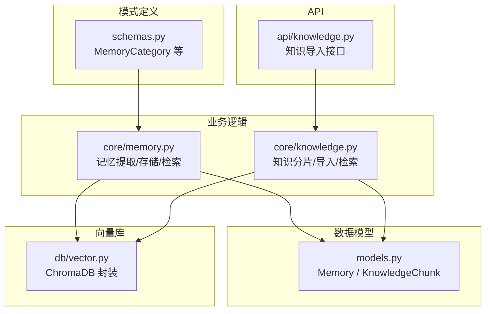
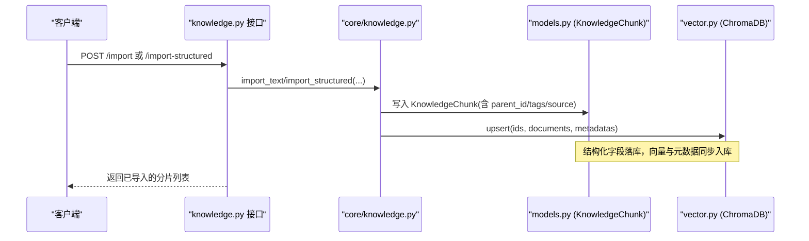
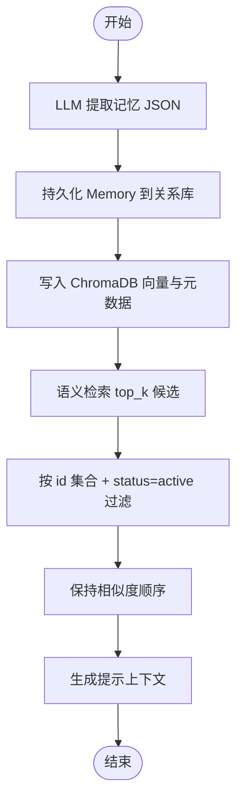
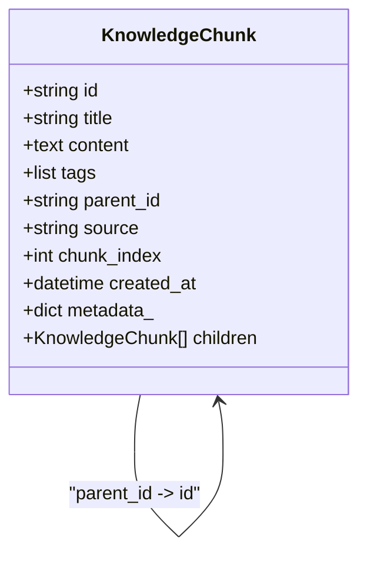
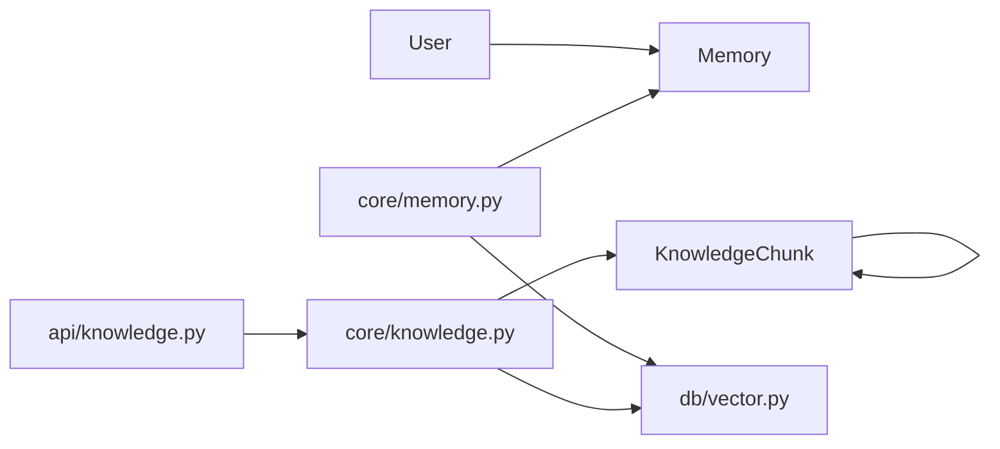
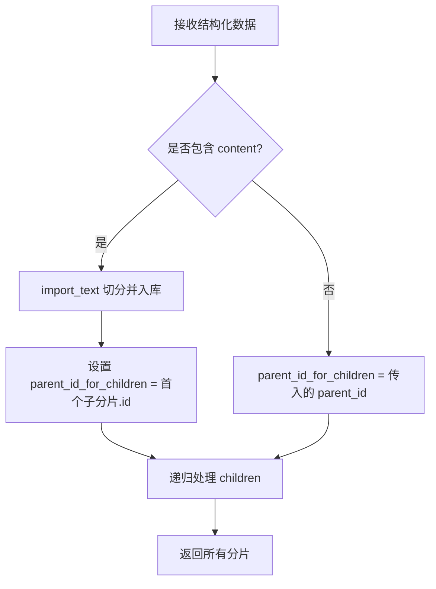

# 记忆知识模型

<cite>
**本文引用的文件**   
- [hushai/meditation/db/models.py](file://hushai/meditation/db/models.py)
- [hushai/meditation/core/memory.py](file://hushai/meditation/core/memory.py)
- [hushai/meditation/core/knowledge.py](file://hushai/meditation/core/knowledge.py)
- [hushai/meditation/db/vector.py](file://hushai/meditation/db/vector.py)
- [hushai/meditation/schemas.py](file://hushai/meditation/schemas.py)
- [hushai/meditation/api/knowledge.py](file://hushai/meditation/api/knowledge.py)
</cite>

## 目录
1. [简介](#简介)
2. [项目结构](#项目结构)
3. [核心实体与字段设计](#核心实体与字段设计)
4. [架构总览](#架构总览)
5. [详细组件分析](#详细组件分析)
6. [依赖关系分析](#依赖关系分析)
7. [性能与索引优化](#性能与索引优化)
8. [检索与知识图谱构建指南](#检索与知识图谱构建指南)
9. [故障排查](#故障排查)
10. [结论](#结论)

## 简介
本文件面向 hush.ai 的记忆系统与知识库，聚焦两个核心实体：Memory（长期记忆）与 KnowledgeChunk（知识片段）。文档从数据库模型、类别系统、重要性评分、状态管理、层次化组织、标签体系以及向量检索集成等维度进行系统化说明，并提供复合索引设计与检索优化建议，帮助开发者高效构建个性化记忆与结构化知识图谱。

## 项目结构
围绕记忆与知识的实现主要分布在以下模块：
- 数据模型定义：SQLAlchemy ORM 模型位于 models.py
- 业务逻辑：记忆提取与存储、知识导入与检索在 core/memory.py 与 core/knowledge.py
- 向量检索：ChromaDB 封装在 db/vector.py
- API 层：知识导入接口在 api/knowledge.py
- 请求/响应模式：schemas.py 中定义了 MemoryCategory 枚举及知识导入相关 Pydantic 模型

图表来源
- [hushai/meditation/db/models.py:98-151](file://hushai/meditation/db/models.py#L98-L151)
- [hushai/meditation/core/memory.py:45-158](file://hushai/meditation/core/memory.py#L45-L158)
- [hushai/meditation/core/knowledge.py:137-224](file://hushai/meditation/core/knowledge.py#L137-L224)
- [hushai/meditation/db/vector.py:81-178](file://hushai/meditation/db/vector.py#L81-L178)
- [hushai/meditation/api/knowledge.py:57-162](file://hushai/meditation/api/knowledge.py#L57-L162)
- [hushai/meditation/schemas.py:14-22](file://hushai/meditation/schemas.py#L14-L22)

章节来源
- [hushai/meditation/db/models.py:98-151](file://hushai/meditation/db/models.py#L98-L151)
- [hushai/meditation/core/memory.py:45-158](file://hushai/meditation/core/memory.py#L45-L158)
- [hushai/meditation/core/knowledge.py:137-224](file://hushai/meditation/core/knowledge.py#L137-L224)
- [hushai/meditation/db/vector.py:81-178](file://hushai/meditation/db/vector.py#L81-L178)
- [hushai/meditation/api/knowledge.py:57-162](file://hushai/meditation/api/knowledge.py#L57-L162)
- [hushai/meditation/schemas.py:14-22](file://hushai/meditation/schemas.py#L14-L22)

## 核心实体与字段设计
本节聚焦 Memory 与 KnowledgeChunk 的数据库结构与关键字段语义。

- Memory（长期记忆）
  - 标识与归属：id、user_id（外键关联用户）
  - 分类与内容：category（记忆类别）、content（原始事实描述）、summary（简短摘要）
  - 重要度：importance（0.0-1.0），用于排序与归档策略
  - 来源与生命周期：source_conversation_id（来源对话）、status（active/archived）
  - 时间戳：created_at、updated_at
  - 扩展元数据：metadata（JSON）
  - 索引：除 user_id 单列索引外，还定义了复合索引 ix_memories_user_category(user_id, category)，用于按用户+类别快速筛选

- KnowledgeChunk（知识片段）
  - 标识与层级：id、parent_id（自引用外键，形成父子层次）
  - 内容与元信息：title、content、tags（JSON 数组）、source（来源）
  - 顺序与时间：chunk_index（同父下的顺序）、created_at
  - 扩展元数据：metadata（JSON）
  - 关系：children（自引用关系，便于树形遍历）

章节来源
- [hushai/meditation/db/models.py:98-118](file://hushai/meditation/db/models.py#L98-L118)
- [hushai/meditation/db/models.py:137-151](file://hushai/meditation/db/models.py#L137-L151)

## 架构总览
记忆与知识系统在“关系型数据库 + 向量数据库”双栈上运行：
- 关系型数据库（SQLAlchemy）：持久化 Memory 与 KnowledgeChunk 的结构化字段、层级关系与索引
- 向量数据库（ChromaDB）：对 content 文本进行嵌入，支持语义检索；同时以 metadata 承载 tags、source、parent_id、category、user_id 等过滤条件

图表来源
- [hushai/meditation/api/knowledge.py:57-162](file://hushai/meditation/api/knowledge.py#L57-L162)
- [hushai/meditation/core/knowledge.py:137-224](file://hushai/meditation/core/knowledge.py#L137-L224)
- [hushai/meditation/db/models.py:137-151](file://hushai/meditation/db/models.py#L137-L151)
- [hushai/meditation/db/vector.py:81-127](file://hushai/meditation/db/vector.py#L81-L127)

## 详细组件分析

### 记忆实体 Memory 详解
- 类别系统（category）
  - 通过 schemas.MemoryCategory 枚举约束合法值，包括冥想经历、情绪模式、个人偏好、目标进展、重要事件、健康提醒、生活背景等
  - 在记忆提取提示词中也明确列举了这些类别，保证 LLM 输出稳定
- 重要性评分（importance）
  - 取值范围 0.0-1.0，存储时做边界钳制
  - 用于排序（降序）与归档策略（低重要度且长时间未更新的记录会被归档）
- 状态管理（status）
  - 默认 active，支持 archive_old_memories 将低重要度且过期的记忆标记为 archived
  - 查询时通常只返回 active 的记忆，避免干扰当前上下文
- 检索流程
  - 先通过向量库按 query 召回 top_k 候选 id
  - 再在关系库中按 id 集合与 status=active 过滤并维持相似度顺序
- 上下文组装
  - retrieve_relevant_memories 返回有序记忆后，get_memory_context_for_prompt 将其摘要拼接为提示上下文

图表来源
- [hushai/meditation/core/memory.py:45-112](file://hushai/meditation/core/memory.py#L45-L112)
- [hushai/meditation/core/memory.py:115-173](file://hushai/meditation/core/memory.py#L115-L173)
- [hushai/meditation/db/vector.py:130-173](file://hushai/meditation/db/vector.py#L130-L173)

章节来源
- [hushai/meditation/schemas.py:14-22](file://hushai/meditation/schemas.py#L14-L22)
- [hushai/meditation/core/memory.py:45-112](file://hushai/meditation/core/memory.py#L45-L112)
- [hushai/meditation/core/memory.py:115-173](file://hushai/meditation/core/memory.py#L115-L173)
- [hushai/meditation/db/vector.py:130-173](file://hushai/meditation/db/vector.py#L130-L173)

### 知识片段实体 KnowledgeChunk 详解
- 层次结构（parent_id）
  - 通过自引用外键 parent_id 建立父子关系，children 关系映射便于树形遍历
  - 结构化导入时，若节点包含 content，则以其首个子分片的 id 作为其 children 的 parent_id，从而形成“父节点 -> 子分片 -> 孙分片”的层次
- 标签体系（tags）
  - 使用 JSON 数组存储，支持多标签；导入时可合并来自 frontmatter 的 tags 与手动传入的 tags
  - 向量侧将 tags 序列化为逗号分隔字符串存入 metadata，检索时再拆分回数组
- 来源与顺序（source、chunk_index）
  - source 标注知识来源（如书籍、网页等）
  - chunk_index 表示同一父节点下分片顺序，便于展示与回溯
- 导入与检索
  - import_text：将长文本切分为多个分片，逐条写入关系库与向量库
  - import_structured：递归处理 children，自动维护 parent_id 层次
  - search_knowledge_base：基于向量相似度检索，返回标题、内容、分数、标签、来源等

图表来源
- [hushai/meditation/db/models.py:137-151](file://hushai/meditation/db/models.py#L137-L151)
- [hushai/meditation/core/knowledge.py:174-204](file://hushai/meditation/core/knowledge.py#L174-L204)

章节来源
- [hushai/meditation/db/models.py:137-151](file://hushai/meditation/db/models.py#L137-L151)
- [hushai/meditation/core/knowledge.py:137-224](file://hushai/meditation/core/knowledge.py#L137-L224)
- [hushai/meditation/db/vector.py:81-127](file://hushai/meditation/db/vector.py#L81-L127)

### 类别系统与重要性评分
- 类别系统
  - 通过 schemas.MemoryCategory 枚举统一类别命名，避免自由文本带来的不一致
  - 记忆提取提示词中明确列出类别，确保 LLM 输出符合约定
- 重要性评分
  - 存储时对 importance 做 0.0-1.0 的边界钳制
  - 排序：按 importance 降序，结合更新时间倒序，优先展示高价值记忆
  - 归档：archive_old_memories 将低重要度且长时间未更新的记忆标记为 archived，减少活跃集规模

章节来源
- [hushai/meditation/schemas.py:14-22](file://hushai/meditation/schemas.py#L14-L22)
- [hushai/meditation/core/memory.py:79-112](file://hushai/meditation/core/memory.py#L79-L112)
- [hushai/meditation/core/memory.py:141-158](file://hushai/meditation/core/memory.py#L141-L158)
- [hushai/meditation/core/memory.py:189-206](file://hushai/meditation/core/memory.py#L189-L206)

### 状态管理与生命周期
- 状态值
  - active：当前可用
  - archived：历史归档（低重要度且长时间未更新）
- 生命周期操作
  - 写入时默认 active
  - 定期归档任务将符合条件的记忆转为 archived
  - 检索与列表接口通常仅返回 active 的记录

章节来源
- [hushai/meditation/core/memory.py:79-112](file://hushai/meditation/core/memory.py#L79-L112)
- [hushai/meditation/core/memory.py:189-206](file://hushai/meditation/core/memory.py#L189-L206)

### 知识分片的层次结构与 JSON 标签
- 层次结构
  - parent_id 指向父分片 id，children 关系提供自上而下的遍历能力
  - 结构化导入时，若节点有 content，则以首个子分片 id 作为其 children 的 parent_id，形成“父节点 -> 子分片 -> 孙分片”的树
- JSON 标签（tags）
  - 数据库中以 JSON 数组存储，灵活支持多标签
  - 向量侧将 tags 序列化为逗号分隔字符串存入 metadata，检索时再拆分回数组，兼顾存储效率与查询便利
  - 导入时可合并 frontmatter 中的 tags 与手动传入的 tags，去重后入库

章节来源
- [hushai/meditation/db/models.py:137-151](file://hushai/meditation/db/models.py#L137-L151)
- [hushai/meditation/core/knowledge.py:137-204](file://hushai/meditation/core/knowledge.py#L137-L204)
- [hushai/meditation/db/vector.py:81-127](file://hushai/meditation/db/vector.py#L81-L127)

## 依赖关系分析
- 模型依赖
  - Memory 依赖 User（user_id 外键）
  - KnowledgeChunk 自引用（parent_id 外键）
- 业务逻辑依赖
  - core/memory.py 依赖 models.Memory、db.vector（ChromaDB）
  - core/knowledge.py 依赖 models.KnowledgeChunk、db.vector
- API 依赖
  - api/knowledge.py 调用 core/knowledge.py 完成导入与结构化导入

图表来源
- [hushai/meditation/db/models.py:98-151](file://hushai/meditation/db/models.py#L98-L151)
- [hushai/meditation/core/memory.py:45-158](file://hushai/meditation/core/memory.py#L45-L158)
- [hushai/meditation/core/knowledge.py:137-224](file://hushai/meditation/core/knowledge.py#L137-L224)
- [hushai/meditation/db/vector.py:81-178](file://hushai/meditation/db/vector.py#L81-L178)
- [hushai/meditation/api/knowledge.py:57-162](file://hushai/meditation/api/knowledge.py#L57-L162)

## 性能与索引优化
- 复合索引 ix_memories_user_category(user_id, category)
  - 作用：加速按用户与类别的组合查询，例如 get_user_memories 中可按 category 过滤
  - 适用场景：后台分页列表、按类别统计、按类别导出
- 单列索引
  - user_id 单列索引：加速用户维度的主查询
  - parent_id 单列索引：加速知识层次查询（如查找某节点的直接子节点）
- 向量检索优化
  - 记忆检索：先向量召回 top_k，再在关系库按 id 集合与 status=active 过滤，降低全表扫描成本
  - 知识检索：基于 cosine 空间相似度，top_k 由配置控制，避免过大结果集影响延迟
- 归档策略
  - archive_old_memories 将低重要度且长时间未更新的记忆归档，缩小活跃集，提升检索与列表性能

章节来源
- [hushai/meditation/db/models.py:102-118](file://hushai/meditation/db/models.py#L102-L118)
- [hushai/meditation/db/models.py:144-151](file://hushai/meditation/db/models.py#L144-L151)
- [hushai/meditation/core/memory.py:141-158](file://hushai/meditation/core/memory.py#L141-L158)
- [hushai/meditation/core/memory.py:189-206](file://hushai/meditation/core/memory.py#L189-L206)
- [hushai/meditation/db/vector.py:104-127](file://hushai/meditation/db/vector.py#L104-L127)

## 检索与知识图谱构建指南

### 记忆检索优化最佳实践
- 分层检索
  - 先用向量检索召回 top_k，再用关系库按 id 集合与 status=active 过滤，最后按 importance 与 updated_at 二次排序
- 类别过滤
  - 在需要精确分类的场景，使用 category 过滤并结合复合索引 ix_memories_user_category
- 上下文裁剪
  - 将每条记忆的 summary 或前若干字符拼接为提示上下文，控制长度以避免超出模型上下文窗口
- 归档与清理
  - 定期执行归档任务，降低活跃集规模，提高检索命中率与速度

章节来源
- [hushai/meditation/core/memory.py:115-173](file://hushai/meditation/core/memory.py#L115-L173)
- [hushai/meditation/core/memory.py:141-158](file://hushai/meditation/core/memory.py#L141-L158)
- [hushai/meditation/core/memory.py:189-206](file://hushai/meditation/core/memory.py#L189-L206)

### 知识图谱构建与层次组织
- 层次建模
  - 使用 parent_id 建立父子关系，children 关系用于自上而下遍历
  - 结构化导入时，若节点包含 content，则以首个子分片 id 作为其 children 的 parent_id，形成“父节点 -> 子分片 -> 孙分片”的树
- 标签与来源
  - tags 使用 JSON 数组，支持多标签；source 标注来源，便于溯源与审计
  - 向量侧将 tags 序列化为逗号分隔字符串，检索时再拆分回数组
- 导入流程
  - import_text：长文本切分为多个分片，逐条写入关系库与向量库
  - import_structured：递归处理 children，自动维护 parent_id 层次

图表来源
- [hushai/meditation/core/knowledge.py:174-204](file://hushai/meditation/core/knowledge.py#L174-L204)

章节来源
- [hushai/meditation/core/knowledge.py:137-204](file://hushai/meditation/core/knowledge.py#L137-L204)
- [hushai/meditation/db/models.py:137-151](file://hushai/meditation/db/models.py#L137-L151)
- [hushai/meditation/db/vector.py:81-127](file://hushai/meditation/db/vector.py#L81-L127)

## 故障排查
- 记忆向量写入失败
  - 现象：日志中出现“记忆向量写入失败”警告
  - 原因：ChromaDB 不可用或网络异常
  - 处理：检查向量库连接与配置，必要时降级为仅关系库存储
- 记忆提取 JSON 解析失败
  - 现象：日志中出现“记忆提取 JSON 解析失败”警告
  - 原因：LLM 返回格式不符合预期
  - 处理：调整提示词或增加容错逻辑，确保返回标准 JSON 数组
- 知识导入为空
  - 现象：导入接口返回错误“导入内容解析后为空”
  - 原因：Markdown 或纯文本解析后无有效内容
  - 处理：检查输入内容与格式，确保存在可切分的正文

章节来源
- [hushai/meditation/core/memory.py:102-112](file://hushai/meditation/core/memory.py#L102-L112)
- [hushai/meditation/core/memory.py:74-76](file://hushai/meditation/core/memory.py#L74-L76)
- [hushai/meditation/api/knowledge.py:67-72](file://hushai/meditation/api/knowledge.py#L67-L72)

## 结论
hush.ai 的记忆与知识系统通过“关系型数据库 + 向量数据库”的双栈架构，实现了长期记忆的个性化存储与语义检索，以及结构化知识的层次化管理与 RAG 检索。Memory 的类别系统、重要性评分与状态管理保障了记忆的生命周期治理；KnowledgeChunk 的 parent_id 层次与 tags 标签体系支撑了知识图谱的组织与检索。配合复合索引与合理的检索流程，系统在性能与可用性方面具备良好表现。开发者可在此基础上进一步优化检索策略、扩展标签体系与增强错误恢复机制。