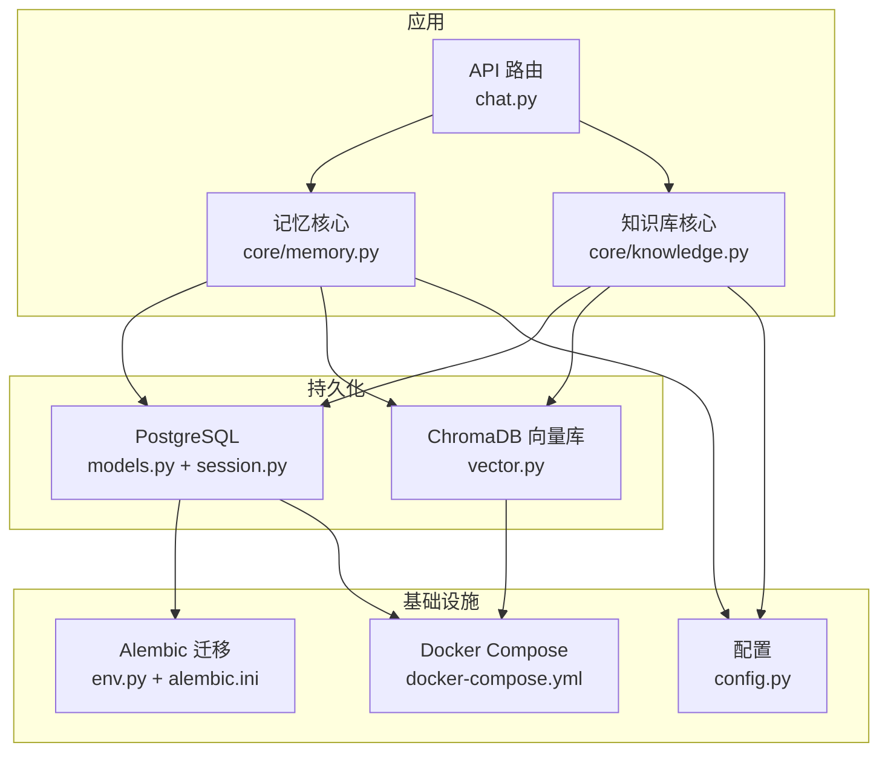
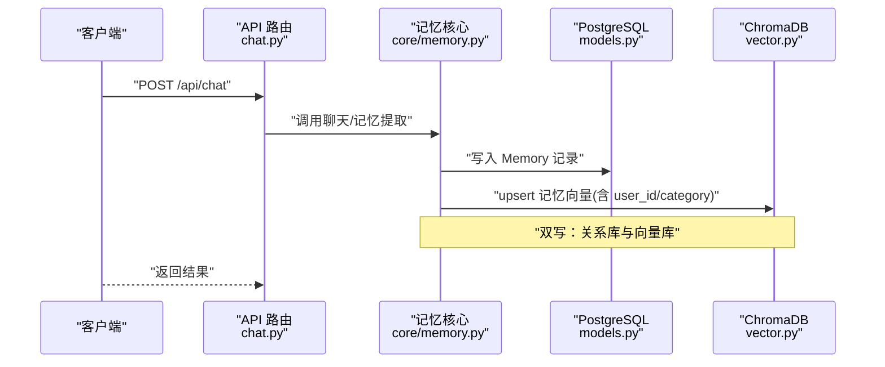
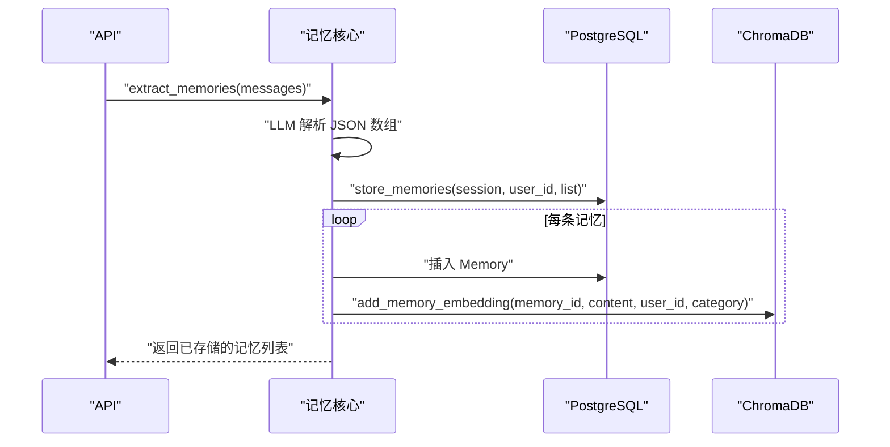
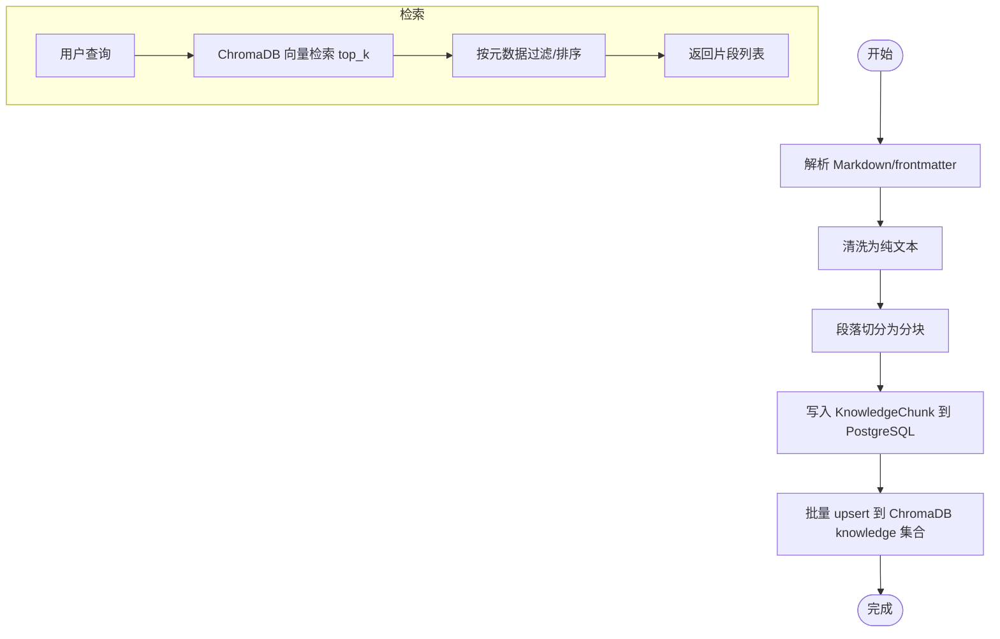
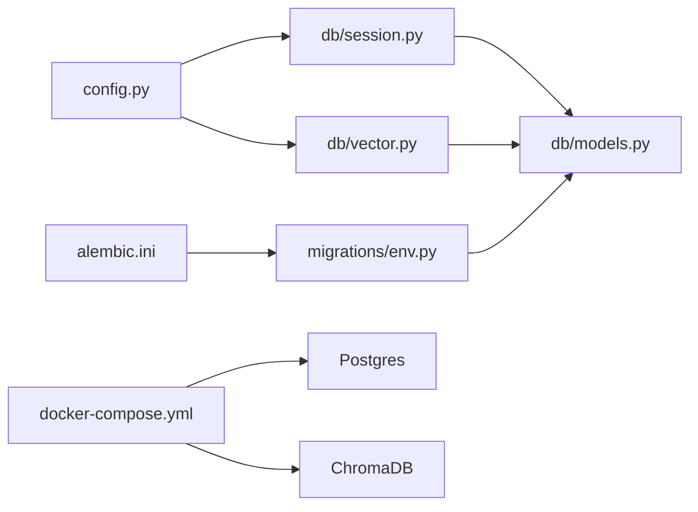
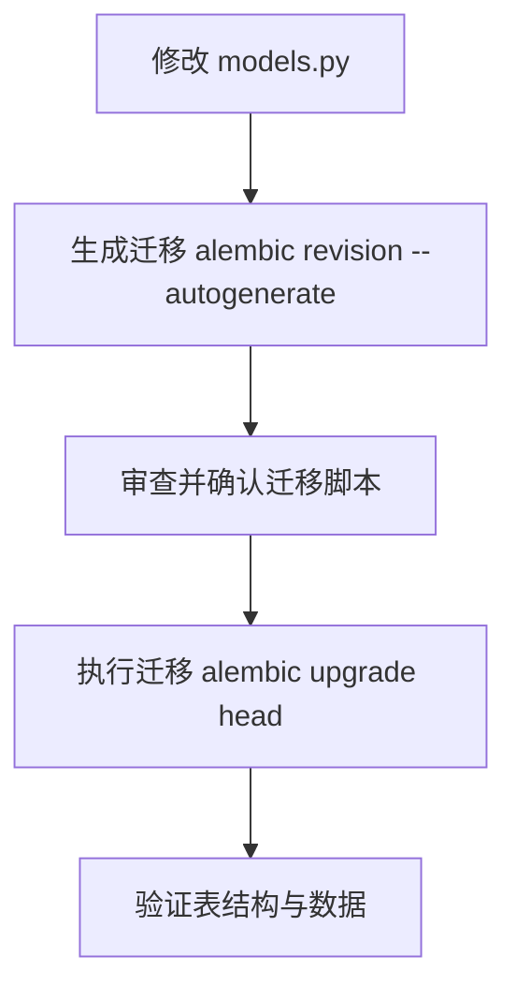

# 数据库设计

<cite>
**本文引用的文件**
- [hushai/meditation/db/models.py](file://hushai/meditation/db/models.py)
- [hushai/meditation/db/session.py](file://hushai/meditation/db/session.py)
- [hushai/meditation/db/vector.py](file://hushai/meditation/db/vector.py)
- [hushai/meditation/config.py](file://hushai/meditation/config.py)
- [alembic.ini](file://alembic.ini)
- [hushai/meditation/db/migrations/env.py](file://hushai/meditation/db/migrations/env.py)
- [docker-compose.yml](file://docker-compose.yml)
- [hushai/meditation/core/memory.py](file://hushai/meditation/core/memory.py)
- [hushai/meditation/core/knowledge.py](file://hushai/meditation/core/knowledge.py)
- [hushai/meditation/api/chat.py](file://hushai/meditation/api/chat.py)
</cite>

## 目录
1. [引言](#引言)
2. [项目结构](#项目结构)
3. [核心组件](#核心组件)
4. [架构总览](#架构总览)
5. [详细组件分析](#详细组件分析)
6. [依赖关系分析](#依赖关系分析)
7. [性能与索引优化](#性能与索引优化)
8. [迁移管理流程](#迁移管理流程)
9. [备份与恢复策略](#备份与恢复策略)
10. [安全与访问控制](#安全与访问控制)
11. [故障排查指南](#故障排查指南)
12. [结论](#结论)

## 引言
本文件面向数据库管理员与后端开发者，系统化阐述 hush.ai 的数据层设计与实现。内容覆盖：
- 实体关系图（ERD）与表结构设计（用户、对话、消息、记忆、知识、导师、场景、咨询相关等）
- SQLAlchemy ORM 模型的设计模式与字段约束
- PostgreSQL 关系型存储与 ChromaDB 向量存储的混合策略、数据同步机制与查询路径
- 索引设计原则与查询优化建议
- 数据库迁移管理流程
- 备份恢复与安全访问控制措施

## 项目结构
数据层相关文件组织如下：
- 模型定义：hushai/meditation/db/models.py
- 会话与引擎：hushai/meditation/db/session.py
- 向量库接口：hushai/meditation/db/vector.py
- 配置加载：hushai/meditation/config.py
- 迁移配置：alembic.ini、hushai/meditation/db/migrations/env.py
- 容器编排：docker-compose.yml
- 业务逻辑（读写双写/检索）：hushai/meditation/core/memory.py、hushai/meditation/core/knowledge.py
- API 入口（示例）：hushai/meditation/api/chat.py



图表来源
- [hushai/meditation/api/chat.py:1-245](file://hushai/meditation/api/chat.py#L1-L245)
- [hushai/meditation/core/memory.py:1-206](file://hushai/meditation/core/memory.py#L1-L206)
- [hushai/meditation/core/knowledge.py:1-225](file://hushai/meditation/core/knowledge.py#L1-L225)
- [hushai/meditation/db/models.py:1-434](file://hushai/meditation/db/models.py#L1-L434)
- [hushai/meditation/db/session.py:1-83](file://hushai/meditation/db/session.py#L1-L83)
- [hushai/meditation/db/vector.py:1-179](file://hushai/meditation/db/vector.py#L1-L179)
- [hushai/meditation/config.py:1-136](file://hushai/meditation/config.py#L1-L136)
- [alembic.ini:1-37](file://alembic.ini#L1-L37)
- [hushai/meditation/db/migrations/env.py:1-52](file://hushai/meditation/db/migrations/env.py#L1-L52)
- [docker-compose.yml:1-31](file://docker-compose.yml#L1-L31)

章节来源
- [hushai/meditation/db/models.py:1-434](file://hushai/meditation/db/models.py#L1-L434)
- [hushai/meditation/db/session.py:1-83](file://hushai/meditation/db/session.py#L1-L83)
- [hushai/meditation/db/vector.py:1-179](file://hushai/meditation/db/vector.py#L1-L179)
- [hushai/meditation/config.py:1-136](file://hushai/meditation/config.py#L1-L136)
- [alembic.ini:1-37](file://alembic.ini#L1-L37)
- [hushai/meditation/db/migrations/env.py:1-52](file://hushai/meditation/db/migrations/env.py#L1-L52)
- [docker-compose.yml:1-31](file://docker-compose.yml#L1-L31)

## 核心组件
- 关系型模型（PostgreSQL）
  - 用户、对话、消息、记忆、技能、知识分块、场景、管理员、审计日志、冥想会话、每日进度、导师
  - 咨询服务域：咨询师、排班、预约、订单、服务记录、预约设置
- 向量模型（ChromaDB）
  - knowledge 集合：用于理论体系 RAG 检索
  - memories 集合：用于个人记忆语义检索
- 会话与引擎
  - 异步引擎与 Session 工厂，自动适配 SQLite/PostgreSQL
- 配置中心
  - 统一从环境变量加载数据库 URL、Chroma 持久化目录、嵌入模型与密钥等

章节来源
- [hushai/meditation/db/models.py:1-434](file://hushai/meditation/db/models.py#L1-L434)
- [hushai/meditation/db/vector.py:1-179](file://hushai/meditation/db/vector.py#L1-L179)
- [hushai/meditation/db/session.py:1-83](file://hushai/meditation/db/session.py#L1-L83)
- [hushai/meditation/config.py:1-136](file://hushai/meditation/config.py#L1-L136)

## 架构总览
系统采用“关系型 + 向量”的双栈存储：
- PostgreSQL：承载结构化主数据、事务性写入、复杂查询与统计
- ChromaDB：承载文本向量化后的语义检索（知识分块与记忆）
- 数据同步：在业务层进行“双写”，即先落库再入向量；检索时优先向量召回，再回查关系库获取完整元数据



图表来源
- [hushai/meditation/api/chat.py:58-127](file://hushai/meditation/api/chat.py#L58-L127)
- [hushai/meditation/core/memory.py:79-112](file://hushai/meditation/core/memory.py#L79-L112)
- [hushai/meditation/db/vector.py:130-142](file://hushai/meditation/db/vector.py#L130-L142)
- [hushai/meditation/db/models.py:98-118](file://hushai/meditation/db/models.py#L98-L118)

## 详细组件分析

### 实体关系图（ERD）
```mermaid
erDiagram
USERS {
string id PK
string wx_openid UK
string wx_unionid
string wx_session_key
string nickname
string avatar_url
string refresh_token_hash
string refresh_token_selector UK
string selected_teacher_id FK
datetime created_at
datetime updated_at
boolean is_active
json metadata
}
CONVERSATIONS {
string id PK
string user_id FK
string title
datetime created_at
datetime updated_at
boolean is_active
}
MESSAGES {
string id PK
string conversation_id FK
string role
text content
datetime created_at
json metadata
}
MEMORIES {
string id PK
string user_id FK
string category
text content
string summary
float importance
string source_conversation_id FK
string status
datetime created_at
datetime updated_at
json metadata
}
KNOWLEDGE_CHUNKS {
string id PK
string title
text content
json tags
string parent_id FK
string source
int chunk_index
datetime created_at
json metadata
}
SCENES {
string id PK
string name
string slug UK
string description
text system_prompt
text opening_message
boolean is_active
int sort_order
datetime created_at
datetime updated_at
}
TEACHERS {
string id PK
string name
string slug UK
string description
string avatar
text system_prompt
string default_voice
string voice_gender
string style_tags
boolean is_active
int sort_order
datetime created_at
datetime updated_at
}
ADMIN_USERS {
string id PK
string username UK
string password_hash
string display_name
boolean is_active
datetime created_at
datetime updated_at
}
AUDIT_LOGS {
string id PK
string admin_username
string action
string resource_type
string resource_id
text detail
string ip_address
string user_agent
datetime created_at
}
MEDITATION_SESSIONS {
string id PK
string user_id FK
string conversation_id FK
string scene_id FK
datetime started_at
datetime ended_at
int duration_seconds
int mood_before
int mood_after
text note
datetime created_at
}
DAILY_PROGRESS {
string id PK
string user_id FK
datetime date
int meditation_count
int total_duration_seconds
float mood_avg
int streak_day
datetime created_at
datetime updated_at
}
COUNSELORS {
string id PK
string user_id FK
string real_name
string phone
string email
string avatar_url
json specialties
json certifications
text bio
string status
float hourly_rate
float rating
int total_sessions
boolean is_online
int sort_order
datetime created_at
datetime updated_at
}
COUNSELOR_SCHEDULES {
string id PK
string counselor_id FK
date schedule_date
time start_time
time end_time
int slot_duration_minutes
int max_bookings
boolean is_available
datetime created_at
}
APPOINTMENTS {
string id PK
string counselor_id FK
string user_id FK
string schedule_id FK
date appointment_date
time start_time
time end_time
string status
text cancel_reason
text client_notes
datetime created_at
datetime updated_at
}
CONSULTATION_ORDERS {
string id PK
string appointment_id FK
string counselor_id FK
string user_id FK
string order_type
string package_name
float amount
float paid_amount
string status
string wx_transaction_id
string wx_prepay_id
datetime paid_at
datetime refunded_at
datetime created_at
datetime updated_at
}
SERVICE_RECORDS {
string id PK
string order_id FK
string appointment_id FK
string counselor_id FK
string user_id FK
string service_type
int duration_minutes
text summary_encrypted
text counselor_notes_encrypted
string status
datetime started_at
datetime ended_at
datetime created_at
}
APPOINTMENT_SETTINGS {
string id PK
string counselor_id FK UK
int max_booking_count
int min_advance_hours
int slot_duration_minutes
int reminder_before_minutes
boolean info_collection_enabled
boolean is_open
datetime created_at
datetime updated_at
}
USERS ||--o{ CONVERSATIONS : "拥有"
USERS ||--o{ MEMORIES : "拥有"
USERS ||--o{ MEDITATION_SESSIONS : "参与"
USERS ||--o{ DAILY_PROGRESS : "统计"
USERS ||--o{ COUNSELORS : "成为"
USERS ||--o{ APPOINTMENTS : "预约"
USERS ||--o{ CONSULTATION_ORDERS : "下单"
USERS ||--o{ SERVICE_RECORDS : "接受服务"
CONVERSATIONS ||--o{ MESSAGES : "包含"
USERS ||--o| TEACHERS : "选择导师"
USERS ||--o| SCENES : "使用场景"
COUNSELORS ||--o{ COUNSELOR_SCHEDULES : "排班"
COUNSELORS ||--o{ APPOINTMENTS : "被预约"
COUNSELORS ||--o{ CONSULTATION_ORDERS : "产生订单"
COUNSELORS ||--o{ SERVICE_RECORDS : "提供服务"
APPOINTMENTS ||--o| CONSULTATION_ORDERS : "关联订单"
APPOINTMENTS ||--o| SERVICE_RECORDS : "生成服务记录"
CONSULTATION_ORDERS ||--o| SERVICE_RECORDS : "结算服务"
MEMORIES }o..o{ CONVERSATIONS : "来源"
KNOWLEDGE_CHUNKS }o..o| KNOWLEDGE_CHUNKS : "父子层级"
```

图表来源
- [hushai/meditation/db/models.py:37-434](file://hushai/meditation/db/models.py#L37-L434)

章节来源
- [hushai/meditation/db/models.py:37-434](file://hushai/meditation/db/models.py#L37-L434)

### 关键业务流程时序

#### 记忆提取与入库（双写）


图表来源
- [hushai/meditation/core/memory.py:45-112](file://hushai/meditation/core/memory.py#L45-L112)
- [hushai/meditation/db/vector.py:130-142](file://hushai/meditation/db/vector.py#L130-L142)
- [hushai/meditation/db/models.py:98-118](file://hushai/meditation/db/models.py#L98-L118)

#### 知识导入与检索（RAG）


图表来源
- [hushai/meditation/core/knowledge.py:76-171](file://hushai/meditation/core/knowledge.py#L76-L171)
- [hushai/meditation/db/vector.py:81-127](file://hushai/meditation/db/vector.py#L81-L127)
- [hushai/meditation/db/models.py:137-151](file://hushai/meditation/db/models.py#L137-L151)

章节来源
- [hushai/meditation/core/memory.py:45-112](file://hushai/meditation/core/memory.py#L45-L112)
- [hushai/meditation/core/knowledge.py:76-171](file://hushai/meditation/core/knowledge.py#L76-L171)
- [hushai/meditation/db/vector.py:81-127](file://hushai/meditation/db/vector.py#L81-L127)

### 模型设计与继承策略
- 基类 Base 使用 DeclarativeBase，所有模型通过 mapped_column 声明字段
- 无显式多态继承，采用外键与 relationship 表达一对多、自引用（KnowledgeChunk.parent_id）等关系
- 时间戳默认值与更新策略由 _utcnow 与 onupdate 提供
- 主键统一使用 UUID 字符串，便于分布式与跨系统关联

章节来源
- [hushai/meditation/db/models.py:25-66](file://hushai/meditation/db/models.py#L25-L66)
- [hushai/meditation/db/models.py:137-151](file://hushai/meditation/db/models.py#L137-L151)

## 依赖关系分析
- 配置驱动：session.py 与 vector.py 均依赖 config.py 提供的数据库 URL、Chroma 持久化目录、嵌入模型与密钥
- 迁移：alembic.ini 指定脚本位置与连接串；env.py 基于 Base.metadata 生成迁移
- 容器：docker-compose.yml 提供 Postgres 与 ChromaDB 服务及卷挂载



图表来源
- [hushai/meditation/config.py:1-136](file://hushai/meditation/config.py#L1-L136)
- [hushai/meditation/db/session.py:1-83](file://hushai/meditation/db/session.py#L1-L83)
- [hushai/meditation/db/vector.py:1-179](file://hushai/meditation/db/vector.py#L1-L179)
- [hushai/meditation/db/models.py:1-434](file://hushai/meditation/db/models.py#L1-L434)
- [hushai/meditation/db/migrations/env.py:1-52](file://hushai/meditation/db/migrations/env.py#L1-L52)
- [alembic.ini:1-37](file://alembic.ini#L1-L37)
- [docker-compose.yml:1-31](file://docker-compose.yml#L1-L31)

章节来源
- [hushai/meditation/config.py:1-136](file://hushai/meditation/config.py#L1-L136)
- [hushai/meditation/db/session.py:1-83](file://hushai/meditation/db/session.py#L1-L83)
- [hushai/meditation/db/vector.py:1-179](file://hushai/meditation/db/vector.py#L1-L179)
- [hushai/meditation/db/migrations/env.py:1-52](file://hushai/meditation/db/migrations/env.py#L1-L52)
- [alembic.ini:1-37](file://alembic.ini#L1-L37)
- [docker-compose.yml:1-31](file://docker-compose.yml#L1-L31)

## 性能与索引优化
- 现有索引
  - users.refresh_token_hash、users.refresh_token_selector、users.wx_openid
  - conversations.user_id、messages.conversation_id
  - memories.user_id、memories.category、复合索引 ix_memories_user_category(user_id, category)
  - daily_progress.user_id、复合索引 ix_daily_progress_user_date(user_id, date)
  - counselors.status、counselor_schedules.counselor_id/schedule_date/start_time 唯一索引、appointments.counselor_id/user_id/appointment_date/status
  - knowledge_chunks.parent_id、scenes.slug、teachers.slug、admin_users.username
- 建议
  - 对高频过滤/排序列建立合适索引（如 messages.created_at、service_records.status）
  - 大表分页查询使用覆盖索引或只取必要列
  - 向量检索 top_k 与 where 条件结合，减少回表数量
  - 定期归档低重要性记忆，降低热数据量

章节来源
- [hushai/meditation/db/models.py:37-434](file://hushai/meditation/db/models.py#L37-L434)

## 迁移管理流程
- 配置文件
  - alembic.ini 指定脚本目录与连接串
- 运行方式
  - env.py 支持离线与在线模式，并基于 Base.metadata 执行迁移
- 本地开发
  - docker-compose 启动 Postgres 与 ChromaDB
  - 初始化数据库：使用 init_db 或 Alembic 生成/执行迁移



图表来源
- [alembic.ini:1-37](file://alembic.ini#L1-L37)
- [hushai/meditation/db/migrations/env.py:1-52](file://hushai/meditation/db/migrations/env.py#L1-L52)
- [hushai/meditation/db/session.py:63-68](file://hushai/meditation/db/session.py#L63-L68)
- [docker-compose.yml:1-31](file://docker-compose.yml#L1-L31)

章节来源
- [alembic.ini:1-37](file://alembic.ini#L1-L37)
- [hushai/meditation/db/migrations/env.py:1-52](file://hushai/meditation/db/migrations/env.py#L1-L52)
- [hushai/meditation/db/session.py:63-68](file://hushai/meditation/db/session.py#L63-L68)
- [docker-compose.yml:1-31](file://docker-compose.yml#L1-L31)

## 备份与恢复策略
- PostgreSQL
  - 使用 pg_dump/pg_restore 或云厂商快照进行全量/增量备份
  - 将 pgdata 卷持久化至可靠存储，定期校验备份可用性
- ChromaDB
  - 若使用 PersistentClient，需备份 chromadata 卷中的持久化目录
  - 注意向量索引重建成本，建议在低峰期执行
- 一致性
  - 关系库与向量库之间不做强一致事务，建议以业务幂等与重试保证最终一致
  - 对关键数据（订单、服务记录）优先保障关系库一致性

章节来源
- [docker-compose.yml:1-31](file://docker-compose.yml#L1-L31)
- [hushai/meditation/db/vector.py:15-28](file://hushai/meditation/db/vector.py#L15-L28)

## 安全与访问控制
- 传输与认证
  - API 使用 Bearer Token 鉴权，JWT 算法与过期时间由配置控制
- 敏感数据
  - 服务记录摘要与咨询师备注以加密字段存储（summary_encrypted/counselor_notes_encrypted），需在应用层加解密
- 最小权限
  - 数据库账号仅授予必要权限；生产环境禁用匿名访问
- 审计
  - 管理后台操作写入 audit_logs，便于追溯

章节来源
- [hushai/meditation/api/chat.py:47-56](file://hushai/meditation/api/chat.py#L47-L56)
- [hushai/meditation/config.py:18-52](file://hushai/meditation/config.py#L18-L52)
- [hushai/meditation/db/models.py:386-411](file://hushai/meditation/db/models.py#L386-L411)
- [hushai/meditation/db/models.py:188-202](file://hushai/meditation/db/models.py#L188-L202)

## 故障排查指南
- 无法连接数据库
  - 检查 .env 中 MEDITATION_POSTGRES_URL 与 docker-compose 服务状态
- 向量检索为空
  - 确认 embedding_provider/model/key 配置正确；检查 ChromaDB 是否可用且集合存在
- 迁移失败
  - 核对 alembic.ini 的 sqlalchemy.url；确保目标库可写
- 登录失败
  - 检查 JWT 配置与 token 有效性；查看鉴权中间件抛出的错误信息

章节来源
- [hushai/meditation/db/session.py:15-31](file://hushai/meditation/db/session.py#L15-L31)
- [hushai/meditation/db/vector.py:43-58](file://hushai/meditation/db/vector.py#L43-L58)
- [alembic.ini:1-37](file://alembic.ini#L1-L37)
- [hushai/meditation/api/chat.py:47-56](file://hushai/meditation/api/chat.py#L47-L56)

## 结论
本项目采用“PostgreSQL + ChromaDB”的混合数据层，兼顾强一致的结构化数据与高维语义检索能力。通过清晰的模型定义、合理的索引设计与迁移流程，以及明确的双写同步策略，实现了可扩展、可维护的数据基础。配合完善的备份恢复与安全控制，可为冥想与心理咨询业务提供稳定可靠的数据支撑。