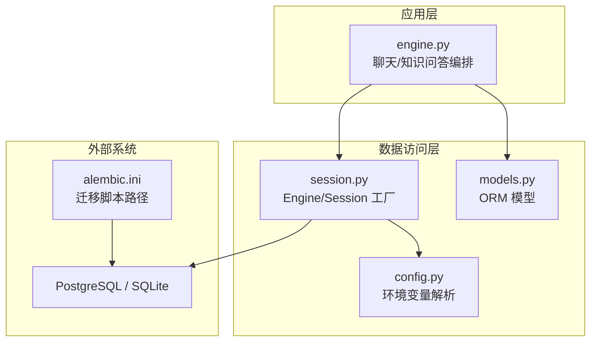
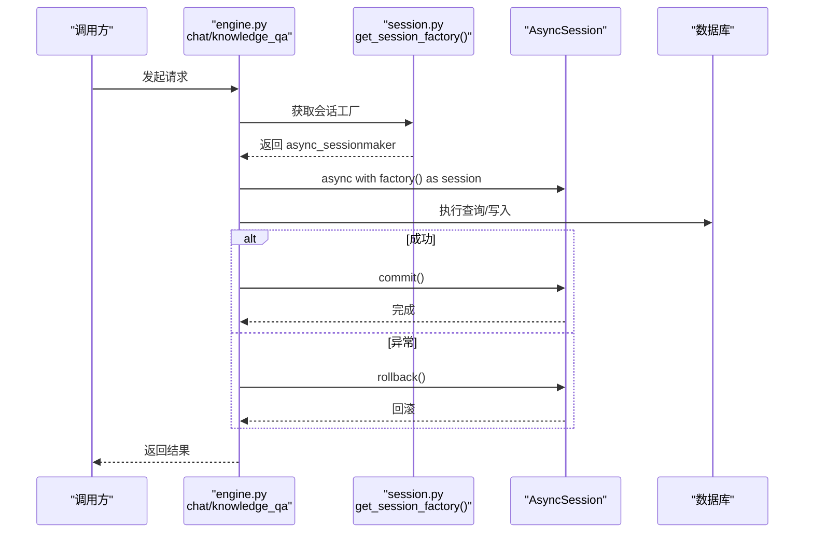
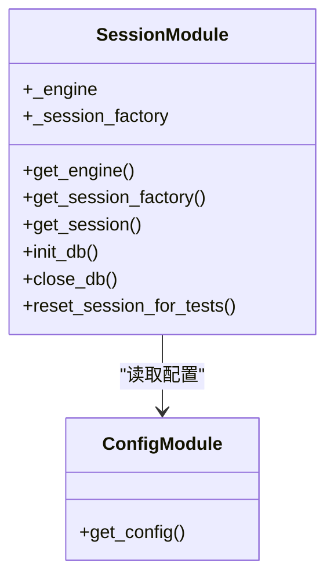
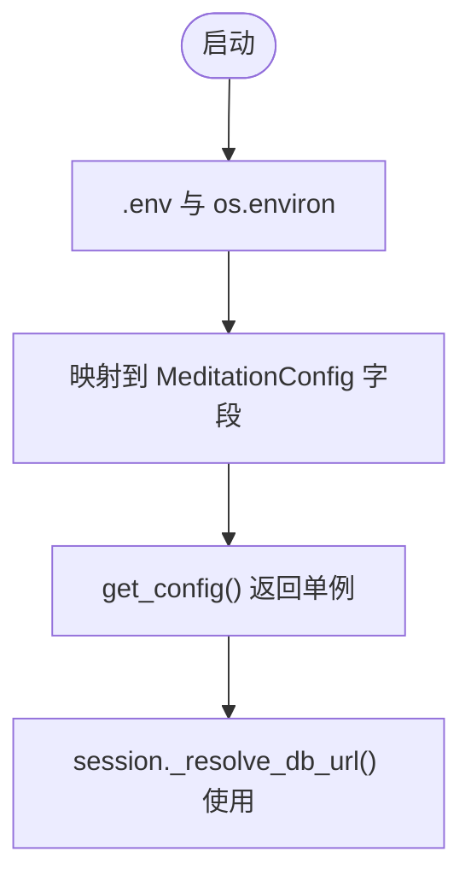
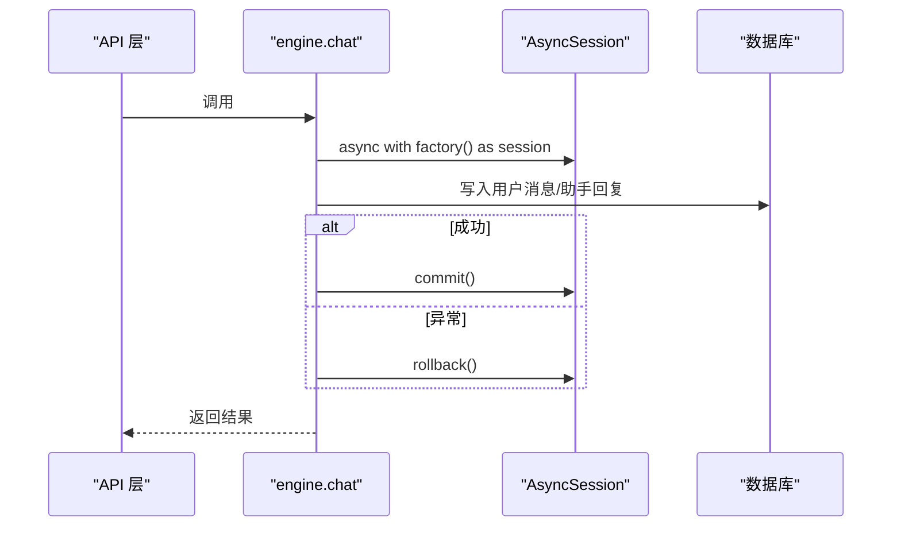
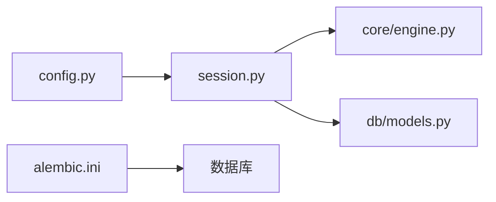

# 数据库连接管理

<cite>
**本文引用的文件**   
- [hushai/meditation/db/session.py](file://hushai/meditation/db/session.py)
- [hushai/meditation/config.py](file://hushai/meditation/config.py)
- [hushai/meditation/core/engine.py](file://hushai/meditation/core/engine.py)
- [hushai/meditation/db/models.py](file://hushai/meditation/db/models.py)
- [alembic.ini](file://alembic.ini)
- [tests/conftest.py](file://tests/conftest.py)
</cite>

## 目录
1. [简介](#简介)
2. [项目结构](#项目结构)
3. [核心组件](#核心组件)
4. [架构总览](#架构总览)
5. [详细组件分析](#详细组件分析)
6. [依赖关系分析](#依赖关系分析)
7. [性能与调优](#性能与调优)
8. [故障诊断指南](#故障诊断指南)
9. [结论](#结论)
10. [附录](#附录)

## 简介
本文件面向 hush.ai 的运维与研发人员，系统性梳理基于 SQLAlchemy 异步会话的数据库连接管理方案。内容覆盖：
- 连接池配置、事务管理与连接生命周期控制
- 异步数据库操作（async/await）与并发安全保证
- 多租户支持与连接隔离策略建议
- 错误处理与重试机制现状与建议
- 动态配置与环境变量管理
- 连接监控与性能指标收集方案
- 连接池调优与故障诊断方法

## 项目结构
本项目在冥想模块中实现了统一的异步数据库访问层，关键位置如下：
- 会话与引擎：hushai/meditation/db/session.py
- 配置加载：hushai/meditation/config.py
- 业务编排与事务边界：hushai/meditation/core/engine.py
- ORM 模型定义：hushai/meditation/db/models.py
- Alembic 迁移配置：alembic.ini
- 测试夹具（内存 SQLite）：tests/conftest.py

图表来源
- [hushai/meditation/core/engine.py:166-387](file://hushai/meditation/core/engine.py#L166-L387)
- [hushai/meditation/db/session.py:34-54](file://hushai/meditation/db/session.py#L34-L54)
- [hushai/meditation/config.py:63-115](file://hushai/meditation/config.py#L63-L115)
- [hushai/meditation/db/models.py:25-26](file://hushai/meditation/db/models.py#L25-L26)
- [alembic.ini:1-4](file://alembic.ini#L1-L4)

章节来源
- [hushai/meditation/db/session.py:1-83](file://hushai/meditation/db/session.py#L1-L83)
- [hushai/meditation/config.py:1-136](file://hushai/meditation/config.py#L1-136)
- [hushai/meditation/core/engine.py:1-387](file://hushai/meditation/core/engine.py#L1-L387)
- [hushai/meditation/db/models.py:1-434](file://hushai/meditation/db/models.py#L1-L434)
- [alembic.ini:1-37](file://alembic.ini#L1-L37)
- [tests/conftest.py:1-68](file://tests/conftest.py#L1-L68)

## 核心组件
- 异步引擎与会话工厂
  - 通过 create_async_engine 创建异步引擎，并缓存为全局单例；根据 URL 前缀自动选择驱动（sqlite+aiosqlite 或 postgresql+asyncpg）。
  - 使用 async_sessionmaker 构建会话工厂，expire_on_commit=False 避免提交后对象过期。
- 配置解析
  - 从 .env 与进程环境变量加载 MeditationConfig，支持 MEDITATION_POSTGRES_URL 等键值映射。
- 业务编排
  - engine.chat/knowledge_qa/chat_stream 以 async with factory() as session 的方式获取会话，并在 try/finally 中确保 commit 或 rollback。
- 模型与迁移
  - models.py 定义 Base 及所有表结构；alembic.ini 指定迁移脚本目录与默认数据库 URL。

章节来源
- [hushai/meditation/db/session.py:34-54](file://hushai/meditation/db/session.py#L34-L54)
- [hushai/meditation/config.py:63-115](file://hushai/meditation/config.py#L63-L115)
- [hushai/meditation/core/engine.py:166-387](file://hushai/meditation/core/engine.py#L166-L387)
- [hushai/meditation/db/models.py:25-26](file://hushai/meditation/db/models.py#L25-L26)
- [alembic.ini:1-4](file://alembic.ini#L1-L4)

## 架构总览
下图展示了从业务调用到数据库连接的完整流程，包括会话获取、事务边界与异常回滚。

图表来源
- [hushai/meditation/core/engine.py:166-387](file://hushai/meditation/core/engine.py#L166-L387)
- [hushai/meditation/db/session.py:50-60](file://hushai/meditation/db/session.py#L50-L60)

## 详细组件分析

### 组件一：异步引擎与会话工厂（session.py）
- 功能要点
  - 解析数据库 URL：若未设置则回退至本地 SQLite；对 PostgreSQL 前缀进行驱动适配。
  - 创建异步引擎：SQLite 启用 check_same_thread=False；pool_size 针对 SQLite 与 PG 分别设定。
  - 会话工厂：expire_on_commit=False，减少重复加载开销。
  - 初始化与关闭：提供 init_db/close_db/reset_session_for_tests 辅助函数。
- 并发与安全
  - 使用 async_sessionmaker 与 async with 上下文管理器，确保每个协程持有独立会话实例，避免跨协程共享状态。
- 连接生命周期
  - 进程级单例 Engine；按需创建；close_db 释放底层连接资源。

图表来源
- [hushai/meditation/db/session.py:11-83](file://hushai/meditation/db/session.py#L11-L83)
- [hushai/meditation/config.py:121-125](file://hushai/meditation/config.py#L121-L125)

章节来源
- [hushai/meditation/db/session.py:15-54](file://hushai/meditation/db/session.py#L15-L54)
- [hushai/meditation/db/session.py:63-83](file://hushai/meditation/db/session.py#L63-L83)

### 组件二：配置与环境变量（config.py）
- 功能要点
  - 从 .env 与进程环境变量加载配置；MeditationConfig.from_env 将环境变量映射到字段。
  - 支持布尔、整型与字符串类型转换，并提供 set_config/reset_config 用于测试注入。
- 数据库相关
  - MEDITATION_POSTGRES_URL 决定运行时数据库连接串；为空时回退到本地 SQLite。

图表来源
- [hushai/meditation/config.py:13-16](file://hushai/meditation/config.py#L13-L16)
- [hushai/meditation/config.py:63-115](file://hushai/meditation/config.py#L63-L115)
- [hushai/meditation/db/session.py:15-31](file://hushai/meditation/db/session.py#L15-L31)

章节来源
- [hushai/meditation/config.py:18-115](file://hushai/meditation/config.py#L18-L115)
- [hushai/meditation/config.py:121-136](file://hushai/meditation/config.py#L121-L136)

### 组件三：业务编排与事务边界（engine.py）
- 功能要点
  - chat/knowledge_qa/chat_stream 均通过 get_session_factory() 获取会话，并以 async with 包裹事务范围。
  - 正常路径 commit；异常路径 rollback，确保一致性。
  - 流式响应 chat_stream 在 finally 中确保未提交时回滚。
- 并发安全
  - 每次请求独立会话；不跨协程共享；flush/commit 明确控制持久化时机。

图表来源
- [hushai/meditation/core/engine.py:166-236](file://hushai/meditation/core/engine.py#L166-L236)
- [hushai/meditation/core/engine.py:238-314](file://hushai/meditation/core/engine.py#L238-L314)
- [hushai/meditation/core/engine.py:316-387](file://hushai/meditation/core/engine.py#L316-L387)

章节来源
- [hushai/meditation/core/engine.py:166-387](file://hushai/meditation/core/engine.py#L166-L387)

### 组件四：模型与迁移（models.py, alembic.ini）
- 模型
  - Base 作为 DeclarativeBase 基类；包含用户、对话、消息、记忆、技能、场景、咨询师、预约、订单、服务记录等实体。
- 迁移
  - alembic.ini 指定脚本目录与默认数据库 URL，便于环境切换。

章节来源
- [hushai/meditation/db/models.py:25-26](file://hushai/meditation/db/models.py#L25-L26)
- [alembic.ini:1-4](file://alembic.ini#L1-L4)

### 概念性概览：多租户连接隔离与资源分配
当前实现未内置多租户连接隔离。可参考以下策略（概念性建议，非现有代码）：
- 按租户分离数据库实例或 Schema，结合不同连接串创建独立 Engine/Session 工厂。
- 使用连接池配额限制每租户最大并发连接数，防止资源争用。
- 在路由层根据租户标识选择对应工厂，避免跨租户会话混用。

[本节为概念性说明，不直接分析具体文件]

## 依赖关系分析
- 模块耦合
  - engine.py 依赖 session.py 提供的会话工厂；session.py 依赖 config.py 的配置解析。
  - models.py 被 session.init_db 与测试夹具使用。
- 外部依赖
  - 运行时驱动：sqlite+aiosqlite 或 postgresql+asyncpg，由 URL 前缀决定。
  - Alembic 迁移工具链。

图表来源
- [hushai/meditation/config.py:121-125](file://hushai/meditation/config.py#L121-L125)
- [hushai/meditation/db/session.py:34-54](file://hushai/meditation/db/session.py#L34-L54)
- [hushai/meditation/core/engine.py:166-387](file://hushai/meditation/core/engine.py#L166-L387)
- [alembic.ini:1-4](file://alembic.ini#L1-L4)

章节来源
- [hushai/meditation/db/session.py:34-54](file://hushai/meditation/db/session.py#L34-L54)
- [hushai/meditation/core/engine.py:166-387](file://hushai/meditation/core/engine.py#L166-L387)
- [alembic.ini:1-4](file://alembic.ini#L1-L4)

## 性能与调优
- 连接池参数
  - 当前对 SQLite 与 PostgreSQL 采用不同的 pool_size；可根据实际负载调整。
  - 建议关注 max_overflow、pool_recycle、pool_pre_ping 等参数（需扩展配置）。
- 会话行为
  - expire_on_commit=False 可减少提交后的二次加载成本。
- 日志与调试
  - 通过配置的 debug 开关控制 echo，便于定位慢查询。
- 迁移与预热
  - 启动时执行 init_db 建表；生产环境建议使用 Alembic 管理版本演进。

章节来源
- [hushai/meditation/db/session.py:41-46](file://hushai/meditation/db/session.py#L41-L46)
- [hushai/meditation/db/session.py:50-54](file://hushai/meditation/db/session.py#L50-L54)
- [hushai/meditation/db/session.py:63-68](file://hushai/meditation/db/session.py#L63-L68)
- [alembic.ini:1-4](file://alembic.ini#L1-L4)

## 故障诊断指南
- 常见问题
  - 连接失败：检查 MEDITATION_POSTGRES_URL 是否正确，网络可达性与认证信息。
  - 线程问题：SQLite 已设置 check_same_thread=False；如仍报错，确认未在多线程同步调用。
  - 会话泄漏：确保使用 async with factory() as session，异常分支会触发 rollback。
- 诊断步骤
  - 开启 debug 输出 SQL 语句，定位慢查询与锁等待。
  - 观察连接池占用情况（可通过 SQLAlchemy 事件或驱动指标）。
  - 使用 tests/conftest.py 中的内存 SQLite fixture 快速复现问题。
- 回滚与一致性
  - engine.py 在异常路径统一执行 rollback，避免脏写。

章节来源
- [hushai/meditation/db/session.py:39-46](file://hushai/meditation/db/session.py#L39-L46)
- [hushai/meditation/core/engine.py:233-236](file://hushai/meditation/core/engine.py#L233-L236)
- [hushai/meditation/core/engine.py:311-314](file://hushai/meditation/core/engine.py#L311-L314)
- [tests/conftest.py:30-48](file://tests/conftest.py#L30-L48)

## 结论
本项目采用异步 SQLAlchemy 会话管理，具备清晰的连接生命周期与事务边界。当前实现聚焦于单实例引擎与简单配置，适合中小规模部署。如需面向多租户与高并发场景，可在现有基础上扩展多引擎/多工厂策略、完善连接池参数与监控指标采集。

## 附录

### 环境变量与配置项（节选）
- MEDITATION_POSTGRES_URL：数据库连接串，为空时使用本地 SQLite。
- MEDITATION_DEBUG：是否开启 SQL 回显。
- 其他业务配置见 MeditationConfig 字段映射。

章节来源
- [hushai/meditation/config.py:63-115](file://hushai/meditation/config.py#L63-L115)

### 连接错误处理与重试机制（现状与建议）
- 现状
  - 当前未实现数据库层面的重试逻辑；异常直接上抛，上层可捕获处理。
- 建议
  - 在数据访问层引入指数退避重试，针对瞬态错误（如连接超时、死锁）进行有限次重试。
  - 增加熔断与降级策略，保护上游服务稳定性。

[本节为通用建议，不直接分析具体文件]

### 连接监控与性能指标收集（方案建议）
- 指标建议
  - 活跃连接数、空闲连接数、队列长度、获取/归还连接耗时、SQL 执行耗时分布。
- 采集方式
  - 使用 SQLAlchemy 事件监听器统计连接池状态与 SQL 执行时间。
  - 结合驱动（asyncpg/sqlalchemy）暴露的指标接入监控系统。

[本节为通用建议，不直接分析具体文件]