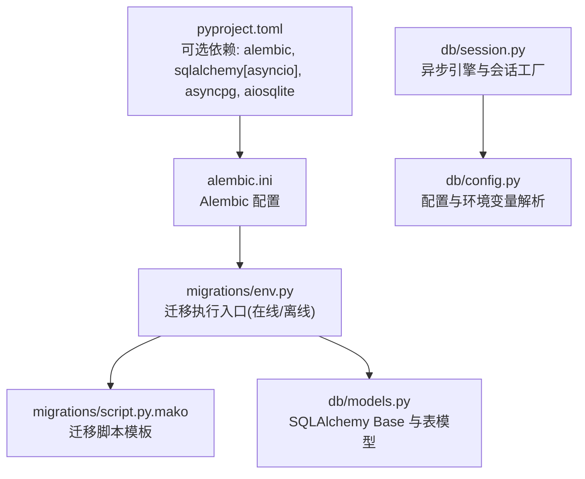
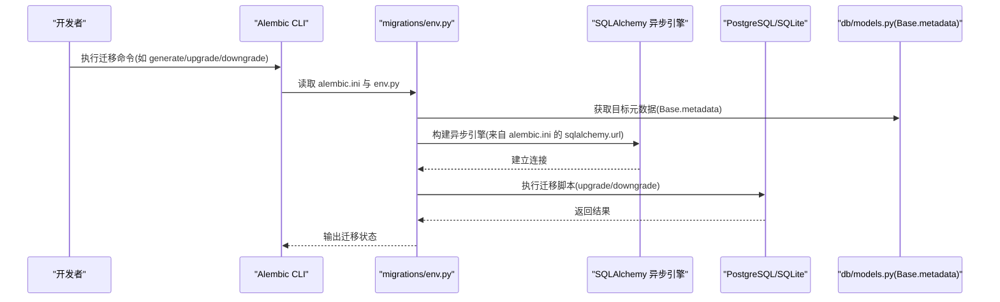
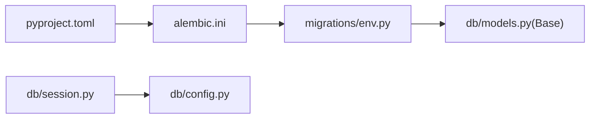

# 数据迁移管理

<cite>
**本文引用的文件**   
- [alembic.ini](file://alembic.ini)
- [env.py](file://hushai/meditation/db/migrations/env.py)
- [script.py.mako](file://hushai/meditation/db/migrations/script.py.mako)
- [models.py](file://hushai/meditation/db/models.py)
- [session.py](file://hushai/meditation/db/session.py)
- [config.py](file://hushai/meditation/db/config.py)
- [pyproject.toml](file://pyproject.toml)
</cite>

## 目录
1. [简介](#简介)
2. [项目结构](#项目结构)
3. [核心组件](#核心组件)
4. [架构总览](#架构总览)
5. [详细组件分析](#详细组件分析)
6. [依赖关系分析](#依赖关系分析)
7. [性能考虑](#性能考虑)
8. [故障排查指南](#故障排查指南)
9. [结论](#结论)
10. [附录](#附录)

## 简介
本文件为 hush.ai 的“冥想模块”提供全面的数据迁移管理文档，覆盖 Alembic 迁移工具的配置与使用、迁移脚本编写规范、版本控制与回滚策略、生产环境部署流程、复杂迁移场景处理方案、分支管理与冲突解决、迁移测试与验证方法，以及面向数据库管理员的安全与恢复指南。目标是帮助开发者与 DBA 在生产环境中安全、可控地演进数据库结构。

## 项目结构
本项目采用模块化组织方式，Alembic 迁移配置位于根级 alembic.ini，迁移脚本模板与运行入口位于 meditation 子模块内；ORM 模型集中定义于 models.py，异步会话与引擎初始化在 session.py 中完成，配置通过 config.py 加载环境变量。

图表来源
- [alembic.ini:1-37](file://alembic.ini#L1-L37)
- [env.py:1-52](file://hushai/meditation/db/migrations/env.py#L1-L52)
- [script.py.mako:1-26](file://hushai/meditation/db/migrations/script.py.mako#L1-L26)
- [models.py:1-434](file://hushai/meditation/db/models.py#L1-L434)
- [session.py:1-83](file://hushai/meditation/db/session.py#L1-L83)
- [config.py:1-136](file://hushai/meditation/db/config.py#L1-L136)
- [pyproject.toml:51-69](file://pyproject.toml#L51-L69)

章节来源
- [alembic.ini:1-37](file://alembic.ini#L1-L37)
- [env.py:1-52](file://hushai/meditation/db/migrations/env.py#L1-L52)
- [script.py.mako:1-26](file://hushai/meditation/db/migrations/script.py.mako#L1-L26)
- [models.py:1-434](file://hushai/meditation/db/models.py#L1-L434)
- [session.py:1-83](file://hushai/meditation/db/session.py#L1-L83)
- [config.py:1-136](file://hushai/meditation/db/config.py#L1-L136)
- [pyproject.toml:51-69](file://pyproject.toml#L51-L69)

## 核心组件
- Alembic 配置与日志：alembic.ini 指定迁移脚本位置、数据库连接字符串与日志级别。
- 迁移运行器：migrations/env.py 支持在线与离线模式，并基于 SQLAlchemy 异步引擎执行迁移。
- 迁移脚本模板：migrations/script.py.mako 生成 upgrade/downgrade 骨架。
- ORM 模型：db/models.py 定义所有表结构与索引，作为 target_metadata 的来源。
- 异步会话与引擎：db/session.py 负责解析数据库 URL、创建异步引擎与 SessionFactory，并提供 init_db 用于本地快速建表（非迁移）。
- 配置加载：db/config.py 从 .env 或环境变量加载数据库 URL 等参数。
- 依赖声明：pyproject.toml 包含 alembic、sqlalchemy[asyncio]、asyncpg、aiosqlite 等必要依赖。

章节来源
- [alembic.ini:1-37](file://alembic.ini#L1-L37)
- [env.py:1-52](file://hushai/meditation/db/migrations/env.py#L1-L52)
- [script.py.mako:1-26](file://hushai/meditation/db/migrations/script.py.mako#L1-L26)
- [models.py:1-434](file://hushai/meditation/db/models.py#L1-L434)
- [session.py:1-83](file://hushai/meditation/db/session.py#L1-L83)
- [config.py:1-136](file://hushai/meditation/db/config.py#L1-L136)
- [pyproject.toml:51-69](file://pyproject.toml#L51-L69)

## 架构总览
下图展示了 Alembic 在项目中如何与 SQLAlchemy 异步引擎、ORM 模型及配置文件协作，完成迁移的生成与执行。

图表来源
- [alembic.ini:1-37](file://alembic.ini#L1-L37)
- [env.py:1-52](file://hushai/meditation/db/migrations/env.py#L1-L52)
- [models.py:1-434](file://hushai/meditation/db/models.py#L1-L434)

## 详细组件分析

### Alembic 配置与运行入口
- 脚本位置与数据库 URL：alembic.ini 指定 script_location 与 sqlalchemy.url，确保迁移脚本存放路径与连接串正确。
- 日志级别：对 alembic 与 sqlalchemy.engine 设置 WARN/INFO，便于问题定位。
- 在线/离线模式：env.py 根据 context.is_offline_mode() 选择 run_migrations_offline 或 run_migrations_online。
- 异步执行：run_async_migrations 使用 async_engine_from_config 构建引擎并通过 connection.run_sync 调用同步迁移函数。

章节来源
- [alembic.ini:1-37](file://alembic.ini#L1-L37)
- [env.py:1-52](file://hushai/meditation/db/migrations/env.py#L1-L52)

### 迁移脚本模板
- 模板字段：revision、down_revision、branch_labels、depends_on、upgrade、downgrade。
- 默认实现：upgrade/downgrade 默认为 pass，需手动填充具体变更逻辑。

章节来源
- [script.py.mako:1-26](file://hushai/meditation/db/migrations/script.py.mako#L1-L26)

### ORM 模型与元数据
- Base 类：DeclarativeBase 子类，作为 Alembic 的目标元数据来源。
- 表与索引：各模型定义主键、外键、唯一约束与复合索引，例如 memories 与 daily_progress 的复合索引。
- 时间戳与 JSON：广泛使用带时区的 DateTime 与 JSON 列，便于审计与扩展。

章节来源
- [models.py:1-434](file://hushai/meditation/db/models.py#L1-L434)

### 异步会话与引擎
- URL 解析：优先使用 MEDITATION_POSTGRES_URL，未设置则回退到 SQLite 本地文件。
- 驱动适配：自动将 postgresql:// 转换为 postgresql+asyncpg://，sqlite 转为 sqlite+aiosqlite。
- 引擎与工厂：get_engine 与 get_session_factory 提供单例式异步引擎与 SessionFactory。
- 本地建表：init_db 使用 Base.metadata.create_all 快速建表（仅开发/测试用途，不替代迁移）。

章节来源
- [session.py:1-83](file://hushai/meditation/db/session.py#L1-L83)
- [config.py:1-136](file://hushai/meditation/db/config.py#L1-L136)

### 依赖与可选功能
- 可选依赖组 meditation 包含 alembic、sqlalchemy[asyncio]、asyncpg、aiosqlite 等，确保迁移与异步运行所需库可用。

章节来源
- [pyproject.toml:51-69](file://pyproject.toml#L51-L69)

## 依赖关系分析
- Alembic 依赖 alembic.ini 中的 sqlalchemy.url 与 script_location。
- env.py 依赖 models.py 的 Base.metadata 以生成差异。
- session.py 与 config.py 共同决定运行时数据库连接，但迁移执行由 alembic.ini 的 sqlalchemy.url 控制，二者可独立配置。

图表来源
- [alembic.ini:1-37](file://alembic.ini#L1-L37)
- [env.py:1-52](file://hushai/meditation/db/migrations/env.py#L1-L52)
- [models.py:1-434](file://hushai/meditation/db/models.py#L1-L434)
- [session.py:1-83](file://hushai/meditation/db/session.py#L1-L83)
- [config.py:1-136](file://hushai/meditation/db/config.py#L1-L136)
- [pyproject.toml:51-69](file://pyproject.toml#L51-L69)

## 性能考虑
- 大表变更：避免在高峰时段执行 ALTER TABLE 加锁操作；必要时分阶段进行（先新增列/索引，再回填数据，最后切换应用逻辑）。
- 索引策略：优先使用 CONCURRENTLY 风格（若数据库支持）或在低峰期创建索引；复合索引应覆盖高频查询条件。
- 批量更新：分批提交事务，降低锁持有时间与内存占用。
- 连接池：迁移使用 NullPool 减少连接竞争，适合一次性任务。

## 故障排查指南
- 连接失败：检查 alembic.ini 的 sqlalchemy.url 是否正确，确认网络与凭据。
- 权限不足：确保迁移用户具备 DDL 权限（CREATE/ALTER/DROP 表与索引）。
- 迁移冲突：查看 revision 链与 down_revision，必要时使用 branch_labels 或 depends_on 显式声明依赖。
- 回滚失败：确保 downgrade 逻辑完整且幂等；对不可逆变更建议保留备份与人工审批。
- 日志定位：提高 alembic 与 sqlalchemy.engine 日志级别，捕获 SQL 语句与错误堆栈。

## 结论
通过统一的 Alembic 配置、异步迁移执行与清晰的 ORM 模型定义，hush.ai 的冥想模块实现了可追踪、可回滚、可扩展的数据库演进能力。配合严格的编写规范、自动化流水线与人工审核机制，可在保证数据安全的前提下高效推进迭代。

## 附录

### 迁移脚本编写规范
- 命名与描述：message 清晰表达变更意图，便于评审与审计。
- 幂等性：upgrade/downgrade 应具备幂等特性，避免重复执行导致异常。
- 数据变更：
  - 使用事务包裹，确保一致性。
  - 大批量更新分批提交，避免长事务与锁竞争。
- 索引与约束：
  - 新增索引尽量在低峰期执行，必要时分步创建。
  - 修改约束前评估影响范围，准备回滚脚本。
- 兼容性：
  - 先扩后缩：先增加新字段/列，再逐步迁移数据，最后删除旧字段。
  - 避免破坏性变更直接上线，预留灰度窗口。

### 版本控制与回滚策略
- 线性历史：保持单一主线，避免过多分支；确需分支时使用 branch_labels 明确标识。
- 依赖声明：使用 depends_on 表达跨分支依赖，防止误序执行。
- 回滚原则：每个 upgrade 必须配套 downgrade；对不可逆操作记录人工回滚步骤。

### 生产环境部署流程
- 预检：
  - 在预发环境执行 alembic upgrade head，验证无异常。
  - 运行数据校验脚本，确保关键指标一致。
- 发布：
  - 停机或灰度发布期间执行迁移。
  - 监控慢查询与锁等待，必要时暂停并回滚。
- 回滚：
  - 若升级失败，立即执行 downgrade 至上一稳定版本。
  - 结合备份恢复数据，确保业务连续性。

### 复杂迁移场景处理方案
- 数据转换：
  - 增量迁移：按批次抽取、转换、写入，记录进度表。
  - 双写过渡：新旧字段并行写入，逐步切流。
- 表结构重构：
  - 新建表 -> 数据迁移 -> 切换外键与索引 -> 删除旧表。
- 性能优化：
  - 分区与归档：对历史数据进行分区或归档，提升查询性能。
  - 统计信息更新：迁移后更新统计信息，优化执行计划。

### 迁移冲突解决与分支管理
- 冲突识别：比较当前数据库头与代码头，使用 alembic current 与 alembic history 诊断。
- 合并策略：
  - 优先合并最新迁移，避免交叉修改同一对象。
  - 使用 merge 命令合并分支，生成合并迁移脚本。
- 分支规范：
  - 短生命周期分支，及时合入主干。
  - 分支标签与注释清晰，便于追溯。

### 迁移测试与验证方法
- 单元测试：
  - 使用 SQLite 或内存数据库模拟，验证迁移脚本语法与基本逻辑。
- 集成测试：
  - 在隔离数据库中执行 upgrade/downgrade，校验表结构与数据完整性。
- 数据校验：
  - 对比关键字段分布、计数与聚合值，确保迁移前后一致。
- 回归测试：
  - 运行核心 API 与后台任务，确保业务不受影响。

### 数据库管理员安全指南与故障恢复
- 最小权限：迁移账号仅授予必要 DDL/DML 权限。
- 审计与留痕：开启数据库审计，记录迁移执行者与时间。
- 备份与快照：
  - 迁移前创建全量备份或快照。
  - 保留最近 N 次迁移的脚本与元数据。
- 应急恢复：
  - 若迁移失败，优先回滚至上一稳定版本。
  - 无法回滚时，使用备份恢复，并重新执行已验证的迁移序列。