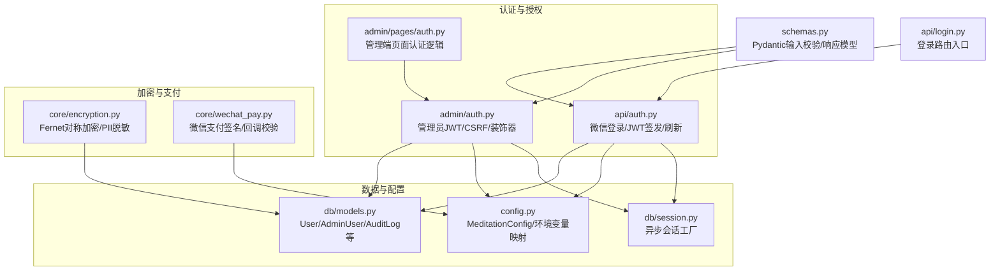
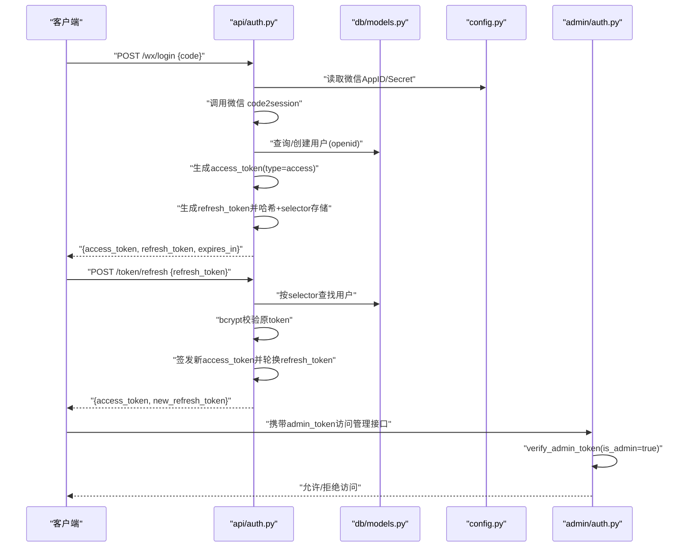
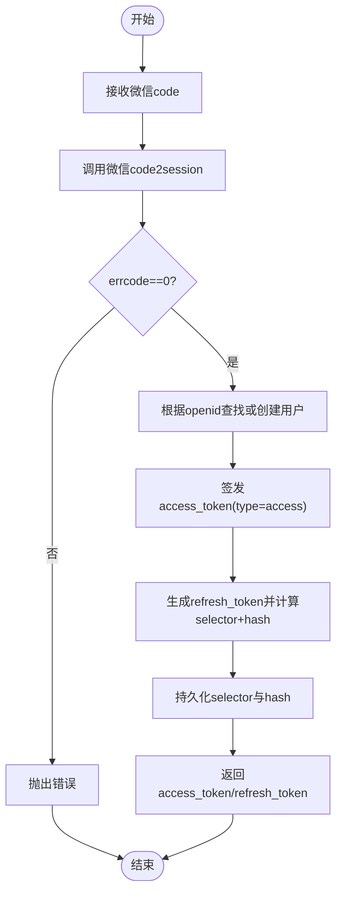
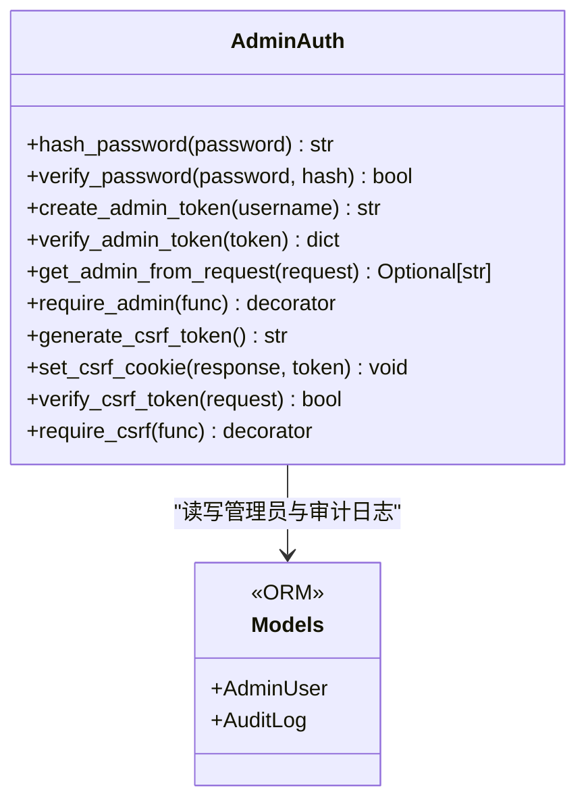
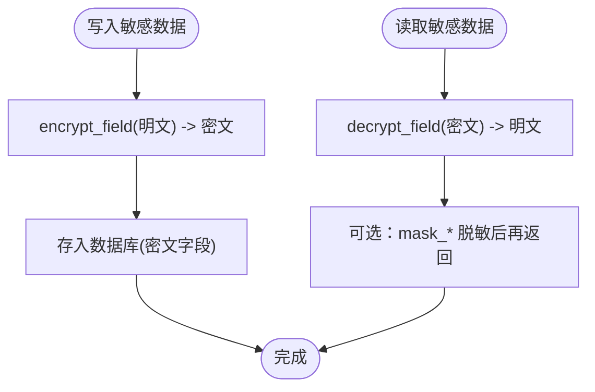
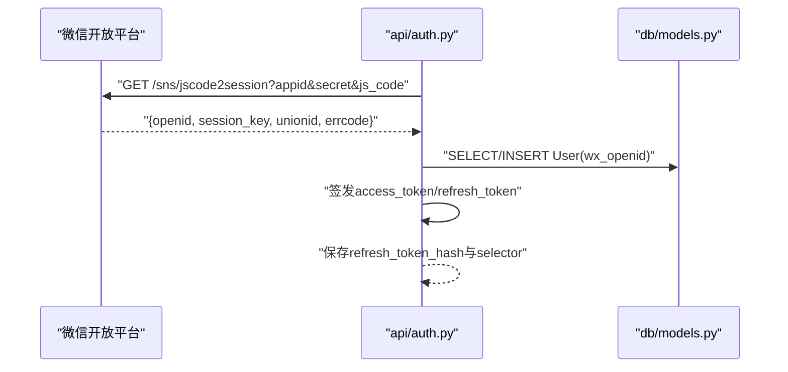
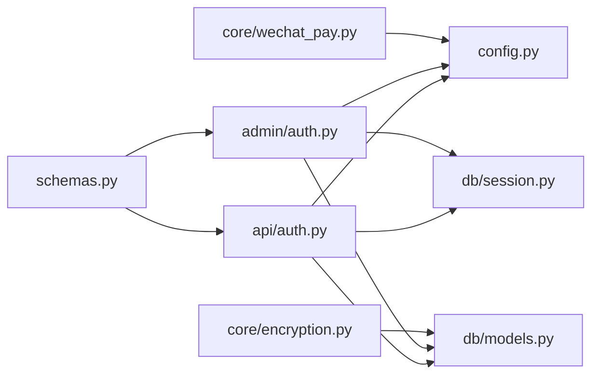

# 安全架构设计

<cite>
**本文引用的文件**   
- [hushai/meditation/api/auth.py](file://hushai/meditation/api/auth.py)
- [hushai/meditation/admin/auth.py](file://hushai/meditation/admin/auth.py)
- [hushai/meditation/core/encryption.py](file://hushai/meditation/core/encryption.py)
- [hushai/meditation/db/models.py](file://hushai/meditation/db/models.py)
- [hushai/meditation/config.py](file://hushai/meditation/config.py)
- [hushai/meditation/schemas.py](file://hushai/meditation/schemas.py)
- [hushai/meditation/api/login.py](file://hushai/meditation/api/login.py)
- [hushai/meditation/admin/pages/auth.py](file://hushai/meditation/admin/pages/auth.py)
- [hushai/meditation/core/wechat_pay.py](file://hushai/meditation/core/wechat_pay.py)
- [hushai/meditation/db/session.py](file://hushai/meditation/db/session.py)
</cite>

## 目录
1. [简介](#简介)
2. [项目结构](#项目结构)
3. [核心组件](#核心组件)
4. [架构总览](#架构总览)
5. [详细组件分析](#详细组件分析)
6. [依赖关系分析](#依赖关系分析)
7. [性能与安全权衡](#性能与安全权衡)
8. [故障排查指南](#故障排查指南)
9. [结论](#结论)
10. [附录：最佳实践与防护清单](#附录最佳实践与防护清单)

## 简介
本文件面向 hush.ai 的安全架构，聚焦以下方面：
- JWT Token 认证机制的实现原理与安全考虑（用户端与管理端）
- 管理员权限控制系统的设计（角色、权限验证、访问控制策略）
- 数据加密存储方案（敏感字段保护与传输安全）
- 安全过滤机制（输入校验、输出清洗、恶意请求防护）
- 微信登录集成与第三方认证处理流程
- 安全最佳实践与常见攻击防护措施

## 项目结构
围绕安全相关的关键模块分布如下：
- 用户认证与微信登录：api/auth.py、api/login.py、schemas.py
- 管理端认证与 CSRF：admin/auth.py、admin/pages/auth.py
- 数据加密与脱敏：core/encryption.py
- 数据库模型与审计日志：db/models.py
- 配置中心与环境变量：config.py
- 微信支付签名与回调：core/wechat_pay.py
- 异步会话工厂：db/session.py

图示来源
- [hushai/meditation/api/auth.py:1-171](file://hushai/meditation/api/auth.py#L1-L171)
- [hushai/meditation/admin/auth.py:1-183](file://hushai/meditation/admin/auth.py#L1-L183)
- [hushai/meditation/admin/pages/auth.py](file://hushai/meditation/admin/pages/auth.py)
- [hushai/meditation/db/models.py:1-434](file://hushai/meditation/db/models.py#L1-L434)
- [hushai/meditation/config.py:1-136](file://hushai/meditation/config.py#L1-L136)
- [hushai/meditation/core/encryption.py:1-79](file://hushai/meditation/core/encryption.py#L1-L79)
- [hushai/meditation/core/wechat_pay.py](file://hushai/meditation/core/wechat_pay.py)
- [hushai/meditation/schemas.py:1-541](file://hushai/meditation/schemas.py#L1-L541)
- [hushai/meditation/api/login.py](file://hushai/meditation/api/login.py)
- [hushai/meditation/db/session.py](file://hushai/meditation/db/session.py)

章节来源
- [hushai/meditation/api/auth.py:1-171](file://hushai/meditation/api/auth.py#L1-L171)
- [hushai/meditation/admin/auth.py:1-183](file://hushai/meditation/admin/auth.py#L1-L183)
- [hushai/meditation/core/encryption.py:1-79](file://hushai/meditation/core/encryption.py#L1-L79)
- [hushai/meditation/db/models.py:1-434](file://hushai/meditation/db/models.py#L1-L434)
- [hushai/meditation/config.py:1-136](file://hushai/meditation/config.py#L1-L136)
- [hushai/meditation/schemas.py:1-541](file://hushai/meditation/schemas.py#L1-L541)
- [hushai/meditation/api/login.py](file://hushai/meditation/api/login.py)
- [hushai/meditation/admin/pages/auth.py](file://hushai/meditation/admin/pages/auth.py)
- [hushai/meditation/core/wechat_pay.py](file://hushai/meditation/core/wechat_pay.py)
- [hushai/meditation/db/session.py](file://hushai/meditation/db/session.py)

## 核心组件
- 用户认证与微信登录
  - 通过微信 code 换取 session_key/openid，创建或更新用户记录，签发短期 access token 与长期 refresh token。
  - refresh token 以 bcrypt 哈希存储，并使用 SHA-256 selector 做 O(1) 定位，避免全表扫描导致的 DoS 风险。
  - access token 强制类型声明为 access，防止未来引入 refresh JWT 时发生类型混淆。
- 管理端认证与 CSRF
  - 管理员凭据校验后签发带 is_admin 标志的 JWT；提供 require_admin 装饰器进行访问控制。
  - 基于 Cookie + Header 的 CSRF 令牌校验，生产环境启用 secure 且 SameSite=strict。
- 数据加密与脱敏
  - 使用 Fernet 对敏感字段（如服务记录的 summary、counselor_notes）进行对称加密；提供手机号、身份证、姓名脱敏函数。
- 输入校验与响应模型
  - 通过 Pydantic 模型对请求参数进行长度、格式、枚举值等强约束，减少注入与越权风险。
- 微信支付安全
  - 在支付流程中执行签名与回调验签，确保交易完整性与不可抵赖性。

章节来源
- [hushai/meditation/api/auth.py:1-171](file://hushai/meditation/api/auth.py#L1-L171)
- [hushai/meditation/admin/auth.py:1-183](file://hushai/meditation/admin/auth.py#L1-L183)
- [hushai/meditation/core/encryption.py:1-79](file://hushai/meditation/core/encryption.py#L1-L79)
- [hushai/meditation/schemas.py:1-541](file://hushai/meditation/schemas.py#L1-L541)
- [hushai/meditation/core/wechat_pay.py](file://hushai/meditation/core/wechat_pay.py)

## 架构总览
下图展示从微信登录到签发 JWT、刷新 token、以及管理端鉴权的整体流程。

图示来源
- [hushai/meditation/api/auth.py:63-164](file://hushai/meditation/api/auth.py#L63-L164)
- [hushai/meditation/admin/auth.py:64-101](file://hushai/meditation/admin/auth.py#L64-L101)
- [hushai/meditation/config.py:18-62](file://hushai/meditation/config.py#L18-L62)
- [hushai/meditation/db/models.py:37-67](file://hushai/meditation/db/models.py#L37-L67)

## 详细组件分析

### 用户认证与微信登录（JWT 与 Refresh Token）
- 实现要点
  - 微信登录：通过 httpx 调用微信 code2session，获取 openid/session_key/unionid；若用户不存在则自动注册。
  - Access Token：包含 sub/exp/iat/type=access，使用配置的 jwt_secret 与算法签发，有效期较短。
  - Refresh Token：随机字符串，存储其 bcrypt 哈希与 SHA-256 selector；刷新时先按 selector 定位用户，再 bcrypt 校验，避免全表比对。
  - 类型保护：verify_token 强制要求 type=access，防止未来引入 refresh JWT 时的类型混淆。
- 安全考量
  - 短生命周期 access token 降低泄露影响面。
  - refresh token 不直接落库明文，采用哈希+selector 双重保障，兼顾性能与安全性。
  - 仅当用户 is_active=True 时才允许登录与刷新。
- 关键路径参考
  - 登录与签发：[hushai/meditation/api/auth.py:63-106](file://hushai/meditation/api/auth.py#L63-L106)
  - 校验 access token：[hushai/meditation/api/auth.py:109-118](file://hushai/meditation/api/auth.py#L109-L118)
  - 刷新 access token：[hushai/meditation/api/auth.py:134-164](file://hushai/meditation/api/auth.py#L134-L164)

图示来源
- [hushai/meditation/api/auth.py:63-106](file://hushai/meditation/api/auth.py#L63-L106)
- [hushai/meditation/db/models.py:37-67](file://hushai/meditation/db/models.py#L37-L67)

章节来源
- [hushai/meditation/api/auth.py:1-171](file://hushai/meditation/api/auth.py#L1-L171)
- [hushai/meditation/db/models.py:37-67](file://hushai/meditation/db/models.py#L37-L67)

### 管理端认证与访问控制（RBAC 基础）
- 实现要点
  - 管理员凭据校验：从数据库加载 is_active=True 的管理员，使用 bcrypt 校验密码。
  - 管理员 JWT：payload 中包含 is_admin=true，用于后续中间件快速判定。
  - 访问控制：require_admin 装饰器从 Cookie 或 Authorization 头提取 token，校验失败返回 401。
  - CSRF 保护：generate_csrf_token/set_csrf_cookie/verify_csrf_token 配合 require_csrf 装饰器，生产环境启用 secure 与 SameSite=strict。
- 安全考量
  - 管理员 token 与普通用户 token 分离，避免权限提升。
  - CSRF 防御针对表单型提交，结合 strict 同站策略降低跨站伪造风险。
- 关键路径参考
  - 管理员凭据校验与初始化：[hushai/meditation/admin/auth.py:32-54](file://hushai/meditation/admin/auth.py#L32-L54)、[hushai/meditation/admin/auth.py:116-133](file://hushai/meditation/admin/auth.py#L116-L133)
  - 管理员 JWT 签发与校验：[hushai/meditation/admin/auth.py:64-84](file://hushai/meditation/admin/auth.py#L64-L84)
  - 访问控制装饰器：[hushai/meditation/admin/auth.py:104-113](file://hushai/meditation/admin/auth.py#L104-L113)
  - CSRF 工具与装饰器：[hushai/meditation/admin/auth.py:136-182](file://hushai/meditation/admin/auth.py#L136-L182)

图示来源
- [hushai/meditation/admin/auth.py:24-182](file://hushai/meditation/admin/auth.py#L24-L182)
- [hushai/meditation/db/models.py:172-202](file://hushai/meditation/db/models.py#L172-L202)

章节来源
- [hushai/meditation/admin/auth.py:1-183](file://hushai/meditation/admin/auth.py#L1-L183)
- [hushai/meditation/db/models.py:172-202](file://hushai/meditation/db/models.py#L172-L202)

### 数据加密存储与 PII 脱敏
- 实现要点
  - 使用 Fernet 对称加密，密钥从环境变量 MEDITATION_ENCRYPTION_KEY 获取；未配置时自动生成（开发环境）。
  - 敏感字段：ServiceRecord.summary/counselor_notes 使用 encrypt_field/decrypt_field 处理。
  - PII 脱敏：mask_phone/mask_id_number/mask_name 用于对外展示时遮蔽敏感信息。
- 安全考量
  - 生产环境必须显式配置加密密钥，禁止使用运行时生成的临时密钥。
  - 解密失败时回退为密文，避免异常泄露内部状态。
- 关键路径参考
  - 加密/解密与脱敏函数：[hushai/meditation/core/encryption.py:18-73](file://hushai/meditation/core/encryption.py#L18-L73)
  - 敏感字段模型定义：[hushai/meditation/db/models.py:386-411](file://hushai/meditation/db/models.py#L386-L411)

图示来源
- [hushai/meditation/core/encryption.py:31-73](file://hushai/meditation/core/encryption.py#L31-L73)
- [hushai/meditation/db/models.py:386-411](file://hushai/meditation/db/models.py#L386-L411)

章节来源
- [hushai/meditation/core/encryption.py:1-79](file://hushai/meditation/core/encryption.py#L1-L79)
- [hushai/meditation/db/models.py:386-411](file://hushai/meditation/db/models.py#L386-L411)

### 输入校验与输出清洗（Pydantic 模型）
- 实现要点
  - 所有外部输入均通过 Pydantic 模型进行强类型校验，包括长度限制、枚举值、数值范围等。
  - 示例：ChatRequest.message 限制最大长度；SkillImportItem.name/content 进行 strip；CounselorApplyRequest.hourly_rate 非负。
- 安全考量
  - 通过最小化可接受输入集合，有效缓解注入、超长缓冲、非法枚举等风险。
  - 对列表类参数进行去重与上限控制，避免资源耗尽。
- 关键路径参考
  - 聊天与知识导入模型：[hushai/meditation/schemas.py:24-51](file://hushai/meditation/schemas.py#L24-L51)、[hushai/meditation/schemas.py:110-147](file://hushai/meditation/schemas.py#L110-L147)
  - 咨询师申请与更新：[hushai/meditation/schemas.py:328-347](file://hushai/meditation/schemas.py#L328-L347)

章节来源
- [hushai/meditation/schemas.py:1-541](file://hushai/meditation/schemas.py#L1-L541)

### 微信登录集成与第三方认证处理
- 实现要点
  - 使用 httpx 异步客户端调用微信 code2session，设置超时时间，避免阻塞。
  - 严格校验 errcode 与 openid 存在性，失败即抛出明确错误。
  - 首次登录自动注册用户，后续登录更新 session_key 与 unionid。
- 安全考量
  - 使用 HTTPS 与超时保护，避免中间人攻击与慢速攻击。
  - 将 session_key 作为敏感数据存储，建议加密（当前模型支持存储，可在业务层按需加密）。
- 关键路径参考
  - 微信登录流程：[hushai/meditation/api/auth.py:63-106](file://hushai/meditation/api/auth.py#L63-L106)
  - 登录路由入口：[hushai/meditation/api/login.py](file://hushai/meditation/api/login.py)

图示来源
- [hushai/meditation/api/auth.py:63-106](file://hushai/meditation/api/auth.py#L63-L106)
- [hushai/meditation/db/models.py:37-67](file://hushai/meditation/db/models.py#L37-L67)

章节来源
- [hushai/meditation/api/auth.py:1-171](file://hushai/meditation/api/auth.py#L1-L171)
- [hushai/meditation/api/login.py](file://hushai/meditation/api/login.py)
- [hushai/meditation/db/models.py:37-67](file://hushai/meditation/db/models.py#L37-L67)

### 微信支付安全（签名与回调）
- 实现要点
  - 在发起支付前对订单信息进行签名，确保请求完整性。
  - 回调通知需验签并核对金额、订单号等关键字段，防止篡改与重复通知。
- 安全考量
  - 使用商户私钥与证书，严格校验回调来源与签名。
  - 幂等处理：同一订单多次回调应保持一致结果。
- 关键路径参考
  - 支付核心逻辑：[hushai/meditation/core/wechat_pay.py](file://hushai/meditation/core/wechat_pay.py)

章节来源
- [hushai/meditation/core/wechat_pay.py](file://hushai/meditation/core/wechat_pay.py)

## 依赖关系分析
- 组件耦合
  - api/auth.py 依赖 config.py（JWT/微信配置）、db/models.py（用户模型）、httpx（微信 API）。
  - admin/auth.py 依赖 config.py、db/models.py、db/session.py（会话工厂），并提供 FastAPI 装饰器。
  - core/encryption.py 被业务层用于敏感字段加解密，依赖 cryptography.Fernet。
  - schemas.py 被各 API 层复用，统一输入校验与响应结构。
- 外部依赖
  - 微信开放平台 API（登录、支付）
  - 数据库（PostgreSQL，通过 SQLAlchemy 异步会话）
  - 加密库（cryptography）
- 潜在循环依赖
  - 当前模块划分清晰，未见明显循环导入；建议在新增模块时保持单向依赖。

图示来源
- [hushai/meditation/api/auth.py:1-171](file://hushai/meditation/api/auth.py#L1-L171)
- [hushai/meditation/admin/auth.py:1-183](file://hushai/meditation/admin/auth.py#L1-L183)
- [hushai/meditation/core/encryption.py:1-79](file://hushai/meditation/core/encryption.py#L1-L79)
- [hushai/meditation/db/models.py:1-434](file://hushai/meditation/db/models.py#L1-L434)
- [hushai/meditation/config.py:1-136](file://hushai/meditation/config.py#L1-L136)
- [hushai/meditation/schemas.py:1-541](file://hushai/meditation/schemas.py#L1-L541)
- [hushai/meditation/core/wechat_pay.py](file://hushai/meditation/core/wechat_pay.py)
- [hushai/meditation/db/session.py](file://hushai/meditation/db/session.py)

章节来源
- [hushai/meditation/api/auth.py:1-171](file://hushai/meditation/api/auth.py#L1-L171)
- [hushai/meditation/admin/auth.py:1-183](file://hushai/meditation/admin/auth.py#L1-L183)
- [hushai/meditation/core/encryption.py:1-79](file://hushai/meditation/core/encryption.py#L1-L79)
- [hushai/meditation/db/models.py:1-434](file://hushai/meditation/db/models.py#L1-L434)
- [hushai/meditation/config.py:1-136](file://hushai/meditation/config.py#L1-L136)
- [hushai/meditation/schemas.py:1-541](file://hushai/meditation/schemas.py#L1-L541)
- [hushai/meditation/core/wechat_pay.py](file://hushai/meditation/core/wechat_pay.py)
- [hushai/meditation/db/session.py](file://hushai/meditation/db/session.py)

## 性能与安全权衡
- Refresh Token 刷新性能
  - 通过 selector 索引定位用户，再进行 bcrypt 校验，避免全表扫描带来的 DoS 风险。
- JWT 校验开销
  - HS256 对称签名校验成本低，适合高频校验；注意密钥管理与轮换策略。
- 加密/解密成本
  - Fernet 对称加密开销较小，但应避免在热路径频繁加解密；建议缓存必要上下文并在边界处集中处理。
- 输入校验
  - Pydantic 校验在入口处进行，有助于尽早拒绝恶意请求，降低后端处理成本。

## 故障排查指南
- 微信登录失败
  - 检查 appid/secret 配置是否正确，确认网络连通性与超时设置。
  - 关注 errcode 与 errmsg，定位具体失败原因。
  - 参考：[hushai/meditation/api/auth.py:63-81](file://hushai/meditation/api/auth.py#L63-L81)
- Token 无效或类型错误
  - verify_token 会校验算法与类型，确认客户端传递的是 access token 而非其他类型。
  - 参考：[hushai/meditation/api/auth.py:109-118](file://hushai/meditation/api/auth.py#L109-L118)
- Refresh Token 无效或已过期
  - 检查 selector 是否存在、is_active 是否为 True、bcrypt 校验是否通过。
  - 参考：[hushai/meditation/api/auth.py:134-164](file://hushai/meditation/api/auth.py#L134-L164)
- 管理端 401/403
  - 确认 admin_token 是否有效且 is_admin=true；检查 CSRF 令牌是否匹配。
  - 参考：[hushai/meditation/admin/auth.py:76-113](file://hushai/meditation/admin/auth.py#L76-L113)、[hushai/meditation/admin/auth.py:164-182](file://hushai/meditation/admin/auth.py#L164-L182)
- 加密解密异常
  - 检查 MEDITATION_ENCRYPTION_KEY 是否配置；解密失败会返回密文，需在上层判断。
  - 参考：[hushai/meditation/core/encryption.py:39-48](file://hushai/meditation/core/encryption.py#L39-L48)

章节来源
- [hushai/meditation/api/auth.py:63-164](file://hushai/meditation/api/auth.py#L63-L164)
- [hushai/meditation/admin/auth.py:76-182](file://hushai/meditation/admin/auth.py#L76-L182)
- [hushai/meditation/core/encryption.py:39-48](file://hushai/meditation/core/encryption.py#L39-L48)

## 结论
hush.ai 的安全架构围绕“最小权限、纵深防御、默认安全”展开：
- 用户侧采用短期 access token 与安全的 refresh token 机制，结合微信 OAuth 完成身份核验。
- 管理端采用独立 JWT 与 CSRF 保护，配合装饰器实现细粒度访问控制。
- 敏感数据通过 Fernet 对称加密存储，并提供 PII 脱敏能力。
- 输入校验全面覆盖，降低注入与越权风险。
- 微信支付遵循签名与回调验签规范，保障交易安全。

## 附录：最佳实践与防护清单
- 密钥与配置
  - 生产环境必须显式配置 MEDITATION_JWT_SECRET、MEDITATION_ENCRYPTION_KEY、微信与支付密钥。
  - 定期轮换密钥，并建立密钥版本管理机制。
- 认证与会话
  - 强制使用 HTTPS；合理设置 token 过期时间与刷新策略。
  - 对登录与刷新接口实施速率限制与异常告警。
- 权限与访问控制
  - 管理端接口统一使用 require_admin 装饰器；必要时扩展 RBAC（角色-资源-操作）矩阵。
  - 审计日志记录关键操作（增删改查、登录登出、支付回调）。
- 数据安全
  - 对所有敏感字段进行加密存储；对外展示进行脱敏。
  - 数据库层面启用透明加密与备份加密。
- 输入与输出
  - 所有外部输入经 Pydantic 校验；输出遵循白名单字段原则。
  - 对富文本与 Markdown 内容做安全解析与转义。
- 第三方集成
  - 微信与支付回调均需验签与幂等处理；记录完整审计轨迹。
  - 对外部 API 调用设置超时与重试上限，避免雪崩。
- 监控与合规
  - 建立安全事件告警（异常登录、频繁刷新、支付异常）。
  - 定期进行安全评估与渗透测试，持续改进。