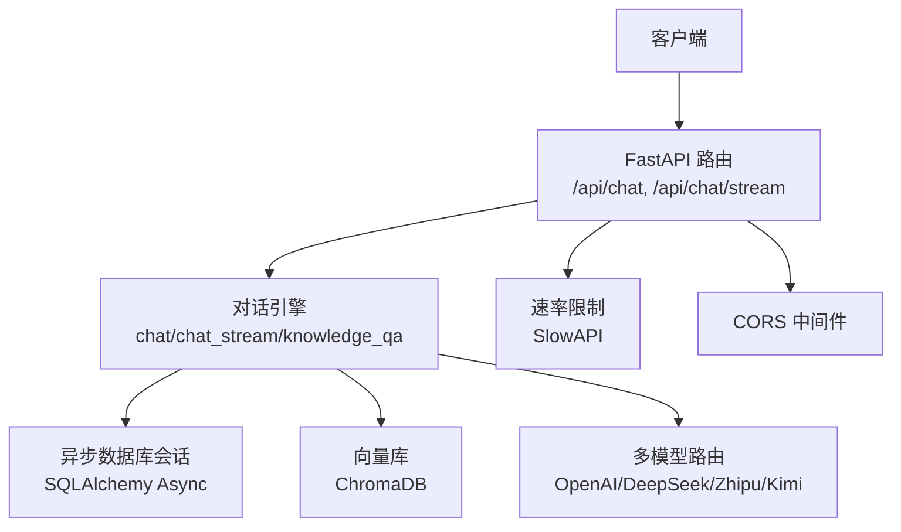
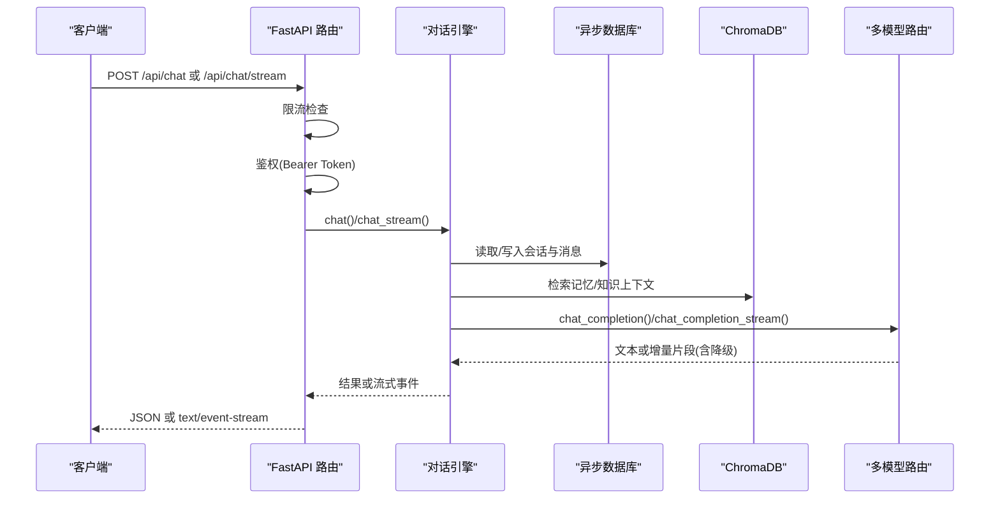
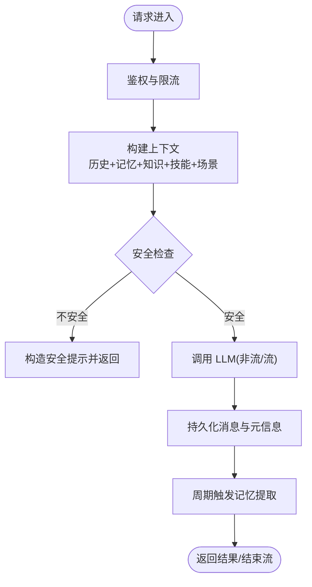
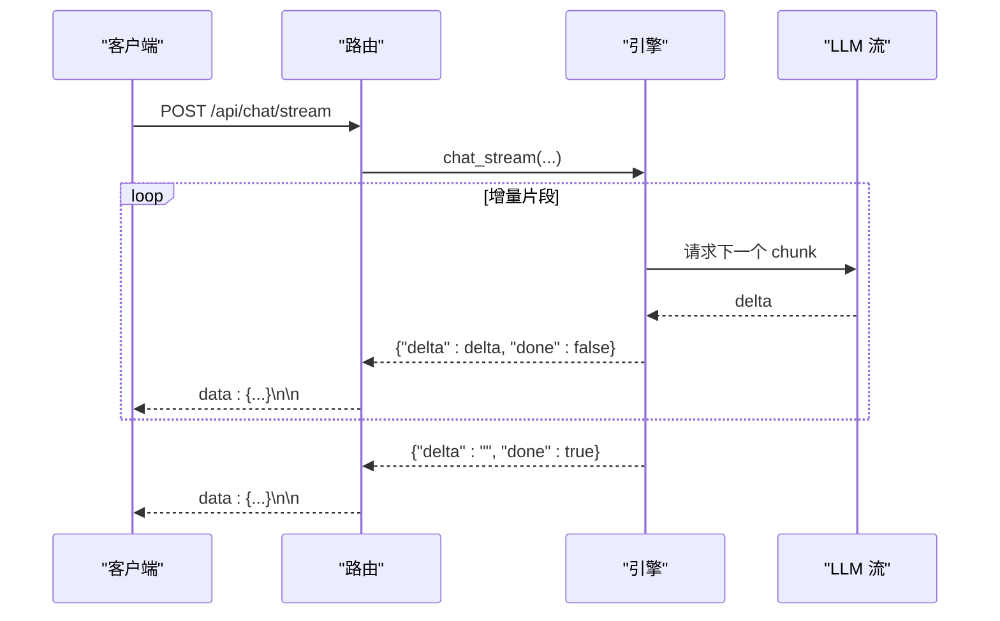
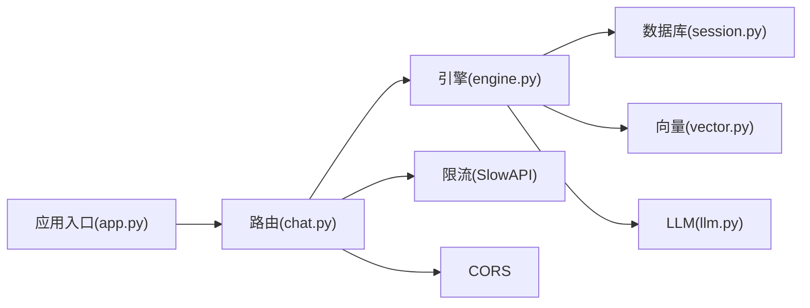

# 性能架构设计

<cite>
**本文引用的文件**
- [app.py](file://hushai/meditation/app.py)
- [config.py](file://hushai/meditation/config.py)
- [session.py](file://hushai/meditation/db/session.py)
- [engine.py](file://hushai/meditation/core/engine.py)
- [chat.py](file://hushai/meditation/api/chat.py)
- [llm.py](file://hushai/meditation/core/llm.py)
- [memory.py](file://hushai/meditation/core/memory.py)
- [knowledge.py](file://hushai/meditation/core/knowledge.py)
- [vector.py](file://hushai/meditation/db/vector.py)
</cite>

## 目录
1. [简介](#简介)
2. [项目结构](#项目结构)
3. [核心组件](#核心组件)
4. [架构总览](#架构总览)
5. [详细组件分析](#详细组件分析)
6. [依赖关系分析](#依赖关系分析)
7. [性能考量](#性能考量)
8. [故障排查指南](#故障排查指南)
9. [结论](#结论)
10. [附录](#附录)

## 简介
本文件面向 hush.ai 的性能架构设计与优化，聚焦以下方面：
- 异步编程模型与并发处理（FastAPI + Uvicorn + SQLAlchemy Async）
- 缓存策略（内存、数据库查询优化、响应级缓存）
- 流式通信机制（SSE）的实现与优化
- 资源管理与连接池配置（数据库连接池、外部 API 调用）
- 性能监控指标与瓶颈分析方法
- 性能调优建议与最佳实践

## 项目结构
本项目采用“应用入口 + 路由层 + 业务引擎 + 数据访问”的分层组织方式。关键路径如下：
- 应用入口：创建 FastAPI 实例、注册中间件与路由、生命周期管理
- 路由层：认证鉴权、限流、请求校验、返回结构化响应或 SSE 流
- 业务引擎：对话编排、记忆提取、知识检索、安全校验、会话持久化
- 数据访问：异步数据库会话、向量库（ChromaDB）、多 LLM 提供商路由与降级

图示来源
- [app.py:136-207](file://hushai/meditation/app.py#L136-L207)
- [chat.py:58-104](file://hushai/meditation/api/chat.py#L58-L104)
- [engine.py:166-314](file://hushai/meditation/core/engine.py#L166-L314)
- [session.py:34-54](file://hushai/meditation/db/session.py#L34-L54)
- [vector.py:61-78](file://hushai/meditation/db/vector.py#L61-L78)
- [llm.py:136-258](file://hushai/meditation/core/llm.py#L136-L258)

章节来源
- [app.py:1-228](file://hushai/meditation/app.py#L1-L228)
- [config.py:1-136](file://hushai/meditation/config.py#L1-L136)

## 核心组件
- 应用与生命周期
  - 使用 asynccontextmanager 管理启动/关闭阶段，初始化日志、数据库、默认管理员与种子数据
  - 注册 SlowAPI 限流器与 CORS 中间件
- 路由与鉴权
  - 基于 Header 的 Bearer Token 鉴权，统一错误码与限流
  - 提供同步与流式两种对话接口
- 对话引擎
  - 组装系统提示、历史消息、记忆上下文、知识库上下文、技能与场景上下文
  - 周期性触发记忆提取与标题补全
  - 支持非流式与流式两种模式
- 多模型路由与降级
  - 按优先级顺序尝试多个 LLM 提供商，失败自动降级
  - 调试模式下无 Key 时回退到模拟回复
- 数据与向量
  - 异步数据库会话与连接池
  - ChromaDB 集合用于知识与记忆的向量检索

章节来源
- [app.py:24-133](file://hushai/meditation/app.py#L24-L133)
- [chat.py:47-104](file://hushai/meditation/api/chat.py#L47-L104)
- [engine.py:91-127](file://hushai/meditation/core/engine.py#L91-L127)
- [llm.py:21-90](file://hushai/meditation/core/llm.py#L21-L90)
- [session.py:34-54](file://hushai/meditation/db/session.py#L34-L54)
- [vector.py:61-78](file://hushai/meditation/db/vector.py#L61-L78)

## 架构总览
下图展示了从请求进入至响应的完整链路，包括限流、鉴权、引擎编排、数据库与向量检索、LLM 调用与降级、以及 SSE 流式输出。

图示来源
- [chat.py:58-104](file://hushai/meditation/api/chat.py#L58-L104)
- [engine.py:166-314](file://hushai/meditation/core/engine.py#L166-L314)
- [llm.py:136-258](file://hushai/meditation/core/llm.py#L136-L258)
- [vector.py:104-127](file://hushai/meditation/db/vector.py#L104-L127)
- [session.py:57-61](file://hushai/meditation/db/session.py#L57-L61)

## 详细组件分析

### 异步编程模型与并发处理
- 应用入口
  - 使用 asynccontextmanager 在进程生命周期内完成数据库初始化与默认数据填充
  - 通过 Uvicorn 运行，启用工厂模式以复用应用实例
- 路由层
  - 所有路由函数均为 async，配合 FastAPI 的事件循环实现高并发
  - 使用 SlowAPI 对 IP 维度进行限流，避免突发流量压垮下游
- 数据访问
  - 使用 SQLAlchemy AsyncSession 与 async_sessionmaker，避免阻塞 I/O
  - 连接池大小根据后端类型动态设置（SQLite 较小，PostgreSQL 较大）
- 引擎层
  - 对话流程全部为异步：会话加载、记忆检索、知识检索、LLM 调用、结果持久化
  - 流式生成中通过异步迭代 LLM 增量内容并即时推送

图示来源
- [engine.py:166-314](file://hushai/meditation/core/engine.py#L166-L314)
- [chat.py:58-104](file://hushai/meditation/api/chat.py#L58-L104)
- [session.py:34-54](file://hushai/meditation/db/session.py#L34-L54)

章节来源
- [app.py:24-133](file://hushai/meditation/app.py#L24-L133)
- [chat.py:58-104](file://hushai/meditation/api/chat.py#L58-L104)
- [engine.py:166-314](file://hushai/meditation/core/engine.py#L166-L314)
- [session.py:34-54](file://hushai/meditation/db/session.py#L34-L54)

### 缓存策略设计
- 内存缓存
  - 当前代码未显式实现全局内存缓存；可通过在应用状态或模块级字典缓存热点配置、静态上下文等
- 数据库查询优化
  - 会话历史加载支持最大轮数限制，避免长上下文导致 LLM 成本与时延上升
  - 分页与计数分离查询，减少不必要的数据传输
- 响应缓存
  - 当前未实现 HTTP 层响应缓存；可结合反向代理（如 Nginx/Cloudflare）或应用层缓存（Redis）对只读接口做缓存
- 向量检索
  - 使用 ChromaDB 进行知识与记忆的相似度检索，降低全文扫描开销
  - 支持自定义嵌入函数（OpenAI Embedding），可按需切换本地默认嵌入

章节来源
- [engine.py:59-76](file://hushai/meditation/core/engine.py#L59-L76)
- [chat.py:155-190](file://hushai/meditation/api/chat.py#L155-L190)
- [knowledge.py:207-225](file://hushai/meditation/core/knowledge.py#L207-L225)
- [vector.py:43-58](file://hushai/meditation/db/vector.py#L43-L58)

### 流式通信机制（SSE）
- 路由层
  - 使用 StreamingResponse 并以 text/event-stream 媒体类型返回
  - 将引擎生成的增量块序列化为 data: {json}\n\n 格式
- 引擎层
  - chat_stream 内部迭代 LLM 的增量内容，逐块产出并附带会话 ID
  - 安全警告也按字符级分片推送，提升首字节延迟体验
- LLM 层
  - chat_completion_stream 支持多提供商流式调用与失败降级
  - 调试模式下无 Key 时走模拟流式生成

图示来源
- [chat.py:80-104](file://hushai/meditation/api/chat.py#L80-L104)
- [engine.py:238-314](file://hushai/meditation/core/engine.py#L238-L314)
- [llm.py:208-258](file://hushai/meditation/core/llm.py#L208-L258)

章节来源
- [chat.py:80-104](file://hushai/meditation/api/chat.py#L80-L104)
- [engine.py:238-314](file://hushai/meditation/core/engine.py#L238-L314)
- [llm.py:208-258](file://hushai/meditation/core/llm.py#L208-L258)

### 资源管理与连接池配置
- 数据库连接池
  - SQLite：pool_size=5，connect_args 禁用线程检查
  - PostgreSQL：pool_size=10，驱动强制使用 asyncpg
  - 通过 get_session_factory 获取 sessionmaker，expire_on_commit=False 避免重复加载
- 外部 API 调用
  - OpenAI SDK 客户端在 LLM 层按需创建，超时与重试由配置控制
  - 多提供商顺序尝试，失败自动降级，提高可用性
- 向量库
  - ChromaDB 客户端单例，支持持久化目录或内存模式
  - 可选 OpenAI EmbeddingFunction，否则使用本地默认嵌入

章节来源
- [session.py:34-54](file://hushai/meditation/db/session.py#L34-L54)
- [llm.py:59-71](file://hushai/meditation/core/llm.py#L59-L71)
- [vector.py:15-28](file://hushai/meditation/db/vector.py#L15-L28)

### 性能监控指标与瓶颈分析方法
- 建议采集的指标
  - 请求级：QPS、P50/P95/P99 延迟、错误率、超时率
  - 资源级：CPU/内存占用、GC 次数、事件循环阻塞时长
  - 数据库：连接池使用率、慢查询数量、事务耗时
  - 向量库：集合大小、查询耗时、插入耗时
  - LLM：各提供商成功率、平均延迟、降级次数
- 定位方法
  - 在路由与引擎关键节点打点（入参校验、上下文构建、DB 读写、向量检索、LLM 调用、结果持久化）
  - 使用结构化日志记录耗时与异常堆栈
  - 针对 SSE 流，统计首字节时间与增量间隔分布
  - 对高频接口增加采样追踪（如 OpenTelemetry）

[本节为通用指导，不直接分析具体文件]

### 性能调优建议与最佳实践
- 异步与并发
  - 保持所有 I/O 操作为异步，避免阻塞事件循环
  - 合理设置 Uvicorn workers 与线程数，结合 CPU 核数与 I/O 密集度调优
- 数据库
  - 根据负载调整 pool_size 与 max_overflow；PostgreSQL 下确保使用 asyncpg
  - 对热点查询建立索引，限制历史消息长度，避免大事务
- 向量检索
  - 控制 top_k 与 chunk 大小，平衡召回质量与延迟
  - 批量 upsert 减少网络往返
- LLM 调用
  - 开启多提供商降级，优先选择低延迟/低成本模型
  - 合理设置 timeout 与重试次数，避免雪崩
- 缓存
  - 对只读接口引入 Redis 缓存，设置合理的 TTL 与失效策略
  - 对系统提示、模板等静态内容做内存缓存
- SSE
  - 控制增量大小与发送频率，避免过多小包
  - 服务端侧限流与背压，防止客户端过载

[本节为通用指导，不直接分析具体文件]

## 依赖关系分析
- 组件耦合
  - 路由层依赖引擎与鉴权、限流中间件
  - 引擎依赖数据库会话、向量库、LLM 路由与安全模块
  - LLM 路由依赖配置与 OpenAI SDK
- 外部依赖
  - FastAPI/Uvicorn、SQLAlchemy Async、SlowAPI、ChromaDB、OpenAI SDK

图示来源
- [app.py:136-207](file://hushai/meditation/app.py#L136-L207)
- [chat.py:58-104](file://hushai/meditation/api/chat.py#L58-L104)
- [engine.py:166-314](file://hushai/meditation/core/engine.py#L166-L314)
- [session.py:34-54](file://hushai/meditation/db/session.py#L34-L54)
- [vector.py:61-78](file://hushai/meditation/db/vector.py#L61-L78)
- [llm.py:136-258](file://hushai/meditation/core/llm.py#L136-L258)

章节来源
- [app.py:136-207](file://hushai/meditation/app.py#L136-L207)
- [chat.py:58-104](file://hushai/meditation/api/chat.py#L58-L104)
- [engine.py:166-314](file://hushai/meditation/core/engine.py#L166-L314)
- [session.py:34-54](file://hushai/meditation/db/session.py#L34-L54)
- [vector.py:61-78](file://hushai/meditation/db/vector.py#L61-L78)
- [llm.py:136-258](file://hushai/meditation/core/llm.py#L136-L258)

## 性能考量
- 事件循环与阻塞
  - 避免在异步函数中执行阻塞 I/O 或 CPU 密集型任务；必要时使用线程池或进程池
- 连接池与资源泄漏
  - 确保每个请求持有会话的时间最短化，及时提交与释放
  - 应用关闭时正确 dispose 引擎与清理工厂
- 外部服务稳定性
  - 对 LLM 与向量库调用增加超时与重试，避免级联失败
  - 使用熔断/隔离策略保护关键路径
- 数据量与上下文长度
  - 限制历史消息数量与知识库片段长度，控制 LLM 输入规模
- 流式传输
  - 控制增量大小与发送频率，避免过多小包造成协议开销
  - 客户端侧实现重连与断点续传

[本节为通用指导，不直接分析具体文件]

## 故障排查指南
- 常见问题
  - 鉴权失败：检查 Authorization 头与 Token 有效性
  - 限流触发：观察 SlowAPI 日志，适当放宽配额或优化客户端重试
  - 数据库连接失败：检查 URL 与驱动（sqlite+aiosqlite/postgresql+asyncpg）
  - 向量库为空：确认导入流程是否成功，集合是否存在
  - LLM 调用失败：查看降级日志与错误信息，核对 Key 与 BaseURL
- 定位步骤
  - 在路由与引擎关键位置添加结构化日志与耗时打点
  - 使用健康检查端点验证服务可用性与依赖连通性
  - 对 SSE 流，捕获异常并返回标准错误事件，便于前端展示

章节来源
- [chat.py:47-56](file://hushai/meditation/api/chat.py#L47-L56)
- [app.py:203-206](file://hushai/meditation/app.py#L203-L206)
- [llm.py:136-179](file://hushai/meditation/core/llm.py#L136-L179)

## 结论
该架构通过异步路由、异步数据访问与多提供商 LLM 路由实现了高并发与高可用的基础能力。结合向量检索与周期性记忆提取，系统在个性化与知识增强方面具备良好扩展性。后续可在响应缓存、细粒度监控与更精细的连接池调优上进一步提升整体性能与稳定性。

[本节为总结性内容，不直接分析具体文件]

## 附录
- 配置项参考（节选）
  - 数据库：MEDITATION_POSTGRES_URL（若为空则使用 SQLite）
  - 向量库：MEDITATION_CHROMA_DIR（持久化目录）
  - LLM：MEDITATION_DEFAULT_LLM_PROVIDER/MODEL、各提供商 Key/BaseURL/Model
  - 嵌入：MEDITATION_EMBEDDING_PROVIDER/MODEL/API_KEY/BASE_URL
  - 其他：MEDITATION_MEMORY_TOP_K、MEDITATION_KNOWLEDGE_TOP_K、MEDITATION_CONVERSATION_MAX_TURNS

章节来源
- [config.py:18-62](file://hushai/meditation/config.py#L18-L62)
- [config.py:63-115](file://hushai/meditation/config.py#L63-L115)