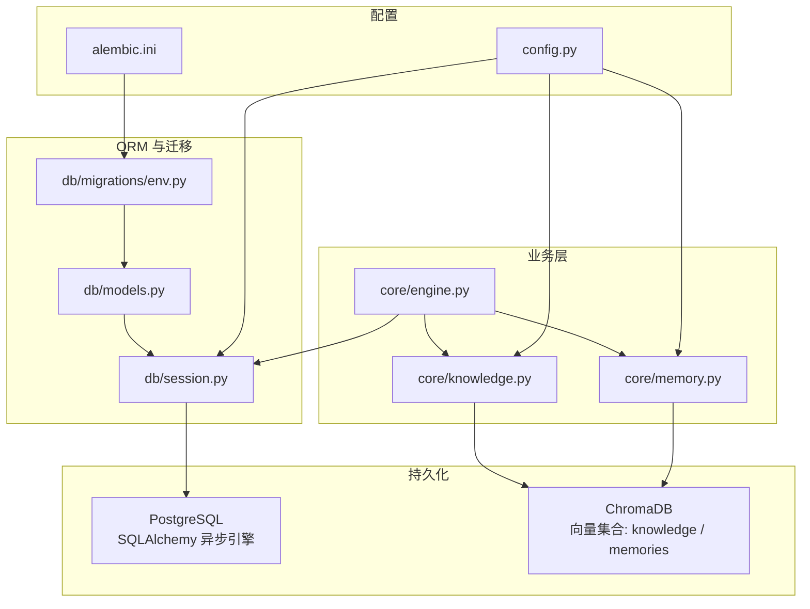
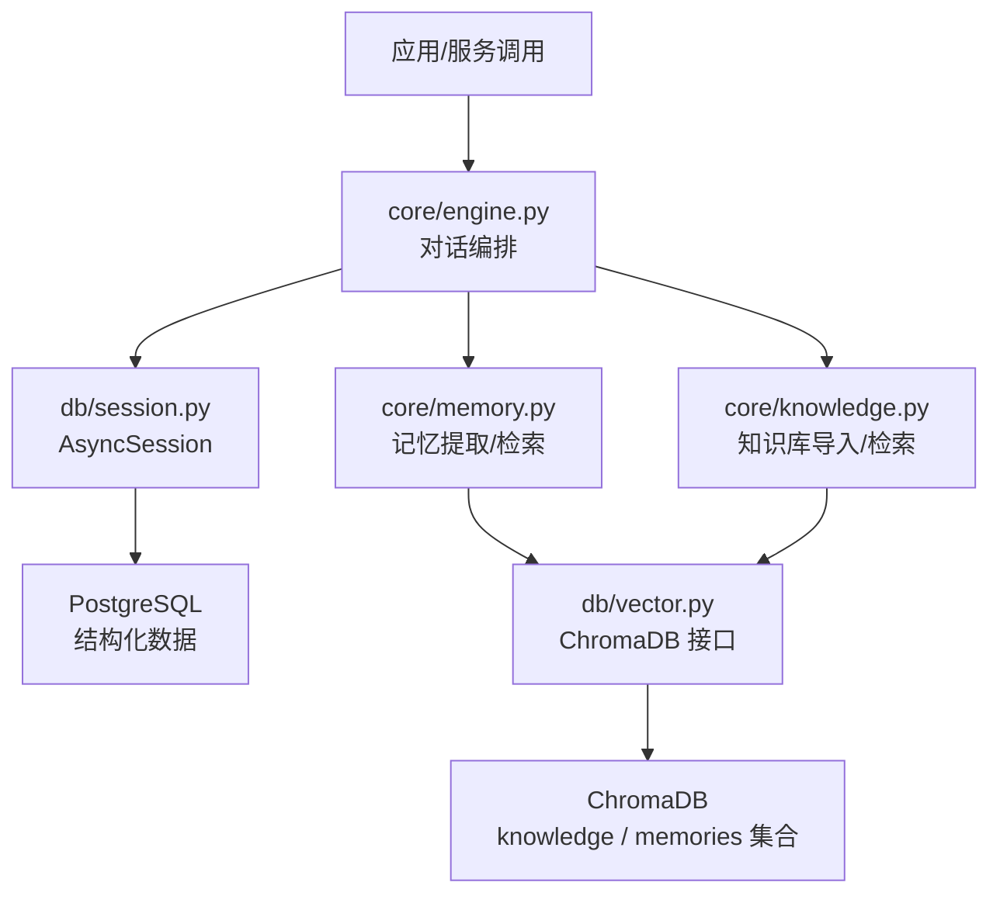
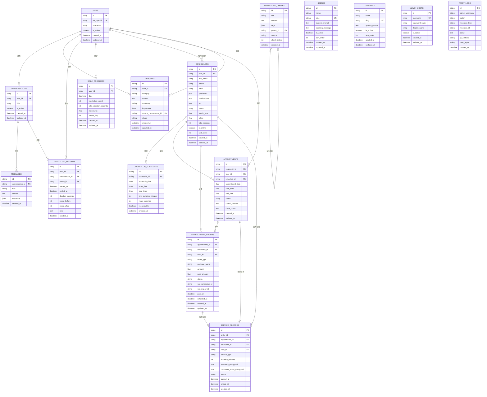
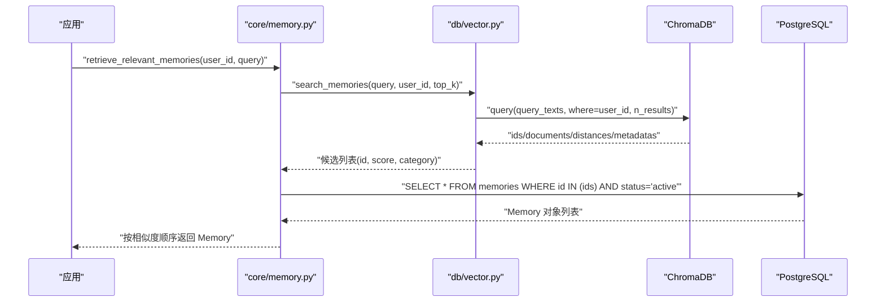
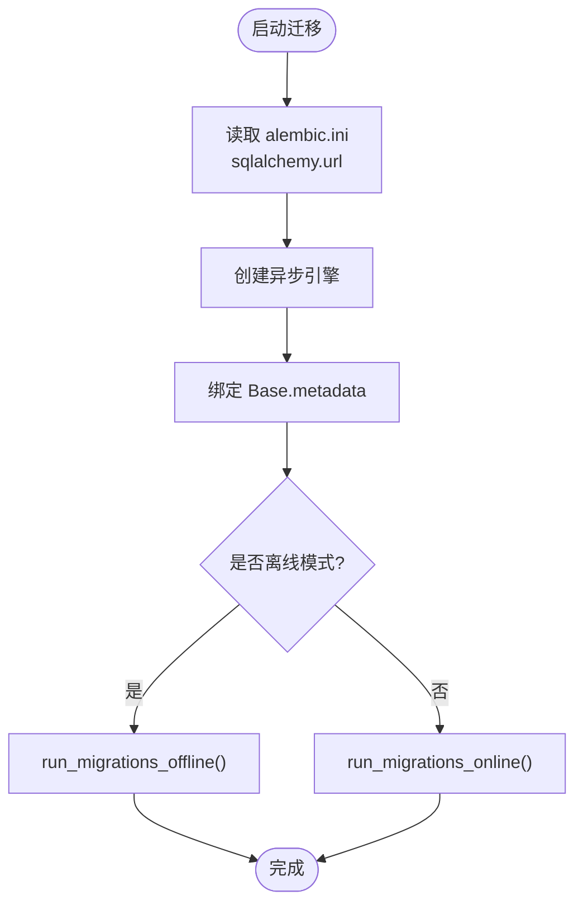
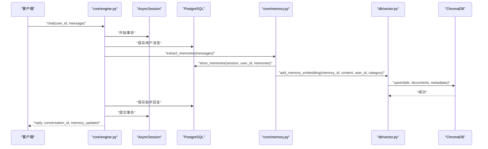
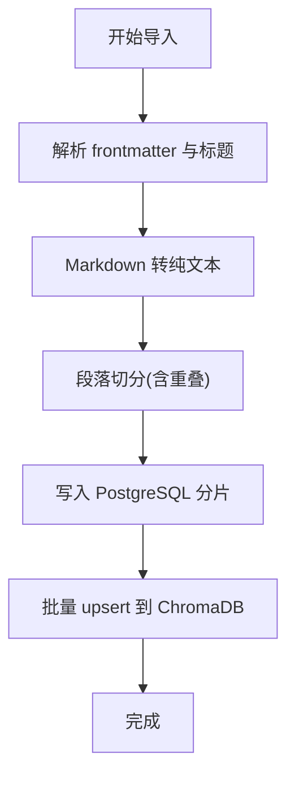
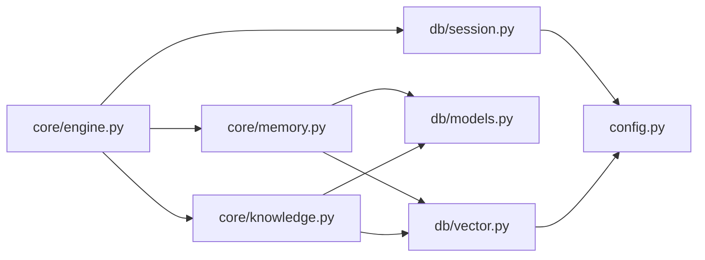

# 数据架构设计

<cite>
**本文引用的文件**   
- [alembic.ini](file://alembic.ini)
- [models.py](file://hushai/meditation/db/models.py)
- [session.py](file://hushai/meditation/db/session.py)
- [vector.py](file://hushai/meditation/db/vector.py)
- [config.py](file://hushai/meditation/config.py)
- [env.py](file://hushai/meditation/db/migrations/env.py)
- [memory.py](file://hushai/meditation/core/memory.py)
- [knowledge.py](file://hushai/meditation/core/knowledge.py)
- [engine.py](file://hushai/meditation/core/engine.py)
</cite>

## 目录
1. [引言](#引言)
2. [项目结构](#项目结构)
3. [核心组件](#核心组件)
4. [架构总览](#架构总览)
5. [详细组件分析](#详细组件分析)
6. [依赖关系分析](#依赖关系分析)
7. [性能考量](#性能考量)
8. [故障排查指南](#故障排查指南)
9. [结论](#结论)
10. [附录](#附录)

## 引言
本文件面向 hush.ai 的数据架构设计，重点阐述 PostgreSQL 与 ChromaDB 双存储策略的设计动机与实现方案；定义用户、对话、记忆、知识等核心实体的关系模型；说明向量数据库的集成方式（文本向量化、语义搜索与相似度计算）；描述数据迁移管理与版本控制机制；并给出数据一致性保证、事务处理与并发访问控制的实践。文末提供 ER 图与数据结构流程图，帮助读者快速理解系统的数据流向与关键路径。

## 项目结构
本项目在 meditation 模块内组织数据相关代码：
- ORM 模型与表映射位于 db/models.py
- 异步会话与引擎管理位于 db/session.py
- 向量库接口封装位于 db/vector.py
- 配置加载与环境变量映射位于 config.py
- Alembic 迁移环境位于 db/migrations/env.py，全局配置在 alembic.ini
- 业务层对记忆与知识库的读写逻辑位于 core/memory.py 与 core/knowledge.py
- 主引擎编排对话、记忆提取与知识检索流程位于 core/engine.py

图表来源
- [config.py:1-136](file://hushai/meditation/config.py#L1-L136)
- [alembic.ini:1-37](file://alembic.ini#L1-L37)
- [models.py:1-434](file://hushai/meditation/db/models.py#L1-L434)
- [session.py:1-83](file://hushai/meditation/db/session.py#L1-L83)
- [env.py:1-52](file://hushai/meditation/db/migrations/env.py#L1-L52)
- [memory.py:1-206](file://hushai/meditation/core/memory.py#L1-L206)
- [knowledge.py:1-225](file://hushai/meditation/core/knowledge.py#L1-L225)
- [engine.py:1-387](file://hushai/meditation/core/engine.py#L1-L387)

章节来源
- [config.py:1-136](file://hushai/meditation/config.py#L1-L136)
- [alembic.ini:1-37](file://alembic.ini#L1-L37)
- [models.py:1-434](file://hushai/meditation/db/models.py#L1-L434)
- [session.py:1-83](file://hushai/meditation/db/session.py#L1-L83)
- [env.py:1-52](file://hushai/meditation/db/migrations/env.py#L1-L52)
- [memory.py:1-206](file://hushai/meditation/core/memory.py#L1-L206)
- [knowledge.py:1-225](file://hushai/meditation/core/knowledge.py#L1-L225)
- [engine.py:1-387](file://hushai/meditation/core/engine.py#L1-L387)

## 核心组件
- 配置中心：集中管理数据库 URL、ChromaDB 持久化目录、嵌入模型与 API Key、LLM 提供商等参数，支持 .env 覆盖。
- 数据库会话：基于 SQLAlchemy 异步引擎与 sessionmaker，自动适配 SQLite 与 PostgreSQL+asyncpg，提供 init_db/close_db 生命周期方法。
- 向量接口：封装 ChromaDB 客户端与集合操作，支持 OpenAI 或默认嵌入函数，提供知识片段与记忆的 upsert/query/delete。
- ORM 模型：定义用户、对话、消息、记忆、知识分片、场景、导师、管理员、审计日志、冥想会话、每日进度、咨询师、排班、预约、订单与服务记录等实体。
- 业务层：记忆提取与归档、知识库导入与检索、主引擎编排对话上下文与安全校验。

章节来源
- [config.py:1-136](file://hushai/meditation/config.py#L1-L136)
- [session.py:1-83](file://hushai/meditation/db/session.py#L1-L83)
- [vector.py:1-179](file://hushai/meditation/db/vector.py#L1-L179)
- [models.py:1-434](file://hushai/meditation/db/models.py#L1-L434)
- [memory.py:1-206](file://hushai/meditation/core/memory.py#L1-L206)
- [knowledge.py:1-225](file://hushai/meditation/core/knowledge.py#L1-L225)
- [engine.py:1-387](file://hushai/meditation/core/engine.py#L1-L387)

## 架构总览
系统采用“结构化数据 + 向量检索”的双存储策略：
- PostgreSQL 负责强一致的结构化数据（用户、对话、消息、记忆元数据、知识分片、业务实体）。
- ChromaDB 负责非结构化文本的语义检索（知识分片与记忆内容），通过嵌入函数生成向量，使用余弦相似度进行检索。

图表来源
- [engine.py:1-387](file://hushai/meditation/core/engine.py#L1-L387)
- [session.py:1-83](file://hushai/meditation/db/session.py#L1-L83)
- [memory.py:1-206](file://hushai/meditation/core/memory.py#L1-L206)
- [knowledge.py:1-225](file://hushai/meditation/core/knowledge.py#L1-L225)
- [vector.py:1-179](file://hushai/meditation/db/vector.py#L1-L179)

## 详细组件分析

### 实体关系模型（ER 图）
下图展示核心实体及其关系，包括用户、对话、消息、记忆、知识分片、场景、导师、管理员、审计日志、冥想会话、每日进度、咨询师、排班、预约、订单与服务记录。

图表来源
- [models.py:1-434](file://hushai/meditation/db/models.py#L1-L434)

章节来源
- [models.py:1-434](file://hushai/meditation/db/models.py#L1-L434)

### 双存储策略：PostgreSQL 与 ChromaDB
- 设计原因
  - PostgreSQL 提供 ACID 事务、强一致性与复杂查询能力，适合承载用户、对话、记忆元数据、知识分片、业务实体等结构化数据。
  - ChromaDB 提供高效的向量检索与相似度计算，适合承载长文本的语义检索（知识分片与记忆内容），弥补传统 SQL 全文检索在语义匹配上的不足。
- 实现要点
  - 写入路径：结构化数据落库后，将对应文本内容以文档形式 upsert 到 ChromaDB 集合，附带必要元数据（如 user_id、category、tags、source 等）。
  - 读取路径：先通过 ChromaDB 按 query 检索 top-k 候选，再回查 PostgreSQL 获取完整记录并按相似度排序返回。
  - 嵌入函数：根据配置选择 OpenAIEmbeddingFunction 或 DefaultEmbeddingFunction，支持自定义 base_url 与 model_name。
  - 集合空间：使用余弦距离（hnsw:space=cosine），分数转换为 1 - distance。

章节来源
- [vector.py:1-179](file://hushai/meditation/db/vector.py#L1-L179)
- [config.py:1-136](file://hushai/meditation/config.py#L1-L136)
- [memory.py:1-206](file://hushai/meditation/core/memory.py#L1-L206)
- [knowledge.py:1-225](file://hushai/meditation/core/knowledge.py#L1-L225)

### 向量数据库集成方案（文本向量化、语义搜索、相似度计算）
- 文本向量化
  - 通过 embedding_provider/embedding_model/embedding_api_key/embedding_base_url 配置决定嵌入函数与模型。
  - 若未配置 key，则回退至本地默认嵌入函数。
- 语义搜索
  - knowledge_collection 与 memory_collection 分别维护知识分片与记忆内容的集合。
  - search_knowledge/search_memories 支持 where 过滤（如 user_id、category）与 top_k 限制。
- 相似度计算
  - 使用余弦距离，结果中的 score 字段为 1 - distance，便于直接用于排序与展示。

图表来源
- [memory.py:115-138](file://hushai/meditation/core/memory.py#L115-L138)
- [vector.py:144-173](file://hushai/meditation/db/vector.py#L144-L173)

章节来源
- [vector.py:1-179](file://hushai/meditation/db/vector.py#L1-L179)
- [memory.py:115-138](file://hushai/meditation/core/memory.py#L115-L138)

### 数据迁移管理与版本控制
- Alembic 配置
  - 脚本位置指向 hushai/meditation/db/migrations，数据库连接字符串由 alembic.ini 的 sqlalchemy.url 指定。
- 异步迁移
  - env.py 使用 async_engine_from_config 构建异步引擎，并在 run_migrations_online 中执行异步迁移。
- 目标元数据
  - target_metadata 绑定 Base.metadata，确保迁移与 ORM 模型同步。
- 运行模式
  - 支持离线模式（literal_binds=True）与在线模式（异步连接执行）。

图表来源
- [alembic.ini:1-37](file://alembic.ini#L1-L37)
- [env.py:1-52](file://hushai/meditation/db/migrations/env.py#L1-L52)
- [models.py:1-434](file://hushai/meditation/db/models.py#L1-L434)

章节来源
- [alembic.ini:1-37](file://alembic.ini#L1-L37)
- [env.py:1-52](file://hushai/meditation/db/migrations/env.py#L1-L52)

### 数据一致性、事务处理与并发访问控制
- 事务边界
  - 主引擎 chat/chat_stream/knowledge_qa 均使用 AsyncSession 工厂，在 try/finally 中 commit 或 rollback，确保异常时回滚。
- 写入顺序
  - 用户消息与助手回复先写入 PostgreSQL，随后触发记忆提取与向量写入；向量写入失败仅记录警告，不影响主事务。
- 并发控制
  - 会话池大小：SQLite 使用较小池，PostgreSQL 使用较大池；避免连接耗尽。
  - 唯一约束与索引：users.wx_openid、admin_users.username、scenes.slug、teachers.slug 等字段具备唯一性约束；常用查询字段建立索引以提升并发性能。
- 幂等与去重
  - 记忆与知识写入使用 upsert，避免重复插入；记忆状态机 active/archived 支持归档清理。

图表来源
- [engine.py:166-236](file://hushai/meditation/core/engine.py#L166-L236)
- [memory.py:79-112](file://hushai/meditation/core/memory.py#L79-L112)
- [vector.py:130-142](file://hushai/meditation/db/vector.py#L130-L142)

章节来源
- [engine.py:166-236](file://hushai/meditation/core/engine.py#L166-L236)
- [memory.py:79-112](file://hushai/meditation/core/memory.py#L79-L112)
- [vector.py:130-142](file://hushai/meditation/db/vector.py#L130-L142)

### 知识库导入与检索流程
- 导入流程
  - 预处理 Markdown 文本，解析 frontmatter 与标题，转纯文本以便与嵌入一致。
  - 分段切分（段落级，可配置 chunk_size 与 overlap），逐段入库 PostgreSQL 并批量 upsert 到 ChromaDB。
- 检索流程
  - 按 query 检索 top-k 知识分片，组装提示上下文或直接返回来源信息。

图表来源
- [knowledge.py:76-104](file://hushai/meditation/core/knowledge.py#L76-L104)
- [knowledge.py:106-134](file://hushai/meditation/core/knowledge.py#L106-L134)
- [knowledge.py:137-171](file://hushai/meditation/core/knowledge.py#L137-L171)
- [vector.py:81-101](file://hushai/meditation/db/vector.py#L81-L101)

章节来源
- [knowledge.py:76-104](file://hushai/meditation/core/knowledge.py#L76-L104)
- [knowledge.py:106-134](file://hushai/meditation/core/knowledge.py#L106-L134)
- [knowledge.py:137-171](file://hushai/meditation/core/knowledge.py#L137-L171)
- [vector.py:81-101](file://hushai/meditation/db/vector.py#L81-L101)

## 依赖关系分析
- 模块耦合
  - engine 依赖 memory 与 knowledge 业务层，二者共同依赖 vector 接口与 models/session。
  - vector 依赖 config 以动态选择嵌入函数与集合参数。
  - session 依赖 config 以解析数据库 URL 并创建引擎。
- 外部依赖
  - ChromaDB 客户端与嵌入函数（OpenAIEmbeddingFunction 或 DefaultEmbeddingFunction）。
  - SQLAlchemy 异步引擎与 Alembic 迁移。

图表来源
- [engine.py:1-387](file://hushai/meditation/core/engine.py#L1-L387)
- [memory.py:1-206](file://hushai/meditation/core/memory.py#L1-L206)
- [knowledge.py:1-225](file://hushai/meditation/core/knowledge.py#L1-L225)
- [vector.py:1-179](file://hushai/meditation/db/vector.py#L1-L179)
- [session.py:1-83](file://hushai/meditation/db/session.py#L1-L83)
- [models.py:1-434](file://hushai/meditation/db/models.py#L1-L434)
- [config.py:1-136](file://hushai/meditation/config.py#L1-L136)

章节来源
- [engine.py:1-387](file://hushai/meditation/core/engine.py#L1-L387)
- [memory.py:1-206](file://hushai/meditation/core/memory.py#L1-L206)
- [knowledge.py:1-225](file://hushai/meditation/core/knowledge.py#L1-L225)
- [vector.py:1-179](file://hushai/meditation/db/vector.py#L1-L179)
- [session.py:1-83](file://hushai/meditation/db/session.py#L1-L83)
- [models.py:1-434](file://hushai/meditation/db/models.py#L1-L434)
- [config.py:1-136](file://hushai/meditation/config.py#L1-L136)

## 性能考量
- 连接池与并发
  - SQLite 使用较小池以避免锁竞争；PostgreSQL 使用较大池提升并发吞吐。
- 索引优化
  - 高频查询字段（user_id、conversation_id、category、slug、username 等）已建索引；复合索引用于联合查询（如 memories.user_id+category、daily_progress.user_id+date）。
- 向量检索
  - 使用 HNSW 索引与余弦距离，top_k 受配置控制；建议合理设置 memory_top_k 与 knowledge_top_k 平衡召回与延迟。
- 文本处理
  - 知识库导入采用段落切分与重叠策略，减少跨段落语义断裂；Markdown 清洗去除格式噪声，提高嵌入质量。
- 事务粒度
  - 主事务仅包裹必要的写操作，向量写入失败不阻塞主流程，降低端到端延迟。

[本节为通用指导，无需特定文件引用]

## 故障排查指南
- 向量写入失败
  - 现象：记忆向量写入异常但主事务仍提交。
  - 排查：检查 embedding_provider/api_key/base_url 配置；确认 ChromaDB 可用；查看日志中 memory_id 与错误堆栈。
- 迁移失败
  - 现象：Alembic 迁移报错或无法识别模型变更。
  - 排查：确认 alembic.ini 的 sqlalchemy.url 正确；env.py 的 target_metadata 绑定 Base.metadata；必要时重新生成迁移脚本。
- 会话泄漏或连接耗尽
  - 现象：高并发下出现连接池耗尽或超时。
  - 排查：检查 get_session_factory 的 pool_size；确认每个请求正确使用 async with factory() 作为会话上下文；验证 finally 分支的 rollback。
- 检索结果为空
  - 现象：search_memories 或 search_knowledge 返回空列表。
  - 排查：确认集合 count > 0；检查 where 条件（如 user_id）是否正确；核对 upsert 的 ids 与 documents 是否一致。

章节来源
- [memory.py:102-112](file://hushai/meditation/core/memory.py#L102-L112)
- [vector.py:130-179](file://hushai/meditation/db/vector.py#L130-L179)
- [env.py:1-52](file://hushai/meditation/db/migrations/env.py#L1-L52)
- [session.py:63-83](file://hushai/meditation/db/session.py#L63-L83)
- [engine.py:233-236](file://hushai/meditation/core/engine.py#L233-L236)

## 结论
hush.ai 的数据架构通过 PostgreSQL 与 ChromaDB 的双存储策略，兼顾了结构化数据的强一致性与非结构化文本的语义检索能力。借助 Alembic 的异步迁移与 SQLAlchemy 的异步会话管理，系统在并发与一致性方面具备良好的工程实践。记忆与知识库的业务层将 LLM 抽取与 RAG 检索有机整合，形成从对话到长期记忆与理论知识的闭环。未来可在嵌入模型选择、索引参数调优与缓存策略上持续优化，进一步提升检索质量与系统性能。

[本节为总结性内容，无需特定文件引用]

## 附录
- 配置项速览（部分）
  - 数据库与向量：MEDITATION_POSTGRES_URL、MEDITATION_CHROMA_DIR、MEDITATION_EMBEDDING_PROVIDER/MODEL/API_KEY/BASE_URL
  - 行为参数：MEDITATION_MEMORY_TOP_K、MEDITATION_KNOWLEDGE_TOP_K、MEDITATION_CONVERSATION_MAX_TURNS
  - 安全与支付：MEDITATION_JWT_SECRET/ALGORITHM/EXPIRE_MINUTES、微信支付相关键值、加密密钥
- 关键路径参考
  - 对话主流程：chat/chat_stream/knowledge_qa
  - 记忆提取与归档：extract_memories/store_memories/archive_old_memories
  - 知识库导入与检索：import_text/import_structured/search_knowledge_base

章节来源
- [config.py:1-136](file://hushai/meditation/config.py#L1-L136)
- [engine.py:166-387](file://hushai/meditation/core/engine.py#L166-L387)
- [memory.py:45-206](file://hushai/meditation/core/memory.py#L45-L206)
- [knowledge.py:137-225](file://hushai/meditation/core/knowledge.py#L137-L225)