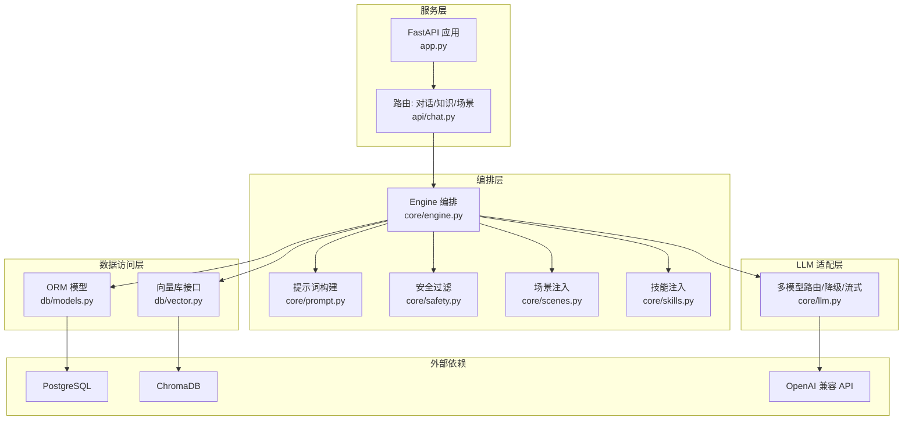
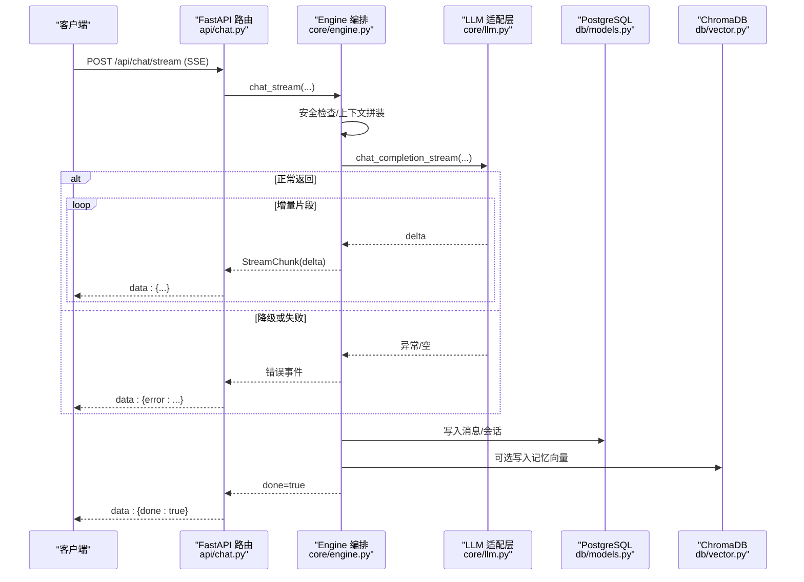
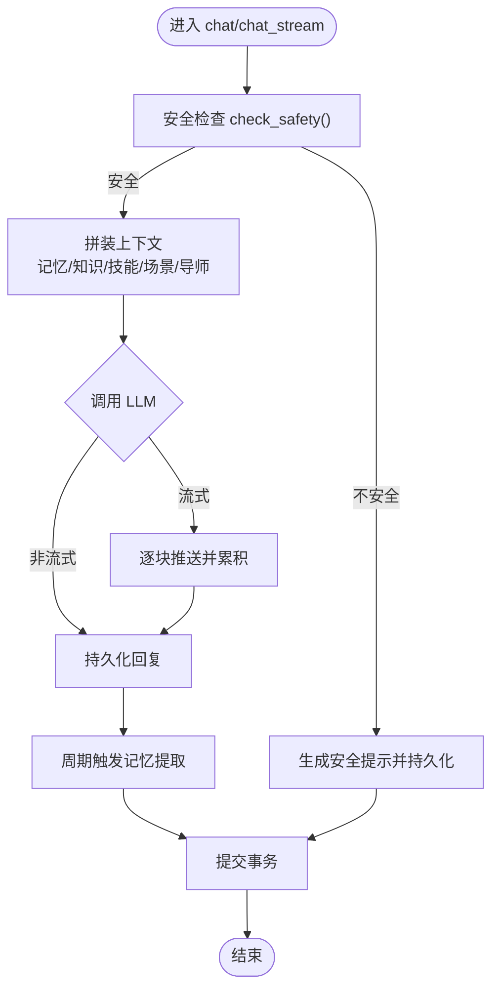
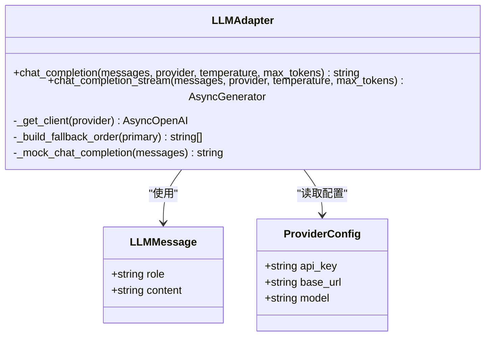
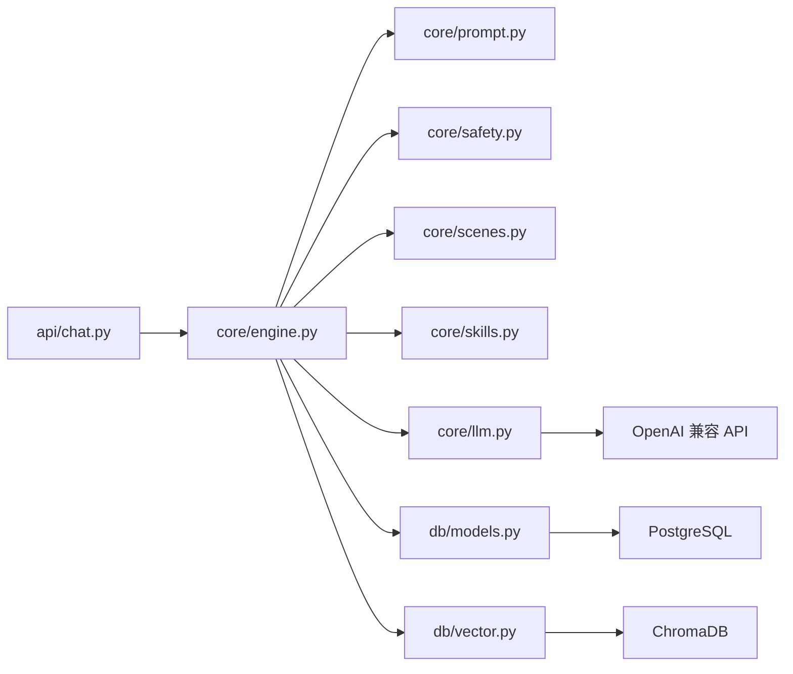

# 架构设计

<cite>
**本文引用的文件**   
- [README.md](file://README.md)
- [app.py](file://hushai/meditation/app.py)
- [chat.py](file://hushai/meditation/api/chat.py)
- [engine.py](file://hushai/meditation/core/engine.py)
- [llm.py](file://hushai/meditation/core/llm.py)
- [models.py](file://hushai/meditation/db/models.py)
- [vector.py](file://hushai/meditation/db/vector.py)
- [config.py](file://hushai/meditation/config.py)
- [knowledge.py](file://hushai/meditation/core/knowledge.py)
- [memory.py](file://hushai/meditation/core/memory.py)
- [prompt.py](file://hushai/meditation/core/prompt.py)
- [safety.py](file://hushai/meditation/core/safety.py)
- [scenes.py](file://hushai/meditation/core/scenes.py)
- [skills.py](file://hushai/meditation/core/skills.py)
</cite>

## 目录
1. [引言](#引言)
2. [项目结构](#项目结构)
3. [核心组件](#核心组件)
4. [架构总览](#架构总览)
5. [详细组件分析](#详细组件分析)
6. [依赖关系分析](#依赖关系分析)
7. [性能与扩展性](#性能与扩展性)
8. [故障排查指南](#故障排查指南)
9. [结论](#结论)
10. [附录](#附录)

## 引言
本架构文档面向 hush.ai 的冥想陪伴服务，系统性阐述分层架构、插件化与适配器模式的应用，明确 FastAPI 服务层、Engine 编排层、LLM 适配层与数据访问层的职责边界与交互方式。同时解释技术选型（PostgreSQL + ChromaDB 双存储、SSE 流式通信、JWT 认证）的原因与权衡，并给出系统边界、扩展点设计与性能优化策略，辅以架构图与组件关系图帮助开发者快速理解整体设计思路。

## 项目结构
- 应用入口与生命周期管理：FastAPI 应用创建、中间件注册、路由挂载、静态资源挂载、默认管理员与导师初始化等。
- API 路由层：对话、知识问答、场景、会话列表与消息历史等 REST 接口，统一鉴权与限流。
- Engine 编排层：组装上下文（记忆、知识、技能、场景、导师）、安全过滤、持久化、调用 LLM 适配层。
- LLM 适配层：多提供商客户端封装、自动降级与流式输出、调试 Mock。
- 数据访问层：SQLAlchemy ORM 模型与会话管理；ChromaDB 向量检索封装。
- 配置中心：集中加载环境变量，提供运行时配置对象。

图表来源
- [app.py:136-207](file://hushai/meditation/app.py#L136-L207)
- [chat.py:28-104](file://hushai/meditation/api/chat.py#L28-L104)
- [engine.py:166-314](file://hushai/meditation/core/engine.py#L166-L314)
- [llm.py:136-258](file://hushai/meditation/core/llm.py#L136-L258)
- [models.py:25-120](file://hushai/meditation/db/models.py#L25-L120)
- [vector.py:61-179](file://hushai/meditation/db/vector.py#L61-L179)

章节来源
- [README.md:100-178](file://README.md#L100-L178)
- [app.py:1-228](file://hushai/meditation/app.py#L1-L228)

## 核心组件
- FastAPI 服务层
  - 负责应用生命周期、CORS、限流、路由挂载、静态资源与健康检查。
  - 通过依赖注入获取数据库会话，统一错误处理与响应格式。
- Engine 编排层
  - 负责对话主流程：会话/消息持久化、安全检查、上下文拼装（记忆、知识、技能、场景、导师）、调用 LLM、结果回写与记忆提取触发。
  - 提供同步与流式两种对话能力。
- LLM 适配层
  - 抽象 OpenAI 兼容接口，支持多提供商配置与自动降级，统一异常转换，提供流式与非流式调用。
- 数据访问层
  - PostgreSQL 用于结构化数据（用户、会话、消息、记忆、技能、场景、咨询业务等）。
  - ChromaDB 用于知识库与记忆的向量检索，支持可选 OpenAI Embedding。
- 配置中心
  - 集中读取 .env 与环境变量，提供运行时配置对象，贯穿各层使用。

章节来源
- [app.py:136-207](file://hushai/meditation/app.py#L136-L207)
- [engine.py:166-314](file://hushai/meditation/core/engine.py#L166-L314)
- [llm.py:136-258](file://hushai/meditation/core/llm.py#L136-L258)
- [models.py:25-120](file://hushai/meditation/db/models.py#L25-L120)
- [vector.py:61-179](file://hushai/meditation/db/vector.py#L61-L179)
- [config.py:18-136](file://hushai/meditation/config.py#L18-L136)

## 架构总览
系统采用清晰的分层架构：
- 表现层：FastAPI 路由与静态页面。
- 业务编排层：Engine 聚合多源上下文与安全策略，驱动 LLM 调用。
- 适配层：LLM 适配器屏蔽不同厂商差异并提供降级与流式能力。
- 数据层：PostgreSQL 与 ChromaDB 双存储，分别承载结构化与语义检索需求。

图表来源
- [chat.py:80-104](file://hushai/meditation/api/chat.py#L80-L104)
- [engine.py:238-314](file://hushai/meditation/core/engine.py#L238-L314)
- [llm.py:208-258](file://hushai/meditation/core/llm.py#L208-L258)
- [models.py:69-96](file://hushai/meditation/db/models.py#L69-L96)
- [vector.py:130-179](file://hushai/meditation/db/vector.py#L130-L179)

## 详细组件分析

### FastAPI 服务层
- 应用创建与生命周期
  - 在启动时初始化日志、数据库连接、默认管理员与导师、全局预约配置。
  - 注册 CORS、限流中间件，挂载前端与管理后台静态资源。
- 路由组织
  - 将多个功能模块路由按领域划分挂载至 FastAPI 实例，便于独立维护与测试。
- 健康检查与文档
  - 提供 /health 健康端点与 /debug 文档页，便于运维与联调。

章节来源
- [app.py:24-133](file://hushai/meditation/app.py#L24-L133)
- [app.py:136-207](file://hushai/meditation/app.py#L136-L207)

### 对话 API 路由
- 鉴权与限流
  - 从请求头解析 JWT Bearer Token，校验用户身份；对关键接口设置每分钟限流。
- 普通对话与流式对话
  - 普通对话直接返回完整文本；流式对话以 SSE 推送增量片段，并在异常时发送错误事件。
- 知识问答与会话管理
  - 提供知识库问答、场景列表、会话列表与消息历史查询接口。

章节来源
- [chat.py:43-104](file://hushai/meditation/api/chat.py#L43-L104)
- [chat.py:107-152](file://hushai/meditation/api/chat.py#L107-L152)
- [chat.py:155-245](file://hushai/meditation/api/chat.py#L155-L245)

### Engine 编排层
- 上下文拼装
  - 加载最近对话历史、记忆上下文、知识库上下文、技能上下文、场景上下文与导师个性化描述，统一构建 system prompt。
- 安全前置
  - 在进入 LLM 前进行关键词级危机检测，命中则直接返回安全提示，避免敏感内容外发。
- 持久化与记忆提取
  - 用户与助手消息落库；周期性触发记忆提取并写入向量库；首次对话自动补全会话标题。
- 流式与非流式
  - 非流式一次性返回；流式逐字推送，最终汇总落库并触发记忆提取。

图表来源
- [engine.py:166-236](file://hushai/meditation/core/engine.py#L166-L236)
- [engine.py:238-314](file://hushai/meditation/core/engine.py#L238-L314)
- [safety.py:83-111](file://hushai/meditation/core/safety.py#L83-L111)

章节来源
- [engine.py:91-127](file://hushai/meditation/core/engine.py#L91-L127)
- [engine.py:130-154](file://hushai/meditation/core/engine.py#L130-L154)
- [engine.py:166-314](file://hushai/meditation/core/engine.py#L166-L314)

### LLM 适配层
- 多提供商与自动降级
  - 根据配置初始化多个 OpenAI 兼容客户端，按优先级顺序尝试，失败自动切换下一个提供商。
- 调试模式与 Mock
  - 当未配置 Key 且处于 debug 模式时，返回模拟回复，便于本地联调。
- 流式与非流式
  - 非流式返回完整文本；流式逐块产出，异常时抛出可被上层捕获的错误信息。

图表来源
- [llm.py:53-91](file://hushai/meditation/core/llm.py#L53-L91)
- [llm.py:136-179](file://hushai/meditation/core/llm.py#L136-L179)
- [llm.py:208-258](file://hushai/meditation/core/llm.py#L208-L258)

章节来源
- [llm.py:21-51](file://hushai/meditation/core/llm.py#L21-L51)
- [llm.py:93-111](file://hushai/meditation/core/llm.py#L93-L111)
- [llm.py:136-179](file://hushai/meditation/core/llm.py#L136-L179)
- [llm.py:208-258](file://hushai/meditation/core/llm.py#L208-L258)

### 数据访问层
- PostgreSQL 模型
  - 定义用户、会话、消息、记忆、技能、场景、导师、咨询业务相关实体及关系。
- ChromaDB 接口
  - 提供集合管理、批量 upsert、相似度检索与删除接口，支持可选 OpenAI Embedding。
- 会话管理
  - 基于 SQLAlchemy 异步会话工厂，确保每个请求持有独立会话。

章节来源
- [models.py:37-120](file://hushai/meditation/db/models.py#L37-L120)
- [vector.py:61-127](file://hushai/meditation/db/vector.py#L61-L127)
- [vector.py:130-179](file://hushai/meditation/db/vector.py#L130-L179)

### 知识库与记忆子系统
- 知识库 RAG
  - 支持 Markdown 导入、frontmatter 解析、段落感知分块、向量化入库与检索，返回带来源与标签的结果。
- 长期记忆
  - 基于 LLM 抽取七类记忆，持久化到 PostgreSQL 并写入 ChromaDB；检索时结合用户维度过滤，注入到提示词中增强个性化。

章节来源
- [knowledge.py:76-171](file://hushai/meditation/core/knowledge.py#L76-L171)
- [knowledge.py:207-225](file://hushai/meditation/core/knowledge.py#L207-L225)
- [memory.py:45-112](file://hushai/meditation/core/memory.py#L45-L112)
- [memory.py:161-174](file://hushai/meditation/core/memory.py#L161-L174)

### 提示词与安全
- 动态 Prompt 构建
  - 组合角色基座、场景/技能/导师个性、知识与记忆上下文、历史对话与安全护栏，形成最终 system prompt。
- 安全护栏
  - 基于正则规则快速识别自伤/伤害他人等高危信号，返回分级提示与建议，阻断敏感内容外发。

章节来源
- [prompt.py:77-103](file://hushai/meditation/core/prompt.py#L77-L103)
- [prompt.py:119-130](file://hushai/meditation/core/prompt.py#L119-L130)
- [safety.py:22-40](file://hushai/meditation/core/safety.py#L22-L40)
- [safety.py:83-111](file://hushai/meditation/core/safety.py#L83-L111)

### 场景与技能插件
- 场景注入
  - 根据场景 ID 加载系统提示与开场白，作为上下文的一部分注入到对话。
- 技能插件
  - 按 ID 或全部启用状态加载技能文本，限制单次最大数量，按排序合并入系统提示。

章节来源
- [scenes.py:11-30](file://hushai/meditation/core/scenes.py#L11-L30)
- [skills.py:14-59](file://hushai/meditation/core/skills.py#L14-L59)

## 依赖关系分析
- 组件耦合与内聚
  - API 路由仅负责参数校验、鉴权与响应包装，核心逻辑下沉至 Engine，保持高内聚低耦合。
  - Engine 通过函数式接口调用提示词、安全、场景、技能与 LLM 适配层，依赖方向单向向下。
- 外部依赖
  - PostgreSQL 与 ChromaDB 通过数据访问层隔离；LLM 适配层屏蔽多厂商差异。
- 潜在循环依赖
  - 当前模块间无循环导入；Engine 不反向依赖 API 路由，符合分层原则。

图表来源
- [chat.py:28-104](file://hushai/meditation/api/chat.py#L28-L104)
- [engine.py:166-314](file://hushai/meditation/core/engine.py#L166-L314)
- [llm.py:136-258](file://hushai/meditation/core/llm.py#L136-L258)
- [models.py:25-120](file://hushai/meditation/db/models.py#L25-L120)
- [vector.py:61-179](file://hushai/meditation/db/vector.py#L61-L179)

章节来源
- [README.md:100-178](file://README.md#L100-L178)

## 性能与扩展性
- 双存储策略（PostgreSQL + ChromaDB）
  - 结构化数据与事务一致性由 PostgreSQL 保障；语义检索与相似匹配由 ChromaDB 承担，降低大模型上下文长度与成本。
  - 权衡：引入额外索引与维护开销，但显著提升 RAG 效果与个性化体验。
- SSE 流式通信
  - 提升首字延迟与用户体验；服务端需保证稳定推送与异常兜底（错误事件）。
- JWT 认证方案
  - 轻量、跨域友好；配合 Refresh Token 机制实现长会话续期。
- 自动降级与容错
  - LLM 多提供商自动降级，提高可用性；调试模式 Mock 加速本地迭代。
- 可扩展点
  - 新增 LLM 提供商：在配置与适配层注册新 provider 即可参与降级序列。
  - 新增技能/场景：通过数据库维护，无需改动代码。
  - 自定义安全规则：在安全模块追加正则规则与文案映射。
  - 嵌入模型替换：在向量层切换 embedding_provider 与模型。

[本节为通用指导，不涉及具体文件分析]

## 故障排查指南
- 常见问题定位
  - 鉴权失败：检查 Authorization 头是否携带有效 Bearer Token，确认 JWT Secret 与过期时间配置。
  - LLM 调用失败：查看降级日志与异常信息，确认对应提供商 API Key 与 Base URL 配置。
  - 向量检索为空：确认知识库已导入成功，ChromaDB 集合存在且包含文档。
  - 流式中断：检查网络稳定性与服务端异常事件输出。
- 建议操作
  - 开启 debug 模式并使用 Mock 验证链路。
  - 增加关键路径日志（如 Engine 上下文拼装、LLM 调用耗时）。
  - 对高频接口添加更细粒度限流与熔断策略。

章节来源
- [chat.py:43-56](file://hushai/meditation/api/chat.py#L43-L56)
- [llm.py:136-179](file://hushai/meditation/core/llm.py#L136-L179)
- [vector.py:104-127](file://hushai/meditation/db/vector.py#L104-L127)

## 结论
hush.ai 冥想陪伴服务采用清晰的分层架构与插件化设计，Engine 作为编排中枢整合多源上下文与安全策略，LLM 适配层屏蔽多厂商差异并提供自动降级与流式能力，数据层以 PostgreSQL + ChromaDB 双存储兼顾一致性与语义检索。该设计具备良好的扩展性与可维护性，适合持续演进与规模化部署。

[本节为总结性内容，不涉及具体文件分析]

## 附录
- 配置项速览
  - 数据库与向量库：PostgreSQL URL、ChromaDB 持久化目录。
  - 认证：JWT 密钥、算法与过期时间。
  - LLM：默认提供商与各提供商 Key/BaseURL/Model。
  - 检索：记忆与知识 Top-K、对话最大轮数。
  - 运行：主机、端口、调试开关、CORS 来源。

章节来源
- [config.py:18-62](file://hushai/meditation/config.py#L18-L62)
- [config.py:63-115](file://hushai/meditation/config.py#L63-L115)