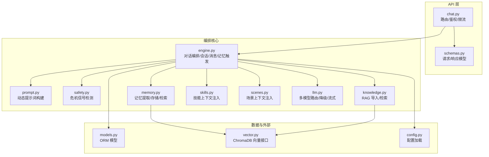
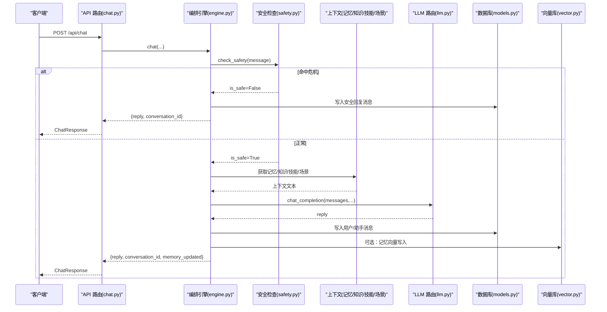
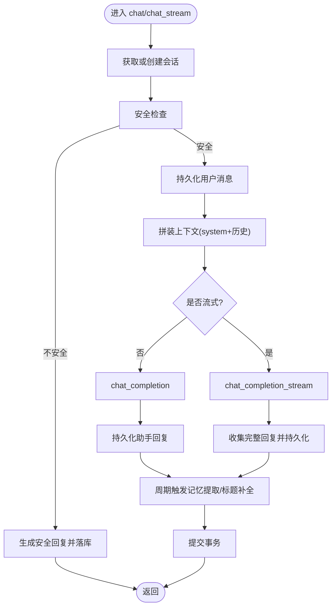
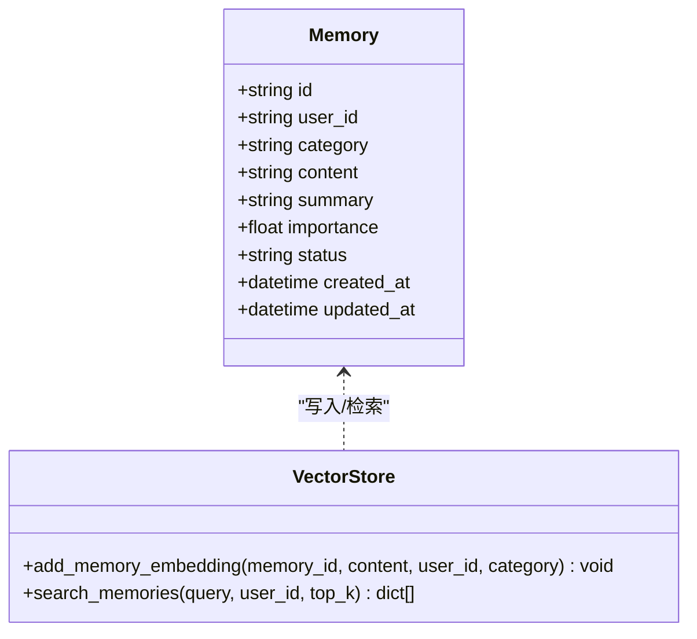
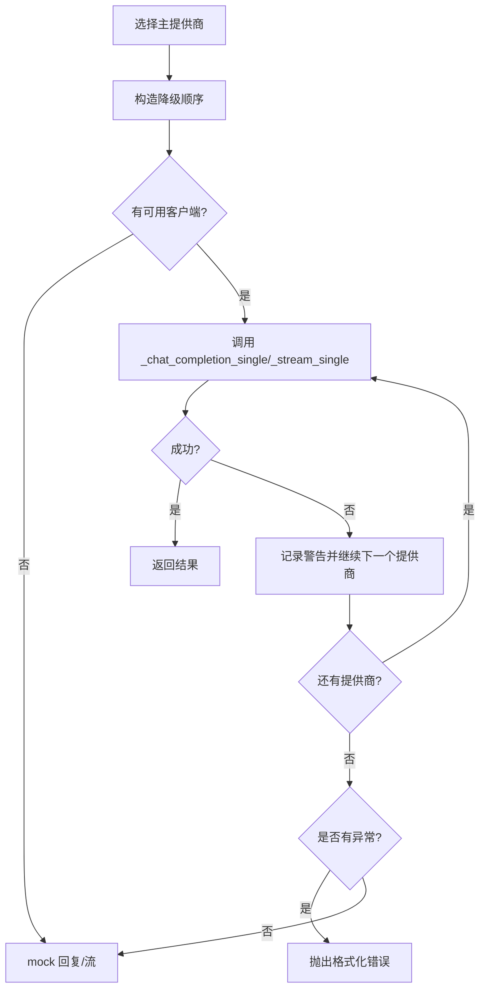
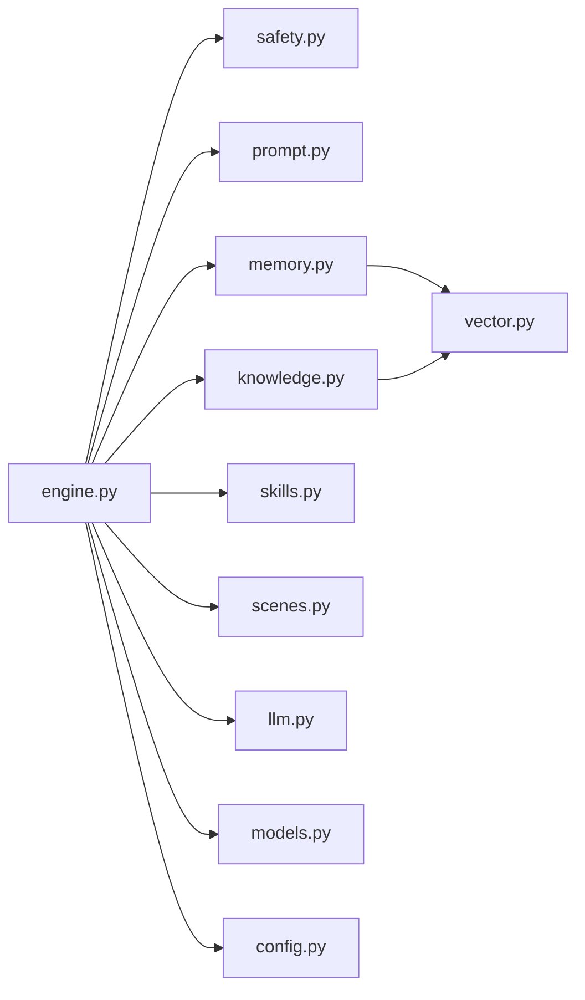

# Engine 编排引擎

<cite>
**本文引用的文件**   
- [hushai/meditation/core/engine.py](file://hushai/meditation/core/engine.py)
- [hushai/meditation/core/prompt.py](file://hushai/meditation/core/prompt.py)
- [hushai/meditation/core/memory.py](file://hushai/meditation/core/memory.py)
- [hushai/meditation/core/knowledge.py](file://hushai/meditation/core/knowledge.py)
- [hushai/meditation/core/llm.py](file://hushai/meditation/core/llm.py)
- [hushai/meditation/core/safety.py](file://hushai/meditation/core/safety.py)
- [hushai/meditation/core/scenes.py](file://hushai/meditation/core/scenes.py)
- [hushai/meditation/core/skills.py](file://hushai/meditation/core/skills.py)
- [hushai/meditation/api/chat.py](file://hushai/meditation/api/chat.py)
- [hushai/meditation/schemas.py](file://hushai/meditation/schemas.py)
- [hushai/meditation/config.py](file://hushai/meditation/config.py)
- [hushai/meditation/db/models.py](file://hushai/meditation/db/models.py)
- [hushai/meditation/db/vector.py](file://hushai/meditation/db/vector.py)
</cite>

## 目录
1. [简介](#简介)
2. [项目结构](#项目结构)
3. [核心组件](#核心组件)
4. [架构总览](#架构总览)
5. [详细组件分析](#详细组件分析)
6. [依赖关系分析](#依赖关系分析)
7. [性能与优化](#性能与优化)
8. [故障排查指南](#故障排查指南)
9. [结论](#结论)

## 简介
本文件面向“冥想老师”对话编排引擎，系统性阐述其设计理念与实现：对话流程控制、组件协调机制、状态管理策略；提示词构建系统、记忆检索集成、知识增强流程与 LLM 调用编排；错误处理、重试与降级策略；对话生命周期管理与上下文维护；以及关键时序图展示典型对话执行步骤与各组件协作模式。

## 项目结构
Engine 编排引擎位于 meditation 模块的 core 层，API 路由在 api 层，数据模型与向量库接口在 db 层，配置集中在 config 层。整体采用分层与职责单一的设计：API 仅负责鉴权、限流与协议转换；core.engine 作为编排中枢，串联安全检测、上下文组装、LLM 调用、持久化与记忆提取；prompt/memory/knowledge/skills/scenes 提供可插拔的上下文来源；llm 提供多提供商与自动降级的统一入口；db.models 定义 ORM 实体；db.vector 封装 ChromaDB 向量检索。

图表来源
- [hushai/meditation/api/chat.py:1-105](file://hushai/meditation/api/chat.py#L1-L105)
- [hushai/meditation/core/engine.py:166-314](file://hushai/meditation/core/engine.py#L166-L314)
- [hushai/meditation/core/prompt.py:77-103](file://hushai/meditation/core/prompt.py#L77-L103)
- [hushai/meditation/core/memory.py:45-112](file://hushai/meditation/core/memory.py#L45-L112)
- [hushai/meditation/core/knowledge.py:207-225](file://hushai/meditation/core/knowledge.py#L207-L225)
- [hushai/meditation/core/llm.py:136-179](file://hushai/meditation/core/llm.py#L136-L179)
- [hushai/meditation/db/vector.py:81-127](file://hushai/meditation/db/vector.py#L81-L127)
- [hushai/meditation/config.py:18-52](file://hushai/meditation/config.py#L18-L52)

章节来源
- [hushai/meditation/api/chat.py:1-105](file://hushai/meditation/api/chat.py#L1-L105)
- [hushai/meditation/core/engine.py:1-387](file://hushai/meditation/core/engine.py#L1-L387)
- [hushai/meditation/core/prompt.py:1-130](file://hushai/meditation/core/prompt.py#L1-L130)
- [hushai/meditation/core/memory.py:1-206](file://hushai/meditation/core/memory.py#L1-L206)
- [hushai/meditation/core/knowledge.py:1-225](file://hushai/meditation/core/knowledge.py#L1-L225)
- [hushai/meditation/core/llm.py:1-258](file://hushai/meditation/core/llm.py#L1-L258)
- [hushai/meditation/core/safety.py:1-111](file://hushai/meditation/core/safety.py#L1-L111)
- [hushai/meditation/core/scenes.py:1-30](file://hushai/meditation/core/scenes.py#L1-L30)
- [hushai/meditation/core/skills.py:1-59](file://hushai/meditation/core/skills.py#L1-L59)
- [hushai/meditation/db/models.py:1-434](file://hushai/meditation/db/models.py#L1-L434)
- [hushai/meditation/db/vector.py:1-179](file://hushai/meditation/db/vector.py#L1-L179)
- [hushai/meditation/config.py:1-136](file://hushai/meditation/config.py#L1-L136)

## 核心组件
- 编排引擎（engine）：负责会话与消息生命周期、安全前置检查、上下文拼装、LLM 调用、结果持久化与记忆提取触发。
- 提示词系统（prompt）：根据记忆、知识库、历史、技能、场景与导师风格动态拼接 system prompt。
- 记忆系统（memory）：基于 LLM 从对话中提取结构化记忆，写入数据库与向量库，并按当前问题检索相关片段注入提示词。
- 知识增强（knowledge）：将理论资料分块入库并支持语义检索，为问答与对话提供 RAG 增强。
- LLM 路由（llm）：统一封装 OpenAI 兼容接口，支持多提供商、自动降级与流式输出。
- 安全过滤（safety）：关键词级快速阻断，识别自伤/伤人倾向并给出建议文案。
- 场景与技能（scenes/skills）：按 ID 或全局加载已启用的场景/技能文本，注入到系统提示中。
- 数据与向量（models/vector）：SQLAlchemy 模型与 ChromaDB 集合操作。
- 配置（config）：集中加载环境变量，驱动各子系统行为。

章节来源
- [hushai/meditation/core/engine.py:91-127](file://hushai/meditation/core/engine.py#L91-L127)
- [hushai/meditation/core/prompt.py:77-103](file://hushai/meditation/core/prompt.py#L77-L103)
- [hushai/meditation/core/memory.py:161-173](file://hushai/meditation/core/memory.py#L161-L173)
- [hushai/meditation/core/knowledge.py:216-225](file://hushai/meditation/core/knowledge.py#L216-L225)
- [hushai/meditation/core/llm.py:136-179](file://hushai/meditation/core/llm.py#L136-L179)
- [hushai/meditation/core/safety.py:83-102](file://hushai/meditation/core/safety.py#L83-L102)
- [hushai/meditation/core/scenes.py:11-29](file://hushai/meditation/core/scenes.py#L11-L29)
- [hushai/meditation/core/skills.py:14-58](file://hushai/meditation/core/skills.py#L14-L58)
- [hushai/meditation/db/vector.py:104-127](file://hushai/meditation/db/vector.py#L104-L127)
- [hushai/meditation/config.py:18-52](file://hushai/meditation/config.py#L18-L52)

## 架构总览
Engine 编排引擎以“安全优先、上下文增强、可降级、可观测”为核心原则。一次对话请求进入后，先进行安全拦截，再并行拉取记忆、知识、技能、场景等上下文，组合成系统提示与历史消息，随后调用 LLM。返回结果持久化后，周期性触发记忆提取与标题补全。

图表来源
- [hushai/meditation/api/chat.py:58-77](file://hushai/meditation/api/chat.py#L58-L77)
- [hushai/meditation/core/engine.py:166-236](file://hushai/meditation/core/engine.py#L166-L236)
- [hushai/meditation/core/safety.py:83-102](file://hushai/meditation/core/safety.py#L83-L102)
- [hushai/meditation/core/memory.py:161-173](file://hushai/meditation/core/memory.py#L161-L173)
- [hushai/meditation/core/knowledge.py:216-225](file://hushai/meditation/core/knowledge.py#L216-L225)
- [hushai/meditation/core/llm.py:136-179](file://hushai/meditation/core/llm.py#L136-L179)
- [hushai/meditation/db/models.py:69-95](file://hushai/meditation/db/models.py#L69-L95)
- [hushai/meditation/db/vector.py:130-141](file://hushai/meditation/db/vector.py#L130-L141)

## 详细组件分析

### 编排引擎（engine.py）
- 会话与消息生命周期
  - 会话创建/复用：根据 user_id 与 conversation_id 查找活跃会话，不存在则新建。
  - 消息持久化：用户消息与助手消息均落库，支持按轮次限制读取历史。
- 安全前置
  - 在调用 LLM 前进行关键词级安全检测，命中则直接生成安全提示并落库，避免敏感内容外发。
- 上下文拼装
  - 并行拉取记忆、知识、技能、场景上下文，结合最近对话历史与导师个性化描述，构建 system prompt。
- LLM 调用
  - 非流式：chat_completion；流式：chat_completion_stream。两者均支持 provider 指定与默认降级顺序。
- 记忆提取与标题补全
  - 每 N 条用户消息触发一次记忆提取，失败不影响主流程；首次用户消息用于设置会话标题。
- 事务与回滚
  - 使用异步会话工厂，异常时回滚，保证一致性。

图表来源
- [hushai/meditation/core/engine.py:166-236](file://hushai/meditation/core/engine.py#L166-L236)
- [hushai/meditation/core/engine.py:238-314](file://hushai/meditation/core/engine.py#L238-L314)
- [hushai/meditation/core/engine.py:130-153](file://hushai/meditation/core/engine.py#L130-L153)

章节来源
- [hushai/meditation/core/engine.py:38-127](file://hushai/meditation/core/engine.py#L38-L127)
- [hushai/meditation/core/engine.py:166-314](file://hushai/meditation/core/engine.py#L166-L314)

### 提示词构建系统（prompt.py）
- 角色与准则：内置“小观”角色设定与安全边界提示，确保回答风格与合规性。
- 动态段落：可按需注入场景、技能、导师个性、知识库参考、记忆摘要与最近对话历史。
- 知识问答专用：独立的 system prompt 模板，强调基于知识库回答与危机引导。

章节来源
- [hushai/meditation/core/prompt.py:7-38](file://hushai/meditation/core/prompt.py#L7-L38)
- [hushai/meditation/core/prompt.py:77-103](file://hushai/meditation/core/prompt.py#L77-L103)
- [hushai/meditation/core/prompt.py:119-129](file://hushai/meditation/core/prompt.py#L119-L129)

### 记忆系统（memory.py）
- 提取：将最近对话文本组织为结构化提示，调用 LLM 抽取 JSON 数组形式的记忆条目（类别、内容、摘要、重要度）。
- 存储：写入 Memory 表，并异步写入向量库（失败不阻塞主流程）。
- 检索：按当前消息语义相似度检索 Top-K 记忆，格式化后注入提示词。
- 归档：对低重要度且长时间未更新的记忆进行归档，降低噪声。

图表来源
- [hushai/meditation/db/models.py:98-118](file://hushai/meditation/db/models.py#L98-L118)
- [hushai/meditation/db/vector.py:130-173](file://hushai/meditation/db/vector.py#L130-L173)

章节来源
- [hushai/meditation/core/memory.py:45-112](file://hushai/meditation/core/memory.py#L45-L112)
- [hushai/meditation/core/memory.py:115-173](file://hushai/meditation/core/memory.py#L115-L173)
- [hushai/meditation/core/memory.py:189-206](file://hushai/meditation/core/memory.py#L189-L206)

### 知识增强（knowledge.py）
- 导入：支持 Markdown 与纯文本，解析 frontmatter 与标题，转纯文本后按段落切块入库，并批量写入向量库。
- 检索：按查询语义相似度返回 Top-K 片段，附带来源与分数，供提示词引用。
- 问答路径：knowledge_qa 独立流程，侧重基于知识库的回答，温度更低以提升稳定性。

章节来源
- [hushai/meditation/core/knowledge.py:76-104](file://hushai/meditation/core/knowledge.py#L76-L104)
- [hushai/meditation/core/knowledge.py:137-171](file://hushai/meditation/core/knowledge.py#L137-L171)
- [hushai/meditation/core/knowledge.py:207-225](file://hushai/meditation/core/knowledge.py#L207-L225)
- [hushai/meditation/core/engine.py:316-387](file://hushai/meditation/core/engine.py#L316-L387)

### LLM 路由与降级（llm.py）
- 多提供商：支持 openai、deepseek、zhipu、kimi 及自定义 provider，通过配置注入 base_url、model、api_key。
- 自动降级：按优先级顺序尝试，失败则切换下一个；全部不可用时走 mock 分支（调试模式）。
- 流式与非流式：统一封装，流式失败同样触发降级；无 key 时 debug 模式返回模拟流。
- 错误处理：OpenAIError 被捕获并记录日志，最终转换为运行时异常抛出给上层。

图表来源
- [hushai/meditation/core/llm.py:82-90](file://hushai/meditation/core/llm.py#L82-L90)
- [hushai/meditation/core/llm.py:113-133](file://hushai/meditation/core/llm.py#L113-L133)
- [hushai/meditation/core/llm.py:136-179](file://hushai/meditation/core/llm.py#L136-L179)
- [hushai/meditation/core/llm.py:208-258](file://hushai/meditation/core/llm.py#L208-L258)

章节来源
- [hushai/meditation/core/llm.py:21-51](file://hushai/meditation/core/llm.py#L21-L51)
- [hushai/meditation/core/llm.py:136-179](file://hushai/meditation/core/llm.py#L136-L179)
- [hushai/meditation/core/llm.py:208-258](file://hushai/meditation/core/llm.py#L208-L258)

### 安全过滤（safety.py）
- 规则集：预编译正则匹配“伤害他人”和“自伤/轻生”两类级别，命中即阻断。
- 反馈文案：区分危机与紧急两种级别，分别给出心理援助热线与紧急求助信息。
- 集成点：在 engine 中于 LLM 调用前执行，确保安全兜底。

章节来源
- [hushai/meditation/core/safety.py:22-39](file://hushai/meditation/core/safety.py#L22-L39)
- [hushai/meditation/core/safety.py:83-102](file://hushai/meditation/core/safety.py#L83-L102)
- [hushai/meditation/core/engine.py:182-196](file://hushai/meditation/core/engine.py#L182-L196)

### 场景与技能（scenes.py / skills.py）
- 场景：按 scene_id 加载系统提示与开场白，为空则跳过。
- 技能：支持按 ID 列表去重与上限控制，或加载所有已启用技能，按排序合并入提示词。

章节来源
- [hushai/meditation/core/scenes.py:11-29](file://hushai/meditation/core/scenes.py#L11-L29)
- [hushai/meditation/core/skills.py:14-58](file://hushai/meditation/core/skills.py#L14-L58)

### API 路由（api/chat.py）
- 鉴权与限流：Bearer Token 校验与每分钟 30 次限流。
- 端点：
  - POST /api/chat：非流式对话
  - POST /api/chat/stream：SSE 流式对话
  - POST /api/chat/knowledge：知识问答
  - GET /api/chat/conversations：对话列表
  - GET /api/chat/conversations/{id}/messages：消息历史
- 错误映射：将内部 RuntimeError 转为 HTTP 500。

章节来源
- [hushai/meditation/api/chat.py:58-104](file://hushai/meditation/api/chat.py#L58-L104)
- [hushai/meditation/api/chat.py:107-127](file://hushai/meditation/api/chat.py#L107-L127)
- [hushai/meditation/api/chat.py:155-190](file://hushai/meditation/api/chat.py#L155-L190)
- [hushai/meditation/api/chat.py:205-244](file://hushai/meditation/api/chat.py#L205-L244)

### 数据模型与向量库（models.py / vector.py）
- 模型：Conversation、Message、Memory、KnowledgeChunk、Scene、Skill 等，支撑对话、记忆、知识与场景的数据持久化。
- 向量库：ChromaDB 集合 knowledge/memories，支持 upsert、query、where 过滤（如 user_id），并提供 OpenAI 嵌入函数可选。

章节来源
- [hushai/meditation/db/models.py:69-170](file://hushai/meditation/db/models.py#L69-L170)
- [hushai/meditation/db/vector.py:61-127](file://hushai/meditation/db/vector.py#L61-L127)
- [hushai/meditation/db/vector.py:130-173](file://hushai/meditation/db/vector.py#L130-L173)

## 依赖关系分析
- 耦合与内聚
  - engine 高度内聚编排逻辑，依赖多个 context 提供者，但通过明确接口解耦。
  - llm 屏蔽底层差异，向上暴露统一方法，便于扩展新提供商。
  - memory/knowledge 共享 vector 抽象，降低对外部向量库实现的耦合。
- 外部依赖
  - OpenAI 兼容 SDK、ChromaDB、SQLAlchemy、FastAPI。
- 潜在循环依赖
  - 当前未见循环 import；engine 仅单向依赖其他 core 模块。

图表来源
- [hushai/meditation/core/engine.py:14-28](file://hushai/meditation/core/engine.py#L14-L28)
- [hushai/meditation/core/memory.py:14-16](file://hushai/meditation/core/memory.py#L14-L16)
- [hushai/meditation/core/knowledge.py:10-12](file://hushai/meditation/core/knowledge.py#L10-L12)
- [hushai/meditation/core/llm.py:11-12](file://hushai/meditation/core/llm.py#L11-L12)

章节来源
- [hushai/meditation/core/engine.py:14-28](file://hushai/meditation/core/engine.py#L14-L28)
- [hushai/meditation/core/memory.py:14-16](file://hushai/meditation/core/memory.py#L14-L16)
- [hushai/meditation/core/knowledge.py:10-12](file://hushai/meditation/core/knowledge.py#L10-L12)
- [hushai/meditation/core/llm.py:11-12](file://hushai/meditation/core/llm.py#L11-L12)

## 性能与优化
- 上下文裁剪
  - 对话历史按最大轮次截取，避免超长输入导致延迟与成本上升。
- 记忆提取节流
  - 按固定间隔触发，减少不必要的 LLM 调用。
- 向量检索参数
  - memory_top_k 与 knowledge_top_k 可通过配置调整，平衡召回与延迟。
- 流式输出
  - SSE 流式传输提升首字延迟体验，适合长回复。
- 降级与 Mock
  - 多提供商自动降级保障可用性；debug 模式无 Key 时走 mock，利于本地联调。
- 并发与资源
  - 使用异步会话与异步 LLM 客户端，提高吞吐；注意连接池与超时配置。

[本节为通用指导，无需源码引用]

## 故障排查指南
- 安全误判
  - 检查 safety 规则是否过于严格，必要时调整关键词或增加白名单逻辑。
- 记忆提取失败
  - 关注 JSON 解析异常日志；确认 LLM 返回格式符合预期；必要时放宽约束或增加容错。
- 向量库写入失败
  - 检查 embedding 配置与网络连通性；写入失败不应阻塞主流程，但需监控告警。
- LLM 调用失败
  - 查看降级日志与具体提供商错误；确认 API Key、base_url、model 配置正确；必要时切换到备用提供商。
- 会话/消息丢失
  - 检查事务提交与异常回滚路径；确认数据库连接与权限。

章节来源
- [hushai/meditation/core/safety.py:83-102](file://hushai/meditation/core/safety.py#L83-L102)
- [hushai/meditation/core/memory.py:74-76](file://hushai/meditation/core/memory.py#L74-L76)
- [hushai/meditation/core/memory.py:109-111](file://hushai/meditation/core/memory.py#L109-L111)
- [hushai/meditation/core/llm.py:131-133](file://hushai/meditation/core/llm.py#L131-L133)
- [hushai/meditation/core/llm.py:236-245](file://hushai/meditation/core/llm.py#L236-L245)
- [hushai/meditation/core/engine.py:233-235](file://hushai/meditation/core/engine.py#L233-L235)

## 结论
Engine 编排引擎以安全为先、上下文增强与高可用为目标，通过模块化设计实现了灵活的提示词构建、记忆与知识增强、多模型路由与自动降级。配合流式输出与完善的错误处理，既保证了用户体验，也提升了系统的鲁棒性与可维护性。后续可在以下方向持续优化：更精细的记忆重要性评估、更智能的知识检索策略、更丰富的提供商与模型选择、以及更全面的可观测性与指标采集。