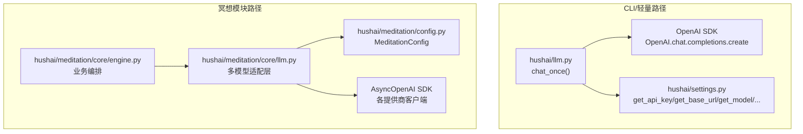
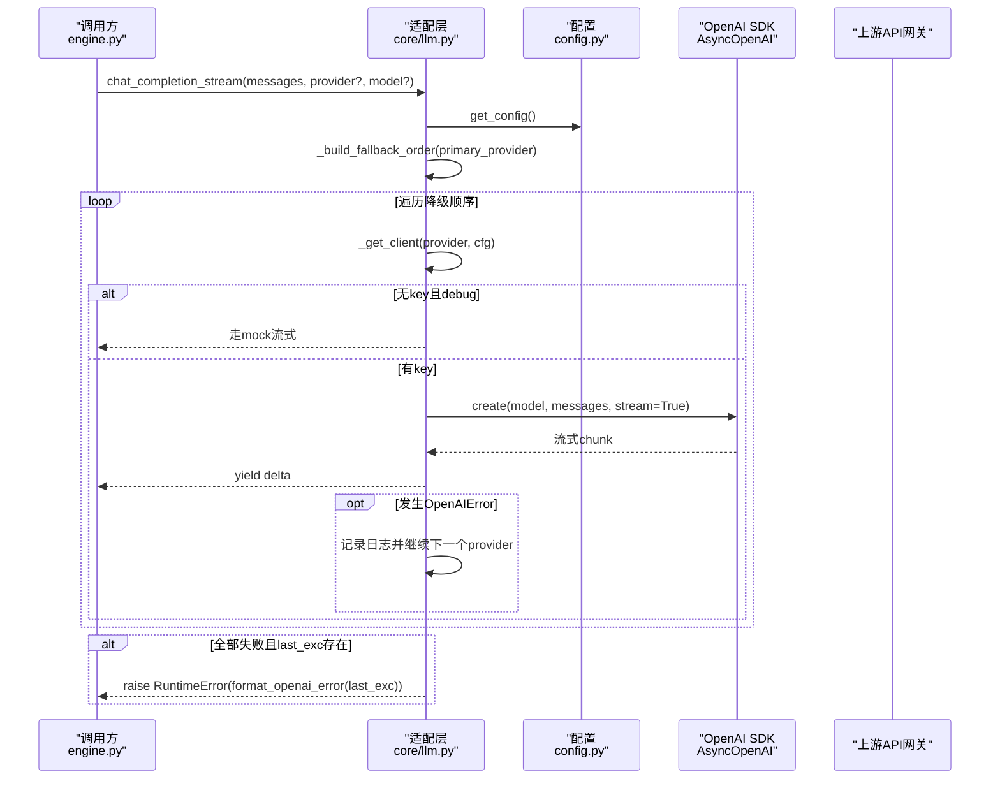
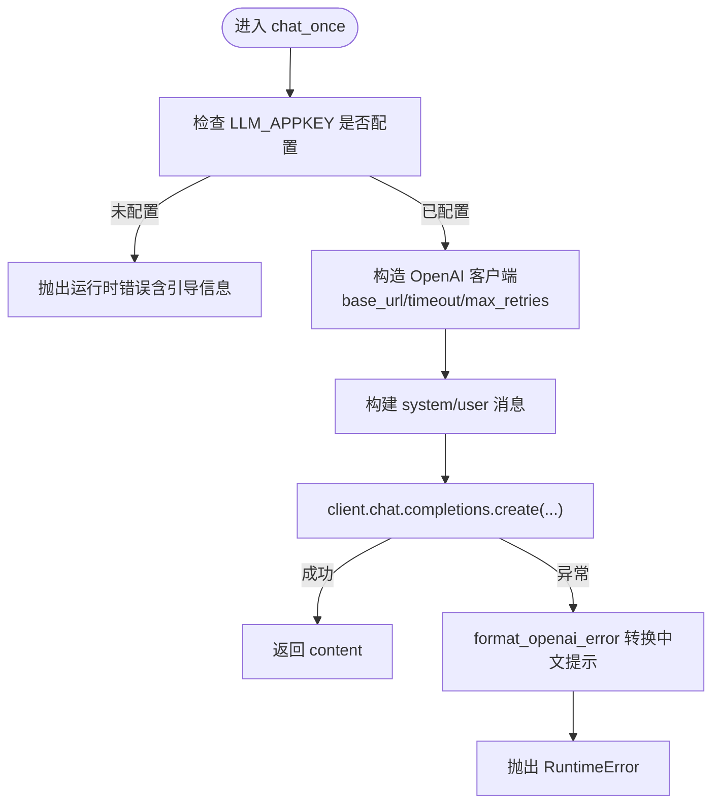
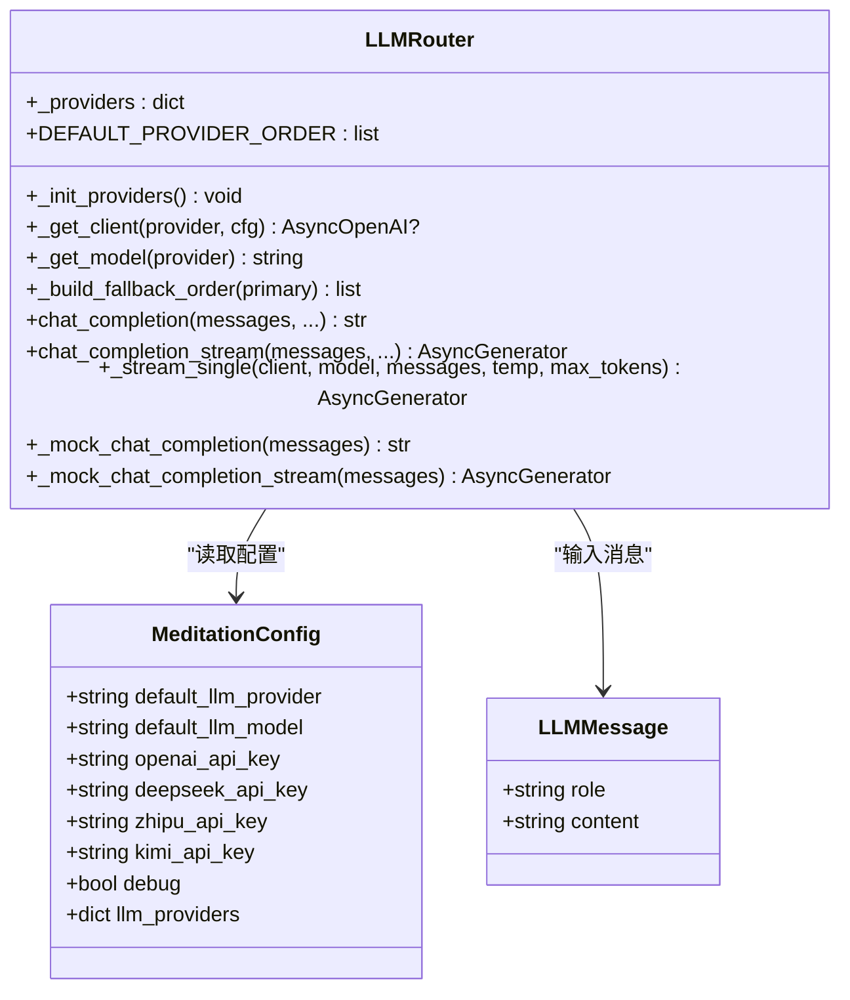
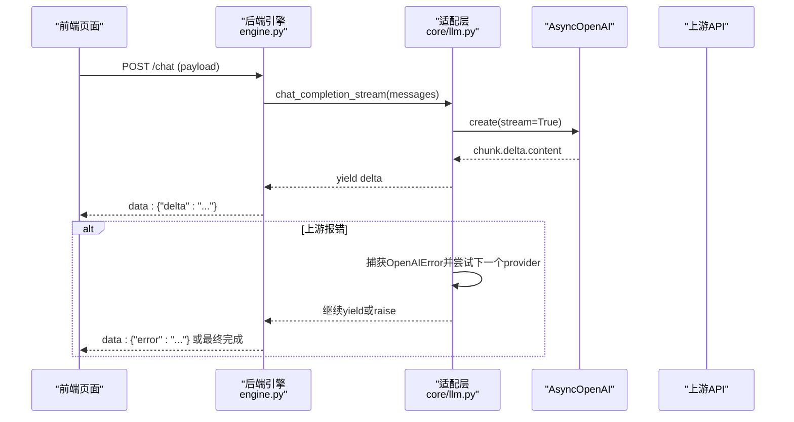
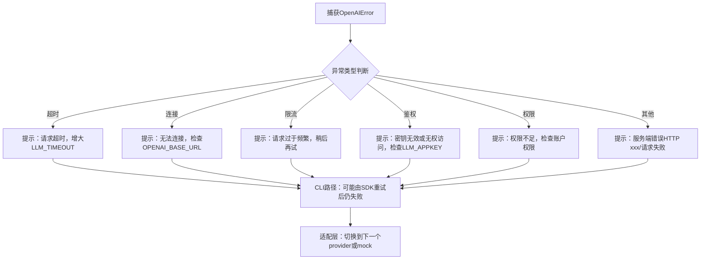
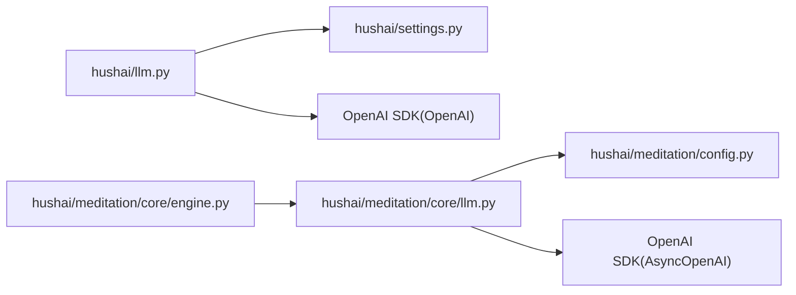

# LLM调用编排

<cite>
**本文引用的文件**   
- [hushai/llm.py](file://hushai/llm.py)
- [hushai/settings.py](file://hushai/settings.py)
- [hushai/meditation/core/llm.py](file://hushai/meditation/core/llm.py)
- [hushai/meditation/config.py](file://hushai/meditation/config.py)
- [hushai/meditation/core/engine.py](file://hushai/meditation/core/engine.py)
- [docs/configuration.md](file://docs/configuration.md)
- [tests/test_llm_errors.py](file://tests/test_llm_errors.py)
- [tests/meditation/test_llm_core.py](file://tests/meditation/test_llm_core.py)
</cite>

## 目录
1. [简介](#简介)
2. [项目结构](#项目结构)
3. [核心组件](#核心组件)
4. [架构总览](#架构总览)
5. [详细组件分析](#详细组件分析)
6. [依赖关系分析](#依赖关系分析)
7. [性能与成本优化](#性能与成本优化)
8. [监控与可观测性](#监控与可观测性)
9. [故障排查指南](#故障排查指南)
10. [结论](#结论)
11. [附录：配置示例](#附录配置示例)

## 简介
本文件面向“LLM调用编排系统”，围绕大语言模型的调用流程、参数配置、响应处理机制进行系统化说明。重点覆盖：
- 多模型适配层设计与自动降级策略
- 流式输出实现与前端消费方式
- 错误重试策略与异常文案映射
- 负载均衡与成本优化建议
- 调用监控、指标收集与故障诊断方法
- 时序图、错误处理流程图与配置示例

## 项目结构
本项目包含两套 LLM 调用路径：
- CLI/轻量路径：通过 hushai/llm.py 直接调用 OpenAI 兼容接口，适合命令行或简单服务场景。
- 冥想模块路径：通过 hushai/meditation/core/llm.py 提供多提供商路由、自动降级与流式输出，被 engine.py 等上层逻辑使用。

图表来源
- [hushai/llm.py:100-142](file://hushai/llm.py#L100-L142)
- [hushai/settings.py:123-218](file://hushai/settings.py#L123-L218)
- [hushai/meditation/core/llm.py:136-258](file://hushai/meditation/core/llm.py#L136-L258)
- [hushai/meditation/config.py:18-115](file://hushai/meditation/config.py#L18-L115)

章节来源
- [hushai/llm.py:100-142](file://hushai/llm.py#L100-L142)
- [hushai/settings.py:123-218](file://hushai/settings.py#L123-L218)
- [hushai/meditation/core/llm.py:136-258](file://hushai/meditation/core/llm.py#L136-L258)
- [hushai/meditation/config.py:18-115](file://hushai/meditation/config.py#L18-L115)

## 核心组件
- 轻量调用入口（CLI）
  - chat_once：组装消息、读取配置、构造 OpenAI 客户端并发起请求；对异常进行中文友好提示。
  - format_openai_error：将 OpenAI SDK 异常转换为可读中文信息。
- 多模型适配层（冥想模块）
  - MeditationConfig：集中管理各提供商的 API Key、Base URL、默认模型及调试开关等。
  - _init_providers/_get_client/_get_model：初始化提供商配置、构建 AsyncOpenAI 客户端、解析默认模型。
  - chat_completion/chat_completion_stream：统一非流式/流式调用入口，内置自动降级与 mock 兜底。
  - _build_fallback_order：生成降级顺序（主 provider 优先，其余按固定顺序补齐）。
- 配置解析（CLI）
  - settings：环境变量优先于 JSON 配置文件，提供 get_api_key/get_base_url/get_model/get_timeout_seconds/get_max_retries/get_mode 等。

章节来源
- [hushai/llm.py:73-142](file://hushai/llm.py#L73-L142)
- [hushai/meditation/core/llm.py:21-90](file://hushai/meditation/core/llm.py#L21-L90)
- [hushai/meditation/core/llm.py:136-258](file://hushai/meditation/core/llm.py#L136-L258)
- [hushai/meditation/config.py:18-115](file://hushai/meditation/config.py#L18-L115)
- [hushai/settings.py:123-218](file://hushai/settings.py#L123-L218)

## 架构总览
整体由“配置层 + 适配层 + 调用层”构成。配置层负责从环境变量/JSON 加载参数；适配层负责多提供商路由、降级与流式封装；调用层对接 OpenAI 兼容 SDK。

图表来源
- [hushai/meditation/core/llm.py:208-258](file://hushai/meditation/core/llm.py#L208-L258)
- [hushai/meditation/config.py:121-125](file://hushai/meditation/config.py#L121-L125)

## 详细组件分析

### 组件A：轻量调用入口（CLI）
- 功能要点
  - 读取密钥、Base URL、模型、超时、重试次数。
  - 根据对话模式拼接系统提示。
  - 捕获 OpenAI SDK 异常并转换为中文提示。
- 关键流程
  - chat_once：校验密钥 -> 构造客户端 -> 发送请求 -> 返回内容。
  - build_system_prompt：按模式选择不同系统提示后缀。
  - format_openai_error：统一错误文案。

图表来源
- [hushai/llm.py:100-142](file://hushai/llm.py#L100-L142)
- [hushai/llm.py:73-97](file://hushai/llm.py#L73-L97)

章节来源
- [hushai/llm.py:73-142](file://hushai/llm.py#L73-L142)
- [tests/test_llm_errors.py:1-58](file://tests/test_llm_errors.py#L1-L58)

### 组件B：多模型适配层（冥想模块）
- 功能要点
  - 支持 openai/deepseek/zhipu/kimi 等多提供商。
  - 自动降级：主 provider 失败时依次尝试其他可用提供商。
  - 流式输出：基于 AsyncOpenAI 的流式接口逐块产出。
  - Mock 兜底：debug 且无 key 时返回模拟文本。
- 数据结构
  - LLMMessage：角色+内容的消息对象。
  - MeditationConfig：集中存储各提供商配置与默认值。
- 关键函数
  - _init_providers：初始化提供商字典。
  - _get_client：按 provider 创建 AsyncOpenAI 客户端。
  - _build_fallback_order：生成降级顺序。
  - chat_completion/chat_completion_stream：统一入口，内部驱动降级与 mock。

图表来源
- [hushai/meditation/config.py:18-115](file://hushai/meditation/config.py#L18-L115)
- [hushai/meditation/core/llm.py:53-90](file://hushai/meditation/core/llm.py#L53-L90)
- [hushai/meditation/core/llm.py:136-258](file://hushai/meditation/core/llm.py#L136-L258)

章节来源
- [hushai/meditation/core/llm.py:21-90](file://hushai/meditation/core/llm.py#L21-L90)
- [hushai/meditation/core/llm.py:136-258](file://hushai/meditation/core/llm.py#L136-L258)
- [hushai/meditation/config.py:18-115](file://hushai/meditation/config.py#L18-L115)

### 组件C：流式输出与前端消费
- 后端
  - _stream_single：以 stream=True 拉取 chunk，yield delta.content。
  - chat_completion_stream：在 try/except 中驱动降级，失败则切换下一 provider。
- 前端
  - 使用 fetch + ReadableStream 读取 SSE-like data: 行，解析 JSON 中的 delta/done/error。
  - 遇到 401 触发刷新令牌后重试；网络错误给出友好提示。

图表来源
- [hushai/meditation/core/llm.py:181-258](file://hushai/meditation/core/llm.py#L181-L258)
- [hushai/meditation/core/engine.py:290-295](file://hushai/meditation/core/engine.py#L290-L295)

章节来源
- [hushai/meditation/core/llm.py:181-258](file://hushai/meditation/core/llm.py#L181-L258)
- [hushai/meditation/core/engine.py:290-295](file://hushai/meditation/core/engine.py#L290-L295)

### 组件D：错误处理与重试策略
- 错误文案映射
  - format_openai_error：针对超时、连接、限流、鉴权、权限、通用状态码等给出中文提示。
- 重试策略
  - CLI 路径：通过 OpenAI SDK 的 max_retries 参数控制（settings.get_max_retries）。
  - 适配层：不依赖 SDK 重试，而是应用层“降级到其它 provider”的策略。
- 测试覆盖
  - tests/test_llm_errors.py：验证各类异常的中文提示。
  - tests/meditation/test_llm_core.py：验证降级顺序、generator 语义修复、mock 分支。

图表来源
- [hushai/llm.py:81-97](file://hushai/llm.py#L81-L97)
- [hushai/settings.py:205-218](file://hushai/settings.py#L205-L218)
- [hushai/meditation/core/llm.py:221-245](file://hushai/meditation/core/llm.py#L221-L245)

章节来源
- [hushai/llm.py:81-97](file://hushai/llm.py#L81-L97)
- [tests/test_llm_errors.py:1-58](file://tests/test_llm_errors.py#L1-L58)
- [tests/meditation/test_llm_core.py:1-45](file://tests/meditation/test_llm_core.py#L1-L45)

## 依赖关系分析
- 轻量路径依赖
  - hushai/llm.py 依赖 hushai/settings.py 获取密钥、URL、模型、超时、重试与模式。
- 适配层依赖
  - hushai/meditation/core/llm.py 依赖 hushai/meditation/config.py 获取各提供商配置。
  - 上层 engine.py 通过 chat_completion/chat_completion_stream 接入适配层。
- 外部依赖
  - OpenAI SDK（同步/异步）用于实际 HTTP 调用。

图表来源
- [hushai/llm.py:100-142](file://hushai/llm.py#L100-L142)
- [hushai/settings.py:123-218](file://hushai/settings.py#L123-L218)
- [hushai/meditation/core/llm.py:136-258](file://hushai/meditation/core/llm.py#L136-L258)
- [hushai/meditation/config.py:18-115](file://hushai/meditation/config.py#L18-L115)

章节来源
- [hushai/llm.py:100-142](file://hushai/llm.py#L100-L142)
- [hushai/meditation/core/llm.py:136-258](file://hushai/meditation/core/llm.py#L136-L258)
- [hushai/meditation/config.py:18-115](file://hushai/meditation/config.py#L18-L115)

## 性能与成本优化
- 模型选择与成本
  - 默认模型为轻量级（如 gpt-4o-mini），适合低成本场景；复杂任务可选择更强模型。
  - 通过 MeditationConfig.default_llm_model 或各提供商 model 字段调整。
- 超时与重试
  - CLI 路径：LLM_TIMEOUT/LLM_MAX_RETRIES 影响 SDK 行为；合理设置避免长时间阻塞。
  - 适配层：通过降级策略提升可用性，但需关注下游限流与成本。
- 流式输出
  - 降低首字节延迟，提升用户体验；注意前端缓冲与错误处理。
- 负载均衡建议（扩展方向）
  - 当前降级顺序固定，可按提供商延迟/成功率动态调整权重（例如引入健康检查与权重轮询）。
  - 结合速率限制与熔断器，避免雪崩。

[本节为通用指导，无需源码引用]

## 监控与可观测性
- 日志
  - 适配层在降级与失败时记录 info/warning 日志，便于定位问题。
- 指标采集（建议）
  - 请求耗时、成功率、降级次数、各提供商调用占比、错误分类计数。
  - 可在 engine.py 或中间件层埋点，聚合至 Prometheus/Grafana。
- 链路追踪
  - 为每次请求分配 trace_id，贯穿前端、后端、SDK 调用，便于端到端排障。

[本节为通用指导，无需源码引用]

## 故障排查指南
- 常见错误与处理
  - 未配置密钥：CLI 会抛出运行时错误并提示如何设置 LLM_APPKEY。
  - 连接/超时：检查 OPENAI_BASE_URL、网络连通性与 LLM_TIMEOUT。
  - 限流：减少并发或提高间隔，必要时启用更多提供商分担。
  - 鉴权/权限：核对 API Key 与模型访问策略。
- 快速定位
  - 查看适配层日志中的 fallback 记录与 last_exc 信息。
  - 确认 MeditationConfig 中对应 provider 的 api_key/base_url/model 是否正确。
  - 使用单元测试用例思路复现：mock SDK 抛错，验证降级与 mock 分支。

章节来源
- [hushai/llm.py:100-142](file://hushai/llm.py#L100-L142)
- [hushai/meditation/core/llm.py:221-245](file://hushai/meditation/core/llm.py#L221-L245)
- [tests/test_llm_errors.py:1-58](file://tests/test_llm_errors.py#L1-L58)

## 结论
本编排系统在轻量路径与冥想模块路径上分别实现了稳定可靠的 LLM 调用能力。轻量路径强调简洁与易用，适配层则提供了多提供商路由、自动降级与流式输出，满足高可用与良好体验的需求。配合合理的超时/重试、监控与故障排查手段，可在生产环境中获得稳定的服务表现。

[本节为总结，无需源码引用]

## 附录：配置示例
- CLI 路径（环境变量与 JSON 配置）
  - 环境变量优先级高于 JSON 配置；推荐密钥使用环境变量。
  - 参考文档：docs/configuration.md 中的变量表与 JSON 字段说明。
- 冥想模块路径（MeditationConfig）
  - 通过 MEDITATION_* 环境变量注入各提供商配置与默认模型。
  - 示例键：MEDITATION_DEFAULT_LLM_PROVIDER、MEDITATION_OPENAI_API_KEY、MEDITATION_DEEPSEEK_MODEL 等。

章节来源
- [docs/configuration.md:1-114](file://docs/configuration.md#L1-L114)
- [hushai/meditation/config.py:64-115](file://hushai/meditation/config.py#L64-L115)