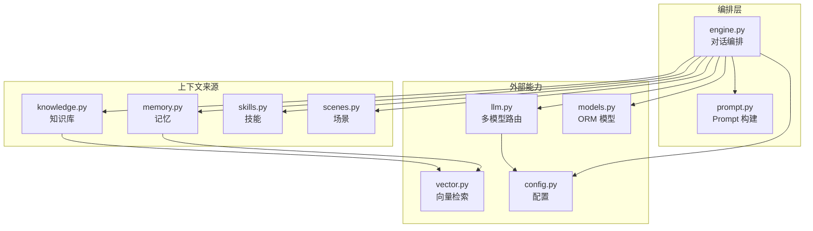
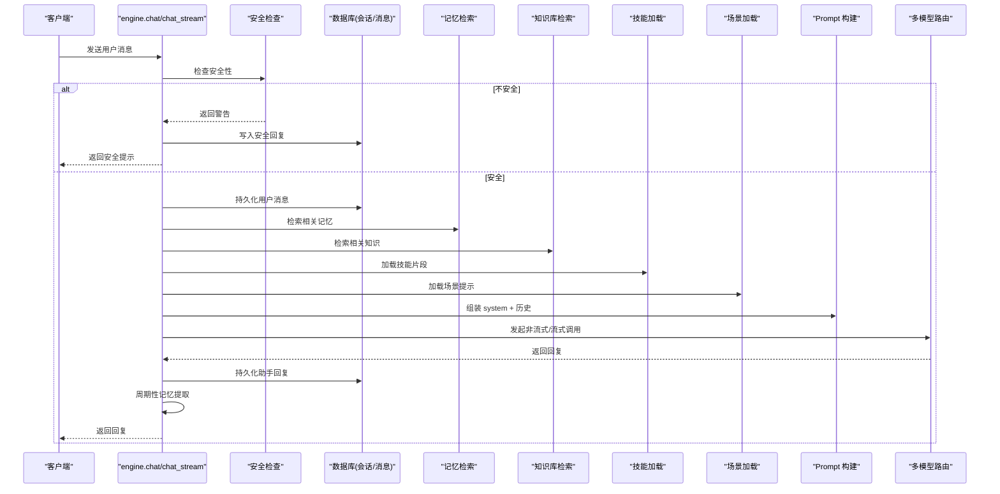
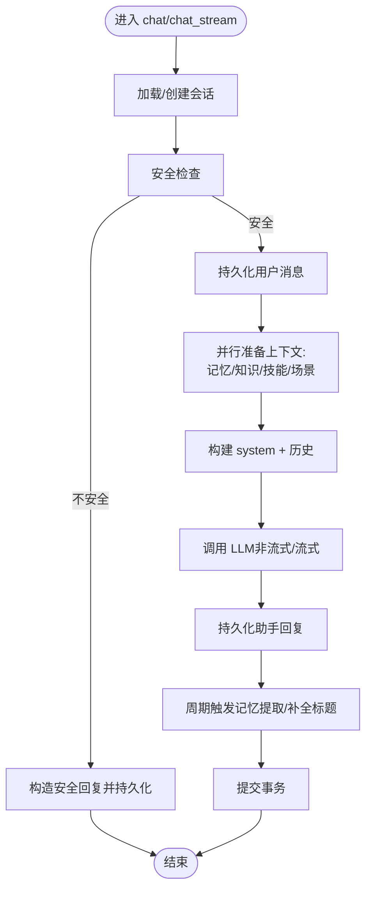
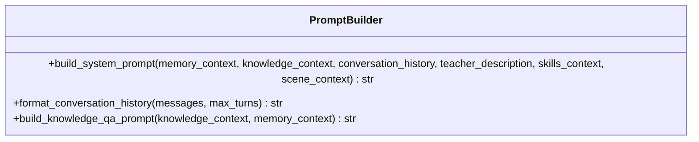
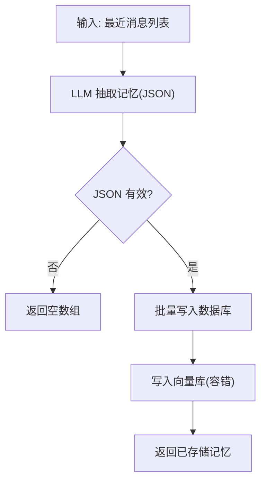
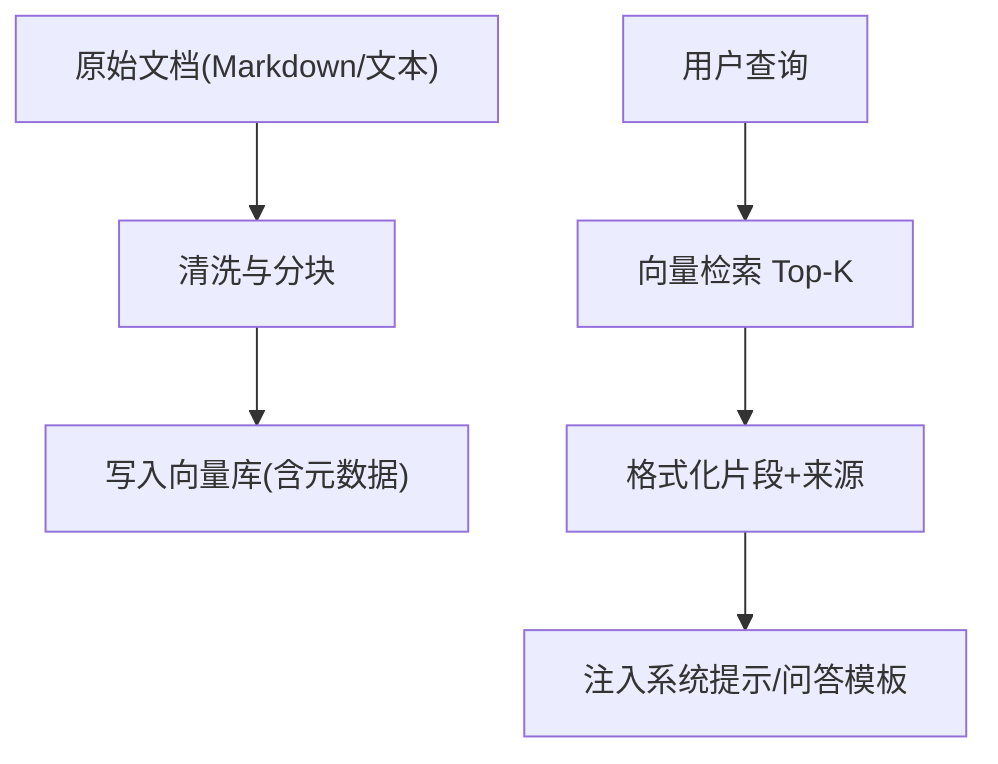
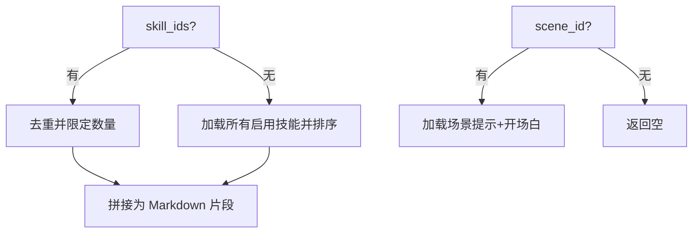
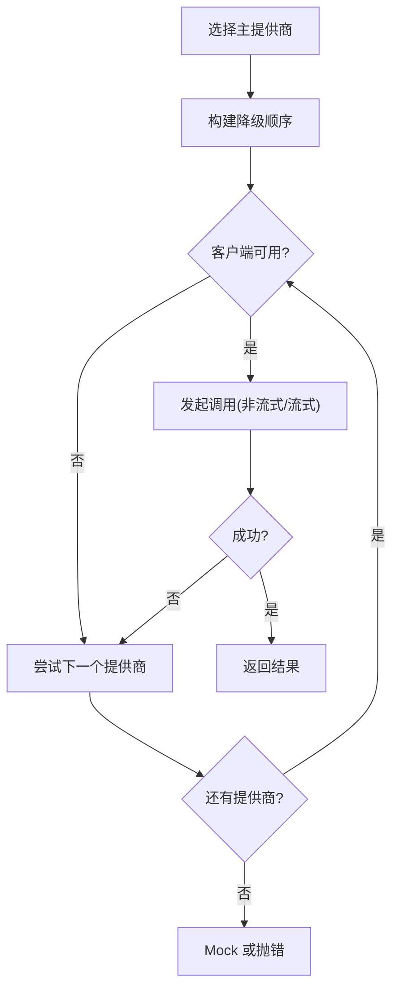
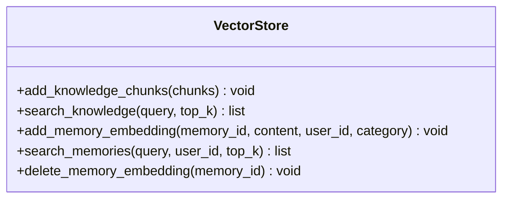
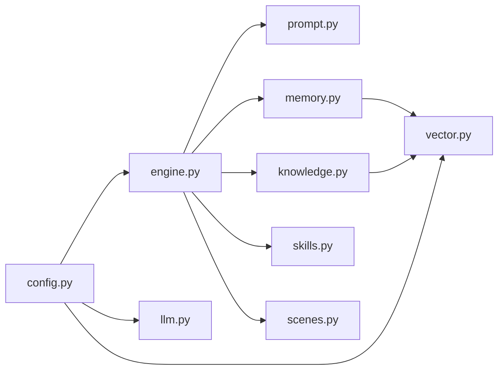

# 上下文构建系统

<cite>
**本文引用的文件**   
- [engine.py](file://hushai/meditation/core/engine.py)
- [prompt.py](file://hushai/meditation/core/prompt.py)
- [memory.py](file://hushai/meditation/core/memory.py)
- [knowledge.py](file://hushai/meditation/core/knowledge.py)
- [scenes.py](file://hushai/meditation/core/scenes.py)
- [skills.py](file://hushai/meditation/core/skills.py)
- [llm.py](file://hushai/meditation/core/llm.py)
- [vector.py](file://hushai/meditation/db/vector.py)
- [models.py](file://hushai/meditation/db/models.py)
- [config.py](file://hushai/meditation/config.py)
</cite>

## 目录
1. [引言](#引言)
2. [项目结构](#项目结构)
3. [核心组件](#核心组件)
4. [架构总览](#架构总览)
5. [详细组件分析](#详细组件分析)
6. [依赖关系分析](#依赖关系分析)
7. [性能与长度优化](#性能与长度优化)
8. [故障排查指南](#故障排查指南)
9. [结论](#结论)
10. [附录：配置示例](#附录配置示例)

## 引言
本文件面向“上下文构建系统”，系统性阐述对话上下文的组装过程，包括历史记录加载、记忆上下文集成、知识检索结果融合、技能与场景提示词组合；并深入说明提示词模板系统、变量替换机制、上下文长度优化策略、多源信息整合算法、优先级排序与冲突解决机制；同时给出上下文缓存策略、增量更新与性能调优建议，并提供流程图与配置示例。

## 项目结构
围绕上下文构建的核心代码集中在 meditation 模块的 core 层与 db 层：
- core/engine.py：编排对话流程、组装上下文、调用 LLM、持久化消息与触发记忆提取。
- core/prompt.py：动态 Prompt 构建与历史格式化。
- core/memory.py：长期记忆的提取、存储、检索与归档。
- core/knowledge.py：知识库 RAG 导入、分块与检索。
- core/scenes.py：场景上下文注入。
- core/skills.py：技能片段注入与去重限流。
- core/llm.py：多模型路由与降级。
- db/vector.py：ChromaDB 向量库封装（知识与记忆）。
- db/models.py：SQLAlchemy ORM 模型定义。
- config.py：冥想模块配置与环境变量映射。

图表来源
- [engine.py:91-127](file://hushai/meditation/core/engine.py#L91-L127)
- [prompt.py:77-103](file://hushai/meditation/core/prompt.py#L77-L103)
- [memory.py:161-173](file://hushai/meditation/core/memory.py#L161-L173)
- [knowledge.py:216-224](file://hushai/meditation/core/knowledge.py#L216-L224)
- [skills.py:14-58](file://hushai/meditation/core/skills.py#L14-L58)
- [scenes.py:11-29](file://hushai/meditation/core/scenes.py#L11-L29)
- [llm.py:136-178](file://hushai/meditation/core/llm.py#L136-L178)
- [vector.py:104-127](file://hushai/meditation/db/vector.py#L104-L127)
- [models.py:69-117](file://hushai/meditation/db/models.py#L69-L117)
- [config.py:18-52](file://hushai/meditation/config.py#L18-L52)

章节来源
- [engine.py:91-127](file://hushai/meditation/core/engine.py#L91-L127)
- [prompt.py:77-103](file://hushai/meditation/core/prompt.py#L77-L103)
- [memory.py:161-173](file://hushai/meditation/core/memory.py#L161-L173)
- [knowledge.py:216-224](file://hushai/meditation/core/knowledge.py#L216-L224)
- [skills.py:14-58](file://hushai/meditation/core/skills.py#L14-L58)
- [scenes.py:11-29](file://hushai/meditation/core/scenes.py#L11-L29)
- [llm.py:136-178](file://hushai/meditation/core/llm.py#L136-L178)
- [vector.py:104-127](file://hushai/meditation/db/vector.py#L104-L127)
- [models.py:69-117](file://hushai/meditation/db/models.py#L69-L117)
- [config.py:18-52](file://hushai/meditation/config.py#L18-L52)

## 核心组件
- 对话编排器（engine）：负责会话生命周期管理、上下文拼装、安全拦截、LLM 调用、消息持久化与记忆提取调度。
- 提示词构建器（prompt）：提供角色设定、安全边界、各上下文段落的拼接与变量替换。
- 记忆子系统（memory）：基于 LLM 抽取结构化记忆，持久化到数据库与向量库，按当前消息语义检索相关记忆。
- 知识库子系统（knowledge）：Markdown/文本导入、分块、向量化入库；按查询检索 Top-K 片段。
- 技能与场景（skills, scenes）：从数据库读取已启用的技能或场景提示，按顺序与上限注入系统提示。
- 多模型路由（llm）：支持多提供商、自动降级与调试 Mock。
- 向量库（vector）：ChromaDB 集合管理与相似度检索。
- 数据模型（models）：用户、会话、消息、记忆、技能、知识块、场景等实体。
- 配置（config）：环境变量映射与默认值。

章节来源
- [engine.py:91-127](file://hushai/meditation/core/engine.py#L91-L127)
- [prompt.py:77-103](file://hushai/meditation/core/prompt.py#L77-L103)
- [memory.py:45-76](file://hushai/meditation/core/memory.py#L45-L76)
- [knowledge.py:137-171](file://hushai/meditation/core/knowledge.py#L137-L171)
- [skills.py:14-58](file://hushai/meditation/core/skills.py#L14-L58)
- [scenes.py:11-29](file://hushai/meditation/core/scenes.py#L11-L29)
- [llm.py:136-178](file://hushai/meditation/core/llm.py#L136-L178)
- [vector.py:104-127](file://hushai/meditation/db/vector.py#L104-L127)
- [models.py:69-117](file://hushai/meditation/db/models.py#L69-L117)
- [config.py:18-52](file://hushai/meditation/config.py#L18-L52)

## 架构总览
下图展示一次对话请求的端到端上下文构建与生成流程，涵盖安全检查、上下文拼装、LLM 调用与持久化。

图表来源
- [engine.py:166-236](file://hushai/meditation/core/engine.py#L166-L236)
- [engine.py:238-314](file://hushai/meditation/core/engine.py#L238-L314)
- [engine.py:91-127](file://hushai/meditation/core/engine.py#L91-L127)
- [prompt.py:77-103](file://hushai/meditation/core/prompt.py#L77-L103)
- [llm.py:136-178](file://hushai/meditation/core/llm.py#L136-L178)

## 详细组件分析

### 对话编排与上下文组装（engine）
- 会话与消息：根据 user_id 与 conversation_id 获取或创建会话；按配置限制最大轮次加载历史消息。
- 多源上下文并行准备：
  - 记忆上下文：按当前消息语义检索 Top-K 记忆摘要。
  - 知识上下文：对当前消息进行向量检索，取 Top-K 片段。
  - 技能上下文：按 skill_ids 或全部启用技能，去重并按 sort_order/name 排序，限制每消息最多 N 个。
  - 场景上下文：按 scene_id 加载对应系统提示与开场白。
- 提示词构建：将上述片段与角色设定、个性化风格、安全边界拼接为 system prompt，再追加历史消息形成完整 messages。
- LLM 调用：支持非流式与流式两种模式，统一通过 llm 模块的多模型路由。
- 持久化与记忆提取：保存用户与助手消息；按固定间隔触发记忆提取与标题补全。

图表来源
- [engine.py:166-236](file://hushai/meditation/core/engine.py#L166-L236)
- [engine.py:238-314](file://hushai/meditation/core/engine.py#L238-L314)
- [engine.py:91-127](file://hushai/meditation/core/engine.py#L91-L127)

章节来源
- [engine.py:59-76](file://hushai/meditation/core/engine.py#L59-L76)
- [engine.py:91-127](file://hushai/meditation/core/engine.py#L91-L127)
- [engine.py:166-236](file://hushai/meditation/core/engine.py#L166-L236)
- [engine.py:238-314](file://hushai/meditation/core/engine.py#L238-L314)

### 提示词模板系统与变量替换（prompt）
- 模板组成：
  - 角色基础设定与安全边界。
  - 可选段落：场景指引、技能指引、教师个性化风格、知识库参考、记忆摘要、最近对话。
- 变量替换：使用字符串 format 将 memory_context、knowledge_context、history、skills_context、scene_context 等占位符替换为实际内容。
- 历史格式化：仅保留最近若干轮，以“学生/老师”标签输出，避免过长。
- 知识问答专用模板：在 knowledge_qa 路径下单独构建，强调基于知识库回答。

图表来源
- [prompt.py:77-103](file://hushai/meditation/core/prompt.py#L77-L103)
- [prompt.py:106-116](file://hushai/meditation/core/prompt.py#L106-L116)
- [prompt.py:119-129](file://hushai/meditation/core/prompt.py#L119-L129)

章节来源
- [prompt.py:77-103](file://hushai/meditation/core/prompt.py#L77-L103)
- [prompt.py:106-116](file://hushai/meditation/core/prompt.py#L106-L116)
- [prompt.py:119-129](file://hushai/meditation/core/prompt.py#L119-L129)

### 记忆上下文集成（memory）
- 记忆提取：
  - 将最近消息拼接为对话文本，调用 LLM 抽取结构化记忆（类别、内容、摘要、重要度）。
  - 解析 JSON，过滤无效条目。
- 记忆存储：
  - 写入数据库，并异步写入向量库（失败可记录日志继续）。
- 记忆检索：
  - 基于当前消息语义，按用户维度过滤，Top-K 召回后按 ID 顺序拉取活跃记忆对象。
- 上下文格式化：
  - 将每条记忆转换为“[类别] 摘要/前缀”行，便于注入系统提示。
- 归档清理：
  - 低重要度且长时间未更新的记忆标记为归档，减少噪声。

图表来源
- [memory.py:45-76](file://hushai/meditation/core/memory.py#L45-L76)
- [memory.py:79-112](file://hushai/meditation/core/memory.py#L79-L112)
- [memory.py:115-138](file://hushai/meditation/core/memory.py#L115-L138)
- [memory.py:161-173](file://hushai/meditation/core/memory.py#L161-L173)
- [memory.py:189-205](file://hushai/meditation/core/memory.py#L189-L205)

章节来源
- [memory.py:45-76](file://hushai/meditation/core/memory.py#L45-L76)
- [memory.py:79-112](file://hushai/meditation/core/memory.py#L79-L112)
- [memory.py:115-138](file://hushai/meditation/core/memory.py#L115-L138)
- [memory.py:161-173](file://hushai/meditation/core/memory.py#L161-L173)
- [memory.py:189-205](file://hushai/meditation/core/memory.py#L189-L205)

### 知识检索结果融合（knowledge）
- 导入与分块：
  - Markdown 转纯文本，解析 frontmatter 元数据，按段落切分为 chunk，支持重叠。
  - 批量写入向量库，附带标题、标签、来源等元数据。
- 检索与融合：
  - 按查询向量检索 Top-K，合并为“【相关理论参考】”段落，截断内容长度并标注来源。
- 知识问答路径：
  - 在 engine.knowledge_qa 中，将知识库片段与记忆上下文一起注入专用模板。

图表来源
- [knowledge.py:76-103](file://hushai/meditation/core/knowledge.py#L76-L103)
- [knowledge.py:106-134](file://hushai/meditation/core/knowledge.py#L106-L134)
- [knowledge.py:137-171](file://hushai/meditation/core/knowledge.py#L137-L171)
- [knowledge.py:207-224](file://hushai/meditation/core/knowledge.py#L207-L224)
- [engine.py:316-387](file://hushai/meditation/core/engine.py#L316-L387)

章节来源
- [knowledge.py:76-103](file://hushai/meditation/core/knowledge.py#L76-L103)
- [knowledge.py:106-134](file://hushai/meditation/core/knowledge.py#L106-L134)
- [knowledge.py:137-171](file://hushai/meditation/core/knowledge.py#L137-L171)
- [knowledge.py:207-224](file://hushai/meditation/core/knowledge.py#L207-L224)
- [engine.py:316-387](file://hushai/meditation/core/engine.py#L316-L387)

### 技能与场景提示词组合（skills, scenes）
- 技能：
  - 若指定 skill_ids，则按传入顺序去重并限制数量；否则加载所有启用技能，按 sort_order/name 排序，限制每消息最多 N 个。
  - 输出格式为“## 名称\n内容”。
- 场景：
  - 按 scene_id 加载激活的场景系统提示与可选开场白，拼接为场景上下文。

图表来源
- [skills.py:14-58](file://hushai/meditation/core/skills.py#L14-L58)
- [scenes.py:11-29](file://hushai/meditation/core/scenes.py#L11-L29)

章节来源
- [skills.py:14-58](file://hushai/meditation/core/skills.py#L14-L58)
- [scenes.py:11-29](file://hushai/meditation/core/scenes.py#L11-L29)

### 多模型路由与降级（llm）
- 提供商初始化：从配置加载 openai/deepseek/zhipu/kimi 等提供商参数。
- 降级顺序：主提供商优先，其余按默认顺序补齐并去重。
- 非流式/流式调用：失败时尝试下一个提供商；若无可用 key 或全部失败，进入调试 Mock。
- 错误处理：OpenAIError 被捕获并记录，必要时抛出友好错误信息。

图表来源
- [llm.py:21-51](file://hushai/meditation/core/llm.py#L21-L51)
- [llm.py:82-90](file://hushai/meditation/core/llm.py#L82-L90)
- [llm.py:136-178](file://hushai/meditation/core/llm.py#L136-L178)
- [llm.py:208-257](file://hushai/meditation/core/llm.py#L208-L257)

章节来源
- [llm.py:21-51](file://hushai/meditation/core/llm.py#L21-L51)
- [llm.py:82-90](file://hushai/meditation/core/llm.py#L82-L90)
- [llm.py:136-178](file://hushai/meditation/core/llm.py#L136-L178)
- [llm.py:208-257](file://hushai/meditation/core/llm.py#L208-L257)

### 向量检索接口（vector）
- 集合管理：知识集合 memories/knowledge，支持 HNSW cosine 空间。
- 嵌入函数：根据 embedding_provider 选择 OpenAIEmbeddingFunction 或默认本地实现。
- 检索：
  - 知识检索：返回 id、content、score、title、tags、source。
  - 记忆检索：按 user_id 过滤，返回 category 等元数据。

图表来源
- [vector.py:61-78](file://hushai/meditation/db/vector.py#L61-L78)
- [vector.py:81-127](file://hushai/meditation/db/vector.py#L81-L127)
- [vector.py:130-173](file://hushai/meditation/db/vector.py#L130-L173)

章节来源
- [vector.py:61-78](file://hushai/meditation/db/vector.py#L61-L78)
- [vector.py:81-127](file://hushai/meditation/db/vector.py#L81-L127)
- [vector.py:130-173](file://hushai/meditation/db/vector.py#L130-L173)

### 数据模型（models）
- 关键实体：Conversation、Message、Memory、Skill、KnowledgeChunk、Scene、Teacher 等。
- 索引与约束：user_id、category、slug 等字段建立索引以提升检索效率。
- 关系：用户与会话、会话与消息、用户与记忆、知识块父子关系等。

章节来源
- [models.py:69-117](file://hushai/meditation/db/models.py#L69-L117)
- [models.py:120-170](file://hushai/meditation/db/models.py#L120-L170)

## 依赖关系分析
- 编排层依赖上下文来源与 LLM 路由，并通过配置控制行为。
- 记忆与知识均依赖向量库进行相似度检索。
- 提示词构建器不直接依赖数据库，但消费来自其他模块的上下文字符串。
- 配置贯穿全局，影响 LLM 提供商、向量嵌入、Top-K 与历史轮次限制等。

图表来源
- [config.py:18-52](file://hushai/meditation/config.py#L18-L52)
- [engine.py:91-127](file://hushai/meditation/core/engine.py#L91-L127)
- [llm.py:21-51](file://hushai/meditation/core/llm.py#L21-L51)
- [vector.py:43-58](file://hushai/meditation/db/vector.py#L43-L58)

章节来源
- [config.py:18-52](file://hushai/meditation/config.py#L18-L52)
- [engine.py:91-127](file://hushai/meditation/core/engine.py#L91-L127)
- [llm.py:21-51](file://hushai/meditation/core/llm.py#L21-L51)
- [vector.py:43-58](file://hushai/meditation/db/vector.py#L43-L58)

## 性能与长度优化
- 上下文长度控制
  - 历史消息限制：按配置 conversation_max_turns 限制加载轮次，并在格式化时仅保留最近若干轮。
  - 知识片段截断：检索结果内容截取固定长度，避免过长。
  - 记忆摘要优先：注入记忆时使用 summary 或内容前缀，降低体积。
  - 技能数量限制：每消息最多注入 N 个技能，避免提示词膨胀。
- 多源信息整合与优先级
  - 顺序：场景 → 技能 → 教师个性化 → 知识 → 记忆 → 历史 → 安全边界。
  - 冲突解决：当多个来源存在重复信息时，采用“更具体/更近期”优先原则（例如记忆摘要优先于通用知识），并通过模板分段隔离不同来源，便于模型理解。
- 检索优化
  - Top-K 可调：memory_top_k、knowledge_top_k 由配置控制，结合业务需求平衡召回与长度。
  - 向量库空间：HNSW cosine 提升检索质量。
- 并发与降级
  - 多提供商自动降级，提高可用性。
  - 流式响应降低首字节延迟。
- 缓存与增量更新
  - 当前实现未显式引入内存缓存；可通过以下策略增强：
    - 会话级缓存：对同一会话的“技能/场景/教师提示”做短期缓存，避免重复 IO。
    - 记忆/知识检索结果缓存：按 (user_id, query) 键短时缓存，设置 TTL。
    - 增量更新：新增记忆/知识后仅增量 upsert 向量库，避免全量重建。
- 性能调优技巧
  - 调整 temperature/max_tokens 以平衡质量与成本。
  - 合理设置 chunk_size/overlap 提升检索召回率。
  - 定期归档低重要度记忆，减少检索噪声。

章节来源
- [engine.py:59-76](file://hushai/meditation/core/engine.py#L59-L76)
- [prompt.py:106-116](file://hushai/meditation/core/prompt.py#L106-L116)
- [knowledge.py:216-224](file://hushai/meditation/core/knowledge.py#L216-L224)
- [memory.py:161-173](file://hushai/meditation/core/memory.py#L161-L173)
- [skills.py:14-58](file://hushai/meditation/core/skills.py#L14-L58)
- [vector.py:61-78](file://hushai/meditation/db/vector.py#L61-L78)
- [config.py:40-52](file://hushai/meditation/config.py#L40-L52)

## 故障排查指南
- 安全问题拦截
  - 现象：用户输入触发安全规则，返回安全提示。
  - 处理：确认安全策略是否过于严格，必要时调整输入预处理或提示词中的安全边界。
- 记忆提取失败
  - 现象：日志出现“记忆提取 JSON 解析失败”。
  - 处理：检查 LLM 返回格式是否符合预期；确保 MEMORY_EXTRACTION_PROMPT 未被篡改；必要时增加重试或降级逻辑。
- 向量写入失败
  - 现象：日志“记忆向量写入失败”。
  - 处理：检查 ChromaDB 连接与磁盘空间；确认 embedding API Key 与 base_url 配置正确。
- LLM 调用失败
  - 现象：OpenAIError 或提供商不可用。
  - 处理：确认提供商 API Key 与模型名；观察降级顺序是否命中备用提供商；调试模式下可使用 Mock。
- 上下文过长导致超时或费用过高
  - 处理：降低 conversation_max_turns、memory_top_k、knowledge_top_k；缩短片段截断长度；减少技能数量。

章节来源
- [engine.py:166-236](file://hushai/meditation/core/engine.py#L166-L236)
- [memory.py:45-76](file://hushai/meditation/core/memory.py#L45-L76)
- [memory.py:102-112](file://hushai/meditation/core/memory.py#L102-L112)
- [llm.py:136-178](file://hushai/meditation/core/llm.py#L136-L178)
- [llm.py:208-257](file://hushai/meditation/core/llm.py#L208-L257)

## 结论
本上下文构建系统通过模块化设计将对话编排、提示词构建、记忆与知识检索、技能与场景注入、多模型路由解耦，既保证了可扩展性，也提供了良好的稳定性与可观测性。通过合理的长度控制、优先级排序与降级策略，系统在真实场景中具备较好的鲁棒性与性能表现。后续可在缓存与增量更新方面进一步增强，以满足更高吞吐与更低延迟的需求。

## 附录：配置示例
以下为常用环境变量与默认值（节选），用于控制上下文构建与检索行为：
- 会话与上下文
  - MEDITATION_CONVERSATION_MAX_TURNS：会话最大轮次（默认 20）
  - MEDITATION_MEMORY_TOP_K：记忆检索 Top-K（默认 5）
  - MEDITATION_KNOWLEDGE_TOP_K：知识检索 Top-K（默认 3）
- 模型与提供商
  - MEDITATION_DEFAULT_LLM_PROVIDER：默认提供商（如 openai）
  - MEDITATION_OPENAI_API_KEY / BASE_URL / MODEL
  - MEDITATION_DEEPSEEK_API_KEY / BASE_URL / MODEL
  - MEDITATION_ZHIPU_API_KEY / BASE_URL / MODEL
  - MEDITATION_KIMI_API_KEY / BASE_URL / MODEL
- 嵌入与向量库
  - MEDITATION_EMBEDDING_PROVIDER：嵌入提供商（openai 等）
  - MEDITATION_EMBEDDING_MODEL / API_KEY / BASE_URL
  - MEDITATION_CHROMA_DIR：ChromaDB 持久化目录
- 服务
  - MEDITATION_HOST / PORT / DEBUG

章节来源
- [config.py:18-52](file://hushai/meditation/config.py#L18-L52)
- [config.py:63-115](file://hushai/meditation/config.py#L63-L115)