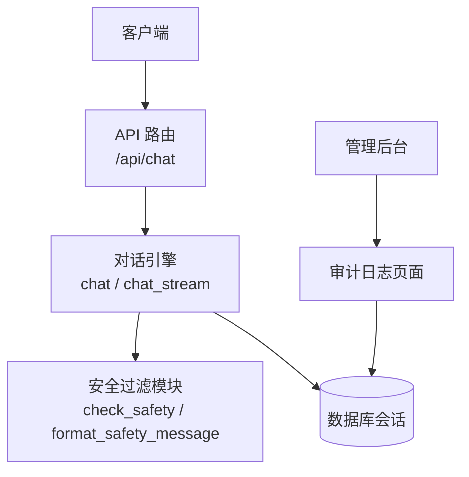
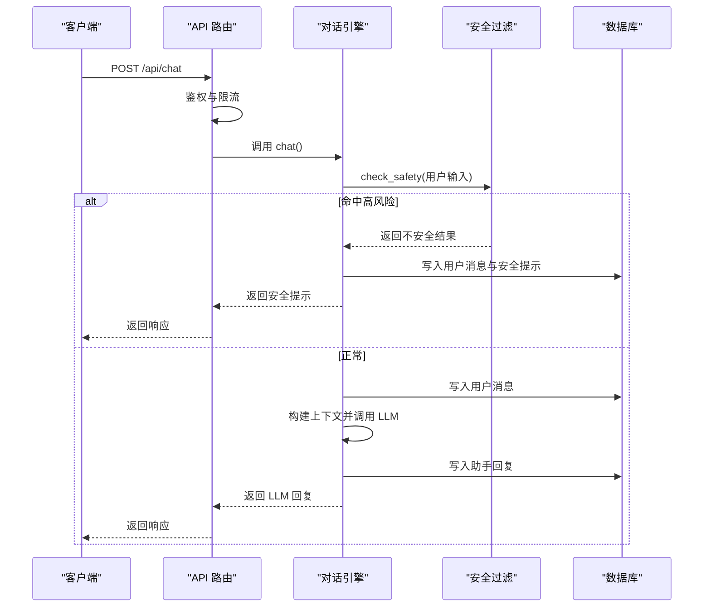
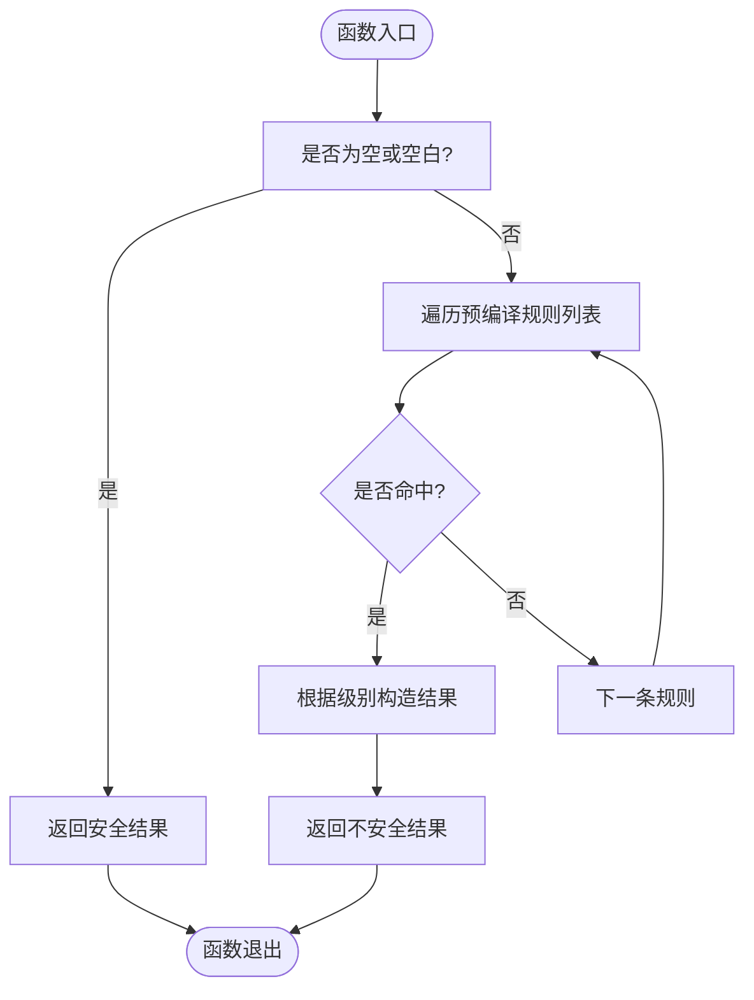
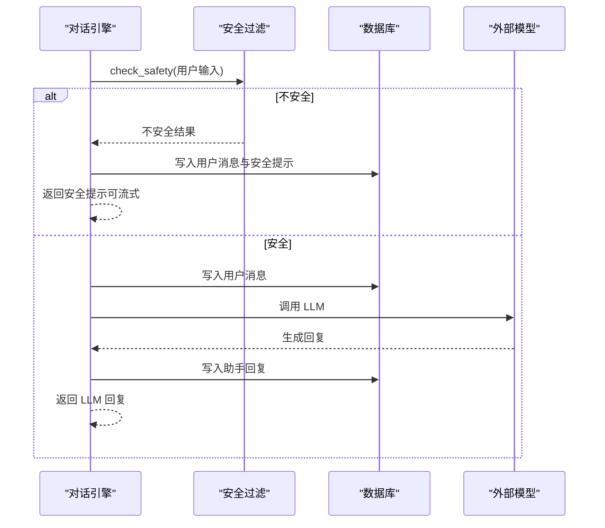
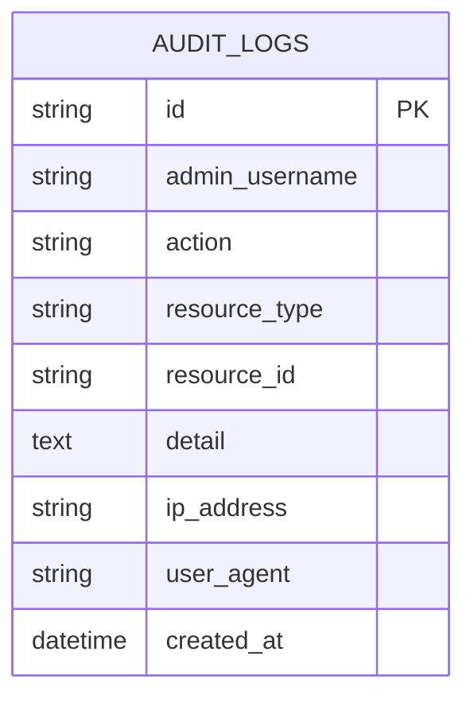
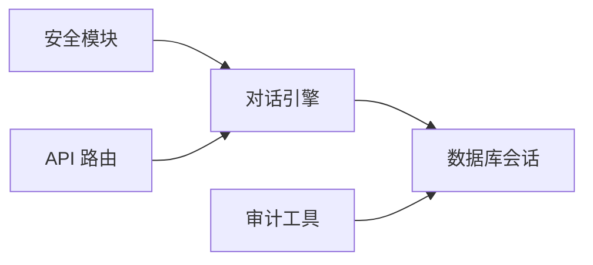

# 安全检查集成

<cite>
**本文引用的文件**   
- [hushai/meditation/core/safety.py](file://hushai/meditation/core/safety.py)
- [hushai/meditation/core/engine.py](file://hushai/meditation/core/engine.py)
- [hushai/meditation/api/chat.py](file://hushai/meditation/api/chat.py)
- [tests/meditation/test_safety.py](file://tests/meditation/test_safety.py)
- [tests/meditation/test_engine_safety.py](file://tests/meditation/test_engine_safety.py)
- [hushai/meditation/admin/audit.py](file://hushai/meditation/admin/audit.py)
- [hushai/meditation/db/models.py](file://hushai/meditation/db/models.py)
- [SECURITY.md](file://SECURITY.md)
</cite>

## 目录
1. [引言](#引言)
2. [项目结构](#项目结构)
3. [核心组件](#核心组件)
4. [架构总览](#架构总览)
5. [详细组件分析](#详细组件分析)
6. [依赖关系分析](#依赖关系分析)
7. [性能与实时性](#性能与实时性)
8. [误报与已知局限](#误报与已知局限)
9. [安全日志、审计与合规](#安全日志审计与合规)
10. [故障排查指南](#故障排查指南)
11. [结论](#结论)

## 引言
本文件面向“安全检查集成系统”，聚焦对话内容的安全过滤机制、敏感词检测与危机信号识别，阐述安全规则引擎、风险评估与响应策略，说明多层安全防护设计、实时检测性能与误报处理机制，并给出安全日志记录、审计追踪与合规要求。文档同时提供安全检查流程图、风险等级定义和处理策略示例，帮助读者快速理解与安全地扩展该系统。

## 项目结构
安全检查能力位于对话主引擎之前，作为“快速阻断层”对输入进行预检；命中高风险时直接返回提示，避免将用户输入送往外部大模型。管理后台提供审计日志页面，用于追溯管理员操作。



**图表来源** 
- [hushai/meditation/api/chat.py:58-104](file://hushai/meditation/api/chat.py#L58-L104)
- [hushai/meditation/core/engine.py:166-236](file://hushai/meditation/core/engine.py#L166-L236)
- [hushai/meditation/core/safety.py:83-111](file://hushai/meditation/core/safety.py#L83-L111)
- [hushai/meditation/admin/pages/audit.py:16-72](file://hushai/meditation/admin/pages/audit.py#L16-L72)

**章节来源**
- [hushai/meditation/api/chat.py:58-104](file://hushai/meditation/api/chat.py#L58-L104)
- [hushai/meditation/core/engine.py:166-236](file://hushai/meditation/core/engine.py#L166-L236)
- [hushai/meditation/core/safety.py:83-111](file://hushai/meditation/core/safety.py#L83-L111)
- [hushai/meditation/admin/pages/audit.py:16-72](file://hushai/meditation/admin/pages/audit.py#L16-L72)

## 核心组件
- 安全规则引擎：基于预编译正则的关键词匹配，按优先级判定风险级别（紧急/危机），并输出对应提示与建议。
- 对话引擎集成：在调用 LLM 前执行安全检查；命中则直接返回安全提示，不发送用户输入至外部模型。
- 流式响应适配：对安全提示采用字符级流式推送，保持用户体验一致。
- 审计与持久化：所有对话消息均落库，便于后续审计与回溯。

**章节来源**
- [hushai/meditation/core/safety.py:18-40](file://hushai/meditation/core/safety.py#L18-L40)
- [hushai/meditation/core/safety.py:83-111](file://hushai/meditation/core/safety.py#L83-L111)
- [hushai/meditation/core/engine.py:182-196](file://hushai/meditation/core/engine.py#L182-L196)
- [hushai/meditation/core/engine.py:255-274](file://hushai/meditation/core/engine.py#L255-L274)

## 架构总览
下图展示从请求进入、鉴权、安全检查到回复生成的完整流程，以及异常与回滚路径。



**图表来源** 
- [hushai/meditation/api/chat.py:58-77](file://hushai/meditation/api/chat.py#L58-L77)
- [hushai/meditation/core/engine.py:166-236](file://hushai/meditation/core/engine.py#L166-L236)
- [hushai/meditation/core/safety.py:83-111](file://hushai/meditation/core/safety.py#L83-L111)

## 详细组件分析

### 安全规则引擎（关键词正则）
- 规则组织：每条规则为“预编译正则 + 级别”的元组，级别与模式在编译期绑定，避免二次判级导致的脱钩问题。
- 优先级：更具体的“伤害他人”类规则置于自伤类之前，确保 emergency 优先于 crisis。
- 空输入短路：空或空白字符串直接判定为安全，避免误判。
- 结果封装：统一通过数据类返回 is_safe、level、message、suggestion。
- 文案组装：format_safety_message 在不安全时将“温馨提示”追加到原始回复之后；若原始回复为空，则仅返回提示。



**图表来源** 
- [hushai/meditation/core/safety.py:83-111](file://hushai/meditation/core/safety.py#L83-L111)

**章节来源**
- [hushai/meditation/core/safety.py:18-40](file://hushai/meditation/core/safety.py#L18-L40)
- [hushai/meditation/core/safety.py:83-111](file://hushai/meditation/core/safety.py#L83-L111)
- [tests/meditation/test_safety.py:20-82](file://tests/meditation/test_safety.py#L20-L82)

### 对话引擎中的安全检查集成
- 前置拦截：在 chat()/chat_stream() 中，检查必须在调用 LLM 之前完成；命中则直接返回安全提示，不调用外部模型。
- 持久化：即使命中高风险，也会保存用户消息与安全提示，以便审计与回溯。
- 流式适配：对安全提示采用逐字流式推送，保证前端体验一致。
- 单元测试保障：验证危机输入不会触发 LLM 调用，且仍会持久化消息。



**图表来源** 
- [hushai/meditation/core/engine.py:182-196](file://hushai/meditation/core/engine.py#L182-L196)
- [hushai/meditation/core/engine.py:255-274](file://hushai/meditation/core/engine.py#L255-L274)
- [tests/meditation/test_engine_safety.py:57-115](file://tests/meditation/test_engine_safety.py#L57-L115)

**章节来源**
- [hushai/meditation/core/engine.py:166-236](file://hushai/meditation/core/engine.py#L166-L236)
- [hushai/meditation/core/engine.py:238-314](file://hushai/meditation/core/engine.py#L238-L314)
- [tests/meditation/test_engine_safety.py:57-115](file://tests/meditation/test_engine_safety.py#L57-L115)

### API 路由与鉴权、限流
- 鉴权：通过 Header 提取 Bearer Token 并校验用户身份。
- 限流：对聊天接口实施每分钟请求数限制，降低滥用风险。
- 错误处理：捕获运行时异常并返回标准错误响应。

```mermaid
classDiagram
class ChatRouter {
+POST "/"
+POST "/stream"
+GET "/conversations"
+GET "/conversations/{id}/messages"
}
class Auth {
+extract_bearer_token()
+get_current_user_id()
}
class Limiter {
+limit("30/minute")
}
ChatRouter --> Auth : "依赖"
ChatRouter --> Limiter : "装饰器限流"
```

**图表来源** 
- [hushai/meditation/api/chat.py:43-56](file://hushai/meditation/api/chat.py#L43-L56)
- [hushai/meditation/api/chat.py:58-104](file://hushai/meditation/api/chat.py#L58-L104)

**章节来源**
- [hushai/meditation/api/chat.py:58-104](file://hushai/meditation/api/chat.py#L58-L104)

### 审计与持久化
- 审计日志：管理后台提供审计日志页面，支持分页与筛选。
- 审计工具：提供异步写入审计记录的通用方法。
- 数据模型：包含管理员用户名、动作、资源类型、资源 ID、详情、IP、UA 等字段，便于溯源。



**图表来源** 
- [hushai/meditation/db/models.py:188-202](file://hushai/meditation/db/models.py#L188-L202)
- [hushai/meditation/admin/audit.py:10-31](file://hushai/meditation/admin/audit.py#L10-L31)
- [hushai/meditation/admin/pages/audit.py:16-72](file://hushai/meditation/admin/pages/audit.py#L16-L72)

**章节来源**
- [hushai/meditation/admin/audit.py:10-31](file://hushai/meditation/admin/audit.py#L10-L31)
- [hushai/meditation/db/models.py:188-202](file://hushai/meditation/db/models.py#L188-L202)
- [hushai/meditation/admin/pages/audit.py:16-72](file://hushai/meditation/admin/pages/audit.py#L16-L72)

## 依赖关系分析
- 安全模块无外部依赖，仅使用标准库 re 与 dataclasses，具备高内聚低耦合特性。
- 对话引擎依赖安全模块、数据库会话、LLM 调用与上下文构建。
- API 路由依赖鉴权、限流与引擎。
- 审计功能依赖数据库模型与异步会话。



**图表来源** 
- [hushai/meditation/core/safety.py:1-17](file://hushai/meditation/core/safety.py#L1-L17)
- [hushai/meditation/core/engine.py:1-31](file://hushai/meditation/core/engine.py#L1-L31)
- [hushai/meditation/api/chat.py:1-27](file://hushai/meditation/api/chat.py#L1-L27)
- [hushai/meditation/admin/audit.py:1-8](file://hushai/meditation/admin/audit.py#L1-L8)

**章节来源**
- [hushai/meditation/core/safety.py:1-17](file://hushai/meditation/core/safety.py#L1-L17)
- [hushai/meditation/core/engine.py:1-31](file://hushai/meditation/core/engine.py#L1-L31)
- [hushai/meditation/api/chat.py:1-27](file://hushai/meditation/api/chat.py#L1-L27)
- [hushai/meditation/admin/audit.py:1-8](file://hushai/meditation/admin/audit.py#L1-L8)

## 性能与实时性
- 正则预编译：规则在模块导入时一次性编译，避免每次调用重复编译带来的开销。
- 短路判断：空输入直接返回安全结果，减少不必要的匹配。
- 流式输出：对安全提示采用逐字推送，提升交互流畅度。
- 测试覆盖：单元测试验证了“危机输入跳过 LLM”的关键路径，确保性能与正确性。

**章节来源**
- [hushai/meditation/core/safety.py:18-40](file://hushai/meditation/core/safety.py#L18-L40)
- [hushai/meditation/core/safety.py:83-111](file://hushai/meditation/core/safety.py#L83-L111)
- [hushai/meditation/core/engine.py:255-274](file://hushai/meditation/core/engine.py#L255-L274)
- [tests/meditation/test_engine_safety.py:57-115](file://tests/meditation/test_engine_safety.py#L57-L115)

## 误报与已知局限
- 当前方案为“快速阻断层”，以关键词正则为主，并非完整的危机识别系统。
- 已知绕过方式：插入空格、拼音、同音字等可能规避匹配。
- 建议：未来可引入 LLM 二次分类或更鲁棒的语义模型以降低误报与漏报。

**章节来源**
- [tests/meditation/test_safety.py:104-118](file://tests/meditation/test_safety.py#L104-L118)
- [hushai/meditation/core/safety.py:1-10](file://hushai/meditation/core/safety.py#L1-L10)

## 安全日志、审计与合规
- 日志与审计：
  - 对话消息持久化，包括用户输入与安全提示，便于回溯。
  - 管理后台提供审计日志页面，支持分页与筛选。
- 合规与隐私：
  - 遵循仓库安全策略，漏洞报告走私有渠道。
  - 注意提示与回复可能发送至配置的 LLM 提供商，需遵守其条款与隐私政策。
  - 密钥不得提交至代码库或泄露到日志中。

**章节来源**
- [hushai/meditation/core/engine.py:182-196](file://hushai/meditation/core/engine.py#L182-L196)
- [hushai/meditation/admin/pages/audit.py:16-72](file://hushai/meditation/admin/pages/audit.py#L16-L72)
- [SECURITY.md:1-28](file://SECURITY.md#L1-L28)

## 故障排查指南
- 现象：危机输入仍被发送到 LLM
  - 排查：确认 engine.chat/chat_stream 是否在调用 LLM 前执行安全检查。
  - 参考：[hushai/meditation/core/engine.py:182-196](file://hushai/meditation/core/engine.py#L182-L196)、[hushai/meditation/core/engine.py:255-274](file://hushai/meditation/core/engine.py#L255-L274)
- 现象：安全提示未显示热线信息
  - 排查：确认 format_safety_message 是否正确拼接 message 与 suggestion。
  - 参考：[hushai/meditation/core/safety.py:105-111](file://hushai/meditation/core/safety.py#L105-L111)
- 现象：审计日志缺失
  - 排查：确认审计工具调用与数据库写入是否成功，页面查询条件是否正确。
  - 参考：[hushai/meditation/admin/audit.py:10-31](file://hushai/meditation/admin/audit.py#L10-L31)、[hushai/meditation/admin/pages/audit.py:16-72](file://hushai/meditation/admin/pages/audit.py#L16-L72)

**章节来源**
- [hushai/meditation/core/engine.py:182-196](file://hushai/meditation/core/engine.py#L182-L196)
- [hushai/meditation/core/safety.py:105-111](file://hushai/meditation/core/safety.py#L105-L111)
- [hushai/meditation/admin/audit.py:10-31](file://hushai/meditation/admin/audit.py#L10-L31)
- [hushai/meditation/admin/pages/audit.py:16-72](file://hushai/meditation/admin/pages/audit.py#L16-L72)

## 结论
本安全检查集成以“快速阻断层”为核心，在对话引擎调用 LLM 之前进行前置安全检测，结合预编译正则与优先级规则，实现高效的危机信号识别与分级响应。通过持久化与审计能力，满足可追溯与合规需求。针对已知局限，建议在未来引入语义级模型以提升鲁棒性，并持续完善规则集与测试用例。