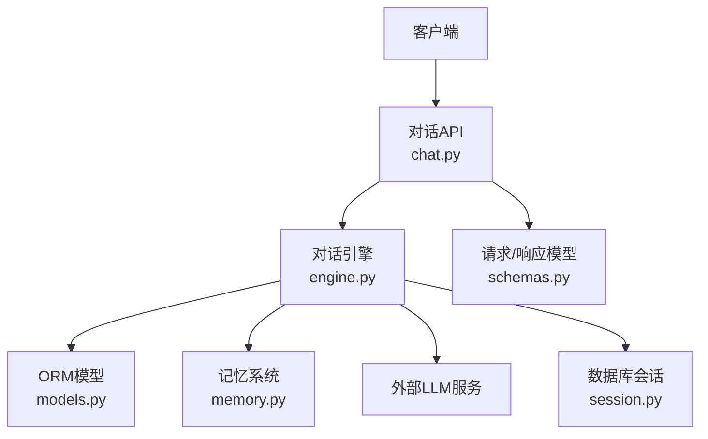
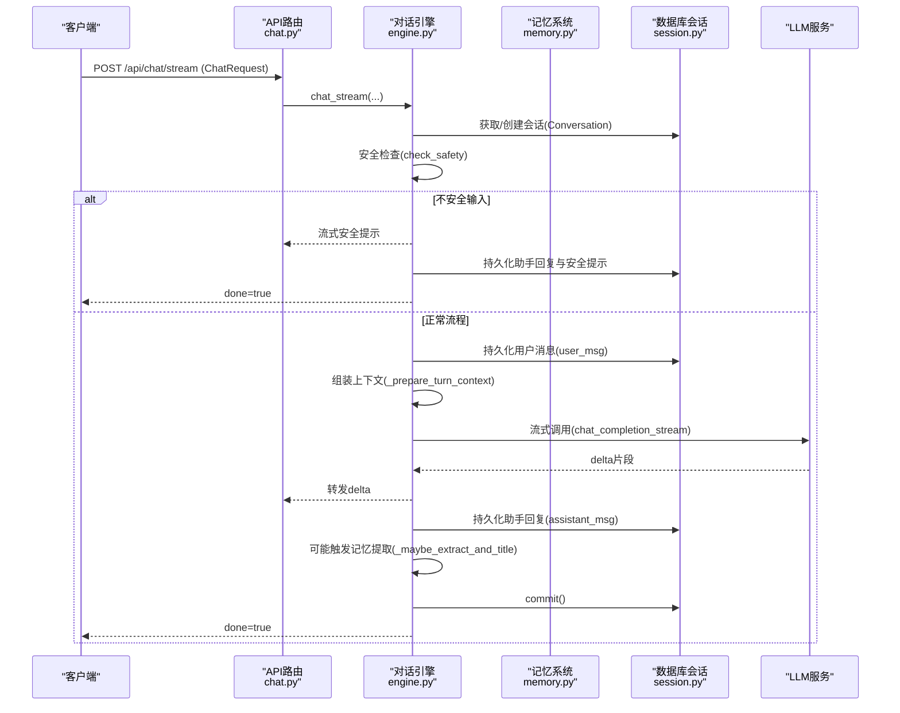
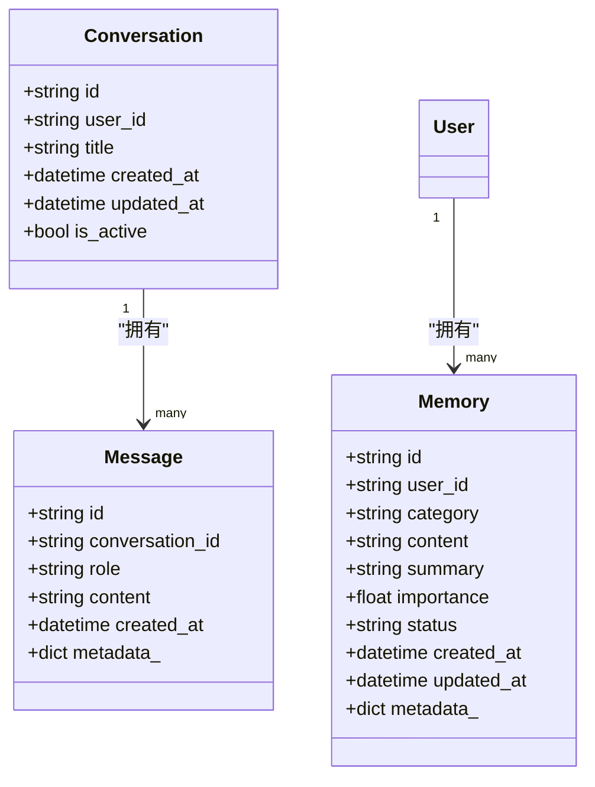
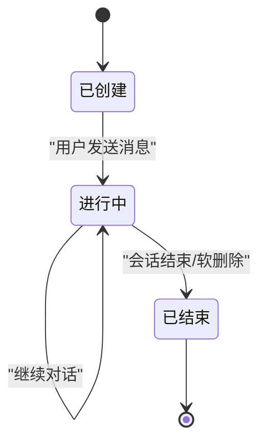

# 对话生命周期管理

<cite>
**本文引用的文件**   
- [hushai/meditation/api/chat.py](file://hushai/meditation/api/chat.py)
- [hushai/meditation/core/engine.py](file://hushai/meditation/core/engine.py)
- [hushai/meditation/db/models.py](file://hushai/meditation/db/models.py)
- [hushai/meditation/db/session.py](file://hushai/meditation/db/session.py)
- [hushai/meditation/core/memory.py](file://hushai/meditation/core/memory.py)
- [hushai/meditation/schemas.py](file://hushai/meditation/schemas.py)
- [hushai/meditation/api/meditation.py](file://hushai/meditation/api/meditation.py)
</cite>

## 目录
1. [简介](#简介)
2. [项目结构](#项目结构)
3. [核心组件](#核心组件)
4. [架构总览](#架构总览)
5. [详细组件分析](#详细组件分析)
6. [依赖关系分析](#依赖关系分析)
7. [性能与并发](#性能与并发)
8. [故障排查指南](#故障排查指南)
9. [结论](#结论)
10. [附录：状态转换图与典型场景](#附录：状态转换图与典型场景)

## 简介
本文件围绕“对话生命周期管理”展开，系统性阐述会话的创建、初始化、上下文维护与销毁机制；详细说明会话ID生成策略、持久化与恢复逻辑；解释会话上下文的数据结构设计（消息历史、元数据）及优化策略；并给出并发控制、内存管理与数据库交互的最佳实践。文档同时提供状态转换图和典型使用场景的代码路径指引，帮助读者快速定位实现细节。

## 项目结构
与对话生命周期相关的代码主要分布在以下模块：
- API 层：定义 REST 接口，负责鉴权、参数校验、调用引擎、返回结果或流式响应
- 引擎层：编排一次对话轮次，包括会话获取/创建、上下文组装、安全检测、LLM 调用、消息持久化、记忆提取与标题补全
- 数据模型层：定义 Conversation、Message、Memory 等 ORM 实体及其关系
- 数据库会话层：异步 SQLAlchemy 引擎与会话工厂、连接池配置
- 记忆子系统：周期性从对话中提取长期记忆，构建检索索引，并在提示中注入相关记忆片段
- 冥想会话记录：独立于对话的“冥想会话”统计记录（开始/结束/时长/情绪），用于用户行为统计

图表来源
- [hushai/meditation/api/chat.py:1-245](file://hushai/meditation/api/chat.py#L1-L245)
- [hushai/meditation/core/engine.py:1-387](file://hushai/meditation/core/engine.py#L1-L387)
- [hushai/meditation/db/models.py:1-434](file://hushai/meditation/db/models.py#L1-L434)
- [hushai/meditation/db/session.py:1-83](file://hushai/meditation/db/session.py#L1-L83)
- [hushai/meditation/core/memory.py:1-206](file://hushai/meditation/core/memory.py#L1-L206)
- [hushai/meditation/schemas.py:1-541](file://hushai/meditation/schemas.py#L1-L541)

章节来源
- [hushai/meditation/api/chat.py:1-245](file://hushai/meditation/api/chat.py#L1-L245)
- [hushai/meditation/core/engine.py:1-387](file://hushai/meditation/core/engine.py#L1-L387)
- [hushai/meditation/db/models.py:1-434](file://hushai/meditation/db/models.py#L1-L434)
- [hushai/meditation/db/session.py:1-83](file://hushai/meditation/db/session.py#L1-L83)
- [hushai/meditation/core/memory.py:1-206](file://hushai/meditation/core/memory.py#L1-L206)
- [hushai/meditation/schemas.py:1-541](file://hushai/meditation/schemas.py#L1-L541)

## 核心组件
- 对话API路由：提供非流式与流式对话接口、知识问答接口、对话列表与消息历史查询
- 对话引擎：封装一次对话的核心流程，包含会话获取/创建、上下文准备、安全检查、LLM 调用、消息持久化、记忆提取与标题补全
- 数据模型：Conversation（对话）、Message（消息）、Memory（长期记忆）等
- 数据库会话：异步引擎与会话工厂，支持 SQLite/PostgreSQL
- 记忆系统：按周期触发记忆提取，写入向量索引，并在提示中注入相关记忆摘要

章节来源
- [hushai/meditation/api/chat.py:1-245](file://hushai/meditation/api/chat.py#L1-L245)
- [hushai/meditation/core/engine.py:1-387](file://hushai/meditation/core/engine.py#L1-L387)
- [hushai/meditation/db/models.py:1-434](file://hushai/meditation/db/models.py#L1-L434)
- [hushai/meditation/db/session.py:1-83](file://hushai/meditation/db/session.py#L1-L83)
- [hushai/meditation/core/memory.py:1-206](file://hushai/meditation/core/memory.py#L1-L206)

## 架构总览
下图展示了从客户端发起一次对话到最终落库的完整链路，以及流式响应的关键分支。

图表来源
- [hushai/meditation/api/chat.py:80-104](file://hushai/meditation/api/chat.py#L80-L104)
- [hushai/meditation/core/engine.py:238-314](file://hushai/meditation/core/engine.py#L238-L314)
- [hushai/meditation/core/memory.py:1-206](file://hushai/meditation/core/memory.py#L1-L206)
- [hushai/meditation/db/session.py:50-61](file://hushai/meditation/db/session.py#L50-L61)

## 详细组件分析

### 会话创建与初始化
- 会话ID生成策略
  - 对话与会话对象的主键采用 UUID v4 字符串，保证全局唯一性与不可预测性
  - 在引擎侧通过 ORM 默认值生成，避免业务层重复造轮子
- 会话获取/创建
  - 若请求携带 conversation_id，则按 user_id 与 is_active 条件查找已有会话
  - 未找到或未提供时，新建 Conversation 并 flush，确保后续消息可关联
- 初始化时机
  - 每次对话轮次开始时执行，确保上下文加载与权限校验前置

章节来源
- [hushai/meditation/db/models.py:69-83](file://hushai/meditation/db/models.py#L69-L83)
- [hushai/meditation/core/engine.py:38-56](file://hushai/meditation/core/engine.py#L38-L56)

### 会话上下文数据结构与历史管理
- 上下文组成
  - system 提示：由记忆上下文、知识库上下文、技能上下文、场景上下文、导师描述等组合而成
  - 历史消息：按时间顺序加载，限制最大轮数以控制上下文长度
- 历史加载策略
  - 根据配置的最大轮数计算 limit，仅加载最近 N 条消息，降低上下文开销
- 元数据维护
  - Message 与 Memory 均支持 JSON 字段 metadata_，可用于扩展字段（如来源、标签、评分等）

章节来源
- [hushai/meditation/core/engine.py:91-127](file://hushai/meditation/core/engine.py#L91-L127)
- [hushai/meditation/core/engine.py:59-76](file://hushai/meditation/core/engine.py#L59-L76)
- [hushai/meditation/db/models.py:85-96](file://hushai/meditation/db/models.py#L85-L96)
- [hushai/meditation/db/models.py:98-118](file://hushai/meditation/db/models.py#L98-L118)

### 会话持久化与事务边界
- 非流式对话
  - 用户消息写入后 flush，LLM 调用成功后写入助手消息，再 flush，最后 commit
  - 异常时 rollback，防止出现“断头”消息
- 流式对话
  - 用户消息先写入并 flush，随后边接收 LLM 增量边向前端推送
  - 全部完成后写入助手消息并 flush，commit；finally 块确保未提交时回滚
- 安全输入处理
  - 检测到不安全输入时，不发送外部 LLM，直接生成安全提示并持久化，仍保持事务一致性

章节来源
- [hushai/meditation/core/engine.py:166-235](file://hushai/meditation/core/engine.py#L166-L235)
- [hushai/meditation/core/engine.py:238-314](file://hushai/meditation/core/engine.py#L238-L314)

### 会话恢复机制
- 前端恢复
  - 前端将当前 conversation_id 存入本地存储，刷新页面后自动恢复
- 后端恢复
  - 通过 GET /api/chat/conversations/{conversation_id}/messages 拉取历史消息，渲染对话界面
- 会话列表
  - 分页查询当前用户的活跃对话，按更新时间倒序展示

章节来源
- [hushai/meditation/api/chat.py:155-190](file://hushai/meditation/api/chat.py#L155-L190)
- [hushai/meditation/api/chat.py:205-244](file://hushai/meditation/api/chat.py#L205-L244)

### 会话销毁与软删除
- 软删除策略
  - Conversation 存在 is_active 标志位，查询时过滤活跃会话，便于软删除与恢复
- 实际销毁
  - 当前未见显式的“物理删除”接口，建议通过更新 is_active 为 False 实现软删除

章节来源
- [hushai/meditation/db/models.py:69-83](file://hushai/meditation/db/models.py#L69-L83)
- [hushai/meditation/api/chat.py:167-175](file://hushai/meditation/api/chat.py#L167-L175)

### 会话ID生成策略
- 主键生成
  - 所有实体主键均为 UUID v4 字符串，默认值由 _uuid 函数生成
- 适用性
  - 分布式友好，无需集中式 ID 分配器；具备不可预测性，适合对外暴露的 ID

章节来源
- [hushai/meditation/db/models.py:33-35](file://hushai/meditation/db/models.py#L33-L35)
- [hushai/meditation/db/models.py:69-83](file://hushai/meditation/db/models.py#L69-L83)

### 会话上下文中的记忆与知识增强
- 记忆提取
  - 每 N 条用户消息触发一次记忆提取，调用 LLM 解析结构化记忆条目
  - 记忆写入数据库并生成向量嵌入，供语义检索
- 记忆注入
  - 构造 prompt 前检索相关记忆，以摘要形式注入 system 提示，提升个性化与连贯性
- 知识问答
  - 针对知识库进行相似度检索，结合记忆上下文生成回答，并返回引用来源

章节来源
- [hushai/meditation/core/engine.py:130-153](file://hushai/meditation/core/engine.py#L130-L153)
- [hushai/meditation/core/memory.py:45-76](file://hushai/meditation/core/memory.py#L45-L76)
- [hushai/meditation/core/memory.py:79-112](file://hushai/meditation/core/memory.py#L79-L112)
- [hushai/meditation/core/memory.py:161-173](file://hushai/meditation/core/memory.py#L161-L173)
- [hushai/meditation/core/engine.py:316-386](file://hushai/meditation/core/engine.py#L316-L386)

### 冥想会话记录（独立于对话）
- 功能说明
  - 记录用户单次冥想练习的开始/结束时间、时长、前后情绪与备注，用于进度统计
- 会话ID
  - 使用 uuid.uuid4() 生成 session_id，并在进程内字典维护活跃会话映射
- 生命周期
  - start 接口创建记录并加入活跃映射；end 接口计算时长并清理活跃映射

章节来源
- [hushai/meditation/api/meditation.py:112-147](file://hushai/meditation/api/meditation.py#L112-L147)
- [hushai/meditation/db/models.py:204-222](file://hushai/meditation/db/models.py#L204-L222)

## 依赖关系分析
- API 层依赖
  - 认证依赖：从 Authorization Header 提取 Bearer Token 并解析用户ID
  - 限流装饰器：对聊天接口进行每分钟请求次数限制
  - 引擎调用：统一走 engine.chat 与 engine.chat_stream
- 引擎层依赖
  - 数据库会话：通过 get_session_factory 获取 AsyncSession
  - 记忆系统：按周期触发记忆提取与注入
  - 外部 LLM：通过 chat_completion 与 chat_completion_stream 调用
- 数据模型依赖
  - Conversation 与 Message 一对多关系
  - Memory 与 User 一对多关系，且支持 source_conversation_id 溯源

图表来源
- [hushai/meditation/db/models.py:69-118](file://hushai/meditation/db/models.py#L69-L118)

章节来源
- [hushai/meditation/api/chat.py:1-245](file://hushai/meditation/api/chat.py#L1-L245)
- [hushai/meditation/core/engine.py:1-387](file://hushai/meditation/core/engine.py#L1-L387)
- [hushai/meditation/db/models.py:1-434](file://hushai/meditation/db/models.py#L1-L434)

## 性能与并发
- 数据库连接池
  - SQLite 使用较小连接池，PostgreSQL 使用较大连接池，减少连接竞争
- 会话过期设置
  - expire_on_commit=False，避免提交后延迟访问导致额外查询
- 上下文裁剪
  - 通过 conversation_max_turns 限制历史消息数量，降低 LLM 输入成本
- 流式输出
  - 边接收边推送，降低首字延迟，提升用户体验
- 记忆提取频率
  - 每 N 条用户消息触发一次，平衡个性化与资源消耗
- 并发安全
  - 引擎层每个请求使用独立的 AsyncSession，避免共享状态
  - 冥想会话活跃映射为进程内 dict，单进程部署下可用；多进程需考虑外部缓存

章节来源
- [hushai/meditation/db/session.py:34-54](file://hushai/meditation/db/session.py#L34-L54)
- [hushai/meditation/core/engine.py:59-76](file://hushai/meditation/core/engine.py#L59-L76)
- [hushai/meditation/core/engine.py:34-36](file://hushai/meditation/core/engine.py#L34-L36)
- [hushai/meditation/api/meditation.py:109-147](file://hushai/meditation/api/meditation.py#L109-L147)

## 故障排查指南
- 常见错误
  - 401 未授权：检查 Authorization Header 是否正确传递 Bearer Token
  - 404 对话不存在：确认 conversation_id 有效且属于当前用户，未被软删除
  - 500 服务器错误：查看日志，关注 LLM 调用失败、JSON 解析异常、向量写入失败等
- 事务回滚
  - 非流式与流式均在异常时执行 rollback，避免产生不完整记录
- 记忆提取失败
  - 捕获异常并记录警告，不影响主流程；检查 LLM 返回格式是否符合预期
- 向量写入失败
  - 记录警告但不中断主流程；检查向量服务连通性与权限

章节来源
- [hushai/meditation/api/chat.py:58-77](file://hushai/meditation/api/chat.py#L58-L77)
- [hushai/meditation/api/chat.py:80-104](file://hushai/meditation/api/chat.py#L80-L104)
- [hushai/meditation/core/engine.py:233-235](file://hushai/meditation/core/engine.py#L233-L235)
- [hushai/meditation/core/engine.py:311-314](file://hushai/meditation/core/engine.py#L311-L314)
- [hushai/meditation/core/memory.py:74-76](file://hushai/meditation/core/memory.py#L74-L76)
- [hushai/meditation/core/memory.py:109-111](file://hushai/meditation/core/memory.py#L109-L111)

## 结论
该系统的对话生命周期管理以“轻量、可靠、可扩展”为核心设计目标：
- 会话ID采用 UUID v4，天然分布式友好
- 会话创建/初始化在每轮对话开始时执行，确保上下文与权限前置
- 持久化采用明确的事务边界，异常时回滚，保障数据一致性
- 会话恢复通过前端本地存储与后端查询接口协同完成
- 记忆系统按周期触发，兼顾个性化与性能
- 并发控制基于异步会话与连接池，满足高吞吐需求

## 附录：状态转换图与典型场景

### 会话状态转换图（概念）

[此图为概念示意，不直接映射具体源码文件]

### 典型使用场景与代码路径
- 创建新对话并发送第一条消息
  - 参考：[hushai/meditation/api/chat.py:58-77](file://hushai/meditation/api/chat.py#L58-L77)、[hushai/meditation/core/engine.py:166-235](file://hushai/meditation/core/engine.py#L166-L235)
- 流式对话
  - 参考：[hushai/meditation/api/chat.py:80-104](file://hushai/meditation/api/chat.py#L80-L104)、[hushai/meditation/core/engine.py:238-314](file://hushai/meditation/core/engine.py#L238-L314)
- 恢复历史对话
  - 参考：[hushai/meditation/api/chat.py:205-244](file://hushai/meditation/api/chat.py#L205-L244)
- 列出用户对话
  - 参考：[hushai/meditation/api/chat.py:155-190](file://hushai/meditation/api/chat.py#L155-L190)
- 知识问答
  - 参考：[hushai/meditation/api/chat.py:107-127](file://hushai/meditation/api/chat.py#L107-L127)、[hushai/meditation/core/engine.py:316-386](file://hushai/meditation/core/engine.py#L316-L386)
- 冥想会话开始/结束
  - 参考：[hushai/meditation/api/meditation.py:112-147](file://hushai/meditation/api/meditation.py#L112-L147)