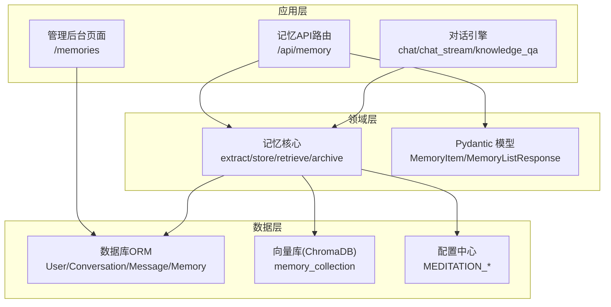
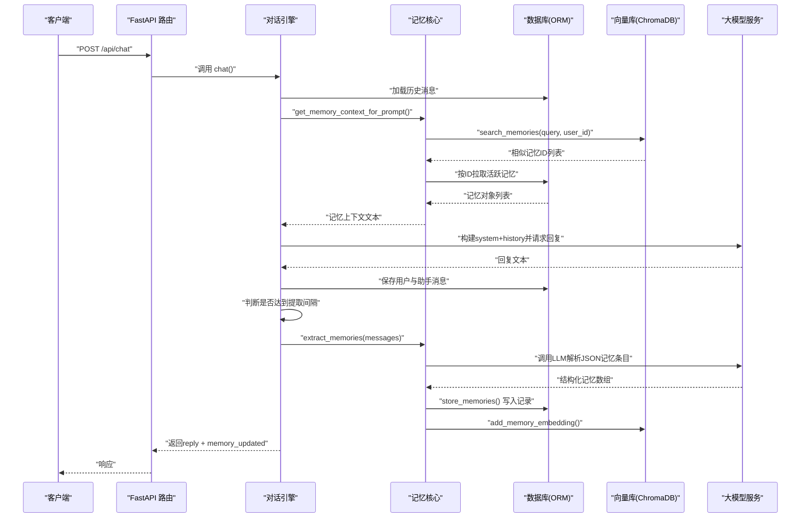
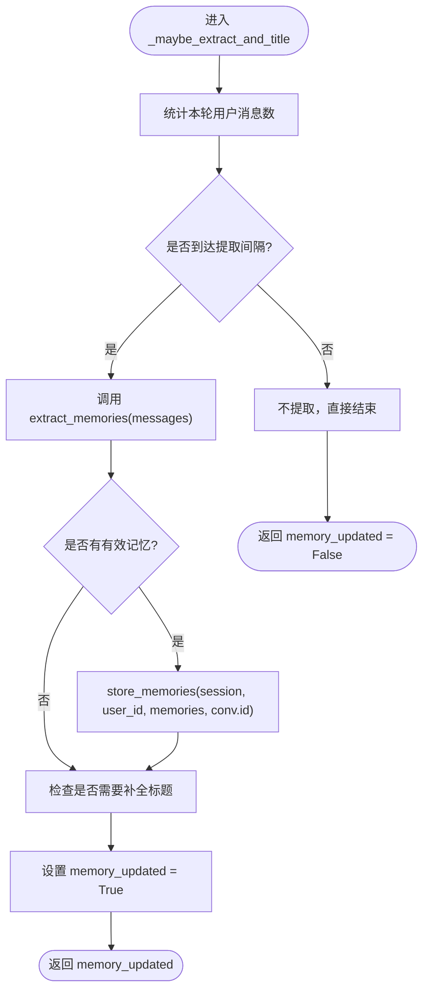
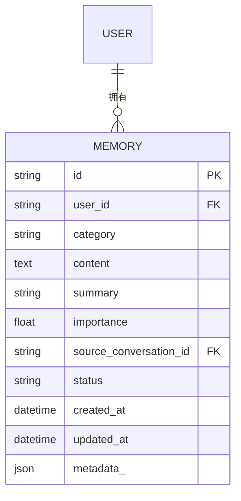
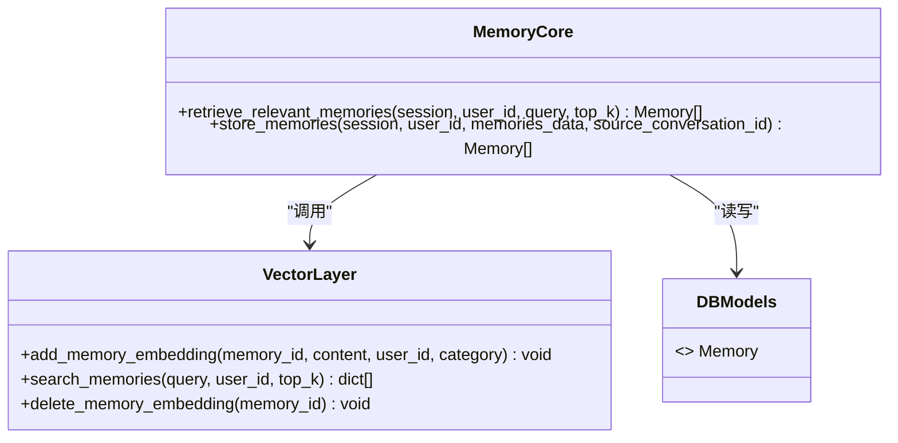
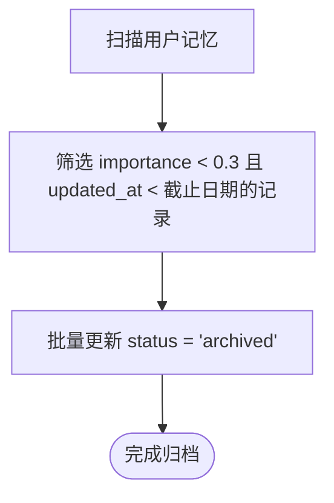
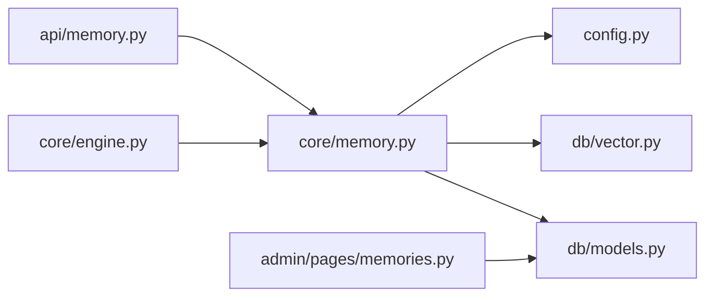

# 记忆提取与存储

<cite>
**本文引用的文件**   
- [hushai/meditation/core/memory.py](file://hushai/meditation/core/memory.py)
- [hushai/meditation/db/models.py](file://hushai/meditation/db/models.py)
- [hushai/meditation/db/vector.py](file://hushai/meditation/db/vector.py)
- [hushai/meditation/api/memory.py](file://hushai/meditation/api/memory.py)
- [hushai/meditation/core/engine.py](file://hushai/meditation/core/engine.py)
- [hushai/meditation/config.py](file://hushai/meditation/config.py)
- [hushai/meditation/schemas.py](file://hushai/meditation/schemas.py)
- [hushai/meditation/admin/pages/memories.py](file://hushai/meditation/admin/pages/memories.py)
</cite>

## 目录
1. [简介](#简介)
2. [项目结构](#项目结构)
3. [核心组件](#核心组件)
4. [架构总览](#架构总览)
5. [详细组件分析](#详细组件分析)
6. [依赖关系分析](#依赖关系分析)
7. [性能考量](#性能考量)
8. [故障排查指南](#故障排查指南)
9. [结论](#结论)
10. [附录](#附录)

## 简介
本文件面向“记忆提取与存储系统”，系统性阐述用户记忆的自动提取算法、触发时机控制、存储策略、数据结构设计、向量化处理与语义检索机制，以及更新策略、去重与版本管理（现状说明）、质量评估、重要性排序与清理策略。文档同时提供关键流程图、存储结构图与API使用示例，帮助读者快速理解并正确使用该子系统。

## 项目结构
围绕记忆功能的相关代码主要分布在以下模块：
- 核心逻辑：记忆提取、持久化、检索、归档等
- 数据模型：SQLAlchemy ORM 定义
- 向量检索：ChromaDB 集合与嵌入函数配置
- API 层：对外暴露的记忆查询接口
- 引擎编排：对话流程中集成记忆上下文与提取触发
- 配置：记忆相关参数（Top-K、模型、嵌入提供者等）
- 管理后台：记忆列表与删除能力

图表来源
- [hushai/meditation/api/memory.py:1-61](file://hushai/meditation/api/memory.py#L1-L61)
- [hushai/meditation/core/memory.py:1-206](file://hushai/meditation/core/memory.py#L1-L206)
- [hushai/meditation/db/models.py:98-118](file://hushai/meditation/db/models.py#L98-L118)
- [hushai/meditation/db/vector.py:71-179](file://hushai/meditation/db/vector.py#L71-L179)
- [hushai/meditation/core/engine.py:130-154](file://hushai/meditation/core/engine.py#L130-L154)
- [hushai/meditation/config.py:40-47](file://hushai/meditation/config.py#L40-L47)
- [hushai/meditation/schemas.py:95-108](file://hushai/meditation/schemas.py#L95-L108)
- [hushai/meditation/admin/pages/memories.py:22-83](file://hushai/meditation/admin/pages/memories.py#L22-L83)

章节来源
- [hushai/meditation/api/memory.py:1-61](file://hushai/meditation/api/memory.py#L1-L61)
- [hushai/meditation/core/memory.py:1-206](file://hushai/meditation/core/memory.py#L1-L206)
- [hushai/meditation/db/models.py:98-118](file://hushai/meditation/db/models.py#L98-L118)
- [hushai/meditation/db/vector.py:71-179](file://hushai/meditation/db/vector.py#L71-L179)
- [hushai/meditation/core/engine.py:130-154](file://hushai/meditation/core/engine.py#L130-L154)
- [hushai/meditation/config.py:40-47](file://hushai/meditation/config.py#L40-L47)
- [hushai/meditation/schemas.py:95-108](file://hushai/meditation/schemas.py#L95-L108)
- [hushai/meditation/admin/pages/memories.py:22-83](file://hushai/meditation/admin/pages/memories.py#L22-L83)

## 核心组件
- 记忆核心（core/memory.py）
  - 自动提取：基于LLM的提示词从对话消息中提取结构化记忆条目（类别、内容、摘要、重要度）。
  - 存储写入：将每条记忆写入数据库，并异步写入向量库（失败可降级记录日志）。
  - 语义检索：按当前消息进行向量相似度检索，返回活跃状态的记忆并按相似度顺序映射回ORM对象。
  - 上下文组装：为提示词生成记忆片段摘要，便于模型在回复时利用历史记忆。
  - 归档清理：对低重要度且长时间未更新的记忆执行归档标记。
- 数据模型（db/models.py）
  - Memory 表包含用户ID、分类、内容、摘要、重要度、来源会话、状态、时间戳等字段，并提供复合索引以优化查询。
- 向量库（db/vector.py）
  - 基于 ChromaDB 的 memory 集合，支持 upsert、按 user_id 过滤的相似度检索、删除。
  - 嵌入函数支持 OpenAI 或默认本地实现，可通过配置切换。
- API 层（api/memory.py）
  - GET /api/memory：分页列出当前用户的记忆，支持按分类过滤，返回 Pydantic 响应模型。
- 引擎编排（core/engine.py）
  - 在对话流程中周期性触发记忆提取，并在首轮补全会话标题；同时将记忆上下文注入系统提示。
- 配置（config.py）
  - 提供 memory_top_k、embedding_provider/model/key/base_url、memory_extraction_model 等开关与阈值。
- 管理后台（admin/pages/memories.py）
  - 提供记忆列表页与批量删除接口，用于运营维护。

章节来源
- [hushai/meditation/core/memory.py:45-112](file://hushai/meditation/core/memory.py#L45-L112)
- [hushai/meditation/core/memory.py:115-173](file://hushai/meditation/core/memory.py#L115-L173)
- [hushai/meditation/core/memory.py:189-206](file://hushai/meditation/core/memory.py#L189-L206)
- [hushai/meditation/db/models.py:98-118](file://hushai/meditation/db/models.py#L98-L118)
- [hushai/meditation/db/vector.py:130-179](file://hushai/meditation/db/vector.py#L130-L179)
- [hushai/meditation/api/memory.py:27-61](file://hushai/meditation/api/memory.py#L27-L61)
- [hushai/meditation/core/engine.py:130-154](file://hushai/meditation/core/engine.py#L130-L154)
- [hushai/meditation/config.py:40-47](file://hushai/meditation/config.py#L40-L47)
- [hushai/meditation/admin/pages/memories.py:22-83](file://hushai/meditation/admin/pages/memories.py#L22-L83)

## 架构总览
下图展示了从对话到记忆提取、存储与检索的整体链路。

图表来源
- [hushai/meditation/core/engine.py:166-236](file://hushai/meditation/core/engine.py#L166-L236)
- [hushai/meditation/core/memory.py:161-173](file://hushai/meditation/core/memory.py#L161-L173)
- [hushai/meditation/core/memory.py:115-138](file://hushai/meditation/core/memory.py#L115-L138)
- [hushai/meditation/core/memory.py:45-76](file://hushai/meditation/core/memory.py#L45-L76)
- [hushai/meditation/core/memory.py:79-112](file://hushai/meditation/core/memory.py#L79-L112)
- [hushai/meditation/db/vector.py:144-173](file://hushai/meditation/db/vector.py#L144-L173)

## 详细组件分析

### 自动提取算法与触发时机
- 提取算法
  - 输入：一轮对话中的多条消息（角色与内容）。
  - 处理：构造系统提示，要求LLM输出结构化JSON数组，包含类别、原始内容、摘要与重要度。
  - 容错：对非列表或非字典项进行过滤；异常时记录警告并返回空结果。
- 触发时机
  - 引擎侧维护一个固定间隔常量（每N条用户消息），当用户消息数达到倍数时触发一次提取。
  - 若会话无标题，则在首次用户消息后补全标题。
- 输出
  - 成功时返回若干记忆条目，供后续持久化与向量化。

图表来源
- [hushai/meditation/core/engine.py:130-154](file://hushai/meditation/core/engine.py#L130-L154)
- [hushai/meditation/core/memory.py:45-76](file://hushai/meditation/core/memory.py#L45-L76)
- [hushai/meditation/core/memory.py:79-112](file://hushai/meditation/core/memory.py#L79-L112)

章节来源
- [hushai/meditation/core/engine.py:34-36](file://hushai/meditation/core/engine.py#L34-36)
- [hushai/meditation/core/engine.py:130-154](file://hushai/meditation/core/engine.py#L130-L154)
- [hushai/meditation/core/memory.py:45-76](file://hushai/meditation/core/memory.py#L45-L76)

### 存储策略与数据结构
- 存储策略
  - 事务性写入：先写入数据库，再写入向量库；向量写入失败不影响主存储，仅记录警告。
  - 元数据：每条记忆附带 user_id、category 等元数据，便于按用户隔离检索。
- 数据结构（Memory 模型）
  - 关键字段：id、user_id、category、content、summary、importance、source_conversation_id、status、created_at、updated_at、metadata_。
  - 索引：user_id 与 category 的复合索引，提升按用户与分类的查询效率。
- 状态与生命周期
  - status 支持 active/archived 等状态；归档由定时任务或外部调度触发。

图表来源
- [hushai/meditation/db/models.py:98-118](file://hushai/meditation/db/models.py#L98-L118)

章节来源
- [hushai/meditation/core/memory.py:79-112](file://hushai/meditation/core/memory.py#L79-L112)
- [hushai/meditation/db/models.py:98-118](file://hushai/meditation/db/models.py#L98-L118)

### 向量化处理与语义检索机制
- 向量化
  - 通过 ChromaDB 的 memory 集合，将每条记忆的 content 作为文档，user_id 与 category 作为元数据写入。
  - 嵌入函数支持 OpenAI 或默认实现，可通过配置切换 provider、model、base_url 与 api_key。
- 检索
  - 根据当前消息 query 与 user_id 过滤，返回 top_k 个相似记忆ID及分数。
  - 随后按ID从数据库拉取活跃记忆，保持相似度顺序返回。

图表来源
- [hushai/meditation/db/vector.py:130-179](file://hushai/meditation/db/vector.py#L130-L179)
- [hushai/meditation/core/memory.py:115-138](file://hushai/meditation/core/memory.py#L115-L138)
- [hushai/meditation/db/models.py:98-118](file://hushai/meditation/db/models.py#L98-L118)

章节来源
- [hushai/meditation/db/vector.py:71-79](file://hushai/meditation/db/vector.py#L71-L79)
- [hushai/meditation/db/vector.py:130-179](file://hushai/meditation/db/vector.py#L130-L179)
- [hushai/meditation/core/memory.py:115-138](file://hushai/meditation/core/memory.py#L115-L138)

### 记忆更新策略、去重算法与版本管理
- 更新策略
  - 当前实现采用追加式写入：每次提取成功后新增一条 Memory 记录，不就地更新已有记录。
  - 检索时只返回 status=active 的记录，已归档记录不参与检索。
- 去重算法
  - 当前未在内存或向量层实现显式去重逻辑；如需去重，可在 store_memories 前增加基于内容哈希或语义相似度的比较。
- 版本管理
  - 当前未引入版本号字段；如需版本演进，可在 Memory 模型中增加 version 字段并在更新时递增。

章节来源
- [hushai/meditation/core/memory.py:79-112](file://hushai/meditation/core/memory.py#L79-L112)
- [hushai/meditation/db/models.py:98-118](file://hushai/meditation/db/models.py#L98-L118)

### 记忆质量评估、重要性排序与清理策略
- 质量评估
  - 重要度由LLM在提取阶段给出（0.0-1.0），存储时进行边界钳制。
  - 建议后续可结合规则（如长度、实体密度）或二次校验模型进行评分校准。
- 重要性排序
  - 列表查询按 importance 降序、更新时间降序排列，优先展示高价值记忆。
- 清理策略
  - 归档：对 low-importance（<0.3）且超过一定时间未更新的记忆标记为 archived，不再参与检索。
  - 建议：定期任务扫描并归档，避免热数据膨胀。

图表来源
- [hushai/meditation/core/memory.py:189-206](file://hushai/meditation/core/memory.py#L189-L206)

章节来源
- [hushai/meditation/core/memory.py:189-206](file://hushai/meditation/core/memory.py#L189-L206)
- [hushai/meditation/core/memory.py:141-158](file://hushai/meditation/core/memory.py#L141-L158)

### API 使用示例
- 获取用户记忆列表
  - 方法：GET
  - 路径：/api/memory/
  - 认证：需携带 Authorization: Bearer <token>
  - 查询参数：
    - category: 可选，按分类过滤
    - limit: 1-200，默认50
    - offset: 非负整数，默认0
  - 响应体：
    - memories: 数组，每项包含 id、category、content、summary、importance、created_at、updated_at
    - total: 总数

章节来源
- [hushai/meditation/api/memory.py:27-61](file://hushai/meditation/api/memory.py#L27-L61)
- [hushai/meditation/schemas.py:95-108](file://hushai/meditation/schemas.py#L95-L108)

### 管理后台操作
- 记忆列表页
  - 路径：/memories
  - 功能：分页浏览、按用户与分类筛选、显示用户昵称
- 删除与批量删除
  - 单条删除：DELETE /api/memories/{memory_id}
  - 批量删除：POST /api/memories/batch-delete，请求体为 ids 数组

章节来源
- [hushai/meditation/admin/pages/memories.py:22-83](file://hushai/meditation/admin/pages/memories.py#L22-L83)
- [hushai/meditation/admin/pages/memories.py:86-130](file://hushai/meditation/admin/pages/memories.py#L86-L130)

## 依赖关系分析
- 组件耦合
  - 引擎编排强依赖记忆核心与数据库；记忆核心依赖向量库与配置。
  - API 层仅依赖记忆核心的查询能力，保持轻量。
- 外部依赖
  - ChromaDB 作为向量库，OpenAI 或其他嵌入提供者作为可选后端。
  - LLM 服务用于记忆提取与对话生成。
- 潜在循环依赖
  - 当前未见循环导入；各模块职责清晰。

图表来源
- [hushai/meditation/core/engine.py:130-154](file://hushai/meditation/core/engine.py#L130-L154)
- [hushai/meditation/core/memory.py:1-206](file://hushai/meditation/core/memory.py#L1-L206)
- [hushai/meditation/db/models.py:98-118](file://hushai/meditation/db/models.py#L98-L118)
- [hushai/meditation/db/vector.py:71-179](file://hushai/meditation/db/vector.py#L71-L179)
- [hushai/meditation/config.py:40-47](file://hushai/meditation/config.py#L40-L47)
- [hushai/meditation/api/memory.py:27-61](file://hushai/meditation/api/memory.py#L27-L61)
- [hushai/meditation/admin/pages/memories.py:22-83](file://hushai/meditation/admin/pages/memories.py#L22-L83)

章节来源
- [hushai/meditation/core/engine.py:130-154](file://hushai/meditation/core/engine.py#L130-L154)
- [hushai/meditation/core/memory.py:1-206](file://hushai/meditation/core/memory.py#L1-L206)
- [hushai/meditation/db/models.py:98-118](file://hushai/meditation/db/models.py#L98-L118)
- [hushai/meditation/db/vector.py:71-179](file://hushai/meditation/db/vector.py#L71-L179)
- [hushai/meditation/config.py:40-47](file://hushai/meditation/config.py#L40-L47)
- [hushai/meditation/api/memory.py:27-61](file://hushai/meditation/api/memory.py#L27-L61)
- [hushai/meditation/admin/pages/memories.py:22-83](file://hushai/meditation/admin/pages/memories.py#L22-L83)

## 性能考量
- 提取频率
  - 通过调整提取间隔降低LLM调用成本与数据库压力。
- Top-K 与缓存
  - 合理设置 memory_top_k，避免过大导致检索延迟；可考虑对高频查询做短期缓存。
- 向量写入降级
  - 向量写入失败不影响主存储，但会影响检索召回；建议监控并告警。
- 索引与分页
  - 使用复合索引与分页查询，减少全表扫描与网络传输开销。

[本节为通用指导，无需特定文件引用]

## 故障排查指南
- 记忆提取失败
  - 现象：日志出现“记忆提取 JSON 解析失败”
  - 可能原因：LLM返回格式不符合预期
  - 处理：检查提示词与模型配置，必要时放宽容错或重试
- 向量写入失败
  - 现象：日志出现“记忆向量写入失败”
  - 可能原因：ChromaDB不可用或嵌入函数配置错误
  - 处理：确认 chroma_persist_dir 或 embedding_provider 配置，重启服务重建连接
- 检索结果为空
  - 可能原因：向量库为空、user_id 过滤过严、top_k 过小
  - 处理：检查集合计数与 where 条件，适当增大 top_k

章节来源
- [hushai/meditation/core/memory.py:74-76](file://hushai/meditation/core/memory.py#L74-L76)
- [hushai/meditation/core/memory.py:109-111](file://hushai/meditation/core/memory.py#L109-L111)
- [hushai/meditation/db/vector.py:144-173](file://hushai/meditation/db/vector.py#L144-L173)

## 结论
本系统实现了基于对话的自动化记忆提取、持久化与语义检索，并通过引擎编排在对话过程中按需注入记忆上下文。当前采用追加式存储与简单归档策略，具备良好扩展空间。建议在后续迭代中引入去重与版本管理、更精细的质量评估与动态Top-K策略，以提升检索质量与系统稳定性。

[本节为总结性内容，无需特定文件引用]

## 附录
- 配置要点（节选）
  - MEDITATION_MEMORY_TOP_K：记忆检索Top-K
  - MEDITATION_EMBEDDING_PROVIDER：嵌入提供者（如 openai）
  - MEDITATION_EMBEDDING_MODEL：嵌入模型名
  - MEDITATION_EMBEDDING_API_KEY / BASE_URL：嵌入服务凭证与地址
  - MEDITATION_MEMORY_EXTRACTION_MODEL：记忆提取专用模型（可选）

章节来源
- [hushai/meditation/config.py:40-47](file://hushai/meditation/config.py#L40-L47)