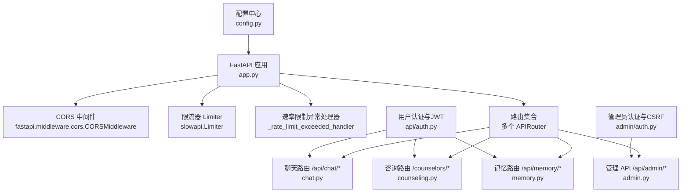
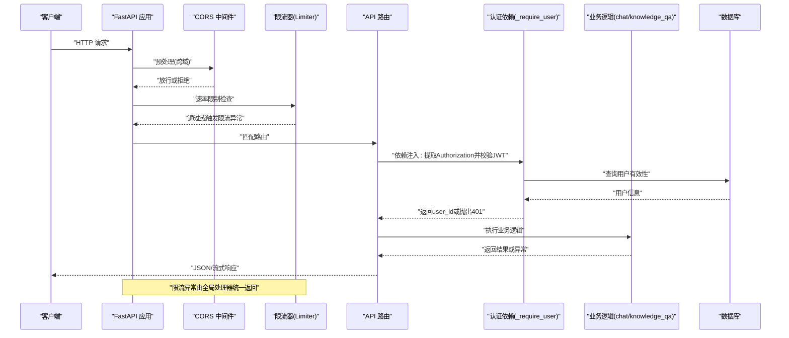
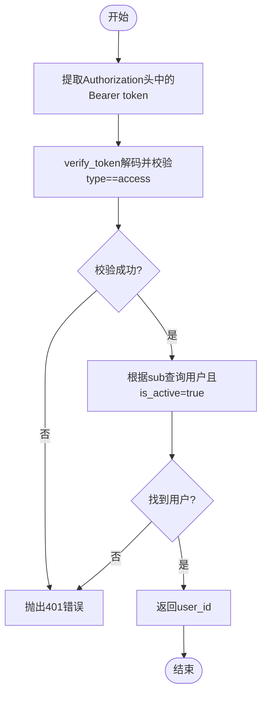
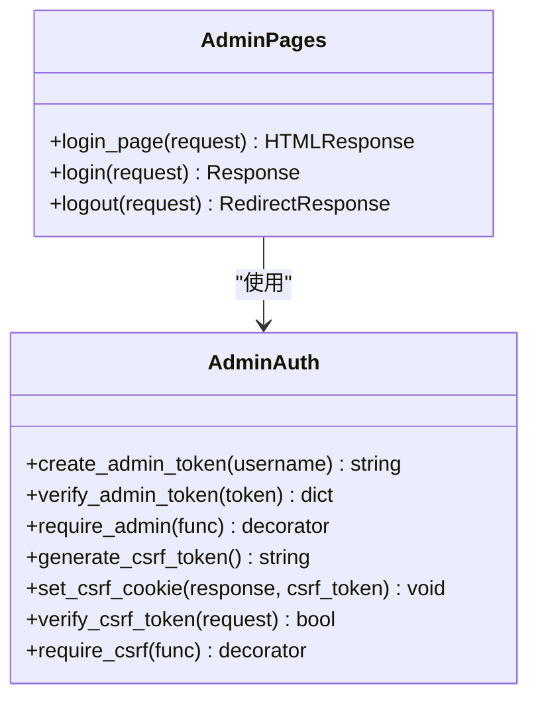
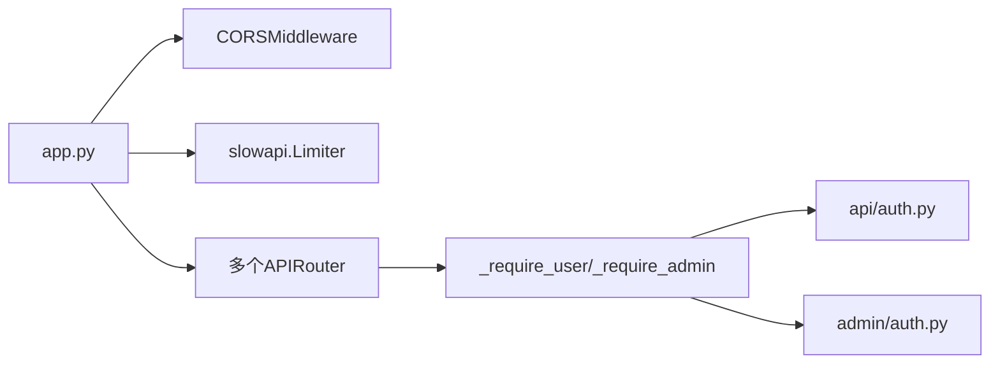

# 中间件系统

<cite>
**本文引用的文件**   
- [hushai/meditation/app.py](file://hushai/meditation/app.py)
- [hushai/meditation/config.py](file://hushai/meditation/config.py)
- [hushai/meditation/api/auth.py](file://hushai/meditation/api/auth.py)
- [hushai/meditation/admin/auth.py](file://hushai/meditation/admin/auth.py)
- [hushai/meditation/api/chat.py](file://hushai/meditation/api/chat.py)
- [hushai/meditation/api/counseling.py](file://hushai/meditation/api/counseling.py)
- [hushai/meditation/api/memory.py](file://hushai/meditation/api/memory.py)
- [hushai/meditation/api/admin.py](file://hushai/meditation/api/admin.py)
- [tests/meditation/test_auth.py](file://tests/meditation/test_auth.py)
</cite>

## 目录
1. [简介](#简介)
2. [项目结构](#项目结构)
3. [核心组件](#核心组件)
4. [架构总览](#架构总览)
5. [详细组件分析](#详细组件分析)
6. [依赖关系分析](#依赖关系分析)
7. [性能考虑](#性能考虑)
8. [故障排查指南](#故障排查指南)
9. [结论](#结论)
10. [附录：自定义中间件开发指南](#附录自定义中间件开发指南)

## 简介
本文件围绕 FastAPI 中间件系统，系统性阐述本项目中跨域（CORS）、限流、认证授权与日志记录等关键能力的实现方式与执行顺序；并深入解析请求处理管道的设计，包括错误拦截、响应修改机制、JWT Token 验证、权限检查与会话管理。同时提供性能优化建议、调试技巧以及自定义中间件的开发指南，帮助读者快速理解与扩展该系统的中间件能力。

## 项目结构
本项目的中间件与认证相关代码主要分布在应用入口、配置模块与各 API 路由中：
- 应用入口负责创建 FastAPI 实例、注册全局中间件与异常处理器、挂载路由与静态资源。
- 配置模块集中管理环境变量映射与运行时配置项（如 CORS 来源、JWT 密钥与算法）。
- 认证模块提供用户侧与管理员侧的 JWT 签发、校验、刷新与 CSRF 保护。
- API 路由通过依赖注入在端点级别完成鉴权与限流。

图表来源
- [hushai/meditation/app.py:136-207](file://hushai/meditation/app.py#L136-L207)
- [hushai/meditation/config.py:18-52](file://hushai/meditation/config.py#L18-L52)
- [hushai/meditation/api/chat.py:58-127](file://hushai/meditation/api/chat.py#L58-L127)
- [hushai/meditation/api/counseling.py:50-90](file://hushai/meditation/api/counseling.py#L50-L90)
- [hushai/meditation/api/memory.py:1-24](file://hushai/meditation/api/memory.py#L1-L24)
- [hushai/meditation/api/admin.py:1-34](file://hushai/meditation/api/admin.py#L1-L34)
- [hushai/meditation/api/auth.py:109-131](file://hushai/meditation/api/auth.py#L109-L131)
- [hushai/meditation/admin/auth.py:64-84](file://hushai/meditation/admin/auth.py#L64-L84)

章节来源
- [hushai/meditation/app.py:136-207](file://hushai/meditation/app.py#L136-L207)
- [hushai/meditation/config.py:18-52](file://hushai/meditation/config.py#L18-L52)

## 核心组件
- 跨域中间件（CORS）
  - 在应用启动时按配置动态设置允许的来源列表；开发环境默认放宽为任意来源，生产环境需显式配置白名单。
  - 支持携带凭据与通配方法/头，便于前后端联调与跨域访问。
- 限流中间件（Rate Limiting）
  - 使用 slowapi 的 Limiter 基于客户端 IP 进行限流，并在应用级注册 RateLimitExceeded 异常处理器，统一返回限流错误。
  - 对聊天相关接口以装饰器形式施加“每分钟 30 次”的限制，防止滥用与费用激增。
- 认证与授权
  - 用户侧：微信 OAuth 登录流程生成 access_token 与 refresh_token；access_token 强制包含 type=access 声明，verify_token 会拒绝非 access 类型；get_current_user_id 解码后查询数据库确认用户有效。
  - 管理员侧：独立 JWT 签发与校验，要求 is_admin 标志；页面登录采用 Cookie + CSRF 双重保护。
- 会话管理
  - 无状态访问令牌（JWT）用于 API 鉴权；refresh_token 采用哈希+选择器（selector）方案，避免全表 bcrypt 比对带来的 DoS 风险。
  - 管理员 Web 界面通过 Cookie 维持会话，并提供登出清理逻辑。
- 日志记录
  - 应用生命周期内初始化 Python logging，根据 debug 模式调整日志级别与格式，便于开发与排障。

章节来源
- [hushai/meditation/app.py:146-155](file://hushai/meditation/app.py#L146-L155)
- [hushai/meditation/app.py:147](file://hushai/meditation/app.py#L147)
- [hushai/meditation/api/chat.py:58-127](file://hushai/meditation/api/chat.py#L58-L127)
- [hushai/meditation/api/auth.py:109-131](file://hushai/meditation/api/auth.py#L109-L131)
- [hushai/meditation/api/auth.py:134-164](file://hushai/meditation/api/auth.py#L134-L164)
- [hushai/meditation/admin/auth.py:64-84](file://hushai/meditation/admin/auth.py#L64-L84)
- [hushai/meditation/admin/auth.py:136-182](file://hushai/meditation/admin/auth.py#L136-L182)
- [hushai/meditation/app.py:24-33](file://hushai/meditation/app.py#L24-L33)

## 架构总览
下图展示了从请求进入 FastAPI 到最终响应的完整路径，包括中间件执行顺序、鉴权与限流的落点，以及错误拦截的统一出口。

图表来源
- [hushai/meditation/app.py:146-155](file://hushai/meditation/app.py#L146-L155)
- [hushai/meditation/app.py:147](file://hushai/meditation/app.py#L147)
- [hushai/meditation/api/chat.py:58-127](file://hushai/meditation/api/chat.py#L58-L127)
- [hushai/meditation/api/auth.py:109-131](file://hushai/meditation/api/auth.py#L109-L131)

## 详细组件分析

### CORS 跨域处理
- 配置来源：
  - 生产环境默认不允许任意来源，需通过环境变量 MEDITATION_CORS_ORIGINS 指定白名单；开发环境（debug=True）自动放宽为 ["*"]。
- 行为要点：
  - 允许携带凭据（allow_credentials=True），允许所有方法与头部，简化前端跨域调用。
  - 若未正确配置，浏览器将拒绝跨域请求。

章节来源
- [hushai/meditation/config.py:18-52](file://hushai/meditation/config.py#L18-L52)
- [hushai/meditation/app.py:148-155](file://hushai/meditation/app.py#L148-L155)

### 限流保护
- 实现位置：
  - 应用层注册 Limiter 与 RateLimitExceeded 异常处理器；聊天相关端点使用 @limiter.limit("30/minute") 装饰器。
- 效果：
  - 同一 IP 在 1 分钟内超过阈值将被拒绝，返回标准限流错误。
- 注意事项：
  - 若需要更细粒度控制（如按用户 ID 或 API Key），可替换 key_func 或为不同端点设置不同阈值。

章节来源
- [hushai/meditation/app.py:146-147](file://hushai/meditation/app.py#L146-L147)
- [hushai/meditation/api/chat.py:58-127](file://hushai/meditation/api/chat.py#L58-L127)

### 认证与授权（用户侧）
- 登录流程：
  - 微信 code 换取 session_key/openid，创建或更新用户，签发 access_token（含 type=access）与 refresh_token。
- 访问控制：
  - 各受保护端点通过 _require_user 依赖注入，从 Authorization 头提取 Bearer token，调用 get_current_user_id 校验并返回 user_id。
- 刷新令牌：
  - refresh_access_token 使用 selector（SHA-256 hex）定位用户，再使用 bcrypt 校验原 token，避免全表扫描导致的 DoS 风险。

图表来源
- [hushai/meditation/api/auth.py:109-131](file://hushai/meditation/api/auth.py#L109-L131)
- [hushai/meditation/api/chat.py:47-56](file://hushai/meditation/api/chat.py#L47-L56)

章节来源
- [hushai/meditation/api/auth.py:45-106](file://hushai/meditation/api/auth.py#L45-L106)
- [hushai/meditation/api/auth.py:109-131](file://hushai/meditation/api/auth.py#L109-L131)
- [hushai/meditation/api/auth.py:134-164](file://hushai/meditation/api/auth.py#L134-L164)
- [hushai/meditation/api/chat.py:47-56](file://hushai/meditation/api/chat.py#L47-L56)
- [hushai/meditation/api/counseling.py:50-90](file://hushai/meditation/api/counseling.py#L50-L90)
- [hushai/meditation/api/memory.py:16-24](file://hushai/meditation/api/memory.py#L16-L24)
- [tests/meditation/test_auth.py:49-78](file://tests/meditation/test_auth.py#L49-L78)
- [tests/meditation/test_auth.py:82-136](file://tests/meditation/test_auth.py#L82-L136)

### 认证与授权（管理员侧）
- 管理员 JWT：
  - create_admin_token 签发包含 is_admin=true 的 JWT；verify_admin_token 强制校验 is_admin 标志。
- 页面登录与 CSRF：
  - 登录成功后设置 admin_token Cookie 与 admin_csrf_token Cookie；POST/PUT/DELETE/PATCH 请求需携带 X-CSRF-Token 与 Cookie 一致，否则返回 403。
- 依赖注入：
  - require_admin 装饰器从 Cookie 或 Authorization 头获取 token，校验失败返回 401，并将 admin_user 写入 request.state 供后续处理使用。

图表来源
- [hushai/meditation/admin/auth.py:64-84](file://hushai/meditation/admin/auth.py#L64-L84)
- [hushai/meditation/admin/auth.py:104-113](file://hushai/meditation/admin/auth.py#L104-L113)
- [hushai/meditation/admin/auth.py:136-182](file://hushai/meditation/admin/auth.py#L136-L182)
- [hushai/meditation/admin/pages/auth.py:20-41](file://hushai/meditation/admin/pages/auth.py#L20-L41)

章节来源
- [hushai/meditation/admin/auth.py:64-84](file://hushai/meditation/admin/auth.py#L64-L84)
- [hushai/meditation/admin/auth.py:104-113](file://hushai/meditation/admin/auth.py#L104-L113)
- [hushai/meditation/admin/auth.py:136-182](file://hushai/meditation/admin/auth.py#L136-L182)
- [hushai/meditation/admin/pages/auth.py:20-41](file://hushai/meditation/admin/pages/auth.py#L20-L41)

### 会话管理
- 用户侧：
  - 无状态 JWT 作为访问凭证；refresh_token 采用哈希+选择器方案，确保 O(1) 定位与安全性。
- 管理员侧：
  - 基于 Cookie 的会话管理，配合 CSRF 防护，适合 Web 后台场景。

章节来源
- [hushai/meditation/api/auth.py:134-164](file://hushai/meditation/api/auth.py#L134-L164)
- [hushai/meditation/admin/auth.py:136-182](file://hushai/meditation/admin/auth.py#L136-L182)

### 日志记录
- 应用启动时根据配置初始化 logging，输出结构化日志；debug 模式启用 DEBUG 级别，便于追踪问题。
- 建议在中间件中增加请求/响应级别的日志记录（例如记录请求路径、耗时、状态码），以提升可观测性。

章节来源
- [hushai/meditation/app.py:24-33](file://hushai/meditation/app.py#L24-L33)

## 依赖关系分析
- 中间件与路由耦合度低，通过 FastAPI 的 add_middleware 与 include_router 解耦组合。
- 认证逻辑集中在 api/auth.py 与 admin/auth.py，被各路由通过 Depends 复用，降低重复代码。
- 限流通过装饰器作用于具体端点，灵活可控。

图表来源
- [hushai/meditation/app.py:146-180](file://hushai/meditation/app.py#L146-L180)
- [hushai/meditation/api/chat.py:47-56](file://hushai/meditation/api/chat.py#L47-L56)
- [hushai/meditation/api/admin.py:26-34](file://hushai/meditation/api/admin.py#L26-L34)
- [hushai/meditation/api/auth.py:109-131](file://hushai/meditation/api/auth.py#L109-L131)
- [hushai/meditation/admin/auth.py:64-84](file://hushai/meditation/admin/auth.py#L64-L84)

章节来源
- [hushai/meditation/app.py:146-180](file://hushai/meditation/app.py#L146-L180)
- [hushai/meditation/api/chat.py:47-56](file://hushai/meditation/api/chat.py#L47-L56)
- [hushai/meditation/api/admin.py:26-34](file://hushai/meditation/api/admin.py#L26-L34)

## 性能考虑
- 限流策略：
  - 当前基于内存的 Limiter 适用于单机部署；多实例部署建议使用 Redis 后端以共享计数。
- 认证开销：
  - verify_token 仅做 JWT 解码与类型校验，开销极低；get_current_user_id 的数据库查询应确保 id 字段有索引。
- Refresh Token 安全与效率：
  - 使用 selector 定位用户后再 bcrypt 校验，避免全表扫描，显著降低 DoS 风险。
- CORS 配置：
  - 生产环境务必精确配置 cors_origins，避免使用 ["*"]，减少不必要的预检请求。

[本节为通用指导，不直接分析具体文件]

## 故障排查指南
- 401 未认证：
  - 检查 Authorization 头是否包含正确的 Bearer token；确认 token 未过期且 type=access。
  - 参考测试用例验证 verify_token 的行为与错误消息。
- 403 CSRF 失败：
  - 确认已设置 admin_csrf_token Cookie，并在请求头携带 X-CSRF-Token 与之匹配。
- 429 限流：
  - 检查是否超过 30/minute 阈值；必要时调整限流策略或扩大阈值。
- 跨域错误：
  - 确认 CORS 配置在生产环境已正确设置白名单；开发环境可使用 ["*"] 临时放宽。

章节来源
- [tests/meditation/test_auth.py:49-78](file://tests/meditation/test_auth.py#L49-L78)
- [hushai/meditation/admin/auth.py:173-182](file://hushai/meditation/admin/auth.py#L173-L182)
- [hushai/meditation/api/chat.py:58-127](file://hushai/meditation/api/chat.py#L58-L127)
- [hushai/meditation/app.py:148-155](file://hushai/meditation/app.py#L148-L155)

## 结论
本项目的中间件体系以 FastAPI 为核心，结合 CORS、限流、认证与 CSRF 等能力，形成了清晰、可扩展的请求处理管道。通过依赖注入与装饰器，认证与限流得以在端点层面灵活组合；JWT 与 refresh_token 的安全设计兼顾了性能与健壮性。建议在生产环境中严格配置 CORS 与限流策略，并补充请求/响应日志以提升可观测性与排障效率。

[本节为总结，不直接分析具体文件]

## 附录：自定义中间件开发指南
- 何时使用中间件：
  - 需要在全局范围横切关注点（如统一日志、审计、签名校验、缓存头等）时使用中间件。
- 如何添加：
  - 在 app.py 的 create_app 中使用 app.add_middleware 注册自定义中间件类或函数。
  - 注意中间件的执行顺序：先注册的先执行（请求阶段），后注册的先返回（响应阶段）。
- 最佳实践：
  - 保持中间件轻量，避免阻塞 IO；必要时使用异步中间件。
  - 对异常进行捕获与转换，保证统一的错误响应格式。
  - 在中间件中记录关键指标（如耗时、状态码、用户标识），便于监控与告警。
- 示例思路（概念性说明）：
  - 请求日志中间件：记录请求方法、路径、IP、耗时；响应阶段追加响应头（如 X-Request-ID）。
  - 签名校验中间件：对特定前缀的路径进行签名验证，失败返回 401/403。
  - 缓存中间件：对 GET 请求进行缓存命中判断，命中则直接返回，未命中则执行业务逻辑并写入缓存。

[本节为通用指导，不直接分析具体文件]