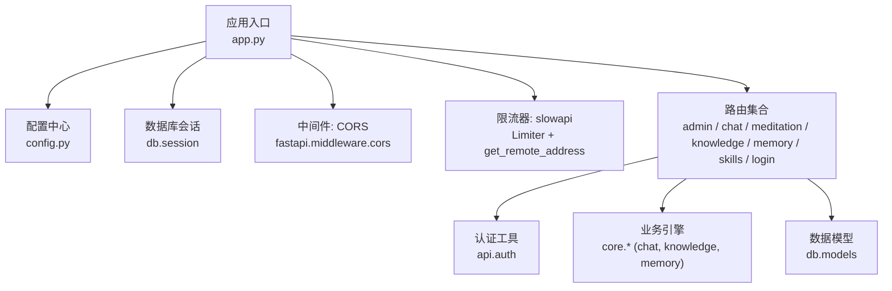
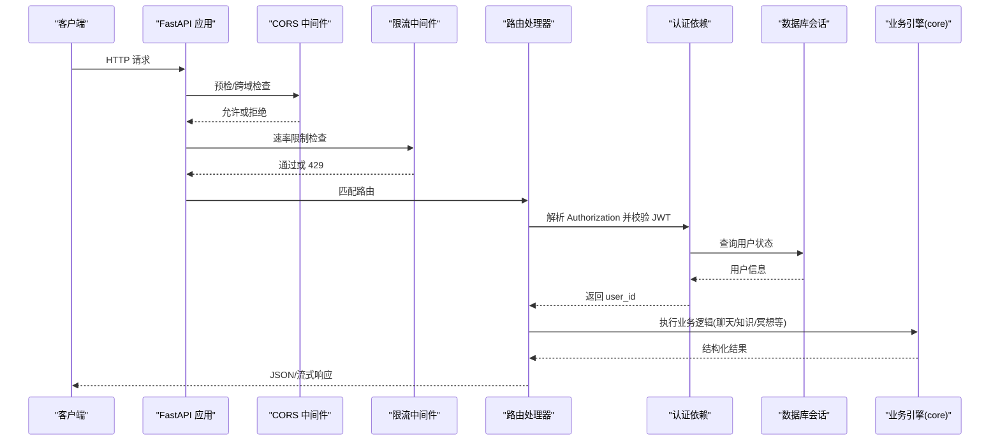
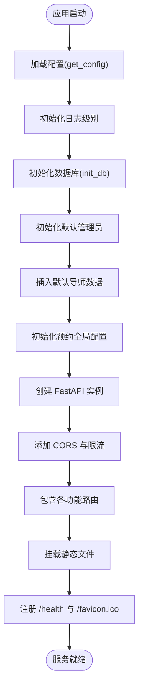
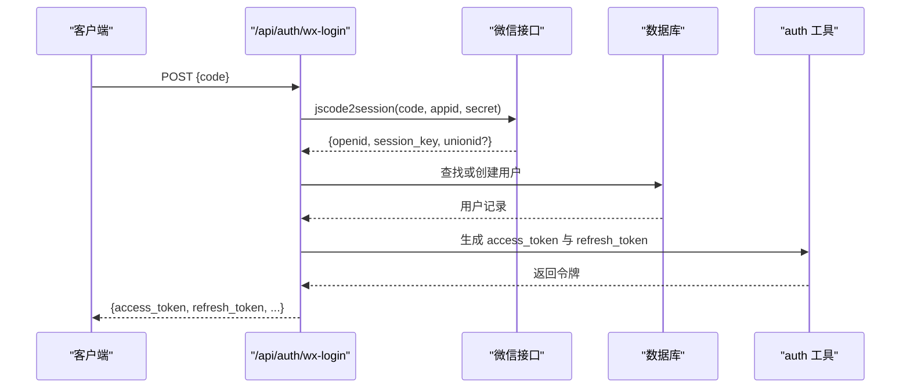
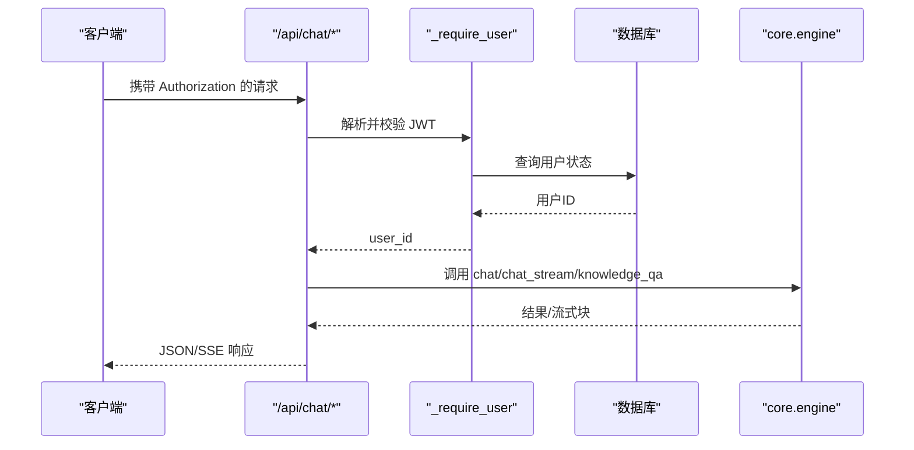
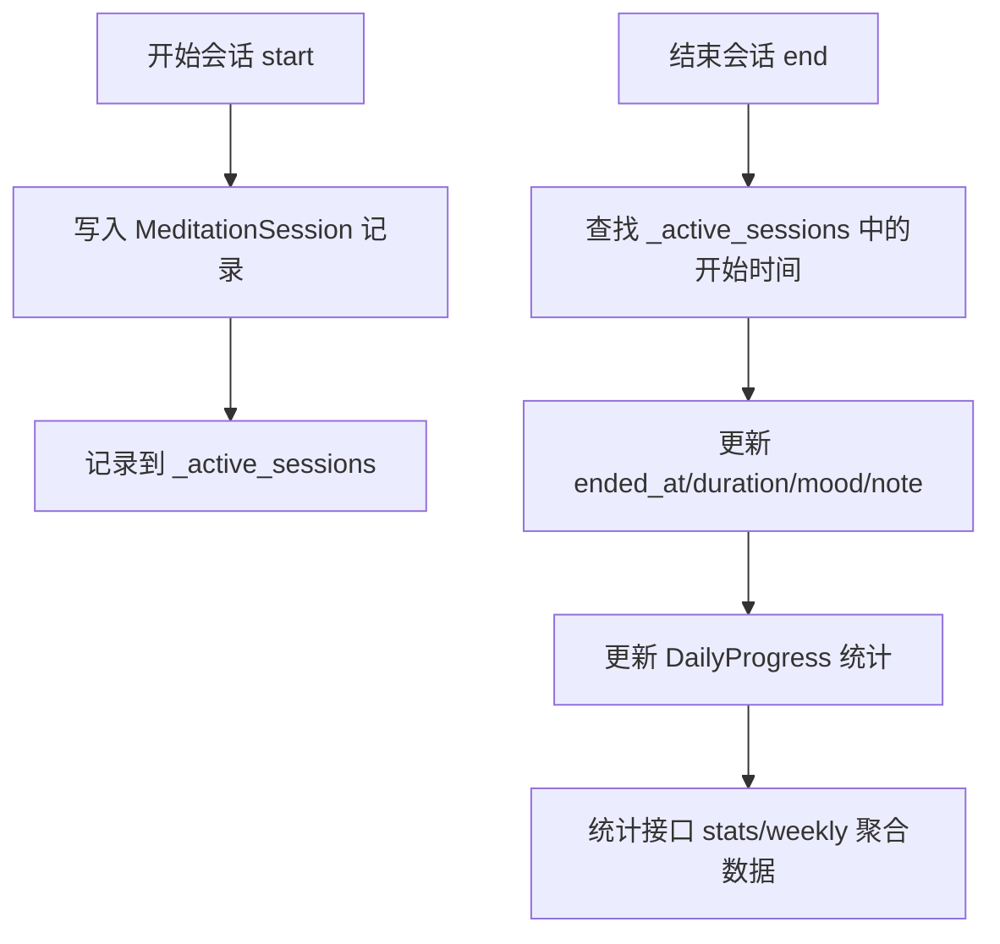
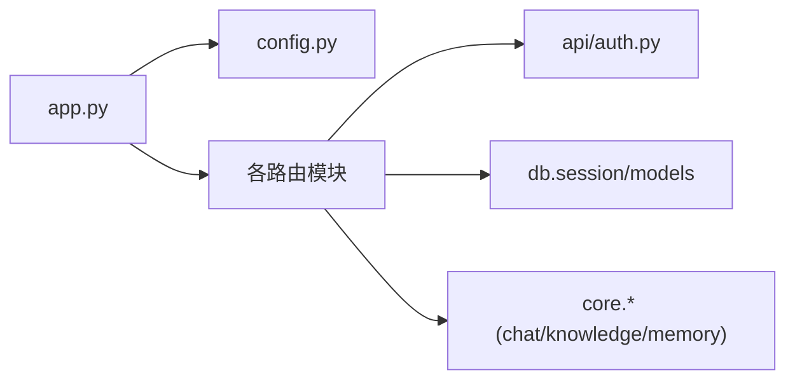

# API 层设计

<cite>
**本文引用的文件**
- [hushai/meditation/app.py](file://hushai/meditation/app.py)
- [hushai/meditation/config.py](file://hushai/meditation/config.py)
- [hushai/meditation/api/auth.py](file://hushai/meditation/api/auth.py)
- [hushai/meditation/api/login.py](file://hushai/meditation/api/login.py)
- [hushai/meditation/api/chat.py](file://hushai/meditation/api/chat.py)
- [hushai/meditation/api/meditation.py](file://hushai/meditation/api/meditation.py)
- [hushai/meditation/api/admin.py](file://hushai/meditation/api/admin.py)
- [hushai/meditation/api/knowledge.py](file://hushai/meditation/api/knowledge.py)
- [hushai/meditation/api/memory.py](file://hushai/meditation/api/memory.py)
- [hushai/meditation/api/skills.py](file://hushai/meditation/api/skills.py)
</cite>

## 目录
1. [简介](#简介)
2. [项目结构](#项目结构)
3. [核心组件](#核心组件)
4. [架构总览](#架构总览)
5. [详细组件分析](#详细组件分析)
6. [依赖关系分析](#依赖关系分析)
7. [性能与扩展性](#性能与扩展性)
8. [故障排查指南](#故障排查指南)
9. [结论](#结论)
10. [附录：新增 API 端点指南](#附录新增-api-端点指南)

## 简介
本文件面向 hush.ai 的 API 层设计与实现，聚焦 FastAPI 应用初始化、路由注册机制、中间件链配置（CORS、限流）、静态文件挂载、请求处理流程、参数验证、响应格式化与错误处理策略。同时覆盖认证路由、对话路由、冥想路由、管理后台路由等模块的组织方式，并提供依赖注入模式与生命周期管理的实践说明。

## 项目结构
API 层采用“按功能域拆分路由”的方式组织，所有路由通过应用入口集中注册，配合中间件与生命周期钩子完成全局能力装配。

图示来源
- [hushai/meditation/app.py:136-207](file://hushai/meditation/app.py#L136-L207)
- [hushai/meditation/config.py:18-52](file://hushai/meditation/config.py#L18-L52)

章节来源
- [hushai/meditation/app.py:136-207](file://hushai/meditation/app.py#L136-L207)
- [hushai/meditation/config.py:18-52](file://hushai/meditation/config.py#L18-L52)

## 核心组件
- 应用工厂与生命周期
  - 使用 lifespan 钩子在启动时初始化日志、数据库、默认管理员与初始数据；在关闭时释放资源。
  - create_app 负责创建 FastAPI 实例、注册中间件、挂载静态资源、包含各功能路由。
- 配置系统
  - 基于 dataclass 的环境映射加载，支持调试开关、CORS 白名单、LLM 提供商、嵌入模型、端口主机等。
- 认证与鉴权
  - 微信登录流程、JWT access token 签发与校验、refresh token 刷新、Bearer Token 提取。
- 路由模块
  - 认证登录：/api/auth
  - 对话：/api/chat
  - 冥想：/api/meditation
  - 知识库：/api/knowledge
  - 记忆：/api/memory
  - 技能：/api/skills
  - 管理后台：/api/admin
- 中间件与限流
  - CORS 中间件根据环境动态放行域名；slowapi 基于客户端 IP 进行每分钟限流。
- 静态文件
  - 前端与管理后台静态资源分别挂载到 /static 与 /admin/static。

章节来源
- [hushai/meditation/app.py:24-134](file://hushai/meditation/app.py#L24-L134)
- [hushai/meditation/app.py:136-207](file://hushai/meditation/app.py#L136-L207)
- [hushai/meditation/config.py:18-136](file://hushai/meditation/config.py#L18-L136)
- [hushai/meditation/api/auth.py:1-171](file://hushai/meditation/api/auth.py#L1-L171)
- [hushai/meditation/api/login.py:1-53](file://hushai/meditation/api/login.py#L1-L53)
- [hushai/meditation/api/chat.py:1-245](file://hushai/meditation/api/chat.py#L1-L245)
- [hushai/meditation/api/meditation.py:1-368](file://hushai/meditation/api/meditation.py#L1-L368)
- [hushai/meditation/api/admin.py:1-268](file://hushai/meditation/api/admin.py#L1-L268)
- [hushai/meditation/api/knowledge.py:1-310](file://hushai/meditation/api/knowledge.py#L1-L310)
- [hushai/meditation/api/memory.py:1-61](file://hushai/meditation/api/memory.py#L1-L61)
- [hushai/meditation/api/skills.py:1-113](file://hushai/meditation/api/skills.py#L1-L113)

## 架构总览
下图展示从请求进入 FastAPI 到最终返回响应的关键路径，包括中间件、依赖注入、限流、认证与业务调用。

图示来源
- [hushai/meditation/app.py:136-207](file://hushai/meditation/app.py#L136-L207)
- [hushai/meditation/api/chat.py:47-56](file://hushai/meditation/api/chat.py#L47-L56)
- [hushai/meditation/api/auth.py:109-131](file://hushai/meditation/api/auth.py#L109-L131)

## 详细组件分析

### 应用初始化与生命周期
- 启动阶段
  - 读取配置，设置日志级别；初始化数据库连接；创建默认管理员与初始导师数据；初始化预约全局配置。
- 应用构建
  - 创建 FastAPI 实例，注册限流异常处理器；根据 debug 动态设置 CORS 白名单；包含全部路由；挂载静态文件；提供健康检查与 favicon 重定向。
- 进程运行
  - 通过 uvicorn 以工厂模式加载应用，支持热重载。

图示来源
- [hushai/meditation/app.py:24-134](file://hushai/meditation/app.py#L24-L134)
- [hushai/meditation/app.py:136-207](file://hushai/meditation/app.py#L136-L207)

章节来源
- [hushai/meditation/app.py:24-134](file://hushai/meditation/app.py#L24-L134)
- [hushai/meditation/app.py:136-207](file://hushai/meditation/app.py#L136-L207)

### 配置系统
- 环境变量映射：将 MEDITATION_* 前缀的环境变量映射到 MeditationConfig 字段，支持布尔、整型与字符串类型转换。
- 运行时访问：get_config 提供单例式配置对象，供应用与路由按需读取。

章节来源
- [hushai/meditation/config.py:18-136](file://hushai/meditation/config.py#L18-L136)

### 认证与登录
- 微信登录
  - 使用 code 换取 session_key 与 openid，自动创建或更新用户记录，签发 access_token 与 refresh_token。
- Token 校验
  - verify_token 强制校验 type 为 access，防止未来引入 refresh JWT 时的类型混淆。
- 当前用户解析
  - get_current_user_id 从 token 中解析 sub 并校验用户存在且启用。
- Refresh Token
  - 通过 SHA-256 selector 快速定位用户，再用 bcrypt 校验原 token，避免逐行比对带来的 DoS 风险。

图示来源
- [hushai/meditation/api/login.py:21-35](file://hushai/meditation/api/login.py#L21-L35)
- [hushai/meditation/api/auth.py:63-106](file://hushai/meditation/api/auth.py#L63-L106)

章节来源
- [hushai/meditation/api/auth.py:1-171](file://hushai/meditation/api/auth.py#L1-L171)
- [hushai/meditation/api/login.py:1-53](file://hushai/meditation/api/login.py#L1-L53)

### 对话路由 (/api/chat)
- 认证依赖
  - _require_user 从 Authorization 头提取 Bearer Token，调用 get_current_user_id 校验并返回 user_id。
- 聊天接口
  - POST /api/chat/ 同步聊天；POST /api/chat/stream 流式 SSE 输出；POST /api/chat/knowledge 基于知识库问答。
- 场景与对话历史
  - GET /api/chat/scenes 获取可用场景；GET /api/chat/conversations 分页列出对话；GET /api/chat/conversations/{id}/messages 获取消息历史。
- 限流
  - 聊天相关接口统一限制 30 次/分钟。

图示来源
- [hushai/meditation/api/chat.py:47-56](file://hushai/meditation/api/chat.py#L47-L56)
- [hushai/meditation/api/chat.py:58-104](file://hushai/meditation/api/chat.py#L58-L104)

章节来源
- [hushai/meditation/api/chat.py:1-245](file://hushai/meditation/api/chat.py#L1-L245)

### 冥想路由 (/api/meditation)
- 会话管理
  - POST /api/meditation/session/start 开始冥想会话；POST /api/meditation/session/end 结束会话并计算时长。
- 情绪打卡
  - POST /api/meditation/mood-checkin 记录情绪，更新每日统计。
- 统计与周视图
  - GET /api/meditation/stats 汇总总次数、总时长、平均情绪、连续天数、最近会话；GET /api/meditation/weekly 返回近七天数据。
- 内部状态
  - 使用内存字典 _active_sessions 跟踪活跃会话的开始时间，用于计算持续时间。

图示来源
- [hushai/meditation/api/meditation.py:112-174](file://hushai/meditation/api/meditation.py#L112-L174)
- [hushai/meditation/api/meditation.py:189-238](file://hushai/meditation/api/meditation.py#L189-L238)
- [hushai/meditation/api/meditation.py:241-333](file://hushai/meditation/api/meditation.py#L241-L333)

章节来源
- [hushai/meditation/api/meditation.py:1-368](file://hushai/meditation/api/meditation.py#L1-L368)

### 管理后台路由 (/api/admin)
- 管理员权限
  - 通过 _require_admin 校验 Authorization 头，复用通用 JWT 校验逻辑。
- 用户与咨询师管理
  - 获取用户画像、列表；审核咨询师入驻申请；查看订单与咨询师列表。
- 业务统计
  - 提供咨询业务全局统计（预约、订单、收入、咨询师在线数）。

章节来源
- [hushai/meditation/api/admin.py:1-268](file://hushai/meditation/api/admin.py#L1-L268)

### 知识库路由 (/api/knowledge)
- 导入能力
  - 文本导入、文件导入、结构化导入、批量导入、URL 抓取导入、远程源导入、一键同步。
- 搜索能力
  - 向量检索返回 Top-K 结果。
- 权限控制
  - 支持管理员 JWT 或普通用户 JWT 两种操作者身份。

章节来源
- [hushai/meditation/api/knowledge.py:1-310](file://hushai/meditation/api/knowledge.py#L1-L310)

### 记忆路由 (/api/memory)
- 用户记忆列表
  - 支持按分类过滤、分页查询，返回摘要、重要性、时间戳等元信息。

章节来源
- [hushai/meditation/api/memory.py:1-61](file://hushai/meditation/api/memory.py#L1-L61)

### 技能路由 (/api/skills)
- 公开列表
  - 返回启用的技能清单。
- 导入能力
  - 支持 JSON 结构与文件上传导入，需管理员或用户 JWT 授权。

章节来源
- [hushai/meditation/api/skills.py:1-113](file://hushai/meditation/api/skills.py#L1-L113)

## 依赖关系分析
- 模块耦合
  - 路由模块依赖认证工具与数据库会话；部分模块依赖 core 引擎（如 chat、knowledge）。
- 外部依赖
  - fastapi、slowapi、httpx、jose、bcrypt、sqlalchemy 等。
- 潜在循环
  - 路由模块仅单向依赖认证与核心库，未见明显循环依赖。

图示来源
- [hushai/meditation/app.py:136-207](file://hushai/meditation/app.py#L136-L207)
- [hushai/meditation/api/chat.py:1-27](file://hushai/meditation/api/chat.py#L1-L27)
- [hushai/meditation/api/knowledge.py:1-35](file://hushai/meditation/api/knowledge.py#L1-L35)

章节来源
- [hushai/meditation/app.py:136-207](file://hushai/meditation/app.py#L136-L207)
- [hushai/meditation/api/chat.py:1-27](file://hushai/meditation/api/chat.py#L1-L27)
- [hushai/meditation/api/knowledge.py:1-35](file://hushai/meditation/api/knowledge.py#L1-L35)

## 性能与扩展性
- 限流策略
  - 基于客户端 IP 的每分钟限流，保护后端免受突发流量冲击。建议对高成本接口（如 LLM 调用）进一步细化限流维度（用户 ID、conversation_id）。
- 流式响应
  - 对话流式输出使用 SSE，降低首字节延迟，提升用户体验。
- 数据库查询
  - 分页与计数分离，减少大结果集传输开销；统计接口使用聚合函数减少多次往返。
- 扩展建议
  - 将限流 key_func 扩展为组合键（IP+用户ID），支持更细粒度的配额控制。
  - 对长耗时任务（批量导入、远程同步）引入异步队列与任务状态查询。

[本节为通用指导，不直接分析具体文件]

## 故障排查指南
- 常见错误
  - 401 未认证：检查 Authorization 头是否携带正确的 Bearer Token，确认用户未被禁用。
  - 429 限流超限：检查接口限流阈值，必要时调整或扩容。
  - 400 参数无效：核对 Pydantic 模型约束（范围、必填项）。
  - 500 服务器错误：查看日志与上游服务（微信、LLM、向量库）可用性。
- 诊断要点
  - 使用 /debug 与 /redoc 文档页面验证接口定义与示例。
  - 关注 lifespan 日志输出，确认数据库初始化与种子数据是否成功。
  - 检查 CORS 配置，确保前端域名在白名单内。

章节来源
- [hushai/meditation/app.py:136-207](file://hushai/meditation/app.py#L136-L207)
- [hushai/meditation/api/chat.py:58-104](file://hushai/meditation/api/chat.py#L58-L104)
- [hushai/meditation/api/auth.py:109-131](file://hushai/meditation/api/auth.py#L109-L131)

## 结论
该 API 层以 FastAPI 为核心，结合 lifespan 生命周期、中间件链与模块化路由，实现了清晰的职责划分与良好的可维护性。认证体系完善，限流与 CORS 配置灵活，静态资源挂载简洁。建议在后续迭代中增强限流维度、引入任务队列与更完善的监控告警，以提升稳定性与可观测性。

[本节为总结性内容，不直接分析具体文件]

## 附录：新增 API 端点指南
- 步骤概览
  - 新建路由模块或在现有模块中添加端点，定义请求/响应 Pydantic 模型。
  - 如需认证，复用 _require_user 或 _require_admin 依赖，从 Authorization 头解析并校验 JWT。
  - 在 app.include_router 中注册新路由。
  - 若涉及限流，使用 @limiter.limit("N/minute") 装饰器。
  - 若需要数据库访问，使用 Depends(get_session) 注入 AsyncSession。
- 参考路径
  - 认证依赖与工具：[hushai/meditation/api/auth.py](file://hushai/meditation/api/auth.py)
  - 路由注册与中间件：[hushai/meditation/app.py](file://hushai/meditation/app.py)
  - 示例路由（对话/冥想/知识库/管理）：见对应 api 模块文件

章节来源
- [hushai/meditation/app.py:136-207](file://hushai/meditation/app.py#L136-L207)
- [hushai/meditation/api/auth.py:1-171](file://hushai/meditation/api/auth.py#L1-L171)
- [hushai/meditation/api/chat.py:1-245](file://hushai/meditation/api/chat.py#L1-L245)
- [hushai/meditation/api/meditation.py:1-368](file://hushai/meditation/api/meditation.py#L1-L368)
- [hushai/meditation/api/knowledge.py:1-310](file://hushai/meditation/api/knowledge.py#L1-L310)
- [hushai/meditation/api/admin.py:1-268](file://hushai/meditation/api/admin.py#L1-L268)