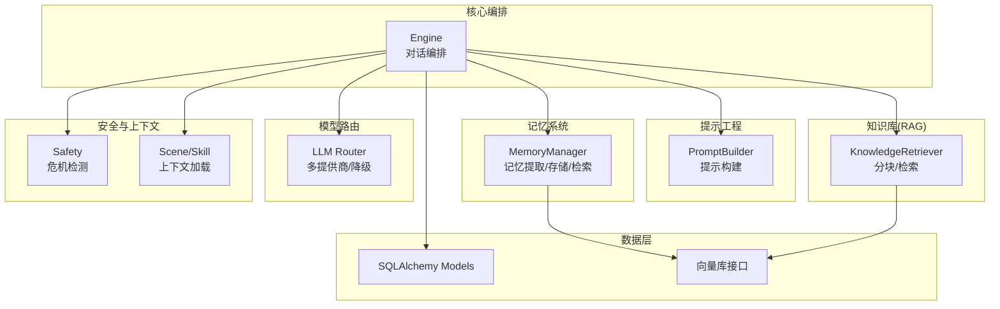
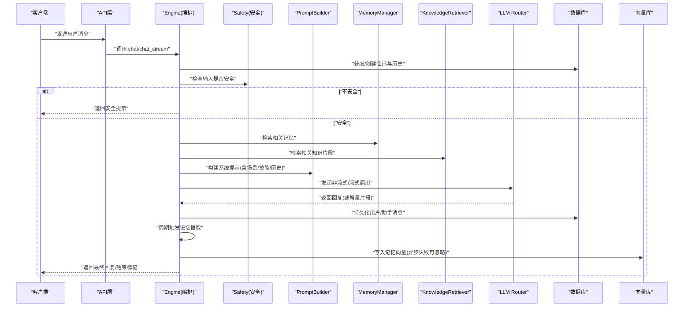
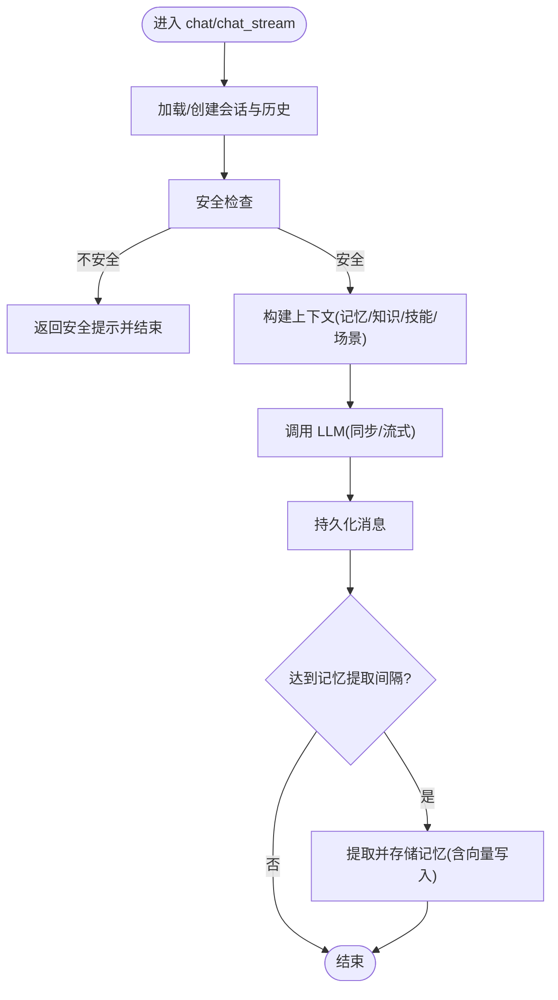
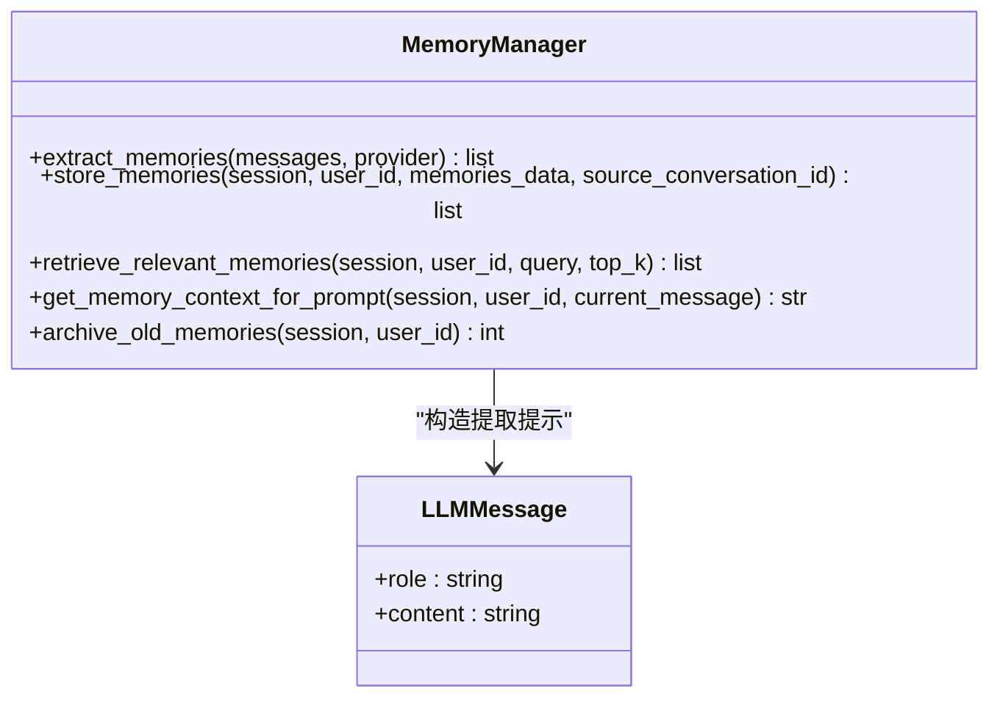
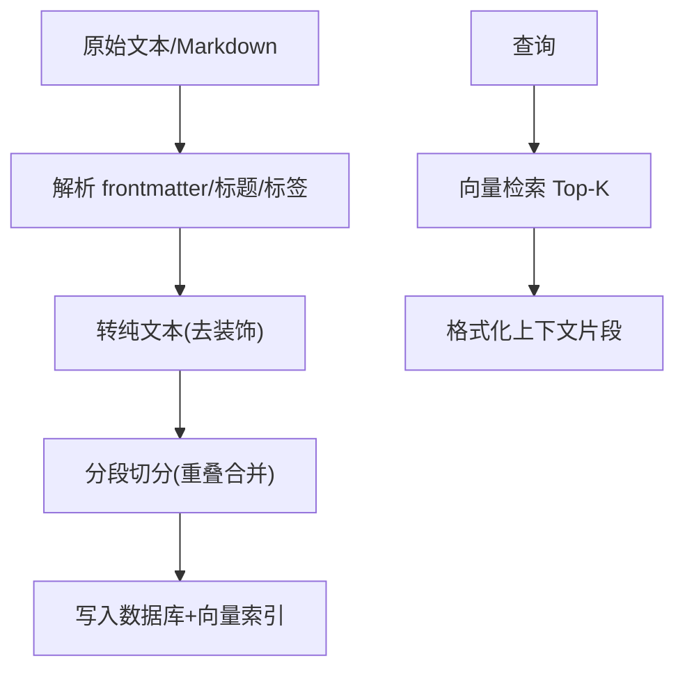
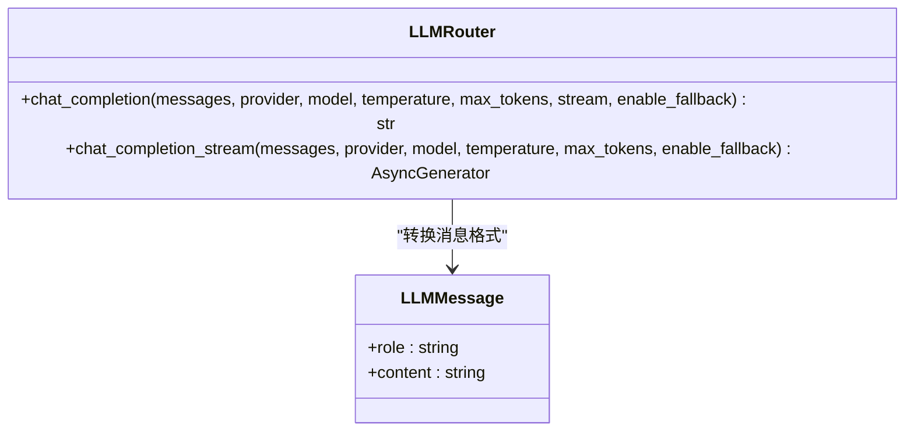
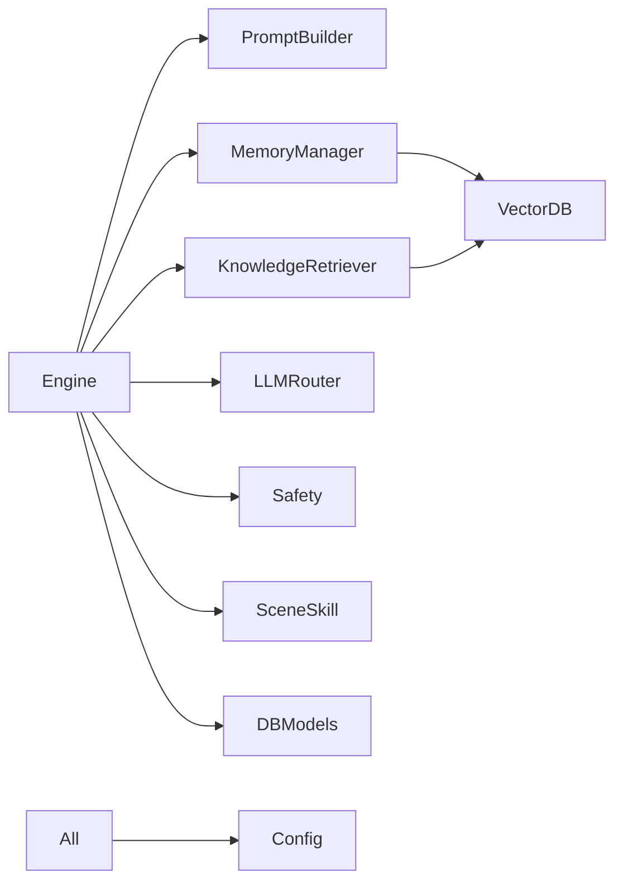

# 业务逻辑层设计

<cite>
**本文引用的文件**   
- [engine.py](file://hushai/meditation/core/engine.py)
- [prompt.py](file://hushai/meditation/core/prompt.py)
- [memory.py](file://hushai/meditation/core/memory.py)
- [knowledge.py](file://hushai/meditation/core/knowledge.py)
- [llm.py](file://hushai/meditation/core/llm.py)
- [safety.py](file://hushai/meditation/core/safety.py)
- [scenes.py](file://hushai/meditation/core/scenes.py)
- [skills.py](file://hushai/meditation/core/skills.py)
- [models.py](file://hushai/meditation/db/models.py)
- [config.py](file://hushai/meditation/config.py)
</cite>

## 目录
1. [引言](#引言)
2. [项目结构](#项目结构)
3. [核心组件](#核心组件)
4. [架构总览](#架构总览)
5. [详细组件分析](#详细组件分析)
6. [依赖关系分析](#依赖关系分析)
7. [性能与可扩展性](#性能与可扩展性)
8. [故障排查指南](#故障排查指南)
9. [结论](#结论)
10. [附录：扩展点与示例路径](#附录：扩展点与示例路径)

## 引言
本文件面向 hush.ai 的业务逻辑层，聚焦“冥想老师”对话引擎的编排机制与关键组件职责边界。内容涵盖：
- 对话流程控制（同步/流式）
- 提示词构建策略（系统提示、场景/技能注入、安全护栏）
- 记忆系统调用（提取、存储、检索、归档）
- 知识检索集成（RAG 导入与检索）
- 多模型 LLM 路由与降级
- 异常处理与日志记录
- 扩展点设计与新增业务功能的实践指引

## 项目结构
业务逻辑层位于 meditation/core 下，围绕 Engine 编排能力组织，配合 PromptBuilder、MemoryManager、KnowledgeRetriever、LLM 路由与安全模块共同完成一次完整的对话回合。

图表来源
- [engine.py:1-387](file://hushai/meditation/core/engine.py#L1-L387)
- [prompt.py:1-130](file://hushai/meditation/core/prompt.py#L1-L130)
- [memory.py:1-206](file://hushai/meditation/core/memory.py#L1-L206)
- [knowledge.py:1-225](file://hushai/meditation/core/knowledge.py#L1-L225)
- [llm.py:1-258](file://hushai/meditation/core/llm.py#L1-L258)
- [safety.py:1-111](file://hushai/meditation/core/safety.py#L1-L111)
- [scenes.py:1-30](file://hushai/meditation/core/scenes.py#L1-L30)
- [skills.py:1-59](file://hushai/meditation/core/skills.py#L1-L59)
- [models.py:1-434](file://hushai/meditation/db/models.py#L1-L434)

章节来源
- [engine.py:1-387](file://hushai/meditation/core/engine.py#L1-L387)
- [config.py:1-136](file://hushai/meditation/config.py#L1-L136)

## 核心组件
- Engine（对话编排）
  - 负责会话生命周期管理、消息持久化、上下文组装、安全检查、LLM 调用、记忆提取触发与标题补全。
  - 提供 chat（同步）、chat_stream（流式）、knowledge_qa（知识问答）三种入口。
- PromptBuilder（提示构建）
  - 将角色设定、场景/技能、知识库片段、历史对话、安全护栏等拼装为系统提示。
- MemoryManager（记忆管理）
  - 基于 LLM 从对话中提取结构化记忆，持久化并写入向量索引；按查询召回相关记忆用于提示注入。
- KnowledgeRetriever（知识检索）
  - 支持 Markdown/结构化文本导入、分块、向量化入库；按查询检索 Top-K 片段作为参考。
- LLM Router（模型路由）
  - 统一封装 OpenAI 兼容接口，支持多提供商配置、自动降级、调试 Mock 模式。
- Safety（安全过滤）
  - 关键词正则快速阻断，识别自伤/伤人倾向，输出分级提示与建议。
- Scene/Skill（上下文加载）
  - 根据场景/技能 ID 加载对应系统提示或技能片段，注入到对话上下文中。

章节来源
- [engine.py:1-387](file://hushai/meditation/core/engine.py#L1-L387)
- [prompt.py:1-130](file://hushai/meditation/core/prompt.py#L1-L130)
- [memory.py:1-206](file://hushai/meditation/core/memory.py#L1-L206)
- [knowledge.py:1-225](file://hushai/meditation/core/knowledge.py#L1-L225)
- [llm.py:1-258](file://hushai/meditation/core/llm.py#L1-L258)
- [safety.py:1-111](file://hushai/meditation/core/safety.py#L1-L111)
- [scenes.py:1-30](file://hushai/meditation/core/scenes.py#L1-L30)
- [skills.py:1-59](file://hushai/meditation/core/skills.py#L1-L59)

## 架构总览
下图展示一次典型对话请求在业务层的流转过程，包括安全检查、上下文构建、LLM 调用、结果持久化与记忆提取。

图表来源
- [engine.py:166-314](file://hushai/meditation/core/engine.py#L166-L314)
- [safety.py:83-111](file://hushai/meditation/core/safety.py#L83-L111)
- [prompt.py:77-103](file://hushai/meditation/core/prompt.py#L77-L103)
- [memory.py:161-173](file://hushai/meditation/core/memory.py#L161-L173)
- [knowledge.py:216-224](file://hushai/meditation/core/knowledge.py#L216-L224)
- [llm.py:136-178](file://hushai/meditation/core/llm.py#L136-L178)

## 详细组件分析

### Engine（对话编排）
- 职责边界
  - 会话与消息：查找/创建 Conversation，追加 Message，限制历史长度。
  - 上下文准备：并行拉取记忆、知识、技能、场景上下文，组装 system prompt。
  - 安全前置：在调用 LLM 前进行安全拦截。
  - LLM 调用：支持同步与非同步（流式），参数由配置决定。
  - 记忆提取：按固定间隔触发，首次会话自动设置标题。
- 关键流程
  - chat：同步返回完整回复。
  - chat_stream：逐字增量返回，最后以 done=true 结束。
  - knowledge_qa：基于知识库检索结果生成回答，附带来源摘要。
- 错误处理
  - 会话级事务：异常时回滚；流式路径使用 finally 确保提交/回滚。
  - 记忆写入失败：仅告警不中断主流程。
- 日志记录
  - 使用标准 logging 记录警告与降级信息。

图表来源
- [engine.py:166-314](file://hushai/meditation/core/engine.py#L166-L314)
- [engine.py:130-154](file://hushai/meditation/core/engine.py#L130-L154)

章节来源
- [engine.py:38-127](file://hushai/meditation/core/engine.py#L38-L127)
- [engine.py:166-314](file://hushai/meditation/core/engine.py#L166-L314)
- [engine.py:316-387](file://hushai/meditation/core/engine.py#L316-L387)

### PromptBuilder（提示构建）
- 职责边界
  - 组合角色设定、个性化风格、场景/技能、知识库参考、最近对话、安全护栏等。
  - 提供通用系统提示与知识问答专用系统提示。
- 设计要点
  - 模块化拼接：按需插入各段落，避免无关上下文污染。
  - 安全护栏：内置心理健康危机引导话术。
- 复杂度
  - 时间复杂度 O(N)，N 为段落数量；空间复杂度 O(L)，L 为最终提示长度。

章节来源
- [prompt.py:77-103](file://hushai/meditation/core/prompt.py#L77-L103)
- [prompt.py:119-129](file://hushai/meditation/core/prompt.py#L119-L129)

### MemoryManager（记忆管理）
- 职责边界
  - 提取：基于 LLM 从对话中抽取结构化记忆（JSON）。
  - 存储：持久化至数据库，并写入向量索引。
  - 检索：按当前消息语义召回 Top-K 记忆，格式化后注入提示。
  - 归档：对低重要度且陈旧的记忆进行归档。
- 数据结构与复杂度
  - 提取 JSON 解析失败会记录警告并返回空列表，保证健壮性。
  - 检索阶段先向量召回再按 ID 排序，时间复杂度近似 O(K log K)。
- 异常处理
  - 向量写入失败仅告警，不影响主流程。

图表来源
- [memory.py:45-112](file://hushai/meditation/core/memory.py#L45-L112)
- [memory.py:115-173](file://hushai/meditation/core/memory.py#L115-L173)
- [memory.py:189-206](file://hushai/meditation/core/memory.py#L189-L206)
- [llm.py:53-57](file://hushai/meditation/core/llm.py#L53-L57)

章节来源
- [memory.py:45-112](file://hushai/meditation/core/memory.py#L45-L112)
- [memory.py:115-173](file://hushai/meditation/core/memory.py#L115-L173)
- [memory.py:189-206](file://hushai/meditation/core/memory.py#L189-L206)

### KnowledgeRetriever（知识检索）
- 职责边界
  - 导入：支持 Markdown 与结构化数据，自动分块、去格式、提取标题与标签。
  - 检索：按查询向量相似度召回 Top-K 片段，供提示注入或 QA 回答。
- 算法要点
  - 分块策略：按段落切分，控制 chunk_size 与 overlap，保证上下文连贯。
  - 文本清洗：去除 Markdown 装饰，保留代码块内文本，提升嵌入质量。
- 复杂度
  - 导入阶段线性扫描文本；检索阶段取决于向量库实现。

图表来源
- [knowledge.py:76-103](file://hushai/meditation/core/knowledge.py#L76-L103)
- [knowledge.py:106-134](file://hushai/meditation/core/knowledge.py#L106-L134)
- [knowledge.py:137-171](file://hushai/meditation/core/knowledge.py#L137-L171)
- [knowledge.py:207-224](file://hushai/meditation/core/knowledge.py#L207-L224)

章节来源
- [knowledge.py:1-225](file://hushai/meditation/core/knowledge.py#L1-L225)

### LLM Router（模型路由）
- 职责边界
  - 统一封装 OpenAI 兼容接口，支持多提供商配置与自动降级。
  - 提供同步与非同步两种调用方式，调试模式下无 Key 走 Mock。
- 降级策略
  - 默认顺序：deepseek → zhipu → kimi → openai，主提供商优先。
  - 失败重试：逐个尝试，直至成功或全部失败。
- 异常处理
  - 非流式：失败抛出格式化后的运行时异常。
  - 流式：失败时记录警告并继续下一个提供商；若全部失败则抛出异常或走 Mock。

图表来源
- [llm.py:136-178](file://hushai/meditation/core/llm.py#L136-L178)
- [llm.py:208-258](file://hushai/meditation/core/llm.py#L208-L258)
- [llm.py:53-57](file://hushai/meditation/core/llm.py#L53-L57)

章节来源
- [llm.py:1-258](file://hushai/meditation/core/llm.py#L1-L258)

### Safety（安全过滤）
- 职责边界
  - 基于预编译正则匹配危机信号，区分 crisis 与 emergency 级别。
  - 提供面向用户的建议文案与紧急联系方式。
- 设计要点
  - 规则优先级：更具体的“伤害他人”规则优先于“自伤”规则。
  - 不可侵入：仅做快速阻断，不替代专业心理干预。

章节来源
- [safety.py:1-111](file://hushai/meditation/core/safety.py#L1-L111)

### Scene/Skill（上下文加载）
- 职责边界
  - 场景：根据 scene_id 加载系统提示与开场白。
  - 技能：按 skill_ids 或全局启用集合加载技能片段，限制最大数量与排序。
- 设计要点
  - 通过数据库查询并按 sort_order/name 排序，保证一致性。

章节来源
- [scenes.py:1-30](file://hushai/meditation/core/scenes.py#L1-L30)
- [skills.py:1-59](file://hushai/meditation/core/skills.py#L1-L59)

## 依赖关系分析
- 组件耦合
  - Engine 强依赖 PromptBuilder、MemoryManager、KnowledgeRetriever、LLM Router、Safety、Scene/Skill。
  - MemoryManager 与 KnowledgeRetriever 均依赖向量库接口（db.vector）。
  - 所有组件共享 config 与 models。
- 外部依赖
  - OpenAI 兼容 SDK（AsyncOpenAI）
  - SQLAlchemy 异步会话
  - Chroma 向量库（通过 db.vector 抽象）

图表来源
- [engine.py:1-387](file://hushai/meditation/core/engine.py#L1-L387)
- [memory.py:1-206](file://hushai/meditation/core/memory.py#L1-L206)
- [knowledge.py:1-225](file://hushai/meditation/core/knowledge.py#L1-L225)
- [llm.py:1-258](file://hushai/meditation/core/llm.py#L1-L258)
- [config.py:1-136](file://hushai/meditation/config.py#L1-L136)
- [models.py:1-434](file://hushai/meditation/db/models.py#L1-L434)

章节来源
- [engine.py:1-387](file://hushai/meditation/core/engine.py#L1-L387)
- [config.py:1-136](file://hushai/meditation/config.py#L1-L136)
- [models.py:1-434](file://hushai/meditation/db/models.py#L1-L434)

## 性能与可扩展性
- 性能特性
  - 对话历史限制：通过 conversation_max_turns 控制上下文长度，降低 LLM 成本与延迟。
  - 记忆提取间隔：每 N 条用户消息触发一次，平衡实时性与开销。
  - 向量检索 Top-K：通过 memory_top_k 与 knowledge_top_k 控制召回规模。
- 优化建议
  - 批量写入：记忆与知识导入采用批处理减少 IO 次数。
  - 缓存热点：对频繁访问的场景/技能/教师提示进行应用层缓存。
  - 流式优先：前端渲染使用 chat_stream 降低首字节延迟。
- 可扩展性
  - 新提供商接入：在 llm.py 的 providers 初始化处注册。
  - 新记忆类别：在 memory.py 的类别映射与提取提示中扩展。
  - 新技能/场景：通过数据库维护，无需改动代码。

[本节为通用指导，不直接分析具体文件]

## 故障排查指南
- 常见问题
  - LLM 调用失败：检查提供商 API Key 与 base_url；查看日志中的降级信息与异常详情。
  - 记忆提取 JSON 解析失败：确认 LLM 输出符合预期格式；查看警告日志。
  - 向量写入失败：检查向量库连接与权限；该错误不会中断主流程。
  - 安全拦截误判：调整 safety.py 的正则规则或阈值。
- 定位方法
  - 开启 debug 模式：LLM Router 在无 Key 时走 Mock，便于本地联调。
  - 查看日志：关注 warning 与 info 级别的日志，包含提供商降级与异常堆栈。
  - 验证配置：核对 .env 环境变量与 config.py 映射。

章节来源
- [llm.py:136-178](file://hushai/meditation/core/llm.py#L136-L178)
- [llm.py:208-258](file://hushai/meditation/core/llm.py#L208-L258)
- [memory.py:74-76](file://hushai/meditation/core/memory.py#L74-L76)
- [engine.py:146-147](file://hushai/meditation/core/engine.py#L146-L147)
- [config.py:63-115](file://hushai/meditation/config.py#L63-L115)

## 结论
本业务逻辑层以 Engine 为核心编排器，结合 PromptBuilder、MemoryManager、KnowledgeRetriever、LLM Router 与安全/上下文模块，形成高内聚、低耦合的对话处理流水线。通过配置驱动与模块化设计，系统具备良好的可扩展性与容错能力，能够支撑冥想引导与心理咨询辅助的多场景需求。

[本节为总结性内容，不直接分析具体文件]

## 附录：扩展点与示例路径
- 新增业务功能（示例：增加“情绪评估”技能）
  - 在数据库中新增 Skill 记录（名称、内容、排序）。
  - 在 engine._prepare_turn_context 中已自动加载技能上下文，无需额外修改。
  - 如需定制提示段顺序，可在 prompt.build_system_prompt 中调整拼接顺序。
  - 参考路径：
    - [engine.py:91-127](file://hushai/meditation/core/engine.py#L91-L127)
    - [prompt.py:77-103](file://hushai/meditation/core/prompt.py#L77-L103)
    - [skills.py:14-59](file://hushai/meditation/core/skills.py#L14-L59)
- 新增 LLM 提供商
  - 在 llm._init_providers 中添加配置项与默认模型。
  - 在 config.MeditationConfig 中补充环境变量映射。
  - 参考路径：
    - [llm.py:21-51](file://hushai/meditation/core/llm.py#L21-L51)
    - [config.py:18-52](file://hushai/meditation/config.py#L18-L52)
- 自定义记忆类别与标签
  - 在 memory._category_label 中新增类别映射。
  - 在 MEMORY_EXTRACTION_PROMPT 中描述新类别的抽取要求。
  - 参考路径：
    - [memory.py:176-186](file://hushai/meditation/core/memory.py#L176-L186)
    - [memory.py:18-40](file://hushai/meditation/core/memory.py#L18-L40)
- 调整安全规则
  - 在 safety._CRISIS_RULES 中新增或调整正则与级别。
  - 在 _LEVEL_MESSAGES 中完善对应话术。
  - 参考路径：
    - [safety.py:22-39](file://hushai/meditation/core/safety.py#L22-L39)
    - [safety.py:70-80](file://hushai/meditation/core/safety.py#L70-L80)

章节来源
- [engine.py:91-127](file://hushai/meditation/core/engine.py#L91-L127)
- [prompt.py:77-103](file://hushai/meditation/core/prompt.py#L77-L103)
- [skills.py:14-59](file://hushai/meditation/core/skills.py#L14-L59)
- [llm.py:21-51](file://hushai/meditation/core/llm.py#L21-L51)
- [config.py:18-52](file://hushai/meditation/config.py#L18-L52)
- [memory.py:176-186](file://hushai/meditation/core/memory.py#L176-L186)
- [memory.py:18-40](file://hushai/meditation/core/memory.py#L18-L40)
- [safety.py:22-39](file://hushai/meditation/core/safety.py#L22-L39)
- [safety.py:70-80](file://hushai/meditation/core/safety.py#L70-L80)