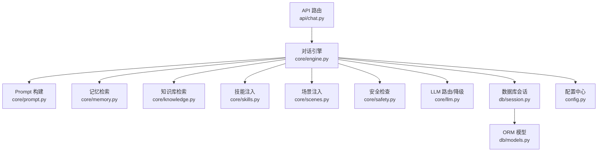
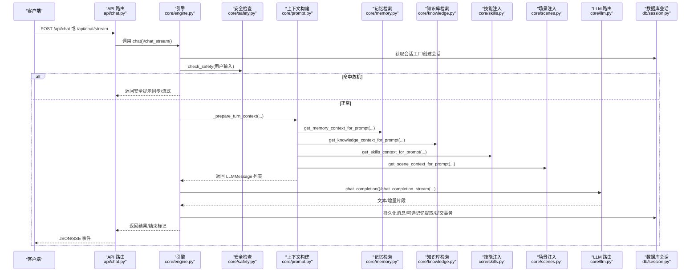
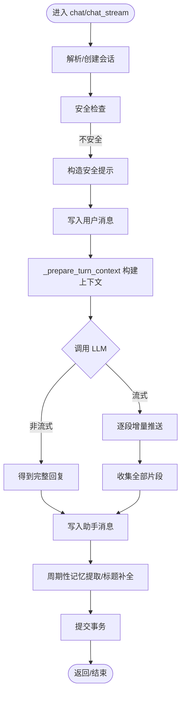
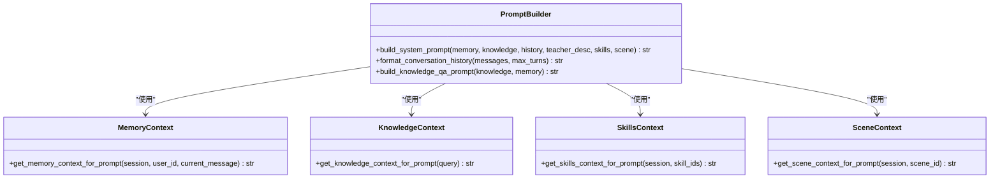
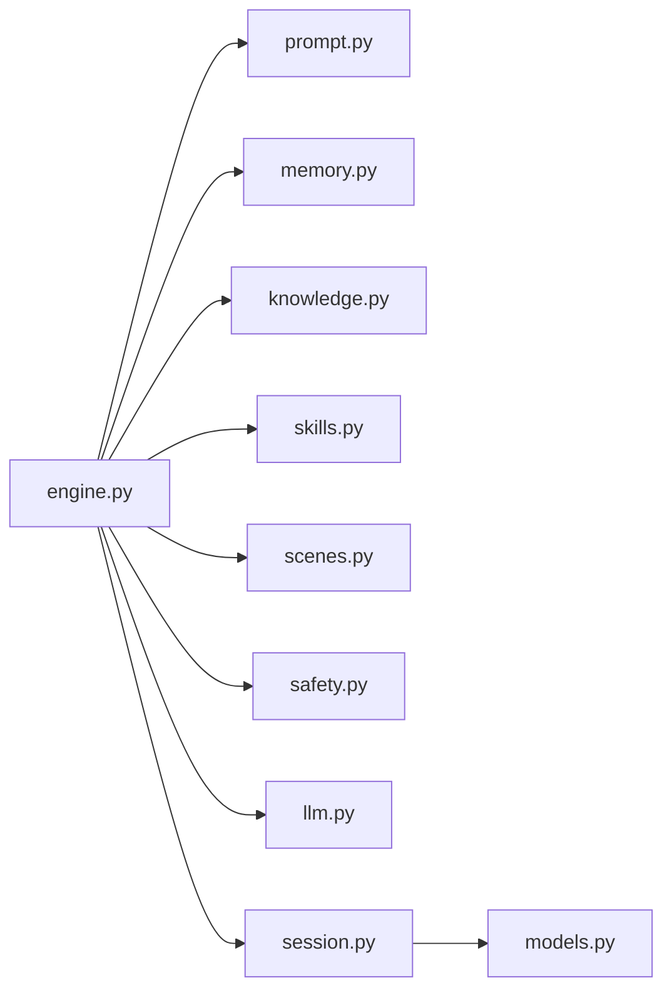

# 对话引擎核心

<cite>
**本文引用的文件**   
- [engine.py](file://hushai/meditation/core/engine.py)
- [chat.py](file://hushai/meditation/api/chat.py)
- [prompt.py](file://hushai/meditation/core/prompt.py)
- [memory.py](file://hushai/meditation/core/memory.py)
- [llm.py](file://hushai/meditation/core/llm.py)
- [knowledge.py](file://hushai/meditation/core/knowledge.py)
- [skills.py](file://hushai/meditation/core/skills.py)
- [scenes.py](file://hushai/meditation/core/scenes.py)
- [safety.py](file://hushai/meditation/core/safety.py)
- [models.py](file://hushai/meditation/db/models.py)
- [session.py](file://hushai/meditation/db/session.py)
- [config.py](file://hushai/meditation/config.py)
</cite>

## 目录
1. [简介](#简介)
2. [项目结构](#项目结构)
3. [核心组件](#核心组件)
4. [架构总览](#架构总览)
5. [详细组件分析](#详细组件分析)
6. [依赖关系分析](#依赖关系分析)
7. [性能考量](#性能考量)
8. [故障排查指南](#故障排查指南)
9. [结论](#结论)
10. [附录：扩展新对话模式示例](#附录扩展新对话模式示例)

## 简介
本文件面向 hush.ai 的“冥想老师”对话引擎，聚焦 Engine 层（编排器）的设计与实现。内容涵盖：
- 对话流程编排、消息处理逻辑与会话状态管理
- chat() 与 chat_stream() 的实现原理及异步流式响应机制
- 对话上下文构建过程（历史消息加载、系统提示词组装、多轮对话状态维护）
- 异常处理策略与事务管理机制
- 如何基于现有能力扩展新的对话模式

## 项目结构
围绕对话引擎的核心代码主要分布在以下模块：
- 编排与入口：core/engine.py、api/chat.py
- 上下文构建：core/prompt.py、core/memory.py、core/knowledge.py、core/skills.py、core/scenes.py
- LLM 路由与降级：core/llm.py
- 安全前置检查：core/safety.py
- 数据模型与会话：db/models.py、db/session.py、config.py

图表来源
- [chat.py:58-104](file://hushai/meditation/api/chat.py#L58-L104)
- [engine.py:166-314](file://hushai/meditation/core/engine.py#L166-L314)
- [prompt.py:77-103](file://hushai/meditation/core/prompt.py#L77-L103)
- [memory.py:161-173](file://hushai/meditation/core/memory.py#L161-L173)
- [knowledge.py:216-224](file://hushai/meditation/core/knowledge.py#L216-L224)
- [skills.py:14-58](file://hushai/meditation/core/skills.py#L14-L58)
- [scenes.py:11-29](file://hushai/meditation/core/scenes.py#L11-L29)
- [safety.py:83-102](file://hushai/meditation/core/safety.py#L83-L102)
- [llm.py:136-179](file://hushai/meditation/core/llm.py#L136-L179)
- [session.py:50-54](file://hushai/meditation/db/session.py#L50-L54)
- [models.py:69-96](file://hushai/meditation/db/models.py#L69-L96)
- [config.py:121-125](file://hushai/meditation/config.py#L121-L125)

章节来源
- [engine.py:1-128](file://hushai/meditation/core/engine.py#L1-L128)
- [chat.py:1-104](file://hushai/meditation/api/chat.py#L1-L104)
- [prompt.py:1-130](file://hushai/meditation/core/prompt.py#L1-L130)
- [memory.py:1-206](file://hushai/meditation/core/memory.py#L1-L206)
- [llm.py:1-258](file://hushai/meditation/core/llm.py#L1-L258)
- [knowledge.py:1-225](file://hushai/meditation/core/knowledge.py#L1-L225)
- [skills.py:1-59](file://hushai/meditation/core/skills.py#L1-L59)
- [scenes.py:1-30](file://hushai/meditation/core/scenes.py#L1-L30)
- [safety.py:1-111](file://hushai/meditation/core/safety.py#L1-L111)
- [models.py:1-434](file://hushai/meditation/db/models.py#L1-L434)
- [session.py:1-83](file://hushai/meditation/db/session.py#L1-L83)
- [config.py:1-136](file://hushai/meditation/config.py#L1-L136)

## 核心组件
- 编排器（Engine）：负责会话生命周期、上下文拼装、安全校验、持久化与 LLM 调用。
- 上下文构建器：组合记忆、知识库、技能、场景、历史与角色设定，生成 system prompt。
- LLM 路由：统一封装 OpenAI 兼容接口，支持多提供商与自动降级。
- 安全前置：关键词规则快速阻断高危输入，返回标准化安全文案。
- 长期记忆：按周期从对话中提取关键信息并入库，供后续检索注入。
- 数据层：SQLAlchemy 异步会话与 ORM 模型，提供会话、消息、记忆等实体。

章节来源
- [engine.py:91-154](file://hushai/meditation/core/engine.py#L91-L154)
- [prompt.py:77-103](file://hushai/meditation/core/prompt.py#L77-L103)
- [llm.py:136-179](file://hushai/meditation/core/llm.py#L136-L179)
- [safety.py:83-102](file://hushai/meditation/core/safety.py#L83-L102)
- [memory.py:45-76](file://hushai/meditation/core/memory.py#L45-L76)
- [models.py:69-117](file://hushai/meditation/db/models.py#L69-L117)

## 架构总览
下图展示了从 HTTP 请求到 LLM 响应的主要交互路径，以及安全、记忆、知识、技能、场景等上下文注入点。

图表来源
- [chat.py:58-104](file://hushai/meditation/api/chat.py#L58-L104)
- [engine.py:166-314](file://hushai/meditation/core/engine.py#L166-L314)
- [safety.py:83-102](file://hushai/meditation/core/safety.py#L83-L102)
- [prompt.py:77-103](file://hushai/meditation/core/prompt.py#L77-L103)
- [memory.py:161-173](file://hushai/meditation/core/memory.py#L161-L173)
- [knowledge.py:216-224](file://hushai/meditation/core/knowledge.py#L216-L224)
- [skills.py:14-58](file://hushai/meditation/core/skills.py#L14-L58)
- [scenes.py:11-29](file://hushai/meditation/core/scenes.py#L11-L29)
- [llm.py:136-179](file://hushai/meditation/core/llm.py#L136-L179)
- [session.py:50-54](file://hushai/meditation/db/session.py#L50-L54)

## 详细组件分析

### 编排器（Engine）设计要点
- 会话生命周期
  - 根据 user_id 与 conversation_id 解析或新建会话记录，确保仅操作活跃会话。
  - 使用异步会话工厂在 try/except 中包裹整个处理流程，保证异常时回滚。
- 安全前置
  - 在调用 LLM 前进行关键词级安全检测；若命中，直接返回安全提示，不将敏感内容外发。
- 上下文构建
  - 通过 _prepare_turn_context 聚合历史、记忆、知识库、技能、场景与教师风格，形成 system prompt 与完整消息序列。
- 持久化与记忆提取
  - 用户与助手消息均落库；每若干条用户消息触发一次记忆提取与标题补全。
- 两种输出模式
  - chat(): 一次性返回最终回复。
  - chat_stream(): 以 SSE 形式逐字/片段推送，并在完成后发送 done 标记。

图表来源
- [engine.py:166-314](file://hushai/meditation/core/engine.py#L166-L314)
- [engine.py:91-154](file://hushai/meditation/core/engine.py#L91-L154)
- [safety.py:83-102](file://hushai/meditation/core/safety.py#L83-L102)

章节来源
- [engine.py:38-154](file://hushai/meditation/core/engine.py#L38-L154)
- [engine.py:166-314](file://hushai/meditation/core/engine.py#L166-L314)

### chat() 方法实现原理
- 步骤概览
  - 获取会话工厂并开启异步会话。
  - 解析/创建会话记录。
  - 执行安全检查；若不安全，直接返回安全提示并落库。
  - 持久化用户消息后，构建上下文并调用 chat_completion。
  - 持久化助手消息，按需触发记忆提取与标题补全，最后提交事务。
- 返回值
  - 包含 reply、conversation_id、memory_updated 等字段。

章节来源
- [engine.py:166-236](file://hushai/meditation/core/engine.py#L166-L236)

### chat_stream() 方法实现原理
- 步骤概览
  - 与 chat() 相同的前置流程（会话、安全、持久化用户消息、上下文构建）。
  - 调用 chat_completion_stream，逐块推送 delta，同时累积为完整回复。
  - 完成后持久化助手消息、触发记忆提取、提交事务，并发送 done 标记。
- 异常与回滚
  - 使用 committed 标志位与 finally 分支确保未提交时回滚。

章节来源
- [engine.py:238-314](file://hushai/meditation/core/engine.py#L238-L314)

### 对话上下文构建过程
- 历史消息加载
  - 依据会话 ID 查询最近消息，支持最大轮数限制。
- 系统提示词组装
  - 合并角色设定、场景指引、技能加持、教师个性化风格、知识库参考、记忆摘要、历史对话与安全边界。
- 多轮状态维护
  - 每次调用都会重新加载历史，结合当前消息与外部上下文，形成完整的 LLM 消息序列。

图表来源
- [prompt.py:77-103](file://hushai/meditation/core/prompt.py#L77-L103)
- [memory.py:161-173](file://hushai/meditation/core/memory.py#L161-L173)
- [knowledge.py:216-224](file://hushai/meditation/core/knowledge.py#L216-L224)
- [skills.py:14-58](file://hushai/meditation/core/skills.py#L14-L58)
- [scenes.py:11-29](file://hushai/meditation/core/scenes.py#L11-L29)

章节来源
- [engine.py:91-127](file://hushai/meditation/core/engine.py#L91-L127)
- [prompt.py:77-103](file://hushai/meditation/core/prompt.py#L77-L103)

### LLM 路由与降级
- 多提供商支持
  - 默认顺序 deepseek → zhipu → kimi → openai，主 provider 优先。
- 自动降级
  - 非流式：逐个尝试，失败则继续下一个；全部失败或无 key 时走 mock。
  - 流式：逐个尝试，失败则继续下一个；全部失败或无 key 时走 mock。
- 调试模式
  - 当 debug 且无 API Key 时，返回模拟回复，便于本地联调。

章节来源
- [llm.py:136-179](file://hushai/meditation/core/llm.py#L136-L179)
- [llm.py:208-258](file://hushai/meditation/core/llm.py#L208-L258)

### 安全前置检查
- 规则分级
  - crisis：自伤/轻生倾向，建议专业帮助。
  - emergency：伤害他人/报复社会，立即紧急求助。
- 行为
  - 命中即阻断，返回标准化安全文案；不将敏感内容发送至外部模型。

章节来源
- [safety.py:83-102](file://hushai/meditation/core/safety.py#L83-L102)

### 长期记忆机制
- 提取时机
  - 每 N 条用户消息触发一次（默认 2），避免频繁调用 LLM。
- 提取内容
  - 类别包括冥想经历、情绪模式、个人偏好、目标进展、重要事件、健康提醒、生活背景等。
- 存储与检索
  - 结构化入库并生成向量嵌入；检索时按相似度取 top-k，再拼接为提示上下文。

章节来源
- [engine.py:130-154](file://hushai/meditation/core/engine.py#L130-L154)
- [memory.py:45-76](file://hushai/meditation/core/memory.py#L45-L76)
- [memory.py:79-112](file://hushai/meditation/core/memory.py#L79-L112)
- [memory.py:115-138](file://hushai/meditation/core/memory.py#L115-L138)
- [memory.py:161-173](file://hushai/meditation/core/memory.py#L161-L173)

### 知识库 RAG
- 导入与分块
  - Markdown 转纯文本、frontmatter 解析、段落切分与重叠。
- 检索与注入
  - 按 query 检索 top-k 片段，拼接为“相关理论参考”注入系统提示。

章节来源
- [knowledge.py:76-104](file://hushai/meditation/core/knowledge.py#L76-L104)
- [knowledge.py:137-171](file://hushai/meditation/core/knowledge.py#L137-L171)
- [knowledge.py:207-224](file://hushai/meditation/core/knowledge.py#L207-L224)

### 技能与场景注入
- 技能
  - 支持指定 skill_ids 或启用所有技能，限制单次注入数量，按排序与名称排序。
- 场景
  - 根据 scene_id 加载系统提示与开场白参考，增强特定应用情境下的引导策略。

章节来源
- [skills.py:14-58](file://hushai/meditation/core/skills.py#L14-L58)
- [scenes.py:11-29](file://hushai/meditation/core/scenes.py#L11-L29)

### 数据模型与会话管理
- 核心实体
  - Conversation、Message、Memory、Skill、Scene、KnowledgeChunk 等。
- 会话工厂
  - 基于 SQLAlchemy 异步引擎与 sessionmaker，支持 SQLite/PostgreSQL，统一 expire_on_commit=False。

章节来源
- [models.py:69-117](file://hushai/meditation/db/models.py#L69-L117)
- [session.py:34-54](file://hushai/meditation/db/session.py#L34-L54)

## 依赖关系分析
- 低耦合高内聚
  - Engine 作为编排器，仅依赖各上下文提供者与 LLM 路由，职责清晰。
- 外部依赖
  - OpenAI 兼容 SDK、SQLAlchemy 异步驱动、Chroma 向量库（通过 db.vector 抽象）。
- 潜在循环依赖
  - 当前未见循环引用；上下文模块相互独立，由 Engine 协调。

图表来源
- [engine.py:1-31](file://hushai/meditation/core/engine.py#L1-L31)
- [session.py:1-33](file://hushai/meditation/db/session.py#L1-L33)
- [models.py:1-27](file://hushai/meditation/db/models.py#L1-L27)

章节来源
- [engine.py:1-31](file://hushai/meditation/core/engine.py#L1-L31)
- [session.py:1-33](file://hushai/meditation/db/session.py#L1-L33)

## 性能考量
- 流式响应
  - chat_stream 采用增量推送，降低首字节延迟，提升用户体验。
- 上下文裁剪
  - 历史消息最多保留一定轮数，控制 prompt 长度与成本。
- 记忆提取节流
  - 按固定间隔触发，避免高频 LLM 调用。
- 向量检索
  - 通过 top-k 控制检索规模，减少无关噪声。
- 连接池与超时
  - 数据库连接池大小与 LLM 超时时间可按环境调整。

[本节为通用指导，无需具体文件引用]

## 故障排查指南
- 常见错误
  - LLM 提供商未配置 API Key：会抛出运行时错误或在调试模式下走 mock。
  - 外部服务异常：LLM 路由会自动降级至下一提供商；若全部失败，可能抛错或走 mock。
  - 数据库不可用：会话工厂初始化失败或查询异常，需检查 URL 与驱动。
- 定位建议
  - 查看日志中的 provider 失败与降级记录。
  - 确认 .env 环境变量是否生效（config.py 会从 .env 加载）。
  - 检查数据库 URL 与驱动后缀是否正确（sqlite+aiosqlite/postgresql+asyncpg）。

章节来源
- [llm.py:59-80](file://hushai/meditation/core/llm.py#L59-L80)
- [llm.py:136-179](file://hushai/meditation/core/llm.py#L136-L179)
- [session.py:15-31](file://hushai/meditation/db/session.py#L15-L31)
- [config.py:121-125](file://hushai/meditation/config.py#L121-L125)

## 结论
Engine 层以清晰的编排职责整合了安全、上下文、记忆、知识与技能等多维能力，并通过 LLM 路由实现多提供商与自动降级。chat() 与 chat_stream() 分别满足批量与实时体验需求。整体设计具备良好的可扩展性与可维护性，适合持续迭代新的对话模式与业务特性。

[本节为总结，无需具体文件引用]

## 附录：扩展新对话模式示例
以下给出一个基于现有能力的“知识问答模式”扩展思路（以 knowledge_qa 为例），展示如何在 Engine 中新增一种对话模式：

- 新增入口函数
  - 在 engine.py 中新增类似 knowledge_qa 的方法，定义参数、会话解析、上下文构建与 LLM 调用。
- 上下文构建
  - 复用 get_knowledge_context_for_prompt 与 get_memory_context_for_prompt，按需加入其他上下文（如技能、场景）。
- 持久化与事务
  - 遵循现有模式：先写用户消息，再写助手消息，最后 commit；异常时 rollback。
- API 暴露
  - 在 api/chat.py 中新增路由，绑定到新的 Engine 方法，并设置限流与认证。
- 测试与回归
  - 编写单元测试覆盖安全拦截、上下文注入、LLM 降级与持久化一致性。

章节来源
- [engine.py:316-387](file://hushai/meditation/core/engine.py#L316-L387)
- [chat.py:107-127](file://hushai/meditation/api/chat.py#L107-L127)
- [knowledge.py:207-224](file://hushai/meditation/core/knowledge.py#L207-L224)
- [memory.py:161-173](file://hushai/meditation/core/memory.py#L161-L173)