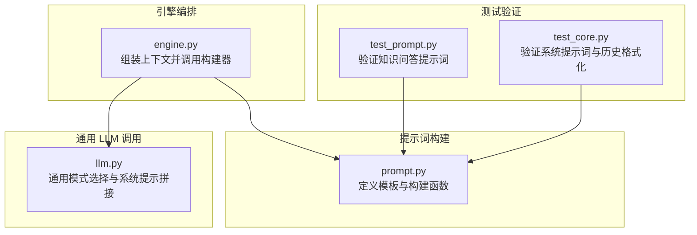
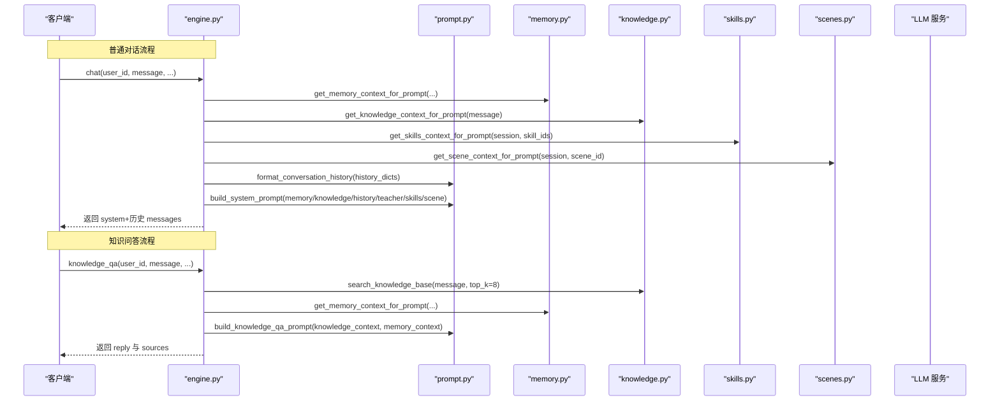
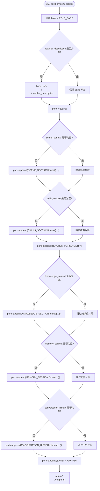
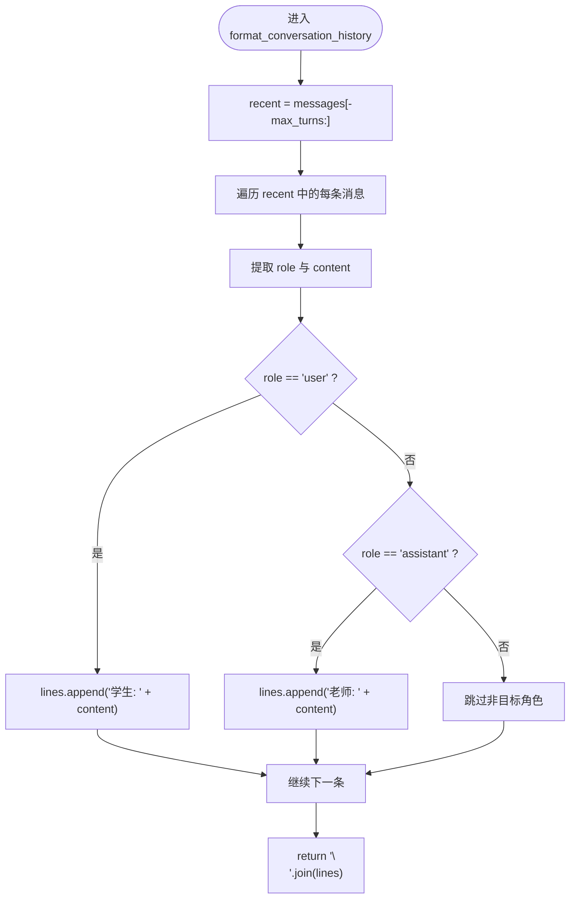
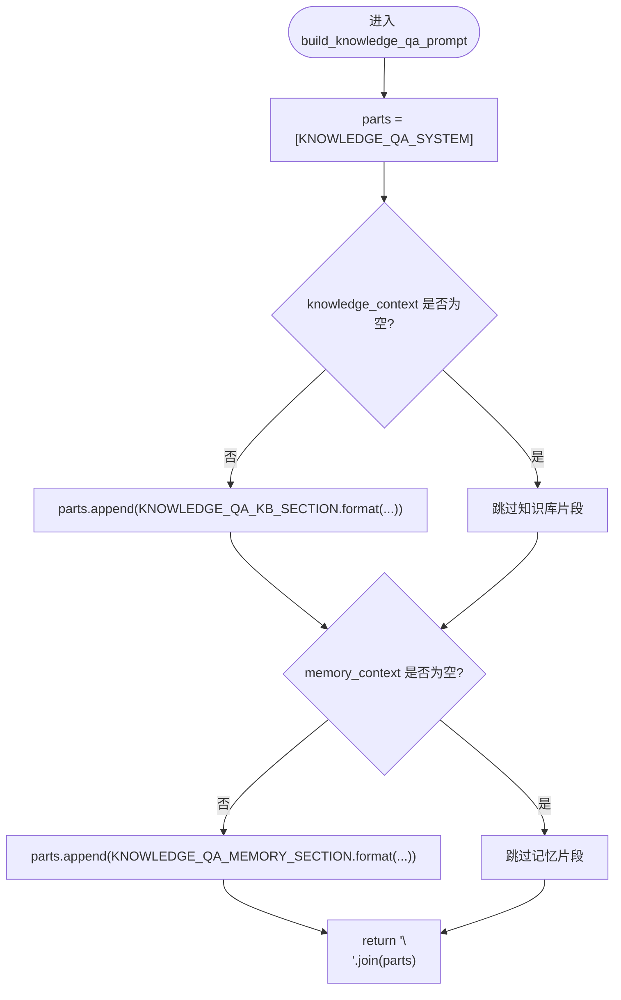
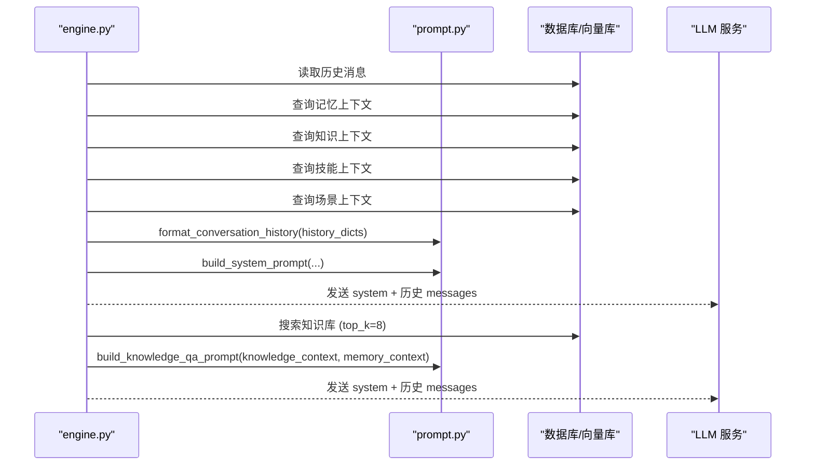
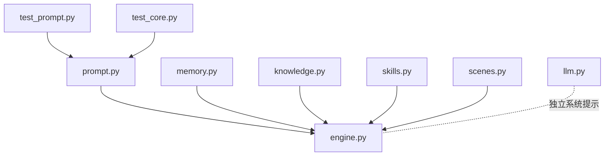

# 提示词构建器

<cite>
**本文引用的文件**
- [hushai/meditation/core/prompt.py](file://hushai/meditation/core/prompt.py)
- [hushai/meditation/core/engine.py](file://hushai/meditation/core/engine.py)
- [tests/meditation/test_prompt.py](file://tests/meditation/test_prompt.py)
- [tests/meditation/test_core.py](file://tests/meditation/test_core.py)
- [hushai/llm.py](file://hushai/llm.py)
</cite>

## 目录
1. [简介](#简介)
2. [项目结构](#项目结构)
3. [核心组件](#核心组件)
4. [架构总览](#架构总览)
5. [详细组件分析](#详细组件分析)
6. [依赖关系分析](#依赖关系分析)
7. [性能与扩展性考虑](#性能与扩展性考虑)
8. [故障排查指南](#故障排查指南)
9. [结论](#结论)
10. [附录：扩展新提示词类型示例](#附录扩展新提示词类型示例)

## 简介
本文件面向 hush.ai 的“冥想老师”模块，聚焦于提示词构建器的设计与实现。该构建器负责在不同场景（普通对话、知识问答、技能调用）下动态组装系统提示词，整合记忆上下文、知识库片段、会话历史、技能指引与场景信息，并内置安全边界策略。文档将深入解析以下核心方法：
- build_system_prompt()：用于普通对话的系统提示词构建
- build_knowledge_qa_prompt()：用于知识问答的系统提示词构建
- format_conversation_history()：将消息列表格式化为人类可读的历史文本

同时说明变量替换机制、模板组织方式以及如何在现有框架上扩展新的提示词类型。

## 项目结构
与提示词构建相关的代码主要位于 meditation 子模块中，由引擎层统一编排上下文并调用构建器生成最终系统提示词。

图表来源
- [hushai/meditation/core/prompt.py:1-130](file://hushai/meditation/core/prompt.py#L1-L130)
- [hushai/meditation/core/engine.py:91-127](file://hushai/meditation/core/engine.py#L91-L127)
- [tests/meditation/test_prompt.py:1-54](file://tests/meditation/test_prompt.py#L1-L54)
- [tests/meditation/test_core.py:25-114](file://tests/meditation/test_core.py#L25-L114)
- [hushai/llm.py:72-78](file://hushai/llm.py#L72-L78)

章节来源
- [hushai/meditation/core/prompt.py:1-130](file://hushai/meditation/core/prompt.py#L1-L130)
- [hushai/meditation/core/engine.py:91-127](file://hushai/meditation/core/engine.py#L91-L127)
- [tests/meditation/test_prompt.py:1-54](file://tests/meditation/test_prompt.py#L1-L54)
- [tests/meditation/test_core.py:25-114](file://tests/meditation/test_core.py#L25-L114)
- [hushai/llm.py:72-78](file://hushai/llm.py#L72-L78)

## 核心组件
- 模板常量与角色基线
  - ROLE_BASE：定义“小观”作为资深冥想引导师的角色定位、能力与行为准则。
  - SAFETY_GUARD：安全边界提示，包含危机信号识别与温和转介话术。
  - MEMORY_SECTION、KNOWLEDGE_SECTION、CONVERSATION_HISTORY、SKILLS_SECTION、SCENE_SECTION：各上下文片段的占位模板。
  - TEACHER_PERSONALITY：个性化风格指导，根据用户经验与情绪调整语气与深度。
  - KNOWLEDGE_QA_SYSTEM、KNOWLEDGE_QA_KB_SECTION、KNOWLEDGE_QA_MEMORY_SECTION：知识问答专用的系统提示与片段模板。

- 构建函数
  - build_system_prompt()：按参数选择性拼接各片段，形成完整系统提示词。
  - format_conversation_history()：将消息列表转换为“学生/老师”可读历史，支持最大轮次限制。
  - build_knowledge_qa_prompt()：为知识问答场景构建系统提示，可附加知识库与记忆片段。

- 使用入口
  - engine._prepare_turn_context()：在普通对话流程中组装 system + 历史消息，调用 build_system_prompt()。
  - engine.knowledge_qa()：在知识问答流程中检索知识库片段，调用 build_knowledge_qa_prompt()。

章节来源
- [hushai/meditation/core/prompt.py:7-74](file://hushai/meditation/core/prompt.py#L7-L74)
- [hushai/meditation/core/prompt.py:77-103](file://hushai/meditation/core/prompt.py#L77-L103)
- [hushai/meditation/core/prompt.py:106-116](file://hushai/meditation/core/prompt.py#L106-L116)
- [hushai/meditation/core/prompt.py:119-129](file://hushai/meditation/core/prompt.py#L119-L129)
- [hushai/meditation/core/engine.py:91-127](file://hushai/meditation/core/engine.py#L91-L127)
- [hushai/meditation/core/engine.py:316-387](file://hushai/meditation/core/engine.py#L316-L387)

## 架构总览
下图展示了普通对话与知识问答两条路径如何组合上下文并生成系统提示词。

图表来源
- [hushai/meditation/core/engine.py:91-127](file://hushai/meditation/core/engine.py#L91-L127)
- [hushai/meditation/core/engine.py:316-387](file://hushai/meditation/core/engine.py#L316-L387)
- [hushai/meditation/core/prompt.py:77-103](file://hushai/meditation/core/prompt.py#L77-L103)
- [hushai/meditation/core/prompt.py:119-129](file://hushai/meditation/core/prompt.py#L119-L129)

## 详细组件分析

### 系统提示词构建：build_system_prompt()
- 功能概述
  - 以 ROLE_BASE 为基础，可选追加 teacher_description 以覆盖或增强角色设定。
  - 按顺序选择性插入场景、技能、个性化风格、知识库、记忆、对话历史等片段。
  - 始终附加 SAFETY_GUARD 安全边界提示。
- 参数说明
  - memory_context: 关于用户的记忆摘要，用于个性化回应。
  - knowledge_context: 相关理论参考内容，来自知识库检索。
  - conversation_history: 最近对话历史文本，由 format_conversation_history() 生成。
  - teacher_description: 教师描述或从数据库解析的教师 system_prompt。
  - skills_context: 当前加持的技能指引，如特定引导技巧或风格要求。
  - scene_context: 当前场景指引，如“睡前放松”、“焦虑安抚”等。
- 输出结构
  - 多段文本通过换行拼接，每段对应一个上下文片段；空字符串将被忽略，不插入空白段落。
- 复杂度与性能
  - 时间复杂度 O(n)，n 为片段数量（固定且较小）。
  - 空间复杂度 O(m)，m 为最终拼接后的字符串长度。
- 错误处理
  - 对空字符串进行条件判断，避免多余换行或空段落。
  - 若 teacher_description 为空则不追加，保持基础角色不变。

图表来源
- [hushai/meditation/core/prompt.py:77-103](file://hushai/meditation/core/prompt.py#L77-L103)

章节来源
- [hushai/meditation/core/prompt.py:77-103](file://hushai/meditation/core/prompt.py#L77-L103)
- [tests/meditation/test_core.py:25-93](file://tests/meditation/test_core.py#L25-L93)

### 对话历史格式化：format_conversation_history()
- 功能概述
  - 将消息列表转换为“学生/老师”可读文本，仅保留最近的 max_turns 条记录。
  - 自动映射 role=user 到“学生”，role=assistant 到“老师”。
- 参数说明
  - messages: 消息字典列表，每个元素包含 role 与 content。
  - max_turns: 最大保留轮次，默认 20。
- 输出结构
  - 每行一条消息，格式为“角色: 内容”，按时间顺序排列。
- 复杂度与性能
  - 时间复杂度 O(min(n, max_turns))，n 为输入消息数。
  - 空间复杂度 O(k)，k 为输出行数。
- 错误处理
  - 对缺失字段提供默认值（role 默认为 user，content 默认为空串）。

图表来源
- [hushai/meditation/core/prompt.py:106-116](file://hushai/meditation/core/prompt.py#L106-L116)

章节来源
- [hushai/meditation/core/prompt.py:106-116](file://hushai/meditation/core/prompt.py#L106-L116)
- [tests/meditation/test_core.py:95-114](file://tests/meditation/test_core.py#L95-L114)

### 知识问答提示词构建：build_knowledge_qa_prompt()
- 功能概述
  - 基于 KNOWLEDGE_QA_SYSTEM 构建知识问答专用系统提示。
  - 可选择附加知识库参考片段与用户记忆片段。
- 参数说明
  - knowledge_context: 知识库检索结果拼接文本。
  - memory_context: 用户记忆摘要。
- 输出结构
  - 至少包含系统提示；当存在上下文时，追加相应片段。
- 复杂度与性能
  - 时间复杂度 O(1)（片段数量固定），空间复杂度取决于上下文长度。
- 错误处理
  - 空字符串视为不存在，不会插入空白段落。

图表来源
- [hushai/meditation/core/prompt.py:119-129](file://hushai/meditation/core/prompt.py#L119-L129)

章节来源
- [hushai/meditation/core/prompt.py:119-129](file://hushai/meditation/core/prompt.py#L119-L129)
- [tests/meditation/test_prompt.py:1-54](file://tests/meditation/test_prompt.py#L1-L54)

### 引擎集成点：_prepare_turn_context() 与 knowledge_qa()
- _prepare_turn_context()
  - 加载历史消息、获取记忆/知识/技能/场景上下文。
  - 调用 format_conversation_history() 生成历史文本。
  - 调用 build_system_prompt() 生成系统提示，并组装 system + 历史 messages。
- knowledge_qa()
  - 检索知识库片段，构造 knowledge_context。
  - 获取 memory_context。
  - 调用 build_knowledge_qa_prompt() 生成系统提示，并组装 system + 历史 messages。

图表来源
- [hushai/meditation/core/engine.py:91-127](file://hushai/meditation/core/engine.py#L91-L127)
- [hushai/meditation/core/engine.py:316-387](file://hushai/meditation/core/engine.py#L316-L387)
- [hushai/meditation/core/prompt.py:77-103](file://hushai/meditation/core/prompt.py#L77-L103)
- [hushai/meditation/core/prompt.py:119-129](file://hushai/meditation/core/prompt.py#L119-L129)

章节来源
- [hushai/meditation/core/engine.py:91-127](file://hushai/meditation/core/engine.py#L91-L127)
- [hushai/meditation/core/engine.py:316-387](file://hushai/meditation/core/engine.py#L316-L387)

## 依赖关系分析
- 模块内依赖
  - prompt.py 无外部依赖，仅定义模板与构建函数。
  - engine.py 依赖 prompt.py、memory.py、knowledge.py、skills.py、scenes.py 等上下文提供者。
- 测试依赖
  - test_prompt.py 直接断言 build_knowledge_qa_prompt() 的输出结构与片段模板。
  - test_core.py 断言 build_system_prompt() 的各片段拼接与安全边界。
- 通用 LLM 调用
  - llm.py 提供另一套系统提示构建逻辑（基于模式选择），与 meditation 模块的构建器并行存在，适用于不同业务场景。

图表来源
- [hushai/meditation/core/prompt.py:1-130](file://hushai/meditation/core/prompt.py#L1-L130)
- [hushai/meditation/core/engine.py:1-30](file://hushai/meditation/core/engine.py#L1-L30)
- [tests/meditation/test_prompt.py:1-54](file://tests/meditation/test_prompt.py#L1-L54)
- [tests/meditation/test_core.py:1-30](file://tests/meditation/test_core.py#L1-L30)
- [hushai/llm.py:72-78](file://hushai/llm.py#L72-L78)

章节来源
- [hushai/meditation/core/prompt.py:1-130](file://hushai/meditation/core/prompt.py#L1-L130)
- [hushai/meditation/core/engine.py:1-30](file://hushai/meditation/core/engine.py#L1-L30)
- [tests/meditation/test_prompt.py:1-54](file://tests/meditation/test_prompt.py#L1-L54)
- [tests/meditation/test_core.py:1-30](file://tests/meditation/test_core.py#L1-L30)
- [hushai/llm.py:72-78](file://hushai/llm.py#L72-L78)

## 性能与扩展性考虑
- 性能
  - 构建器采用字符串拼接与条件判断，开销极低；主要成本在于上下文检索（记忆、知识、技能、场景）。
  - 对话历史格式化支持 max_turns 限制，避免过长历史导致提示词膨胀。
- 扩展性
  - 新增上下文片段：在 prompt.py 中添加新模板常量，并在 build_system_prompt() 中增加条件分支。
  - 新增提示词类型：参照 build_knowledge_qa_prompt() 的模式，定义专用系统提示与片段模板，并在引擎中新增对应入口。
  - 变量替换机制：使用 Python 字符串 format() 进行占位符替换，确保键名一致即可。

[本节为通用建议，无需具体文件引用]

## 故障排查指南
- 常见问题
  - 片段未生效：检查传入的上下文是否为空字符串；空字符串会被忽略。
  - 历史未显示：确认 format_conversation_history() 的输入消息列表是否包含有效的 role 与 content。
  - 安全边界未触发：SAFETY_GUARD 始终附加，但实际响应需结合下游安全检测逻辑。
- 调试建议
  - 打印中间变量：在 _prepare_turn_context() 中打印各上下文片段，确认是否正确装配。
  - 单元测试：参考 test_core.py 与 test_prompt.py 的断言方式，快速验证构建器行为。

章节来源
- [tests/meditation/test_core.py:25-114](file://tests/meditation/test_core.py#L25-L114)
- [tests/meditation/test_prompt.py:1-54](file://tests/meditation/test_prompt.py#L1-L54)

## 结论
提示词构建器通过模块化模板与条件拼接，实现了灵活、可扩展的系统提示词生成机制。其设计清晰分离了角色基线、安全边界与各上下文片段，便于在不同场景下按需装配。配合引擎层的上下文聚合，能够支撑普通对话、知识问答与技能调用等多种业务需求。

[本节为总结性内容，无需具体文件引用]

## 附录：扩展新提示词类型示例
- 步骤一：定义新模板常量
  - 在 prompt.py 中新增类似 KNOWLEDGE_QA_SYSTEM 的新系统提示常量，以及对应的片段模板。
- 步骤二：实现新构建函数
  - 参照 build_knowledge_qa_prompt()，创建新函数（例如 build_skill_assist_prompt()），接受必要参数并按需拼接片段。
- 步骤三：在引擎中集成
  - 在 engine.py 中新增对应入口（例如 skill_assist()），检索所需上下文并调用新构建函数。
- 步骤四：编写测试
  - 参考 test_prompt.py 与 test_core.py，为新构建函数添加断言，确保片段正确插入与空值处理。

章节来源
- [hushai/meditation/core/prompt.py:119-129](file://hushai/meditation/core/prompt.py#L119-L129)
- [tests/meditation/test_prompt.py:1-54](file://tests/meditation/test_prompt.py#L1-L54)
- [tests/meditation/test_core.py:25-114](file://tests/meditation/test_core.py#L25-L114)