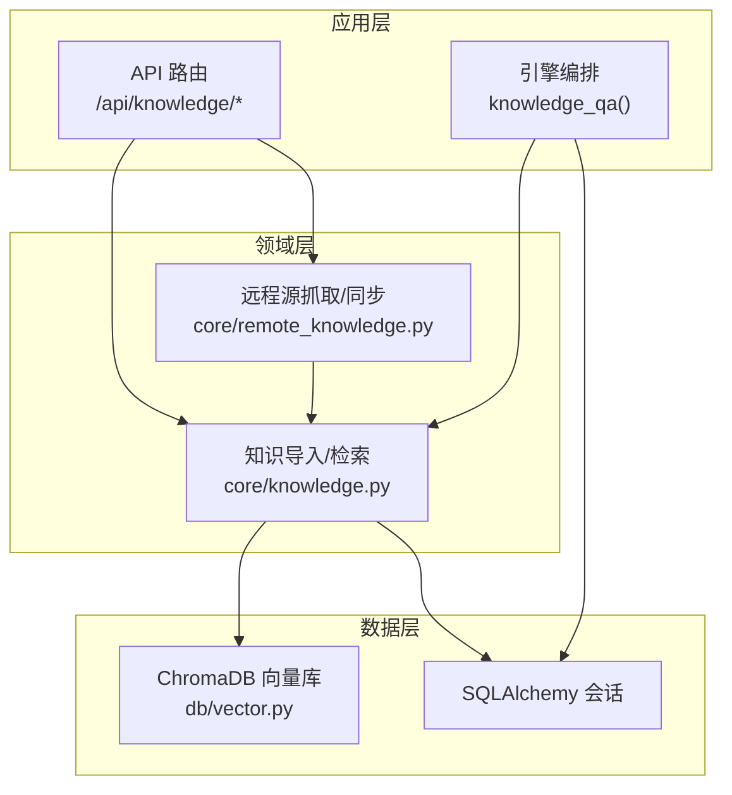
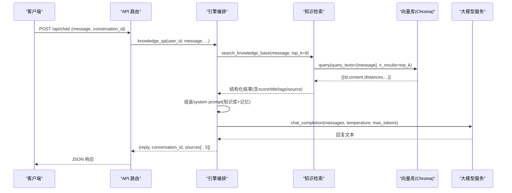
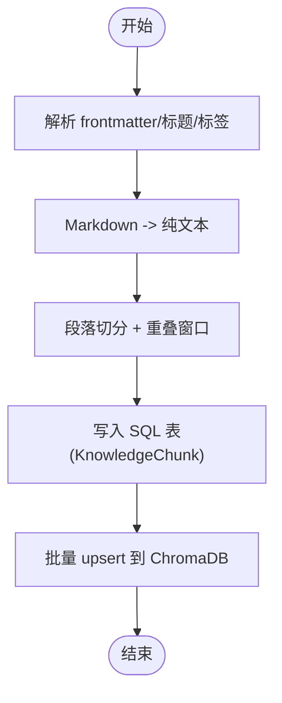
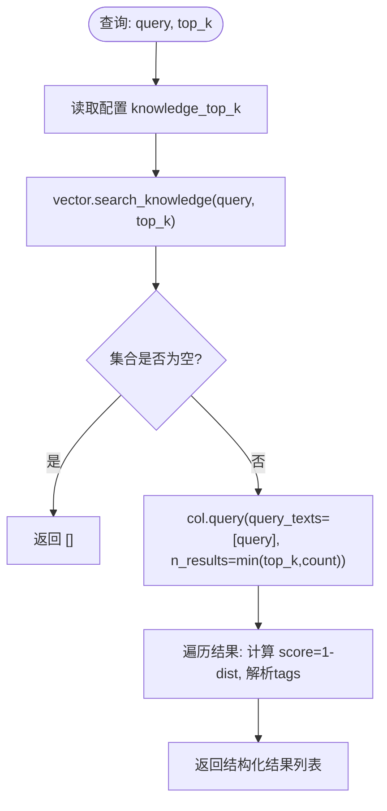
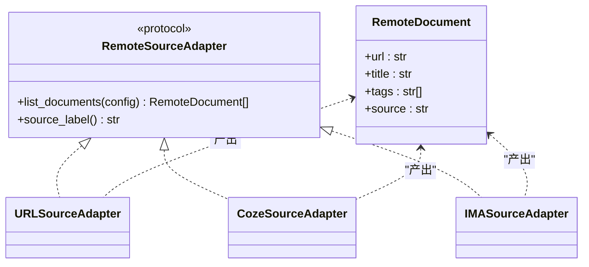
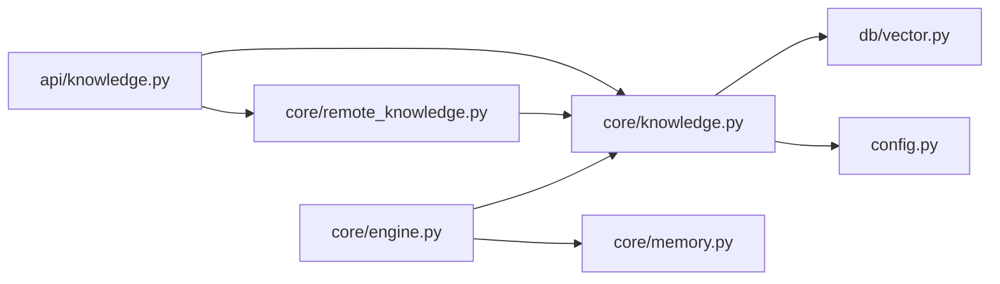

# 知识检索器

<cite>
**本文引用的文件**   
- [hushai/meditation/core/knowledge.py](file://hushai/meditation/core/knowledge.py)
- [hushai/meditation/db/vector.py](file://hushai/meditation/db/vector.py)
- [hushai/meditation/core/remote_knowledge.py](file://hushai/meditation/core/remote_knowledge.py)
- [hushai/meditation/api/knowledge.py](file://hushai/meditation/api/knowledge.py)
- [hushai/meditation/core/engine.py](file://hushai/meditation/core/engine.py)
- [hushai/meditation/config.py](file://hushai/meditation/config.py)
- [tests/meditation/test_vector.py](file://tests/meditation/test_vector.py)
- [tests/meditation/test_engine.py](file://tests/meditation/test_engine.py)
</cite>

## 目录
1. [简介](#简介)
2. [项目结构](#项目结构)
3. [核心组件](#核心组件)
4. [架构总览](#架构总览)
5. [详细组件分析](#详细组件分析)
6. [依赖关系分析](#依赖关系分析)
7. [性能与优化](#性能与优化)
8. [故障排查指南](#故障排查指南)
9. [结论](#结论)
10. [附录：使用示例与扩展指南](#附录使用示例与扩展指南)

## 简介
本文件面向 hush.ai 的知识检索子系统，聚焦 RAG（检索增强生成）在“理论体系知识库”中的实现。文档围绕以下目标展开：
- 解释知识库的索引构建、语义搜索算法、结果排序策略
- 深入说明 search_knowledge_base()、get_knowledge_context_for_prompt() 等核心方法的工作流程
- 阐述本地知识库与远程知识库的集成方式、缓存机制与故障转移策略
- 解析向量数据库查询优化、相关性评分算法、结果过滤机制
- 提供添加新数据源、更新与同步策略的实践指导

注意：仓库中未出现名为 KnowledgeRetriever 的类；RAG 检索能力由 knowledge.py、vector.py、remote_knowledge.py 与 engine.py 协同实现。

## 项目结构
知识检索相关代码主要分布在如下模块：
- 领域逻辑层：hushai/meditation/core/knowledge.py（导入、分块、检索、上下文组装）
- 向量存储层：hushai/meditation/db/vector.py（ChromaDB 客户端、集合管理、嵌入函数、检索接口）
- 远程源适配层：hushai/meditation/core/remote_knowledge.py（URL/Coze/IMA 适配器与抓取入库）
- API 路由层：hushai/meditation/api/knowledge.py（导入、搜索、批量导入、远程同步）
- 编排层：hushai/meditation/core/engine.py（对话问答流程，整合知识库与记忆）
- 配置中心：hushai/meditation/config.py（嵌入模型、top_k、持久化路径等）

图表来源
- [hushai/meditation/api/knowledge.py:1-310](file://hushai/meditation/api/knowledge.py#L1-L310)
- [hushai/meditation/core/knowledge.py:1-225](file://hushai/meditation/core/knowledge.py#L1-L225)
- [hushai/meditation/core/remote_knowledge.py:1-389](file://hushai/meditation/core/remote_knowledge.py#L1-L389)
- [hushai/meditation/db/vector.py:1-179](file://hushai/meditation/db/vector.py#L1-L179)
- [hushai/meditation/core/engine.py:316-387](file://hushai/meditation/core/engine.py#L316-L387)

章节来源
- [hushai/meditation/api/knowledge.py:1-310](file://hushai/meditation/api/knowledge.py#L1-L310)
- [hushai/meditation/core/knowledge.py:1-225](file://hushai/meditation/core/knowledge.py#L1-L225)
- [hushai/meditation/core/remote_knowledge.py:1-389](file://hushai/meditation/core/remote_knowledge.py#L1-L389)
- [hushai/meditation/db/vector.py:1-179](file://hushai/meditation/db/vector.py#L1-L179)
- [hushai/meditation/core/engine.py:316-387](file://hushai/meditation/core/engine.py#L316-L387)

## 核心组件
- 知识导入与分块
  - prepare_import_content：对 Markdown 进行 frontmatter 解析、标题提取、标签合并与纯文本清洗
  - _split_text_to_chunks：按段落切分并控制 chunk_size 与 overlap，保证语义连贯
  - import_text/import_structured：将内容写入 SQLAlchemy 并批量 upsert 到 ChromaDB
- 语义检索
  - search_knowledge_base：读取 top_k 配置，调用 vector.search_knowledge
  - get_knowledge_context_for_prompt：将检索结果拼接为提示词片段
- 向量数据库
  - knowledge_collection：创建或获取“knowledge”集合，设置 HNSW cosine 空间
  - add_knowledge_chunks：批量 upsert，元数据包含 title/tags/source/parent_id
  - search_knowledge：执行相似度查询，返回带 score 的结果
- 远程知识源
  - URLSourceAdapter/CozeSourceAdapter/IMASourceAdapter：统一 list_documents 协议
  - fetch_and_import_urls/fetch_from_remote_source/sync_all_remote_sources：并发抓取、解析、入库
- 编排与提示词
  - engine.knowledge_qa：检索知识库与用户记忆，拼装 system prompt，调用 LLM 生成回答
  - prompt.build_knowledge_qa_prompt：根据知识库与记忆上下文构造系统提示

章节来源
- [hushai/meditation/core/knowledge.py:76-134](file://hushai/meditation/core/knowledge.py#L76-L134)
- [hushai/meditation/core/knowledge.py:137-224](file://hushai/meditation/core/knowledge.py#L137-L224)
- [hushai/meditation/db/vector.py:61-127](file://hushai/meditation/db/vector.py#L61-L127)
- [hushai/meditation/core/remote_knowledge.py:45-183](file://hushai/meditation/core/remote_knowledge.py#L45-L183)
- [hushai/meditation/core/remote_knowledge.py:250-389](file://hushai/meditation/core/remote_knowledge.py#L250-L389)
- [hushai/meditation/core/engine.py:316-387](file://hushai/meditation/core/engine.py#L316-L387)

## 架构总览
下图展示一次“知识问答”的端到端流程：从 API 进入，引擎编排检索知识库与记忆，组合提示词后调用 LLM，最终返回回复与来源。

图表来源
- [hushai/meditation/api/knowledge.py:1-310](file://hushai/meditation/api/knowledge.py#L1-L310)
- [hushai/meditation/core/engine.py:316-387](file://hushai/meditation/core/engine.py#L316-L387)
- [hushai/meditation/core/knowledge.py:207-224](file://hushai/meditation/core/knowledge.py#L207-L224)
- [hushai/meditation/db/vector.py:104-127](file://hushai/meditation/db/vector.py#L104-L127)

## 详细组件分析

### 知识导入与分块（索引构建）
- 预处理与清洗
  - prepare_import_content：支持 Markdown frontmatter 解析、自动标题推断、标签合并与去重，并将 Markdown 转为纯文本以匹配嵌入模型输入
- 分块策略
  - _split_text_to_chunks：基于双换行段落切分，超长段落直接截断，相邻块保留 overlap 以保证上下文连续性
- 入库流程
  - import_text：逐段创建 KnowledgeChunk 记录，flush 后收集 id 与 content，批量 upsert 到 ChromaDB
  - import_structured：递归处理 children，维护 parent_id 层级关系

图表来源
- [hushai/meditation/core/knowledge.py:76-134](file://hushai/meditation/core/knowledge.py#L76-L134)
- [hushai/meditation/core/knowledge.py:137-171](file://hushai/meditation/core/knowledge.py#L137-L171)
- [hushai/meditation/db/vector.py:81-101](file://hushai/meditation/db/vector.py#L81-L101)

章节来源
- [hushai/meditation/core/knowledge.py:76-134](file://hushai/meditation/core/knowledge.py#L76-L134)
- [hushai/meditation/core/knowledge.py:137-171](file://hushai/meditation/core/knowledge.py#L137-L171)
- [hushai/meditation/db/vector.py:81-101](file://hushai/meditation/db/vector.py#L81-L101)

### 语义搜索与结果排序
- 查询入口
  - search_knowledge_base：读取配置 knowledge_top_k，委托 vector.search_knowledge
- 向量检索
  - knowledge_collection：使用 HNSW + cosine 距离
  - search_knowledge：若集合为空则快速返回空列表；否则执行 query，将 distances 转换为 score = 1.0 - dist
- 结果过滤与格式化
  - 元数据 tags 以逗号分隔字符串存储，检索时再 split 回数组
  - 返回字段包括 id/content/score/title/tags/source

图表来源
- [hushai/meditation/core/knowledge.py:207-213](file://hushai/meditation/core/knowledge.py#L207-L213)
- [hushai/meditation/db/vector.py:104-127](file://hushai/meditation/db/vector.py#L104-L127)

章节来源
- [hushai/meditation/core/knowledge.py:207-213](file://hushai/meditation/core/knowledge.py#L207-L213)
- [hushai/meditation/db/vector.py:104-127](file://hushai/meditation/db/vector.py#L104-L127)

### 提示词上下文组装
- get_knowledge_context_for_prompt：检索后取前若干条，截取 content 前 200 字符，附加来源信息，形成“【相关理论参考】”段落
- engine.knowledge_qa：检索 top_k=8，截取前 300 字符，结合 memory 上下文，通过 build_knowledge_qa_prompt 生成 system prompt，最后限制 sources 最多 5 条返回给前端

章节来源
- [hushai/meditation/core/knowledge.py:216-224](file://hushai/meditation/core/knowledge.py#L216-L224)
- [hushai/meditation/core/engine.py:335-383](file://hushai/meditation/core/engine.py#L335-L383)

### 远程知识库集成与同步
- 适配器协议
  - RemoteSourceAdapter：list_documents(config) -> list[RemoteDocument]
  - 内置适配器：URLSourceAdapter、CozeSourceAdapter、IMASourceAdapter
- 抓取与入库
  - fetch_and_import_urls：并发抓取 URL 列表，解析为纯文本，调用 import_text 入库
  - fetch_from_remote_source：按 source_type 选择适配器，必要时注入 Authorization/Cookie 头
  - sync_all_remote_sources：遍历 remote_knowledge_sources 配置，逐一拉取并汇总统计
- 并发与限流
  - 使用 asyncio.Semaphore(MAX_CONCURRENT_FETCHES) 控制并发度
  - httpx.AsyncClient(timeout=FETCH_TIMEOUT) 控制超时

图表来源
- [hushai/meditation/core/remote_knowledge.py:34-61](file://hushai/meditation/core/remote_knowledge.py#L34-L61)
- [hushai/meditation/core/remote_knowledge.py:67-143](file://hushai/meditation/core/remote_knowledge.py#L67-L143)
- [hushai/meditation/core/remote_knowledge.py:152-173](file://hushai/meditation/core/remote_knowledge.py#L152-L173)
- [hushai/meditation/core/remote_knowledge.py:25-32](file://hushai/meditation/core/remote_knowledge.py#L25-L32)

章节来源
- [hushai/meditation/core/remote_knowledge.py:45-183](file://hushai/meditation/core/remote_knowledge.py#L45-L183)
- [hushai/meditation/core/remote_knowledge.py:250-389](file://hushai/meditation/core/remote_knowledge.py#L250-L389)

### API 路由与认证
- 认证策略
  - _require_knowledge_operator：优先校验管理员 JWT，失败则尝试普通用户 JWT，任一失败返回 401
- 关键路由
  - POST /api/knowledge/import：文本导入（支持 markdown/plain）
  - POST /api/knowledge/import-file：文件上传导入
  - POST /api/knowledge/import-structured：结构化 JSON 导入
  - POST /api/knowledge/import-batch：批量文件导入
  - POST /api/knowledge/search：语义搜索
  - POST /api/knowledge/import-url / import-remote / sync-remote：远程源抓取与一键同步

章节来源
- [hushai/meditation/api/knowledge.py:38-55](file://hushai/meditation/api/knowledge.py#L38-L55)
- [hushai/meditation/api/knowledge.py:57-310](file://hushai/meditation/api/knowledge.py#L57-L310)

## 依赖关系分析
- 组件耦合
  - API 路由依赖 core/knowledge 与 core/remote_knowledge
  - core/knowledge 依赖 db/vector 与 config
  - core/remote_knowledge 复用 core/knowledge 的 import_text/prepare_import_content
  - engine 编排层同时依赖 knowledge 与 memory 模块
- 外部依赖
  - ChromaDB：向量存储与检索
  - httpx：异步 HTTP 客户端用于远程抓取
  - SQLAlchemy：异步会话管理

图表来源
- [hushai/meditation/api/knowledge.py:1-310](file://hushai/meditation/api/knowledge.py#L1-L310)
- [hushai/meditation/core/knowledge.py:1-225](file://hushai/meditation/core/knowledge.py#L1-L225)
- [hushai/meditation/core/remote_knowledge.py:1-389](file://hushai/meditation/core/remote_knowledge.py#L1-L389)
- [hushai/meditation/db/vector.py:1-179](file://hushai/meditation/db/vector.py#L1-L179)
- [hushai/meditation/core/engine.py:316-387](file://hushai/meditation/core/engine.py#L316-L387)

章节来源
- [hushai/meditation/api/knowledge.py:1-310](file://hushai/meditation/api/knowledge.py#L1-L310)
- [hushai/meditation/core/knowledge.py:1-225](file://hushai/meditation/core/knowledge.py#L1-L225)
- [hushai/meditation/core/remote_knowledge.py:1-389](file://hushai/meditation/core/remote_knowledge.py#L1-L389)
- [hushai/meditation/db/vector.py:1-179](file://hushai/meditation/db/vector.py#L1-L179)
- [hushai/meditation/core/engine.py:316-387](file://hushai/meditation/core/engine.py#L316-L387)

## 性能与优化
- 向量检索优化
  - 集合为空时短路返回，避免无意义查询
  - 使用 HNSW + cosine 提升近似最近邻检索效率
  - 元数据 tags 以逗号分隔字符串存储，减少多值列开销
- 并发抓取
  - 使用 asyncio.Semaphore 控制并发度，避免网络风暴
  - 单次请求超时 FETCH_TIMEOUT，防止长尾阻塞
- 提示词长度控制
  - 知识库片段截取固定长度（200/300），降低 LLM 输入成本
- 建议
  - 合理设置 knowledge_top_k 与 memory_top_k，平衡召回与延迟
  - 对高频查询可考虑引入查询级缓存（如 Redis），但需关注一致性
  - 定期评估 chunk_size 与 overlap 参数，确保召回质量与吞吐的平衡

[本节为通用性能讨论，不直接分析具体文件]

## 故障排查指南
- 常见问题定位
  - 向量库为空：search_knowledge 会返回空列表，检查 import 是否成功
  - 远程抓取失败：查看 errors 列表与日志，确认 URL 可达性与鉴权头
  - 提交失败：_import_documents 会在 commit 异常时 rollback，检查事务状态
- 测试用例参考
  - 空集合返回空结果、返回带分数结果等场景已在 tests/meditation/test_vector.py 覆盖
  - 引擎层限制 sources 数量、异常回滚等行为在 tests/meditation/test_engine.py 验证

章节来源
- [hushai/meditation/db/vector.py:104-127](file://hushai/meditation/db/vector.py#L104-L127)
- [hushai/meditation/core/remote_knowledge.py:294-360](file://hushai/meditation/core/remote_knowledge.py#L294-L360)
- [tests/meditation/test_vector.py:74-103](file://tests/meditation/test_vector.py#L74-L103)
- [tests/meditation/test_engine.py:228-282](file://tests/meditation/test_engine.py#L228-L282)

## 结论
本知识检索子系统以模块化设计实现了从导入、分块、向量化、检索到提示词组装的完整 RAG 链路。通过统一的远程源适配器与并发抓取机制，系统能够灵活接入多种外部知识源；借助 ChromaDB 的 HNSW 与 cosine 度量，保证了检索效率与效果。建议在后续迭代中引入查询缓存、更细粒度的元数据过滤与更完善的监控指标，进一步提升稳定性与可观测性。

[本节为总结性内容，不直接分析具体文件]

## 附录：使用示例与扩展指南

### 如何添加新的知识源
- 步骤
  1) 在 remote_knowledge.py 新增适配器类，实现 RemoteSourceAdapter 协议（list_documents、source_label）
  2) 在 _ADAPTERS 字典注册新类型键名与实例
  3) 在 API 路由中按需暴露对应入口（可选）
  4) 在配置 remote_knowledge_sources 中添加该源的配置项
- 关键点
  - list_documents 应返回 RemoteDocument 列表，包含 url、title、tags、source
  - 如需鉴权，可在 fetch_from_remote_source 中根据 source_type 注入额外 headers
  - 抓取后复用 prepare_import_content 与 import_text 完成入库

章节来源
- [hushai/meditation/core/remote_knowledge.py:34-61](file://hushai/meditation/core/remote_knowledge.py#L34-L61)
- [hushai/meditation/core/remote_knowledge.py:179-183](file://hushai/meditation/core/remote_knowledge.py#L179-L183)
- [hushai/meditation/core/remote_knowledge.py:250-291](file://hushai/meditation/core/remote_knowledge.py#L250-L291)
- [hushai/meditation/config.py:53](file://hushai/meditation/config.py#L53)

### 知识更新与同步策略
- 增量更新
  - 使用 import_text 的 upsert 特性，重复导入相同 id 的内容会覆盖旧向量
  - 建议为每个文档生成稳定 id（例如基于 URL 哈希），便于幂等更新
- 定时同步
  - 调用 sync_all_remote_sources 一次性同步所有已配置的远程源
  - 可通过任务调度（如 APScheduler）周期性触发
- 错误恢复
  - 单个源失败不影响其他源；_import_documents 在提交失败时自动 rollback

章节来源
- [hushai/meditation/core/remote_knowledge.py:363-389](file://hushai/meditation/core/remote_knowledge.py#L363-L389)
- [hushai/meditation/core/remote_knowledge.py:294-360](file://hushai/meditation/core/remote_knowledge.py#L294-L360)

### 配置要点
- 嵌入模型与提供者
  - embedding_provider/embedding_model/embedding_api_key/embedding_base_url
- 检索规模
  - knowledge_top_k/memoery_top_k
- 向量库持久化
  - chroma_persist_dir（启用本地持久化）
- 远程源配置
  - remote_knowledge_sources: 键为源名称，值为 type 与具体参数（如 api_token/dataset_id/urls/cookie）

章节来源
- [hushai/meditation/config.py:44-53](file://hushai/meditation/config.py#L44-L53)
- [hushai/meditation/config.py:64-115](file://hushai/meditation/config.py#L64-L115)