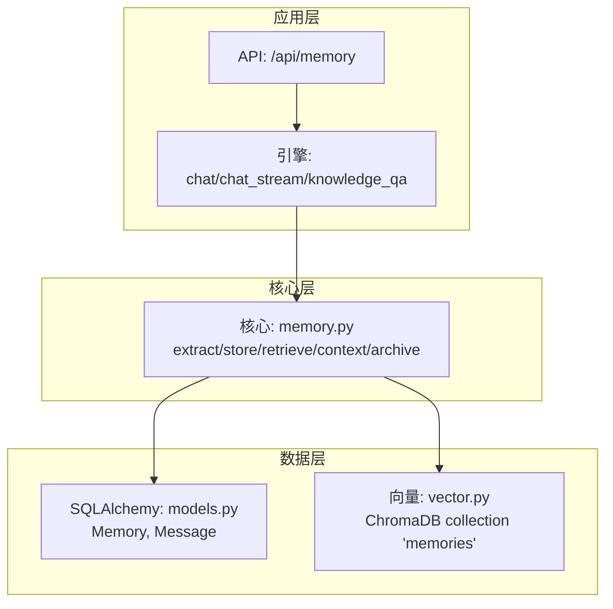
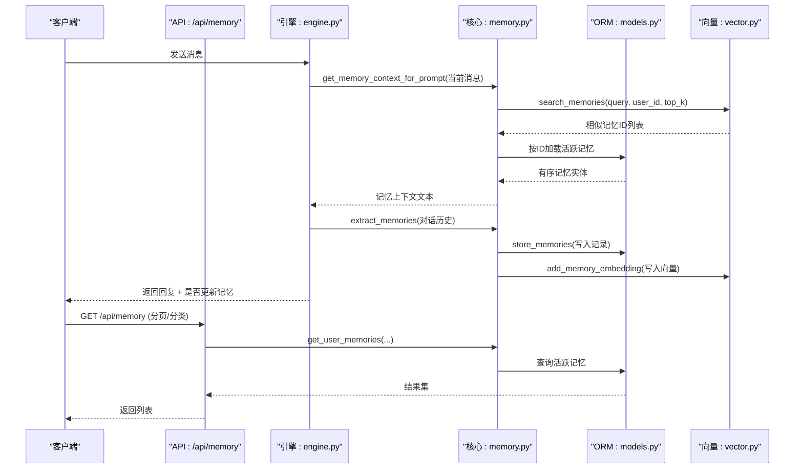
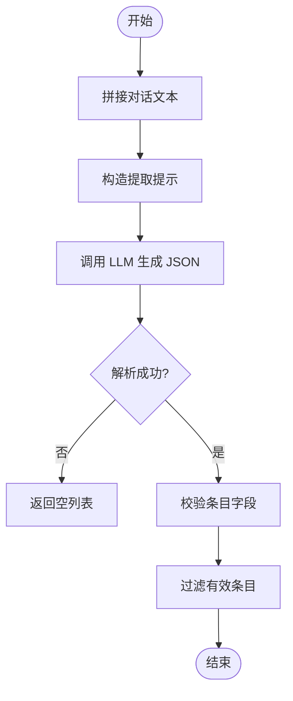
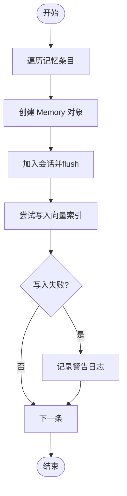
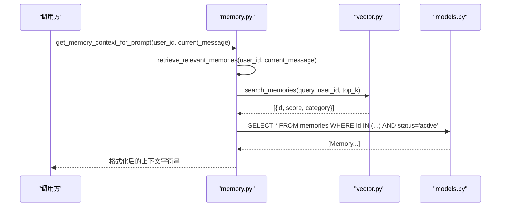
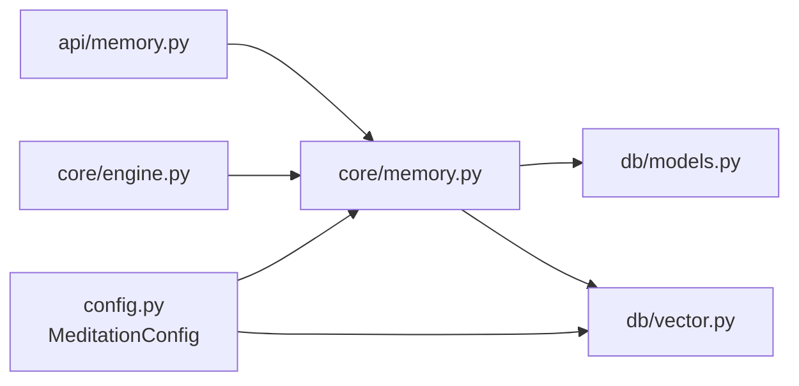

# 记忆管理器

<cite>
**本文引用的文件**
- [hushai/meditation/core/memory.py](file://hushai/meditation/core/memory.py)
- [hushai/meditation/db/vector.py](file://hushai/meditation/db/vector.py)
- [hushai/meditation/db/models.py](file://hushai/meditation/db/models.py)
- [hushai/meditation/config.py](file://hushai/meditation/config.py)
- [hushai/meditation/core/engine.py](file://hushai/meditation/core/engine.py)
- [hushai/meditation/api/memory.py](file://hushai/meditation/api/memory.py)
- [tests/meditation/test_core.py](file://tests/meditation/test_core.py)
</cite>

## 目录
1. [简介](#简介)
2. [项目结构](#项目结构)
3. [核心组件](#核心组件)
4. [架构总览](#架构总览)
5. [详细组件分析](#详细组件分析)
6. [依赖关系分析](#依赖关系分析)
7. [性能与优化](#性能与优化)
8. [故障排查指南](#故障排查指南)
9. [结论](#结论)
10. [附录：自定义与集成示例](#附录自定义与集成示例)

## 简介
本文件为 hush.ai 的记忆子系统提供系统化文档，聚焦长期记忆的提取、存储与检索机制。系统通过对话历史自动抽取结构化记忆，持久化到关系型数据库，并同步向量化至向量数据库以支持语义检索；在生成回复时，根据当前消息动态召回相关记忆，注入提示词上下文，从而提升个性化与连贯性。

注意：代码库中未定义名为 MemoryManager 的类，记忆管理由一组异步函数与数据模型组成，并在主引擎中编排调用。

## 项目结构
记忆相关代码主要分布在以下模块：
- 核心逻辑：hushai/meditation/core/memory.py（提取、存储、检索、归档）
- 向量接口：hushai/meditation/db/vector.py（ChromaDB 封装）
- 数据模型：hushai/meditation/db/models.py（Memory、Message 等 ORM 模型）
- 配置中心：hushai/meditation/config.py（嵌入模型、Top-K、持久化路径等）
- 引擎编排：hushai/meditation/core/engine.py（会话流程、记忆提取触发时机）
- API 暴露：hushai/meditation/api/memory.py（用户侧记忆列表查询）
- 测试用例：tests/meditation/test_core.py（记忆提取解析行为验证）



图表来源
- [hushai/meditation/api/memory.py:1-61](file://hushai/meditation/api/memory.py#L1-L61)
- [hushai/meditation/core/engine.py:166-236](file://hushai/meditation/core/engine.py#L166-L236)
- [hushai/meditation/core/memory.py:45-205](file://hushai/meditation/core/memory.py#L45-L205)
- [hushai/meditation/db/models.py:98-118](file://hushai/meditation/db/models.py#L98-L118)
- [hushai/meditation/db/vector.py:71-178](file://hushai/meditation/db/vector.py#L71-L178)

章节来源
- [hushai/meditation/core/memory.py:1-205](file://hushai/meditation/core/memory.py#L1-L205)
- [hushai/meditation/db/vector.py:1-179](file://hushai/meditation/db/vector.py#L1-L179)
- [hushai/meditation/db/models.py:98-118](file://hushai/meditation/db/models.py#L98-L118)
- [hushai/meditation/config.py:18-53](file://hushai/meditation/config.py#L18-L53)
- [hushai/meditation/core/engine.py:130-154](file://hushai/meditation/core/engine.py#L130-L154)
- [hushai/meditation/api/memory.py:1-61](file://hushai/meditation/api/memory.py#L1-L61)
- [tests/meditation/test_core.py:144-244](file://tests/meditation/test_core.py#L144-L244)

## 核心组件
- 记忆提取：基于 LLM 的 JSON 结构化输出，将对话内容分类为冥想经历、情绪模式、个人偏好、目标进展、重要事件、健康提醒、生活背景等类别，并附带摘要与重要度评分。
- 记忆存储：写入关系型数据库，同时异步向量化存入 ChromaDB 集合 memories，失败不阻断主流程。
- 语义检索：按当前消息进行向量相似度搜索，结合用户隔离过滤，返回 Top-K 结果并按相似度顺序映射回 ORM 实体。
- 提示上下文：将检索到的记忆摘要或片段拼接成文本，注入系统提示，增强个性化回答。
- 清理归档：对低重要度且长时间未更新的活跃记忆执行归档，降低噪声与存储压力。

章节来源
- [hushai/meditation/core/memory.py:18-77](file://hushai/meditation/core/memory.py#L18-L77)
- [hushai/meditation/core/memory.py:79-112](file://hushai/meditation/core/memory.py#L79-L112)
- [hushai/meditation/core/memory.py:115-138](file://hushai/meditation/core/memory.py#L115-L138)
- [hushai/meditation/core/memory.py:161-173](file://hushai/meditation/core/memory.py#L161-L173)
- [hushai/meditation/core/memory.py:189-205](file://hushai/meditation/core/memory.py#L189-L205)

## 架构总览
记忆子系统的端到端流程如下：
- 用户在聊天过程中产生消息，引擎周期性触发记忆提取。
- 提取结果经校验后批量入库，并写入向量索引。
- 下一轮生成前，系统根据当前消息检索相关记忆，构建上下文。
- 外部 API 提供用户记忆列表查询能力。



图表来源
- [hushai/meditation/core/engine.py:166-236](file://hushai/meditation/core/engine.py#L166-L236)
- [hushai/meditation/core/memory.py:161-173](file://hushai/meditation/core/memory.py#L161-L173)
- [hushai/meditation/core/memory.py:45-77](file://hushai/meditation/core/memory.py#L45-L77)
- [hushai/meditation/core/memory.py:79-112](file://hushai/meditation/core/memory.py#L79-L112)
- [hushai/meditation/db/vector.py:144-173](file://hushai/meditation/db/vector.py#L144-L173)
- [hushai/meditation/api/memory.py:27-61](file://hushai/meditation/api/memory.py#L27-L61)

## 详细组件分析

### 数据结构与模型
- 记忆实体 Memory 包含用户标识、类别、原始内容、摘要、重要度、来源会话、状态、时间戳与扩展元数据。
- 会话与消息 Conversation/Message 用于承载对话历史，作为记忆提取的输入源。
- 向量集合 memories 使用 HNSW 余弦距离空间，按用户维度隔离，元数据包含 category。

```mermaid
classDiagram
class User {
+string id
+datetime created_at
+datetime updated_at
+bool is_active
}
class Conversation {
+string id
+string user_id
+string title
+datetime created_at
+datetime updated_at
+bool is_active
}
class Message {
+string id
+string conversation_id
+string role
+string content
+datetime created_at
}
class Memory {
+string id
+string user_id
+string category
+string content
+string summary
+float importance
+string source_conversation_id
+string status
+datetime created_at
+datetime updated_at
}
User ||--o{ Conversation : "拥有"
Conversation ||--o{ Message : "包含"
User ||--o{ Memory : "拥有"
```

图表来源
- [hushai/meditation/db/models.py:37-66](file://hushai/meditation/db/models.py#L37-L66)
- [hushai/meditation/db/models.py:69-96](file://hushai/meditation/db/models.py#L69-L96)
- [hushai/meditation/db/models.py:98-118](file://hushai/meditation/db/models.py#L98-L118)

章节来源
- [hushai/meditation/db/models.py:98-118](file://hushai/meditation/db/models.py#L98-L118)
- [hushai/meditation/db/models.py:69-96](file://hushai/meditation/db/models.py#L69-L96)

### 长期记忆提取算法：extract_memories()
- 输入：一轮或多轮 Message 列表。
- 处理：
  - 将对话内容拼接为自然语言文本。
  - 构造系统提示，指定记忆类别与 JSON 输出格式。
  - 调用 LLM 完成生成，尝试去除 Markdown 代码块包裹，解析 JSON。
  - 校验每条记录的 category 与 content 字段，过滤无效项。
- 输出：结构化记忆数组，供后续存储。



图表来源
- [hushai/meditation/core/memory.py:45-77](file://hushai/meditation/core/memory.py#L45-L77)

章节来源
- [hushai/meditation/core/memory.py:18-77](file://hushai/meditation/core/memory.py#L18-L77)
- [tests/meditation/test_core.py:144-244](file://tests/meditation/test_core.py#L144-L244)

### 存储策略：store_memories()
- 遍历提取结果，创建 Memory ORM 对象，设置默认值与边界约束（importance 归一化）。
- 写入数据库并 flush，随后尝试写入向量索引；若失败仅记录警告，不中断主流程。
- 返回已存储的 Memory 列表。



图表来源
- [hushai/meditation/core/memory.py:79-112](file://hushai/meditation/core/memory.py#L79-L112)
- [hushai/meditation/db/vector.py:130-142](file://hushai/meditation/db/vector.py#L130-L142)

章节来源
- [hushai/meditation/core/memory.py:79-112](file://hushai/meditation/core/memory.py#L79-L112)

### 检索机制：retrieve_relevant_memories() 与 get_memory_context_for_prompt()
- retrieve_relevant_memories：
  - 从配置读取 top_k，调用向量接口按 query 与 user_id 过滤检索。
  - 取回 ID 列表后，用 SQL 查询对应活跃记忆实体，保持相似度排序。
- get_memory_context_for_prompt：
  - 将检索结果转换为人类可读的标签+摘要/片段文本，便于注入系统提示。



图表来源
- [hushai/meditation/core/memory.py:115-138](file://hushai/meditation/core/memory.py#L115-L138)
- [hushai/meditation/core/memory.py:161-173](file://hushai/meditation/core/memory.py#L161-L173)
- [hushai/meditation/db/vector.py:144-173](file://hushai/meditation/db/vector.py#L144-L173)

章节来源
- [hushai/meditation/core/memory.py:115-138](file://hushai/meditation/core/memory.py#L115-L138)
- [hushai/meditation/core/memory.py:161-173](file://hushai/meditation/core/memory.py#L161-L173)

### 用户记忆列表：get_user_memories()
- 支持按用户与可选类别过滤，按重要度与更新时间倒序排列，分页返回总数与记录集。

章节来源
- [hushai/meditation/core/memory.py:141-158](file://hushai/meditation/core/memory.py#L141-L158)
- [hushai/meditation/api/memory.py:27-61](file://hushai/meditation/api/memory.py#L27-L61)

### 清理策略：archive_old_memories()
- 条件：用户维度、状态为 active、重要度低于阈值、最后更新时间早于截止期。
- 动作：批量更新状态为 archived，返回受影响行数。

章节来源
- [hushai/meditation/core/memory.py:189-205](file://hushai/meditation/core/memory.py#L189-L205)

### 引擎编排与触发条件
- 每 N 条用户消息触发一次记忆提取（默认间隔为 2），避免频繁调用 LLM。
- 首轮对话自动补全会话标题。
- 安全前置：不安全内容直接返回安全提示，不调用外部模型。

章节来源
- [hushai/meditation/core/engine.py:34-36](file://hushai/meditation/core/engine.py#L34-L36)
- [hushai/meditation/core/engine.py:130-154](file://hushai/meditation/core/engine.py#L130-L154)
- [hushai/meditation/core/engine.py:166-236](file://hushai/meditation/core/engine.py#L166-L236)

## 依赖关系分析
- 配置依赖：
  - embedding_provider、embedding_model、embedding_api_key、embedding_base_url：控制向量嵌入提供者与模型。
  - chroma_persist_dir：本地持久化 ChromaDB 路径；为空则使用内存实例。
  - memory_top_k：默认语义检索数量。
  - memory_extraction_model：可选覆盖记忆提取使用的模型。
- 外部依赖：
  - ChromaDB：向量数据库，集合名 memories，HNSW 余弦空间。
  - LLM 服务：用于记忆提取与对话生成。



图表来源
- [hushai/meditation/config.py:18-53](file://hushai/meditation/config.py#L18-L53)
- [hushai/meditation/db/vector.py:15-28](file://hushai/meditation/db/vector.py#L15-L28)
- [hushai/meditation/core/memory.py:13-16](file://hushai/meditation/core/memory.py#L13-L16)
- [hushai/meditation/core/engine.py:16-20](file://hushai/meditation/core/engine.py#L16-L20)
- [hushai/meditation/api/memory.py:9-11](file://hushai/meditation/api/memory.py#L9-L11)

章节来源
- [hushai/meditation/config.py:18-53](file://hushai/meditation/config.py#L18-L53)
- [hushai/meditation/db/vector.py:15-28](file://hushai/meditation/db/vector.py#L15-L28)

## 性能与优化
- 提取频率控制：通过固定间隔减少 LLM 调用成本与延迟。
- 向量写入容错：写入失败仅告警，不影响主流程，保证高可用。
- 检索顺序保持：先向量检索再 SQL 加载，维持相似度排序，减少二次排序开销。
- 分页与计数分离：get_user_memories 使用子查询计数，避免全表扫描影响。
- 索引设计：
  - 用户+类别复合索引加速按用户维度的分类查询。
  - 用户与更新时间字段参与排序，建议数据库层面建立相应索引以提升分页性能。
- 向量索引参数：
  - HNSW 余弦空间适合中文语义检索；可通过 embedding_provider/model/base_url 切换不同嵌入模型。
  - 生产环境建议使用持久化 ChromaDB 路径以避免重启丢失索引。

[本节为通用性能建议，无需具体文件引用]

## 故障排查指南
- 记忆提取 JSON 解析失败：
  - 现象：日志出现“记忆提取 JSON 解析失败”。
  - 原因：LLM 返回非 JSON 或结构不符合预期。
  - 处理：检查提取提示与模型选择；必要时调整 temperature/max_tokens。
- 向量写入失败：
  - 现象：日志出现“记忆向量写入失败”。
  - 原因：ChromaDB 不可用或网络异常。
  - 处理：确认 chroma_persist_dir 或远程服务可达；重试或降级为纯文本检索。
- 检索结果为空：
  - 现象：get_memory_context_for_prompt 返回空字符串。
  - 原因：向量集合为空或用户无匹配记录。
  - 处理：确认 store_memories 成功执行；检查 where 过滤条件是否正确。
- 配置缺失导致嵌入失败：
  - 现象：无法初始化 OpenAIEmbeddingFunction。
  - 处理：确保 embedding_api_key/embedding_model 等环境变量正确设置。

章节来源
- [hushai/meditation/core/memory.py:74-76](file://hushai/meditation/core/memory.py#L74-L76)
- [hushai/meditation/core/memory.py:109-111](file://hushai/meditation/core/memory.py#L109-L111)
- [hushai/meditation/db/vector.py:43-58](file://hushai/meditation/db/vector.py#L43-L58)

## 结论
该记忆子系统以轻量函数式架构实现长期记忆的自动化提取、存储与语义检索，并通过引擎编排将记忆上下文无缝注入对话生成流程。其设计兼顾可用性（容错）、可配置性与可扩展性，适用于冥想辅导场景下的个性化交互。

[本节为总结性内容，无需具体文件引用]

## 附录：自定义与集成示例

### 自定义记忆提取规则
- 修改 MEMORY_EXTRACTION_PROMPT 中的类别定义与输出字段，以适配新的业务领域。
- 在 extract_memories 中增加额外校验逻辑，例如对重要性区间或类别白名单进行过滤。
- 参考测试用例中对 JSON 与代码块包裹的处理方式，确保鲁棒性。

章节来源
- [hushai/meditation/core/memory.py:18-40](file://hushai/meditation/core/memory.py#L18-L40)
- [hushai/meditation/core/memory.py:45-77](file://hushai/meditation/core/memory.py#L45-L77)
- [tests/meditation/test_core.py:144-244](file://tests/meditation/test_core.py#L144-L244)

### 与向量数据库的集成方式
- 嵌入提供者选择：
  - 当 embedding_provider=openai 且提供 api_key 时，使用 OpenAIEmbeddingFunction；否则回退到默认嵌入函数。
- 集合管理：
  - 使用 memory_collection() 获取或创建集合，命名 memories，空间为 cosine。
- 写入与检索：
  - add_memory_embedding 写入单条记忆；search_memories 按用户隔离检索并返回分数与类别。

章节来源
- [hushai/meditation/db/vector.py:43-58](file://hushai/meditation/db/vector.py#L43-L58)
- [hushai/meditation/db/vector.py:71-78](file://hushai/meditation/db/vector.py#L71-L78)
- [hushai/meditation/db/vector.py:130-142](file://hushai/meditation/db/vector.py#L130-L142)
- [hushai/meditation/db/vector.py:144-173](file://hushai/meditation/db/vector.py#L144-L173)

### 关键方法调用路径参考
- 记忆提取与存储：
  - [hushai/meditation/core/memory.py:45-77](file://hushai/meditation/core/memory.py#L45-L77)
  - [hushai/meditation/core/memory.py:79-112](file://hushai/meditation/core/memory.py#L79-L112)
- 语义检索与上下文构建：
  - [hushai/meditation/core/memory.py:115-138](file://hushai/meditation/core/memory.py#L115-L138)
  - [hushai/meditation/core/memory.py:161-173](file://hushai/meditation/core/memory.py#L161-L173)
- 引擎触发点：
  - [hushai/meditation/core/engine.py:130-154](file://hushai/meditation/core/engine.py#L130-L154)
  - [hushai/meditation/core/engine.py:166-236](file://hushai/meditation/core/engine.py#L166-L236)
- 用户侧 API：
  - [hushai/meditation/api/memory.py:27-61](file://hushai/meditation/api/memory.py#L27-L61)