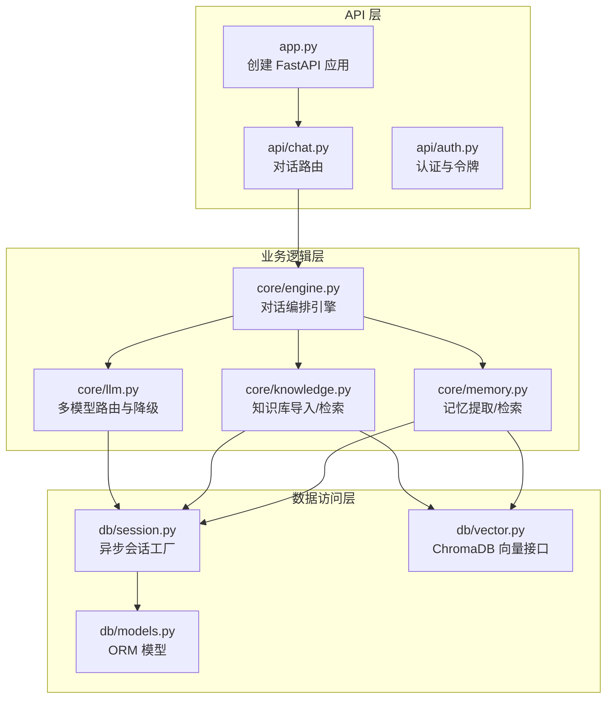
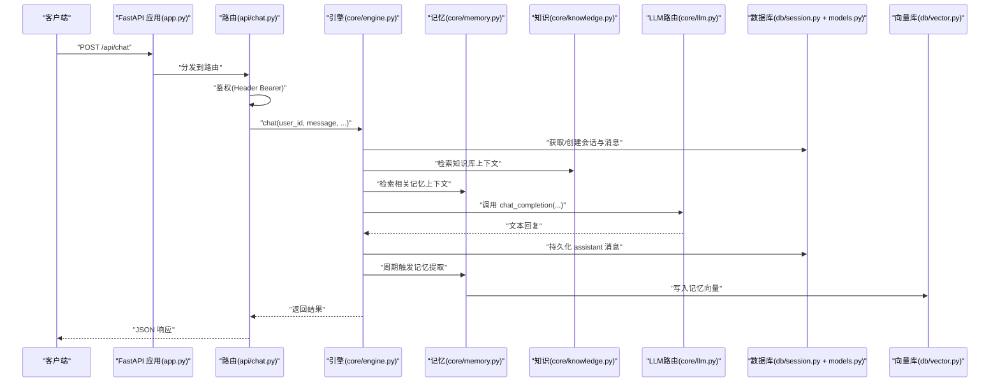
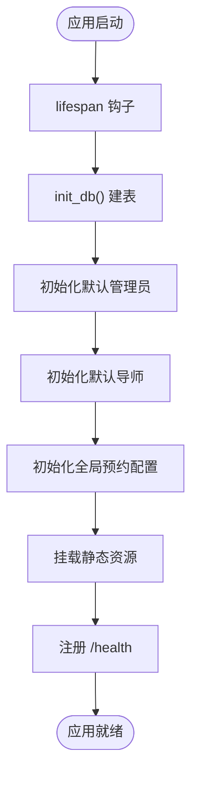
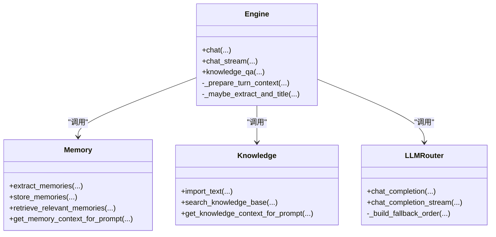
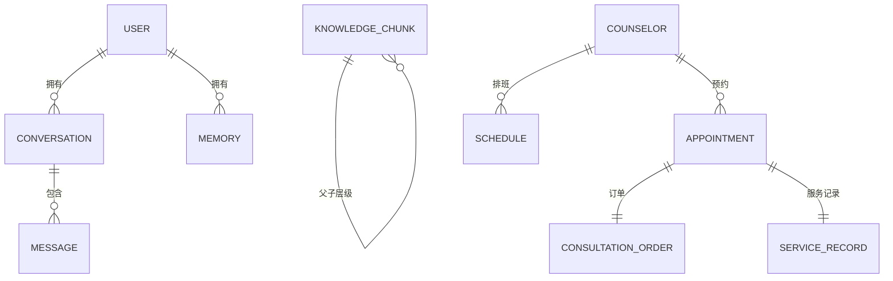
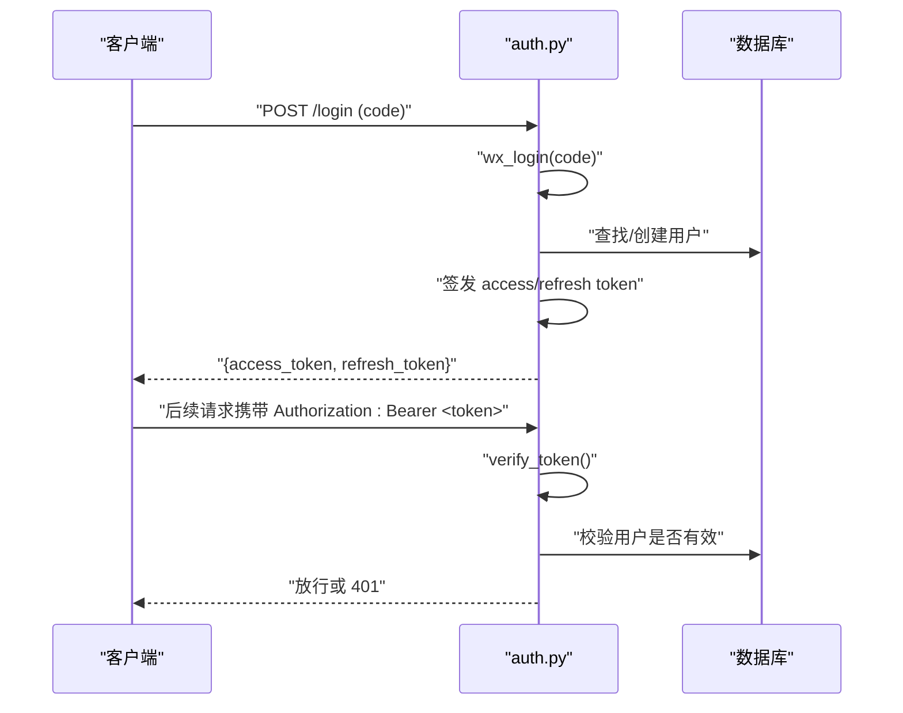
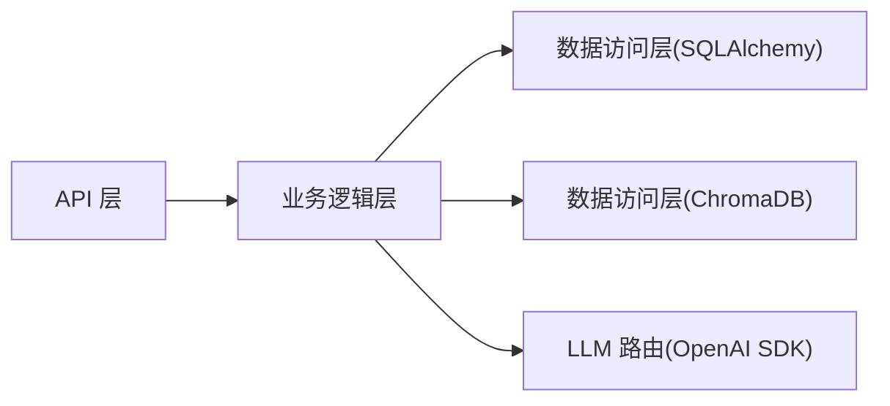

# 分层架构设计

<cite>
**本文引用的文件**   
- [hushai/meditation/app.py](file://hushai/meditation/app.py)
- [hushai/meditation/api/chat.py](file://hushai/meditation/api/chat.py)
- [hushai/meditation/core/engine.py](file://hushai/meditation/core/engine.py)
- [hushai/meditation/core/memory.py](file://hushai/meditation/core/memory.py)
- [hushai/meditation/core/knowledge.py](file://hushai/meditation/core/knowledge.py)
- [hushai/meditation/core/llm.py](file://hushai/meditation/core/llm.py)
- [hushai/meditation/db/session.py](file://hushai/meditation/db/session.py)
- [hushai/meditation/db/models.py](file://hushai/meditation/db/models.py)
- [hushai/meditation/db/vector.py](file://hushai/meditation/db/vector.py)
- [hushai/meditation/config.py](file://hushai/meditation/config.py)
- [hushai/meditation/api/auth.py](file://hushai/meditation/api/auth.py)
- [hushai/meditation/schemas.py](file://hushai/meditation/schemas.py)
</cite>

## 目录
1. [简介](#简介)
2. [项目结构](#项目结构)
3. [核心组件](#核心组件)
4. [架构总览](#架构总览)
5. [详细组件分析](#详细组件分析)
6. [依赖关系分析](#依赖关系分析)
7. [性能考量](#性能考量)
8. [故障排查指南](#故障排查指南)
9. [结论](#结论)

## 简介
本文件面向 hush.ai 的冥想服务模块，系统化阐述其“三层架构”：API 层（路由与中间件）、业务逻辑层（核心引擎与领域组件）、数据访问层（数据库与向量存储）。文档覆盖各层职责边界、依赖注入机制、模块间通信协议、FastAPI 应用初始化流程、中间件链配置与路由注册机制，并通过架构图表展示调用关系与数据流向，同时说明错误处理与异常传播策略。

## 项目结构
该模块采用按功能域组织的方式，核心代码位于 meditation 子包内：
- API 层：路由定义、鉴权、限流、请求校验与响应序列化
- 业务逻辑层：对话编排、记忆提取与检索、知识库 RAG、LLM 多提供商路由
- 数据访问层：SQLAlchemy 异步会话、ORM 模型、ChromaDB 向量接口

图表来源
- [hushai/meditation/app.py:136-207](file://hushai/meditation/app.py#L136-L207)
- [hushai/meditation/api/chat.py:1-245](file://hushai/meditation/api/chat.py#L1-L245)
- [hushai/meditation/core/engine.py:1-387](file://hushai/meditation/core/engine.py#L1-L387)
- [hushai/meditation/core/memory.py:1-206](file://hushai/meditation/core/memory.py#L1-L206)
- [hushai/meditation/core/knowledge.py:1-225](file://hushai/meditation/core/knowledge.py#L1-L225)
- [hushai/meditation/core/llm.py:1-258](file://hushai/meditation/core/llm.py#L1-L258)
- [hushai/meditation/db/session.py:1-83](file://hushai/meditation/db/session.py#L1-L83)
- [hushai/meditation/db/models.py:1-434](file://hushai/meditation/db/models.py#L1-L434)
- [hushai/meditation/db/vector.py:1-179](file://hushai/meditation/db/vector.py#L1-L179)

章节来源
- [hushai/meditation/app.py:136-207](file://hushai/meditation/app.py#L136-L207)
- [hushai/meditation/api/chat.py:1-245](file://hushai/meditation/api/chat.py#L1-L245)
- [hushai/meditation/core/engine.py:1-387](file://hushai/meditation/core/engine.py#L1-L387)
- [hushai/meditation/db/session.py:1-83](file://hushai/meditation/db/session.py#L1-L83)
- [hushai/meditation/db/models.py:1-434](file://hushai/meditation/db/models.py#L1-L434)
- [hushai/meditation/db/vector.py:1-179](file://hushai/meditation/db/vector.py#L1-L179)

## 核心组件
- 应用入口与生命周期管理：负责日志、数据库初始化、默认数据填充、静态资源挂载与健康检查
- 路由与鉴权：基于 Header 的 Bearer Token 校验、微信登录、刷新令牌
- 对话引擎：组装系统提示、加载历史、触发安全检查、调用 LLM、持久化消息、周期性记忆提取
- 记忆子系统：从对话中提取结构化记忆、写入向量库并支持语义检索
- 知识库子系统：Markdown 解析、分块入库、向量检索与上下文拼装
- LLM 路由：多提供商客户端构建、自动降级与调试模式 Mock
- 数据访问：异步 SQLAlchemy 会话、ORM 模型、ChromaDB 集合操作

章节来源
- [hushai/meditation/app.py:24-134](file://hushai/meditation/app.py#L24-L134)
- [hushai/meditation/api/auth.py:1-171](file://hushai/meditation/api/auth.py#L1-L171)
- [hushai/meditation/core/engine.py:166-314](file://hushai/meditation/core/engine.py#L166-L314)
- [hushai/meditation/core/memory.py:45-173](file://hushai/meditation/core/memory.py#L45-L173)
- [hushai/meditation/core/knowledge.py:137-225](file://hushai/meditation/core/knowledge.py#L137-L225)
- [hushai/meditation/core/llm.py:136-258](file://hushai/meditation/core/llm.py#L136-L258)
- [hushai/meditation/db/session.py:34-83](file://hushai/meditation/db/session.py#L34-L83)
- [hushai/meditation/db/models.py:37-266](file://hushai/meditation/db/models.py#L37-L266)
- [hushai/meditation/db/vector.py:61-179](file://hushai/meditation/db/vector.py#L61-L179)

## 架构总览
下图展示了从 HTTP 请求到 LLM 返回的完整调用链路，以及数据在三层之间的流转。

图表来源
- [hushai/meditation/app.py:136-207](file://hushai/meditation/app.py#L136-L207)
- [hushai/meditation/api/chat.py:58-104](file://hushai/meditation/api/chat.py#L58-L104)
- [hushai/meditation/core/engine.py:166-236](file://hushai/meditation/core/engine.py#L166-L236)
- [hushai/meditation/core/memory.py:161-173](file://hushai/meditation/core/memory.py#L161-L173)
- [hushai/meditation/core/knowledge.py:216-225](file://hushai/meditation/core/knowledge.py#L216-L225)
- [hushai/meditation/core/llm.py:136-179](file://hushai/meditation/core/llm.py#L136-L179)
- [hushai/meditation/db/session.py:50-68](file://hushai/meditation/db/session.py#L50-L68)
- [hushai/meditation/db/models.py:69-96](file://hushai/meditation/db/models.py#L69-L96)
- [hushai/meditation/db/vector.py:130-173](file://hushai/meditation/db/vector.py#L130-L173)

## 详细组件分析

### API 层：路由与中间件
- 应用初始化
  - 使用 lifespan 钩子在启动时完成日志配置、数据库初始化、默认管理员与导师数据初始化、全局预约配置初始化；关闭时释放数据库连接
  - 注册 CORS 中间件、限流器（slowapi）及其异常处理器
  - 挂载静态资源与 favicon 重定向、健康检查端点
- 路由注册
  - 集中 include_router 注册前端、登录、聊天、技能、知识、记忆、冥想、导师、咨询、仪表盘、后台等路由
- 鉴权与限流
  - 通过 Header Authorization 提取 Bearer Token，调用 get_current_user_id 校验用户有效性
  - 对关键接口添加 @limiter.limit("30/minute") 限制

图表来源
- [hushai/meditation/app.py:24-134](file://hushai/meditation/app.py#L24-L134)
- [hushai/meditation/app.py:136-207](file://hushai/meditation/app.py#L136-L207)

章节来源
- [hushai/meditation/app.py:24-134](file://hushai/meditation/app.py#L24-L134)
- [hushai/meditation/app.py:136-207](file://hushai/meditation/app.py#L136-L207)
- [hushai/meditation/api/chat.py:47-56](file://hushai/meditation/api/chat.py#L47-L56)
- [hushai/meditation/api/chat.py:58-104](file://hushai/meditation/api/chat.py#L58-L104)

### 业务逻辑层：核心引擎与组件
- 对话引擎（engine.py）
  - 会话与消息：根据 user_id 和 conversation_id 获取或创建会话，加载最近 N 轮消息
  - 上下文组装：并行拉取记忆上下文、知识库上下文、场景与技能上下文，结合教师角色提示，生成 system prompt 与历史消息列表
  - 安全前置：在调用 LLM 前进行安全检查，若不安全则直接返回安全提示并持久化
  - 非流式与流式：chat 与 chat_stream 共用上下文构建逻辑；流式逐块转发并在完成后持久化
  - 记忆提取：每 N 条用户消息触发一次记忆提取，失败不影响主流程
- 记忆子系统（memory.py）
  - 提取：将近期对话转为纯文本，调用 LLM 抽取结构化记忆（类别、内容、摘要、重要度）
  - 存储：批量写入 ORM 并追加向量索引；检索时先向量召回再回表过滤活跃状态
  - 上下文：为当前消息检索 top_k 相关记忆，拼接成提示片段
- 知识库子系统（knowledge.py）
  - 导入：支持 Markdown 与纯文本，解析 frontmatter 与标题，切分为固定大小重叠分块，写入 ORM 与向量库
  - 检索：向量查询后格式化上下文片段供提示使用
- LLM 路由（llm.py）
  - 多提供商：openai/deepseek/zhipu/kimi，支持自定义扩展
  - 降级：按优先级顺序尝试，失败自动切换；调试模式下无 key 走 mock
  - 流式：逐块 yield，失败时抛出可被上层捕获的错误

图表来源
- [hushai/meditation/core/engine.py:91-127](file://hushai/meditation/core/engine.py#L91-L127)
- [hushai/meditation/core/memory.py:45-173](file://hushai/meditation/core/memory.py#L45-L173)
- [hushai/meditation/core/knowledge.py:137-225](file://hushai/meditation/core/knowledge.py#L137-L225)
- [hushai/meditation/core/llm.py:136-258](file://hushai/meditation/core/llm.py#L136-L258)

章节来源
- [hushai/meditation/core/engine.py:166-314](file://hushai/meditation/core/engine.py#L166-L314)
- [hushai/meditation/core/memory.py:45-173](file://hushai/meditation/core/memory.py#L45-L173)
- [hushai/meditation/core/knowledge.py:137-225](file://hushai/meditation/core/knowledge.py#L137-L225)
- [hushai/meditation/core/llm.py:136-258](file://hushai/meditation/core/llm.py#L136-L258)

### 数据访问层：数据库与向量存储
- 会话管理（session.py）
  - 单例引擎与 sessionmaker，支持 SQLite 与 PostgreSQL 异步驱动
  - init_db/close_db 用于生命周期管理；测试环境提供 reset 方法
- ORM 模型（models.py）
  - 用户、会话、消息、记忆、技能、知识分块、场景、咨询师、排班、预约、订单、服务记录、管理员、审计日志等
  - 常用字段含时间戳、软删除标记、JSON 元数据、外键关系与索引
- 向量接口（vector.py）
  - ChromaDB 客户端单例，支持本地持久化或内存模式
  - 知识集合 memories/knowledge，支持 upsert、query、delete；可选 OpenAI 嵌入函数

图表来源
- [hushai/meditation/db/models.py:37-266](file://hushai/meditation/db/models.py#L37-L266)
- [hushai/meditation/db/models.py:273-434](file://hushai/meditation/db/models.py#L273-L434)

章节来源
- [hushai/meditation/db/session.py:34-83](file://hushai/meditation/db/session.py#L34-L83)
- [hushai/meditation/db/models.py:37-266](file://hushai/meditation/db/models.py#L37-L266)
- [hushai/meditation/db/models.py:273-434](file://hushai/meditation/db/models.py#L273-L434)
- [hushai/meditation/db/vector.py:61-179](file://hushai/meditation/db/vector.py#L61-L179)

### 认证与授权
- 微信登录：code -> session_key/openid -> 用户存在性判断 -> 签发 access_token 与 refresh_token
- 令牌校验：verify_token 强制类型校验，get_current_user_id 二次确认用户有效
- 刷新令牌：通过 selector 快速定位用户，bcrypt 校验原 token，更新双令牌

图表来源
- [hushai/meditation/api/auth.py:63-106](file://hushai/meditation/api/auth.py#L63-L106)
- [hushai/meditation/api/auth.py:109-131](file://hushai/meditation/api/auth.py#L109-L131)
- [hushai/meditation/api/auth.py:134-164](file://hushai/meditation/api/auth.py#L134-L164)

章节来源
- [hushai/meditation/api/auth.py:63-106](file://hushai/meditation/api/auth.py#L63-L106)
- [hushai/meditation/api/auth.py:109-131](file://hushai/meditation/api/auth.py#L109-L131)
- [hushai/meditation/api/auth.py:134-164](file://hushai/meditation/api/auth.py#L134-L164)

### 配置与环境
- 统一配置类 MeditationConfig，从环境变量加载，涵盖数据库、向量库、LLM 提供商、JWT、微信支付、加密等
- 应用启动时读取配置，控制日志级别、CORS、端口、调试行为等

章节来源
- [hushai/meditation/config.py:18-136](file://hushai/meditation/config.py#L18-L136)
- [hushai/meditation/app.py:136-155](file://hushai/meditation/app.py#L136-L155)

## 依赖关系分析
- 耦合与内聚
  - API 层仅依赖路由、鉴权与限流，内聚于请求处理
  - 业务逻辑层聚合多个领域能力（记忆、知识、LLM），通过函数式接口解耦
  - 数据访问层封装数据库与向量库细节，向上暴露会话工厂与集合操作
- 外部依赖
  - OpenAI SDK 用于多提供商 LLM 调用
  - ChromaDB 作为向量存储
  - SQLAlchemy 异步驱动与 Alembic 迁移（由 db.session 与 models 支撑）
- 潜在循环依赖
  - 当前实现以函数调用为主，避免类级循环引用；注意 engine 与 memory/knowledge 的相互调用应保持单向依赖

图表来源
- [hushai/meditation/api/chat.py:1-245](file://hushai/meditation/api/chat.py#L1-L245)
- [hushai/meditation/core/engine.py:1-387](file://hushai/meditation/core/engine.py#L1-L387)
- [hushai/meditation/db/session.py:1-83](file://hushai/meditation/db/session.py#L1-L83)
- [hushai/meditation/db/vector.py:1-179](file://hushai/meditation/db/vector.py#L1-L179)
- [hushai/meditation/core/llm.py:1-258](file://hushai/meditation/core/llm.py#L1-L258)

章节来源
- [hushai/meditation/api/chat.py:1-245](file://hushai/meditation/api/chat.py#L1-L245)
- [hushai/meditation/core/engine.py:1-387](file://hushai/meditation/core/engine.py#L1-L387)
- [hushai/meditation/db/session.py:1-83](file://hushai/meditation/db/session.py#L1-L83)
- [hushai/meditation/db/vector.py:1-179](file://hushai/meditation/db/vector.py#L1-L179)
- [hushai/meditation/core/llm.py:1-258](file://hushai/meditation/core/llm.py#L1-L258)

## 性能考量
- 会话与连接池
  - SQLite 使用较小连接池，PostgreSQL 使用较大连接池；按需调整 pool_size
- 流式响应
  - chat_stream 逐块转发，降低首字节延迟；注意网络抖动与后端超时设置
- 向量检索
  - 记忆与知识检索均使用 top_k 限制，避免过大上下文；必要时缓存热点查询
- LLM 降级
  - 自动降级提升可用性；生产环境建议配置多提供商与合理超时
- 记忆提取频率
  - 每 N 条用户消息触发一次，平衡实时性与成本

[本节为通用指导，不直接分析具体文件]

## 故障排查指南
- 常见错误与处理
  - 鉴权失败：Header 缺失或 token 无效，返回 401；检查 verify_token 与 get_current_user_id 抛出的 RuntimeError
  - 限流触发：slowapi 返回 429；检查 @limiter.limit 装饰器与 key_func
  - LLM 调用失败：OpenAIError 被捕获并降级；全部失败时 debug 模式走 mock，生产模式抛出 RuntimeError
  - 向量库异常：写入失败会记录警告但不阻断主流程；检查 chromadb 客户端与集合是否存在
  - 数据库异常：engine 未初始化或连接失败；检查 init_db 与 URL 配置
- 日志与诊断
  - 启动时根据 debug 开关设置日志级别；关注 engine/memory/knowledge/llm 模块日志
  - 健康检查 /health 可用于探针

章节来源
- [hushai/meditation/api/chat.py:58-104](file://hushai/meditation/api/chat.py#L58-L104)
- [hushai/meditation/core/llm.py:136-179](file://hushai/meditation/core/llm.py#L136-L179)
- [hushai/meditation/core/memory.py:102-112](file://hushai/meditation/core/memory.py#L102-L112)
- [hushai/meditation/app.py:24-34](file://hushai/meditation/app.py#L24-L34)

## 结论
hush.ai 冥想模块采用清晰的三层架构：API 层专注请求处理与横切关注点，业务逻辑层编排对话、记忆与知识，数据访问层屏蔽底层存储差异。通过依赖注入（会话工厂）、明确的模块边界与统一的异常传播策略，系统在可扩展性、可维护性与可用性方面具备良好基础。建议在后续迭代中持续优化向量检索缓存、会话窗口裁剪与 LLM 降级策略，以提升整体性能与稳定性。