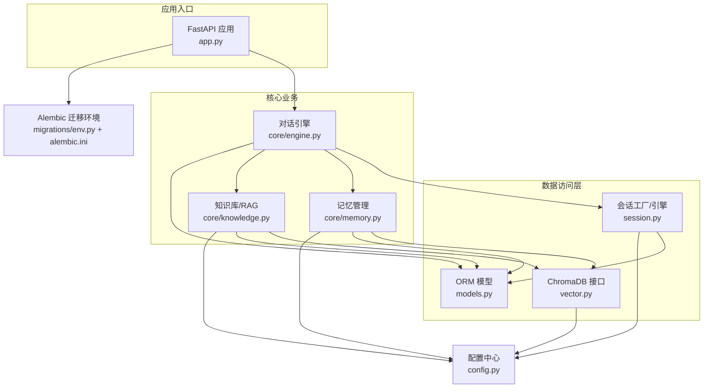
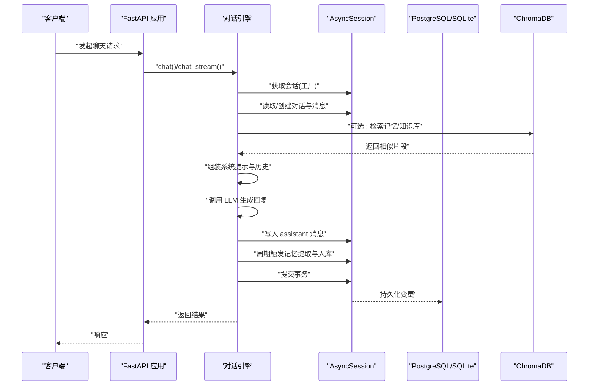
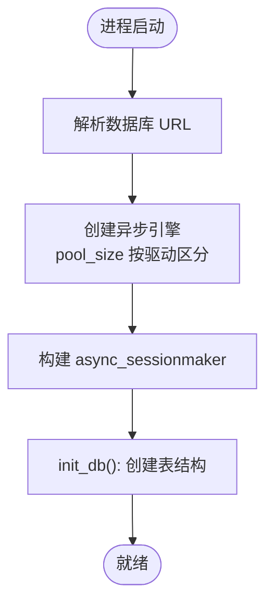
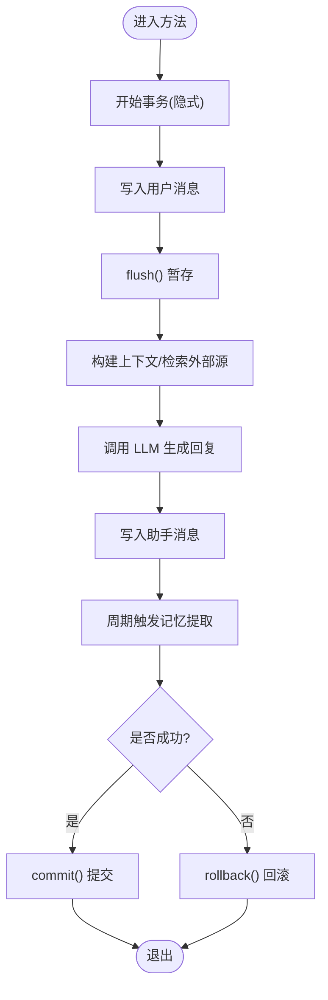
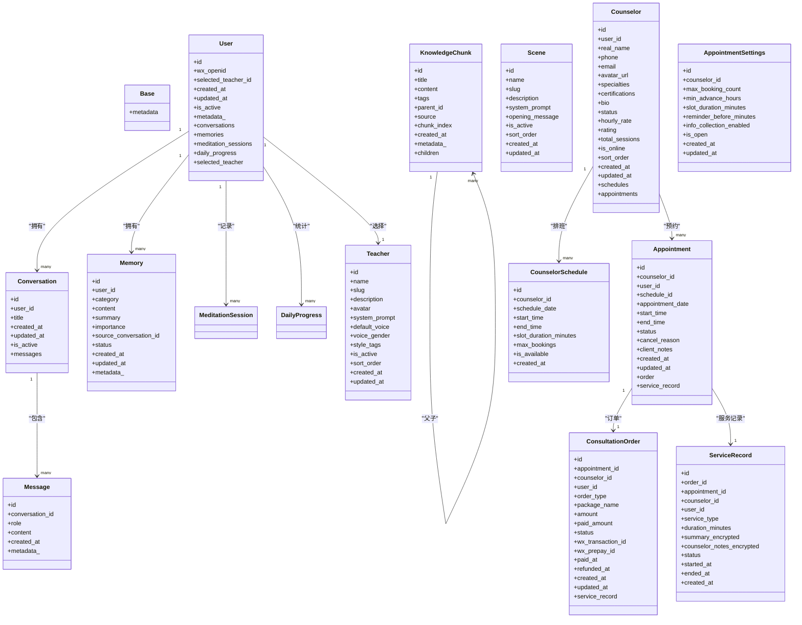
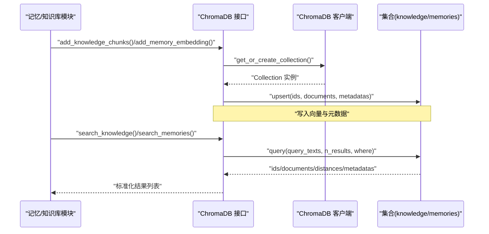
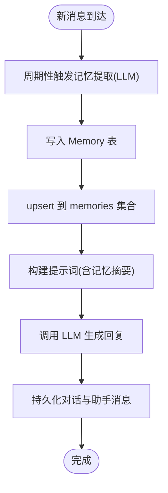
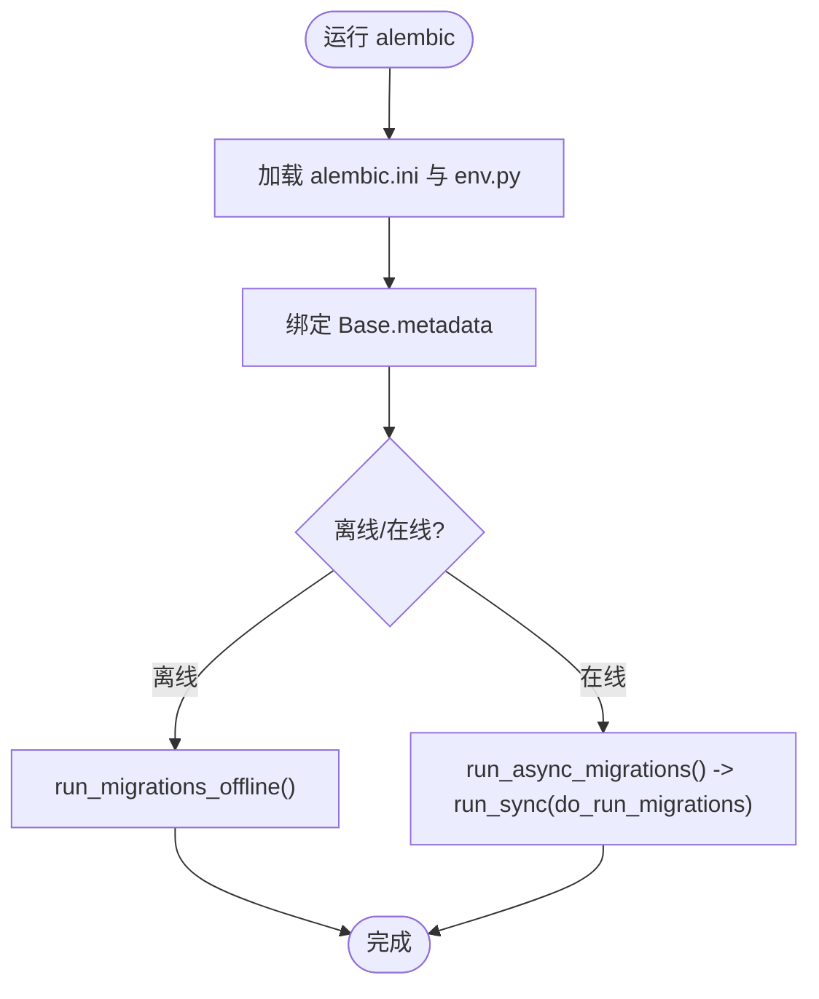
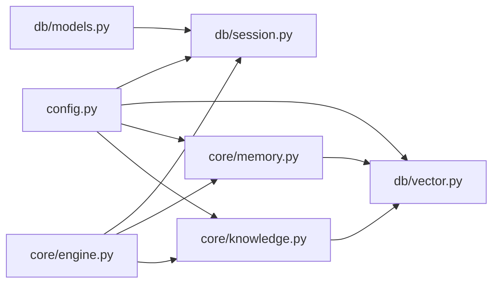

# 数据访问层设计

<cite>
**本文引用的文件**
- [hushai/meditation/db/models.py](file://hushai/meditation/db/models.py)
- [hushai/meditation/db/session.py](file://hushai/meditation/db/session.py)
- [hushai/meditation/db/vector.py](file://hushai/meditation/db/vector.py)
- [hushai/meditation/core/engine.py](file://hushai/meditation/core/engine.py)
- [hushai/meditation/core/memory.py](file://hushai/meditation/core/memory.py)
- [hushai/meditation/core/knowledge.py](file://hushai/meditation/core/knowledge.py)
- [hushai/meditation/config.py](file://hushai/meditation/config.py)
- [alembic.ini](file://alembic.ini)
- [hushai/meditation/db/migrations/env.py](file://hushai/meditation/db/migrations/env.py)
- [hushai/meditation/app.py](file://hushai/meditation/app.py)
</cite>

## 目录
1. [引言](#引言)
2. [项目结构](#项目结构)
3. [核心组件](#核心组件)
4. [架构总览](#架构总览)
5. [详细组件分析](#详细组件分析)
6. [依赖关系分析](#依赖关系分析)
7. [性能考虑](#性能考虑)
8. [故障排查指南](#故障排查指南)
9. [结论](#结论)
10. [附录](#附录)

## 引言
本文件面向 hush.ai 的数据访问层，系统性阐述 SQLAlchemy ORM 的配置与使用模式、会话工厂与事务处理机制、数据模型与关系映射、查询优化策略；并详细说明向量数据库 ChromaDB 的集成方式（向量化存储、语义搜索、索引管理）。同时覆盖数据库迁移管理、连接配置与性能调优最佳实践，并通过具体代码路径展示典型数据操作、一致性保证与错误恢复机制。

## 项目结构
数据访问层主要分布在 meditation 子模块中：
- 模型定义：hushai/meditation/db/models.py
- 引擎与会话：hushai/meditation/db/session.py
- 向量接口：hushai/meditation/db/vector.py
- 业务编排与事务边界：hushai/meditation/core/engine.py
- 记忆与知识库逻辑：hushai/meditation/core/memory.py、hushai/meditation/core/knowledge.py
- 配置中心：hushai/meditation/config.py
- 迁移配置与环境：alembic.ini、hushai/meditation/db/migrations/env.py
- 应用生命周期与初始化：hushai/meditation/app.py

图表来源
- [hushai/meditation/app.py:1-228](file://hushai/meditation/app.py#L1-L228)
- [hushai/meditation/db/session.py:1-83](file://hushai/meditation/db/session.py#L1-L83)
- [hushai/meditation/db/models.py:1-434](file://hushai/meditation/db/models.py#L1-L434)
- [hushai/meditation/db/vector.py:1-179](file://hushai/meditation/db/vector.py#L1-L179)
- [hushai/meditation/core/engine.py:1-387](file://hushai/meditation/core/engine.py#L1-L387)
- [hushai/meditation/core/memory.py:1-206](file://hushai/meditation/core/memory.py#L1-L206)
- [hushai/meditation/core/knowledge.py:1-225](file://hushai/meditation/core/knowledge.py#L1-L225)
- [hushai/meditation/config.py:1-136](file://hushai/meditation/config.py#L1-L136)
- [alembic.ini:1-37](file://alembic.ini#L1-L37)
- [hushai/meditation/db/migrations/env.py:1-52](file://hushai/meditation/db/migrations/env.py#L1-L52)

章节来源
- [hushai/meditation/app.py:1-228](file://hushai/meditation/app.py#L1-L228)
- [hushai/meditation/db/session.py:1-83](file://hushai/meditation/db/session.py#L1-L83)
- [hushai/meditation/db/models.py:1-434](file://hushai/meditation/db/models.py#L1-L434)
- [hushai/meditation/db/vector.py:1-179](file://hushai/meditation/db/vector.py#L1-L179)
- [hushai/meditation/core/engine.py:1-387](file://hushai/meditation/core/engine.py#L1-L387)
- [hushai/meditation/core/memory.py:1-206](file://hushai/meditation/core/memory.py#L1-L206)
- [hushai/meditation/core/knowledge.py:1-225](file://hushai/meditation/core/knowledge.py#L1-L225)
- [hushai/meditation/config.py:1-136](file://hushai/meditation/config.py#L1-L136)
- [alembic.ini:1-37](file://alembic.ini#L1-L37)
- [hushai/meditation/db/migrations/env.py:1-52](file://hushai/meditation/db/migrations/env.py#L1-L52)

## 核心组件
- 配置中心：集中加载环境变量，提供数据库 URL、ChromaDB 持久化路径、嵌入提供者与模型等参数。
- 引擎与会话：异步 SQLAlchemy 引擎与 async_sessionmaker 工厂，统一创建 AsyncSession，支持 SQLite 与 PostgreSQL 自动适配。
- 模型层：基于 DeclarativeBase 的 ORM 模型，包含用户、会话、消息、记忆、技能、知识分块、场景、导师、咨询相关实体及关系映射。
- 向量层：封装 ChromaDB 客户端、集合管理与 upsert/query/delete 操作，支持 OpenAI 或默认嵌入函数。
- 业务编排：对话引擎负责组装上下文、调用 LLM、持久化消息、周期性触发记忆提取与标题补全，并以事务包裹写操作。
- 记忆与知识库：记忆模块通过 LLM 提取结构化记忆并写入 DB 与向量库；知识库模块实现文本清洗、分块、入库与检索。

章节来源
- [hushai/meditation/config.py:1-136](file://hushai/meditation/config.py#L1-L136)
- [hushai/meditation/db/session.py:1-83](file://hushai/meditation/db/session.py#L1-L83)
- [hushai/meditation/db/models.py:1-434](file://hushai/meditation/db/models.py#L1-L434)
- [hushai/meditation/db/vector.py:1-179](file://hushai/meditation/db/vector.py#L1-L179)
- [hushai/meditation/core/engine.py:1-387](file://hushai/meditation/core/engine.py#L1-L387)
- [hushai/meditation/core/memory.py:1-206](file://hushai/meditation/core/memory.py#L1-L206)
- [hushai/meditation/core/knowledge.py:1-225](file://hushai/meditation/core/knowledge.py#L1-L225)

## 架构总览
数据访问层采用“配置驱动 + 异步会话工厂 + 领域服务”的分层架构。应用启动时初始化数据库表结构与默认数据；请求进入后由会话工厂提供 AsyncSession，在事务边界内完成读写；向量检索与写入通过独立模块与 ChromaDB 交互；记忆与知识库作为 RAG 能力支撑对话系统。

图表来源
- [hushai/meditation/app.py:1-228](file://hushai/meditation/app.py#L1-L228)
- [hushai/meditation/core/engine.py:1-387](file://hushai/meditation/core/engine.py#L1-L387)
- [hushai/meditation/db/session.py:1-83](file://hushai/meditation/db/session.py#L1-L83)
- [hushai/meditation/db/vector.py:1-179](file://hushai/meditation/db/vector.py#L1-L179)

## 详细组件分析

### 数据库连接池与会话工厂
- 连接解析：根据配置动态选择 SQLite 或 PostgreSQL，并自动替换为异步驱动（aiosqlite、asyncpg）。
- 引擎创建：按驱动类型设置连接参数（如 SQLite 的线程安全），开启 SQL 日志开关受 debug 控制。
- 会话工厂：使用 async_sessionmaker 绑定引擎，expire_on_commit=False 避免提交后对象过期导致额外查询。
- 生命周期：应用启动时 init_db() 创建所有表；关闭时 dispose 释放连接。

图表来源
- [hushai/meditation/db/session.py:1-83](file://hushai/meditation/db/session.py#L1-L83)
- [hushai/meditation/config.py:1-136](file://hushai/meditation/config.py#L1-L136)
- [hushai/meditation/app.py:1-228](file://hushai/meditation/app.py#L1-L228)

章节来源
- [hushai/meditation/db/session.py:1-83](file://hushai/meditation/db/session.py#L1-L83)
- [hushai/meditation/config.py:1-136](file://hushai/meditation/config.py#L1-L136)
- [hushai/meditation/app.py:1-228](file://hushai/meditation/app.py#L1-L228)

### 事务处理与一致性
- 会话范围：每个请求使用 async with factory() 获取会话，确保资源正确回收。
- 事务边界：在 chat/chat_stream/knowledge_qa 等方法中，先 flush 中间状态，最终 commit；异常分支执行 rollback。
- 流式输出：stream 模式下逐段产出 delta，完成后一次性提交；若未提交则 finally 中回滚。
- 幂等性建议：对外暴露的 ID 使用 UUID，避免重复写入冲突。

图表来源
- [hushai/meditation/core/engine.py:1-387](file://hushai/meditation/core/engine.py#L1-L387)

章节来源
- [hushai/meditation/core/engine.py:1-387](file://hushai/meditation/core/engine.py#L1-L387)

### 数据模型与关系映射
- 基础基类：DeclarativeBase 统一管理元数据。
- 主键与时间戳：统一使用 UUID 主键与 UTC 时间戳，便于分布式与审计。
- 关系映射：一对多/多对一关系清晰，如 User-Conversation-Message、Counselor-Schedule-Appointment 等。
- 复合索引：针对高频查询建立复合索引，如 memories(user_id, category)、daily_progress(user_id, date)。
- JSON 字段：metadata_ 以 JSON 存储灵活扩展信息。

图表来源
- [hushai/meditation/db/models.py:1-434](file://hushai/meditation/db/models.py#L1-L434)

章节来源
- [hushai/meditation/db/models.py:1-434](file://hushai/meditation/db/models.py#L1-L434)

### 向量数据库 ChromaDB 集成
- 客户端管理：全局单例 Client/PersistentClient，支持本地持久化目录。
- 嵌入函数：优先使用 OpenAIEmbeddingFunction，否则回退到默认嵌入函数。
- 集合管理：knowledge 与 memories 两个集合，使用 HNSW cosine 空间度量。
- 写入：upsert 批量插入，附带 title/tags/source/parent_id/user_id/category 等元数据。
- 检索：query 支持 top_k 与 where 过滤（如 user_id），返回文档、距离与元数据。
- 删除：支持按 id 删除记忆条目。

图表来源
- [hushai/meditation/db/vector.py:1-179](file://hushai/meditation/db/vector.py#L1-L179)
- [hushai/meditation/core/memory.py:1-206](file://hushai/meditation/core/memory.py#L1-L206)
- [hushai/meditation/core/knowledge.py:1-225](file://hushai/meditation/core/knowledge.py#L1-L225)

章节来源
- [hushai/meditation/db/vector.py:1-179](file://hushai/meditation/db/vector.py#L1-L179)
- [hushai/meditation/core/memory.py:1-206](file://hushai/meditation/core/memory.py#L1-L206)
- [hushai/meditation/core/knowledge.py:1-225](file://hushai/meditation/core/knowledge.py#L1-L225)

### 记忆与知识库工作流
- 记忆提取：按固定间隔对用户消息进行 LLM 提取，结构化 JSON 写入 Memory 表，并同步 upsert 到向量集合。
- 记忆检索：基于当前消息语义检索 Top-K 记忆，再按 ID 拉取完整记录，注入系统提示。
- 知识库导入：Markdown/纯文本预处理、分块、入库并 upsert 到 knowledge 集合。
- 知识库检索：RAG 流程中检索相关片段，拼接为上下文供 LLM 参考。

图表来源
- [hushai/meditation/core/engine.py:1-387](file://hushai/meditation/core/engine.py#L1-L387)
- [hushai/meditation/core/memory.py:1-206](file://hushai/meditation/core/memory.py#L1-L206)
- [hushai/meditation/db/vector.py:1-179](file://hushai/meditation/db/vector.py#L1-L179)

章节来源
- [hushai/meditation/core/engine.py:1-387](file://hushai/meditation/core/engine.py#L1-L387)
- [hushai/meditation/core/memory.py:1-206](file://hushai/meditation/core/memory.py#L1-L206)
- [hushai/meditation/core/knowledge.py:1-225](file://hushai/meditation/core/knowledge.py#L1-L225)

### 数据库迁移管理
- Alembic 配置：脚本位置指向 meditation 模块 migrations 目录，SQLAlchemy URL 可覆盖。
- 异步迁移：env.py 使用 async_engine_from_config 与 NullPool，在线模式通过 asyncio.run 执行。
- 目标元数据：target_metadata 绑定 models.Base.metadata，确保迁移与模型一致。

图表来源
- [alembic.ini:1-37](file://alembic.ini#L1-L37)
- [hushai/meditation/db/migrations/env.py:1-52](file://hushai/meditation/db/migrations/env.py#L1-L52)
- [hushai/meditation/db/models.py:1-434](file://hushai/meditation/db/models.py#L1-L434)

章节来源
- [alembic.ini:1-37](file://alembic.ini#L1-L37)
- [hushai/meditation/db/migrations/env.py:1-52](file://hushai/meditation/db/migrations/env.py#L1-L52)

## 依赖关系分析
- 低耦合：数据访问层通过配置中心解耦外部依赖（数据库、向量库、嵌入模型）。
- 单向依赖：业务编排依赖数据访问与向量接口，反向不依赖。
- 外部依赖：SQLAlchemy(async)、asyncpg/aiosqlite、ChromaDB、OpenAI Embedding（可选）。
- 潜在循环：无直接循环依赖；模型仅声明关系，不引入运行时环。

图表来源
- [hushai/meditation/config.py:1-136](file://hushai/meditation/config.py#L1-L136)
- [hushai/meditation/db/session.py:1-83](file://hushai/meditation/db/session.py#L1-L83)
- [hushai/meditation/db/vector.py:1-179](file://hushai/meditation/db/vector.py#L1-L179)
- [hushai/meditation/core/engine.py:1-387](file://hushai/meditation/core/engine.py#L1-L387)
- [hushai/meditation/core/memory.py:1-206](file://hushai/meditation/core/memory.py#L1-L206)
- [hushai/meditation/core/knowledge.py:1-225](file://hushai/meditation/core/knowledge.py#L1-L225)
- [hushai/meditation/db/models.py:1-434](file://hushai/meditation/db/models.py#L1-L434)

章节来源
- [hushai/meditation/config.py:1-136](file://hushai/meditation/config.py#L1-L136)
- [hushai/meditation/db/session.py:1-83](file://hushai/meditation/db/session.py#L1-L83)
- [hushai/meditation/db/vector.py:1-179](file://hushai/meditation/db/vector.py#L1-L179)
- [hushai/meditation/core/engine.py:1-387](file://hushai/meditation/core/engine.py#L1-L387)
- [hushai/meditation/core/memory.py:1-206](file://hushai/meditation/core/memory.py#L1-L206)
- [hushai/meditation/core/knowledge.py:1-225](file://hushai/meditation/core/knowledge.py#L1-L225)
- [hushai/meditation/db/models.py:1-434](file://hushai/meditation/db/models.py#L1-L434)

## 性能考虑
- 连接池大小：SQLite 使用较小 pool_size，PostgreSQL 使用较大池，避免连接耗尽。
- 会话过期：expire_on_commit=False 减少提交后的二次查询开销。
- 索引优化：为高频查询列建立索引与复合索引（如 user_id+category、user_id+date）。
- 上下文裁剪：限制对话历史长度，避免提示词过大影响延迟与成本。
- 向量检索：合理设置 top_k，结合 where 过滤缩小候选集。
- 批处理写入：知识库与记忆 upsert 批量操作，降低网络往返。
- 日志开关：debug 模式开启 SQL 日志，生产环境关闭以提升吞吐。

[本节为通用指导，无需列出具体文件来源]

## 故障排查指南
- 连接失败：检查 MEDITATION_POSTGRES_URL 或 SQLite 路径是否正确；确认驱动前缀（postgresql+asyncpg、sqlite+aiosqlite）。
- 迁移失败：核对 alembic.ini 中的 sqlalchemy.url 与 env.py 的 target_metadata 是否匹配模型。
- 向量写入失败：检查 embedding_provider 与 API Key；若不可用将回退到默认嵌入函数。
- 会话泄漏：确保使用 async with factory() 获取会话，并在异常分支执行 rollback。
- 内存增长：关注记忆与知识库数据量，定期归档旧记忆与清理无用集合。

章节来源
- [hushai/meditation/db/session.py:1-83](file://hushai/meditation/db/session.py#L1-L83)
- [hushai/meditation/db/vector.py:1-179](file://hushai/meditation/db/vector.py#L1-L179)
- [hushai/meditation/core/engine.py:1-387](file://hushai/meditation/core/engine.py#L1-L387)
- [hushai/meditation/db/migrations/env.py:1-52](file://hushai/meditation/db/migrations/env.py#L1-L52)

## 结论
该数据访问层以配置为中心，结合异步会话工厂与明确的事务边界，实现了稳健的 ORM 访问与一致的写操作。ChromaDB 的集成提供了高效的语义检索能力，配合记忆与知识库模块形成完整的 RAG 体系。通过合理的索引、批处理与上下文裁剪，系统在可扩展性与性能之间取得平衡。建议在部署时严格配置连接池与日志级别，并持续监控向量库与数据库指标。

[本节为总结性内容，无需列出具体文件来源]

## 附录

### 配置项速查（部分）
- 数据库与调试
  - MEDITATION_POSTGRES_URL：数据库连接字符串
  - MEDITATION_DEBUG：是否开启 SQL 日志
- 向量与嵌入
  - MEDITATION_CHROMA_DIR：ChromaDB 持久化目录
  - MEDITATION_EMBEDDING_PROVIDER：嵌入提供者（openai 等）
  - MEDITATION_EMBEDDING_MODEL / API_KEY / BASE_URL：嵌入模型与密钥
- 业务参数
  - MEDITATION_MEMORY_TOP_K / KNOWLEDGE_TOP_K：检索数量
  - MEDITATION_CONVERSATION_MAX_TURNS：最大对话轮次
  - MEDITATION_DEFAULT_LLM_PROVIDER / MODEL：默认 LLM 提供商与模型

章节来源
- [hushai/meditation/config.py:1-136](file://hushai/meditation/config.py#L1-L136)

### 典型数据操作示例（路径指引）
- 创建/更新对话与消息、提交事务：参见 [hushai/meditation/core/engine.py:166-236](file://hushai/meditation/core/engine.py#L166-L236)
- 流式对话与回滚保护：参见 [hushai/meditation/core/engine.py:238-314](file://hushai/meditation/core/engine.py#L238-L314)
- 记忆提取与入库（DB + 向量）：参见 [hushai/meditation/core/memory.py:79-112](file://hushai/meditation/core/memory.py#L79-L112)
- 知识库导入与分块：参见 [hushai/meditation/core/knowledge.py:137-171](file://hushai/meditation/core/knowledge.py#L137-L171)
- 向量集合 upsert 与查询：参见 [hushai/meditation/db/vector.py:81-127](file://hushai/meditation/db/vector.py#L81-L127)