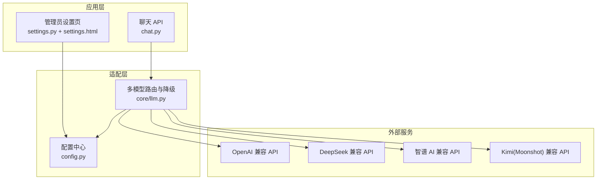
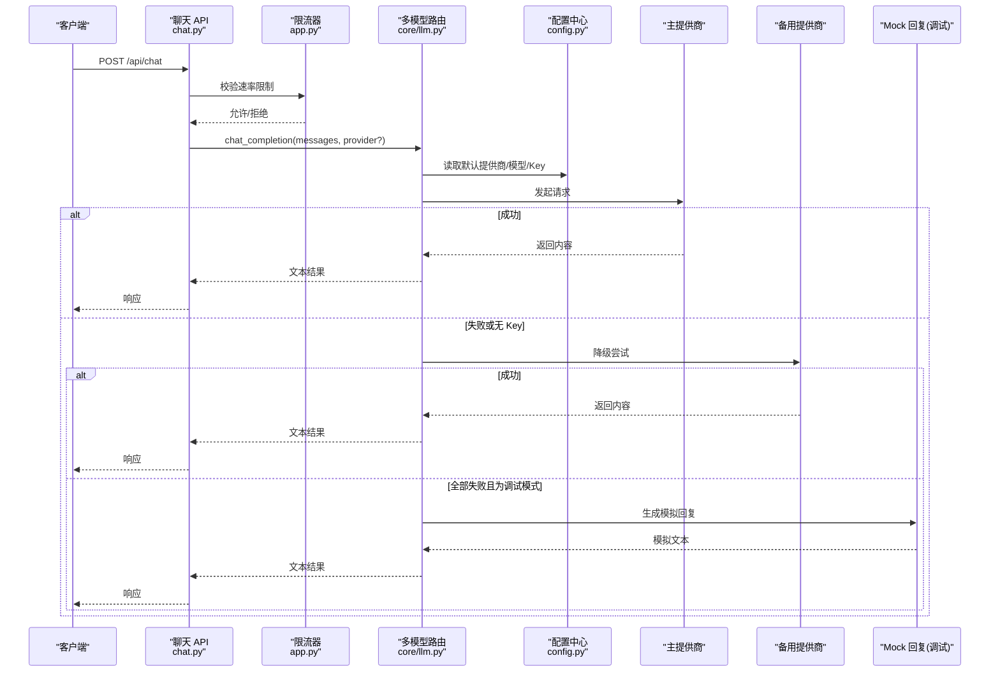
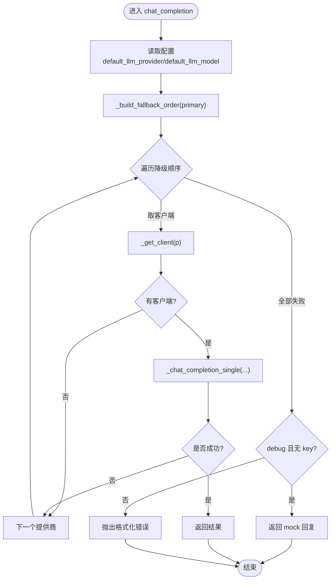
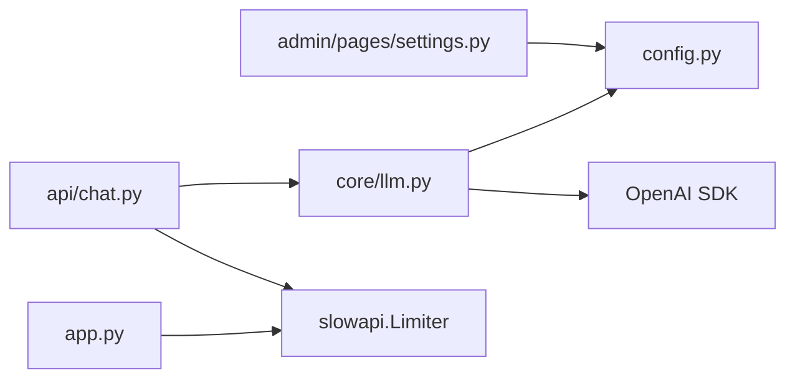

# LLM 适配器层

<cite>
**本文引用的文件**   
- [hushai/meditation/core/llm.py](file://hushai/meditation/core/llm.py)
- [hushai/meditation/config.py](file://hushai/meditation/config.py)
- [hushai/meditation/admin/pages/settings.py](file://hushai/meditation/admin/pages/settings.py)
- [hushai/meditation/admin/templates/settings.html](file://hushai/meditation/admin/templates/settings.html)
- [hushai/meditation/api/chat.py](file://hushai/meditation/api/chat.py)
- [hushai/meditation/app.py](file://hushai/meditation/app.py)
- [tests/meditation/test_llm_core.py](file://tests/meditation/test_llm_core.py)
</cite>

## 目录
1. [简介](#简介)
2. [项目结构](#项目结构)
3. [核心组件](#核心组件)
4. [架构总览](#架构总览)
5. [详细组件分析](#详细组件分析)
6. [依赖关系分析](#依赖关系分析)
7. [性能与可用性特性](#性能与可用性特性)
8. [故障排查指南](#故障排查指南)
9. [结论](#结论)
10. [附录：新提供商集成指南](#附录新提供商集成指南)

## 简介
本文件面向“LLM 适配器层”，聚焦多模型适配器的架构设计与实现，包括统一接口封装、提供商抽象层、自动降级机制、负载均衡与故障转移策略、配置管理、API 密钥管理与请求限流控制。同时提供新提供商接入的实操指南，帮助开发者快速扩展自定义适配器并注册到系统中。

## 项目结构
围绕 LLM 适配器层的关键代码位于以下模块：
- 多模型路由与降级：hushai/meditation/core/llm.py
- 配置加载与运行时更新：hushai/meditation/config.py
- 管理员设置页面（动态调整默认提供商、模型与各厂商 Key/Base URL）：hushai/meditation/admin/pages/settings.py 与 hushai/meditation/admin/templates/settings.html
- API 网关入口与限流：hushai/meditation/api/chat.py 与 hushai/meditation/app.py
- 单元测试覆盖降级顺序与 mock 行为：tests/meditation/test_llm_core.py

图表来源
- [hushai/meditation/api/chat.py:58-77](file://hushai/meditation/api/chat.py#L58-L77)
- [hushai/meditation/core/llm.py:1-258](file://hushai/meditation/core/llm.py#L1-L258)
- [hushai/meditation/config.py:1-136](file://hushai/meditation/config.py#L1-L136)
- [hushai/meditation/admin/pages/settings.py:40-123](file://hushai/meditation/admin/pages/settings.py#L40-L123)
- [hushai/meditation/admin/templates/settings.html:47-155](file://hushai/meditation/admin/templates/settings.html#L47-L155)

章节来源
- [hushai/meditation/core/llm.py:1-258](file://hushai/meditation/core/llm.py#L1-L258)
- [hushai/meditation/config.py:1-136](file://hushai/meditation/config.py#L1-L136)
- [hushai/meditation/admin/pages/settings.py:40-123](file://hushai/meditation/admin/pages/settings.py#L40-L123)
- [hushai/meditation/admin/templates/settings.html:47-155](file://hushai/meditation/admin/templates/settings.html#L47-L155)
- [hushai/meditation/api/chat.py:58-77](file://hushai/meditation/api/chat.py#L58-L77)
- [hushai/meditation/app.py:10-21](file://hushai/meditation/app.py#L10-L21)

## 核心组件
- 多模型路由与降级器
  - 负责根据配置选择主提供商，并在失败时按既定顺序尝试其他提供商，支持同步与流式两种调用路径。
  - 暴露统一接口 chat_completion 与 chat_completion_stream，屏蔽底层差异。
- 配置中心
  - 从环境变量加载运行时配置，支持在运行期通过管理员页面更新默认提供商、模型与各厂商 Key/Base URL。
  - 提供 llm_providers 字段以支持任意扩展的第三方提供商字典注入。
- 管理员设置界面
  - 提供可视化表单维护默认提供商、默认模型以及各厂商的 API Key、Base URL 与模型名。
- API 网关与限流
  - 在聊天接口上启用基于客户端 IP 的请求限流，保护后端与上游 LLM 服务。

章节来源
- [hushai/meditation/core/llm.py:1-258](file://hushai/meditation/core/llm.py#L1-L258)
- [hushai/meditation/config.py:1-136](file://hushai/meditation/config.py#L1-L136)
- [hushai/meditation/admin/pages/settings.py:40-123](file://hushai/meditation/admin/pages/settings.py#L40-L123)
- [hushai/meditation/admin/templates/settings.html:47-155](file://hushai/meditation/admin/templates/settings.html#L47-L155)
- [hushai/meditation/api/chat.py:58-77](file://hushai/meditation/api/chat.py#L58-L77)
- [hushai/meditation/app.py:10-21](file://hushai/meditation/app.py#L10-L21)

## 架构总览
下图展示了从 API 请求到 LLM 提供商调用的完整链路，包含自动降级与限流。

图表来源
- [hushai/meditation/api/chat.py:58-77](file://hushai/meditation/api/chat.py#L58-L77)
- [hushai/meditation/app.py:10-21](file://hushai/meditation/app.py#L10-L21)
- [hushai/meditation/core/llm.py:136-178](file://hushai/meditation/core/llm.py#L136-L178)
- [hushai/meditation/config.py:18-52](file://hushai/meditation/config.py#L18-L52)

## 详细组件分析

### 多模型路由与降级器（core/llm.py）
- 统一接口
  - chat_completion：非流式调用，返回字符串。
  - chat_completion_stream：流式调用，异步生成器逐块产出内容。
- 提供商初始化与缓存
  - _init_providers：首次访问时从配置中构建内置提供商映射（openai、deepseek、zhipu、kimi），并合并用户自定义的 llm_providers。
- 客户端获取与模型解析
  - _get_client：根据提供商名称返回 AsyncOpenAI 客户端；若处于 debug 且缺少 API Key，则返回 None，由上层走 mock 分支。
  - _get_model：解析提供商对应模型名，未配置时回退到默认值。
- 降级顺序
  - _build_fallback_order：将主提供商置于首位，其余按 DEFAULT_PROVIDER_ORDER 补齐并去重，形成稳定可预测的降级序列。
- 单次调用与流式调用
  - _chat_completion_single：对单个提供商发起一次请求，失败返回 None 以便继续降级。
  - _stream_single：流式迭代 chunk，失败抛出异常由外层捕获驱动降级。
- 错误处理
  - 使用 format_openai_error 将 SDK 异常转换为可读中文提示，便于前端展示与排障。

图表来源
- [hushai/meditation/core/llm.py:82-91](file://hushai/meditation/core/llm.py#L82-L91)
- [hushai/meditation/core/llm.py:113-134](file://hushai/meditation/core/llm.py#L113-L134)
- [hushai/meditation/core/llm.py:136-178](file://hushai/meditation/core/llm.py#L136-L178)

章节来源
- [hushai/meditation/core/llm.py:1-258](file://hushai/meditation/core/llm.py#L1-L258)

### 配置管理（config.py）
- 数据模型
  - MeditationConfig：包含默认提供商、默认模型、各厂商 API Key/Base URL/Model、调试开关等。
- 环境变量映射
  - from_env：从 MEDITATION_* 前缀的环境变量加载配置，支持布尔与整型转换。
- 运行时更新
  - set_config/reset_config：用于测试与管理员页面热更新配置。
- 扩展点
  - llm_providers：dict[str, dict[str, str]]，可在运行时注入任意自定义提供商配置，被 _init_providers 合并入全局 _providers。

章节来源
- [hushai/meditation/config.py:1-136](file://hushai/meditation/config.py#L1-L136)

### 管理员设置页面（settings.py + settings.html）
- 功能
  - 提供 Web 表单修改默认提供商、默认模型及各厂商 API Key/Base URL/模型。
  - 提交后通过 replace 构造新配置对象并 set_config，立即生效。
- 支持的提供商
  - OpenAI、DeepSeek、智谱 AI、Kimi（Moonshot）。
- 界面字段
  - 默认 LLM 提供商、默认模型名称、记忆检索 Top-K、知识检索 Top-K、对话最大轮次等。
  - 各厂商分节：API Key、Base URL、模型。

章节来源
- [hushai/meditation/admin/pages/settings.py:40-123](file://hushai/meditation/admin/pages/settings.py#L40-L123)
- [hushai/meditation/admin/templates/settings.html:47-155](file://hushai/meditation/admin/templates/settings.html#L47-L155)

### API 网关与限流（chat.py + app.py）
- 限流器
  - 使用 slowapi.Limiter 基于客户端 IP 进行限流，并在应用中注册 RateLimitExceeded 处理器。
- 聊天接口
  - @limiter.limit("30/minute") 限制每个端点的每分钟请求数，超限将触发限流异常。
- 路由挂载
  - create_app 中将 chat_router 与其他路由一并挂载至 FastAPI 应用。

章节来源
- [hushai/meditation/api/chat.py:58-77](file://hushai/meditation/api/chat.py#L58-L77)
- [hushai/meditation/app.py:10-21](file://hushai/meditation/app.py#L10-L21)
- [hushai/meditation/app.py:136-180](file://hushai/meditation/app.py#L136-L180)

### 单元测试（test_llm_core.py）
- 验证要点
  - 降级顺序正确且去重，主提供商优先。
  - 流式降级通过 try/except 驱动，修复了 generator 语义陷阱。
  - debug 且无 key 时走 mock 分支，不报错。
- 测试夹具
  - 通过 set_config 注入各厂商 Key，并重置 providers 缓存确保隔离。

章节来源
- [tests/meditation/test_llm_core.py:1-45](file://tests/meditation/test_llm_core.py#L1-L45)
- [tests/meditation/test_llm_core.py:113-168](file://tests/meditation/test_llm_core.py#L113-L168)

## 依赖关系分析
- 耦合与内聚
  - core/llm.py 仅依赖 config.py 与 OpenAI SDK，职责单一，内聚度高。
  - admin 页面与 config.py 通过 set_config 解耦，避免直接读写全局状态。
  - API 层通过装饰器引入限流，与业务逻辑低耦合。
- 外部依赖
  - OpenAI SDK（AsyncOpenAI）作为统一客户端抽象，所有提供商均遵循 Chat Completions 协议。
  - slowapi 提供限流能力。
- 潜在循环依赖
  - 当前未见循环导入；_init_providers 仅在首次访问时执行，避免重复初始化。

图表来源
- [hushai/meditation/core/llm.py:1-258](file://hushai/meditation/core/llm.py#L1-L258)
- [hushai/meditation/config.py:1-136](file://hushai/meditation/config.py#L1-L136)
- [hushai/meditation/api/chat.py:58-77](file://hushai/meditation/api/chat.py#L58-L77)
- [hushai/meditation/app.py:10-21](file://hushai/meditation/app.py#L10-L21)

## 性能与可用性特性
- 自动降级与故障转移
  - 非流式：逐个提供商尝试，首个成功即返回；全部失败且在 debug 模式下返回 mock 回复。
  - 流式：在迭代过程中捕获异常，切换到下一个提供商继续输出；若无可用提供商且为 debug，则输出 mock 流。
- 负载均衡
  - 当前采用固定顺序的串行降级策略，未实现加权或轮询。可通过扩展 _build_fallback_order 或引入权重策略实现更复杂的负载分配。
- 超时与重试
  - 客户端创建时设置 timeout（debug 更长），但未显式启用 SDK 级重试；建议在需要时结合 SDK max_retries 参数提升鲁棒性。
- 限流保护
  - 接口级限流防止突发流量冲击上游 LLM 服务，建议结合业务指标动态调整阈值。

[本节为通用指导，无需列出具体文件来源]

## 故障排查指南
- 常见错误与定位
  - 未配置 API Key：在 _get_client 中会抛出运行时错误或在 debug 下返回 None 走 mock。
  - 连接/超时/鉴权/权限/服务端错误：通过 format_openai_error 转换为中文提示，便于前端展示。
  - 限流触发：RateLimitExceeded 异常由应用统一处理器返回标准响应。
- 排查步骤
  - 检查管理员设置页面是否正确填写各厂商 Key/Base URL/模型。
  - 确认默认提供商与模型名称有效。
  - 查看日志中的 fallback 记录，确认降级路径是否符合预期。
  - 在 debug 模式下观察 mock 行为，验证流程连通性。

章节来源
- [hushai/meditation/core/llm.py:59-71](file://hushai/meditation/core/llm.py#L59-L71)
- [hushai/meditation/core/llm.py:169-178](file://hushai/meditation/core/llm.py#L169-L178)
- [hushai/meditation/app.py:145-147](file://hushai/meditation/app.py#L145-L147)

## 结论
该 LLM 适配器层通过统一的 OpenAI 兼容接口抽象，实现了多提供商的无缝切换与自动降级，配合管理员页面的运行时配置与接口级限流，提供了高可用与易运维的对话能力。未来可在负载均衡、重试策略、指标观测等方面进一步增强。

[本节为总结性内容，无需列出具体文件来源]

## 附录：新提供商集成指南
目标：在不改动核心路由逻辑的前提下，新增一个自定义 LLM 提供商并注册到系统。

步骤
- 准备提供商配置
  - 在环境变量或管理员设置页面中补充新提供商的 API Key、Base URL 与模型名。
  - 若需动态注入，可在运行时通过 set_config 更新配置对象的 llm_providers 字段，格式为 {name: {api_key, base_url, model}}。
- 注册到系统
  - 当 llm_providers 存在时，_init_providers 会自动将其合并进全局 _providers 字典，无需修改路由逻辑。
- 指定默认或按需调用
  - 通过 default_llm_provider 指定默认提供商；或在调用 chat_completion/chat_completion_stream 时传入 provider 参数选择特定提供商。
- 验证与测试
  - 使用管理员设置页面保存后立即生效。
  - 通过单元测试思路验证：设置配置、重置 providers 缓存、断言降级顺序与 mock 行为。

注意事项
- 确保 Base URL 遵循 OpenAI Chat Completions 协议，否则可能引发不可预期的错误。
- 在 debug 模式下若未配置 Key，系统将走 mock 分支，不影响开发联调。
- 如需更复杂的负载均衡策略，可扩展 _build_fallback_order 或引入新的调度器。

章节来源
- [hushai/meditation/config.py:51-52](file://hushai/meditation/config.py#L51-L52)
- [hushai/meditation/core/llm.py:21-51](file://hushai/meditation/core/llm.py#L21-L51)
- [hushai/meditation/admin/pages/settings.py:99-118](file://hushai/meditation/admin/pages/settings.py#L99-L118)
- [tests/meditation/test_llm_core.py:21-38](file://tests/meditation/test_llm_core.py#L21-L38)