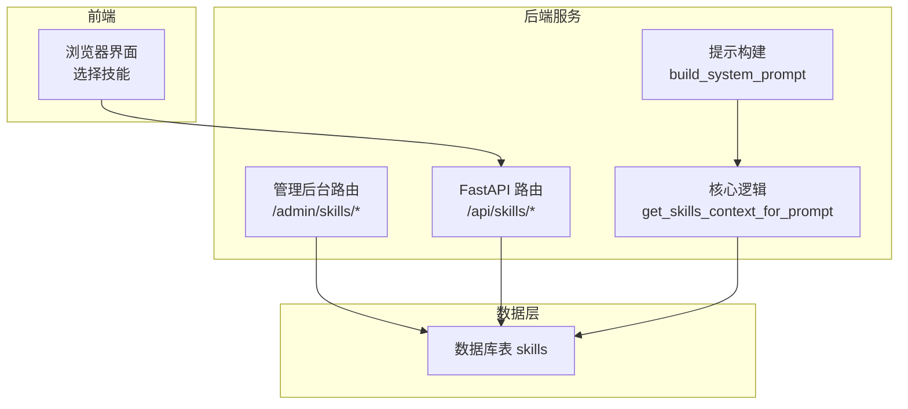
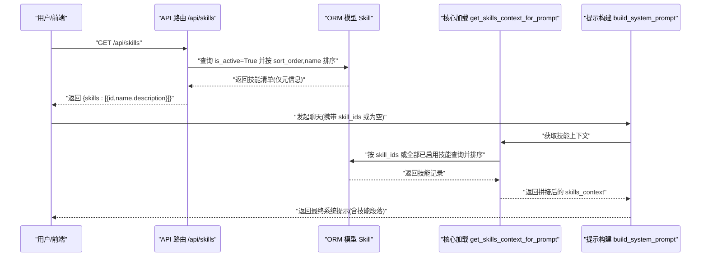
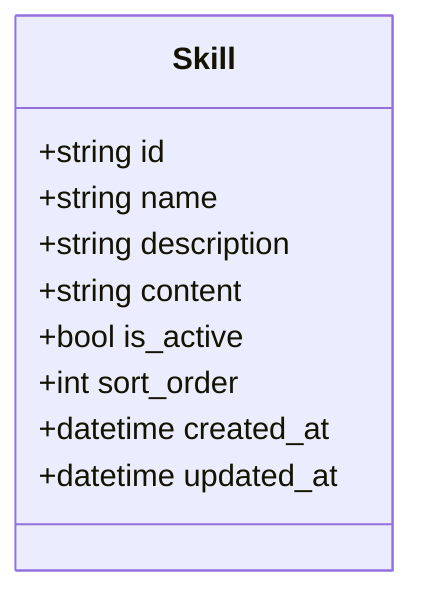
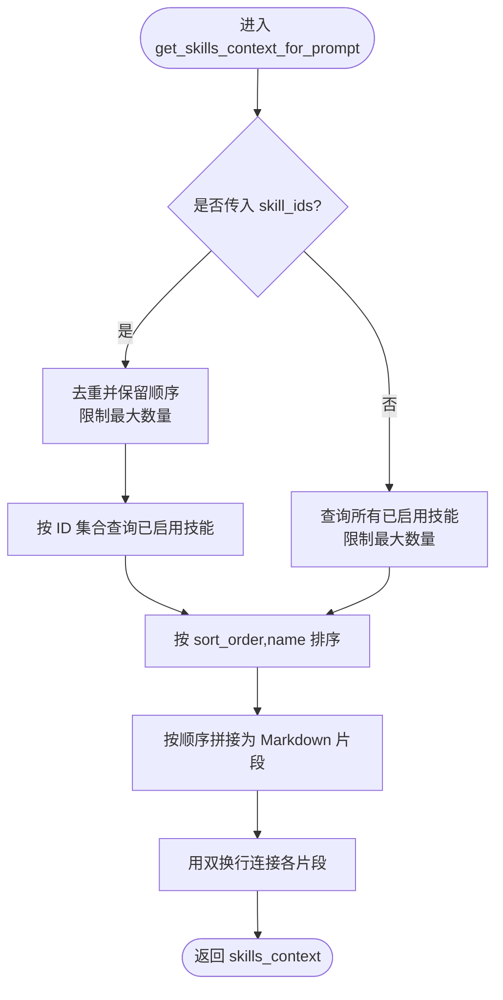
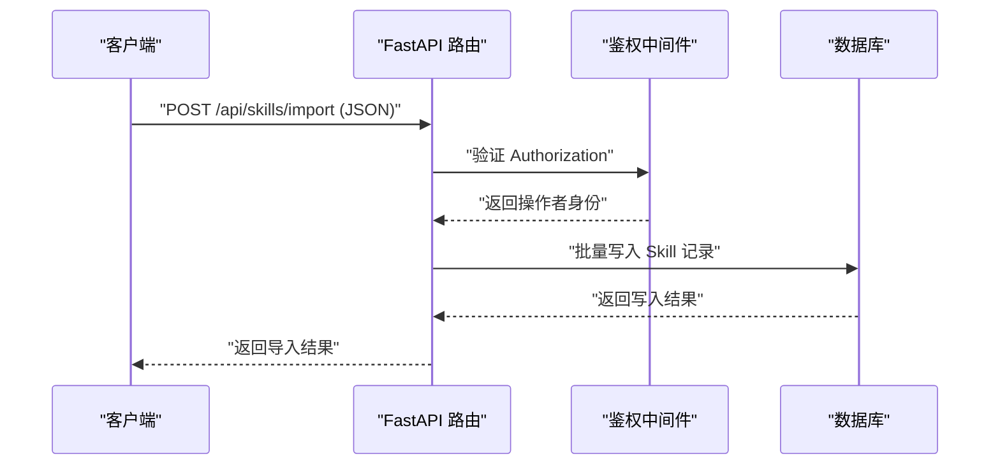
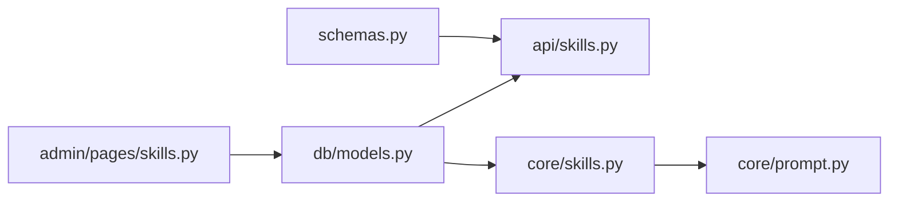

# 技能插件系统

<cite>
**本文引用的文件**
- [hushai/meditation/core/skills.py](file://hushai/meditation/core/skills.py)
- [hushai/meditation/db/models.py](file://hushai/meditation/db/models.py)
- [hushai/meditation/api/skills.py](file://hushai/meditation/api/skills.py)
- [hushai/meditation/admin/pages/skills.py](file://hushai/meditation/admin/pages/skills.py)
- [hushai/meditation/schemas.py](file://hushai/meditation/schemas.py)
- [hushai/meditation/core/prompt.py](file://hushai/meditation/core/prompt.py)
- [knowledge/open-cognition/templates/skill-template.md](file://knowledge/open-cognition/templates/skill-template.md)
- [knowledge/open-cognition/skills/aesthetics-frameworks/art-criticism-framework/SKILL.md](file://knowledge/open-cognition/skills/aesthetics-frameworks/art-criticism-framework/SKILL.md)
- [tests/meditation/test_core.py](file://tests/meditation/test_core.py)
</cite>

## 目录
1. [简介](#简介)
2. [项目结构](#项目结构)
3. [核心组件](#核心组件)
4. [架构总览](#架构总览)
5. [详细组件分析](#详细组件分析)
6. [依赖关系分析](#依赖关系分析)
7. [性能与限制](#性能与限制)
8. [故障排查指南](#故障排查指南)
9. [结论](#结论)
10. [附录：SKILL.md 规范与开发指南](#附录skillmd-规范与开发指南)

## 简介
本文件系统化阐述“技能插件系统”的设计与实现，覆盖以下关键主题：
- 技能的发现机制、加载策略与生命周期管理
- SKILL.md 规范定义（文件结构、元数据格式、内容组织）
- 动态加载、启用/禁用控制与排序机制
- 技能上下文构建过程（如何将多个技能内容整合到系统提示中）
- 技能开发指南（创建自定义技能、编写 SKILL.md、测试技能功能）

该系统以数据库为持久化层，通过 API 与管理后台进行增删改查与批量导入；在对话时按用户选择或默认策略动态拼装“技能上下文”，注入到模型的系统提示中。

## 项目结构
围绕技能插件系统的核心代码分布在如下模块：
- 领域模型与持久化：Skill ORM 模型
- 运行时加载与上下文拼装：get_skills_context_for_prompt
- 对外 API：列出活跃技能、批量导入（JSON/文件）
- 管理后台：列表、新建、编辑、删除、导入页面
- 请求/响应模式：Pydantic 校验与约束
- 系统提示组装：将技能上下文拼入最终 prompt
- 知识侧 SKILL.md 模板与示例：用于指导技能内容创作

图表来源
- [hushai/meditation/api/skills.py:1-113](file://hushai/meditation/api/skills.py#L1-L113)
- [hushai/meditation/admin/pages/skills.py:1-218](file://hushai/meditation/admin/pages/skills.py#L1-L218)
- [hushai/meditation/core/skills.py:1-59](file://hushai/meditation/core/skills.py#L1-L59)
- [hushai/meditation/core/prompt.py:77-103](file://hushai/meditation/core/prompt.py#L77-L103)
- [hushai/meditation/db/models.py:120-135](file://hushai/meditation/db/models.py#L120-L135)

章节来源
- [hushai/meditation/api/skills.py:1-113](file://hushai/meditation/api/skills.py#L1-L113)
- [hushai/meditation/admin/pages/skills.py:1-218](file://hushai/meditation/admin/pages/skills.py#L1-L218)
- [hushai/meditation/core/skills.py:1-59](file://hushai/meditation/core/skills.py#L1-L59)
- [hushai/meditation/core/prompt.py:77-103](file://hushai/meditation/core/prompt.py#L77-L103)
- [hushai/meditation/db/models.py:120-135](file://hushai/meditation/db/models.py#L120-L135)

## 核心组件
- 数据模型 Skill：包含 id、name、description、content、is_active、sort_order 等字段，作为技能的最小可装配单元。
- 运行时加载器 get_skills_context_for_prompt：根据 skill_ids 或全部已启用技能，按 sort_order 与 name 排序，拼接成系统提示中的“技能上下文”。
- API 接口：
  - GET /api/skills：返回所有 is_active=True 的技能清单（仅公开元信息）。
  - POST /api/skills/import：批量导入技能（支持 JSON 或上传 JSON 文件），需管理员或用户 JWT。
- 管理后台：提供技能列表、新建、编辑、删除与导入页面，统一维护技能内容与状态。
- 提示构建：build_system_prompt 将 skills_context 插入到系统提示的固定段落位置。
- 模式与约束：schemas.py 对输入进行严格校验，包括去重、长度上限、批大小限制等。

章节来源
- [hushai/meditation/db/models.py:120-135](file://hushai/meditation/db/models.py#L120-L135)
- [hushai/meditation/core/skills.py:1-59](file://hushai/meditation/core/skills.py#L1-L59)
- [hushai/meditation/api/skills.py:1-113](file://hushai/meditation/api/skills.py#L1-L113)
- [hushai/meditation/admin/pages/skills.py:1-218](file://hushai/meditation/admin/pages/skills.py#L1-L218)
- [hushai/meditation/core/prompt.py:77-103](file://hushai/meditation/core/prompt.py#L77-L103)
- [hushai/meditation/schemas.py:162-218](file://hushai/meditation/schemas.py#L162-L218)

## 架构总览
下图展示了从“用户选择技能”到“系统提示注入”的端到端流程，以及管理后台与 API 的交互路径。

图表来源
- [hushai/meditation/api/skills.py:47-58](file://hushai/meditation/api/skills.py#L47-L58)
- [hushai/meditation/core/skills.py:14-59](file://hushai/meditation/core/skills.py#L14-L59)
- [hushai/meditation/core/prompt.py:77-103](file://hushai/meditation/core/prompt.py#L77-L103)
- [hushai/meditation/db/models.py:120-135](file://hushai/meditation/db/models.py#L120-L135)

## 详细组件分析

### 数据模型与存储
- 表名：skills
- 关键字段：
  - id：主键
  - name：名称（最大长度限制由上层校验）
  - description：前台展示摘要（最大长度限制由上层校验）
  - content：注入模型的正文（Markdown 文本）
  - is_active：是否启用
  - sort_order：排序权重（越小越靠前）
  - created_at/updated_at：时间戳

图表来源
- [hushai/meditation/db/models.py:120-135](file://hushai/meditation/db/models.py#L120-L135)

章节来源
- [hushai/meditation/db/models.py:120-135](file://hushai/meditation/db/models.py#L120-L135)

### 运行时加载与上下文拼装
- 当传入 skill_ids 时：
  - 去重并保留首次出现顺序
  - 最多取 MAX_SKILLS_PER_MESSAGE 个
  - 仅加载 is_active=True 的记录
  - 按 sort_order 升序、name 升序排序
  - 按指定 ID 顺序输出对应片段
- 当未传 skill_ids 时：
  - 加载所有 is_active=True 的技能
  - 按 sort_order 升序、name 升序排序
  - 最多取 MAX_SKILLS_PER_MESSAGE 个
- 输出格式：每个技能以二级标题开头，后跟其 content 正文，片段之间以空行分隔。

图表来源
- [hushai/meditation/core/skills.py:14-59](file://hushai/meditation/core/skills.py#L14-L59)

章节来源
- [hushai/meditation/core/skills.py:1-59](file://hushai/meditation/core/skills.py#L1-L59)

### API 与权限控制
- GET /api/skills：返回所有已启用技能的元信息（id、name、description），按 sort_order 与 name 排序。
- POST /api/skills/import：
  - 支持两种形式：顶层数组或 {"skills": [...]}
  - 每条记录包含 name、description、content、sort_order、is_active
  - 自动裁剪过长字段（如 description 最长 512，name 最长 128）
  - 需要 Authorization 头，支持管理员 JWT 或普通用户 JWT
- POST /api/skills/import-file：接收 JSON 文件，解析后复用 import 逻辑。

图表来源
- [hushai/meditation/api/skills.py:61-112](file://hushai/meditation/api/skills.py#L61-L112)
- [hushai/meditation/schemas.py:172-218](file://hushai/meditation/schemas.py#L172-L218)

章节来源
- [hushai/meditation/api/skills.py:1-113](file://hushai/meditation/api/skills.py#L1-L113)
- [hushai/meditation/schemas.py:162-218](file://hushai/meditation/schemas.py#L162-L218)

### 管理后台能力
- 列表页：分页、搜索（名称/描述模糊匹配）、按 sort_order 与创建时间排序。
- 新建/编辑：表单校验（名称与正文必填），保存时截断超长字段。
- 删除：按 ID 删除记录。
- 导入页：提供批量导入入口。

章节来源
- [hushai/meditation/admin/pages/skills.py:1-218](file://hushai/meditation/admin/pages/skills.py#L1-L218)

### 系统提示集成
- build_system_prompt 将 skills_context 插入到固定段落“当前加持的技能指引”中。
- 若未传入 skill_ids，则默认加载所有已启用技能（受最大数量限制）。
- 测试用例覆盖了“自动挂载”和“不挂载”的场景。

章节来源
- [hushai/meditation/core/prompt.py:77-103](file://hushai/meditation/core/prompt.py#L77-L103)
- [tests/meditation/test_core.py:71-93](file://tests/meditation/test_core.py#L71-L93)

## 依赖关系分析
- API 层依赖：
  - FastAPI 路由与 Pydantic 模型（schemas.py）
  - 数据库会话（SQLAlchemy AsyncSession）
  - 认证工具（管理员/用户 JWT）
- 核心层依赖：
  - SQLAlchemy 查询构造
  - 常量 MAX_SKILLS_PER_MESSAGE、MAX_SKILLS_IMPORT_BATCH
- 提示构建层依赖：
  - 核心层提供的 skills_context
  - 其他上下文（记忆、知识库、场景、教师风格）

图表来源
- [hushai/meditation/schemas.py:162-218](file://hushai/meditation/schemas.py#L162-L218)
- [hushai/meditation/api/skills.py:1-113](file://hushai/meditation/api/skills.py#L1-L113)
- [hushai/meditation/db/models.py:120-135](file://hushai/meditation/db/models.py#L120-L135)
- [hushai/meditation/core/skills.py:1-59](file://hushai/meditation/core/skills.py#L1-L59)
- [hushai/meditation/core/prompt.py:77-103](file://hushai/meditation/core/prompt.py#L77-L103)
- [hushai/meditation/admin/pages/skills.py:1-218](file://hushai/meditation/admin/pages/skills.py#L1-L218)

章节来源
- [hushai/meditation/schemas.py:162-218](file://hushai/meditation/schemas.py#L162-L218)
- [hushai/meditation/api/skills.py:1-113](file://hushai/meditation/api/skills.py#L1-L113)
- [hushai/meditation/db/models.py:120-135](file://hushai/meditation/db/models.py#L120-L135)
- [hushai/meditation/core/skills.py:1-59](file://hushai/meditation/core/skills.py#L1-L59)
- [hushai/meditation/core/prompt.py:77-103](file://hushai/meditation/core/prompt.py#L77-L103)
- [hushai/meditation/admin/pages/skills.py:1-218](file://hushai/meditation/admin/pages/skills.py#L1-L218)

## 性能与限制
- 每消息最大技能数：MAX_SKILLS_PER_MESSAGE（默认 8），避免提示过长。
- 批量导入上限：MAX_SKILLS_IMPORT_BATCH（默认 100），防止单次写入过大。
- 排序策略：先按 sort_order 升序，再按 name 升序，保证稳定顺序。
- 前端选择限制：前端会限制最多选择 SKILL_MAX 项（具体数值由前端常量决定），并在本地缓存选中 ID。

章节来源
- [hushai/meditation/core/skills.py:10-11](file://hushai/meditation/core/skills.py#L10-L11)
- [hushai/meditation/schemas.py:24-51](file://hushai/meditation/schemas.py#L24-L51)
- [hushai/meditation/static/index.html:1326-1366](file://hushai/meditation/static/index.html#L1326-L1366)

## 故障排查指南
- 导入失败（400）：检查 JSON 结构与字段长度是否符合 schemas 校验规则。
- 鉴权失败（401）：确认 Authorization 头是否正确传递，且 token 有效。
- 技能未生效：
  - 确认 is_active=True
  - 确认 skill_ids 未被前端过滤或重复剔除
  - 确认排序字段 sort_order 设置合理
- 提示过长：减少所选技能数量或精简 content 内容。

章节来源
- [hushai/meditation/api/skills.py:93-112](file://hushai/meditation/api/skills.py#L93-L112)
- [hushai/meditation/schemas.py:172-218](file://hushai/meditation/schemas.py#L172-L218)
- [hushai/meditation/core/skills.py:14-59](file://hushai/meditation/core/skills.py#L14-L59)

## 结论
技能插件系统以“数据库驱动 + 运行时拼装”的方式实现了灵活可控的技能注入。通过明确的排序与启用控制、严格的输入校验与批处理上限，系统在易用性与稳定性之间取得平衡。结合 SKILL.md 规范，开发者可以高效产出高质量技能内容，并通过管理后台或 API 快速上线。

## 附录：SKILL.md 规范与开发指南

### SKILL.md 规范定义
- 文件位置：建议置于 knowledge/open-cognition/skills/<domain>/<skill-id>/SKILL.md
- Frontmatter 元数据（YAML）：
  - name：技能唯一标识
  - description：一句话说明功能与触发场景
  - domain：所属领域（如 philosophy、religion、sociology、psychology）
  - linked_thinker：关联思想家文档相对路径
  - linked_concepts：关联概念文档相对路径列表
  - tags：主题标签列表
- 正文结构建议：
  - 一句话功能
  - 何时使用 / 何时不使用
  - 理论基础
  - 操作流程（分步骤说明）
  - 完整示例（输入场景、应用过程、输出）
  - 反例（误用与正确做法）
  - 关联条目（思想家、概念、相关技能）

章节来源
- [knowledge/open-cognition/templates/skill-template.md:1-76](file://knowledge/open-cognition/templates/skill-template.md#L1-L76)
- [knowledge/open-cognition/skills/aesthetics-frameworks/art-criticism-framework/SKILL.md:1-102](file://knowledge/open-cognition/skills/aesthetics-frameworks/art-criticism-framework/SKILL.md#L1-L102)

### 技能动态加载与排序机制
- 动态加载：
  - 若请求携带 skill_ids：按指定顺序加载对应已启用技能
  - 否则：加载所有已启用技能，受最大数量限制
- 排序机制：
  - 优先按 sort_order 升序
  - 其次按 name 升序
- 启用/禁用：
  - 通过 is_active 控制是否参与加载
  - 管理后台与 API 均支持修改该字段

章节来源
- [hushai/meditation/core/skills.py:14-59](file://hushai/meditation/core/skills.py#L14-L59)
- [hushai/meditation/api/skills.py:47-58](file://hushai/meditation/api/skills.py#L47-L58)
- [hushai/meditation/admin/pages/skills.py:155-195](file://hushai/meditation/admin/pages/skills.py#L155-L195)

### 技能上下文构建与提示注入
- 构建过程：
  - 调用 get_skills_context_for_prompt 生成 skills_context
  - 将 skills_context 插入到 build_system_prompt 的“当前加持的技能指引”段落
- 注意事项：
  - 控制最大数量，避免提示过长
  - 确保 content 为清晰、结构化、可直接被模型遵循的指引

章节来源
- [hushai/meditation/core/skills.py:14-59](file://hushai/meditation/core/skills.py#L14-L59)
- [hushai/meditation/core/prompt.py:77-103](file://hushai/meditation/core/prompt.py#L77-L103)

### 开发指南：如何创建自定义技能
- 准备内容：
  - 依据 SKILL.md 模板撰写内容，明确适用场景与操作步骤
  - 补充 Frontmatter 元数据，建立与理论条目的互链
- 入库方式：
  - 管理后台：新建/编辑表单直接录入
  - API 导入：使用 /api/skills/import 或 /api/skills/import-file 批量导入
- 发布与验证：
  - 设置 is_active=True 与合适的 sort_order
  - 在前端选择该技能或在聊天请求中传入 skill_ids
  - 观察系统提示中是否包含该技能段落，并进行效果评估

章节来源
- [knowledge/open-cognition/templates/skill-template.md:1-76](file://knowledge/open-cognition/templates/skill-template.md#L1-L76)
- [hushai/meditation/admin/pages/skills.py:92-129](file://hushai/meditation/admin/pages/skills.py#L92-L129)
- [hushai/meditation/api/skills.py:61-112](file://hushai/meditation/api/skills.py#L61-L112)
- [hushai/meditation/core/prompt.py:77-103](file://hushai/meditation/core/prompt.py#L77-L103)

### 测试技能功能
- 单元测试要点：
  - 验证 skill_ids=None 时自动挂载
  - 验证 skill_ids=[] 时不挂载
  - 验证多段内容组合与顺序
- 参考测试用例：
  - 自动挂载与不挂载行为
  - 系统提示各段落组合

章节来源
- [tests/meditation/test_core.py:71-93](file://tests/meditation/test_core.py#L71-L93)