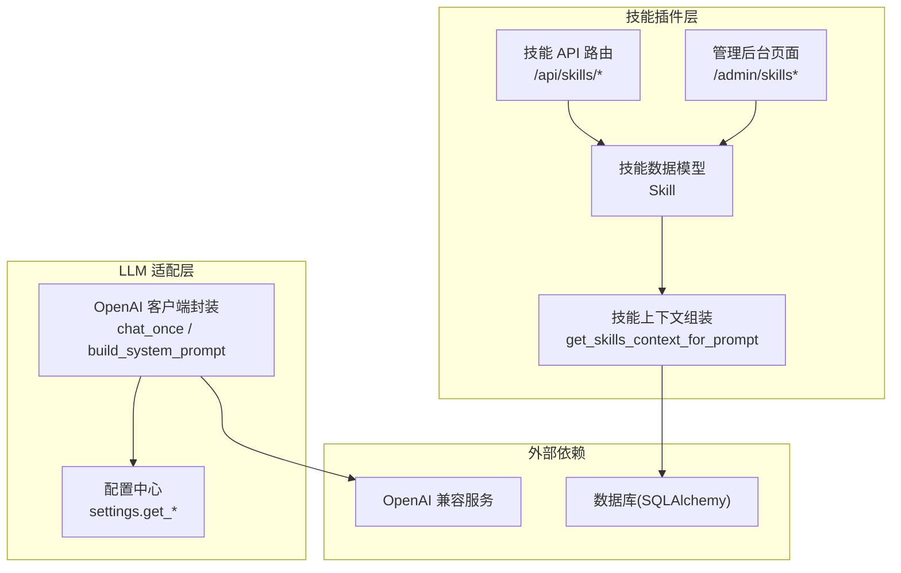
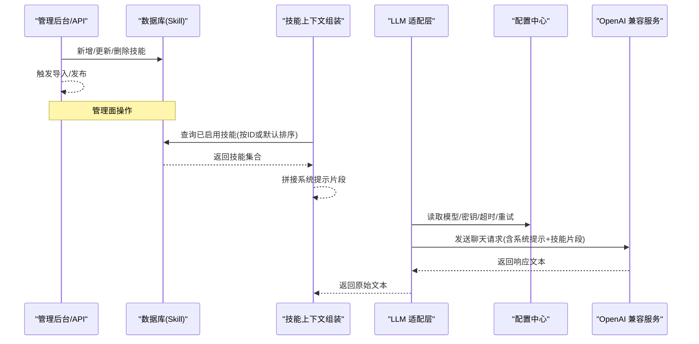
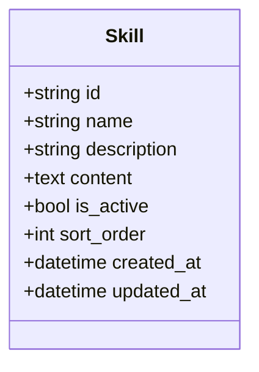
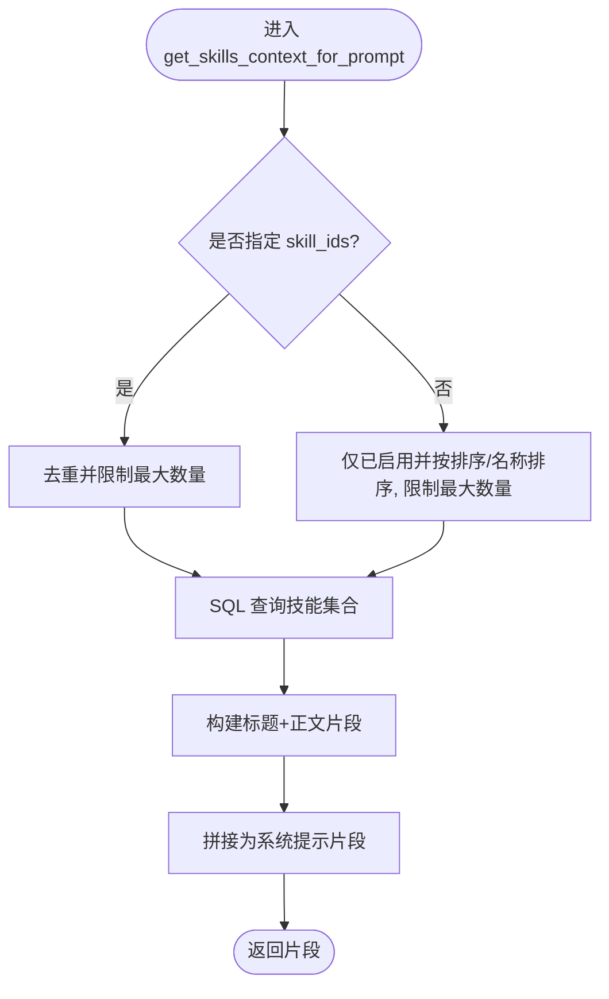
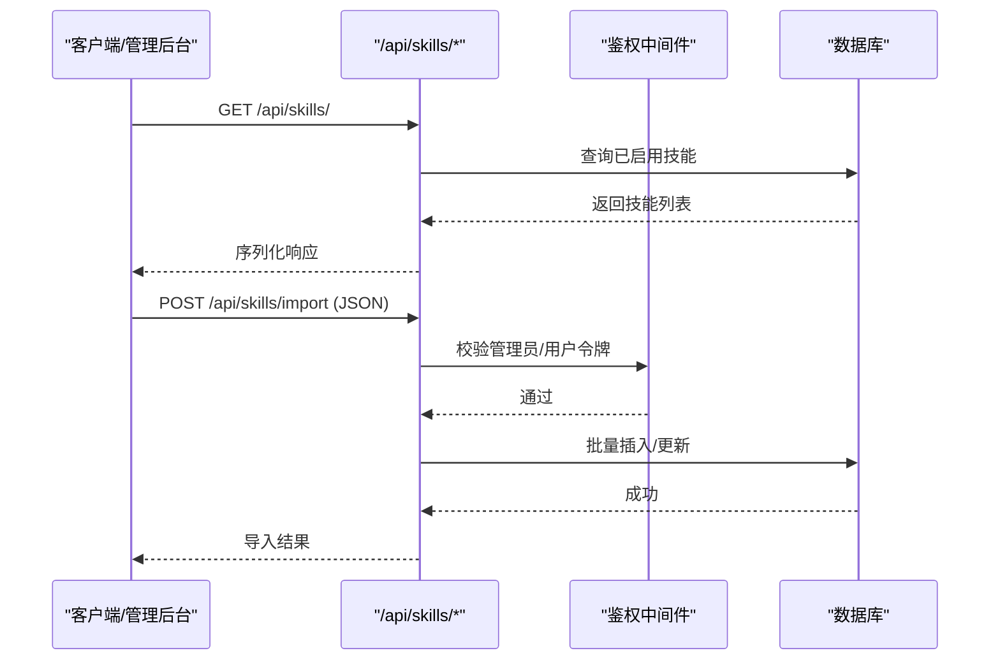
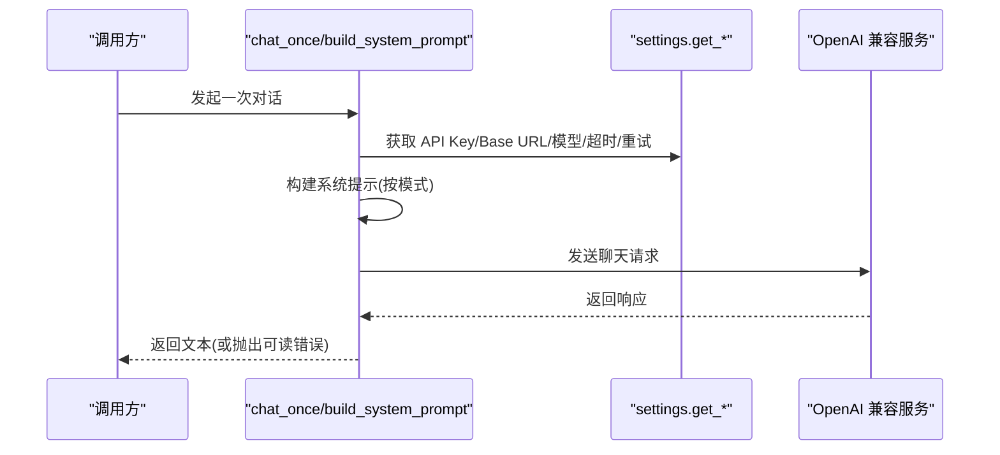
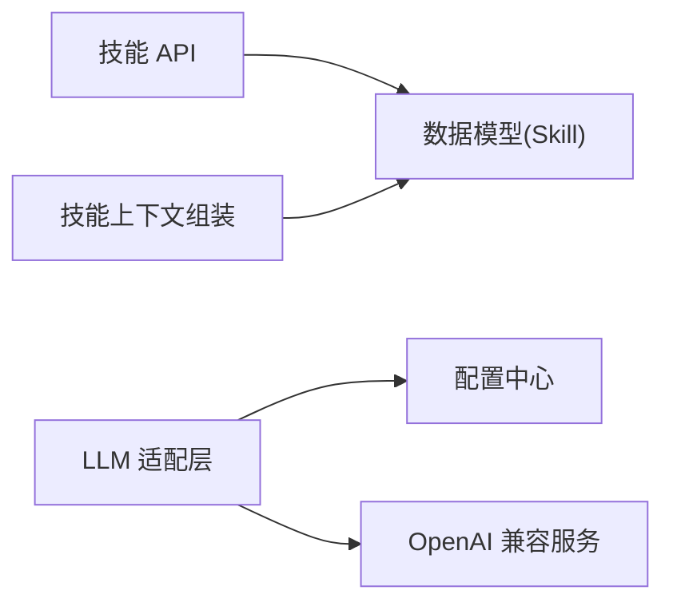

# 插件架构设计

<cite>
**本文引用的文件**   
- [hushai/meditation/core/skills.py](file://hushai/meditation/core/skills.py)
- [hushai/meditation/api/skills.py](file://hushai/meditation/api/skills.py)
- [hushai/meditation/admin/pages/skills.py](file://hushai/meditation/admin/pages/skills.py)
- [hushai/meditation/db/models.py](file://hushai/meditation/db/models.py)
- [hushai/settings.py](file://hushai/settings.py)
- [hushai/llm.py](file://hushai/llm.py)
- [skills-lock.json](file://skills-lock.json)
- [knowledge/open-cognition/skills/aesthetics-frameworks/art-criticism-framework/SKILL.md](file://knowledge/open-cognition/skills/aesthetics-frameworks/art-criticism-framework/SKILL.md)
</cite>

## 目录
1. [引言](#引言)
2. [项目结构](#项目结构)
3. [核心组件](#核心组件)
4. [架构总览](#架构总览)
5. [详细组件分析](#详细组件分析)
6. [依赖关系分析](#依赖关系分析)
7. [性能与扩展性](#性能与扩展性)
8. [故障排查指南](#故障排查指南)
9. [结论](#结论)
10. [附录：SKILL.md 规范与开发指南](#附录skillmd-规范与开发指南)

## 引言
本文件围绕“技能插件系统”的架构设计与实现进行系统化说明，覆盖以下关键主题：
- 插件发现机制、加载策略与生命周期管理（以“技能”为最小可插拔单元）
- SKILL.md 规范定义、插件接口标准与扩展点设计
- 多 LLM 提供商适配器的统一封装与配置
- 插件热重载、版本管理与依赖解析机制的现状与建议
- 插件开发指南与最佳实践，包括自定义技能与适配器的创建方法

## 项目结构
本项目将“技能”作为可注入系统提示的插件单元，通过数据库持久化、API 暴露与管理后台维护。LLM 调用层提供统一的 OpenAI 兼容接口封装，并通过配置中心支持不同模型与后端。

图示来源
- [hushai/meditation/db/models.py:120-135](file://hushai/meditation/db/models.py#L120-L135)
- [hushai/meditation/core/skills.py:14-59](file://hushai/meditation/core/skills.py#L14-L59)
- [hushai/meditation/api/skills.py:47-113](file://hushai/meditation/api/skills.py#L47-L113)
- [hushai/meditation/admin/pages/skills.py:17-218](file://hushai/meditation/admin/pages/skills.py#L17-L218)
- [hushai/llm.py:73-142](file://hushai/llm.py#L73-L142)
- [hushai/settings.py:98-226](file://hushai/settings.py#L98-L226)

章节来源
- [hushai/meditation/db/models.py:120-135](file://hushai/meditation/db/models.py#L120-L135)
- [hushai/meditation/core/skills.py:14-59](file://hushai/meditation/core/skills.py#L14-L59)
- [hushai/meditation/api/skills.py:47-113](file://hushai/meditation/api/skills.py#L47-L113)
- [hushai/meditation/admin/pages/skills.py:17-218](file://hushai/meditation/admin/pages/skills.py#L17-L218)
- [hushai/llm.py:73-142](file://hushai/llm.py#L73-L142)
- [hushai/settings.py:98-226](file://hushai/settings.py#L98-L226)

## 核心组件
- 技能数据模型：用于持久化技能的元信息与正文内容，支持启用开关与排序。
- 技能上下文组装：按 ID 或默认策略查询已启用的技能，拼接为系统提示的一部分。
- 技能 API：提供列表与批量导入能力，支持管理员与普通用户鉴权。
- 管理后台：提供技能的增删改查与批量导入页面。
- LLM 适配层：统一封装 OpenAI 兼容调用，结合配置中心动态选择模型与行为模式。
- 配置中心：集中管理 API Key、Base URL、超时、重试、对话模式等运行时参数。

章节来源
- [hushai/meditation/db/models.py:120-135](file://hushai/meditation/db/models.py#L120-L135)
- [hushai/meditation/core/skills.py:14-59](file://hushai/meditation/core/skills.py#L14-L59)
- [hushai/meditation/api/skills.py:47-113](file://hushai/meditation/api/skills.py#L47-L113)
- [hushai/meditation/admin/pages/skills.py:17-218](file://hushai/meditation/admin/pages/skills.py#L17-L218)
- [hushai/llm.py:73-142](file://hushai/llm.py#L73-L142)
- [hushai/settings.py:98-226](file://hushai/settings.py#L98-L226)

## 架构总览
技能插件系统的运行流程如下：
- 管理端通过后台或 API 维护技能条目（名称、描述、正文、排序、启用状态）。
- 运行时根据会话或请求参数选择一组技能 ID，由上下文组装器从数据库拉取并拼接为系统提示片段。
- LLM 适配层读取配置中心的模型与后端信息，构造消息并发起调用。
- 返回结果经后处理或直接返回给上层业务。

图示来源
- [hushai/meditation/api/skills.py:61-113](file://hushai/meditation/api/skills.py#L61-L113)
- [hushai/meditation/admin/pages/skills.py:92-195](file://hushai/meditation/admin/pages/skills.py#L92-L195)
- [hushai/meditation/core/skills.py:14-59](file://hushai/meditation/core/skills.py#L14-L59)
- [hushai/llm.py:100-142](file://hushai/llm.py#L100-L142)
- [hushai/settings.py:123-218](file://hushai/settings.py#L123-L218)

## 详细组件分析

### 技能数据模型与存储
- 字段包含：唯一标识、名称、描述、正文、启用标志、排序号、时间戳。
- 用途：作为“技能插件”的最小载体，正文即插件逻辑/知识片段的文本化表达。
- 索引与约束：主键为字符串 UUID；名称长度限制；描述长度限制；启用与排序控制展示顺序。

图示来源
- [hushai/meditation/db/models.py:120-135](file://hushai/meditation/db/models.py#L120-L135)

章节来源
- [hushai/meditation/db/models.py:120-135](file://hushai/meditation/db/models.py#L120-L135)

### 技能上下文组装与注入
- 输入：会话中的 skill_ids（可选），若为空则回退到默认策略（仅已启用且按排序/名称排序的前 N 条）。
- 去重与上限：对传入 ID 做去重，并限制最大数量，避免提示过长。
- 输出：将每个技能的标题与正文拼接为系统提示片段，供 LLM 调用时注入。

图示来源
- [hushai/meditation/core/skills.py:14-59](file://hushai/meditation/core/skills.py#L14-L59)

章节来源
- [hushai/meditation/core/skills.py:14-59](file://hushai/meditation/core/skills.py#L14-L59)

### 技能 API 与管理后台
- 公开接口：
  - 列出已启用技能（无需鉴权）。
  - 批量导入技能（需管理员或普通用户 JWT）。
  - 文件导入（JSON 格式，先校验再入库）。
- 管理后台：
  - 技能列表分页与搜索。
  - 新建/编辑/删除技能表单与提交。
  - 权限校验：未登录跳转登录页。

图示来源
- [hushai/meditation/api/skills.py:47-113](file://hushai/meditation/api/skills.py#L47-L113)
- [hushai/meditation/admin/pages/skills.py:17-218](file://hushai/meditation/admin/pages/skills.py#L17-L218)

章节来源
- [hushai/meditation/api/skills.py:47-113](file://hushai/meditation/api/skills.py#L47-L113)
- [hushai/meditation/admin/pages/skills.py:17-218](file://hushai/meditation/admin/pages/skills.py#L17-L218)

### LLM 适配层与配置中心
- 统一封装：基于 OpenAI SDK 的 chat.completions.create，支持 base_url、超时、重试、额外 body 参数。
- 系统提示构建：根据对话模式（反焦虑、反拖延、激励、纯基础、反PUA演练）组合系统提示。
- 错误处理：将 OpenAI SDK 异常转换为可读中文提示。
- 配置优先级：环境变量优先于配置文件，支持多种别名与默认值。

图示来源
- [hushai/llm.py:73-142](file://hushai/llm.py#L73-L142)
- [hushai/settings.py:123-218](file://hushai/settings.py#L123-L218)

章节来源
- [hushai/llm.py:73-142](file://hushai/llm.py#L73-L142)
- [hushai/settings.py:123-218](file://hushai/settings.py#L123-L218)

## 依赖关系分析
- 模块耦合：
  - 技能上下文组装依赖数据库模型与 SQLAlchemy 异步会话。
  - 技能 API 依赖认证中间件与数据库会话。
  - LLM 适配层依赖配置中心与外部 OpenAI 兼容服务。
- 外部依赖：
  - OpenAI SDK（兼容多个提供商，通过 base_url 切换）。
  - 数据库（SQLAlchemy ORM）。
- 潜在循环依赖：当前未见明显循环引用。

图示来源
- [hushai/meditation/api/skills.py:47-113](file://hushai/meditation/api/skills.py#L47-L113)
- [hushai/meditation/core/skills.py:14-59](file://hushai/meditation/core/skills.py#L14-L59)
- [hushai/llm.py:73-142](file://hushai/llm.py#L73-L142)
- [hushai/settings.py:98-226](file://hushai/settings.py#L98-L226)

章节来源
- [hushai/meditation/api/skills.py:47-113](file://hushai/meditation/api/skills.py#L47-L113)
- [hushai/meditation/core/skills.py:14-59](file://hushai/meditation/core/skills.py#L14-L59)
- [hushai/llm.py:73-142](file://hushai/llm.py#L73-L142)
- [hushai/settings.py:98-226](file://hushai/settings.py#L98-L226)

## 性能与扩展性
- 性能要点：
  - 技能上下文组装限制最大数量与去重，避免提示过长导致延迟与成本上升。
  - 批量导入使用 flush 与 commit 减少往返次数。
  - LLM 调用支持超时与重试，提升稳定性。
- 扩展建议：
  - 引入缓存层（如 Redis）缓存热门技能片段，降低数据库压力。
  - 增加技能版本化与灰度发布，支持按用户群或场景分流。
  - 在 LLM 适配层抽象出适配器接口，便于接入更多提供商（DeepSeek、智谱等）。

[本节为通用指导，不直接分析具体文件]

## 故障排查指南
- 未配置 API 密钥：
  - 现象：调用 LLM 时报错提示缺少密钥。
  - 处理：设置环境变量或配置文件中的 llm_appkey。
- 连接失败或超时：
  - 现象：网络错误或超时。
  - 处理：检查 OPENAI_BASE_URL、LLM_TIMEOUT、网络连通性与代理设置。
- 权限不足或鉴权失败：
  - 现象：导入技能返回 401。
  - 处理：确认 Authorization 头携带有效管理员或用户 JWT。
- JSON 解析失败：
  - 现象：文件导入报 JSON 无效。
  - 处理：检查上传文件的 JSON 结构与字段类型是否符合导入 schema。

章节来源
- [hushai/llm.py:81-97](file://hushai/llm.py#L81-L97)
- [hushai/llm.py:100-111](file://hushai/llm.py#L100-L111)
- [hushai/meditation/api/skills.py:98-113](file://hushai/meditation/api/skills.py#L98-L113)

## 结论
本项目以“技能”为最小可插拔单元，通过数据库持久化与 API 暴露，实现了技能插件的发现、加载与注入。LLM 适配层通过配置中心统一管理模型与后端，具备较好的可扩展性。未来可在版本管理、热重载、适配器抽象与缓存方面进一步增强，以提升系统的灵活性与性能。

[本节为总结性内容，不直接分析具体文件]

## 附录：SKILL.md 规范与开发指南

### SKILL.md 规范定义
- 头部元数据：
  - name：技能唯一标识（短名）。
  - description：简要描述。
  - domain：所属领域。
  - linked_thinker：关联思想者文档路径。
  - linked_concepts：关联概念文档路径列表。
  - tags：标签数组，便于检索与分类。
- 正文结构：
  - 概述与适用场景。
  - 理论基础与操作流程。
  - 示例与反例。
  - 链接条目。

章节来源
- [knowledge/open-cognition/skills/aesthetics-frameworks/art-criticism-framework/SKILL.md:1-102](file://knowledge/open-cognition/skills/aesthetics-frameworks/art-criticism-framework/SKILL.md#L1-L102)

### 插件接口标准与扩展点
- 插件载体：以“技能”为最小单元，正文即为插件逻辑/知识的文本化表达。
- 加载策略：
  - 显式选择：通过 skill_ids 指定要注入的技能集合。
  - 默认选择：仅启用且按排序/名称排序的前 N 条。
- 扩展点：
  - 在系统提示构建阶段注入技能片段。
  - 在 LLM 适配层抽象适配器接口，支持多提供商。
  - 在配置中心扩展新的运行时参数（如新模型、新行为模式）。

章节来源
- [hushai/meditation/core/skills.py:14-59](file://hushai/meditation/core/skills.py#L14-L59)
- [hushai/llm.py:73-142](file://hushai/llm.py#L73-L142)
- [hushai/settings.py:145-182](file://hushai/settings.py#L145-L182)

### 多 LLM 提供商适配器实现建议
- 统一接口：
  - 定义适配器基类，提供 chat(messages, options) 方法。
  - 内部封装 OpenAI SDK，通过 base_url 切换不同提供商。
- 配置项：
  - 模型名称、API Key、Base URL、超时、重试、额外 body 参数。
- 错误处理：
  - 统一捕获并转换异常为可读中文提示。
- 示例：
  - OpenAI、DeepSeek、智谱等均可通过 base_url 与 model 切换。

章节来源
- [hushai/llm.py:100-142](file://hushai/llm.py#L100-L142)
- [hushai/settings.py:123-218](file://hushai/settings.py#L123-L218)

### 插件热重载、版本管理与依赖解析
- 现状：
  - 技能通过数据库持久化，修改后立即生效（无进程级缓存）。
  - skills-lock.json 记录第三方技能源与哈希，可用于锁定版本。
- 建议：
  - 热重载：在内存中缓存技能片段，监听变更事件后刷新缓存。
  - 版本管理：为每个技能增加版本号，支持按版本选择与回滚。
  - 依赖解析：在 SKILL.md 头部声明依赖的其他技能或概念，加载时校验存在性。

章节来源
- [skills-lock.json:1-11](file://skills-lock.json#L1-L11)
- [hushai/meditation/core/skills.py:14-59](file://hushai/meditation/core/skills.py#L14-L59)

### 插件开发指南与最佳实践
- 创建自定义技能：
  - 编写 SKILL.md，遵循规范定义头部与正文结构。
  - 通过管理后台或 API 批量导入技能。
- 选择与组合：
  - 在调用侧传入 skill_ids，精准注入所需技能。
  - 注意控制数量，避免提示过长。
- 适配多提供商：
  - 通过配置中心设置模型与 Base URL。
  - 在 LLM 适配层抽象适配器接口，便于扩展。
- 安全与合规：
  - 严格校验输入与输出，避免注入恶意内容。
  - 对敏感信息进行脱敏与加密存储。

章节来源
- [hushai/meditation/api/skills.py:61-113](file://hushai/meditation/api/skills.py#L61-L113)
- [hushai/meditation/admin/pages/skills.py:92-195](file://hushai/meditation/admin/pages/skills.py#L92-L195)
- [hushai/llm.py:73-142](file://hushai/llm.py#L73-L142)
- [hushai/settings.py:123-218](file://hushai/settings.py#L123-L218)