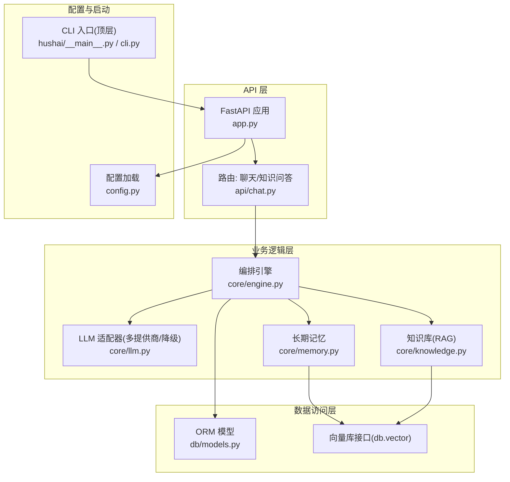
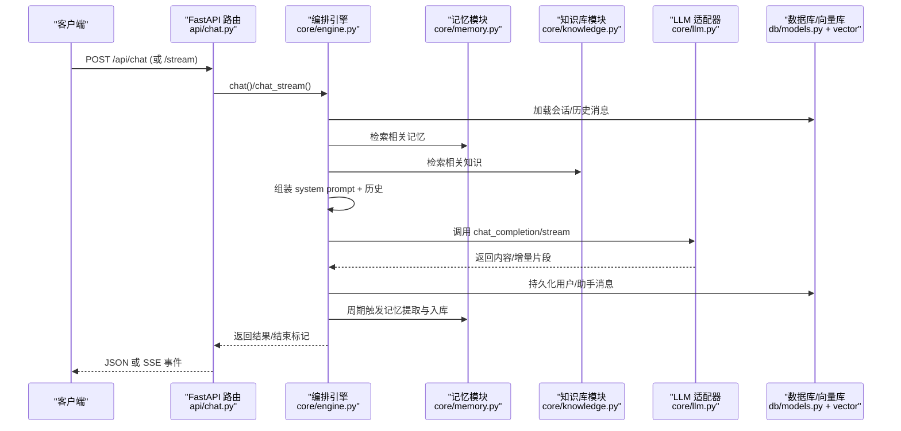
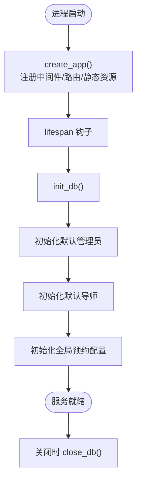
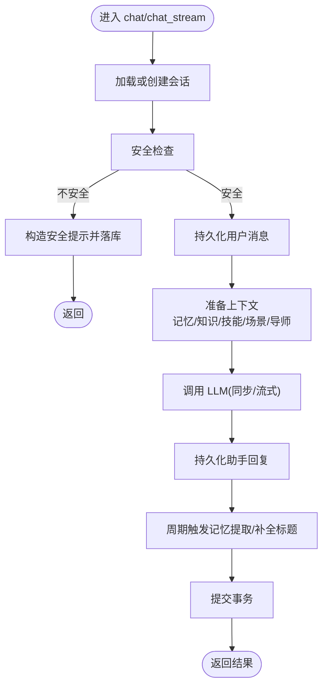
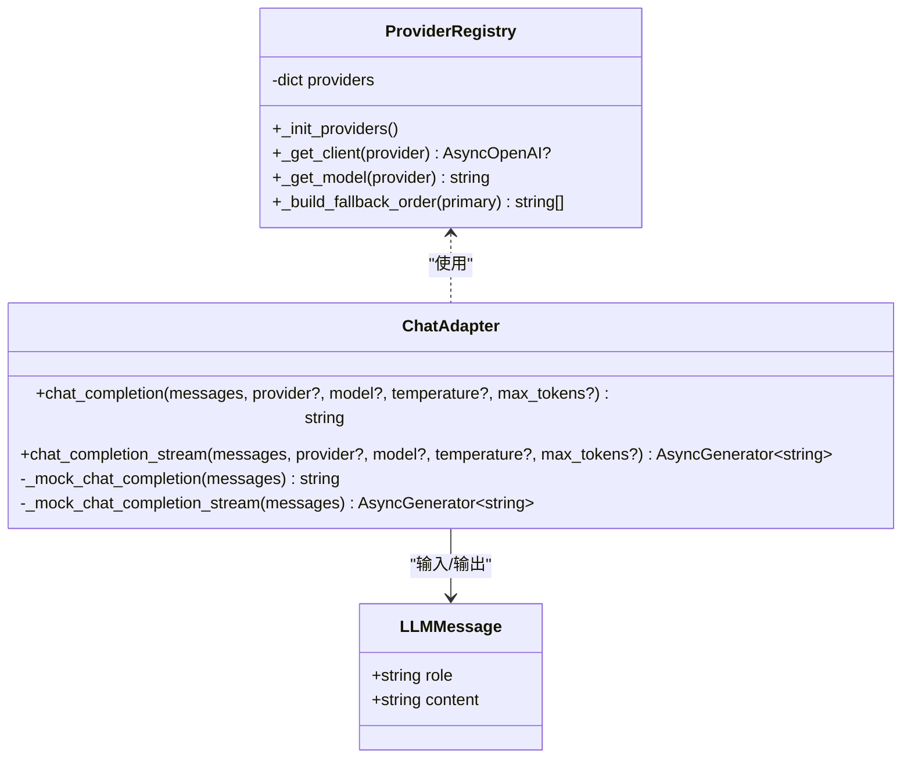
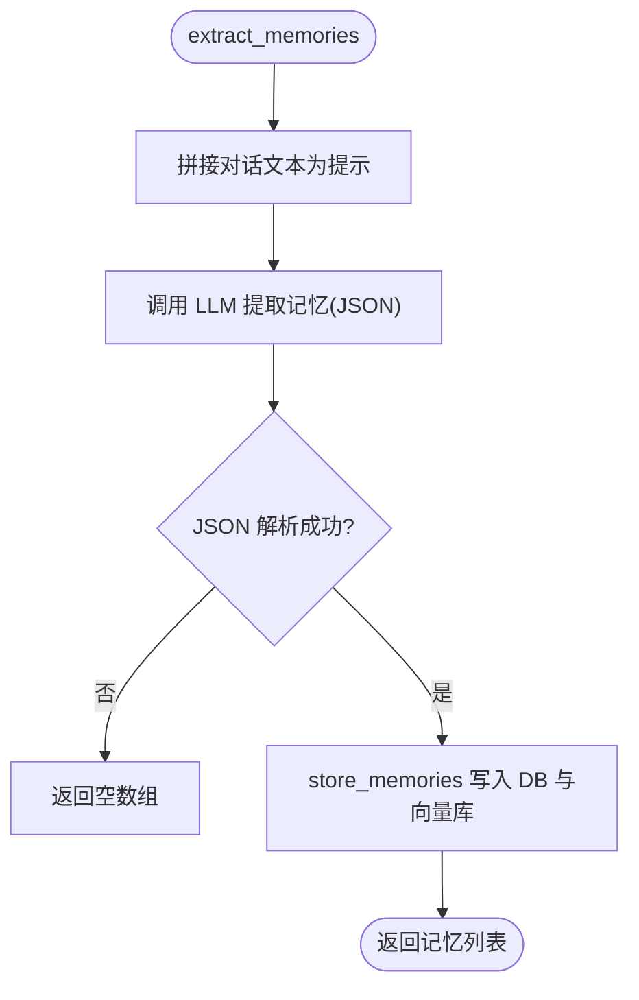
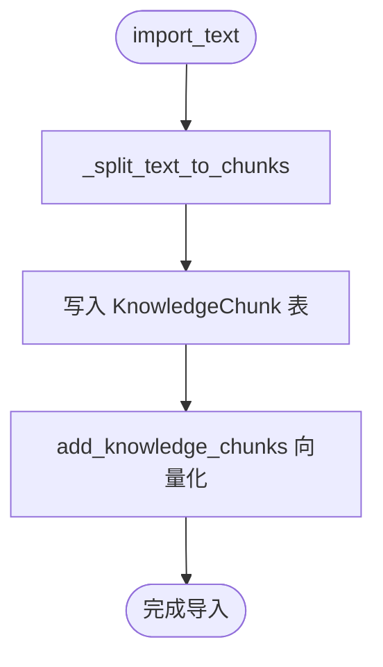
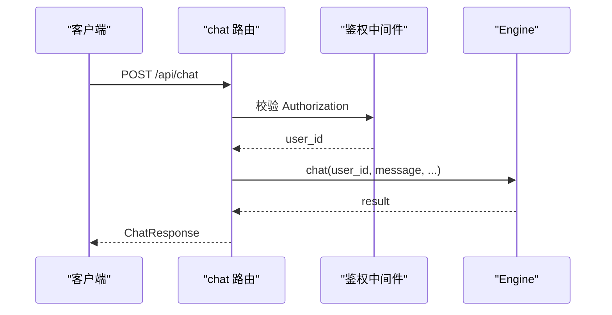
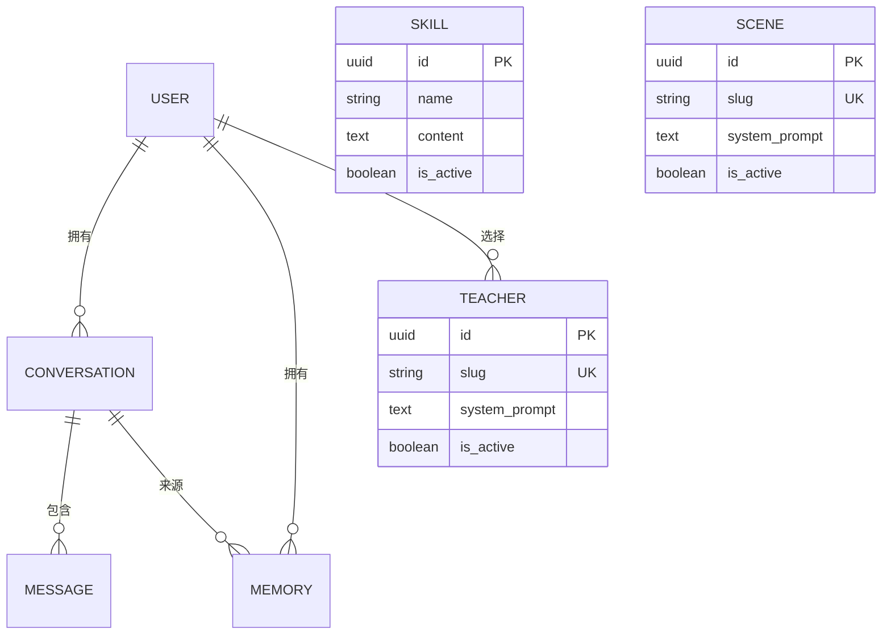
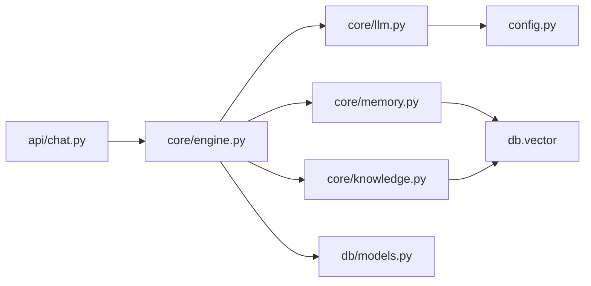

# 核心架构设计

<cite>
**本文引用的文件**   
- [hushai/meditation/app.py](file://hushai/meditation/app.py)
- [hushai/meditation/core/engine.py](file://hushai/meditation/core/engine.py)
- [hushai/meditation/core/llm.py](file://hushai/meditation/core/llm.py)
- [hushai/meditation/config.py](file://hushai/meditation/config.py)
- [hushai/meditation/api/chat.py](file://hushai/meditation/api/chat.py)
- [hushai/meditation/db/models.py](file://hushai/meditation/db/models.py)
- [hushai/meditation/core/memory.py](file://hushai/meditation/core/memory.py)
- [hushai/meditation/core/knowledge.py](file://hushai/meditation/core/knowledge.py)
- [hushai/llm.py](file://hushai/llm.py)
</cite>

## 目录
1. [引言](#引言)
2. [项目结构](#项目结构)
3. [核心组件](#核心组件)
4. [架构总览](#架构总览)
5. [详细组件分析](#详细组件分析)
6. [依赖关系分析](#依赖关系分析)
7. [性能考量](#性能考量)
8. [故障排查指南](#故障排查指南)
9. [结论](#结论)
10. [附录](#附录)

## 引言
本文件面向 hush.ai 的核心架构，聚焦分层架构模式（API 层、业务逻辑层、数据访问层）的职责划分与交互；深入解析 Engine 编排引擎的对话流程控制、组件协调与错误处理策略；阐述插件化 LLM 适配器的设计理念与实现机制；并给出系统启动流程、依赖注入方式与模块间通信协议。文档包含架构图与时序图，帮助读者快速理解关键业务流程的实现细节。

## 项目结构
本项目采用“按领域+分层”的组织方式：
- API 层：基于 FastAPI 的路由与中间件，负责请求校验、鉴权、限流与响应封装。
- 业务逻辑层：Engine 编排器为核心，串联记忆、知识检索、场景与技能提示组装、安全校验与 LLM 调用。
- 数据访问层：SQLAlchemy ORM 模型与向量库接口，提供会话、消息、记忆、知识库等持久化能力。
- 配置与启动：集中式配置加载与应用生命周期管理。

图表来源
- [hushai/meditation/app.py:136-207](file://hushai/meditation/app.py#L136-L207)
- [hushai/meditation/api/chat.py:58-127](file://hushai/meditation/api/chat.py#L58-L127)
- [hushai/meditation/core/engine.py:166-314](file://hushai/meditation/core/engine.py#L166-L314)
- [hushai/meditation/core/llm.py:136-258](file://hushai/meditation/core/llm.py#L136-L258)
- [hushai/meditation/core/memory.py:45-112](file://hushai/meditation/core/memory.py#L45-L112)
- [hushai/meditation/core/knowledge.py:137-225](file://hushai/meditation/core/knowledge.py#L137-L225)
- [hushai/meditation/db/models.py:25-118](file://hushai/meditation/db/models.py#L25-L118)
- [hushai/meditation/config.py:18-136](file://hushai/meditation/config.py#L18-L136)
- [hushai/__main__.py:1-5](file://hushai/__main__.py#L1-L5)

章节来源
- [hushai/meditation/app.py:136-207](file://hushai/meditation/app.py#L136-L207)
- [hushai/meditation/config.py:18-136](file://hushai/meditation/config.py#L18-L136)

## 核心组件
- 应用与生命周期
  - 通过 lifespan 初始化日志、数据库、默认管理员与默认导师、全局预约配置，并在关闭时释放资源。
  - 注册 CORS、限流中间件与所有路由，挂载静态资源与健康检查端点。
- 编排引擎（Engine）
  - 统一编排：会话创建/加载、历史消息裁剪、记忆与知识上下文拼装、技能与场景提示注入、安全检查、LLM 调用、结果持久化与记忆提取触发。
  - 支持同步 chat 与流式 chat_stream，以及知识问答 knowledge_qa。
- LLM 适配器
  - 多提供商配置与自动降级顺序；调试模式下无 Key 时回退到 mock 回复；支持非流式与流式两种调用路径。
- 长期记忆
  - 周期性从对话中提取结构化记忆，写入数据库与向量库；检索相关记忆用于提示增强。
- 知识库（RAG）
  - Markdown 文本导入、分块、向量化；查询时检索 top-k 片段作为上下文。
- 配置
  - 集中读取 .env 与环境变量，提供 MeditationConfig 单例，供各层按需获取。

章节来源
- [hushai/meditation/app.py:24-133](file://hushai/meditation/app.py#L24-L133)
- [hushai/meditation/core/engine.py:91-127](file://hushai/meditation/core/engine.py#L91-L127)
- [hushai/meditation/core/llm.py:21-51](file://hushai/meditation/core/llm.py#L21-L51)
- [hushai/meditation/core/memory.py:45-112](file://hushai/meditation/core/memory.py#L45-L112)
- [hushai/meditation/core/knowledge.py:137-225](file://hushai/meditation/core/knowledge.py#L137-L225)
- [hushai/meditation/config.py:118-136](file://hushai/meditation/config.py#L118-L136)

## 架构总览
下图展示从 HTTP 请求到 LLM 返回的关键链路，体现分层职责与外部依赖。

图表来源
- [hushai/meditation/api/chat.py:58-127](file://hushai/meditation/api/chat.py#L58-L127)
- [hushai/meditation/core/engine.py:166-314](file://hushai/meditation/core/engine.py#L166-L314)
- [hushai/meditation/core/memory.py:161-173](file://hushai/meditation/core/memory.py#L161-L173)
- [hushai/meditation/core/knowledge.py:216-225](file://hushai/meditation/core/knowledge.py#L216-L225)
- [hushai/meditation/core/llm.py:136-258](file://hushai/meditation/core/llm.py#L136-L258)
- [hushai/meditation/db/models.py:69-96](file://hushai/meditation/db/models.py#L69-L96)

## 详细组件分析

### 应用与启动流程
- 应用工厂 create_app 构建 FastAPI 实例，注册中间件、路由与静态资源。
- lifespan 中完成：
  - 日志级别设置
  - 数据库初始化
  - 默认管理员与默认导师初始化
  - 全局预约配置初始化
  - 优雅关闭时释放数据库连接
- 通过 get_app 单例暴露应用，Uvicorn 以 factory=True 启动。

图表来源
- [hushai/meditation/app.py:136-207](file://hushai/meditation/app.py#L136-L207)
- [hushai/meditation/app.py:24-133](file://hushai/meditation/app.py#L24-L133)

章节来源
- [hushai/meditation/app.py:136-207](file://hushai/meditation/app.py#L136-L207)
- [hushai/meditation/app.py:24-133](file://hushai/meditation/app.py#L24-L133)

### 编排引擎（Engine）
- 职责
  - 会话与消息生命周期管理（创建/加载/裁剪）
  - 上下文拼装（记忆、知识、技能、场景、导师角色）
  - 安全前置校验（危机内容拦截）
  - LLM 调用（同步/流式）
  - 结果持久化与记忆提取触发
- 关键流程
  - chat：同步返回完整回复
  - chat_stream：SSE 增量推送，内部累积最终回复后落库
  - knowledge_qa：基于知识库检索的问答流程

图表来源
- [hushai/meditation/core/engine.py:166-314](file://hushai/meditation/core/engine.py#L166-L314)
- [hushai/meditation/core/engine.py:91-127](file://hushai/meditation/core/engine.py#L91-L127)
- [hushai/meditation/core/engine.py:130-154](file://hushai/meditation/core/engine.py#L130-L154)

章节来源
- [hushai/meditation/core/engine.py:166-314](file://hushai/meditation/core/engine.py#L166-L314)
- [hushai/meditation/core/engine.py:91-127](file://hushai/meditation/core/engine.py#L91-L127)
- [hushai/meditation/core/engine.py:130-154](file://hushai/meditation/core/engine.py#L130-L154)

### LLM 适配器与插件化设计
- 设计理念
  - 通过配置驱动的“提供商注册表”实现插件化扩展，新增提供商只需在配置中声明即可接入。
  - 统一的降级顺序策略，主提供商失败时自动尝试备选提供商，保障可用性。
  - 调试模式下的 Mock 分支，无需真实 Key 即可运行。
- 关键机制
  - _init_providers：从配置加载内置与自定义提供商
  - _build_fallback_order：生成降级顺序列表
  - chat_completion/chat_completion_stream：分别处理非流式与流式调用，含异常转换与回退逻辑

图表来源
- [hushai/meditation/core/llm.py:21-51](file://hushai/meditation/core/llm.py#L21-L51)
- [hushai/meditation/core/llm.py:82-90](file://hushai/meditation/core/llm.py#L82-L90)
- [hushai/meditation/core/llm.py:136-179](file://hushai/meditation/core/llm.py#L136-L179)
- [hushai/meditation/core/llm.py:208-258](file://hushai/meditation/core/llm.py#L208-L258)
- [hushai/meditation/core/llm.py:53-57](file://hushai/meditation/core/llm.py#L53-L57)

章节来源
- [hushai/meditation/core/llm.py:21-51](file://hushai/meditation/core/llm.py#L21-L51)
- [hushai/meditation/core/llm.py:136-179](file://hushai/meditation/core/llm.py#L136-L179)
- [hushai/meditation/core/llm.py:208-258](file://hushai/meditation/core/llm.py#L208-L258)

### 长期记忆模块
- 功能要点
  - extract_memories：将最近对话转为结构化记忆条目（类别、摘要、重要度），容错处理 JSON 解析异常
  - store_memories：批量写入数据库，并异步写入向量索引
  - retrieve_relevant_memories：基于向量相似度检索 top-k，再回查数据库过滤活跃状态
  - get_memory_context_for_prompt：将检索结果格式化为提示片段
- 复杂度与优化
  - 向量检索 O(k log n) 近似搜索，top_k 可配置
  - 存储阶段对向量写入异常做隔离，避免影响主事务

图表来源
- [hushai/meditation/core/memory.py:45-76](file://hushai/meditation/core/memory.py#L45-L76)
- [hushai/meditation/core/memory.py:79-112](file://hushai/meditation/core/memory.py#L79-L112)
- [hushai/meditation/core/memory.py:115-138](file://hushai/meditation/core/memory.py#L115-L138)
- [hushai/meditation/core/memory.py:161-173](file://hushai/meditation/core/memory.py#L161-L173)

章节来源
- [hushai/meditation/core/memory.py:45-112](file://hushai/meditation/core/memory.py#L45-L112)
- [hushai/meditation/core/memory.py:115-173](file://hushai/meditation/core/memory.py#L115-L173)

### 知识库（RAG）模块
- 功能要点
  - prepare_import_content：Markdown frontmatter 解析、标题提取、标签合并、转纯文本
  - import_text/import_structured：分块入库与向量化
  - search_knowledge_base/get_knowledge_context_for_prompt：检索 top-k 并格式化上下文
- 分块策略
  - 段落切分、重叠窗口保留上下文连续性，chunk_size 与 overlap 可调

图表来源
- [hushai/meditation/core/knowledge.py:76-104](file://hushai/meditation/core/knowledge.py#L76-L104)
- [hushai/meditation/core/knowledge.py:106-134](file://hushai/meditation/core/knowledge.py#L106-L134)
- [hushai/meditation/core/knowledge.py:137-171](file://hushai/meditation/core/knowledge.py#L137-L171)
- [hushai/meditation/core/knowledge.py:207-225](file://hushai/meditation/core/knowledge.py#L207-L225)

章节来源
- [hushai/meditation/core/knowledge.py:76-171](file://hushai/meditation/core/knowledge.py#L76-L171)
- [hushai/meditation/core/knowledge.py:207-225](file://hushai/meditation/core/knowledge.py#L207-L225)

### API 层与鉴权/限流
- 路由组织
  - /api/chat：同步聊天、流式聊天、知识问答
  - /api/chat/scenes：场景列表
  - /api/chat/conversations：对话列表与消息历史
- 鉴权与限流
  - 通过 Header Authorization 提取 Bearer Token，验证当前用户 ID
  - 使用 slowapi 进行每分钟请求限制
- 响应封装
  - 使用 Pydantic 模型统一入参/出参，错误统一包装为 ErrorResponse

图表来源
- [hushai/meditation/api/chat.py:58-127](file://hushai/meditation/api/chat.py#L58-L127)
- [hushai/meditation/api/chat.py:47-56](file://hushai/meditation/api/chat.py#L47-L56)

章节来源
- [hushai/meditation/api/chat.py:58-127](file://hushai/meditation/api/chat.py#L58-L127)
- [hushai/meditation/api/chat.py:47-56](file://hushai/meditation/api/chat.py#L47-L56)

### 数据模型概览
- 核心实体
  - User、Conversation、Message、Memory、Skill、Scene、Teacher
  - 咨询相关：Counselor、CounselorSchedule、Appointment、ConsultationOrder、ServiceRecord、AppointmentSettings
- 关系要点
  - User 1..* Conversation，Conversation 1..* Message
  - User 1..* Memory，Memory 可选关联 Conversation
  - Teacher 独立维度，被选择为用户偏好或对话角色

图表来源
- [hushai/meditation/db/models.py:37-118](file://hushai/meditation/db/models.py#L37-L118)
- [hushai/meditation/db/models.py:120-170](file://hushai/meditation/db/models.py#L120-L170)
- [hushai/meditation/db/models.py:246-266](file://hushai/meditation/db/models.py#L246-L266)

章节来源
- [hushai/meditation/db/models.py:37-118](file://hushai/meditation/db/models.py#L37-L118)
- [hushai/meditation/db/models.py:120-170](file://hushai/meditation/db/models.py#L120-L170)
- [hushai/meditation/db/models.py:246-266](file://hushai/meditation/db/models.py#L246-L266)

## 依赖关系分析
- 模块耦合
  - API 层仅依赖 Engine 与鉴权/限流工具，保持薄控制器风格
  - Engine 聚合记忆、知识、LLM 适配器与数据库访问，承担编排职责
  - LLM 适配器与配置解耦，通过配置注册表动态选择提供商
- 外部依赖
  - OpenAI SDK 兼容接口（base_url 可替换）
  - SQLAlchemy 异步会话
  - 向量库接口（db.vector）
- 潜在循环依赖
  - 当前未见直接循环引用；Engine 与 LLM 适配器单向依赖

图表来源
- [hushai/meditation/api/chat.py:58-127](file://hushai/meditation/api/chat.py#L58-L127)
- [hushai/meditation/core/engine.py:166-314](file://hushai/meditation/core/engine.py#L166-L314)
- [hushai/meditation/core/llm.py:136-179](file://hushai/meditation/core/llm.py#L136-L179)
- [hushai/meditation/core/memory.py:45-112](file://hushai/meditation/core/memory.py#L45-L112)
- [hushai/meditation/core/knowledge.py:137-171](file://hushai/meditation/core/knowledge.py#L137-L171)
- [hushai/meditation/config.py:118-136](file://hushai/meditation/config.py#L118-L136)

章节来源
- [hushai/meditation/api/chat.py:58-127](file://hushai/meditation/api/chat.py#L58-L127)
- [hushai/meditation/core/engine.py:166-314](file://hushai/meditation/core/engine.py#L166-L314)
- [hushai/meditation/core/llm.py:136-179](file://hushai/meditation/core/llm.py#L136-L179)

## 性能考量
- 会话历史裁剪：conversation_max_turns 控制历史长度，降低 LLM 输入成本与延迟
- 记忆提取频率：每 N 条用户消息触发一次，平衡个性化与开销
- 向量检索 top_k：memory_top_k 与 knowledge_top_k 可配置，控制上下文大小
- LLM 超时与重试：根据 debug 模式调整超时；OpenAIError 统一转换为友好提示
- 流式响应：SSE 提升首字节时间体验，减少前端等待感知

[本节为通用指导，不直接分析具体文件]

## 故障排查指南
- 常见问题定位
  - 未配置 API Key：LLM 适配器在非 debug 模式会抛出运行时错误；debug 模式走 mock
  - 提供商不可用：自动降级至下一个提供商；若全部失败且存在异常，则抛出格式化错误
  - 向量写入失败：记录警告但不阻断主流程
  - 鉴权失败：返回 401；限流触发返回 429（slowapi 默认处理）
- 建议步骤
  - 检查环境变量与 .env 是否覆盖正确
  - 查看日志中的 “LLM fallback”、“LLM stream provider failed” 等关键字
  - 确认数据库连接与向量库连通性
  - 使用 /health 端点验证服务健康状态

章节来源
- [hushai/meditation/core/llm.py:136-179](file://hushai/meditation/core/llm.py#L136-L179)
- [hushai/meditation/core/llm.py:208-258](file://hushai/meditation/core/llm.py#L208-L258)
- [hushai/meditation/core/memory.py:102-112](file://hushai/meditation/core/memory.py#L102-L112)
- [hushai/meditation/app.py:203-206](file://hushai/meditation/app.py#L203-L206)

## 结论
hush.ai 的核心架构以 Engine 为中心，清晰划分 API、业务与数据三层，结合插件化的 LLM 适配器与 RAG 能力，实现了可扩展、高可用的冥想陪伴系统。通过配置驱动与自动降级策略，系统在稳定性与灵活性之间取得良好平衡。未来可在更多提供商接入、记忆归档策略与向量检索优化方面持续演进。

[本节为总结性内容，不直接分析具体文件]

## 附录
- CLI 入口说明
  - 顶层 __main__ 调用 cli.main，支持一次性提问、管道输入与交互式 REPL
  - 该 CLI 使用顶层 llm.chat_once 与 settings 配置，与 meditation 模块相对独立

章节来源
- [hushai/__main__.py:1-5](file://hushai/__main__.py#L1-L5)
- [hushai/cli.py:81-152](file://hushai/cli.py#L81-L152)
- [hushai/llm.py:100-142](file://hushai/llm.py#L100-L142)