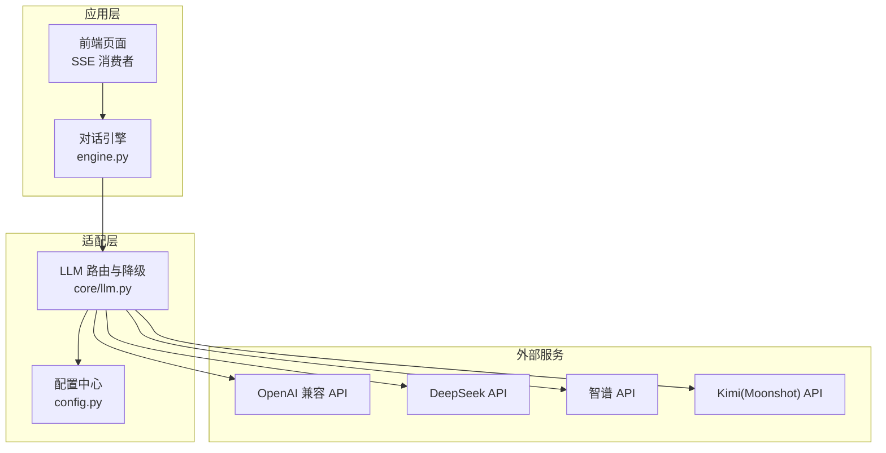
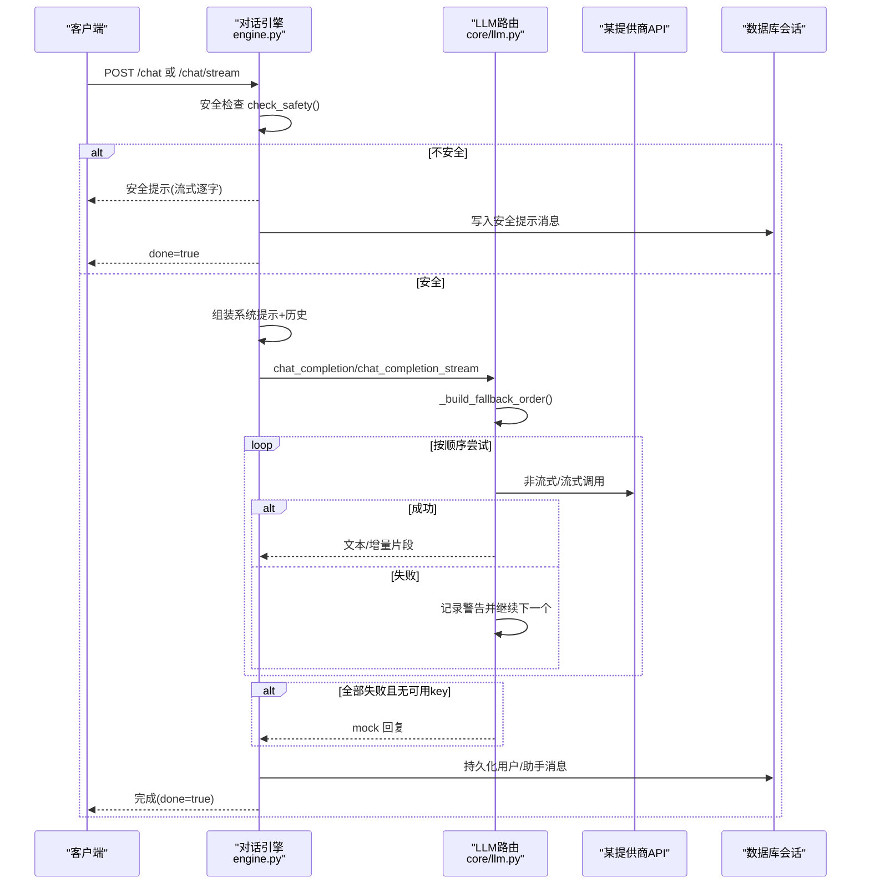
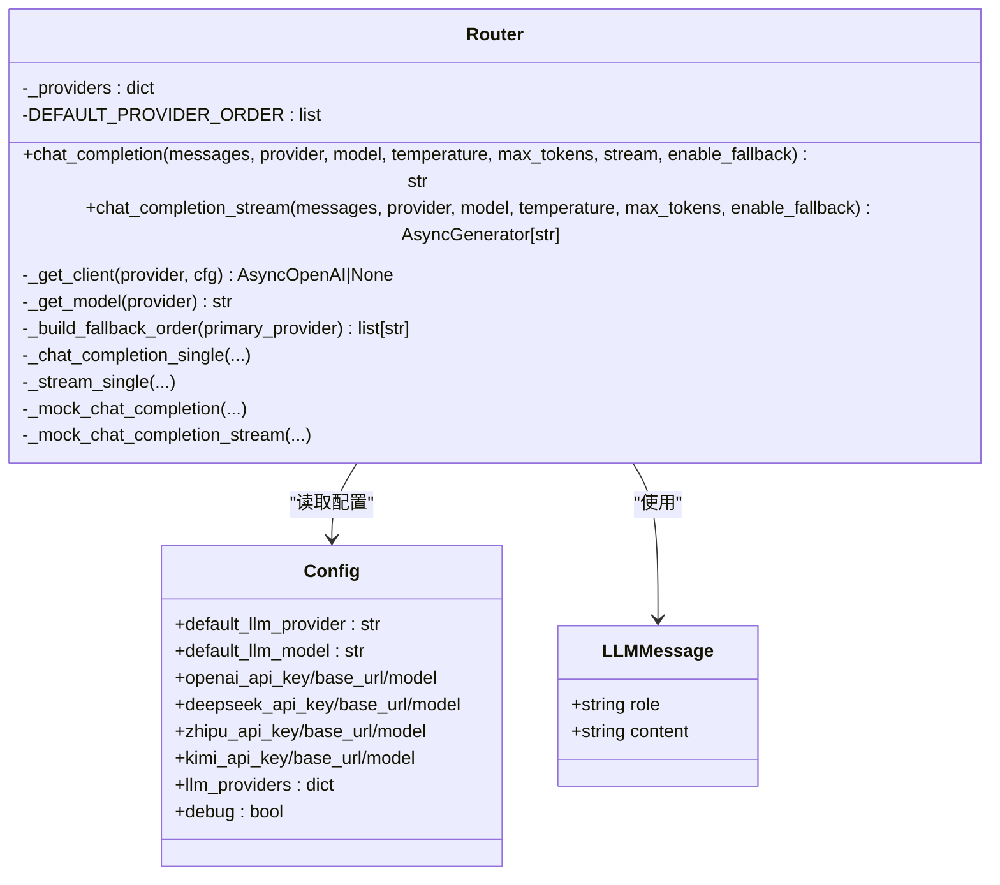
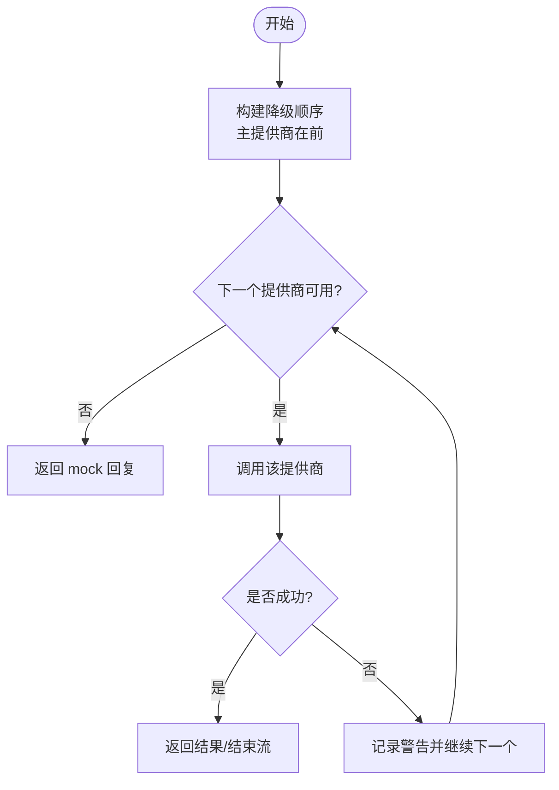
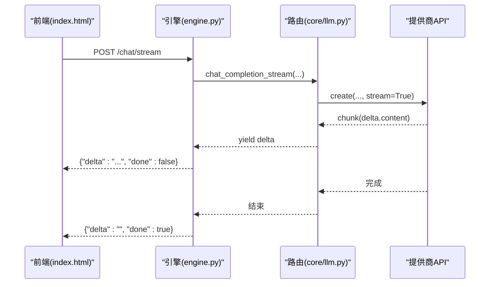
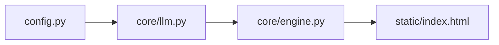

# LLM适配层

<cite>
**本文引用的文件**   
- [hushai/meditation/core/llm.py](file://hushai/meditation/core/llm.py)
- [hushai/meditation/config.py](file://hushai/meditation/config.py)
- [hushai/meditation/core/engine.py](file://hushai/meditation/core/engine.py)
- [hushai/llm.py](file://hushai/llm.py)
- [hushai/settings.py](file://hushai/settings.py)
- [tests/meditation/test_llm_core.py](file://tests/meditation/test_llm_core.py)
- [tests/test_llm_errors.py](file://tests/test_llm_errors.py)
- [hushai/meditation/static/index.html](file://hushai/meditation/static/index.html)
</cite>

## 目录
1. [简介](#简介)
2. [项目结构](#项目结构)
3. [核心组件](#核心组件)
4. [架构总览](#架构总览)
5. [详细组件分析](#详细组件分析)
6. [依赖关系分析](#依赖关系分析)
7. [性能与调优](#性能与调优)
8. [故障排查指南](#故障排查指南)
9. [结论](#结论)
10. [附录：新增提供商配置示例](#附录新增提供商配置示例)

## 简介
本技术文档聚焦 hush.ai 的 LLM 适配层，围绕多模型统一接口、自动降级机制、消息数据模型、流式响应处理、错误与超时控制、资源管理以及生成参数调优等主题展开。适配层以 OpenAI 兼容协议为统一抽象，内置对 OpenAI、DeepSeek、智谱、Kimi 等主流提供商的支持，并提供可扩展的“动态提供商”注入能力，便于后续接入更多厂商。

## 项目结构
适配层位于冥想模块的核心路径下，主要涉及以下职责划分：
- 路由与降级：在 meditation/core/llm.py 中实现多提供商选择、失败重试与降级策略。
- 配置加载：在 meditation/config.py 中集中管理各提供商密钥、Base URL、默认模型及运行时开关。
- 引擎编排：在 meditation/core/engine.py 中将安全校验、上下文组装、记忆/知识检索与 LLM 调用串联起来。
- 顶层 CLI 适配：在 hushai/llm.py 提供面向 CLI 的单次对话封装（非流式），并复用统一的错误格式化逻辑。
- 前端流式消费：在 meditation/static/index.html 中以 SSE 风格解析后端增量返回。

图表来源
- [hushai/meditation/core/llm.py:1-90](file://hushai/meditation/core/llm.py#L1-L90)
- [hushai/meditation/config.py:18-52](file://hushai/meditation/config.py#L18-L52)
- [hushai/meditation/core/engine.py:166-236](file://hushai/meditation/core/engine.py#L166-L236)

章节来源
- [hushai/meditation/core/llm.py:1-90](file://hushai/meditation/core/llm.py#L1-L90)
- [hushai/meditation/config.py:18-52](file://hushai/meditation/config.py#L18-L52)
- [hushai/meditation/core/engine.py:166-236](file://hushai/meditation/core/engine.py#L166-L236)

## 核心组件
- 多提供商路由与降级：根据主提供商与默认顺序构建候选列表，依次尝试；失败则记录日志并切换下一个提供商；全部不可用时回退到本地 mock 回复。
- 统一消息模型：LLMMessage 仅包含 role 与 content，屏蔽不同厂商的消息差异。
- 流式与非流式双通道：chat_completion 与 chat_completion_stream 分别提供一次性返回与增量返回。
- 配置驱动：所有提供商凭据、Base URL、模型名均来自 MeditationConfig，支持环境变量与 .env 注入。
- 错误格式化：复用 format_openai_error，将 SDK 异常映射为中文可读提示。

章节来源
- [hushai/meditation/core/llm.py:53-90](file://hushai/meditation/core/llm.py#L53-L90)
- [hushai/meditation/core/llm.py:136-178](file://hushai/meditation/core/llm.py#L136-L178)
- [hushai/meditation/core/llm.py:208-257](file://hushai/meditation/core/llm.py#L208-L257)
- [hushai/llm.py:81-97](file://hushai/llm.py#L81-L97)

## 架构总览
下图展示了从用户请求到最终响应的端到端流程，包括安全检查、上下文拼装、多提供商降级、流式传输与持久化。

图表来源
- [hushai/meditation/core/engine.py:166-313](file://hushai/meditation/core/engine.py#L166-L313)
- [hushai/meditation/core/llm.py:82-90](file://hushai/meditation/core/llm.py#L82-L90)
- [hushai/meditation/core/llm.py:136-178](file://hushai/meditation/core/llm.py#L136-L178)
- [hushai/meditation/core/llm.py:208-257](file://hushai/meditation/core/llm.py#L208-L257)

## 详细组件分析

### 多模型统一接口与适配器实现
- 统一抽象：通过 AsyncOpenAI 作为底层客户端，屏蔽不同厂商的差异。
- 内置提供商：openai、deepseek、zhipu、kimi，其 api_key、base_url、model 来自配置。
- 动态扩展：支持通过配置项 llm_providers 注入任意名称的提供商，无需修改代码。

图表来源
- [hushai/meditation/core/llm.py:53-90](file://hushai/meditation/core/llm.py#L53-L90)
- [hushai/meditation/config.py:18-52](file://hushai/meditation/config.py#L18-L52)

章节来源
- [hushai/meditation/core/llm.py:21-51](file://hushai/meditation/core/llm.py#L21-L51)
- [hushai/meditation/config.py:18-52](file://hushai/meditation/config.py#L18-L52)

### 自动降级机制
- 降级顺序构造：主提供商优先，其余按 DEFAULT_PROVIDER_ORDER 补齐并去重。
- 非流式降级：逐个 provider 调用 _chat_completion_single，返回 None 表示失败，继续下一个；若全部失败则走 mock。
- 流式降级：逐个 provider 调用 _stream_single，捕获 OpenAIError 后继续下一个；若无任何可用 key 则走 mock；否则抛出格式化后的错误。
- 调试模式：当 debug=True 且未配置 key 时，_get_client 返回 None，由上层直接走 mock，避免启动期报错。

图表来源
- [hushai/meditation/core/llm.py:82-90](file://hushai/meditation/core/llm.py#L82-L90)
- [hushai/meditation/core/llm.py:136-178](file://hushai/meditation/core/llm.py#L136-L178)
- [hushai/meditation/core/llm.py:208-257](file://hushai/meditation/core/llm.py#L208-L257)

章节来源
- [hushai/meditation/core/llm.py:82-90](file://hushai/meditation/core/llm.py#L82-L90)
- [hushai/meditation/core/llm.py:136-178](file://hushai/meditation/core/llm.py#L136-L178)
- [hushai/meditation/core/llm.py:208-257](file://hushai/meditation/core/llm.py#L208-L257)

### LLMMessage 数据模型与消息标准化
- 数据结构：LLMMessage 仅包含 role 与 content，屏蔽不同厂商消息结构的差异。
- 标准化过程：在路由层将 LLMMessage 列表转换为 OpenAI 兼容的 messages 字典列表，再下发给具体提供商。
- 上下文拼装：引擎侧负责将 system 提示、历史消息、记忆/知识/技能/场景上下文组合成标准消息序列。

章节来源
- [hushai/meditation/core/llm.py:53-57](file://hushai/meditation/core/llm.py#L53-L57)
- [hushai/meditation/core/llm.py:136-149](file://hushai/meditation/core/llm.py#L136-L149)
- [hushai/meditation/core/engine.py:91-127](file://hushai/meditation/core/engine.py#L91-L127)

### 流式响应处理与 SSE 协议
- 服务端流式：_stream_single 设置 stream=True，逐块 yield delta.content；路由层在失败时进行降级。
- 引擎转发：engine.chat_stream 收集增量片段，逐条向前端推送，并在完成后持久化完整回复。
- 前端消费：index.html 使用 fetch + ReadableStream 读取 body，按行解析 data: JSON 格式，拼接 delta 并更新界面。

图表来源
- [hushai/meditation/core/llm.py:181-206](file://hushai/meditation/core/llm.py#L181-L206)
- [hushai/meditation/core/engine.py:238-313](file://hushai/meditation/core/engine.py#L238-L313)
- [hushai/meditation/static/index.html:1816-1891](file://hushai/meditation/static/index.html#L1816-L1891)

章节来源
- [hushai/meditation/core/llm.py:181-206](file://hushai/meditation/core/llm.py#L181-L206)
- [hushai/meditation/core/engine.py:238-313](file://hushai/meditation/core/engine.py#L238-L313)
- [hushai/meditation/static/index.html:1816-1891](file://hushai/meditation/static/index.html#L1816-L1891)

### 错误处理、超时与重试
- 错误格式化：format_openai_error 将各类 OpenAI SDK 异常映射为中文可读信息（如超时、连接失败、鉴权失败、权限不足、限流等）。
- 超时控制：
  - 路由层：AsyncOpenAI 实例化时传入 timeout（调试模式更长）。
  - 顶层 CLI：settings.get_timeout_seconds 从环境变量或配置文件读取，用于同步调用。
- 重试策略：
  - 路由层：基于“提供商级”的降级顺序进行重试（跨厂商）。
  - 顶层 CLI：settings.get_max_retries 控制 OpenAI SDK 内部重试次数。

章节来源
- [hushai/llm.py:81-97](file://hushai/llm.py#L81-L97)
- [hushai/settings.py:185-218](file://hushai/settings.py#L185-L218)
- [hushai/meditation/core/llm.py:59-71](file://hushai/meditation/core/llm.py#L59-L71)
- [tests/test_llm_errors.py:1-58](file://tests/test_llm_errors.py#L1-L58)

### 资源管理与最佳实践
- 客户端生命周期：路由层按需创建 AsyncOpenAI 实例，避免全局单例带来的状态污染。
- 会话事务：engine 使用 async with factory() 管理数据库会话，确保异常时回滚。
- 流式资源释放：前端使用 ReadableStream 逐块读取，避免大响应阻塞内存。
- 调试友好：debug 模式下无 key 时走 mock，便于联调不依赖外部服务。

章节来源
- [hushai/meditation/core/llm.py:59-71](file://hushai/meditation/core/llm.py#L59-L71)
- [hushai/meditation/core/engine.py:166-236](file://hushai/meditation/core/engine.py#L166-L236)
- [hushai/meditation/static/index.html:1816-1891](file://hushai/meditation/static/index.html#L1816-L1891)

## 依赖关系分析
- 路由层依赖配置中心获取提供商信息与默认模型。
- 引擎层依赖路由层进行 LLM 调用，同时依赖安全、记忆、知识、技能、场景等上下文模块。
- 前端依赖后端 SSE 风格的增量输出。

图表来源
- [hushai/meditation/config.py:18-52](file://hushai/meditation/config.py#L18-L52)
- [hushai/meditation/core/llm.py:21-51](file://hushai/meditation/core/llm.py#L21-L51)
- [hushai/meditation/core/engine.py:166-236](file://hushai/meditation/core/engine.py#L166-L236)
- [hushai/meditation/static/index.html:1816-1891](file://hushai/meditation/static/index.html#L1816-L1891)

章节来源
- [hushai/meditation/config.py:18-52](file://hushai/meditation/config.py#L18-L52)
- [hushai/meditation/core/llm.py:21-51](file://hushai/meditation/core/llm.py#L21-L51)
- [hushai/meditation/core/engine.py:166-236](file://hushai/meditation/core/engine.py#L166-L236)
- [hushai/meditation/static/index.html:1816-1891](file://hushai/meditation/static/index.html#L1816-L1891)

## 性能与调优
- 温度参数 temperature：
  - 对话引擎默认 0.7，偏向稳定与连贯；知识库问答可降至 0.5 提升准确性。
  - 建议：创意类任务适度提高（如 0.8~1.0），事实性任务降低（如 0.2~0.5）。
- 最大令牌数 max_tokens：
  - 默认 1024，长回答或知识库问答可提升至 1500 以上。
  - 建议：结合业务场景与成本预算设定上限，避免过长输出导致延迟与费用上升。
- 流式 vs 非流式：
  - 流式可降低首字节延迟，提升用户体验；但需前端正确解析与容错。
- 降级顺序与可用性：
  - 合理排序 DEFAULT_PROVIDER_ORDER，将更稳定或低延迟的提供商靠前。
  - 监控各提供商成功率与延迟，动态调整顺序或权重。

章节来源
- [hushai/meditation/core/engine.py:211-216](file://hushai/meditation/core/engine.py#L211-L216)
- [hushai/meditation/core/engine.py:290-298](file://hushai/meditation/core/engine.py#L290-L298)
- [hushai/meditation/core/engine.py:354-359](file://hushai/meditation/core/engine.py#L354-L359)
- [hushai/meditation/core/llm.py:18](file://hushai/meditation/core/llm.py#L18)

## 故障排查指南
- 常见错误与定位
  - 未配置 API Key：路由层会抛出 RuntimeError 并提示缺失 key；检查对应提供商的配置项。
  - 鉴权失败/权限不足/限流：format_openai_error 会给出中文提示；核对密钥、配额与速率限制。
  - 网络超时/连接失败：检查 Base URL、代理与网络连通性；适当增大超时时间。
- 调试技巧
  - 开启 debug 模式：无 key 时走 mock，便于快速验证链路。
  - 查看日志：路由层在降级时会记录 warning/info，有助于定位失败点。
- 测试覆盖
  - 单元测试验证降级顺序、generator 语义修复、mock 分支等行为。

章节来源
- [hushai/meditation/core/llm.py:59-71](file://hushai/meditation/core/llm.py#L59-L71)
- [hushai/llm.py:81-97](file://hushai/llm.py#L81-L97)
- [tests/meditation/test_llm_core.py:1-45](file://tests/meditation/test_llm_core.py#L1-L45)
- [tests/meditation/test_llm_core.py:113-168](file://tests/meditation/test_llm_core.py#L113-L168)
- [tests/test_llm_errors.py:1-58](file://tests/test_llm_errors.py#L1-L58)

## 结论
本适配层以 OpenAI 兼容协议为核心抽象，实现了多提供商的统一接入与自动降级，配合流式响应与完善的错误处理，显著提升了系统的稳定性与用户体验。通过配置驱动的动态扩展能力，未来可低成本接入更多 LLM 提供商。建议在上线前完善监控指标（成功率、延迟、降级触发率）并结合业务场景持续优化 temperature 与 max_tokens 等生成参数。

## 附录：新增提供商配置示例
- 步骤一：在配置中声明新提供商
  - 在 MeditationConfig.llm_providers 中添加条目，键名为自定义标识（如 "custom"），值为包含 api_key、base_url、model 的字典。
- 步骤二：设置默认提供商或调用时指定
  - 可通过 default_llm_provider 设置为新提供商，或在调用 chat_completion/chat_completion_stream 时显式传入 provider。
- 步骤三：验证
  - 运行单元测试或实际调用，确认路由能识别新提供商并完成一次成功调用。

章节来源
- [hushai/meditation/config.py:51-52](file://hushai/meditation/config.py#L51-L52)
- [hushai/meditation/core/llm.py:47-51](file://hushai/meditation/core/llm.py#L47-L51)
- [hushai/meditation/core/llm.py:136-178](file://hushai/meditation/core/llm.py#L136-L178)
- [hushai/meditation/core/llm.py:208-257](file://hushai/meditation/core/llm.py#L208-L257)