# 咨询服务系统

<cite>
**本文引用的文件**   
- [README.md](file://README.md)
- [app.py](file://hushai/meditation/app.py)
- [config.py](file://hushai/meditation/config.py)
- [schemas.py](file://hushai/meditation/schemas.py)
- [engine.py](file://hushai/meditation/core/engine.py)
- [llm.py](file://hushai/meditation/core/llm.py)
- [memory.py](file://hushai/meditation/core/memory.py)
- [knowledge.py](file://hushai/meditation/core/knowledge.py)
- [chat.py](file://hushai/meditation/api/chat.py)
- [models.py](file://hushai/meditation/db/models.py)
- [session.py](file://hushai/meditation/db/session.py)
</cite>

## 目录
1. [简介](#简介)
2. [项目结构](#项目结构)
3. [核心组件](#核心组件)
4. [架构总览](#架构总览)
5. [详细组件分析](#详细组件分析)
6. [依赖关系分析](#依赖关系分析)
7. [性能考量](#性能考量)
8. [故障排查指南](#故障排查指南)
9. [结论](#结论)
10. [附录](#附录)

## 简介
本仓库实现了一个面向现代生活压力的智能化心理与冥想陪伴系统，并提供“咨询服务”能力：包括咨询师入驻、排班、预约、订单支付与服务记录等。系统以 FastAPI 为服务层，结合多 LLM 提供商（OpenAI、DeepSeek、智谱、Kimi）与自动降级策略，提供对话、RAG 知识增强、长期记忆提取与存储、技能插件挂载、场景化引导等功能；同时内置管理后台与前台 SPA，支持 SSE 流式输出与 JWT 鉴权。

## 项目结构
- 应用入口与生命周期：FastAPI 应用创建、中间件、路由挂载、静态资源挂载、默认数据初始化
- 配置中心：集中读取环境变量并构建不可变配置对象
- API 层：认证、对话、知识库、记忆、技能、冥想、导师、咨询业务等路由
- 核心引擎：对话编排、安全护栏、提示词组装、LLM 调用、记忆提取与检索、知识检索
- 数据层：SQLAlchemy ORM 模型、异步会话管理、向量检索接口
- 前端与管理后台：静态页面与模板、管理员权限与审计日志

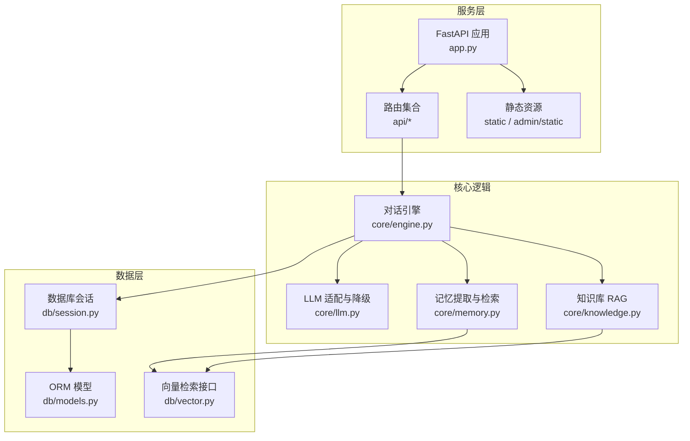

**图示来源** 
- [app.py:139-210](file://hushai/meditation/app.py#L139-L210)
- [chat.py:1-245](file://hushai/meditation/api/chat.py#L1-L245)
- [engine.py:166-387](file://hushai/meditation/core/engine.py#L166-L387)
- [llm.py:136-258](file://hushai/meditation/core/llm.py#L136-L258)
- [memory.py:1-206](file://hushai/meditation/core/memory.py#L1-L206)
- [knowledge.py:137-225](file://hushai/meditation/core/knowledge.py#L137-L225)
- [session.py:34-83](file://hushai/meditation/db/session.py#L34-L83)
- [models.py:1-442](file://hushai/meditation/db/models.py#L1-L442)

**章节来源**
- [README.md:100-178](file://README.md#L100-L178)
- [app.py:139-210](file://hushai/meditation/app.py#L139-L210)

## 核心组件
- 应用装配器：负责启动生命周期、注册中间件、挂载路由与静态资源、初始化默认管理员与导师、全局预约配置
- 配置中心：从 .env 与环境变量加载配置，提供统一访问点
- 对话引擎：统一编排用户消息、上下文拼装（历史、记忆、知识、技能、场景）、安全检查、LLM 调用、结果持久化与记忆提取
- LLM 适配层：封装多提供商客户端，支持非流式与流式调用，具备自动降级与调试 Mock 能力
- 记忆系统：基于 LLM 的周期性记忆提取、向量入库、按查询召回并注入提示词
- 知识库 RAG：Markdown/纯文本导入、段落感知分块、向量化存储与检索，用于问答与提示增强
- 数据模型与会话：统一的 SQLAlchemy 异步模型与会话工厂，支持 SQLite/PostgreSQL
- API 路由：JWT 鉴权、限流、SSE 流式响应、业务端点（含咨询服务）

**章节来源**
- [app.py:24-136](file://hushai/meditation/app.py#L24-L136)
- [config.py:18-136](file://hushai/meditation/config.py#L18-L136)
- [engine.py:91-154](file://hushai/meditation/core/engine.py#L91-L154)
- [llm.py:21-91](file://hushai/meditation/core/llm.py#L21-L91)
- [memory.py:45-113](file://hushai/meditation/core/memory.py#L45-L113)
- [knowledge.py:76-171](file://hushai/meditation/core/knowledge.py#L76-L171)
- [session.py:50-83](file://hushai/meditation/db/session.py#L50-L83)
- [models.py:268-442](file://hushai/meditation/db/models.py#L268-L442)

## 架构总览
系统采用分层架构：API 路由层 → 核心引擎层 → LLM/记忆/知识子模块 → 数据层（关系型数据库 + 向量库）。通过配置中心统一管理外部依赖（LLM、嵌入、数据库），并通过中间件实现 CORS、限流与安全校验。

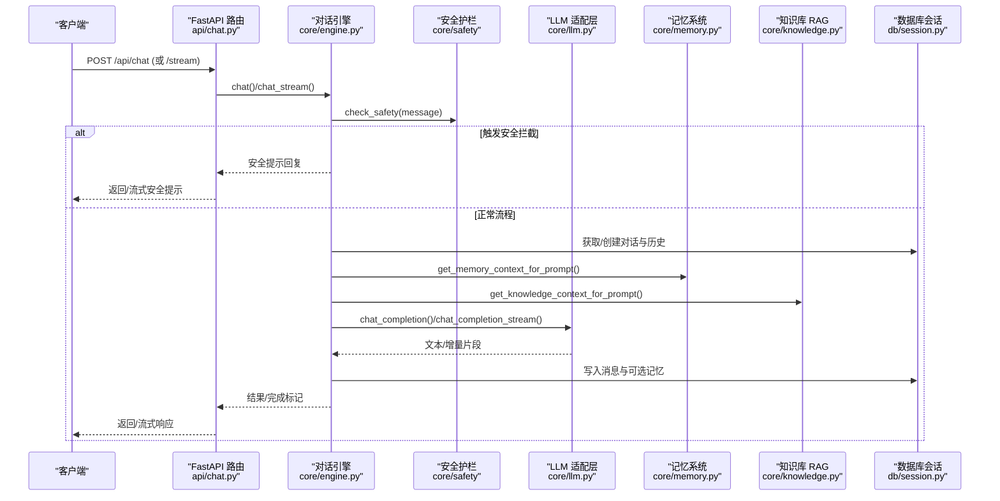

**图示来源** 
- [chat.py:58-104](file://hushai/meditation/api/chat.py#L58-L104)
- [engine.py:166-314](file://hushai/meditation/core/engine.py#L166-L314)
- [llm.py:136-258](file://hushai/meditation/core/llm.py#L136-L258)
- [memory.py:161-174](file://hushai/meditation/core/memory.py#L161-L174)
- [knowledge.py:216-225](file://hushai/meditation/core/knowledge.py#L216-L225)
- [session.py:57-68](file://hushai/meditation/db/session.py#L57-L68)

## 详细组件分析

### 应用装配与生命周期
- 使用 lifespan 钩子在启动时初始化日志、数据库、默认管理员、默认导师与全局预约配置；在关闭时释放数据库连接
- 注册限流中间件、CORS 中间件，挂载所有业务路由与静态资源
- 提供健康检查与健康探针

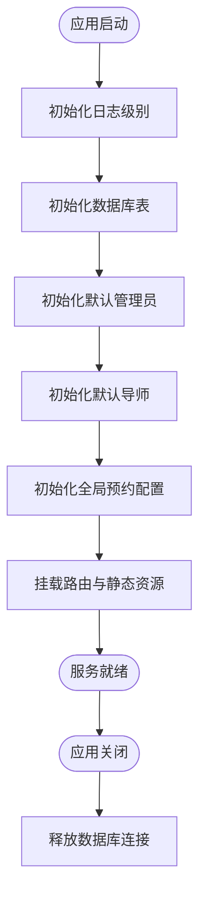

**图示来源** 
- [app.py:24-136](file://hushai/meditation/app.py#L24-L136)
- [app.py:139-210](file://hushai/meditation/app.py#L139-L210)

**章节来源**
- [app.py:24-136](file://hushai/meditation/app.py#L24-L136)
- [app.py:139-210](file://hushai/meditation/app.py#L139-L210)

### 配置中心
- 通过 dataclass 定义不可变配置项，支持从 .env 与操作系统环境变量加载
- 提供单例访问与测试重置方法，涵盖 LLM、嵌入、数据库、端口、CORS、微信支付、加密等

**章节来源**
- [config.py:18-136](file://hushai/meditation/config.py#L18-L136)

### 对话引擎（核心编排）
- 会话与消息：根据 conversation_id 复用或新建会话，限制历史轮数以控制上下文长度
- 上下文拼装：组合记忆摘要、知识库参考、技能上下文、场景提示与导师人设
- 安全护栏：在调用 LLM 前进行危机检测与敏感词过滤，必要时直接返回安全提示
- 记忆提取：按固定间隔触发，将结构化记忆存入数据库并写入向量索引
- 流式与非流式：统一封装，支持 SSE 流式输出与错误回退

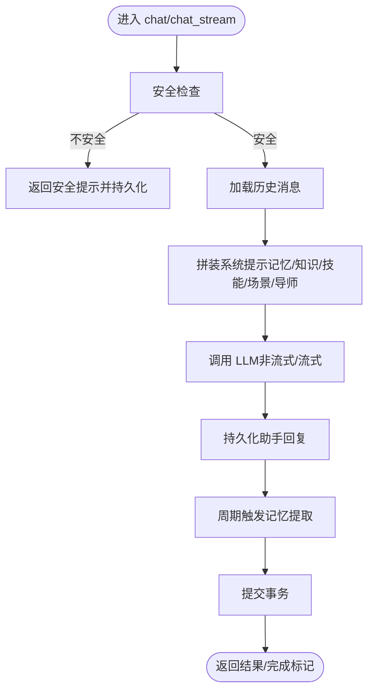

**图示来源** 
- [engine.py:166-314](file://hushai/meditation/core/engine.py#L166-L314)
- [engine.py:316-387](file://hushai/meditation/core/engine.py#L316-L387)

**章节来源**
- [engine.py:91-154](file://hushai/meditation/core/engine.py#L91-L154)
- [engine.py:166-314](file://hushai/meditation/core/engine.py#L166-L314)
- [engine.py:316-387](file://hushai/meditation/core/engine.py#L316-L387)

### LLM 适配层（多提供商与降级）
- 支持 OpenAI、DeepSeek、智谱、Kimi 等提供商，按优先级顺序尝试
- 非流式与流式均支持自动降级；调试模式下若无 Key 则走 Mock 分支
- 统一错误格式化与超时控制

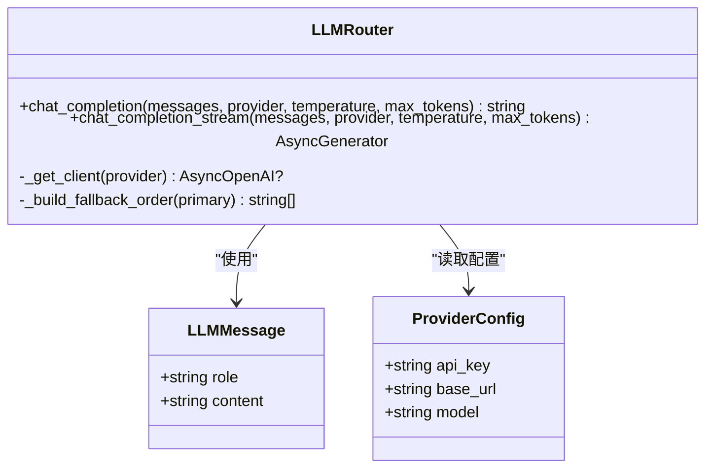

**图示来源** 
- [llm.py:53-91](file://hushai/meditation/core/llm.py#L53-L91)
- [llm.py:136-258](file://hushai/meditation/core/llm.py#L136-L258)

**章节来源**
- [llm.py:21-91](file://hushai/meditation/core/llm.py#L21-L91)
- [llm.py:136-258](file://hushai/meditation/core/llm.py#L136-L258)

### 记忆系统（提取、存储、检索）
- 提取：构造专用提示，要求 LLM 输出 JSON 数组，包含类别、内容、摘要与重要度
- 存储：批量写入数据库，并异步写入向量索引；失败不影响主流程
- 检索：按当前消息语义召回 Top-K 记忆，拼接为提示上下文
- 归档：对低重要度且长时间未更新的记忆进行归档

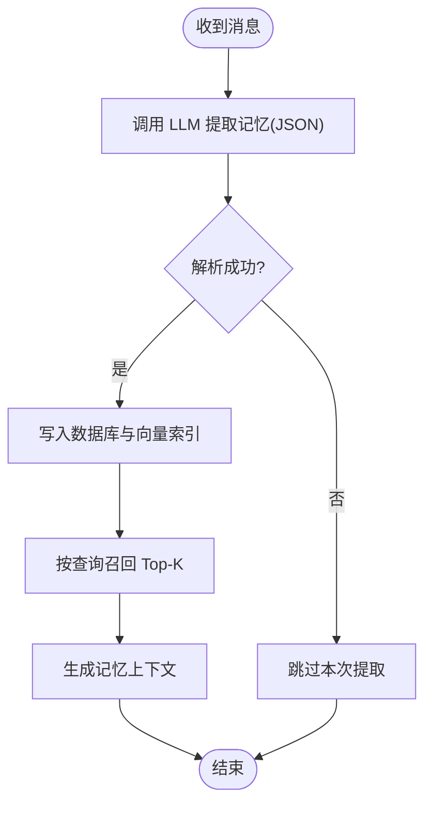

**图示来源** 
- [memory.py:45-113](file://hushai/meditation/core/memory.py#L45-L113)
- [memory.py:115-174](file://hushai/meditation/core/memory.py#L115-L174)
- [memory.py:189-206](file://hushai/meditation/core/memory.py#L189-L206)

**章节来源**
- [memory.py:45-113](file://hushai/meditation/core/memory.py#L45-L113)
- [memory.py:115-174](file://hushai/meditation/core/memory.py#L115-L174)
- [memory.py:189-206](file://hushai/meditation/core/memory.py#L189-L206)

### 知识库 RAG（导入与检索）
- 导入：支持 Markdown 与纯文本，解析 frontmatter 与标题，转纯文本后分段入库
- 分块：段落感知切分，设置重叠窗口提升召回质量
- 检索：向量相似度搜索，返回相关片段作为提示上下文

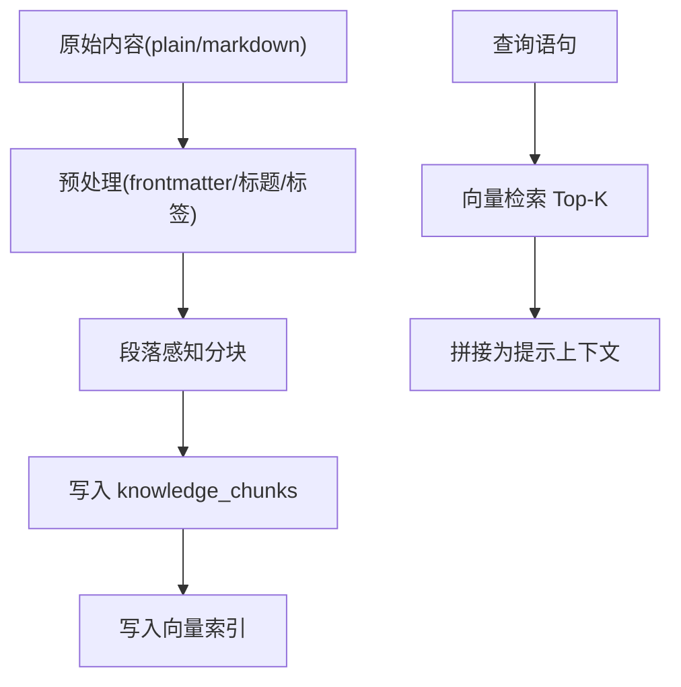

**图示来源** 
- [knowledge.py:76-171](file://hushai/meditation/core/knowledge.py#L76-L171)
- [knowledge.py:207-225](file://hushai/meditation/core/knowledge.py#L207-L225)

**章节来源**
- [knowledge.py:76-171](file://hushai/meditation/core/knowledge.py#L76-L171)
- [knowledge.py:207-225](file://hushai/meditation/core/knowledge.py#L207-L225)

### API 路由（鉴权、限流、SSE）
- 鉴权：从 Authorization 头提取 Bearer Token，校验用户身份
- 限流：基于 IP 的速率限制，防止滥用
- 流式：SSE 格式逐块推送，异常时以错误事件返回
- 列表与详情：对话列表、消息历史、场景列表等

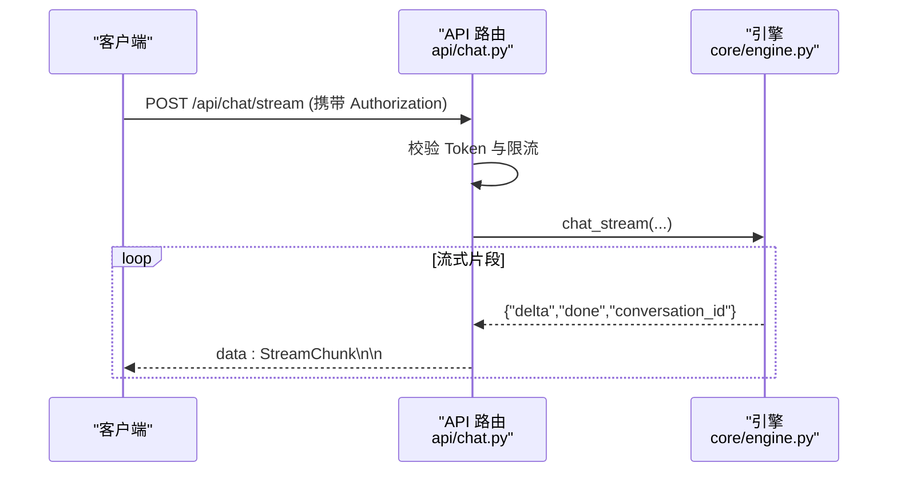

**图示来源** 
- [chat.py:80-104](file://hushai/meditation/api/chat.py#L80-L104)
- [engine.py:238-314](file://hushai/meditation/core/engine.py#L238-L314)

**章节来源**
- [chat.py:1-245](file://hushai/meditation/api/chat.py#L1-L245)

### 数据模型与会话
- 会话工厂：统一创建异步会话，支持 SQLite/PostgreSQL 自动适配
- 模型：用户、对话、消息、记忆、技能、场景、导师、管理员、审计日志、冥想会话、每日进度、咨询师、排班、预约、订单、服务记录、预约配置等
- 索引：针对高频查询字段建立索引以提升性能

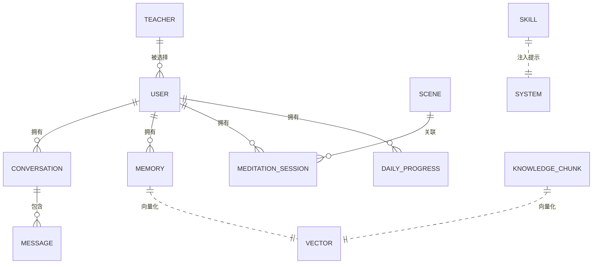

**图示来源** 
- [models.py:37-266](file://hushai/meditation/db/models.py#L37-L266)
- [models.py:268-442](file://hushai/meditation/db/models.py#L268-L442)
- [session.py:34-83](file://hushai/meditation/db/session.py#L34-L83)

**章节来源**
- [models.py:1-442](file://hushai/meditation/db/models.py#L1-L442)
- [session.py:34-83](file://hushai/meditation/db/session.py#L34-L83)

### 咨询服务（咨询师、排班、预约、订单、服务记录）
- 咨询师：入驻申请、审核状态、在线状态、评分与课时费
- 排班：按日期与时段划分可预约时段，支持最大预约数与时长
- 预约：用户选择时段发起预约，支持取消与状态流转
- 订单：单次或套餐类型，支持微信支付回调与退款
- 服务记录：记录服务过程与备注，敏感字段加密存储
- 配置：全局或咨询师级别的预约规则

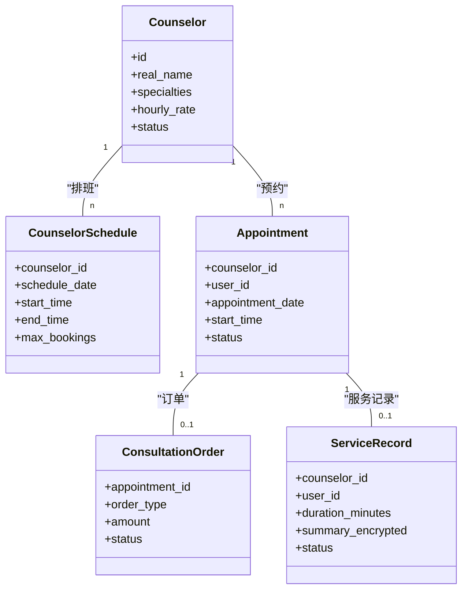

**图示来源** 
- [models.py:273-442](file://hushai/meditation/db/models.py#L273-L442)
- [schemas.py:267-540](file://hushai/meditation/schemas.py#L267-L540)

**章节来源**
- [models.py:268-442](file://hushai/meditation/db/models.py#L268-L442)
- [schemas.py:267-540](file://hushai/meditation/schemas.py#L267-L540)

## 依赖关系分析
- 应用装配依赖配置中心与会话管理
- 路由层依赖引擎与鉴权中间件
- 引擎依赖 LLM、记忆、知识、安全、场景与技能模块
- 记忆与知识模块依赖向量检索接口
- 数据层依赖数据库引擎与会话工厂

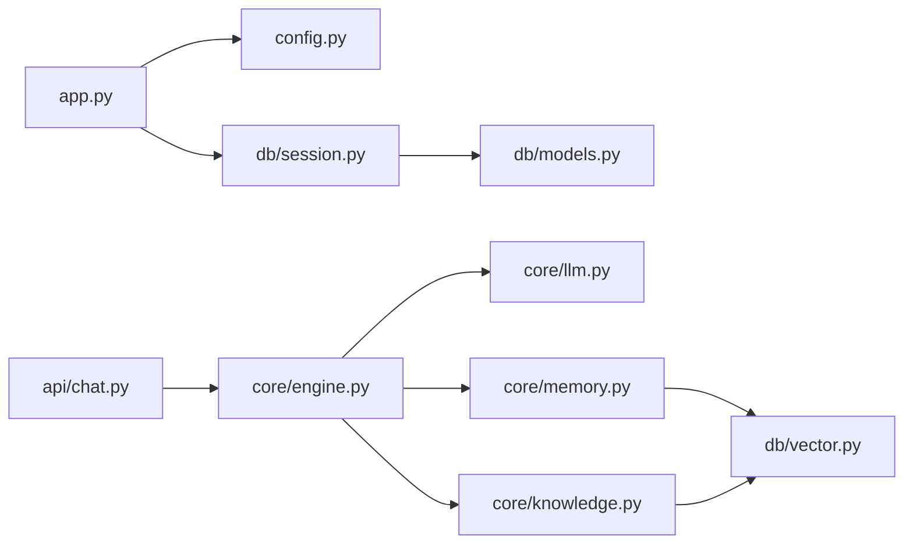

**图示来源** 
- [app.py:139-210](file://hushai/meditation/app.py#L139-L210)
- [chat.py:1-245](file://hushai/meditation/api/chat.py#L1-L245)
- [engine.py:1-387](file://hushai/meditation/core/engine.py#L1-L387)
- [llm.py:1-258](file://hushai/meditation/core/llm.py#L1-L258)
- [memory.py:1-206](file://hushai/meditation/core/memory.py#L1-L206)
- [knowledge.py:1-225](file://hushai/meditation/core/knowledge.py#L1-L225)
- [session.py:34-83](file://hushai/meditation/db/session.py#L34-L83)
- [models.py:1-442](file://hushai/meditation/db/models.py#L1-L442)

**章节来源**
- [app.py:139-210](file://hushai/meditation/app.py#L139-L210)
- [chat.py:1-245](file://hushai/meditation/api/chat.py#L1-L245)
- [engine.py:1-387](file://hushai/meditation/core/engine.py#L1-L387)

## 性能考量
- 上下文长度控制：通过配置限制历史轮数，避免过长上下文导致延迟与成本上升
- 记忆与知识检索：Top-K 可调，建议在生产环境调优以减少无关信息干扰
- 向量索引：确保 embedding 提供商稳定与缓存命中，降低重复计算
- 数据库索引：对高频查询字段建立复合索引，如用户+日期、咨询师+日期+时间
- 流式输出：SSE 可降低首字节延迟，提升用户体验
- 降级策略：多 LLM 提供商自动切换，提高可用性

[本节为通用指导，不直接分析具体文件]

## 故障排查指南
- 启动失败
  - 检查数据库 URL 与驱动适配（SQLite/PostgreSQL）
  - 确认 .env 中必要密钥已配置（JWT、LLM、嵌入等）
- 鉴权失败
  - 确认 Authorization 头格式正确（Bearer Token）
  - 检查 refresh_token 哈希与选择器是否匹配
- LLM 调用失败
  - 查看降级日志，确认各提供商 Key 与网络连通性
  - 调试模式无 Key 会走 Mock，生产环境需配置真实 Key
- 记忆/知识检索为空
  - 检查向量索引写入是否成功
  - 调整 Top-K 与分块大小
- 预约冲突
  - 检查排班唯一约束与并发写入保护
  - 核对预约配置的最小提前时间与最大预约数

**章节来源**
- [session.py:15-31](file://hushai/meditation/db/session.py#L15-L31)
- [llm.py:59-91](file://hushai/meditation/core/llm.py#L59-L91)
- [memory.py:102-113](file://hushai/meditation/core/memory.py#L102-L113)
- [knowledge.py:137-171](file://hushai/meditation/core/knowledge.py#L137-L171)
- [models.py:305-331](file://hushai/meditation/db/models.py#L305-L331)

## 结论
本系统以模块化与可扩展为核心设计目标，通过清晰的层次划分与统一配置中心，实现了对话、记忆、知识与技能的有机整合，并在咨询服务领域提供了完整的业务流程支撑。多 LLM 提供商与自动降级策略提升了系统的鲁棒性与可用性；SSE 流式输出与完善的鉴权、限流机制保障了用户体验与安全性。后续可在向量检索优化、并发控制与监控告警方面持续改进。

[本节为总结性内容，不直接分析具体文件]

## 附录
- 快速启动与部署请参考 README 中的说明
- 管理后台与 API 文档可通过运行服务后访问相应路径

**章节来源**
- [README.md:244-286](file://README.md#L244-L286)