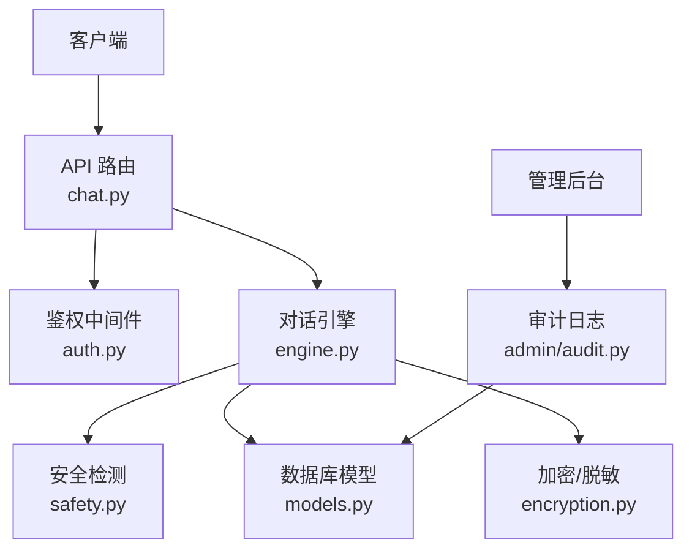
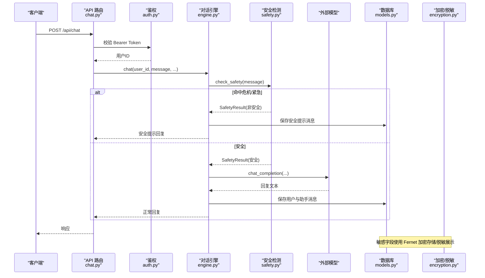
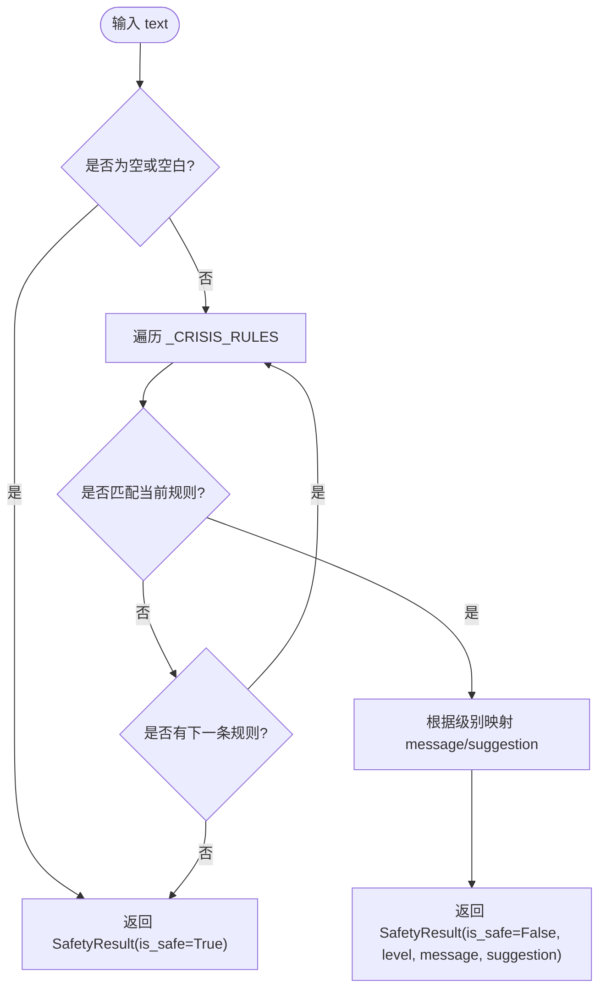
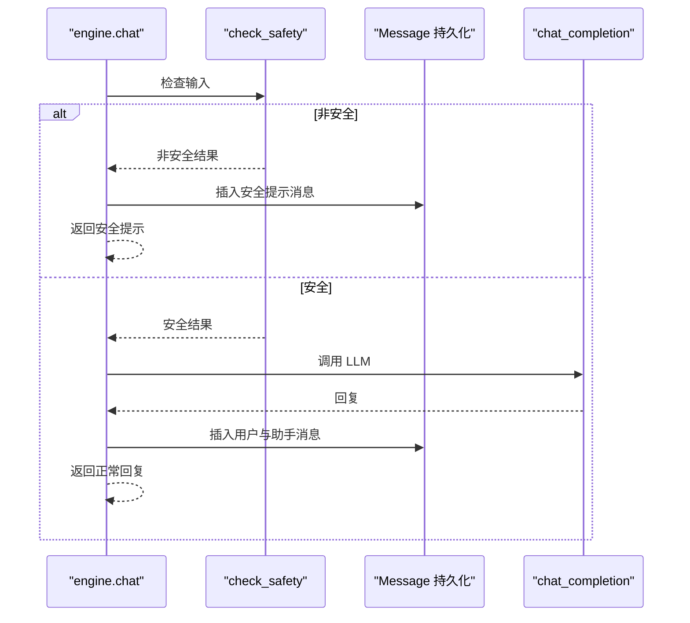
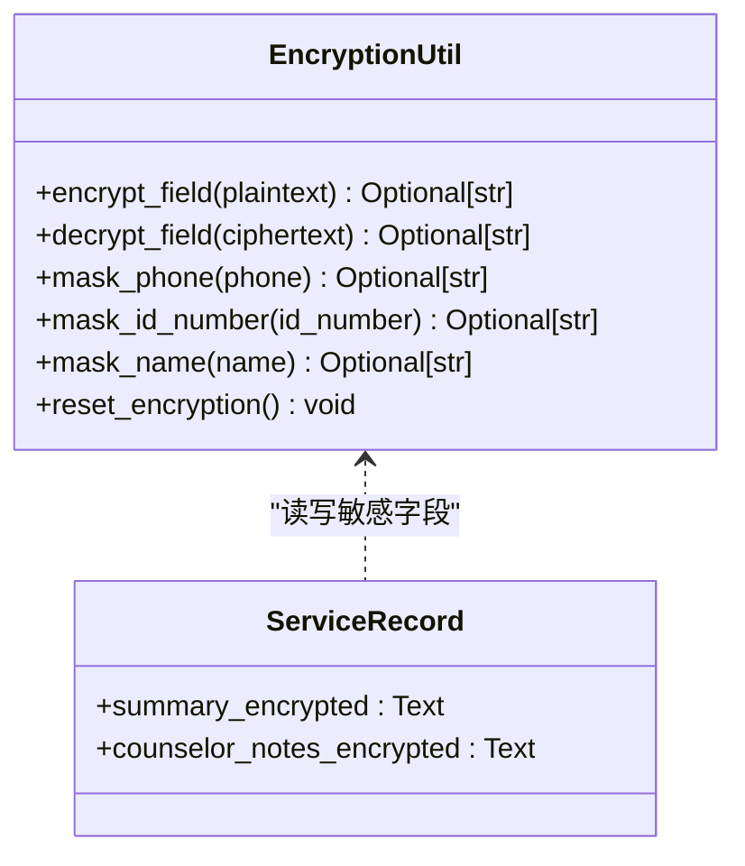
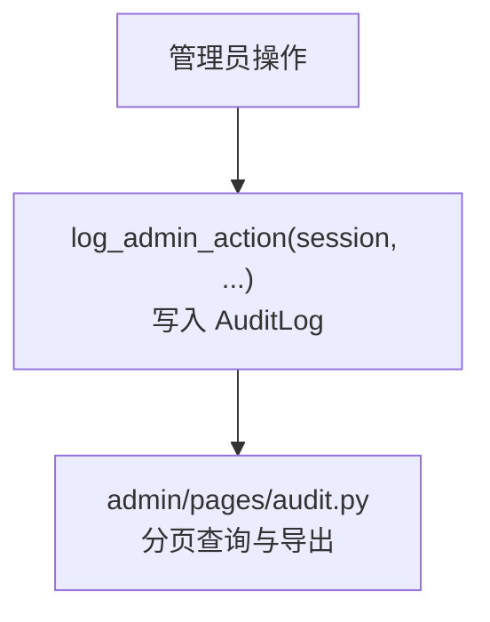
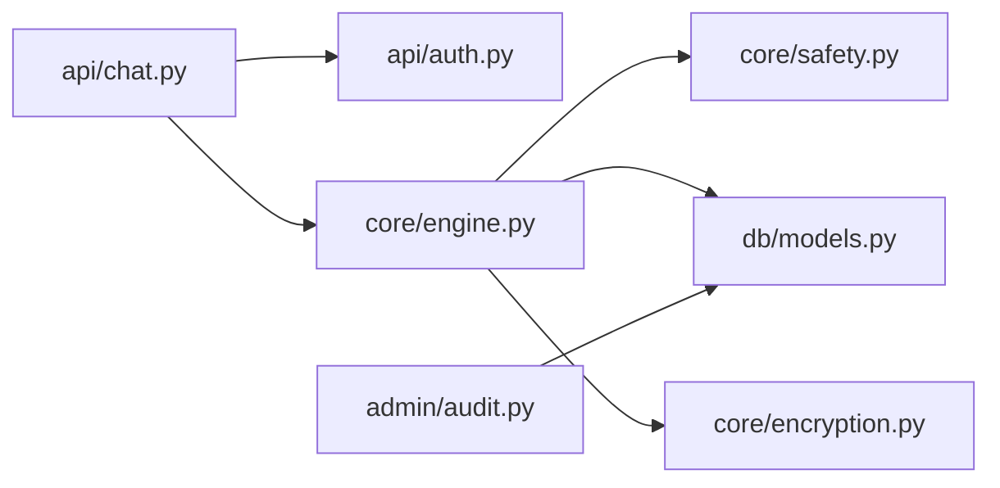

# 安全过滤系统

<cite>
**本文引用的文件**
- [hushai/meditation/core/safety.py](file://hushai/meditation/core/safety.py)
- [hushai/meditation/core/engine.py](file://hushai/meditation/core/engine.py)
- [hushai/meditation/api/chat.py](file://hushai/meditation/api/chat.py)
- [hushai/meditation/api/auth.py](file://hushai/meditation/api/auth.py)
- [hushai/meditation/db/models.py](file://hushai/meditation/db/models.py)
- [hushai/meditation/core/encryption.py](file://hushai/meditation/core/encryption.py)
- [hushai/meditation/admin/audit.py](file://hushai/meditation/admin/audit.py)
- [hushai/meditation/admin/pages/audit.py](file://hushai/meditation/admin/pages/audit.py)
- [tests/meditation/test_safety.py](file://tests/meditation/test_safety.py)
- [tests/meditation/test_engine_safety.py](file://tests/meditation/test_engine_safety.py)
</cite>

## 目录
1. [简介](#简介)
2. [项目结构](#项目结构)
3. [核心组件](#核心组件)
4. [架构总览](#架构总览)
5. [详细组件分析](#详细组件分析)
6. [依赖关系分析](#依赖关系分析)
7. [性能考量与优化](#性能考量与优化)
8. [故障排查指南](#故障排查指南)
9. [结论](#结论)
10. [附录：扩展安全规则与自定义策略](#附录扩展安全规则与自定义策略)

## 简介
本技术文档聚焦 hush.ai 的安全过滤系统，围绕多层安全防护机制展开，包括：
- 敏感词检测与危机信号识别（关键词正则、级别判定）
- 内容审核流程（输入验证、输出过滤、异常处理）
- 加密存储与隐私保护（Fernet 对称加密、PII 脱敏）
- 危机干预机制（自伤/自杀倾向、伤害他人预警、紧急提示）
- 安全审计与日志记录（管理员操作审计）
- 合规性与可观测性（限流、鉴权、审计导出）
- 性能影响分析与优化建议

该体系以“快速阻断层”为核心，在调用外部大模型之前对输入进行安全检查，确保高危内容不进入 LLM；同时通过加密与脱敏保障敏感数据在存储与展示时的安全性。

## 项目结构
与安全相关的关键模块分布如下：
- 安全检测与格式化：core/safety.py
- 对话引擎集成点：core/engine.py
- API 路由与鉴权：api/chat.py、api/auth.py
- 数据库模型（含审计日志与服务记录字段）：db/models.py
- 加密与脱敏工具：core/encryption.py
- 审计日志写入与页面展示：admin/audit.py、admin/pages/audit.py
- 单元测试覆盖：tests/meditation/test_safety.py、tests/meditation/test_engine_safety.py



图表来源
- [hushai/meditation/api/chat.py:1-245](file://hushai/meditation/api/chat.py#L1-L245)
- [hushai/meditation/api/auth.py:1-171](file://hushai/meditation/api/auth.py#L1-L171)
- [hushai/meditation/core/engine.py:1-387](file://hushai/meditation/core/engine.py#L1-L387)
- [hushai/meditation/core/safety.py:1-111](file://hushai/meditation/core/safety.py#L1-L111)
- [hushai/meditation/db/models.py:1-434](file://hushai/meditation/db/models.py#L1-L434)
- [hushai/meditation/core/encryption.py:1-78](file://hushai/meditation/core/encryption.py#L1-L78)
- [hushai/meditation/admin/audit.py:1-31](file://hushai/meditation/admin/audit.py#L1-L31)

章节来源
- [hushai/meditation/api/chat.py:1-245](file://hushai/meditation/api/chat.py#L1-L245)
- [hushai/meditation/core/engine.py:1-387](file://hushai/meditation/core/engine.py#L1-L387)
- [hushai/meditation/core/safety.py:1-111](file://hushai/meditation/core/safety.py#L1-L111)
- [hushai/meditation/db/models.py:1-434](file://hushai/meditation/db/models.py#L1-L434)
- [hushai/meditation/core/encryption.py:1-78](file://hushai/meditation/core/encryption.py#L1-L78)
- [hushai/meditation/admin/audit.py:1-31](file://hushai/meditation/admin/audit.py#L1-L31)

## 核心组件
- 安全检测模块（safety.py）
  - 提供 check_safety(text) 函数，基于预编译的正则规则匹配，返回 SafetyResult（包含 is_safe、level、message、suggestion）。
  - 支持两级别：crisis（自伤/自杀倾向）、emergency（伤害他人/报复社会），并附带面向用户的提示与建议信息。
  - format_safety_message(result, original_reply) 用于将安全提示附加到回复中或单独返回。
- 对话引擎（engine.py）
  - chat() 与 chat_stream() 在进入 LLM 前调用 check_safety()，若命中则直接返回安全提示，不调用外部模型。
  - 正常路径下组装上下文、调用 LLM、持久化消息、周期性记忆提取与会话标题补全。
- API 路由（api/chat.py）
  - 暴露 /api/chat、/api/chat/stream、/api/chat/knowledge 等接口，统一鉴权与限流，转发至 engine。
- 鉴权（api/auth.py）
  - 微信 OAuth 登录、JWT access token 签发与校验、refresh token 轮换与 O(1) 定位用户。
- 加密与脱敏（core/encryption.py）
  - Fernet 对称加密用于敏感字段（如咨询摘要、咨询师备注）的存储与读取。
  - PII 脱敏：手机号、身份证号、姓名等。
- 审计日志（admin/audit.py、admin/pages/audit.py）
  - 记录管理员关键操作，提供分页查询与导出能力。

章节来源
- [hushai/meditation/core/safety.py:1-111](file://hushai/meditation/core/safety.py#L1-L111)
- [hushai/meditation/core/engine.py:166-314](file://hushai/meditation/core/engine.py#L166-L314)
- [hushai/meditation/api/chat.py:58-127](file://hushai/meditation/api/chat.py#L58-L127)
- [hushai/meditation/api/auth.py:63-164](file://hushai/meditation/api/auth.py#L63-L164)
- [hushai/meditation/core/encryption.py:1-78](file://hushai/meditation/core/encryption.py#L1-L78)
- [hushai/meditation/admin/audit.py:1-31](file://hushai/meditation/admin/audit.py#L1-L31)
- [hushai/meditation/admin/pages/audit.py:43-71](file://hushai/meditation/admin/pages/audit.py#L43-L71)

## 架构总览
下图展示了从请求进入到安全拦截、LLM 调用与结果返回的整体流程，以及审计与加密的集成点。



图表来源
- [hushai/meditation/api/chat.py:58-127](file://hushai/meditation/api/chat.py#L58-L127)
- [hushai/meditation/api/auth.py:109-131](file://hushai/meditation/api/auth.py#L109-L131)
- [hushai/meditation/core/engine.py:166-236](file://hushai/meditation/core/engine.py#L166-L236)
- [hushai/meditation/core/safety.py:83-111](file://hushai/meditation/core/safety.py#L83-L111)
- [hushai/meditation/db/models.py:85-96](file://hushai/meditation/db/models.py#L85-L96)
- [hushai/meditation/core/encryption.py:31-48](file://hushai/meditation/core/encryption.py#L31-L48)

## 详细组件分析

### 安全检测与危机信号识别（safety.py）
- 设计要点
  - 规则集合为 (Pattern, level) 元组列表，级别与模式在编译期绑定，避免二次判级导致的不一致。
  - 优先级：更具体的“伤害他人”规则置于“自伤/自杀”之前，确保 emergency 优先于 crisis。
  - 空输入短路返回安全结果，避免误判。
  - 面向用户的文案集中管理，便于维护与本地化。
- 数据结构
  - SafetyResult：is_safe、level、message、suggestion。
- 算法复杂度
  - 单次检查时间复杂度 O(R·N)，R 为规则数，N 为文本长度；由于规则数量较小且正则预编译，实际开销极低。
- 错误处理
  - 未命中任何规则时返回安全结果；无异常抛出，保证上层稳定。



图表来源
- [hushai/meditation/core/safety.py:22-40](file://hushai/meditation/core/safety.py#L22-L40)
- [hushai/meditation/core/safety.py:83-102](file://hushai/meditation/core/safety.py#L83-L102)

章节来源
- [hushai/meditation/core/safety.py:1-111](file://hushai/meditation/core/safety.py#L1-L111)
- [tests/meditation/test_safety.py:20-82](file://tests/meditation/test_safety.py#L20-L82)

### 对话引擎中的安全检查集成（engine.py）
- 关键流程
  - chat() 与 chat_stream() 在进入 LLM 前调用 check_safety()。
  - 若检测到危机/紧急，直接生成安全提示并持久化，跳过 LLM 调用与记忆提取。
  - 正常路径下构建 system prompt、历史消息、知识/技能/场景上下文，调用 LLM 并持久化。
- 异常处理
  - 会话事务失败时回滚，避免不一致状态。
- 测试覆盖
  - 断言危机输入不会触发 LLM 调用，且返回包含热线信息的提示。



图表来源
- [hushai/meditation/core/engine.py:166-236](file://hushai/meditation/core/engine.py#L166-L236)
- [tests/meditation/test_engine_safety.py:57-76](file://tests/meditation/test_engine_safety.py#L57-L76)

章节来源
- [hushai/meditation/core/engine.py:166-314](file://hushai/meditation/core/engine.py#L166-L314)
- [tests/meditation/test_engine_safety.py:57-84](file://tests/meditation/test_engine_safety.py#L57-L84)

### API 路由与鉴权（api/chat.py、api/auth.py）
- 鉴权
  - 通过 Header Authorization 解析 Bearer Token，校验 JWT 类型与有效期，获取 user_id。
  - refresh token 采用 selector + bcrypt 哈希双重校验，避免 DoS 风险。
- 限流
  - 路由装饰器限制每分钟请求次数，降低滥用风险。
- 路由
  - /api/chat、/api/chat/stream、/api/chat/knowledge 分别对应同步、流式与知识库问答。

```mermaid
classDiagram
class ChatRouter {
+POST "/"
+POST "/stream"
+POST "/knowledge"
+GET "/scenes"
+GET "/conversations"
+GET "/conversations/{id}/messages"
}
class AuthMiddleware {
+verify_token(token) dict
+get_current_user_id(token, session) str
+refresh_access_token(refresh_token, session) dict
}
ChatRouter --> AuthMiddleware : "依赖"
```

图表来源
- [hushai/meditation/api/chat.py:58-127](file://hushai/meditation/api/chat.py#L58-L127)
- [hushai/meditation/api/auth.py:109-164](file://hushai/meditation/api/auth.py#L109-L164)

章节来源
- [hushai/meditation/api/chat.py:1-245](file://hushai/meditation/api/chat.py#L1-L245)
- [hushai/meditation/api/auth.py:1-171](file://hushai/meditation/api/auth.py#L1-L171)

### 加密存储与隐私保护（core/encryption.py、db/models.py）
- 加密实现
  - 使用 Fernet 对称加密，密钥从环境变量加载，懒初始化实例。
  - encrypt_field/decrypt_field 对敏感字段进行加解密，空值原样返回，解密失败回退密文。
- PII 脱敏
  - mask_phone/mask_id_number/mask_name 提供常见个人信息脱敏。
- 数据模型
  - ServiceRecord 的 summary/counselor_notes 字段为加密存储列名，保障咨询记录敏感信息。



图表来源
- [hushai/meditation/core/encryption.py:18-78](file://hushai/meditation/core/encryption.py#L18-L78)
- [hushai/meditation/db/models.py:386-411](file://hushai/meditation/db/models.py#L386-L411)

章节来源
- [hushai/meditation/core/encryption.py:1-78](file://hushai/meditation/core/encryption.py#L1-L78)
- [hushai/meditation/db/models.py:386-411](file://hushai/meditation/db/models.py#L386-L411)

### 安全审计与日志记录（admin/audit.py、admin/pages/audit.py）
- 审计写入
  - log_admin_action 记录管理员用户名、动作、资源类型、资源 ID、详情、IP、UA 等。
- 审计查看
  - 分页查询、按用户名/动作筛选、导出 CSV/Excel。
- 合规性
  - 审计日志保留管理员行为轨迹，满足内部合规与外部审计需求。



图表来源
- [hushai/meditation/admin/audit.py:10-31](file://hushai/meditation/admin/audit.py#L10-L31)
- [hushai/meditation/admin/pages/audit.py:43-71](file://hushai/meditation/admin/pages/audit.py#L43-L71)

章节来源
- [hushai/meditation/admin/audit.py:1-31](file://hushai/meditation/admin/audit.py#L1-L31)
- [hushai/meditation/admin/pages/audit.py:43-71](file://hushai/meditation/admin/pages/audit.py#L43-L71)

## 依赖关系分析
- 组件耦合
  - API 路由依赖鉴权与引擎；引擎依赖安全检测、数据库与 LLM；加密工具被服务记录读写使用；审计模块独立但依赖数据库模型。
- 外部依赖
  - 鉴权依赖 JWT 库与微信 OAuth；加密依赖 cryptography；数据库依赖 SQLAlchemy。
- 循环依赖
  - 未发现循环导入；各模块职责清晰。



图表来源
- [hushai/meditation/api/chat.py:1-245](file://hushai/meditation/api/chat.py#L1-L245)
- [hushai/meditation/api/auth.py:1-171](file://hushai/meditation/api/auth.py#L1-L171)
- [hushai/meditation/core/engine.py:1-387](file://hushai/meditation/core/engine.py#L1-L387)
- [hushai/meditation/core/safety.py:1-111](file://hushai/meditation/core/safety.py#L1-L111)
- [hushai/meditation/db/models.py:1-434](file://hushai/meditation/db/models.py#L1-L434)
- [hushai/meditation/core/encryption.py:1-78](file://hushai/meditation/core/encryption.py#L1-L78)
- [hushai/meditation/admin/audit.py:1-31](file://hushai/meditation/admin/audit.py#L1-L31)

章节来源
- [hushai/meditation/api/chat.py:1-245](file://hushai/meditation/api/chat.py#L1-L245)
- [hushai/meditation/core/engine.py:1-387](file://hushai/meditation/core/engine.py#L1-L387)
- [hushai/meditation/core/safety.py:1-111](file://hushai/meditation/core/safety.py#L1-L111)
- [hushai/meditation/db/models.py:1-434](file://hushai/meditation/db/models.py#L1-L434)
- [hushai/meditation/core/encryption.py:1-78](file://hushai/meditation/core/encryption.py#L1-L78)
- [hushai/meditation/admin/audit.py:1-31](file://hushai/meditation/admin/audit.py#L1-L31)

## 性能考量与优化
- 正则预编译
  - 规则在模块导入时一次性编译，避免每次调用重复编译带来的开销。
- 规则顺序与短路
  - 命中即返回，减少后续规则扫描；优先级确保紧急级别优先。
- 空输入短路
  - 空或空白输入直接返回安全结果，避免不必要的正则匹配。
- 流式输出
  - 流式模式下，安全提示逐字符推送，提升用户体验；LLM 流式返回同样分块处理。
- 建议优化
  - 引入规则版本管理与灰度发布，动态更新规则而不重启服务。
  - 对高频命中规则建立缓存索引（如前缀树），进一步降低匹配成本。
  - 增加指标埋点（命中率、级别分布、延迟），持续监控效果。

[本节为通用性能讨论，无需特定文件引用]

## 故障排查指南
- 常见问题
  - 鉴权失败：检查 JWT 签名、过期时间与类型声明；确认用户状态为激活。
  - 安全提示未出现：确认 engine 在 LLM 调用前执行 check_safety；检查规则是否命中。
  - 加密失败：检查 MEDITATION_ENCRYPTION_KEY 配置；解密失败会回退密文，需核对字段来源。
  - 审计日志缺失：确认 admin 操作触发了 log_admin_action；检查数据库连接与权限。
- 定位方法
  - 查看单元测试用例，对照断言预期行为。
  - 启用调试日志，关注 engine 与 safety 的调用链。
  - 审计页面筛选与导出，追踪管理员操作轨迹。

章节来源
- [tests/meditation/test_engine_safety.py:57-76](file://tests/meditation/test_engine_safety.py#L57-L76)
- [tests/meditation/test_safety.py:84-101](file://tests/meditation/test_safety.py#L84-L101)
- [hushai/meditation/core/encryption.py:39-48](file://hushai/meditation/core/encryption.py#L39-L48)
- [hushai/meditation/admin/pages/audit.py:43-71](file://hushai/meditation/admin/pages/audit.py#L43-L71)

## 结论
hush.ai 的安全过滤系统以“快速阻断层”为核心，在调用外部模型前完成输入安全检查，结合分级提示与热线引导，有效降低危机内容的传播风险。通过 Fernet 加密与 PII 脱敏，保障敏感数据在存储与展示时的安全性；配合鉴权、限流与审计日志，形成较为完整的安全闭环。未来可在规则动态化、性能优化与可观测性方面持续演进。

[本节为总结性内容，无需特定文件引用]

## 附录：扩展安全规则与自定义策略
- 扩展规则
  - 在 _CRISIS_RULES 中添加新的 (Pattern, level) 元组，注意将更具体的规则前置以保证优先级。
  - 为新级别添加 _LEVEL_MESSAGES 映射，定义 message 与 suggestion。
- 自定义过滤策略
  - 在 engine.chat()/chat_stream() 中接入额外的过滤器（如敏感词白名单、上下文语义评分），在 check_safety 之后、LLM 调用之前执行。
  - 对输出进行后处理（format_safety_message），追加平台特定的合规提示。
- 示例参考（代码片段路径）
  - 新增规则位置：[hushai/meditation/core/safety.py:22-39](file://hushai/meditation/core/safety.py#L22-L39)
  - 级别消息映射位置：[hushai/meditation/core/safety.py:70-80](file://hushai/meditation/core/safety.py#L70-L80)
  - 引擎集成点（安全拦截）：[hushai/meditation/core/engine.py:182-196](file://hushai/meditation/core/engine.py#L182-L196)
  - 流式安全提示输出：[hushai/meditation/core/engine.py:255-274](file://hushai/meditation/core/engine.py#L255-L274)
  - 审计日志写入：[hushai/meditation/admin/audit.py:10-31](file://hushai/meditation/admin/audit.py#L10-L31)
  - 加密字段读写：[hushai/meditation/core/encryption.py:31-48](file://hushai/meditation/core/encryption.py#L31-L48)

章节来源
- [hushai/meditation/core/safety.py:22-80](file://hushai/meditation/core/safety.py#L22-L80)
- [hushai/meditation/core/engine.py:182-274](file://hushai/meditation/core/engine.py#L182-L274)
- [hushai/meditation/admin/audit.py:10-31](file://hushai/meditation/admin/audit.py#L10-L31)
- [hushai/meditation/core/encryption.py:31-48](file://hushai/meditation/core/encryption.py#L31-L48)